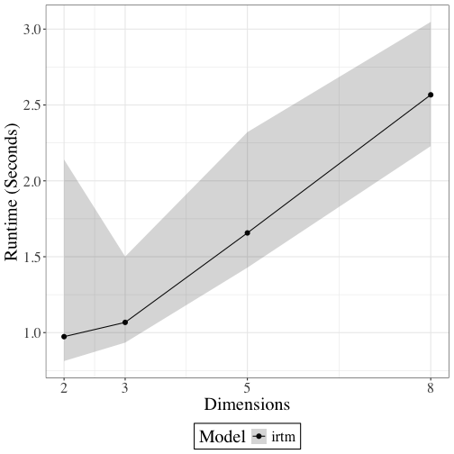
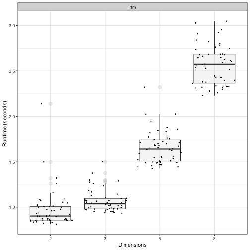
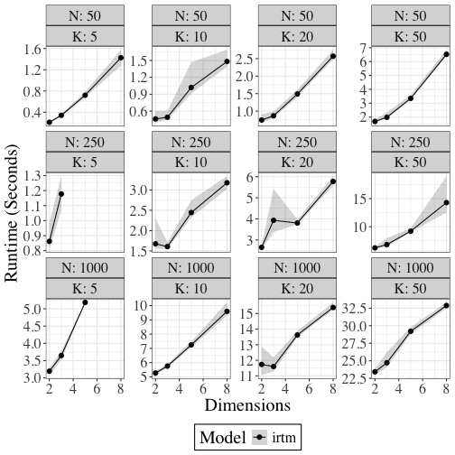

This script to produce a central runtime file. 
These simulations present IRT-M speed and error across
a range of configurations. 
These sims no longer benchmarks against blavaan.
Last updated: 2025-08-08 07:27:20.268076


# Simulations:
Run baseline simulations
50 reps each of:
N = 100, K = 10, lambda sparsity = 0.75
d = c(2, 4, 6, 8)


``` r
## Just IRT-M:
source("code/irtm_N100_K10.R", echo = TRUE)
```

```
## 
## > ## This is just IRT-M with a single specification for the 
## > ## N (100) and K (10) and d = 2, 4, 6, 8
## > ## It does 50 iterations of each pair, with  .... [TRUNCATED] 
## 
## > library(mvtnorm)
## 
## > library(coda)
## 
## > library(nimble)
```

```
## nimble version 1.2.1 is loaded.
## For more information on NIMBLE and a User Manual,
## please visit https://R-nimble.org.
## 
## Note for advanced users who have written their own MCMC samplers:
##   As of version 0.13.0, NIMBLE's protocol for handling posterior
##   predictive nodes has changed in a way that could affect user-defined
##   samplers in some situations. Please see Section 15.5.1 of the User Manual.
```

```
## 
## Attaching package: 'nimble'
```

```
## The following object is masked from 'package:mvtnorm':
## 
##     logdet
```

```
## The following object is masked from 'package:stats':
## 
##     simulate
```

```
## The following object is masked from 'package:base':
## 
##     declare
```

```
## 
## > library(IRTM)
```

```
## Loading required package: truncnorm
```

```
## Loading required package: tmvtnorm
```

```
## Loading required package: Matrix
```

```
## Loading required package: stats4
```

```
## Loading required package: gmm
```

```
## Loading required package: sandwich
```

```
## Loading required package: RcppProgress
```

```
## Loading required package: RcppDist
```

```
## Loading required package: ggplot2
```

```
## Need help? Try Stackoverflow: https://stackoverflow.com/tags/ggplot2
```

```
## 
## > # Source custom helper functions
## > source('code/helpers.R') ## mse, custom plots
## 
## > source('code/irtm_sims_gen_data.R') ## script to generate data
## 
## > source('code/irtm_bsem_results_to_df.R') ## script to format list of results as single df
## 
## > ## Data prep
## > 
## > # Load simulation parameters
## > NKd_vals <- readRDS('simulations/params.rds')
## 
## > ##list of smaller models
## > ## with 100 observations and 10 features
## > 
## > lambda_zero_pct <- 0.75 ## 75% 0 runs CFA and SEM! 
## 
## > ## 50% lambda zero does not, though does run for IRTM
## > 
## > small_sim <- NKd_vals[which(NKd_vals$Var1==100 & # n-items
## +                              .... [TRUNCATED] 
## 
## > ## var4 is a unique identifier that serves as a seed
## > 
## > small_sim$Var4 <- 1:nrow(small_sim)
## 
## > set.seed(1029)
## 
## > ### save small_sim for analysis:
## > sname = paste0("simulations/irtm_small_sim_params", ".rds")
## 
## > save(small_sim, file=sname)
## 
## > ## Simulations:
## > 
## > all_results = list()
## 
## > model_times = list()
## 
## > ## marker to see which chain is running (if more than one)
## > 
## > chain = 1
## 
## > #for(i in 1:nrow(s2)){ ## open for loop
## > for(i in 1:nrow(small_sim)){ ## open for loop
## +   print(paste0("Start pass ", i, ":"))
## +   pass_start <- S .... [TRUNCATED] 
## [1] "Start pass 1:"
## [1] "round"
## [1] "Running IRT-M"
```

```
## Sampling...
```

```
## [1] "Running BCFA and BSEM"
## [1] "Pass took 1.1233seconds"
## [1] "Start pass 2:"
## [1] "round"
## [1] "Running IRT-M"
```

```
## Sampling...
```

```
## [1] "Running BCFA and BSEM"
## [1] "Pass took 1.1515seconds"
## [1] "Start pass 3:"
## [1] "round"
## [1] "Running IRT-M"
```

```
## Sampling...
```

```
## [1] "Running BCFA and BSEM"
## [1] "Pass took 0.9766seconds"
## [1] "Start pass 4:"
## [1] "round"
## [1] "Running IRT-M"
```

```
## Sampling...
```

```
## [1] "Running BCFA and BSEM"
## [1] "Pass took 0.9196seconds"
## [1] "Start pass 5:"
## [1] "round"
## [1] "Running IRT-M"
```

```
## Sampling...
```

```
## [1] "Running BCFA and BSEM"
## [1] "Pass took 1.7747seconds"
## [1] "Start pass 6:"
## [1] "round"
## [1] "Running IRT-M"
```

```
## Sampling...
```

```
## [1] "Running BCFA and BSEM"
## [1] "Pass took 1.1098seconds"
## [1] "Start pass 7:"
## [1] "round"
## [1] "Running IRT-M"
```

```
## Sampling...
```

```
## [1] "Running BCFA and BSEM"
## [1] "Pass took 2.9191seconds"
## [1] "Start pass 8:"
## [1] "round"
## [1] "Running IRT-M"
```

```
## Sampling...
```

```
## [1] "Running BCFA and BSEM"
## [1] "Pass took 1.6017seconds"
## [1] "Start pass 9:"
## [1] "round"
## [1] "Running IRT-M"
```

```
## Sampling...
```

```
## [1] "Running BCFA and BSEM"
## [1] "Pass took 1.5634seconds"
## [1] "Start pass 10:"
## [1] "round"
## [1] "Running IRT-M"
```

```
## Sampling...
```

```
## [1] "Running BCFA and BSEM"
## [1] "Pass took 1.6407seconds"
## [1] "Start pass 11:"
## [1] "round"
## [1] "Running IRT-M"
```

```
## Sampling...
```

```
## [1] "Running BCFA and BSEM"
## [1] "Pass took 1.5647seconds"
## [1] "Start pass 12:"
## [1] "round"
## [1] "Running IRT-M"
```

```
## Sampling...
```

```
## [1] "Running BCFA and BSEM"
## [1] "Pass took 3.6985seconds"
## [1] "Start pass 13:"
## [1] "round"
## [1] "Running IRT-M"
```

```
## Sampling...
```

```
## [1] "Running BCFA and BSEM"
## [1] "Pass took 1.0822seconds"
## [1] "Start pass 14:"
## [1] "round"
## [1] "Running IRT-M"
```

```
## Sampling...
```

```
## [1] "Running BCFA and BSEM"
## [1] "Pass took 1.5386seconds"
## [1] "Start pass 15:"
## [1] "round"
## [1] "Running IRT-M"
```

```
## Sampling...
```

```
## [1] "Running BCFA and BSEM"
## [1] "Pass took 0.8955seconds"
## [1] "Start pass 16:"
## [1] "round"
## [1] "Running IRT-M"
```

```
## Sampling...
```

```
## [1] "Running BCFA and BSEM"
## [1] "Pass took 1.0498seconds"
## [1] "Start pass 17:"
## [1] "round"
## [1] "Running IRT-M"
```

```
## Sampling...
```

```
## [1] "Running BCFA and BSEM"
## [1] "Pass took 1.567seconds"
## [1] "Start pass 18:"
## [1] "round"
## [1] "Running IRT-M"
```

```
## Sampling...
```

```
## [1] "Running BCFA and BSEM"
## [1] "Pass took 1.2329seconds"
## [1] "Start pass 19:"
## [1] "round"
## [1] "Running IRT-M"
```

```
## Sampling...
```

```
## [1] "Running BCFA and BSEM"
## [1] "Pass took 2.4348seconds"
## [1] "Start pass 20:"
## [1] "round"
## [1] "Running IRT-M"
```

```
## Sampling...
```

```
## [1] "Running BCFA and BSEM"
## [1] "Pass took 0.9097seconds"
## [1] "Start pass 21:"
## [1] "round"
## [1] "Running IRT-M"
```

```
## Sampling...
```

```
## [1] "Running BCFA and BSEM"
## [1] "Pass took 1.8904seconds"
## [1] "Start pass 22:"
## [1] "round"
## [1] "Running IRT-M"
```

```
## Sampling...
```

```
## [1] "Running BCFA and BSEM"
## [1] "Pass took 0.8501seconds"
## [1] "Start pass 23:"
## [1] "round"
## [1] "Running IRT-M"
```

```
## Sampling...
```

```
## [1] "Running BCFA and BSEM"
## [1] "Pass took 1.0409seconds"
## [1] "Start pass 24:"
## [1] "round"
## [1] "Running IRT-M"
```

```
## Sampling...
```

```
## [1] "Running BCFA and BSEM"
## [1] "Pass took 1.4593seconds"
## [1] "Start pass 25:"
## [1] "round"
## [1] "Running IRT-M"
```

```
## Sampling...
```

```
## [1] "Running BCFA and BSEM"
## [1] "Pass took 2.6959seconds"
## [1] "Start pass 26:"
## [1] "round"
## [1] "Running IRT-M"
```

```
## Sampling...
```

```
## [1] "Running BCFA and BSEM"
## [1] "Pass took 0.9879seconds"
## [1] "Start pass 27:"
## [1] "round"
## [1] "Running IRT-M"
```

```
## Sampling...
```

```
## [1] "Running BCFA and BSEM"
## [1] "Pass took 0.9948seconds"
## [1] "Start pass 28:"
## [1] "round"
## [1] "Running IRT-M"
```

```
## Sampling...
```

```
## [1] "Running BCFA and BSEM"
## [1] "Pass took 0.9273seconds"
## [1] "Start pass 29:"
## [1] "round"
## [1] "Running IRT-M"
```

```
## Sampling...
```

```
## [1] "Running BCFA and BSEM"
## [1] "Pass took 1.4917seconds"
## [1] "Start pass 30:"
## [1] "round"
## [1] "Running IRT-M"
```

```
## Sampling...
```

```
## [1] "Running BCFA and BSEM"
## [1] "Pass took 2.5387seconds"
## [1] "Start pass 31:"
## [1] "round"
## [1] "Running IRT-M"
```

```
## Sampling...
```

```
## [1] "Running BCFA and BSEM"
## [1] "Pass took 0.8726seconds"
## [1] "Start pass 32:"
## [1] "round"
## [1] "Running IRT-M"
```

```
## Sampling...
```

```
## [1] "Running BCFA and BSEM"
## [1] "Pass took 2.3507seconds"
## [1] "Start pass 33:"
## [1] "round"
## [1] "Running IRT-M"
```

```
## Sampling...
```

```
## [1] "Running BCFA and BSEM"
## [1] "Pass took 0.9985seconds"
## [1] "Start pass 34:"
## [1] "round"
## [1] "Running IRT-M"
```

```
## Sampling...
```

```
## [1] "Running BCFA and BSEM"
## [1] "Pass took 1.4846seconds"
## [1] "Start pass 35:"
## [1] "round"
## [1] "Running IRT-M"
```

```
## Sampling...
```

```
## [1] "Running BCFA and BSEM"
## [1] "Pass took 0.9645seconds"
## [1] "Start pass 36:"
## [1] "round"
## [1] "Running IRT-M"
```

```
## Sampling...
```

```
## [1] "Running BCFA and BSEM"
## [1] "Pass took 2.479seconds"
## [1] "Start pass 37:"
## [1] "round"
## [1] "Running IRT-M"
```

```
## Sampling...
```

```
## [1] "Running BCFA and BSEM"
## [1] "Pass took 0.9822seconds"
## [1] "Start pass 38:"
## [1] "round"
## [1] "Running IRT-M"
```

```
## Sampling...
```

```
## [1] "Running BCFA and BSEM"
## [1] "Pass took 0.8135seconds"
## [1] "Start pass 39:"
## [1] "round"
## [1] "Running IRT-M"
```

```
## Sampling...
```

```
## [1] "Running BCFA and BSEM"
## [1] "Pass took 0.7957seconds"
## [1] "Start pass 40:"
## [1] "round"
## [1] "Running IRT-M"
```

```
## Sampling...
```

```
## [1] "Running BCFA and BSEM"
## [1] "Pass took 0.8667seconds"
## [1] "Start pass 41:"
## [1] "round"
## [1] "Running IRT-M"
```

```
## Sampling...
```

```
## [1] "Running BCFA and BSEM"
## [1] "Pass took 2.42seconds"
## [1] "Start pass 42:"
## [1] "round"
## [1] "Running IRT-M"
```

```
## Sampling...
```

```
## [1] "Running BCFA and BSEM"
## [1] "Pass took 0.8353seconds"
## [1] "Start pass 43:"
## [1] "round"
## [1] "Running IRT-M"
```

```
## Sampling...
```

```
## [1] "Running BCFA and BSEM"
## [1] "Pass took 2.4047seconds"
## [1] "Start pass 44:"
## [1] "round"
## [1] "Running IRT-M"
```

```
## Sampling...
```

```
## [1] "Running BCFA and BSEM"
## [1] "Pass took 2.5221seconds"
## [1] "Start pass 45:"
## [1] "round"
## [1] "Running IRT-M"
```

```
## Sampling...
```

```
## [1] "Running BCFA and BSEM"
## [1] "Pass took 1.0913seconds"
## [1] "Start pass 46:"
## [1] "round"
## [1] "Running IRT-M"
```

```
## Sampling...
```

```
## [1] "Running BCFA and BSEM"
## [1] "Pass took 0.8045seconds"
## [1] "Start pass 47:"
## [1] "round"
## [1] "Running IRT-M"
```

```
## Sampling...
```

```
## [1] "Running BCFA and BSEM"
## [1] "Pass took 2.7337seconds"
## [1] "Start pass 48:"
## [1] "round"
## [1] "Running IRT-M"
```

```
## Sampling...
```

```
## [1] "Running BCFA and BSEM"
## [1] "Pass took 2.4992seconds"
## [1] "Start pass 49:"
## [1] "round"
## [1] "Running IRT-M"
```

```
## Sampling...
```

```
## [1] "Running BCFA and BSEM"
## [1] "Pass took 2.9653seconds"
## [1] "Start pass 50:"
## [1] "round"
## [1] "Running IRT-M"
```

```
## Sampling...
```

```
## [1] "Running BCFA and BSEM"
## [1] "Pass took 2.47seconds"
## [1] "Start pass 51:"
## [1] "round"
## [1] "Running IRT-M"
```

```
## Sampling...
```

```
## [1] "Running BCFA and BSEM"
## [1] "Pass took 0.793seconds"
## [1] "Start pass 52:"
## [1] "round"
## [1] "Running IRT-M"
```

```
## Sampling...
```

```
## [1] "Running BCFA and BSEM"
## [1] "Pass took 2.2944seconds"
## [1] "Start pass 53:"
## [1] "round"
## [1] "Running IRT-M"
```

```
## Sampling...
```

```
## [1] "Running BCFA and BSEM"
## [1] "Pass took 2.2735seconds"
## [1] "Start pass 54:"
## [1] "round"
## [1] "Running IRT-M"
```

```
## Sampling...
```

```
## [1] "Running BCFA and BSEM"
## [1] "Pass took 0.8563seconds"
## [1] "Start pass 55:"
## [1] "round"
## [1] "Running IRT-M"
```

```
## Sampling...
```

```
## [1] "Running BCFA and BSEM"
## [1] "Pass took 0.8196seconds"
## [1] "Start pass 56:"
## [1] "round"
## [1] "Running IRT-M"
```

```
## Sampling...
```

```
## [1] "Running BCFA and BSEM"
## [1] "Pass took 1.4385seconds"
## [1] "Start pass 57:"
## [1] "round"
## [1] "Running IRT-M"
```

```
## Sampling...
```

```
## [1] "Running BCFA and BSEM"
## [1] "Pass took 0.935seconds"
## [1] "Start pass 58:"
## [1] "round"
## [1] "Running IRT-M"
```

```
## Sampling...
```

```
## [1] "Running BCFA and BSEM"
## [1] "Pass took 0.7784seconds"
## [1] "Start pass 59:"
## [1] "round"
## [1] "Running IRT-M"
```

```
## Sampling...
```

```
## [1] "Running BCFA and BSEM"
## [1] "Pass took 0.8183seconds"
## [1] "Start pass 60:"
## [1] "round"
## [1] "Running IRT-M"
```

```
## Sampling...
```

```
## [1] "Running BCFA and BSEM"
## [1] "Pass took 1.4466seconds"
## [1] "Start pass 61:"
## [1] "round"
## [1] "Running IRT-M"
```

```
## Sampling...
```

```
## [1] "Running BCFA and BSEM"
## [1] "Pass took 0.9155seconds"
## [1] "Start pass 62:"
## [1] "round"
## [1] "Running IRT-M"
```

```
## Sampling...
```

```
## [1] "Running BCFA and BSEM"
## [1] "Pass took 0.9658seconds"
## [1] "Start pass 63:"
## [1] "round"
## [1] "Running IRT-M"
```

```
## Sampling...
```

```
## [1] "Running BCFA and BSEM"
## [1] "Pass took 1.4192seconds"
## [1] "Start pass 64:"
## [1] "round"
## [1] "Running IRT-M"
```

```
## Sampling...
```

```
## [1] "Running BCFA and BSEM"
## [1] "Pass took 1.4671seconds"
## [1] "Start pass 65:"
## [1] "round"
## [1] "Running IRT-M"
```

```
## Sampling...
```

```
## [1] "Running BCFA and BSEM"
## [1] "Pass took 0.9538seconds"
## [1] "Start pass 66:"
## [1] "round"
## [1] "Running IRT-M"
```

```
## Sampling...
```

```
## [1] "Running BCFA and BSEM"
## [1] "Pass took 2.2804seconds"
## [1] "Start pass 67:"
## [1] "round"
## [1] "Running IRT-M"
```

```
## Sampling...
```

```
## [1] "Running BCFA and BSEM"
## [1] "Pass took 0.7605seconds"
## [1] "Start pass 68:"
## [1] "round"
## [1] "Running IRT-M"
```

```
## Sampling...
```

```
## [1] "Running BCFA and BSEM"
## [1] "Pass took 2.2806seconds"
## [1] "Start pass 69:"
## [1] "round"
## [1] "Running IRT-M"
```

```
## Sampling...
```

```
## [1] "Running BCFA and BSEM"
## [1] "Pass took 1.4408seconds"
## [1] "Start pass 70:"
## [1] "round"
## [1] "Running IRT-M"
```

```
## Sampling...
```

```
## [1] "Running BCFA and BSEM"
## [1] "Pass took 1.4904seconds"
## [1] "Start pass 71:"
## [1] "round"
## [1] "Running IRT-M"
```

```
## Sampling...
```

```
## [1] "Running BCFA and BSEM"
## [1] "Pass took 1.4754seconds"
## [1] "Start pass 72:"
## [1] "round"
## [1] "Running IRT-M"
```

```
## Sampling...
```

```
## [1] "Running BCFA and BSEM"
## [1] "Pass took 0.7649seconds"
## [1] "Start pass 73:"
## [1] "round"
## [1] "Running IRT-M"
```

```
## Sampling...
```

```
## [1] "Running BCFA and BSEM"
## [1] "Pass took 1.4514seconds"
## [1] "Start pass 74:"
## [1] "round"
## [1] "Running IRT-M"
```

```
## Sampling...
```

```
## [1] "Running BCFA and BSEM"
## [1] "Pass took 2.4408seconds"
## [1] "Start pass 75:"
## [1] "round"
## [1] "Running IRT-M"
```

```
## Sampling...
```

```
## [1] "Running BCFA and BSEM"
## [1] "Pass took 0.9435seconds"
## [1] "Start pass 76:"
## [1] "round"
## [1] "Running IRT-M"
```

```
## Sampling...
```

```
## [1] "Running BCFA and BSEM"
## [1] "Pass took 0.9072seconds"
## [1] "Start pass 77:"
## [1] "round"
## [1] "Running IRT-M"
```

```
## Sampling...
```

```
## [1] "Running BCFA and BSEM"
## [1] "Pass took 0.7991seconds"
## [1] "Start pass 78:"
## [1] "round"
## [1] "Running IRT-M"
```

```
## Sampling...
```

```
## [1] "Running BCFA and BSEM"
## [1] "Pass took 0.8272seconds"
## [1] "Start pass 79:"
## [1] "round"
## [1] "Running IRT-M"
```

```
## Sampling...
```

```
## [1] "Running BCFA and BSEM"
## [1] "Pass took 0.7756seconds"
## [1] "Start pass 80:"
## [1] "round"
## [1] "Running IRT-M"
```

```
## Sampling...
```

```
## [1] "Running BCFA and BSEM"
## [1] "Pass took 0.9382seconds"
## [1] "Start pass 81:"
## [1] "round"
## [1] "Running IRT-M"
```

```
## Sampling...
```

```
## [1] "Running BCFA and BSEM"
## [1] "Pass took 2.2648seconds"
## [1] "Start pass 82:"
## [1] "round"
## [1] "Running IRT-M"
```

```
## Sampling...
```

```
## [1] "Running BCFA and BSEM"
## [1] "Pass took 1.4508seconds"
## [1] "Start pass 83:"
## [1] "round"
## [1] "Running IRT-M"
```

```
## Sampling...
```

```
## [1] "Running BCFA and BSEM"
## [1] "Pass took 0.7819seconds"
## [1] "Start pass 84:"
## [1] "round"
## [1] "Running IRT-M"
```

```
## Sampling...
```

```
## [1] "Running BCFA and BSEM"
## [1] "Pass took 2.2794seconds"
## [1] "Start pass 85:"
## [1] "round"
## [1] "Running IRT-M"
```

```
## Sampling...
```

```
## [1] "Running BCFA and BSEM"
## [1] "Pass took 0.7958seconds"
## [1] "Start pass 86:"
## [1] "round"
## [1] "Running IRT-M"
```

```
## Sampling...
```

```
## [1] "Running BCFA and BSEM"
## [1] "Pass took 2.3421seconds"
## [1] "Start pass 87:"
## [1] "round"
## [1] "Running IRT-M"
```

```
## Sampling...
```

```
## [1] "Running BCFA and BSEM"
## [1] "Pass took 1.514seconds"
## [1] "Start pass 88:"
## [1] "round"
## [1] "Running IRT-M"
```

```
## Sampling...
```

```
## [1] "Running BCFA and BSEM"
## [1] "Pass took 1.1359seconds"
## [1] "Start pass 89:"
## [1] "round"
## [1] "Running IRT-M"
```

```
## Sampling...
```

```
## [1] "Running BCFA and BSEM"
## [1] "Pass took 0.7585seconds"
## [1] "Start pass 90:"
## [1] "round"
## [1] "Running IRT-M"
```

```
## Sampling...
```

```
## [1] "Running BCFA and BSEM"
## [1] "Pass took 1.4461seconds"
## [1] "Start pass 91:"
## [1] "round"
## [1] "Running IRT-M"
```

```
## Sampling...
```

```
## [1] "Running BCFA and BSEM"
## [1] "Pass took 0.7855seconds"
## [1] "Start pass 92:"
## [1] "round"
## [1] "Running IRT-M"
```

```
## Sampling...
```

```
## [1] "Running BCFA and BSEM"
## [1] "Pass took 0.7943seconds"
## [1] "Start pass 93:"
## [1] "round"
## [1] "Running IRT-M"
```

```
## Sampling...
```

```
## [1] "Running BCFA and BSEM"
## [1] "Pass took 0.92seconds"
## [1] "Start pass 94:"
## [1] "round"
## [1] "Running IRT-M"
```

```
## Sampling...
```

```
## [1] "Running BCFA and BSEM"
## [1] "Pass took 2.3217seconds"
## [1] "Start pass 95:"
## [1] "round"
## [1] "Running IRT-M"
```

```
## Sampling...
```

```
## [1] "Running BCFA and BSEM"
## [1] "Pass took 0.8057seconds"
## [1] "Start pass 96:"
## [1] "round"
## [1] "Running IRT-M"
```

```
## Sampling...
```

```
## [1] "Running BCFA and BSEM"
## [1] "Pass took 0.7725seconds"
## [1] "Start pass 97:"
## [1] "round"
## [1] "Running IRT-M"
```

```
## Sampling...
```

```
## [1] "Running BCFA and BSEM"
## [1] "Pass took 0.9078seconds"
## [1] "Start pass 98:"
## [1] "round"
## [1] "Running IRT-M"
```

```
## Sampling...
```

```
## [1] "Running BCFA and BSEM"
## [1] "Pass took 0.9311seconds"
## [1] "Start pass 99:"
## [1] "round"
## [1] "Running IRT-M"
```

```
## Sampling...
```

```
## [1] "Running BCFA and BSEM"
## [1] "Pass took 2.2958seconds"
## [1] "Start pass 100:"
## [1] "round"
## [1] "Running IRT-M"
```

```
## Sampling...
```

```
## [1] "Running BCFA and BSEM"
## [1] "Pass took 1.4054seconds"
## [1] "Start pass 101:"
## [1] "round"
## [1] "Running IRT-M"
```

```
## Sampling...
```

```
## [1] "Running BCFA and BSEM"
## [1] "Pass took 0.8151seconds"
## [1] "Start pass 102:"
## [1] "round"
## [1] "Running IRT-M"
```

```
## Sampling...
```

```
## [1] "Running BCFA and BSEM"
## [1] "Pass took 0.8141seconds"
## [1] "Start pass 103:"
## [1] "round"
## [1] "Running IRT-M"
```

```
## Sampling...
```

```
## [1] "Running BCFA and BSEM"
## [1] "Pass took 0.8283seconds"
## [1] "Start pass 104:"
## [1] "round"
## [1] "Running IRT-M"
```

```
## Sampling...
```

```
## [1] "Running BCFA and BSEM"
## [1] "Pass took 0.9388seconds"
## [1] "Start pass 105:"
## [1] "round"
## [1] "Running IRT-M"
```

```
## Sampling...
```

```
## [1] "Running BCFA and BSEM"
## [1] "Pass took 1.4538seconds"
## [1] "Start pass 106:"
## [1] "round"
## [1] "Running IRT-M"
```

```
## Sampling...
```

```
## [1] "Running BCFA and BSEM"
## [1] "Pass took 1.4449seconds"
## [1] "Start pass 107:"
## [1] "round"
## [1] "Running IRT-M"
```

```
## Sampling...
```

```
## [1] "Running BCFA and BSEM"
## [1] "Pass took 0.9331seconds"
## [1] "Start pass 108:"
## [1] "round"
## [1] "Running IRT-M"
```

```
## Sampling...
```

```
## [1] "Running BCFA and BSEM"
## [1] "Pass took 0.7807seconds"
## [1] "Start pass 109:"
## [1] "round"
## [1] "Running IRT-M"
```

```
## Sampling...
```

```
## [1] "Running BCFA and BSEM"
## [1] "Pass took 0.9476seconds"
## [1] "Start pass 110:"
## [1] "round"
## [1] "Running IRT-M"
```

```
## Sampling...
```

```
## [1] "Running BCFA and BSEM"
## [1] "Pass took 1.4548seconds"
## [1] "Start pass 111:"
## [1] "round"
## [1] "Running IRT-M"
```

```
## Sampling...
```

```
## [1] "Running BCFA and BSEM"
## [1] "Pass took 2.5356seconds"
## [1] "Start pass 112:"
## [1] "round"
## [1] "Running IRT-M"
```

```
## Sampling...
```

```
## [1] "Running BCFA and BSEM"
## [1] "Pass took 1.4423seconds"
## [1] "Start pass 113:"
## [1] "round"
## [1] "Running IRT-M"
```

```
## Sampling...
```

```
## [1] "Running BCFA and BSEM"
## [1] "Pass took 2.3255seconds"
## [1] "Start pass 114:"
## [1] "round"
## [1] "Running IRT-M"
```

```
## Sampling...
```

```
## [1] "Running BCFA and BSEM"
## [1] "Pass took 2.2736seconds"
## [1] "Start pass 115:"
## [1] "round"
## [1] "Running IRT-M"
```

```
## Sampling...
```

```
## [1] "Running BCFA and BSEM"
## [1] "Pass took 0.76seconds"
## [1] "Start pass 116:"
## [1] "round"
## [1] "Running IRT-M"
```

```
## Sampling...
```

```
## [1] "Running BCFA and BSEM"
## [1] "Pass took 0.7692seconds"
## [1] "Start pass 117:"
## [1] "round"
## [1] "Running IRT-M"
```

```
## Sampling...
```

```
## [1] "Running BCFA and BSEM"
## [1] "Pass took 1.5076seconds"
## [1] "Start pass 118:"
## [1] "round"
## [1] "Running IRT-M"
```

```
## Sampling...
```

```
## [1] "Running BCFA and BSEM"
## [1] "Pass took 0.8961seconds"
## [1] "Start pass 119:"
## [1] "round"
## [1] "Running IRT-M"
```

```
## Sampling...
```

```
## [1] "Running BCFA and BSEM"
## [1] "Pass took 0.9309seconds"
## [1] "Start pass 120:"
## [1] "round"
## [1] "Running IRT-M"
```

```
## Sampling...
```

```
## [1] "Running BCFA and BSEM"
## [1] "Pass took 0.7633seconds"
## [1] "Start pass 121:"
## [1] "round"
## [1] "Running IRT-M"
```

```
## Sampling...
```

```
## [1] "Running BCFA and BSEM"
## [1] "Pass took 0.9059seconds"
## [1] "Start pass 122:"
## [1] "round"
## [1] "Running IRT-M"
```

```
## Sampling...
```

```
## [1] "Running BCFA and BSEM"
## [1] "Pass took 2.2608seconds"
## [1] "Start pass 123:"
## [1] "round"
## [1] "Running IRT-M"
```

```
## Sampling...
```

```
## [1] "Running BCFA and BSEM"
## [1] "Pass took 1.4265seconds"
## [1] "Start pass 124:"
## [1] "round"
## [1] "Running IRT-M"
```

```
## Sampling...
```

```
## [1] "Running BCFA and BSEM"
## [1] "Pass took 1.437seconds"
## [1] "Start pass 125:"
## [1] "round"
## [1] "Running IRT-M"
```

```
## Sampling...
```

```
## [1] "Running BCFA and BSEM"
## [1] "Pass took 1.513seconds"
## [1] "Start pass 126:"
## [1] "round"
## [1] "Running IRT-M"
```

```
## Sampling...
```

```
## [1] "Running BCFA and BSEM"
## [1] "Pass took 2.253seconds"
## [1] "Start pass 127:"
## [1] "round"
## [1] "Running IRT-M"
```

```
## Sampling...
```

```
## [1] "Running BCFA and BSEM"
## [1] "Pass took 1.4378seconds"
## [1] "Start pass 128:"
## [1] "round"
## [1] "Running IRT-M"
```

```
## Sampling...
```

```
## [1] "Running BCFA and BSEM"
## [1] "Pass took 0.938seconds"
## [1] "Start pass 129:"
## [1] "round"
## [1] "Running IRT-M"
```

```
## Sampling...
```

```
## [1] "Running BCFA and BSEM"
## [1] "Pass took 0.906seconds"
## [1] "Start pass 130:"
## [1] "round"
## [1] "Running IRT-M"
```

```
## Sampling...
```

```
## [1] "Running BCFA and BSEM"
## [1] "Pass took 1.4237seconds"
## [1] "Start pass 131:"
## [1] "round"
## [1] "Running IRT-M"
```

```
## Sampling...
```

```
## [1] "Running BCFA and BSEM"
## [1] "Pass took 0.7652seconds"
## [1] "Start pass 132:"
## [1] "round"
## [1] "Running IRT-M"
```

```
## Sampling...
```

```
## [1] "Running BCFA and BSEM"
## [1] "Pass took 0.7993seconds"
## [1] "Start pass 133:"
## [1] "round"
## [1] "Running IRT-M"
```

```
## Sampling...
```

```
## [1] "Running BCFA and BSEM"
## [1] "Pass took 0.9326seconds"
## [1] "Start pass 134:"
## [1] "round"
## [1] "Running IRT-M"
```

```
## Sampling...
```

```
## [1] "Running BCFA and BSEM"
## [1] "Pass took 1.4628seconds"
## [1] "Start pass 135:"
## [1] "round"
## [1] "Running IRT-M"
```

```
## Sampling...
```

```
## [1] "Running BCFA and BSEM"
## [1] "Pass took 1.4765seconds"
## [1] "Start pass 136:"
## [1] "round"
## [1] "Running IRT-M"
```

```
## Sampling...
```

```
## [1] "Running BCFA and BSEM"
## [1] "Pass took 2.2708seconds"
## [1] "Start pass 137:"
## [1] "round"
## [1] "Running IRT-M"
```

```
## Sampling...
```

```
## [1] "Running BCFA and BSEM"
## [1] "Pass took 1.092seconds"
## [1] "Start pass 138:"
## [1] "round"
## [1] "Running IRT-M"
```

```
## Sampling...
```

```
## [1] "Running BCFA and BSEM"
## [1] "Pass took 0.9151seconds"
## [1] "Start pass 139:"
## [1] "round"
## [1] "Running IRT-M"
```

```
## Sampling...
```

```
## [1] "Running BCFA and BSEM"
## [1] "Pass took 0.9244seconds"
## [1] "Start pass 140:"
## [1] "round"
## [1] "Running IRT-M"
```

```
## Sampling...
```

```
## [1] "Running BCFA and BSEM"
## [1] "Pass took 0.7774seconds"
## [1] "Start pass 141:"
## [1] "round"
## [1] "Running IRT-M"
```

```
## Sampling...
```

```
## [1] "Running BCFA and BSEM"
## [1] "Pass took 0.8001seconds"
## [1] "Start pass 142:"
## [1] "round"
## [1] "Running IRT-M"
```

```
## Sampling...
```

```
## [1] "Running BCFA and BSEM"
## [1] "Pass took 0.9736seconds"
## [1] "Start pass 143:"
## [1] "round"
## [1] "Running IRT-M"
```

```
## Sampling...
```

```
## [1] "Running BCFA and BSEM"
## [1] "Pass took 1.4057seconds"
## [1] "Start pass 144:"
## [1] "round"
## [1] "Running IRT-M"
```

```
## Sampling...
```

```
## [1] "Running BCFA and BSEM"
## [1] "Pass took 0.9175seconds"
## [1] "Start pass 145:"
## [1] "round"
## [1] "Running IRT-M"
```

```
## Sampling...
```

```
## [1] "Running BCFA and BSEM"
## [1] "Pass took 0.9056seconds"
## [1] "Start pass 146:"
## [1] "round"
## [1] "Running IRT-M"
```

```
## Sampling...
```

```
## [1] "Running BCFA and BSEM"
## [1] "Pass took 2.2406seconds"
## [1] "Start pass 147:"
## [1] "round"
## [1] "Running IRT-M"
```

```
## Sampling...
```

```
## [1] "Running BCFA and BSEM"
## [1] "Pass took 1.4317seconds"
## [1] "Start pass 148:"
## [1] "round"
## [1] "Running IRT-M"
```

```
## Sampling...
```

```
## [1] "Running BCFA and BSEM"
## [1] "Pass took 0.9067seconds"
## [1] "Start pass 149:"
## [1] "round"
## [1] "Running IRT-M"
```

```
## Sampling...
```

```
## [1] "Running BCFA and BSEM"
## [1] "Pass took 1.4376seconds"
## [1] "Start pass 150:"
## [1] "round"
## [1] "Running IRT-M"
```

```
## Sampling...
```

```
## [1] "Running BCFA and BSEM"
## [1] "Pass took 2.3261seconds"
## [1] "Start pass 151:"
## [1] "round"
## [1] "Running IRT-M"
```

```
## Sampling...
```

```
## [1] "Running BCFA and BSEM"
## [1] "Pass took 0.9286seconds"
## [1] "Start pass 152:"
## [1] "round"
## [1] "Running IRT-M"
```

```
## Sampling...
```

```
## [1] "Running BCFA and BSEM"
## [1] "Pass took 0.766seconds"
## [1] "Start pass 153:"
## [1] "round"
## [1] "Running IRT-M"
```

```
## Sampling...
```

```
## [1] "Running BCFA and BSEM"
## [1] "Pass took 1.4seconds"
## [1] "Start pass 154:"
## [1] "round"
## [1] "Running IRT-M"
```

```
## Sampling...
```

```
## [1] "Running BCFA and BSEM"
## [1] "Pass took 0.7998seconds"
## [1] "Start pass 155:"
## [1] "round"
## [1] "Running IRT-M"
```

```
## Sampling...
```

```
## [1] "Running BCFA and BSEM"
## [1] "Pass took 1.4237seconds"
## [1] "Start pass 156:"
## [1] "round"
## [1] "Running IRT-M"
```

```
## Sampling...
```

```
## [1] "Running BCFA and BSEM"
## [1] "Pass took 2.2768seconds"
## [1] "Start pass 157:"
## [1] "round"
## [1] "Running IRT-M"
```

```
## Sampling...
```

```
## [1] "Running BCFA and BSEM"
## [1] "Pass took 2.3428seconds"
## [1] "Start pass 158:"
## [1] "round"
## [1] "Running IRT-M"
```

```
## Sampling...
```

```
## [1] "Running BCFA and BSEM"
## [1] "Pass took 2.36seconds"
## [1] "Start pass 159:"
## [1] "round"
## [1] "Running IRT-M"
```

```
## Sampling...
```

```
## [1] "Running BCFA and BSEM"
## [1] "Pass took 1.4642seconds"
## [1] "Start pass 160:"
## [1] "round"
## [1] "Running IRT-M"
```

```
## Sampling...
```

```
## [1] "Running BCFA and BSEM"
## [1] "Pass took 0.9227seconds"
## [1] "Start pass 161:"
## [1] "round"
## [1] "Running IRT-M"
```

```
## Sampling...
```

```
## [1] "Running BCFA and BSEM"
## [1] "Pass took 2.4955seconds"
## [1] "Start pass 162:"
## [1] "round"
## [1] "Running IRT-M"
```

```
## Sampling...
```

```
## [1] "Running BCFA and BSEM"
## [1] "Pass took 1.485seconds"
## [1] "Start pass 163:"
## [1] "round"
## [1] "Running IRT-M"
```

```
## Sampling...
```

```
## [1] "Running BCFA and BSEM"
## [1] "Pass took 1.6106seconds"
## [1] "Start pass 164:"
## [1] "round"
## [1] "Running IRT-M"
```

```
## Sampling...
```

```
## [1] "Running BCFA and BSEM"
## [1] "Pass took 2.261seconds"
## [1] "Start pass 165:"
## [1] "round"
## [1] "Running IRT-M"
```

```
## Sampling...
```

```
## [1] "Running BCFA and BSEM"
## [1] "Pass took 0.936seconds"
## [1] "Start pass 166:"
## [1] "round"
## [1] "Running IRT-M"
```

```
## Sampling...
```

```
## [1] "Running BCFA and BSEM"
## [1] "Pass took 2.2787seconds"
## [1] "Start pass 167:"
## [1] "round"
## [1] "Running IRT-M"
```

```
## Sampling...
```

```
## [1] "Running BCFA and BSEM"
## [1] "Pass took 2.3031seconds"
## [1] "Start pass 168:"
## [1] "round"
## [1] "Running IRT-M"
```

```
## Sampling...
```

```
## [1] "Running BCFA and BSEM"
## [1] "Pass took 1.4711seconds"
## [1] "Start pass 169:"
## [1] "round"
## [1] "Running IRT-M"
```

```
## Sampling...
```

```
## [1] "Running BCFA and BSEM"
## [1] "Pass took 2.2985seconds"
## [1] "Start pass 170:"
## [1] "round"
## [1] "Running IRT-M"
```

```
## Sampling...
```

```
## [1] "Running BCFA and BSEM"
## [1] "Pass took 2.2688seconds"
## [1] "Start pass 171:"
## [1] "round"
## [1] "Running IRT-M"
```

```
## Sampling...
```

```
## [1] "Running BCFA and BSEM"
## [1] "Pass took 1.1157seconds"
## [1] "Start pass 172:"
## [1] "round"
## [1] "Running IRT-M"
```

```
## Sampling...
```

```
## [1] "Running BCFA and BSEM"
## [1] "Pass took 0.9346seconds"
## [1] "Start pass 173:"
## [1] "round"
## [1] "Running IRT-M"
```

```
## Sampling...
```

```
## [1] "Running BCFA and BSEM"
## [1] "Pass took 2.3212seconds"
## [1] "Start pass 174:"
## [1] "round"
## [1] "Running IRT-M"
```

```
## Sampling...
```

```
## [1] "Running BCFA and BSEM"
## [1] "Pass took 0.9228seconds"
## [1] "Start pass 175:"
## [1] "round"
## [1] "Running IRT-M"
```

```
## Sampling...
```

```
## [1] "Running BCFA and BSEM"
## [1] "Pass took 2.3251seconds"
## [1] "Start pass 176:"
## [1] "round"
## [1] "Running IRT-M"
```

```
## Sampling...
```

```
## [1] "Running BCFA and BSEM"
## [1] "Pass took 0.8013seconds"
## [1] "Start pass 177:"
## [1] "round"
## [1] "Running IRT-M"
```

```
## Sampling...
```

```
## [1] "Running BCFA and BSEM"
## [1] "Pass took 2.2929seconds"
## [1] "Start pass 178:"
## [1] "round"
## [1] "Running IRT-M"
```

```
## Sampling...
```

```
## [1] "Running BCFA and BSEM"
## [1] "Pass took 1.5704seconds"
## [1] "Start pass 179:"
## [1] "round"
## [1] "Running IRT-M"
```

```
## Sampling...
```

```
## [1] "Running BCFA and BSEM"
## [1] "Pass took 0.7493seconds"
## [1] "Start pass 180:"
## [1] "round"
## [1] "Running IRT-M"
```

```
## Sampling...
```

```
## [1] "Running BCFA and BSEM"
## [1] "Pass took 0.9827seconds"
## [1] "Start pass 181:"
## [1] "round"
## [1] "Running IRT-M"
```

```
## Sampling...
```

```
## [1] "Running BCFA and BSEM"
## [1] "Pass took 0.8336seconds"
## [1] "Start pass 182:"
## [1] "round"
## [1] "Running IRT-M"
```

```
## Sampling...
```

```
## [1] "Running BCFA and BSEM"
## [1] "Pass took 2.283seconds"
## [1] "Start pass 183:"
## [1] "round"
## [1] "Running IRT-M"
```

```
## Sampling...
```

```
## [1] "Running BCFA and BSEM"
## [1] "Pass took 0.7667seconds"
## [1] "Start pass 184:"
## [1] "round"
## [1] "Running IRT-M"
```

```
## Sampling...
```

```
## [1] "Running BCFA and BSEM"
## [1] "Pass took 2.4814seconds"
## [1] "Start pass 185:"
## [1] "round"
## [1] "Running IRT-M"
```

```
## Sampling...
```

```
## [1] "Running BCFA and BSEM"
## [1] "Pass took 1.4456seconds"
## [1] "Start pass 186:"
## [1] "round"
## [1] "Running IRT-M"
```

```
## Sampling...
```

```
## [1] "Running BCFA and BSEM"
## [1] "Pass took 0.791seconds"
## [1] "Start pass 187:"
## [1] "round"
## [1] "Running IRT-M"
```

```
## Sampling...
```

```
## [1] "Running BCFA and BSEM"
## [1] "Pass took 2.297seconds"
## [1] "Start pass 188:"
## [1] "round"
## [1] "Running IRT-M"
```

```
## Sampling...
```

```
## [1] "Running BCFA and BSEM"
## [1] "Pass took 2.2618seconds"
## [1] "Start pass 189:"
## [1] "round"
## [1] "Running IRT-M"
```

```
## Sampling...
```

```
## [1] "Running BCFA and BSEM"
## [1] "Pass took 2.2859seconds"
## [1] "Start pass 190:"
## [1] "round"
## [1] "Running IRT-M"
```

```
## Sampling...
```

```
## [1] "Running BCFA and BSEM"
## [1] "Pass took 0.8023seconds"
## [1] "Start pass 191:"
## [1] "round"
## [1] "Running IRT-M"
```

```
## Sampling...
```

```
## [1] "Running BCFA and BSEM"
## [1] "Pass took 1.4528seconds"
## [1] "Start pass 192:"
## [1] "round"
## [1] "Running IRT-M"
```

```
## Sampling...
```

```
## [1] "Running BCFA and BSEM"
## [1] "Pass took 2.3182seconds"
## [1] "Start pass 193:"
## [1] "round"
## [1] "Running IRT-M"
```

```
## Sampling...
```

```
## [1] "Running BCFA and BSEM"
## [1] "Pass took 0.9446seconds"
## [1] "Start pass 194:"
## [1] "round"
## [1] "Running IRT-M"
```

```
## Sampling...
```

```
## [1] "Running BCFA and BSEM"
## [1] "Pass took 2.2924seconds"
## [1] "Start pass 195:"
## [1] "round"
## [1] "Running IRT-M"
```

```
## Sampling...
```

```
## [1] "Running BCFA and BSEM"
## [1] "Pass took 0.8183seconds"
## [1] "Start pass 196:"
## [1] "round"
## [1] "Running IRT-M"
```

```
## Sampling...
```

```
## [1] "Running BCFA and BSEM"
## [1] "Pass took 0.7991seconds"
## [1] "Start pass 197:"
## [1] "round"
## [1] "Running IRT-M"
```

```
## Sampling...
```

```
## [1] "Running BCFA and BSEM"
## [1] "Pass took 0.7605seconds"
## [1] "Start pass 198:"
## [1] "round"
## [1] "Running IRT-M"
```

```
## Sampling...
```

```
## [1] "Running BCFA and BSEM"
## [1] "Pass took 1.4497seconds"
## [1] "Start pass 199:"
## [1] "round"
## [1] "Running IRT-M"
```

```
## Sampling...
```

```
## [1] "Running BCFA and BSEM"
## [1] "Pass took 0.9152seconds"
## [1] "Start pass 200:"
## [1] "round"
## [1] "Running IRT-M"
```

```
## Sampling...
```

```
## [1] "Running BCFA and BSEM"
## [1] "Pass took 1.4443seconds"
## 
## > ## Save results
## > fname = paste0("simulations/irtm_only_N100K10.rds")
## 
## > save(all_results, file=fname)
## 
## > ## save time info
## > tname = paste0("simulations/irtm_only_N100K10_time.rds")
## 
## > save(model_times, file=tname)
```

produces: 
irtm_only_N100K10.rds ## model results
small_sim_params.rds ## df of parameters
irtm_only_N100K10_time.rds ## runtime
Results figures:


``` r
source("code/irtm1_results_plots.R", echo = TRUE)
```

```
## 
## > ## Results:
## > ## takes dataframe of results
## > ## produces graphs
## > 
## > library(dplyr)
```

```
## 
## Attaching package: 'dplyr'
```

```
## The following object is masked from 'package:MASS':
## 
##     select
```

```
## The following objects are masked from 'package:stats':
## 
##     filter, lag
```

```
## The following objects are masked from 'package:base':
## 
##     intersect, setdiff, setequal, union
```

```
## 
## > library(tidyr)
```

```
## 
## Attaching package: 'tidyr'
```

```
## The following objects are masked from 'package:Matrix':
## 
##     expand, pack, unpack
```

```
## 
## > library(ggplot2)
## 
## > source('code/irtm_only_results_to_df.R') ## script to format list of results as single df
## 
## > source('code/na_indicies.R') # helper to find NA values in model comparisons
## 
## > ## Load data:
## > ## params:
## > load("simulations/irtm_small_sim_params.rds")
## 
## > ## all_results:
## > load("simulations/irtm_only_N100K10.rds")
## 
## > ## model_times:
## > load("simulations/irtm_only_N100K10_time.rds")
## 
## > ## %%%%%%%%%%%%% Data Prep
## > ## Standardize list names for the time list:
## > 
## > all_results <- lapply(all_results, function(x) {
## +   if ("irtM" %in%  .... [TRUNCATED] 
## 
## > all_results <- lapply(all_results, function(x) {
## +   if ("CFA" %in% names(x)) {
## +     names(x)[names(x) == "CFA"] <- "bcfa"
## +   }
## +   return(x)
## + })
## 
## > ## get index of NA values in the sim results
## > ## NA out the time runs for those models
## > ## (to not distort estimated time)
## > 
## > na_ind <-na_indici .... [TRUNCATED] 
## 
## > ## update time to NA out times for failed models:
## > updated_time <- na_times(model_times, na_ind)
## [1] "NA index dataframe is empty, returning original list"
## 
## > ##%%%%%%%%%%%%%%%%%
## > ## Process the results from a list to a df:
## > 
## > ## Data for Fig 1: MSE by model:
## > sim_results <- irtm_results_to_df(all_resu .... [TRUNCATED] 
## [1] 1
## [1] 2
## [1] 3
## [1] 4
## [1] 5
## [1] 6
## [1] 7
## [1] 8
## [1] 9
## [1] 10
## [1] 11
## [1] 12
## [1] 13
## [1] 14
## [1] 15
## [1] 16
## [1] 17
## [1] 18
## [1] 19
## [1] 20
## [1] 21
## [1] 22
## [1] 23
## [1] 24
## [1] 25
## [1] 26
## [1] 27
## [1] 28
## [1] 29
## [1] 30
## [1] 31
## [1] 32
## [1] 33
## [1] 34
## [1] 35
## [1] 36
## [1] 37
## [1] 38
## [1] 39
## [1] 40
## [1] 41
## [1] 42
## [1] 43
## [1] 44
## [1] 45
## [1] 46
## [1] 47
## [1] 48
## [1] 49
## [1] 50
## [1] 51
## [1] 52
## [1] 53
## [1] 54
## [1] 55
## [1] 56
## [1] 57
## [1] 58
## [1] 59
## [1] 60
## [1] 61
## [1] 62
## [1] 63
## [1] 64
## [1] 65
## [1] 66
## [1] 67
## [1] 68
## [1] 69
## [1] 70
## [1] 71
## [1] 72
## [1] 73
## [1] 74
## [1] 75
## [1] 76
## [1] 77
## [1] 78
## [1] 79
## [1] 80
## [1] 81
## [1] 82
## [1] 83
## [1] 84
## [1] 85
## [1] 86
## [1] 87
## [1] 88
## [1] 89
## [1] 90
## [1] 91
## [1] 92
## [1] 93
## [1] 94
## [1] 95
## [1] 96
## [1] 97
## [1] 98
## [1] 99
## [1] 100
## [1] 101
## [1] 102
## [1] 103
## [1] 104
## [1] 105
## [1] 106
## [1] 107
## [1] 108
## [1] 109
## [1] 110
## [1] 111
## [1] 112
## [1] 113
## [1] 114
## [1] 115
## [1] 116
## [1] 117
## [1] 118
## [1] 119
## [1] 120
## [1] 121
## [1] 122
## [1] 123
## [1] 124
## [1] 125
## [1] 126
## [1] 127
## [1] 128
## [1] 129
## [1] 130
## [1] 131
## [1] 132
## [1] 133
## [1] 134
## [1] 135
## [1] 136
## [1] 137
## [1] 138
## [1] 139
## [1] 140
## [1] 141
## [1] 142
## [1] 143
## [1] 144
## [1] 145
## [1] 146
## [1] 147
## [1] 148
## [1] 149
## [1] 150
## [1] 151
## [1] 152
## [1] 153
## [1] 154
## [1] 155
## [1] 156
## [1] 157
## [1] 158
## [1] 159
## [1] 160
## [1] 161
## [1] 162
## [1] 163
## [1] 164
## [1] 165
## [1] 166
## [1] 167
## [1] 168
## [1] 169
## [1] 170
## [1] 171
## [1] 172
## [1] 173
## [1] 174
## [1] 175
## [1] 176
## [1] 177
## [1] 178
## [1] 179
## [1] 180
## [1] 181
## [1] 182
## [1] 183
## [1] 184
## [1] 185
## [1] 186
## [1] 187
## [1] 188
## [1] 189
## [1] 190
## [1] 191
## [1] 192
## [1] 193
## [1] 194
## [1] 195
## [1] 196
## [1] 197
## [1] 198
## [1] 199
## [1] 200
## 
## > sim_results$statistic <- "mse" # for tracking
## 
## > ## Data for Fig 2: Runtime by model
## > time_results <- irtm_results_to_df(updated_time,
## +                                    small_sim,
## +             .... [TRUNCATED] 
## [1] 1
## [1] 2
## [1] 3
## [1] 4
## [1] 5
## [1] 6
## [1] 7
## [1] 8
## [1] 9
## [1] 10
## [1] 11
## [1] 12
## [1] 13
## [1] 14
## [1] 15
## [1] 16
## [1] 17
## [1] 18
## [1] 19
## [1] 20
## [1] 21
## [1] 22
## [1] 23
## [1] 24
## [1] 25
## [1] 26
## [1] 27
## [1] 28
## [1] 29
## [1] 30
## [1] 31
## [1] 32
## [1] 33
## [1] 34
## [1] 35
## [1] 36
## [1] 37
## [1] 38
## [1] 39
## [1] 40
## [1] 41
## [1] 42
## [1] 43
## [1] 44
## [1] 45
## [1] 46
## [1] 47
## [1] 48
## [1] 49
## [1] 50
## [1] 51
## [1] 52
## [1] 53
## [1] 54
## [1] 55
## [1] 56
## [1] 57
## [1] 58
## [1] 59
## [1] 60
## [1] 61
## [1] 62
## [1] 63
## [1] 64
## [1] 65
## [1] 66
## [1] 67
## [1] 68
## [1] 69
## [1] 70
## [1] 71
## [1] 72
## [1] 73
## [1] 74
## [1] 75
## [1] 76
## [1] 77
## [1] 78
## [1] 79
## [1] 80
## [1] 81
## [1] 82
## [1] 83
## [1] 84
## [1] 85
## [1] 86
## [1] 87
## [1] 88
## [1] 89
## [1] 90
## [1] 91
## [1] 92
## [1] 93
## [1] 94
## [1] 95
## [1] 96
## [1] 97
## [1] 98
## [1] 99
## [1] 100
## [1] 101
## [1] 102
## [1] 103
## [1] 104
## [1] 105
## [1] 106
## [1] 107
## [1] 108
## [1] 109
## [1] 110
## [1] 111
## [1] 112
## [1] 113
## [1] 114
## [1] 115
## [1] 116
## [1] 117
## [1] 118
## [1] 119
## [1] 120
## [1] 121
## [1] 122
## [1] 123
## [1] 124
## [1] 125
## [1] 126
## [1] 127
## [1] 128
## [1] 129
## [1] 130
## [1] 131
## [1] 132
## [1] 133
## [1] 134
## [1] 135
## [1] 136
## [1] 137
## [1] 138
## [1] 139
## [1] 140
## [1] 141
## [1] 142
## [1] 143
## [1] 144
## [1] 145
## [1] 146
## [1] 147
## [1] 148
## [1] 149
## [1] 150
## [1] 151
## [1] 152
## [1] 153
## [1] 154
## [1] 155
## [1] 156
## [1] 157
## [1] 158
## [1] 159
## [1] 160
## [1] 161
## [1] 162
## [1] 163
## [1] 164
## [1] 165
## [1] 166
## [1] 167
## [1] 168
## [1] 169
## [1] 170
## [1] 171
## [1] 172
## [1] 173
## [1] 174
## [1] 175
## [1] 176
## [1] 177
## [1] 178
## [1] 179
## [1] 180
## [1] 181
## [1] 182
## [1] 183
## [1] 184
## [1] 185
## [1] 186
## [1] 187
## [1] 188
## [1] 189
## [1] 190
## [1] 191
## [1] 192
## [1] 193
## [1] 194
## [1] 195
## [1] 196
## [1] 197
## [1] 198
## [1] 199
## [1] 200
## 
## > time_results$statistic <- "runtime"
## 
## > ## Data for Fig 3:  count NA by models:
## > na_count_by_group <- irtm_results_to_df(all_results,
## +                                          small_sim, .... [TRUNCATED] 
## [1] 1
## [1] 2
## [1] 3
## [1] 4
## [1] 5
## [1] 6
## [1] 7
## [1] 8
## [1] 9
## [1] 10
## [1] 11
## [1] 12
## [1] 13
## [1] 14
## [1] 15
## [1] 16
## [1] 17
## [1] 18
## [1] 19
## [1] 20
## [1] 21
## [1] 22
## [1] 23
## [1] 24
## [1] 25
## [1] 26
## [1] 27
## [1] 28
## [1] 29
## [1] 30
## [1] 31
## [1] 32
## [1] 33
## [1] 34
## [1] 35
## [1] 36
## [1] 37
## [1] 38
## [1] 39
## [1] 40
## [1] 41
## [1] 42
## [1] 43
## [1] 44
## [1] 45
## [1] 46
## [1] 47
## [1] 48
## [1] 49
## [1] 50
## [1] 51
## [1] 52
## [1] 53
## [1] 54
## [1] 55
## [1] 56
## [1] 57
## [1] 58
## [1] 59
## [1] 60
## [1] 61
## [1] 62
## [1] 63
## [1] 64
## [1] 65
## [1] 66
## [1] 67
## [1] 68
## [1] 69
## [1] 70
## [1] 71
## [1] 72
## [1] 73
## [1] 74
## [1] 75
## [1] 76
## [1] 77
## [1] 78
## [1] 79
## [1] 80
## [1] 81
## [1] 82
## [1] 83
## [1] 84
## [1] 85
## [1] 86
## [1] 87
## [1] 88
## [1] 89
## [1] 90
## [1] 91
## [1] 92
## [1] 93
## [1] 94
## [1] 95
## [1] 96
## [1] 97
## [1] 98
## [1] 99
## [1] 100
## [1] 101
## [1] 102
## [1] 103
## [1] 104
## [1] 105
## [1] 106
## [1] 107
## [1] 108
## [1] 109
## [1] 110
## [1] 111
## [1] 112
## [1] 113
## [1] 114
## [1] 115
## [1] 116
## [1] 117
## [1] 118
## [1] 119
## [1] 120
## [1] 121
## [1] 122
## [1] 123
## [1] 124
## [1] 125
## [1] 126
## [1] 127
## [1] 128
## [1] 129
## [1] 130
## [1] 131
## [1] 132
## [1] 133
## [1] 134
## [1] 135
## [1] 136
## [1] 137
## [1] 138
## [1] 139
## [1] 140
## [1] 141
## [1] 142
## [1] 143
## [1] 144
## [1] 145
## [1] 146
## [1] 147
## [1] 148
## [1] 149
## [1] 150
## [1] 151
## [1] 152
## [1] 153
## [1] 154
## [1] 155
## [1] 156
## [1] 157
## [1] 158
## [1] 159
## [1] 160
## [1] 161
## [1] 162
## [1] 163
## [1] 164
## [1] 165
## [1] 166
## [1] 167
## [1] 168
## [1] 169
## [1] 170
## [1] 171
## [1] 172
## [1] 173
## [1] 174
## [1] 175
## [1] 176
## [1] 177
## [1] 178
## [1] 179
## [1] 180
## [1] 181
## [1] 182
## [1] 183
## [1] 184
## [1] 185
## [1] 186
## [1] 187
## [1] 188
## [1] 189
## [1] 190
## [1] 191
## [1] 192
## [1] 193
## [1] 194
## [1] 195
## [1] 196
## [1] 197
## [1] 198
## [1] 199
## [1] 200
## 
## > ##%%%%%%%%%%%%%%%%%%%%
## > ## Plots:
## > 
## > p_results <- ggplot(sim_results, aes(x= pass_d, 
## +                        y=avg,
## +                       ymi .... [TRUNCATED] 
## 
## > p_results
```

```
## 
## > ggsave(filename='simulations/results/figures/irt-only.png', 
## +        plot=p_results,
## +        dpi = 300,  width = 12, height=6)
```


```
## 
## > ## Time comparison
## > 
## > p_time <- ggplot(time_results, aes(x= pass_d, 
## +                                      y=avg,
## +                               .... [TRUNCATED] 
## 
## > p_time
```

```
## 
## > ggsave(filename='simulations/results/figures/runtime_irtm_only.png', 
## +        plot=p_time,
## +        dpi = 300,  width = 12, height=6)
```



```
## 
## > ## Percent failed models:
## > ## first count NA results by model and d specification
## > 
## > ## Summarize the number of failed models
## > ## per dimension- .... [TRUNCATED] 
## [1] 1
## [1] 2
## [1] 3
## [1] 4
## [1] 5
## [1] 6
## [1] 7
## [1] 8
## [1] 9
## [1] 10
## [1] 11
## [1] 12
## [1] 13
## [1] 14
## [1] 15
## [1] 16
## [1] 17
## [1] 18
## [1] 19
## [1] 20
## [1] 21
## [1] 22
## [1] 23
## [1] 24
## [1] 25
## [1] 26
## [1] 27
## [1] 28
## [1] 29
## [1] 30
## [1] 31
## [1] 32
## [1] 33
## [1] 34
## [1] 35
## [1] 36
## [1] 37
## [1] 38
## [1] 39
## [1] 40
## [1] 41
## [1] 42
## [1] 43
## [1] 44
## [1] 45
## [1] 46
## [1] 47
## [1] 48
## [1] 49
## [1] 50
## [1] 51
## [1] 52
## [1] 53
## [1] 54
## [1] 55
## [1] 56
## [1] 57
## [1] 58
## [1] 59
## [1] 60
## [1] 61
## [1] 62
## [1] 63
## [1] 64
## [1] 65
## [1] 66
## [1] 67
## [1] 68
## [1] 69
## [1] 70
## [1] 71
## [1] 72
## [1] 73
## [1] 74
## [1] 75
## [1] 76
## [1] 77
## [1] 78
## [1] 79
## [1] 80
## [1] 81
## [1] 82
## [1] 83
## [1] 84
## [1] 85
## [1] 86
## [1] 87
## [1] 88
## [1] 89
## [1] 90
## [1] 91
## [1] 92
## [1] 93
## [1] 94
## [1] 95
## [1] 96
## [1] 97
## [1] 98
## [1] 99
## [1] 100
## [1] 101
## [1] 102
## [1] 103
## [1] 104
## [1] 105
## [1] 106
## [1] 107
## [1] 108
## [1] 109
## [1] 110
## [1] 111
## [1] 112
## [1] 113
## [1] 114
## [1] 115
## [1] 116
## [1] 117
## [1] 118
## [1] 119
## [1] 120
## [1] 121
## [1] 122
## [1] 123
## [1] 124
## [1] 125
## [1] 126
## [1] 127
## [1] 128
## [1] 129
## [1] 130
## [1] 131
## [1] 132
## [1] 133
## [1] 134
## [1] 135
## [1] 136
## [1] 137
## [1] 138
## [1] 139
## [1] 140
## [1] 141
## [1] 142
## [1] 143
## [1] 144
## [1] 145
## [1] 146
## [1] 147
## [1] 148
## [1] 149
## [1] 150
## [1] 151
## [1] 152
## [1] 153
## [1] 154
## [1] 155
## [1] 156
## [1] 157
## [1] 158
## [1] 159
## [1] 160
## [1] 161
## [1] 162
## [1] 163
## [1] 164
## [1] 165
## [1] 166
## [1] 167
## [1] 168
## [1] 169
## [1] 170
## [1] 171
## [1] 172
## [1] 173
## [1] 174
## [1] 175
## [1] 176
## [1] 177
## [1] 178
## [1] 179
## [1] 180
## [1] 181
## [1] 182
## [1] 183
## [1] 184
## [1] 185
## [1] 186
## [1] 187
## [1] 188
## [1] 189
## [1] 190
## [1] 191
## [1] 192
## [1] 193
## [1] 194
## [1] 195
## [1] 196
## [1] 197
## [1] 198
## [1] 199
## [1] 200
## 
## > runtime_all$statistic <- "runtime" ## to keep track
## 
## > runtime_all <- runtime_all[, c('irtm','pass_d')] %>% 
## +   pivot_longer(
## +   cols = c('irtm'),  # Select the columns that start with avg, min, max
## +  .... [TRUNCATED] 
## 
## > ## Individual plots for runtime box plots; b/c the 
## > ## scales
## > grtbox <- ggplot(runtime_all, 
## +        aes(x=as.factor(pass_d),
## +            y=va .... [TRUNCATED] 
## 
## > grtbox
```

```
## 
## > ggsave(filename='simulations/results/figures/irtm_only_runtime_boxplot.png',
## +        plot=grtbox,
## +        dpi = 300, 
## +        width = 12, 
## +      .... [TRUNCATED]
```



Simulation for effect of lambda sparsity
120 entries


``` r
source("code/irtm_lambda_sparsity_sim.R", echo = TRUE)
```

```
## 
## > ## This script analyzes effects of model sparsity on IRTM 
## > ## N (100) and K (10) and d = 4, 6, 8
## > ## It does 50 iterations of each pair, with 50  .... [TRUNCATED] 
## 
## > library(mvtnorm)
## 
## > library(coda)
## 
## > library(nimble)
## 
## > library(IRTM)
## 
## > #library(blavaan)
## > 
## > # Source custom helper functions
## > source('code/helpers.R') ## mse, custom plots
## 
## > source('code/cfa_model_syntax.R') ## script to format CFA model input
## 
## > source('code/format_cfa_lambda.R') ## script to format CFA loadings
## 
## > source('code/blavPredict_format_conversion.R') #script to format blavaan samples
## 
## > source('code/irtm_sims_gen_data.R') ## script to generate data
## 
## > source('code/irtm_bsem_results_to_df.R') ## script to format list of results as single df
## 
## > ## Data prep
## > 
## > ### Declare params for sparsity analysis
## > ## Lambda zero percent:
## > 
## > ## testing at: 25%, 50%, 75% sparsity
## > ## (need some spar .... [TRUNCATED] 
## 
## > K_vals = 10 # features
## 
## > d_vals = c(2, 3, 5, 8)# dimensions                            
## 
## > z_vals = c(.25, .5, .75) # zero values
## 
## > nsim <- 10 #number each
## 
## > sparsity_vals = expand.grid(N_vals,
## +                        K_vals,
## +                        d_vals, 
## +                        z_vals,
## +            .... [TRUNCATED] 
## 
## > sparsity_vals$Var5 <- 1:nrow(sparsity_vals) ## unique ID to serve as sim seed
## 
## > ## Randomly shuffle
## > 
## > sparsity_vals <- sparsity_vals[sample(nrow(sparsity_vals), 
## +                             nrow(sparsity_vals), replace=FALS .... [TRUNCATED] 
## 
## > ## 
## > set.seed(1029)
## 
## > ## Simulations:
## > 
## > all_results = list()
## 
## > model_times = list()
## 
## > ## marker to see which chain is running (if more than one)
## > 
## > chain = 1
## 
## > ## set up test subset:
## > ##120 rows:
## > small_sim <- sparsity_vals
## 
## > for(i in 1:nrow(small_sim)){ ## open for loop
## +   print(paste0("Start pass ", i, ":"))
## +   pass_start <- Sys.time()
## +   params <- small_sim[i, c("Va ..." ... [TRUNCATED] 
## [1] "Start pass 1:"
## [1] "round"
## [1] "Running IRT-M"
```

```
## Sampling...
```

```
## [1] "Start pass 2:"
## [1] "round"
## [1] "Running IRT-M"
```

```
## Sampling...
```

```
## [1] "Start pass 3:"
## [1] "round"
## [1] "Running IRT-M"
```

```
## Sampling...
```

```
## [1] "Start pass 4:"
## [1] "round"
## [1] "Running IRT-M"
```

```
## Sampling...
```

```
## [1] "Start pass 5:"
## [1] "round"
## [1] "Running IRT-M"
```

```
## Sampling...
```

```
## [1] "Start pass 6:"
## [1] "round"
## [1] "Running IRT-M"
```

```
## Sampling...
```

```
## [1] "Start pass 7:"
## [1] "round"
## [1] "Skipping this model; wrote dtails"
## [1] "Start pass 8:"
## [1] "round"
## [1] "Running IRT-M"
```

```
## Sampling...
```

```
## [1] "Start pass 9:"
## [1] "round"
## [1] "Running IRT-M"
```

```
## Sampling...
```

```
## [1] "Start pass 10:"
## [1] "round"
## [1] "Running IRT-M"
```

```
## Sampling...
```

```
## [1] "Start pass 11:"
## [1] "round"
## [1] "Running IRT-M"
```

```
## Sampling...
```

```
## [1] "Start pass 12:"
## [1] "round"
## [1] "Running IRT-M"
```

```
## Sampling...
```

```
## [1] "Start pass 13:"
## [1] "round"
## [1] "Running IRT-M"
```

```
## Sampling...
```

```
## [1] "Start pass 14:"
## [1] "round"
## [1] "Running IRT-M"
```

```
## Sampling...
```

```
## [1] "Start pass 15:"
## [1] "round"
## [1] "Running IRT-M"
```

```
## Sampling...
```

```
## [1] "Start pass 16:"
## [1] "round"
## [1] "Running IRT-M"
```

```
## Sampling...
```

```
## [1] "Start pass 17:"
## [1] "round"
## [1] "Running IRT-M"
```

```
## Sampling...
```

```
## [1] "Start pass 18:"
## [1] "round"
## [1] "Running IRT-M"
```

```
## Sampling...
```

```
## [1] "Start pass 19:"
## [1] "round"
## [1] "Running IRT-M"
```

```
## Sampling...
```

```
## [1] "Start pass 20:"
## [1] "round"
## [1] "Running IRT-M"
```

```
## Sampling...
```

```
## [1] "Start pass 21:"
## [1] "round"
## [1] "Running IRT-M"
```

```
## Sampling...
```

```
## [1] "Start pass 22:"
## [1] "round"
## [1] "Running IRT-M"
```

```
## Sampling...
```

```
## [1] "Start pass 23:"
## [1] "round"
## [1] "Running IRT-M"
```

```
## Sampling...
```

```
## [1] "Start pass 24:"
## [1] "round"
## [1] "Running IRT-M"
```

```
## Sampling...
```

```
## [1] "Start pass 25:"
## [1] "round"
## [1] "Running IRT-M"
```

```
## Sampling...
```

```
## [1] "Start pass 26:"
## [1] "round"
## [1] "Running IRT-M"
```

```
## Sampling...
```

```
## [1] "Start pass 27:"
## [1] "round"
## [1] "Skipping this model; wrote dtails"
## [1] "Start pass 28:"
## [1] "round"
## [1] "Running IRT-M"
```

```
## Sampling...
```

```
## [1] "Start pass 29:"
## [1] "round"
## [1] "Running IRT-M"
```

```
## Sampling...
```

```
## [1] "Start pass 30:"
## [1] "round"
## [1] "Running IRT-M"
```

```
## Sampling...
```

```
## [1] "Start pass 31:"
## [1] "round"
## [1] "Running IRT-M"
```

```
## Sampling...
```

```
## [1] "Start pass 32:"
## [1] "round"
## [1] "Running IRT-M"
```

```
## Sampling...
```

```
## [1] "Start pass 33:"
## [1] "round"
## [1] "Running IRT-M"
```

```
## Sampling...
```

```
## [1] "Start pass 34:"
## [1] "round"
## [1] "Running IRT-M"
```

```
## Sampling...
```

```
## [1] "Start pass 35:"
## [1] "round"
## [1] "Running IRT-M"
```

```
## Sampling...
```

```
## [1] "Start pass 36:"
## [1] "round"
## [1] "Running IRT-M"
```

```
## Sampling...
```

```
## [1] "Start pass 37:"
## [1] "round"
## [1] "Running IRT-M"
```

```
## Sampling...
```

```
## [1] "Start pass 38:"
## [1] "round"
## [1] "Running IRT-M"
```

```
## Sampling...
```

```
## [1] "Start pass 39:"
## [1] "round"
## [1] "Running IRT-M"
```

```
## Sampling...
```

```
## [1] "Start pass 40:"
## [1] "round"
## [1] "Running IRT-M"
```

```
## Sampling...
```

```
## [1] "Start pass 41:"
## [1] "round"
## [1] "Running IRT-M"
```

```
## Sampling...
```

```
## [1] "Start pass 42:"
## [1] "round"
## [1] "Running IRT-M"
```

```
## Sampling...
```

```
## [1] "Start pass 43:"
## [1] "round"
## [1] "Running IRT-M"
```

```
## Sampling...
```

```
## [1] "Start pass 44:"
## [1] "round"
## [1] "Running IRT-M"
```

```
## Sampling...
```

```
## [1] "Start pass 45:"
## [1] "round"
## [1] "Running IRT-M"
```

```
## Sampling...
```

```
## [1] "Start pass 46:"
## [1] "round"
## [1] "Running IRT-M"
```

```
## Sampling...
```

```
## [1] "Start pass 47:"
## [1] "round"
## [1] "Running IRT-M"
```

```
## Sampling...
```

```
## [1] "Start pass 48:"
## [1] "round"
## [1] "Running IRT-M"
```

```
## Sampling...
```

```
## [1] "Start pass 49:"
## [1] "round"
## [1] "Running IRT-M"
```

```
## Sampling...
```

```
## [1] "Start pass 50:"
## [1] "round"
## [1] "Running IRT-M"
```

```
## Sampling...
```

```
## [1] "Start pass 51:"
## [1] "round"
## [1] "Running IRT-M"
```

```
## Sampling...
```

```
## [1] "Start pass 52:"
## [1] "round"
## [1] "Running IRT-M"
```

```
## Sampling...
```

```
## [1] "Start pass 53:"
## [1] "round"
## [1] "Running IRT-M"
```

```
## Sampling...
```

```
## [1] "Start pass 54:"
## [1] "round"
## [1] "Running IRT-M"
```

```
## Sampling...
```

```
## [1] "Start pass 55:"
## [1] "round"
## [1] "Running IRT-M"
```

```
## Sampling...
```

```
## [1] "Start pass 56:"
## [1] "round"
## [1] "Running IRT-M"
```

```
## Sampling...
```

```
## [1] "Start pass 57:"
## [1] "round"
## [1] "Running IRT-M"
```

```
## Sampling...
```

```
## [1] "Start pass 58:"
## [1] "round"
## [1] "Running IRT-M"
```

```
## Sampling...
```

```
## [1] "Start pass 59:"
## [1] "round"
## [1] "Running IRT-M"
```

```
## Sampling...
```

```
## [1] "Start pass 60:"
## [1] "round"
## [1] "Running IRT-M"
```

```
## Sampling...
```

```
## [1] "Start pass 61:"
## [1] "round"
## [1] "Running IRT-M"
```

```
## Sampling...
```

```
## [1] "Start pass 62:"
## [1] "round"
## [1] "Running IRT-M"
```

```
## Sampling...
```

```
## [1] "Start pass 63:"
## [1] "round"
## [1] "Skipping this model; wrote dtails"
## [1] "Start pass 64:"
## [1] "round"
## [1] "Running IRT-M"
```

```
## Sampling...
```

```
## [1] "Start pass 65:"
## [1] "round"
## [1] "Running IRT-M"
```

```
## Sampling...
```

```
## [1] "Start pass 66:"
## [1] "round"
## [1] "Running IRT-M"
```

```
## Sampling...
```

```
## [1] "Start pass 67:"
## [1] "round"
## [1] "Running IRT-M"
```

```
## Sampling...
```

```
## [1] "Start pass 68:"
## [1] "round"
## [1] "Running IRT-M"
```

```
## Sampling...
```

```
## [1] "Start pass 69:"
## [1] "round"
## [1] "Running IRT-M"
```

```
## Sampling...
```

```
## [1] "Start pass 70:"
## [1] "round"
## [1] "Running IRT-M"
```

```
## Sampling...
```

```
## [1] "Start pass 71:"
## [1] "round"
## [1] "Running IRT-M"
```

```
## Sampling...
```

```
## [1] "Start pass 72:"
## [1] "round"
## [1] "Running IRT-M"
```

```
## Sampling...
```

```
## [1] "Start pass 73:"
## [1] "round"
## [1] "Running IRT-M"
```

```
## Sampling...
```

```
## [1] "Start pass 74:"
## [1] "round"
## [1] "Running IRT-M"
```

```
## Sampling...
```

```
## [1] "Start pass 75:"
## [1] "round"
## [1] "Running IRT-M"
```

```
## Sampling...
```

```
## [1] "Start pass 76:"
## [1] "round"
## [1] "Running IRT-M"
```

```
## Sampling...
```

```
## [1] "Start pass 77:"
## [1] "round"
## [1] "Running IRT-M"
```

```
## Sampling...
```

```
## [1] "Start pass 78:"
## [1] "round"
## [1] "Running IRT-M"
```

```
## Sampling...
```

```
## [1] "Start pass 79:"
## [1] "round"
## [1] "Running IRT-M"
```

```
## Sampling...
```

```
## [1] "Start pass 80:"
## [1] "round"
## [1] "Running IRT-M"
```

```
## Sampling...
```

```
## [1] "Start pass 81:"
## [1] "round"
## [1] "Running IRT-M"
```

```
## Sampling...
```

```
## [1] "Start pass 82:"
## [1] "round"
## [1] "Running IRT-M"
```

```
## Sampling...
```

```
## [1] "Start pass 83:"
## [1] "round"
## [1] "Running IRT-M"
```

```
## Sampling...
```

```
## [1] "Start pass 84:"
## [1] "round"
## [1] "Running IRT-M"
```

```
## Sampling...
```

```
## [1] "Start pass 85:"
## [1] "round"
## [1] "Running IRT-M"
```

```
## Sampling...
```

```
## [1] "Start pass 86:"
## [1] "round"
## [1] "Running IRT-M"
```

```
## Sampling...
```

```
## [1] "Start pass 87:"
## [1] "round"
## [1] "Running IRT-M"
```

```
## Sampling...
```

```
## [1] "Start pass 88:"
## [1] "round"
## [1] "Skipping this model; wrote dtails"
## [1] "Start pass 89:"
## [1] "round"
## [1] "Running IRT-M"
```

```
## Sampling...
```

```
## [1] "Start pass 90:"
## [1] "round"
## [1] "Running IRT-M"
```

```
## Sampling...
```

```
## [1] "Start pass 91:"
## [1] "round"
## [1] "Running IRT-M"
```

```
## Sampling...
```

```
## [1] "Start pass 92:"
## [1] "round"
## [1] "Running IRT-M"
```

```
## Sampling...
```

```
## [1] "Start pass 93:"
## [1] "round"
## [1] "Running IRT-M"
```

```
## Sampling...
```

```
## [1] "Start pass 94:"
## [1] "round"
## [1] "Running IRT-M"
```

```
## Sampling...
```

```
## [1] "Start pass 95:"
## [1] "round"
## [1] "Running IRT-M"
```

```
## Sampling...
```

```
## [1] "Start pass 96:"
## [1] "round"
## [1] "Running IRT-M"
```

```
## Sampling...
```

```
## [1] "Start pass 97:"
## [1] "round"
## [1] "Running IRT-M"
```

```
## Sampling...
```

```
## [1] "Start pass 98:"
## [1] "round"
## [1] "Running IRT-M"
```

```
## Sampling...
```

```
## [1] "Start pass 99:"
## [1] "round"
## [1] "Running IRT-M"
```

```
## Sampling...
```

```
## [1] "Start pass 100:"
## [1] "round"
## [1] "Running IRT-M"
```

```
## Sampling...
```

```
## [1] "Start pass 101:"
## [1] "round"
## [1] "Running IRT-M"
```

```
## Sampling...
```

```
## [1] "Start pass 102:"
## [1] "round"
## [1] "Running IRT-M"
```

```
## Sampling...
```

```
## [1] "Start pass 103:"
## [1] "round"
## [1] "Running IRT-M"
```

```
## Sampling...
```

```
## [1] "Start pass 104:"
## [1] "round"
## [1] "Running IRT-M"
```

```
## Sampling...
```

```
## [1] "Start pass 105:"
## [1] "round"
## [1] "Running IRT-M"
```

```
## Sampling...
```

```
## [1] "Start pass 106:"
## [1] "round"
## [1] "Running IRT-M"
```

```
## Sampling...
```

```
## [1] "Start pass 107:"
## [1] "round"
## [1] "Running IRT-M"
```

```
## Sampling...
```

```
## [1] "Start pass 108:"
## [1] "round"
## [1] "Running IRT-M"
```

```
## Sampling...
```

```
## [1] "Start pass 109:"
## [1] "round"
## [1] "Running IRT-M"
```

```
## Sampling...
```

```
## [1] "Start pass 110:"
## [1] "round"
## [1] "Running IRT-M"
```

```
## Sampling...
```

```
## [1] "Start pass 111:"
## [1] "round"
## [1] "Skipping this model; wrote dtails"
## [1] "Start pass 112:"
## [1] "round"
## [1] "Running IRT-M"
```

```
## Sampling...
```

```
## [1] "Start pass 113:"
## [1] "round"
## [1] "Running IRT-M"
```

```
## Sampling...
```

```
## [1] "Start pass 114:"
## [1] "round"
## [1] "Running IRT-M"
```

```
## Sampling...
```

```
## [1] "Start pass 115:"
## [1] "round"
## [1] "Running IRT-M"
```

```
## Sampling...
```

```
## [1] "Start pass 116:"
## [1] "round"
## [1] "Running IRT-M"
```

```
## Sampling...
```

```
## [1] "Start pass 117:"
## [1] "round"
## [1] "Running IRT-M"
```

```
## Sampling...
```

```
## [1] "Start pass 118:"
## [1] "round"
## [1] "Skipping this model; wrote dtails"
## [1] "Start pass 119:"
## [1] "round"
## [1] "Running IRT-M"
```

```
## Sampling...
```

```
## [1] "Start pass 120:"
## [1] "round"
## [1] "Running IRT-M"
```

```
## Sampling...
```

```
## 
## > ## Save results
## > fname = paste0("simulations/irtm_only_lambda_sparsity.rds")
## 
## > save(all_results, file=fname)
## 
## > ## save time info
## > tname = paste0("simulations/irtm_only_lambda_sparsity_time.rds")
## 
## > save(model_times, file=tname)
## 
## > ### save param data for analysis:
## > sname = paste0("simulations/irtm_small_sim_params_sparsity.rds")
## 
## > save(small_sim, file=sname)
```

produces:
irtm_only_lambda_sparsity_time.rds
irtm_only_lambda_sparsity.rds
irtm_small_sim_params_sparsity.rds ## parameters


``` r
## 
## Lambda sparsity figures:
source("code/irtm_only_lamba_sparsity_plots.R", echo = TRUE)
```

```
## 
## > ## Results:
## > ## takes dataframe of results
## > ## produces graphs
## > 
## > library(dplyr)
## 
## > library(tidyr)
## 
## > library(ggplot2)
## 
## > source('code/irtm_only_results_to_df_lambds.R') ## script to format list of results as single df
## 
## > source('code/na_indicies.R') # helper to find NA values in model comparisons
## 
## > ## Load data:
## > 
## > ## params:
## > load("simulations/irtm_small_sim_params_sparsity.rds")
## 
## > ## all_results:
## > load("simulations/irtm_only_lambda_sparsity.rds")
## 
## > ## model_times:
## > load("simulations/irtm_only_lambda_sparsity_time.rds")
## 
## > ## %%%%%%%%%%%%% Data Prep
## > ## Standardize list names for the time list:
## > 
## > all_results <- lapply(all_results, function(x) {
## +   if ("irtM" %in%  .... [TRUNCATED] 
## 
## > all_results <- lapply(all_results, function(x) {
## +   if ("CFA" %in% names(x)) {
## +     names(x)[names(x) == "CFA"] <- "bcfa"
## +   }
## +   return(x)
## + })
## 
## > ## get index of NA values in the sim results
## > ## NA out the time runs for those models
## > ## (to not distort estimated time)
## > 
## > na_ind <-na_indici .... [TRUNCATED] 
## 
## > ## update time to NA out times for failed models:
## > updated_time <- na_times(model_times, na_ind)
## [1] "NA index dataframe is empty, returning original list"
## 
## > ##############
## > ## Helper format processing 
## > 
## > ## standardize the mse from the all_results object
## > ## so that we can keep resusing the modular  .... [TRUNCATED] 
## 
## > ##%%%%%%%%%%%%%%%%%%%%%
## > 
## > ## Process the results from a list to a df:
## > 
## > ## Need to modify this code to wrap by 
## > ## lambda zeroed out percent .... [TRUNCATED] 
## 
## > sim_results <- irtm_results_to_df2(standardized_mse_results,
## +                                   small_sim, 
## +                                   mod .... [TRUNCATED] 
## [1] 1
## [1] "i = 1 names: irtm"
## NULL
## [1] "passed case 1"
## [1] 2
## [1] "i = 2 names: irtm"
## NULL
## [1] "passed case 1"
## [1] 3
## [1] "i = 3 names: irtm"
## NULL
## [1] "passed case 1"
## [1] 4
## [1] "i = 4 names: irtm"
## NULL
## [1] "passed case 1"
## [1] 5
## [1] "i = 5 names: irtm"
## NULL
## [1] "passed case 1"
## [1] 6
## [1] "i = 6 names: irtm"
## NULL
## [1] "passed case 1"
## [1] 7
## [1] 8
## [1] "i = 8 names: irtm"
## NULL
## [1] "passed case 1"
## [1] 9
## [1] "i = 9 names: irtm"
## NULL
## [1] "passed case 1"
## [1] 10
## [1] "i = 10 names: irtm"
## NULL
## [1] "passed case 1"
## [1] 11
## [1] "i = 11 names: irtm"
## NULL
## [1] "passed case 1"
## [1] 12
## [1] "i = 12 names: irtm"
## NULL
## [1] "passed case 1"
## [1] 13
## [1] "i = 13 names: irtm"
## NULL
## [1] "passed case 1"
## [1] 14
## [1] "i = 14 names: irtm"
## NULL
## [1] "passed case 1"
## [1] 15
## [1] "i = 15 names: irtm"
## NULL
## [1] "passed case 1"
## [1] 16
## [1] "i = 16 names: irtm"
## NULL
## [1] "passed case 1"
## [1] 17
## [1] "i = 17 names: irtm"
## NULL
## [1] "passed case 1"
## [1] 18
## [1] "i = 18 names: irtm"
## NULL
## [1] "passed case 1"
## [1] 19
## [1] "i = 19 names: irtm"
## NULL
## [1] "passed case 1"
## [1] 20
## [1] "i = 20 names: irtm"
## NULL
## [1] "passed case 1"
## [1] 21
## [1] "i = 21 names: irtm"
## NULL
## [1] "passed case 1"
## [1] 22
## [1] "i = 22 names: irtm"
## NULL
## [1] "passed case 1"
## [1] 23
## [1] "i = 23 names: irtm"
## NULL
## [1] "passed case 1"
## [1] 24
## [1] "i = 24 names: irtm"
## NULL
## [1] "passed case 1"
## [1] 25
## [1] "i = 25 names: irtm"
## NULL
## [1] "passed case 1"
## [1] 26
## [1] "i = 26 names: irtm"
## NULL
## [1] "passed case 1"
## [1] 27
## [1] 28
## [1] "i = 28 names: irtm"
## NULL
## [1] "passed case 1"
## [1] 29
## [1] "i = 29 names: irtm"
## NULL
## [1] "passed case 1"
## [1] 30
## [1] "i = 30 names: irtm"
## NULL
## [1] "passed case 1"
## [1] 31
## [1] "i = 31 names: irtm"
## NULL
## [1] "passed case 1"
## [1] 32
## [1] "i = 32 names: irtm"
## NULL
## [1] "passed case 1"
## [1] 33
## [1] "i = 33 names: irtm"
## NULL
## [1] "passed case 1"
## [1] 34
## [1] "i = 34 names: irtm"
## NULL
## [1] "passed case 1"
## [1] 35
## [1] "i = 35 names: irtm"
## NULL
## [1] "passed case 1"
## [1] 36
## [1] "i = 36 names: irtm"
## NULL
## [1] "passed case 1"
## [1] 37
## [1] "i = 37 names: irtm"
## NULL
## [1] "passed case 1"
## [1] 38
## [1] "i = 38 names: irtm"
## NULL
## [1] "passed case 1"
## [1] 39
## [1] "i = 39 names: irtm"
## NULL
## [1] "passed case 1"
## [1] 40
## [1] "i = 40 names: irtm"
## NULL
## [1] "passed case 1"
## [1] 41
## [1] "i = 41 names: irtm"
## NULL
## [1] "passed case 1"
## [1] 42
## [1] "i = 42 names: irtm"
## NULL
## [1] "passed case 1"
## [1] 43
## [1] "i = 43 names: irtm"
## NULL
## [1] "passed case 1"
## [1] 44
## [1] "i = 44 names: irtm"
## NULL
## [1] "passed case 1"
## [1] 45
## [1] "i = 45 names: irtm"
## NULL
## [1] "passed case 1"
## [1] 46
## [1] "i = 46 names: irtm"
## NULL
## [1] "passed case 1"
## [1] 47
## [1] "i = 47 names: irtm"
## NULL
## [1] "passed case 1"
## [1] 48
## [1] "i = 48 names: irtm"
## NULL
## [1] "passed case 1"
## [1] 49
## [1] "i = 49 names: irtm"
## NULL
## [1] "passed case 1"
## [1] 50
## [1] "i = 50 names: irtm"
## NULL
## [1] "passed case 1"
## [1] 51
## [1] "i = 51 names: irtm"
## NULL
## [1] "passed case 1"
## [1] 52
## [1] "i = 52 names: irtm"
## NULL
## [1] "passed case 1"
## [1] 53
## [1] "i = 53 names: irtm"
## NULL
## [1] "passed case 1"
## [1] 54
## [1] "i = 54 names: irtm"
## NULL
## [1] "passed case 1"
## [1] 55
## [1] "i = 55 names: irtm"
## NULL
## [1] "passed case 1"
## [1] 56
## [1] "i = 56 names: irtm"
## NULL
## [1] "passed case 1"
## [1] 57
## [1] "i = 57 names: irtm"
## NULL
## [1] "passed case 1"
## [1] 58
## [1] "i = 58 names: irtm"
## NULL
## [1] "passed case 1"
## [1] 59
## [1] "i = 59 names: irtm"
## NULL
## [1] "passed case 1"
## [1] 60
## [1] "i = 60 names: irtm"
## NULL
## [1] "passed case 1"
## [1] 61
## [1] "i = 61 names: irtm"
## NULL
## [1] "passed case 1"
## [1] 62
## [1] "i = 62 names: irtm"
## NULL
## [1] "passed case 1"
## [1] 63
## [1] 64
## [1] "i = 64 names: irtm"
## NULL
## [1] "passed case 1"
## [1] 65
## [1] "i = 65 names: irtm"
## NULL
## [1] "passed case 1"
## [1] 66
## [1] "i = 66 names: irtm"
## NULL
## [1] "passed case 1"
## [1] 67
## [1] "i = 67 names: irtm"
## NULL
## [1] "passed case 1"
## [1] 68
## [1] "i = 68 names: irtm"
## NULL
## [1] "passed case 1"
## [1] 69
## [1] "i = 69 names: irtm"
## NULL
## [1] "passed case 1"
## [1] 70
## [1] "i = 70 names: irtm"
## NULL
## [1] "passed case 1"
## [1] 71
## [1] "i = 71 names: irtm"
## NULL
## [1] "passed case 1"
## [1] 72
## [1] "i = 72 names: irtm"
## NULL
## [1] "passed case 1"
## [1] 73
## [1] "i = 73 names: irtm"
## NULL
## [1] "passed case 1"
## [1] 74
## [1] "i = 74 names: irtm"
## NULL
## [1] "passed case 1"
## [1] 75
## [1] "i = 75 names: irtm"
## NULL
## [1] "passed case 1"
## [1] 76
## [1] "i = 76 names: irtm"
## NULL
## [1] "passed case 1"
## [1] 77
## [1] "i = 77 names: irtm"
## NULL
## [1] "passed case 1"
## [1] 78
## [1] "i = 78 names: irtm"
## NULL
## [1] "passed case 1"
## [1] 79
## [1] "i = 79 names: irtm"
## NULL
## [1] "passed case 1"
## [1] 80
## [1] "i = 80 names: irtm"
## NULL
## [1] "passed case 1"
## [1] 81
## [1] "i = 81 names: irtm"
## NULL
## [1] "passed case 1"
## [1] 82
## [1] "i = 82 names: irtm"
## NULL
## [1] "passed case 1"
## [1] 83
## [1] "i = 83 names: irtm"
## NULL
## [1] "passed case 1"
## [1] 84
## [1] "i = 84 names: irtm"
## NULL
## [1] "passed case 1"
## [1] 85
## [1] "i = 85 names: irtm"
## NULL
## [1] "passed case 1"
## [1] 86
## [1] "i = 86 names: irtm"
## NULL
## [1] "passed case 1"
## [1] 87
## [1] "i = 87 names: irtm"
## NULL
## [1] "passed case 1"
## [1] 88
## [1] 89
## [1] "i = 89 names: irtm"
## NULL
## [1] "passed case 1"
## [1] 90
## [1] "i = 90 names: irtm"
## NULL
## [1] "passed case 1"
## [1] 91
## [1] "i = 91 names: irtm"
## NULL
## [1] "passed case 1"
## [1] 92
## [1] "i = 92 names: irtm"
## NULL
## [1] "passed case 1"
## [1] 93
## [1] "i = 93 names: irtm"
## NULL
## [1] "passed case 1"
## [1] 94
## [1] "i = 94 names: irtm"
## NULL
## [1] "passed case 1"
## [1] 95
## [1] "i = 95 names: irtm"
## NULL
## [1] "passed case 1"
## [1] 96
## [1] "i = 96 names: irtm"
## NULL
## [1] "passed case 1"
## [1] 97
## [1] "i = 97 names: irtm"
## NULL
## [1] "passed case 1"
## [1] 98
## [1] "i = 98 names: irtm"
## NULL
## [1] "passed case 1"
## [1] 99
## [1] "i = 99 names: irtm"
## NULL
## [1] "passed case 1"
## [1] 100
## [1] "i = 100 names: irtm"
## NULL
## [1] "passed case 1"
## [1] 101
## [1] "i = 101 names: irtm"
## NULL
## [1] "passed case 1"
## [1] 102
## [1] "i = 102 names: irtm"
## NULL
## [1] "passed case 1"
## [1] 103
## [1] "i = 103 names: irtm"
## NULL
## [1] "passed case 1"
## [1] 104
## [1] "i = 104 names: irtm"
## NULL
## [1] "passed case 1"
## [1] 105
## [1] "i = 105 names: irtm"
## NULL
## [1] "passed case 1"
## [1] 106
## [1] "i = 106 names: irtm"
## NULL
## [1] "passed case 1"
## [1] 107
## [1] "i = 107 names: irtm"
## NULL
## [1] "passed case 1"
## [1] 108
## [1] "i = 108 names: irtm"
## NULL
## [1] "passed case 1"
## [1] 109
## [1] "i = 109 names: irtm"
## NULL
## [1] "passed case 1"
## [1] 110
## [1] "i = 110 names: irtm"
## NULL
## [1] "passed case 1"
## [1] 111
## [1] 112
## [1] "i = 112 names: irtm"
## NULL
## [1] "passed case 1"
## [1] 113
## [1] "i = 113 names: irtm"
## NULL
## [1] "passed case 1"
## [1] 114
## [1] "i = 114 names: irtm"
## NULL
## [1] "passed case 1"
## [1] 115
## [1] "i = 115 names: irtm"
## NULL
## [1] "passed case 1"
## [1] 116
## [1] "i = 116 names: irtm"
## NULL
## [1] "passed case 1"
## [1] 117
## [1] "i = 117 names: irtm"
## NULL
## [1] "passed case 1"
## [1] 118
## [1] 119
## [1] "i = 119 names: irtm"
## NULL
## [1] "passed case 1"
## [1] 120
## [1] "i = 120 names: irtm"
## NULL
## [1] "passed case 1"
```

```
## `summarise()` has grouped output by 'pass_d'. You can override using the `.groups` argument.
```

```
## 
## > sim_results$statistic <- "MSE" # for tracking
## 
## > ## Data for Fig 2: Runtime by model
## > time_results <- irtm_results_to_df2(updated_time,
## +                                    small_sim,
## +            .... [TRUNCATED] 
## [1] 1
## [1] "i = 1 names: irtm"
## NULL
## [1] "passed case 1"
## [1] 2
## [1] "i = 2 names: irtm"
## NULL
## [1] "passed case 1"
## [1] 3
## [1] "i = 3 names: irtm"
## NULL
## [1] "passed case 1"
## [1] 4
## [1] "i = 4 names: irtm"
## NULL
## [1] "passed case 1"
## [1] 5
## [1] "i = 5 names: irtm"
## NULL
## [1] "passed case 1"
## [1] 6
## [1] "i = 6 names: irtm"
## NULL
## [1] "passed case 1"
## [1] 7
## [1] 8
## [1] "i = 8 names: irtm"
## NULL
## [1] "passed case 1"
## [1] 9
## [1] "i = 9 names: irtm"
## NULL
## [1] "passed case 1"
## [1] 10
## [1] "i = 10 names: irtm"
## NULL
## [1] "passed case 1"
## [1] 11
## [1] "i = 11 names: irtm"
## NULL
## [1] "passed case 1"
## [1] 12
## [1] "i = 12 names: irtm"
## NULL
## [1] "passed case 1"
## [1] 13
## [1] "i = 13 names: irtm"
## NULL
## [1] "passed case 1"
## [1] 14
## [1] "i = 14 names: irtm"
## NULL
## [1] "passed case 1"
## [1] 15
## [1] "i = 15 names: irtm"
## NULL
## [1] "passed case 1"
## [1] 16
## [1] "i = 16 names: irtm"
## NULL
## [1] "passed case 1"
## [1] 17
## [1] "i = 17 names: irtm"
## NULL
## [1] "passed case 1"
## [1] 18
## [1] "i = 18 names: irtm"
## NULL
## [1] "passed case 1"
## [1] 19
## [1] "i = 19 names: irtm"
## NULL
## [1] "passed case 1"
## [1] 20
## [1] "i = 20 names: irtm"
## NULL
## [1] "passed case 1"
## [1] 21
## [1] "i = 21 names: irtm"
## NULL
## [1] "passed case 1"
## [1] 22
## [1] "i = 22 names: irtm"
## NULL
## [1] "passed case 1"
## [1] 23
## [1] "i = 23 names: irtm"
## NULL
## [1] "passed case 1"
## [1] 24
## [1] "i = 24 names: irtm"
## NULL
## [1] "passed case 1"
## [1] 25
## [1] "i = 25 names: irtm"
## NULL
## [1] "passed case 1"
## [1] 26
## [1] "i = 26 names: irtm"
## NULL
## [1] "passed case 1"
## [1] 27
## [1] 28
## [1] "i = 28 names: irtm"
## NULL
## [1] "passed case 1"
## [1] 29
## [1] "i = 29 names: irtm"
## NULL
## [1] "passed case 1"
## [1] 30
## [1] "i = 30 names: irtm"
## NULL
## [1] "passed case 1"
## [1] 31
## [1] "i = 31 names: irtm"
## NULL
## [1] "passed case 1"
## [1] 32
## [1] "i = 32 names: irtm"
## NULL
## [1] "passed case 1"
## [1] 33
## [1] "i = 33 names: irtm"
## NULL
## [1] "passed case 1"
## [1] 34
## [1] "i = 34 names: irtm"
## NULL
## [1] "passed case 1"
## [1] 35
## [1] "i = 35 names: irtm"
## NULL
## [1] "passed case 1"
## [1] 36
## [1] "i = 36 names: irtm"
## NULL
## [1] "passed case 1"
## [1] 37
## [1] "i = 37 names: irtm"
## NULL
## [1] "passed case 1"
## [1] 38
## [1] "i = 38 names: irtm"
## NULL
## [1] "passed case 1"
## [1] 39
## [1] "i = 39 names: irtm"
## NULL
## [1] "passed case 1"
## [1] 40
## [1] "i = 40 names: irtm"
## NULL
## [1] "passed case 1"
## [1] 41
## [1] "i = 41 names: irtm"
## NULL
## [1] "passed case 1"
## [1] 42
## [1] "i = 42 names: irtm"
## NULL
## [1] "passed case 1"
## [1] 43
## [1] "i = 43 names: irtm"
## NULL
## [1] "passed case 1"
## [1] 44
## [1] "i = 44 names: irtm"
## NULL
## [1] "passed case 1"
## [1] 45
## [1] "i = 45 names: irtm"
## NULL
## [1] "passed case 1"
## [1] 46
## [1] "i = 46 names: irtm"
## NULL
## [1] "passed case 1"
## [1] 47
## [1] "i = 47 names: irtm"
## NULL
## [1] "passed case 1"
## [1] 48
## [1] "i = 48 names: irtm"
## NULL
## [1] "passed case 1"
## [1] 49
## [1] "i = 49 names: irtm"
## NULL
## [1] "passed case 1"
## [1] 50
## [1] "i = 50 names: irtm"
## NULL
## [1] "passed case 1"
## [1] 51
## [1] "i = 51 names: irtm"
## NULL
## [1] "passed case 1"
## [1] 52
## [1] "i = 52 names: irtm"
## NULL
## [1] "passed case 1"
## [1] 53
## [1] "i = 53 names: irtm"
## NULL
## [1] "passed case 1"
## [1] 54
## [1] "i = 54 names: irtm"
## NULL
## [1] "passed case 1"
## [1] 55
## [1] "i = 55 names: irtm"
## NULL
## [1] "passed case 1"
## [1] 56
## [1] "i = 56 names: irtm"
## NULL
## [1] "passed case 1"
## [1] 57
## [1] "i = 57 names: irtm"
## NULL
## [1] "passed case 1"
## [1] 58
## [1] "i = 58 names: irtm"
## NULL
## [1] "passed case 1"
## [1] 59
## [1] "i = 59 names: irtm"
## NULL
## [1] "passed case 1"
## [1] 60
## [1] "i = 60 names: irtm"
## NULL
## [1] "passed case 1"
## [1] 61
## [1] "i = 61 names: irtm"
## NULL
## [1] "passed case 1"
## [1] 62
## [1] "i = 62 names: irtm"
## NULL
## [1] "passed case 1"
## [1] 63
## [1] 64
## [1] "i = 64 names: irtm"
## NULL
## [1] "passed case 1"
## [1] 65
## [1] "i = 65 names: irtm"
## NULL
## [1] "passed case 1"
## [1] 66
## [1] "i = 66 names: irtm"
## NULL
## [1] "passed case 1"
## [1] 67
## [1] "i = 67 names: irtm"
## NULL
## [1] "passed case 1"
## [1] 68
## [1] "i = 68 names: irtm"
## NULL
## [1] "passed case 1"
## [1] 69
## [1] "i = 69 names: irtm"
## NULL
## [1] "passed case 1"
## [1] 70
## [1] "i = 70 names: irtm"
## NULL
## [1] "passed case 1"
## [1] 71
## [1] "i = 71 names: irtm"
## NULL
## [1] "passed case 1"
## [1] 72
## [1] "i = 72 names: irtm"
## NULL
## [1] "passed case 1"
## [1] 73
## [1] "i = 73 names: irtm"
## NULL
## [1] "passed case 1"
## [1] 74
## [1] "i = 74 names: irtm"
## NULL
## [1] "passed case 1"
## [1] 75
## [1] "i = 75 names: irtm"
## NULL
## [1] "passed case 1"
## [1] 76
## [1] "i = 76 names: irtm"
## NULL
## [1] "passed case 1"
## [1] 77
## [1] "i = 77 names: irtm"
## NULL
## [1] "passed case 1"
## [1] 78
## [1] "i = 78 names: irtm"
## NULL
## [1] "passed case 1"
## [1] 79
## [1] "i = 79 names: irtm"
## NULL
## [1] "passed case 1"
## [1] 80
## [1] "i = 80 names: irtm"
## NULL
## [1] "passed case 1"
## [1] 81
## [1] "i = 81 names: irtm"
## NULL
## [1] "passed case 1"
## [1] 82
## [1] "i = 82 names: irtm"
## NULL
## [1] "passed case 1"
## [1] 83
## [1] "i = 83 names: irtm"
## NULL
## [1] "passed case 1"
## [1] 84
## [1] "i = 84 names: irtm"
## NULL
## [1] "passed case 1"
## [1] 85
## [1] "i = 85 names: irtm"
## NULL
## [1] "passed case 1"
## [1] 86
## [1] "i = 86 names: irtm"
## NULL
## [1] "passed case 1"
## [1] 87
## [1] "i = 87 names: irtm"
## NULL
## [1] "passed case 1"
## [1] 88
## [1] 89
## [1] "i = 89 names: irtm"
## NULL
## [1] "passed case 1"
## [1] 90
## [1] "i = 90 names: irtm"
## NULL
## [1] "passed case 1"
## [1] 91
## [1] "i = 91 names: irtm"
## NULL
## [1] "passed case 1"
## [1] 92
## [1] "i = 92 names: irtm"
## NULL
## [1] "passed case 1"
## [1] 93
## [1] "i = 93 names: irtm"
## NULL
## [1] "passed case 1"
## [1] 94
## [1] "i = 94 names: irtm"
## NULL
## [1] "passed case 1"
## [1] 95
## [1] "i = 95 names: irtm"
## NULL
## [1] "passed case 1"
## [1] 96
## [1] "i = 96 names: irtm"
## NULL
## [1] "passed case 1"
## [1] 97
## [1] "i = 97 names: irtm"
## NULL
## [1] "passed case 1"
## [1] 98
## [1] "i = 98 names: irtm"
## NULL
## [1] "passed case 1"
## [1] 99
## [1] "i = 99 names: irtm"
## NULL
## [1] "passed case 1"
## [1] 100
## [1] "i = 100 names: irtm"
## NULL
## [1] "passed case 1"
## [1] 101
## [1] "i = 101 names: irtm"
## NULL
## [1] "passed case 1"
## [1] 102
## [1] "i = 102 names: irtm"
## NULL
## [1] "passed case 1"
## [1] 103
## [1] "i = 103 names: irtm"
## NULL
## [1] "passed case 1"
## [1] 104
## [1] "i = 104 names: irtm"
## NULL
## [1] "passed case 1"
## [1] 105
## [1] "i = 105 names: irtm"
## NULL
## [1] "passed case 1"
## [1] 106
## [1] "i = 106 names: irtm"
## NULL
## [1] "passed case 1"
## [1] 107
## [1] "i = 107 names: irtm"
## NULL
## [1] "passed case 1"
## [1] 108
## [1] "i = 108 names: irtm"
## NULL
## [1] "passed case 1"
## [1] 109
## [1] "i = 109 names: irtm"
## NULL
## [1] "passed case 1"
## [1] 110
## [1] "i = 110 names: irtm"
## NULL
## [1] "passed case 1"
## [1] 111
## [1] 112
## [1] "i = 112 names: irtm"
## NULL
## [1] "passed case 1"
## [1] 113
## [1] "i = 113 names: irtm"
## NULL
## [1] "passed case 1"
## [1] 114
## [1] "i = 114 names: irtm"
## NULL
## [1] "passed case 1"
## [1] 115
## [1] "i = 115 names: irtm"
## NULL
## [1] "passed case 1"
## [1] 116
## [1] "i = 116 names: irtm"
## NULL
## [1] "passed case 1"
## [1] 117
## [1] "i = 117 names: irtm"
## NULL
## [1] "passed case 1"
## [1] 118
## [1] 119
## [1] "i = 119 names: irtm"
## NULL
## [1] "passed case 1"
## [1] 120
## [1] "i = 120 names: irtm"
## NULL
## [1] "passed case 1"
```

```
## `summarise()` has grouped output by 'pass_d'. You can override using the `.groups` argument.
```

```
## 
## > time_results$statistic <- "runtime"
## 
## > ## Data for Fig 3:  count NA by models:
## > 
## > na_count_by_group <- irtm_results_to_df2(standardized_mse_results,
## +                                    .... [TRUNCATED] 
## [1] 1
## [1] "i = 1 names: irtm"
## NULL
## [1] "passed case 1"
## [1] 2
## [1] "i = 2 names: irtm"
## NULL
## [1] "passed case 1"
## [1] 3
## [1] "i = 3 names: irtm"
## NULL
## [1] "passed case 1"
## [1] 4
## [1] "i = 4 names: irtm"
## NULL
## [1] "passed case 1"
## [1] 5
## [1] "i = 5 names: irtm"
## NULL
## [1] "passed case 1"
## [1] 6
## [1] "i = 6 names: irtm"
## NULL
## [1] "passed case 1"
## [1] 7
## [1] 8
## [1] "i = 8 names: irtm"
## NULL
## [1] "passed case 1"
## [1] 9
## [1] "i = 9 names: irtm"
## NULL
## [1] "passed case 1"
## [1] 10
## [1] "i = 10 names: irtm"
## NULL
## [1] "passed case 1"
## [1] 11
## [1] "i = 11 names: irtm"
## NULL
## [1] "passed case 1"
## [1] 12
## [1] "i = 12 names: irtm"
## NULL
## [1] "passed case 1"
## [1] 13
## [1] "i = 13 names: irtm"
## NULL
## [1] "passed case 1"
## [1] 14
## [1] "i = 14 names: irtm"
## NULL
## [1] "passed case 1"
## [1] 15
## [1] "i = 15 names: irtm"
## NULL
## [1] "passed case 1"
## [1] 16
## [1] "i = 16 names: irtm"
## NULL
## [1] "passed case 1"
## [1] 17
## [1] "i = 17 names: irtm"
## NULL
## [1] "passed case 1"
## [1] 18
## [1] "i = 18 names: irtm"
## NULL
## [1] "passed case 1"
## [1] 19
## [1] "i = 19 names: irtm"
## NULL
## [1] "passed case 1"
## [1] 20
## [1] "i = 20 names: irtm"
## NULL
## [1] "passed case 1"
## [1] 21
## [1] "i = 21 names: irtm"
## NULL
## [1] "passed case 1"
## [1] 22
## [1] "i = 22 names: irtm"
## NULL
## [1] "passed case 1"
## [1] 23
## [1] "i = 23 names: irtm"
## NULL
## [1] "passed case 1"
## [1] 24
## [1] "i = 24 names: irtm"
## NULL
## [1] "passed case 1"
## [1] 25
## [1] "i = 25 names: irtm"
## NULL
## [1] "passed case 1"
## [1] 26
## [1] "i = 26 names: irtm"
## NULL
## [1] "passed case 1"
## [1] 27
## [1] 28
## [1] "i = 28 names: irtm"
## NULL
## [1] "passed case 1"
## [1] 29
## [1] "i = 29 names: irtm"
## NULL
## [1] "passed case 1"
## [1] 30
## [1] "i = 30 names: irtm"
## NULL
## [1] "passed case 1"
## [1] 31
## [1] "i = 31 names: irtm"
## NULL
## [1] "passed case 1"
## [1] 32
## [1] "i = 32 names: irtm"
## NULL
## [1] "passed case 1"
## [1] 33
## [1] "i = 33 names: irtm"
## NULL
## [1] "passed case 1"
## [1] 34
## [1] "i = 34 names: irtm"
## NULL
## [1] "passed case 1"
## [1] 35
## [1] "i = 35 names: irtm"
## NULL
## [1] "passed case 1"
## [1] 36
## [1] "i = 36 names: irtm"
## NULL
## [1] "passed case 1"
## [1] 37
## [1] "i = 37 names: irtm"
## NULL
## [1] "passed case 1"
## [1] 38
## [1] "i = 38 names: irtm"
## NULL
## [1] "passed case 1"
## [1] 39
## [1] "i = 39 names: irtm"
## NULL
## [1] "passed case 1"
## [1] 40
## [1] "i = 40 names: irtm"
## NULL
## [1] "passed case 1"
## [1] 41
## [1] "i = 41 names: irtm"
## NULL
## [1] "passed case 1"
## [1] 42
## [1] "i = 42 names: irtm"
## NULL
## [1] "passed case 1"
## [1] 43
## [1] "i = 43 names: irtm"
## NULL
## [1] "passed case 1"
## [1] 44
## [1] "i = 44 names: irtm"
## NULL
## [1] "passed case 1"
## [1] 45
## [1] "i = 45 names: irtm"
## NULL
## [1] "passed case 1"
## [1] 46
## [1] "i = 46 names: irtm"
## NULL
## [1] "passed case 1"
## [1] 47
## [1] "i = 47 names: irtm"
## NULL
## [1] "passed case 1"
## [1] 48
## [1] "i = 48 names: irtm"
## NULL
## [1] "passed case 1"
## [1] 49
## [1] "i = 49 names: irtm"
## NULL
## [1] "passed case 1"
## [1] 50
## [1] "i = 50 names: irtm"
## NULL
## [1] "passed case 1"
## [1] 51
## [1] "i = 51 names: irtm"
## NULL
## [1] "passed case 1"
## [1] 52
## [1] "i = 52 names: irtm"
## NULL
## [1] "passed case 1"
## [1] 53
## [1] "i = 53 names: irtm"
## NULL
## [1] "passed case 1"
## [1] 54
## [1] "i = 54 names: irtm"
## NULL
## [1] "passed case 1"
## [1] 55
## [1] "i = 55 names: irtm"
## NULL
## [1] "passed case 1"
## [1] 56
## [1] "i = 56 names: irtm"
## NULL
## [1] "passed case 1"
## [1] 57
## [1] "i = 57 names: irtm"
## NULL
## [1] "passed case 1"
## [1] 58
## [1] "i = 58 names: irtm"
## NULL
## [1] "passed case 1"
## [1] 59
## [1] "i = 59 names: irtm"
## NULL
## [1] "passed case 1"
## [1] 60
## [1] "i = 60 names: irtm"
## NULL
## [1] "passed case 1"
## [1] 61
## [1] "i = 61 names: irtm"
## NULL
## [1] "passed case 1"
## [1] 62
## [1] "i = 62 names: irtm"
## NULL
## [1] "passed case 1"
## [1] 63
## [1] 64
## [1] "i = 64 names: irtm"
## NULL
## [1] "passed case 1"
## [1] 65
## [1] "i = 65 names: irtm"
## NULL
## [1] "passed case 1"
## [1] 66
## [1] "i = 66 names: irtm"
## NULL
## [1] "passed case 1"
## [1] 67
## [1] "i = 67 names: irtm"
## NULL
## [1] "passed case 1"
## [1] 68
## [1] "i = 68 names: irtm"
## NULL
## [1] "passed case 1"
## [1] 69
## [1] "i = 69 names: irtm"
## NULL
## [1] "passed case 1"
## [1] 70
## [1] "i = 70 names: irtm"
## NULL
## [1] "passed case 1"
## [1] 71
## [1] "i = 71 names: irtm"
## NULL
## [1] "passed case 1"
## [1] 72
## [1] "i = 72 names: irtm"
## NULL
## [1] "passed case 1"
## [1] 73
## [1] "i = 73 names: irtm"
## NULL
## [1] "passed case 1"
## [1] 74
## [1] "i = 74 names: irtm"
## NULL
## [1] "passed case 1"
## [1] 75
## [1] "i = 75 names: irtm"
## NULL
## [1] "passed case 1"
## [1] 76
## [1] "i = 76 names: irtm"
## NULL
## [1] "passed case 1"
## [1] 77
## [1] "i = 77 names: irtm"
## NULL
## [1] "passed case 1"
## [1] 78
## [1] "i = 78 names: irtm"
## NULL
## [1] "passed case 1"
## [1] 79
## [1] "i = 79 names: irtm"
## NULL
## [1] "passed case 1"
## [1] 80
## [1] "i = 80 names: irtm"
## NULL
## [1] "passed case 1"
## [1] 81
## [1] "i = 81 names: irtm"
## NULL
## [1] "passed case 1"
## [1] 82
## [1] "i = 82 names: irtm"
## NULL
## [1] "passed case 1"
## [1] 83
## [1] "i = 83 names: irtm"
## NULL
## [1] "passed case 1"
## [1] 84
## [1] "i = 84 names: irtm"
## NULL
## [1] "passed case 1"
## [1] 85
## [1] "i = 85 names: irtm"
## NULL
## [1] "passed case 1"
## [1] 86
## [1] "i = 86 names: irtm"
## NULL
## [1] "passed case 1"
## [1] 87
## [1] "i = 87 names: irtm"
## NULL
## [1] "passed case 1"
## [1] 88
## [1] 89
## [1] "i = 89 names: irtm"
## NULL
## [1] "passed case 1"
## [1] 90
## [1] "i = 90 names: irtm"
## NULL
## [1] "passed case 1"
## [1] 91
## [1] "i = 91 names: irtm"
## NULL
## [1] "passed case 1"
## [1] 92
## [1] "i = 92 names: irtm"
## NULL
## [1] "passed case 1"
## [1] 93
## [1] "i = 93 names: irtm"
## NULL
## [1] "passed case 1"
## [1] 94
## [1] "i = 94 names: irtm"
## NULL
## [1] "passed case 1"
## [1] 95
## [1] "i = 95 names: irtm"
## NULL
## [1] "passed case 1"
## [1] 96
## [1] "i = 96 names: irtm"
## NULL
## [1] "passed case 1"
## [1] 97
## [1] "i = 97 names: irtm"
## NULL
## [1] "passed case 1"
## [1] 98
## [1] "i = 98 names: irtm"
## NULL
## [1] "passed case 1"
## [1] 99
## [1] "i = 99 names: irtm"
## NULL
## [1] "passed case 1"
## [1] 100
## [1] "i = 100 names: irtm"
## NULL
## [1] "passed case 1"
## [1] 101
## [1] "i = 101 names: irtm"
## NULL
## [1] "passed case 1"
## [1] 102
## [1] "i = 102 names: irtm"
## NULL
## [1] "passed case 1"
## [1] 103
## [1] "i = 103 names: irtm"
## NULL
## [1] "passed case 1"
## [1] 104
## [1] "i = 104 names: irtm"
## NULL
## [1] "passed case 1"
## [1] 105
## [1] "i = 105 names: irtm"
## NULL
## [1] "passed case 1"
## [1] 106
## [1] "i = 106 names: irtm"
## NULL
## [1] "passed case 1"
## [1] 107
## [1] "i = 107 names: irtm"
## NULL
## [1] "passed case 1"
## [1] 108
## [1] "i = 108 names: irtm"
## NULL
## [1] "passed case 1"
## [1] 109
## [1] "i = 109 names: irtm"
## NULL
## [1] "passed case 1"
## [1] 110
## [1] "i = 110 names: irtm"
## NULL
## [1] "passed case 1"
## [1] 111
## [1] 112
## [1] "i = 112 names: irtm"
## NULL
## [1] "passed case 1"
## [1] 113
## [1] "i = 113 names: irtm"
## NULL
## [1] "passed case 1"
## [1] 114
## [1] "i = 114 names: irtm"
## NULL
## [1] "passed case 1"
## [1] 115
## [1] "i = 115 names: irtm"
## NULL
## [1] "passed case 1"
## [1] 116
## [1] "i = 116 names: irtm"
## NULL
## [1] "passed case 1"
## [1] 117
## [1] "i = 117 names: irtm"
## NULL
## [1] "passed case 1"
## [1] 118
## [1] 119
## [1] "i = 119 names: irtm"
## NULL
## [1] "passed case 1"
## [1] 120
## [1] "i = 120 names: irtm"
## NULL
## [1] "passed case 1"
```

```
## `summarise()` has grouped output by 'pass_d'. You can override using the `.groups` argument.
```

```
## 
## > ##%%%%%%%%%%%%%%%%%%%%
## > ## Plots:
## > 
## > p_results <- ggplot(sim_results, aes(x= pass_d, 
## +                                      y=avg,
## +             .... [TRUNCATED] 
## 
## > p_results
```

```
## 
## > ggsave(filename='simulations/results/figures/irt-only_sparsity.png',
## +        plot=p_results,
## +        dpi = 300,  width = 12, height=6)
```


```
## 
## > ## Time comparison
## > 
## > ## the long bcfa and bsem times overwhelm variation in IRTM times:
## > 
## > ## Might wnat to make this into a table:
## > ## number .... [TRUNCATED] 
## # A tibble: 12  7
## # Groups:   pass_d [4]
##    pass_d Sparsity model   avg   min   max statistic
##     <dbl>    <dbl> <chr> <dbl> <dbl> <dbl> <chr>    
##  1      2     0.25 IRT-M 0.728 0.697 0.747 runtime  
##  2      2     0.5  IRT-M 0.722 0.697 0.748 runtime  
##  3      2     0.75 IRT-M 0.730 0.673 0.859 runtime  
##  4      3     0.25 IRT-M 0.836 0.806 0.868 runtime  
##  5      3     0.5  IRT-M 0.858 0.807 1.15  runtime  
##  6      3     0.75 IRT-M 0.826 0.797 0.868 runtime  
##  7      5     0.25 IRT-M 1.30  1.26  1.45  runtime  
##  8      5     0.5  IRT-M 1.29  1.26  1.40  runtime  
##  9      5     0.75 IRT-M 1.30  1.24  1.49  runtime  
## 10      8     0.25 IRT-M 2.04  2.00  2.08  runtime  
## 11      8     0.5  IRT-M 2.08  2.01  2.38  runtime  
## 12      8     0.75 IRT-M 2.06  1.98  2.17  runtime  
## 
## > p_time <- ggplot(time_results, aes(x= pass_d, 
## +                                    y=avg,
## +                                    ymin=min, 
## +         .... [TRUNCATED] 
## 
## > p_time
```

```
## 
## > ggsave(filename='simulations/results/figures/runtime_irt-only_lambda_sparse.png',
## +        plot=p_time,
## +        dpi = 300,  width = 12, height=6)
```


```
## 
## > ## Percent failed models:
## > ## first count NA results by model and d specification
## > 
## > ## Summarize the number of failed models
## > ## per dimension- .... [TRUNCATED] 
## 
## > ggmiss
```

```
## 
## > ggsave(filename='simulations/results/figures/irtm-only_failed_models_lambda.png',
## +        plot=ggmiss,
## +        dpi = 300, 
## +        width = 12, 
## + .... [TRUNCATED]
```


``` r
##%%%%%%%%%%%%%%%%%%% 
## Benchmark time for a wider range of parameters:
##%%%%%%%%%%%%%%%%%%%%%%
```

Simulation
runs N, K range for 10 passes each.
480 entries, less cases where d > k
Only IRT=M:


``` r
source("code/irtm_only_single_pass_for_time.R", echo = TRUE)
```

```
## 
## > ## This is a single pass through to get an approximate 
## > ## time benchmark for IRTM vs other models
## > 
## > library(MASS)
## 
## > library(mvtnorm)
## 
## > library(coda)
## 
## > library(nimble)
## 
## > library(IRTM)
## 
## > library(dplyr)
## 
## > # Source custom helper functions
## > source('code/helpers.R') ## mse, custom plots
## 
## > source('code/cfa_model_syntax.R') ## script to format CFA model input
## 
## > source('code/format_cfa_lambda.R') ## script to format CFA loadings
## 
## > source('code/blavPredict_format_conversion.R') #script to format blavaan samples
## 
## > source('code/irtm_sims_gen_data.R') ## script to generate data
## 
## > source('code/irtm_bsem_results_to_df.R') ## script to format list of results as single df
## 
## > ## Make names to save partial `results:
## > ##  
## > 
## > tpartname = "simulations/irtm_only_time_partial_.rds"
## 
## > ppartname = "simulations/irtm_only_params_partial_.rds"
## 
## > rpartname = "simulations/irtm_only_res_partial_.rds"
## 
## > ## Data prep
## > 
## > # Load simulation parameters
## > NKd_vals <- readRDS('simulations/params.rds')
## 
## > ##list of smaller models
## > ## with 100 observations and 10 features
## > 
## > lambda_zero_pct <- 0.75 ## 75% 0 runs CFA and SEM! 
## 
## > ## 50% lambda zero does not, though does run for IRTM
## > 
## > ## Pass through 11/14: expand the NxK ranges:
## > ## N and features: 
## > ## N: 50, 250, 1000 .... [TRUNCATED] 
## 
## > ## K of 250 hung up BSEM at starting values for over an hour and a half
## > ## transforming those entries into K=5
## > ## Trasforming the 500 into 20. 
##  .... [TRUNCATED] 
## 
## > single_pass[which(single_pass$Var2==500), "Var2"] <- 20
## 
## > ## Ten of each:
## > ## N = 480 obs
## > single_pass_no_dupes <- single_pass %>%
## +   dplyr::distinct(Var1, Var2, Var3) %>%
## +   slice(rep(1:n(), each = 10) .... [TRUNCATED] 
## 
## > ## re-index the run id:
## > single_pass_no_dupes$Var4 <- 1:nrow(single_pass_no_dupes)
## 
## > ## If you want to run in parallel:
## > ## 1/6 is 80
## > 
## > dims <- dim(single_pass_no_dupes)[1]/6
## 
## > range_set1 <- single_pass_no_dupes[1:dims,]
## 
## > ## cleanup:
## > rm(NKd_vals)
## 
## > rm(single_pass)
## 
## > set.seed(1029)
## 
## > ## Simulations:
## > 
## > all_results = list()
## 
## > model_times = list()
## 
## > params_tracker = list()
## 
## > ## marker to see which  is running (if more than one)
## > 
## > for(i in 1:nrow(single_pass_no_dupes)){ ## open for loop
## +   print(paste0("Start pass ",  .... [TRUNCATED] 
## [1] "Start pass 1:"
## [1] "Start time: 2025-08-08 07:34:48.999773"
## [1] "round"
## [1] "Model incompatible with sem/cfa; wrote dtails"
## [1] "Start pass 2:"
## [1] "Start time: 2025-08-08 07:34:49.099433"
## [1] "round"
## [1] "Model incompatible with sem/cfa; wrote dtails"
## [1] "Start pass 3:"
## [1] "Start time: 2025-08-08 07:34:49.13041"
## [1] "round"
## [1] "Model incompatible with sem/cfa; wrote dtails"
## [1] "Start pass 4:"
## [1] "Start time: 2025-08-08 07:34:49.148194"
## [1] "round"
## [1] "Model incompatible with sem/cfa; wrote dtails"
## [1] "Start pass 5:"
## [1] "Start time: 2025-08-08 07:34:49.164902"
## [1] "round"
## [1] "Model incompatible with sem/cfa; wrote dtails"
## [1] "Start pass 6:"
## [1] "Start time: 2025-08-08 07:34:49.181679"
## [1] "round"
## [1] "Model incompatible with sem/cfa; wrote dtails"
## [1] "Start pass 7:"
## [1] "Start time: 2025-08-08 07:34:49.197639"
## [1] "round"
## [1] "Model incompatible with sem/cfa; wrote dtails"
## [1] "Start pass 8:"
## [1] "Start time: 2025-08-08 07:34:49.214133"
## [1] "round"
## [1] "Model incompatible with sem/cfa; wrote dtails"
## [1] "Start pass 9:"
## [1] "Start time: 2025-08-08 07:34:49.231394"
## [1] "round"
## [1] "Model incompatible with sem/cfa; wrote dtails"
## [1] "Start pass 10:"
## [1] "Start time: 2025-08-08 07:34:49.248809"
## [1] "round"
## [1] "Model incompatible with sem/cfa; wrote dtails"
## [1] "Start pass 11:"
## [1] "Start time: 2025-08-08 07:34:49.2648"
## [1] "round"
## [1] "Model incompatible with sem/cfa; wrote dtails"
## [1] "Start pass 12:"
## [1] "Start time: 2025-08-08 07:34:49.269602"
## [1] "round"
## [1] "Running IRT-M"
## [1] "IRT-M start time: 2025-08-08 07:34:49.273531"
```

```
## Sampling...
```

```
## [1] "IRT-M End time: 2025-08-08 07:34:49.591056"
## [1] "run_time: 0.317525148391724"
## [1] "End time: 2025-08-08 07:34:49.668647"
## [1] "Pass took 0.399"
## [1] "Start pass 13:"
## [1] "Start time: 2025-08-08 07:34:49.669235"
## [1] "round"
## [1] "Running IRT-M"
## [1] "IRT-M start time: 2025-08-08 07:34:49.676424"
```

```
## Sampling...
```

```
## [1] "IRT-M End time: 2025-08-08 07:34:50.017118"
## [1] "run_time: 0.340693950653076"
## [1] "End time: 2025-08-08 07:34:50.077645"
## [1] "Pass took 0.4084"
## [1] "Start pass 14:"
## [1] "Start time: 2025-08-08 07:34:50.077992"
## [1] "round"
## [1] "Model incompatible with sem/cfa; wrote dtails"
## [1] "Start pass 15:"
## [1] "Start time: 2025-08-08 07:34:50.084395"
## [1] "round"
## [1] "Model incompatible with sem/cfa; wrote dtails"
## [1] "Start pass 16:"
## [1] "Start time: 2025-08-08 07:34:50.089766"
## [1] "round"
## [1] "Running IRT-M"
## [1] "IRT-M start time: 2025-08-08 07:34:50.093972"
```

```
## Sampling...
```

```
## [1] "IRT-M End time: 2025-08-08 07:34:50.380899"
## [1] "run_time: 0.286926984786987"
## [1] "End time: 2025-08-08 07:34:50.426145"
## [1] "Pass took 0.3364"
## [1] "Start pass 17:"
## [1] "Start time: 2025-08-08 07:34:50.426481"
## [1] "round"
## [1] "Model incompatible with sem/cfa; wrote dtails"
## [1] "Start pass 18:"
## [1] "Start time: 2025-08-08 07:34:50.432792"
## [1] "round"
## [1] "Model incompatible with sem/cfa; wrote dtails"
## [1] "Start pass 19:"
## [1] "Start time: 2025-08-08 07:34:50.438574"
## [1] "round"
## [1] "Model incompatible with sem/cfa; wrote dtails"
## [1] "Start pass 20:"
## [1] "Start time: 2025-08-08 07:34:50.444684"
## [1] "round"
## [1] "Running IRT-M"
## [1] "IRT-M start time: 2025-08-08 07:34:50.449316"
```

```
## Sampling...
```

```
## [1] "IRT-M End time: 2025-08-08 07:34:50.755165"
## [1] "run_time: 0.305849075317383"
## [1] "End time: 2025-08-08 07:34:50.820292"
## [1] "Pass took 0.3756"
## [1] "Start pass 21:"
## [1] "Start time: 2025-08-08 07:34:50.821682"
## [1] "round"
## [1] "Model incompatible with sem/cfa; wrote dtails"
## [1] "Start pass 22:"
## [1] "Start time: 2025-08-08 07:34:50.828498"
## [1] "round"
## [1] "Model incompatible with sem/cfa; wrote dtails"
## [1] "Start pass 23:"
## [1] "Start time: 2025-08-08 07:34:50.834885"
## [1] "round"
## [1] "Model incompatible with sem/cfa; wrote dtails"
## [1] "Start pass 24:"
## [1] "Start time: 2025-08-08 07:34:50.840849"
## [1] "round"
## [1] "Model incompatible with sem/cfa; wrote dtails"
## [1] "Start pass 25:"
## [1] "Start time: 2025-08-08 07:34:50.84666"
## [1] "round"
## [1] "Running IRT-M"
## [1] "IRT-M start time: 2025-08-08 07:34:50.851982"
```

```
## Sampling...
```

```
## [1] "IRT-M End time: 2025-08-08 07:34:51.784021"
## [1] "run_time: 0.9320387840271"
## [1] "End time: 2025-08-08 07:34:51.966178"
## [1] "Pass took 1.1195"
## [1] "Start pass 26:"
## [1] "Start time: 2025-08-08 07:34:51.967358"
## [1] "round"
## [1] "Model incompatible with sem/cfa; wrote dtails"
## [1] "Start pass 27:"
## [1] "Start time: 2025-08-08 07:34:51.974461"
## [1] "round"
## [1] "Model incompatible with sem/cfa; wrote dtails"
## [1] "Start pass 28:"
## [1] "Start time: 2025-08-08 07:34:51.979795"
## [1] "round"
## [1] "Model incompatible with sem/cfa; wrote dtails"
## [1] "Start pass 29:"
## [1] "Start time: 2025-08-08 07:34:51.985599"
## [1] "round"
## [1] "Running IRT-M"
## [1] "IRT-M start time: 2025-08-08 07:34:51.990265"
```

```
## Sampling...
```

```
## [1] "IRT-M End time: 2025-08-08 07:34:52.942126"
## [1] "run_time: 0.951861143112183"
## [1] "End time: 2025-08-08 07:34:53.082402"
## [1] "Pass took 1.0968"
## [1] "Start pass 30:"
## [1] "Start time: 2025-08-08 07:34:53.082963"
## [1] "round"
## [1] "Model incompatible with sem/cfa; wrote dtails"
## [1] "Start pass 31:"
## [1] "Start time: 2025-08-08 07:34:53.090291"
## [1] "round"
## [1] "Running IRT-M"
## [1] "IRT-M start time: 2025-08-08 07:34:53.146278"
```

```
## Sampling...
```

```
## [1] "IRT-M End time: 2025-08-08 07:34:56.312299"
## [1] "run_time: 3.16602110862732"
## [1] "End time: 2025-08-08 07:34:56.512297"
## [1] "Pass took 3.422"
## [1] "Start pass 32:"
## [1] "Start time: 2025-08-08 07:34:56.512643"
## [1] "round"
## [1] "Running IRT-M"
## [1] "IRT-M start time: 2025-08-08 07:34:56.586034"
```

```
## Sampling...
```

```
## [1] "IRT-M End time: 2025-08-08 07:34:59.685526"
## [1] "run_time: 3.0994918346405"
## [1] "End time: 2025-08-08 07:34:59.938463"
## [1] "Pass took 3.4258"
## [1] "Start pass 33:"
## [1] "Start time: 2025-08-08 07:34:59.938807"
## [1] "round"
## [1] "Running IRT-M"
## [1] "IRT-M start time: 2025-08-08 07:34:59.989306"
```

```
## Sampling...
```

```
## [1] "IRT-M End time: 2025-08-08 07:35:03.215028"
## [1] "run_time: 3.22572207450867"
## [1] "End time: 2025-08-08 07:35:03.419047"
## [1] "Pass took 3.4802"
## [1] "Start pass 34:"
## [1] "Start time: 2025-08-08 07:35:03.419373"
## [1] "round"
## [1] "Running IRT-M"
## [1] "IRT-M start time: 2025-08-08 07:35:03.471528"
```

```
## Sampling...
```

```
## [1] "IRT-M End time: 2025-08-08 07:35:06.56563"
## [1] "run_time: 3.09410190582275"
## [1] "End time: 2025-08-08 07:35:06.964842"
## [1] "Pass took 3.5455"
## [1] "Start pass 35:"
## [1] "Start time: 2025-08-08 07:35:06.965219"
## [1] "round"
## [1] "Running IRT-M"
## [1] "IRT-M start time: 2025-08-08 07:35:07.015962"
```

```
## Sampling...
```

```
## [1] "IRT-M End time: 2025-08-08 07:35:10.197058"
## [1] "run_time: 3.18109607696533"
## [1] "End time: 2025-08-08 07:35:10.403048"
## [1] "Pass took 3.4378"
## [1] "Start pass 36:"
## [1] "Start time: 2025-08-08 07:35:10.404842"
## [1] "round"
## [1] "Running IRT-M"
## [1] "IRT-M start time: 2025-08-08 07:35:10.452514"
```

```
## Sampling...
```

```
## [1] "IRT-M End time: 2025-08-08 07:35:13.57702"
## [1] "run_time: 3.1245059967041"
## [1] "End time: 2025-08-08 07:35:13.783353"
## [1] "Pass took 3.3785"
## [1] "Start pass 37:"
## [1] "Start time: 2025-08-08 07:35:13.783712"
## [1] "round"
## [1] "Running IRT-M"
## [1] "IRT-M start time: 2025-08-08 07:35:13.840615"
```

```
## Sampling...
```

```
## [1] "IRT-M End time: 2025-08-08 07:35:17.035942"
## [1] "run_time: 3.19532704353333"
## [1] "End time: 2025-08-08 07:35:17.258844"
## [1] "Pass took 3.4751"
## [1] "Start pass 38:"
## [1] "Start time: 2025-08-08 07:35:17.259211"
## [1] "round"
## [1] "Running IRT-M"
## [1] "IRT-M start time: 2025-08-08 07:35:17.310441"
```

```
## Sampling...
```

```
## [1] "IRT-M End time: 2025-08-08 07:35:20.506749"
## [1] "run_time: 3.19630789756775"
## [1] "End time: 2025-08-08 07:35:20.730821"
## [1] "Pass took 3.4716"
## [1] "Start pass 39:"
## [1] "Start time: 2025-08-08 07:35:20.731177"
## [1] "round"
## [1] "Running IRT-M"
## [1] "IRT-M start time: 2025-08-08 07:35:20.783176"
```

```
## Sampling...
```

```
## [1] "IRT-M End time: 2025-08-08 07:35:23.917472"
## [1] "run_time: 3.13429594039917"
## [1] "End time: 2025-08-08 07:35:24.125708"
## [1] "Pass took 3.3945"
## [1] "Start pass 40:"
## [1] "Start time: 2025-08-08 07:35:24.126192"
## [1] "round"
## [1] "Running IRT-M"
## [1] "IRT-M start time: 2025-08-08 07:35:24.175932"
```

```
## Sampling...
```

```
## [1] "IRT-M End time: 2025-08-08 07:35:27.284847"
## [1] "run_time: 3.10891509056091"
## [1] "End time: 2025-08-08 07:35:27.4954"
## [1] "Pass took 3.3692"
## [1] "Start pass 41:"
## [1] "Start time: 2025-08-08 07:35:27.497312"
## [1] "round"
## [1] "Running IRT-M"
## [1] "IRT-M start time: 2025-08-08 07:35:27.699303"
```

```
## Sampling...
```

```
## [1] "IRT-M End time: 2025-08-08 07:35:38.081157"
## [1] "run_time: 10.381854057312"
## [1] "End time: 2025-08-08 07:35:38.802041"
## [1] "Pass took 11.3047"
## [1] "Start pass 42:"
## [1] "Start time: 2025-08-08 07:35:38.802379"
## [1] "round"
## [1] "Running IRT-M"
## [1] "IRT-M start time: 2025-08-08 07:35:38.987131"
```

```
## Sampling...
```

```
## [1] "IRT-M End time: 2025-08-08 07:35:49.625333"
## [1] "run_time: 10.6382019519806"
## [1] "End time: 2025-08-08 07:35:50.396243"
## [1] "Pass took 11.5939"
## [1] "Start pass 43:"
## [1] "Start time: 2025-08-08 07:35:50.396658"
## [1] "round"
## [1] "Running IRT-M"
## [1] "IRT-M start time: 2025-08-08 07:35:50.577884"
```

```
## Sampling...
```

```
## [1] "IRT-M End time: 2025-08-08 07:36:01.157751"
## [1] "run_time: 10.5798671245575"
## [1] "End time: 2025-08-08 07:36:01.873382"
## [1] "Pass took 11.4767"
## [1] "Start pass 44:"
## [1] "Start time: 2025-08-08 07:36:01.873893"
## [1] "round"
## [1] "Running IRT-M"
## [1] "IRT-M start time: 2025-08-08 07:36:02.06267"
```

```
## Sampling...
```

```
## [1] "IRT-M End time: 2025-08-08 07:36:12.72782"
## [1] "run_time: 10.6651499271393"
## [1] "End time: 2025-08-08 07:36:13.505124"
## [1] "Pass took 11.6312"
## [1] "Start pass 45:"
## [1] "Start time: 2025-08-08 07:36:13.505667"
## [1] "round"
## [1] "Running IRT-M"
## [1] "IRT-M start time: 2025-08-08 07:36:13.697891"
```

```
## Sampling...
```

```
## [1] "IRT-M End time: 2025-08-08 07:36:24.938735"
## [1] "run_time: 11.2408440113068"
## [1] "End time: 2025-08-08 07:36:25.466073"
## [1] "Pass took 11.9604"
## [1] "Start pass 46:"
## [1] "Start time: 2025-08-08 07:36:25.467857"
## [1] "round"
## [1] "Running IRT-M"
## [1] "IRT-M start time: 2025-08-08 07:36:25.647492"
```

```
## Sampling...
```

```
## [1] "IRT-M End time: 2025-08-08 07:36:36.507491"
## [1] "run_time: 10.8599991798401"
## [1] "End time: 2025-08-08 07:36:37.209304"
## [1] "Pass took 11.7414"
## [1] "Start pass 47:"
## [1] "Start time: 2025-08-08 07:36:37.209668"
## [1] "round"
## [1] "Running IRT-M"
## [1] "IRT-M start time: 2025-08-08 07:36:37.388689"
```

```
## Sampling...
```

```
## [1] "IRT-M End time: 2025-08-08 07:36:48.061637"
## [1] "run_time: 10.672947883606"
## [1] "End time: 2025-08-08 07:36:48.781158"
## [1] "Pass took 11.5715"
## [1] "Start pass 48:"
## [1] "Start time: 2025-08-08 07:36:48.781583"
## [1] "round"
## [1] "Running IRT-M"
## [1] "IRT-M start time: 2025-08-08 07:36:48.971803"
```

```
## Sampling...
```

```
## [1] "IRT-M End time: 2025-08-08 07:36:59.547705"
## [1] "run_time: 10.5759019851685"
## [1] "End time: 2025-08-08 07:37:00.071548"
## [1] "Pass took 11.29"
## [1] "Start pass 49:"
## [1] "Start time: 2025-08-08 07:37:00.071902"
## [1] "round"
## [1] "Running IRT-M"
## [1] "IRT-M start time: 2025-08-08 07:37:00.278192"
```

```
## Sampling...
```

```
## [1] "IRT-M End time: 2025-08-08 07:37:10.731279"
## [1] "run_time: 10.4530868530273"
## [1] "End time: 2025-08-08 07:37:11.40804"
## [1] "Pass took 11.3361"
## [1] "Start pass 50:"
## [1] "Start time: 2025-08-08 07:37:11.408379"
## [1] "round"
## [1] "Running IRT-M"
## [1] "IRT-M start time: 2025-08-08 07:37:11.589752"
```

```
## Sampling...
```

```
## [1] "IRT-M End time: 2025-08-08 07:37:22.470681"
## [1] "run_time: 10.8809289932251"
## [1] "End time: 2025-08-08 07:37:23.169738"
## [1] "Pass took 11.7614"
## [1] "Start pass 51:"
## [1] "Start time: 2025-08-08 07:37:23.171937"
## [1] "round"
## [1] "Running IRT-M"
## [1] "IRT-M start time: 2025-08-08 07:37:23.286099"
```

```
## Sampling...
```

```
## [1] "IRT-M End time: 2025-08-08 07:37:35.982493"
## [1] "run_time: 12.6963939666748"
## [1] "End time: 2025-08-08 07:37:36.814968"
## [1] "Pass took 13.643"
## [1] "Start pass 52:"
## [1] "Start time: 2025-08-08 07:37:36.815322"
## [1] "round"
## [1] "Running IRT-M"
## [1] "IRT-M start time: 2025-08-08 07:37:36.928986"
```

```
## Sampling...
```

```
## [1] "IRT-M End time: 2025-08-08 07:37:49.469252"
## [1] "run_time: 12.5402660369873"
## [1] "End time: 2025-08-08 07:37:50.32535"
## [1] "Pass took 13.51"
## [1] "Start pass 53:"
## [1] "Start time: 2025-08-08 07:37:50.325717"
## [1] "round"
## [1] "Running IRT-M"
## [1] "IRT-M start time: 2025-08-08 07:37:50.448706"
```

```
## Sampling...
```

```
## [1] "IRT-M End time: 2025-08-08 07:38:02.999506"
## [1] "run_time: 12.5508000850677"
## [1] "End time: 2025-08-08 07:38:03.814952"
## [1] "Pass took 13.4892"
## [1] "Start pass 54:"
## [1] "Start time: 2025-08-08 07:38:03.815446"
## [1] "round"
## [1] "Running IRT-M"
## [1] "IRT-M start time: 2025-08-08 07:38:03.935659"
```

```
## Sampling...
```

```
## [1] "IRT-M End time: 2025-08-08 07:38:16.395647"
## [1] "run_time: 12.459988117218"
## [1] "End time: 2025-08-08 07:38:17.184775"
## [1] "Pass took 13.3693"
## [1] "Start pass 55:"
## [1] "Start time: 2025-08-08 07:38:17.185395"
## [1] "round"
## [1] "Running IRT-M"
## [1] "IRT-M start time: 2025-08-08 07:38:17.30645"
```

```
## Sampling...
```

```
## [1] "IRT-M End time: 2025-08-08 07:38:29.787746"
## [1] "run_time: 12.4812960624695"
## [1] "End time: 2025-08-08 07:38:30.580688"
## [1] "Pass took 13.3953"
## [1] "Start pass 56:"
## [1] "Start time: 2025-08-08 07:38:30.583986"
## [1] "round"
## [1] "Running IRT-M"
## [1] "IRT-M start time: 2025-08-08 07:38:30.704527"
```

```
## Sampling...
```

```
## [1] "IRT-M End time: 2025-08-08 07:38:43.388215"
## [1] "run_time: 12.6836881637573"
## [1] "End time: 2025-08-08 07:38:43.960093"
## [1] "Pass took 13.3761"
## [1] "Start pass 57:"
## [1] "Start time: 2025-08-08 07:38:43.96044"
## [1] "round"
## [1] "Running IRT-M"
## [1] "IRT-M start time: 2025-08-08 07:38:44.074972"
```

```
## Sampling...
```

```
## [1] "IRT-M End time: 2025-08-08 07:38:56.549315"
## [1] "run_time: 12.4743430614471"
## [1] "End time: 2025-08-08 07:38:57.161036"
## [1] "Pass took 13.2006"
## [1] "Start pass 58:"
## [1] "Start time: 2025-08-08 07:38:57.16138"
## [1] "round"
## [1] "Running IRT-M"
## [1] "IRT-M start time: 2025-08-08 07:38:57.278074"
```

```
## Sampling...
```

```
## [1] "IRT-M End time: 2025-08-08 07:39:09.950922"
## [1] "run_time: 12.6728479862213"
## [1] "End time: 2025-08-08 07:39:10.527979"
## [1] "Pass took 13.3666"
## [1] "Start pass 59:"
## [1] "Start time: 2025-08-08 07:39:10.528327"
## [1] "round"
## [1] "Running IRT-M"
## [1] "IRT-M start time: 2025-08-08 07:39:10.644319"
```

```
## Sampling...
```

```
## [1] "IRT-M End time: 2025-08-08 07:39:23.274246"
## [1] "run_time: 12.6299269199371"
## [1] "End time: 2025-08-08 07:39:23.903295"
## [1] "Pass took 13.375"
## [1] "Start pass 60:"
## [1] "Start time: 2025-08-08 07:39:23.903638"
## [1] "round"
## [1] "Running IRT-M"
## [1] "IRT-M start time: 2025-08-08 07:39:24.018196"
```

```
## Sampling...
```

```
## [1] "IRT-M End time: 2025-08-08 07:39:36.888028"
## [1] "run_time: 12.8698318004608"
## [1] "End time: 2025-08-08 07:39:37.482599"
## [1] "Pass took 13.579"
## [1] "Start pass 61:"
## [1] "Start time: 2025-08-08 07:39:37.486942"
## [1] "round"
## [1] "Running IRT-M"
## [1] "IRT-M start time: 2025-08-08 07:39:37.680206"
```

```
## Sampling...
```

```
## [1] "IRT-M End time: 2025-08-08 07:39:49.048747"
## [1] "run_time: 11.3685410022736"
## [1] "End time: 2025-08-08 07:39:50.000788"
## [1] "Pass took 12.5138"
## [1] "Start pass 62:"
## [1] "Start time: 2025-08-08 07:39:50.001154"
## [1] "round"
## [1] "Running IRT-M"
## [1] "IRT-M start time: 2025-08-08 07:39:50.185513"
```

```
## Sampling...
```

```
## [1] "IRT-M End time: 2025-08-08 07:40:01.590063"
## [1] "run_time: 11.404550075531"
## [1] "End time: 2025-08-08 07:40:02.567213"
## [1] "Pass took 12.5661"
## [1] "Start pass 63:"
## [1] "Start time: 2025-08-08 07:40:02.567556"
## [1] "round"
## [1] "Running IRT-M"
## [1] "IRT-M start time: 2025-08-08 07:40:02.755654"
```

```
## Sampling...
```

```
## [1] "IRT-M End time: 2025-08-08 07:40:14.135805"
## [1] "run_time: 11.3801507949829"
## [1] "End time: 2025-08-08 07:40:15.097838"
## [1] "Pass took 12.5303"
## [1] "Start pass 64:"
## [1] "Start time: 2025-08-08 07:40:15.098401"
## [1] "round"
## [1] "Running IRT-M"
## [1] "IRT-M start time: 2025-08-08 07:40:15.281983"
```

```
## Sampling...
```

```
## [1] "IRT-M End time: 2025-08-08 07:40:26.496159"
## [1] "run_time: 11.2141761779785"
## [1] "End time: 2025-08-08 07:40:27.422839"
## [1] "Pass took 12.3244"
## [1] "Start pass 65:"
## [1] "Start time: 2025-08-08 07:40:27.423193"
## [1] "round"
## [1] "Running IRT-M"
## [1] "IRT-M start time: 2025-08-08 07:40:27.610924"
```

```
## Sampling...
```

```
## [1] "IRT-M End time: 2025-08-08 07:40:39.159103"
## [1] "run_time: 11.5481789112091"
## [1] "End time: 2025-08-08 07:40:40.126979"
## [1] "Pass took 12.7038"
## [1] "Start pass 66:"
## [1] "Start time: 2025-08-08 07:40:40.130607"
## [1] "round"
## [1] "Running IRT-M"
## [1] "IRT-M start time: 2025-08-08 07:40:40.315497"
```

```
## Sampling...
```

```
## [1] "IRT-M End time: 2025-08-08 07:40:51.782204"
## [1] "run_time: 11.4667069911957"
## [1] "End time: 2025-08-08 07:40:52.770443"
## [1] "Pass took 12.6398"
## [1] "Start pass 67:"
## [1] "Start time: 2025-08-08 07:40:52.77085"
## [1] "round"
## [1] "Running IRT-M"
## [1] "IRT-M start time: 2025-08-08 07:40:52.955643"
```

```
## Sampling...
```

```
## [1] "IRT-M End time: 2025-08-08 07:41:04.212851"
## [1] "run_time: 11.257208108902"
## [1] "End time: 2025-08-08 07:41:05.125506"
## [1] "Pass took 12.3547"
## [1] "Start pass 68:"
## [1] "Start time: 2025-08-08 07:41:05.125868"
## [1] "round"
## [1] "Running IRT-M"
## [1] "IRT-M start time: 2025-08-08 07:41:05.311638"
```

```
## Sampling...
```

```
## [1] "IRT-M End time: 2025-08-08 07:41:16.694944"
## [1] "run_time: 11.3833057880402"
## [1] "End time: 2025-08-08 07:41:17.645284"
## [1] "Pass took 12.5194"
## [1] "Start pass 69:"
## [1] "Start time: 2025-08-08 07:41:17.645643"
## [1] "round"
## [1] "Running IRT-M"
## [1] "IRT-M start time: 2025-08-08 07:41:17.829558"
```

```
## Sampling...
```

```
## [1] "IRT-M End time: 2025-08-08 07:41:29.109806"
## [1] "run_time: 11.2802481651306"
## [1] "End time: 2025-08-08 07:41:30.091571"
## [1] "Pass took 12.4459"
## [1] "Start pass 70:"
## [1] "Start time: 2025-08-08 07:41:30.091915"
## [1] "round"
## [1] "Running IRT-M"
## [1] "IRT-M start time: 2025-08-08 07:41:30.277616"
```

```
## Sampling...
```

```
## [1] "IRT-M End time: 2025-08-08 07:41:41.9633"
## [1] "run_time: 11.685683965683"
## [1] "End time: 2025-08-08 07:41:42.928857"
## [1] "Pass took 12.8369"
## [1] "Start pass 71:"
## [1] "Start time: 2025-08-08 07:41:42.93173"
## [1] "round"
## [1] "Running IRT-M"
## [1] "IRT-M start time: 2025-08-08 07:41:43.047208"
```

```
## Sampling...
```

```
## [1] "IRT-M End time: 2025-08-08 07:41:52.334203"
## [1] "run_time: 9.28699493408203"
## [1] "End time: 2025-08-08 07:41:52.725947"
## [1] "Pass took 9.7942"
## [1] "Start pass 72:"
## [1] "Start time: 2025-08-08 07:41:52.726427"
## [1] "round"
## [1] "Running IRT-M"
## [1] "IRT-M start time: 2025-08-08 07:41:52.853014"
```

```
## Sampling...
```

```
## [1] "IRT-M End time: 2025-08-08 07:42:02.200695"
## [1] "run_time: 9.34768104553223"
## [1] "End time: 2025-08-08 07:42:02.612304"
## [1] "Pass took 9.8859"
## [1] "Start pass 73:"
## [1] "Start time: 2025-08-08 07:42:02.612833"
## [1] "round"
## [1] "Running IRT-M"
## [1] "IRT-M start time: 2025-08-08 07:42:02.735787"
```

```
## Sampling...
```

```
## [1] "IRT-M End time: 2025-08-08 07:42:12.154339"
## [1] "run_time: 9.41855216026306"
## [1] "End time: 2025-08-08 07:42:12.536269"
## [1] "Pass took 9.9234"
## [1] "Start pass 74:"
## [1] "Start time: 2025-08-08 07:42:12.53679"
## [1] "round"
## [1] "Running IRT-M"
## [1] "IRT-M start time: 2025-08-08 07:42:12.700125"
```

```
## Sampling...
```

```
## [1] "IRT-M End time: 2025-08-08 07:42:21.863349"
## [1] "run_time: 9.1632239818573"
## [1] "End time: 2025-08-08 07:42:22.22683"
## [1] "Pass took 9.69"
## [1] "Start pass 75:"
## [1] "Start time: 2025-08-08 07:42:22.227189"
## [1] "round"
## [1] "Running IRT-M"
## [1] "IRT-M start time: 2025-08-08 07:42:22.369506"
```

```
## Sampling...
```

```
## [1] "IRT-M End time: 2025-08-08 07:42:31.554999"
## [1] "run_time: 9.1854932308197"
## [1] "End time: 2025-08-08 07:42:31.927645"
## [1] "Pass took 9.7005"
## [1] "Start pass 76:"
## [1] "Start time: 2025-08-08 07:42:31.930606"
## [1] "round"
## [1] "Running IRT-M"
## [1] "IRT-M start time: 2025-08-08 07:42:32.048314"
```

```
## Sampling...
```

```
## [1] "IRT-M End time: 2025-08-08 07:42:41.399855"
## [1] "run_time: 9.3515408039093"
## [1] "End time: 2025-08-08 07:42:41.771766"
## [1] "Pass took 9.8412"
## [1] "Start pass 77:"
## [1] "Start time: 2025-08-08 07:42:41.772116"
## [1] "round"
## [1] "Running IRT-M"
## [1] "IRT-M start time: 2025-08-08 07:42:41.89587"
```

```
## Sampling...
```

```
## [1] "IRT-M End time: 2025-08-08 07:42:51.123377"
## [1] "run_time: 9.2275071144104"
## [1] "End time: 2025-08-08 07:42:51.537029"
## [1] "Pass took 9.7649"
## [1] "Start pass 78:"
## [1] "Start time: 2025-08-08 07:42:51.53749"
## [1] "round"
## [1] "Running IRT-M"
## [1] "IRT-M start time: 2025-08-08 07:42:51.662036"
```

```
## Sampling...
```

```
## [1] "IRT-M End time: 2025-08-08 07:43:00.784927"
## [1] "run_time: 9.12289094924927"
## [1] "End time: 2025-08-08 07:43:01.147181"
## [1] "Pass took 9.6097"
## [1] "Start pass 79:"
## [1] "Start time: 2025-08-08 07:43:01.147757"
## [1] "round"
## [1] "Running IRT-M"
## [1] "IRT-M start time: 2025-08-08 07:43:01.296968"
```

```
## Sampling...
```

```
## [1] "IRT-M End time: 2025-08-08 07:43:10.702127"
## [1] "run_time: 9.40515899658203"
## [1] "End time: 2025-08-08 07:43:11.084499"
## [1] "Pass took 9.9367"
## [1] "Start pass 80:"
## [1] "Start time: 2025-08-08 07:43:11.084897"
## [1] "round"
## [1] "Running IRT-M"
## [1] "IRT-M start time: 2025-08-08 07:43:11.221158"
```

```
## Sampling...
```

```
## [1] "IRT-M End time: 2025-08-08 07:43:20.36825"
## [1] "run_time: 9.14709186553955"
## [1] "End time: 2025-08-08 07:43:20.737895"
## [1] "Pass took 9.653"
## [1] "Start pass 81:"
## [1] "Start time: 2025-08-08 07:43:20.742325"
## [1] "round"
## [1] "Running IRT-M"
## [1] "IRT-M start time: 2025-08-08 07:43:20.74953"
```

```
## Sampling...
```

```
## [1] "IRT-M End time: 2025-08-08 07:43:21.186385"
## [1] "run_time: 0.436854839324951"
## [1] "End time: 2025-08-08 07:43:21.21858"
## [1] "Pass took 0.4763"
## [1] "Start pass 82:"
## [1] "Start time: 2025-08-08 07:43:21.218918"
## [1] "round"
## [1] "Running IRT-M"
## [1] "IRT-M start time: 2025-08-08 07:43:21.226042"
```

```
## Sampling...
```

```
## [1] "IRT-M End time: 2025-08-08 07:43:21.642042"
## [1] "run_time: 0.415999889373779"
## [1] "End time: 2025-08-08 07:43:21.680137"
## [1] "Pass took 0.4612"
## [1] "Start pass 83:"
## [1] "Start time: 2025-08-08 07:43:21.680566"
## [1] "round"
## [1] "Running IRT-M"
## [1] "IRT-M start time: 2025-08-08 07:43:21.688705"
```

```
## Sampling...
```

```
## [1] "IRT-M End time: 2025-08-08 07:43:22.088395"
## [1] "run_time: 0.3996901512146"
## [1] "End time: 2025-08-08 07:43:22.120277"
## [1] "Pass took 0.4397"
## [1] "Start pass 84:"
## [1] "Start time: 2025-08-08 07:43:22.120862"
## [1] "round"
## [1] "Running IRT-M"
## [1] "IRT-M start time: 2025-08-08 07:43:22.128755"
```

```
## Sampling...
```

```
## [1] "IRT-M End time: 2025-08-08 07:43:22.547591"
## [1] "run_time: 0.418835878372192"
## [1] "End time: 2025-08-08 07:43:22.579749"
## [1] "Pass took 0.4589"
## [1] "Start pass 85:"
## [1] "Start time: 2025-08-08 07:43:22.580197"
## [1] "round"
## [1] "Running IRT-M"
## [1] "IRT-M start time: 2025-08-08 07:43:22.587179"
```

```
## Sampling...
```

```
## [1] "IRT-M End time: 2025-08-08 07:43:23.023284"
## [1] "run_time: 0.436105012893677"
## [1] "End time: 2025-08-08 07:43:23.06001"
## [1] "Pass took 0.4798"
## [1] "Start pass 86:"
## [1] "Start time: 2025-08-08 07:43:23.063977"
## [1] "round"
## [1] "Running IRT-M"
## [1] "IRT-M start time: 2025-08-08 07:43:23.071207"
```

```
## Sampling...
```

```
## [1] "IRT-M End time: 2025-08-08 07:43:23.518572"
## [1] "run_time: 0.447365045547485"
## [1] "End time: 2025-08-08 07:43:23.551208"
## [1] "Pass took 0.4872"
## [1] "Start pass 87:"
## [1] "Start time: 2025-08-08 07:43:23.551605"
## [1] "round"
## [1] "Running IRT-M"
## [1] "IRT-M start time: 2025-08-08 07:43:23.558616"
```

```
## Sampling...
```

```
## [1] "IRT-M End time: 2025-08-08 07:43:23.947087"
## [1] "run_time: 0.388471126556396"
## [1] "End time: 2025-08-08 07:43:24.006319"
## [1] "Pass took 0.4547"
## [1] "Start pass 88:"
## [1] "Start time: 2025-08-08 07:43:24.006699"
## [1] "round"
## [1] "Running IRT-M"
## [1] "IRT-M start time: 2025-08-08 07:43:24.014778"
```

```
## Sampling...
```

```
## [1] "IRT-M End time: 2025-08-08 07:43:24.417004"
## [1] "run_time: 0.402226209640503"
## [1] "End time: 2025-08-08 07:43:24.448242"
## [1] "Pass took 0.4415"
## [1] "Start pass 89:"
## [1] "Start time: 2025-08-08 07:43:24.448663"
## [1] "round"
## [1] "Running IRT-M"
## [1] "IRT-M start time: 2025-08-08 07:43:24.457073"
```

```
## Sampling...
```

```
## [1] "IRT-M End time: 2025-08-08 07:43:24.89788"
## [1] "run_time: 0.440807104110718"
## [1] "End time: 2025-08-08 07:43:24.931623"
## [1] "Pass took 0.483"
## [1] "Start pass 90:"
## [1] "Start time: 2025-08-08 07:43:24.931961"
## [1] "round"
## [1] "Running IRT-M"
## [1] "IRT-M start time: 2025-08-08 07:43:24.939744"
```

```
## Sampling...
```

```
## [1] "IRT-M End time: 2025-08-08 07:43:25.377967"
## [1] "run_time: 0.438222885131836"
## [1] "End time: 2025-08-08 07:43:25.410708"
## [1] "Pass took 0.4787"
## [1] "Start pass 91:"
## [1] "Start time: 2025-08-08 07:43:25.41442"
## [1] "round"
## [1] "Model incompatible with sem/cfa; wrote dtails"
## [1] "Start pass 92:"
## [1] "Start time: 2025-08-08 07:43:25.43049"
## [1] "round"
## [1] "Running IRT-M"
## [1] "IRT-M start time: 2025-08-08 07:43:25.445827"
```

```
## Sampling...
```

```
## [1] "IRT-M End time: 2025-08-08 07:43:26.531352"
## [1] "run_time: 1.08552503585815"
## [1] "End time: 2025-08-08 07:43:26.735278"
## [1] "Pass took 1.3048"
## [1] "Start pass 93:"
## [1] "Start time: 2025-08-08 07:43:26.73562"
## [1] "round"
## [1] "Model incompatible with sem/cfa; wrote dtails"
## [1] "Start pass 94:"
## [1] "Start time: 2025-08-08 07:43:26.751528"
## [1] "round"
## [1] "Model incompatible with sem/cfa; wrote dtails"
## [1] "Start pass 95:"
## [1] "Start time: 2025-08-08 07:43:26.767875"
## [1] "round"
## [1] "Model incompatible with sem/cfa; wrote dtails"
## [1] "Start pass 96:"
## [1] "Start time: 2025-08-08 07:43:26.78375"
## [1] "round"
## [1] "Running IRT-M"
## [1] "IRT-M start time: 2025-08-08 07:43:26.798754"
```

```
## Sampling...
```

```
## [1] "IRT-M End time: 2025-08-08 07:43:27.887936"
## [1] "run_time: 1.08918213844299"
## [1] "End time: 2025-08-08 07:43:28.099239"
## [1] "Pass took 1.3155"
## [1] "Start pass 97:"
## [1] "Start time: 2025-08-08 07:43:28.099806"
## [1] "round"
## [1] "Running IRT-M"
## [1] "IRT-M start time: 2025-08-08 07:43:28.116096"
```

```
## Sampling...
```

```
## [1] "IRT-M End time: 2025-08-08 07:43:29.169313"
## [1] "run_time: 1.0532169342041"
## [1] "End time: 2025-08-08 07:43:29.40247"
## [1] "Pass took 1.3027"
## [1] "Start pass 98:"
## [1] "Start time: 2025-08-08 07:43:29.402804"
## [1] "round"
## [1] "Model incompatible with sem/cfa; wrote dtails"
## [1] "Start pass 99:"
## [1] "Start time: 2025-08-08 07:43:29.418235"
## [1] "round"
## [1] "Running IRT-M"
## [1] "IRT-M start time: 2025-08-08 07:43:29.431507"
```

```
## Sampling...
```

```
## [1] "IRT-M End time: 2025-08-08 07:43:30.545009"
## [1] "run_time: 1.11350178718567"
## [1] "End time: 2025-08-08 07:43:30.740795"
## [1] "Pass took 1.3226"
## [1] "Start pass 100:"
## [1] "Start time: 2025-08-08 07:43:30.74127"
## [1] "round"
## [1] "Running IRT-M"
## [1] "IRT-M start time: 2025-08-08 07:43:30.756584"
```

```
## Sampling...
```

```
## [1] "IRT-M End time: 2025-08-08 07:43:31.859605"
## [1] "run_time: 1.10302114486694"
## [1] "End time: 2025-08-08 07:43:32.060584"
## [1] "Pass took 1.3193"
## [1] "Start pass 101:"
## [1] "Start time: 2025-08-08 07:43:32.065087"
## [1] "round"
## [1] "Model incompatible with sem/cfa; wrote dtails"
## [1] "Start pass 102:"
## [1] "Start time: 2025-08-08 07:43:32.074698"
## [1] "round"
## [1] "Model incompatible with sem/cfa; wrote dtails"
## [1] "Start pass 103:"
## [1] "Start time: 2025-08-08 07:43:32.083464"
## [1] "round"
## [1] "Running IRT-M"
## [1] "IRT-M start time: 2025-08-08 07:43:32.094919"
```

```
## Sampling...
```

```
## [1] "IRT-M End time: 2025-08-08 07:43:33.001142"
## [1] "run_time: 0.906223058700562"
## [1] "End time: 2025-08-08 07:43:33.093758"
## [1] "Pass took 1.0103"
## [1] "Start pass 104:"
## [1] "Start time: 2025-08-08 07:43:33.094177"
## [1] "round"
## [1] "Running IRT-M"
## [1] "IRT-M start time: 2025-08-08 07:43:33.102553"
```

```
## Sampling...
```

```
## [1] "IRT-M End time: 2025-08-08 07:43:34.019303"
## [1] "run_time: 0.916750192642212"
## [1] "End time: 2025-08-08 07:43:34.105373"
## [1] "Pass took 1.0112"
## [1] "Start pass 105:"
## [1] "Start time: 2025-08-08 07:43:34.105768"
## [1] "round"
## [1] "Running IRT-M"
## [1] "IRT-M start time: 2025-08-08 07:43:34.113412"
```

```
## Sampling...
```

```
## [1] "IRT-M End time: 2025-08-08 07:43:35.022732"
## [1] "run_time: 0.909320116043091"
## [1] "End time: 2025-08-08 07:43:35.107877"
## [1] "Pass took 1.0021"
## [1] "Start pass 106:"
## [1] "Start time: 2025-08-08 07:43:35.112198"
## [1] "round"
## [1] "Running IRT-M"
## [1] "IRT-M start time: 2025-08-08 07:43:35.119596"
```

```
## Sampling...
```

```
## [1] "IRT-M End time: 2025-08-08 07:43:36.019065"
## [1] "run_time: 0.899468898773193"
## [1] "End time: 2025-08-08 07:43:36.111588"
## [1] "Pass took 0.9994"
## [1] "Start pass 107:"
## [1] "Start time: 2025-08-08 07:43:36.111926"
## [1] "round"
## [1] "Running IRT-M"
## [1] "IRT-M start time: 2025-08-08 07:43:36.120181"
```

```
## Sampling...
```

```
## [1] "IRT-M End time: 2025-08-08 07:43:37.004508"
## [1] "run_time: 0.884326934814453"
## [1] "End time: 2025-08-08 07:43:37.094121"
## [1] "Pass took 0.9822"
## [1] "Start pass 108:"
## [1] "Start time: 2025-08-08 07:43:37.094496"
## [1] "round"
## [1] "Running IRT-M"
## [1] "IRT-M start time: 2025-08-08 07:43:37.10268"
```

```
## Sampling...
```

```
## [1] "IRT-M End time: 2025-08-08 07:43:38.023672"
## [1] "run_time: 0.920992136001587"
## [1] "End time: 2025-08-08 07:43:38.110942"
## [1] "Pass took 1.0164"
## [1] "Start pass 109:"
## [1] "Start time: 2025-08-08 07:43:38.111309"
## [1] "round"
## [1] "Running IRT-M"
## [1] "IRT-M start time: 2025-08-08 07:43:38.119168"
```

```
## Sampling...
```

```
## [1] "IRT-M End time: 2025-08-08 07:43:39.010122"
## [1] "run_time: 0.89095401763916"
## [1] "End time: 2025-08-08 07:43:39.096384"
## [1] "Pass took 0.9851"
## [1] "Start pass 110:"
## [1] "Start time: 2025-08-08 07:43:39.096727"
## [1] "round"
## [1] "Model incompatible with sem/cfa; wrote dtails"
## [1] "Start pass 111:"
## [1] "Start time: 2025-08-08 07:43:39.106078"
## [1] "round"
## [1] "Running IRT-M"
## [1] "IRT-M start time: 2025-08-08 07:43:39.645535"
```

```
## Sampling...
```

```
## [1] "IRT-M End time: 2025-08-08 07:44:08.968946"
## [1] "run_time: 29.323410987854"
## [1] "End time: 2025-08-08 07:44:10.628121"
## [1] "Pass took 31.522"
## [1] "Start pass 112:"
## [1] "Start time: 2025-08-08 07:44:10.628501"
## [1] "round"
## [1] "Running IRT-M"
## [1] "IRT-M start time: 2025-08-08 07:44:11.100148"
```

```
## Sampling...
```

```
## [1] "IRT-M End time: 2025-08-08 07:44:40.311339"
## [1] "run_time: 29.2111909389496"
## [1] "End time: 2025-08-08 07:44:41.727954"
## [1] "Pass took 31.0995"
## [1] "Start pass 113:"
## [1] "Start time: 2025-08-08 07:44:41.728292"
## [1] "round"
## [1] "Running IRT-M"
## [1] "IRT-M start time: 2025-08-08 07:44:42.205144"
```

```
## Sampling...
```

```
## [1] "IRT-M End time: 2025-08-08 07:45:11.579317"
## [1] "run_time: 29.3741731643677"
## [1] "End time: 2025-08-08 07:45:13.030554"
## [1] "Pass took 31.3023"
## [1] "Start pass 114:"
## [1] "Start time: 2025-08-08 07:45:13.030891"
## [1] "round"
## [1] "Running IRT-M"
## [1] "IRT-M start time: 2025-08-08 07:45:13.500215"
```

```
## Sampling...
```

```
## [1] "IRT-M End time: 2025-08-08 07:45:42.764989"
## [1] "run_time: 29.2647738456726"
## [1] "End time: 2025-08-08 07:45:44.20767"
## [1] "Pass took 31.1768"
## [1] "Start pass 115:"
## [1] "Start time: 2025-08-08 07:45:44.208205"
## [1] "round"
## [1] "Running IRT-M"
## [1] "IRT-M start time: 2025-08-08 07:45:44.682679"
```

```
## Sampling...
```

```
## [1] "IRT-M End time: 2025-08-08 07:46:13.94649"
## [1] "run_time: 29.2638111114502"
## [1] "End time: 2025-08-08 07:46:15.413361"
## [1] "Pass took 31.2052"
## [1] "Start pass 116:"
## [1] "Start time: 2025-08-08 07:46:15.41863"
## [1] "round"
## [1] "Running IRT-M"
## [1] "IRT-M start time: 2025-08-08 07:46:15.887893"
```

```
## Sampling...
```

```
## [1] "IRT-M End time: 2025-08-08 07:46:47.269778"
## [1] "run_time: 31.3818850517273"
## [1] "End time: 2025-08-08 07:46:48.89838"
## [1] "Pass took 33.4798"
## [1] "Start pass 117:"
## [1] "Start time: 2025-08-08 07:46:48.898708"
## [1] "round"
## [1] "Running IRT-M"
## [1] "IRT-M start time: 2025-08-08 07:46:49.377214"
```

```
## Sampling...
```

```
## [1] "IRT-M End time: 2025-08-08 07:47:18.701644"
## [1] "run_time: 29.3244299888611"
## [1] "End time: 2025-08-08 07:47:20.198971"
## [1] "Pass took 31.3003"
## [1] "Start pass 118:"
## [1] "Start time: 2025-08-08 07:47:20.199314"
## [1] "round"
## [1] "Running IRT-M"
## [1] "IRT-M start time: 2025-08-08 07:47:20.669672"
```

```
## Sampling...
```

```
## [1] "IRT-M End time: 2025-08-08 07:47:49.880961"
## [1] "run_time: 29.2112889289856"
## [1] "End time: 2025-08-08 07:47:51.319973"
## [1] "Pass took 31.1207"
## [1] "Start pass 119:"
## [1] "Start time: 2025-08-08 07:47:51.320422"
## [1] "round"
## [1] "Running IRT-M"
## [1] "IRT-M start time: 2025-08-08 07:47:51.794866"
```

```
## Sampling...
```

```
## [1] "IRT-M End time: 2025-08-08 07:48:22.749042"
## [1] "run_time: 30.9541759490967"
## [1] "End time: 2025-08-08 07:48:25.067503"
## [1] "Pass took 33.7471"
## [1] "Start pass 120:"
## [1] "Start time: 2025-08-08 07:48:25.067971"
## [1] "round"
## [1] "Running IRT-M"
## [1] "IRT-M start time: 2025-08-08 07:48:25.886557"
```

```
## Sampling...
```

```
## [1] "IRT-M End time: 2025-08-08 07:48:55.378995"
## [1] "run_time: 29.4924378395081"
## [1] "End time: 2025-08-08 07:48:56.83909"
## [1] "Pass took 31.7711"
## [1] "Start pass 121:"
## [1] "Start time: 2025-08-08 07:48:56.844397"
## [1] "round"
## [1] "Running IRT-M"
## [1] "IRT-M start time: 2025-08-08 07:48:56.869883"
```

```
## Sampling...
```

```
## [1] "IRT-M End time: 2025-08-08 07:49:03.487156"
## [1] "run_time: 6.61727285385132"
## [1] "End time: 2025-08-08 07:49:03.712025"
## [1] "Pass took 6.8676"
## [1] "Start pass 122:"
## [1] "Start time: 2025-08-08 07:49:03.712707"
## [1] "round"
## [1] "Running IRT-M"
## [1] "IRT-M start time: 2025-08-08 07:49:03.74153"
```

```
## Sampling...
```

```
## [1] "IRT-M End time: 2025-08-08 07:49:10.281478"
## [1] "run_time: 6.53994798660278"
## [1] "End time: 2025-08-08 07:49:10.494862"
## [1] "Pass took 6.7822"
## [1] "Start pass 123:"
## [1] "Start time: 2025-08-08 07:49:10.495218"
## [1] "round"
## [1] "Running IRT-M"
## [1] "IRT-M start time: 2025-08-08 07:49:10.524343"
```

```
## Sampling...
```

```
## [1] "IRT-M End time: 2025-08-08 07:49:21.070945"
## [1] "run_time: 10.5466020107269"
## [1] "End time: 2025-08-08 07:49:21.35309"
## [1] "Pass took 10.8579"
## [1] "Start pass 124:"
## [1] "Start time: 2025-08-08 07:49:21.353818"
## [1] "round"
## [1] "Running IRT-M"
## [1] "IRT-M start time: 2025-08-08 07:49:21.399219"
```

```
## Sampling...
```

```
## [1] "IRT-M End time: 2025-08-08 07:49:28.323816"
## [1] "run_time: 6.9245970249176"
## [1] "End time: 2025-08-08 07:49:28.547895"
## [1] "Pass took 7.1941"
## [1] "Start pass 125:"
## [1] "Start time: 2025-08-08 07:49:28.548551"
## [1] "round"
## [1] "Running IRT-M"
## [1] "IRT-M start time: 2025-08-08 07:49:28.57867"
```

```
## Sampling...
```

```
## [1] "IRT-M End time: 2025-08-08 07:49:35.350541"
## [1] "run_time: 6.7718710899353"
## [1] "End time: 2025-08-08 07:49:35.555719"
## [1] "Pass took 7.0072"
## [1] "Start pass 126:"
## [1] "Start time: 2025-08-08 07:49:35.562233"
## [1] "round"
## [1] "Running IRT-M"
## [1] "IRT-M start time: 2025-08-08 07:49:35.592013"
```

```
## Sampling...
```

```
## [1] "IRT-M End time: 2025-08-08 07:49:42.280036"
## [1] "run_time: 6.68802309036255"
## [1] "End time: 2025-08-08 07:49:42.505028"
## [1] "Pass took 6.9428"
## [1] "Start pass 127:"
## [1] "Start time: 2025-08-08 07:49:42.505536"
## [1] "round"
## [1] "Running IRT-M"
## [1] "IRT-M start time: 2025-08-08 07:49:42.534322"
```

```
## Sampling...
```

```
## [1] "IRT-M End time: 2025-08-08 07:49:49.143118"
## [1] "run_time: 6.60879588127136"
## [1] "End time: 2025-08-08 07:49:49.352043"
## [1] "Pass took 6.8465"
## [1] "Start pass 128:"
## [1] "Start time: 2025-08-08 07:49:49.352593"
## [1] "round"
## [1] "Running IRT-M"
## [1] "IRT-M start time: 2025-08-08 07:49:49.383278"
```

```
## Sampling...
```

```
## [1] "IRT-M End time: 2025-08-08 07:49:55.955717"
## [1] "run_time: 6.57243919372559"
## [1] "End time: 2025-08-08 07:49:56.190727"
## [1] "Pass took 6.8381"
## [1] "Start pass 129:"
## [1] "Start time: 2025-08-08 07:49:56.191119"
## [1] "round"
## [1] "Running IRT-M"
## [1] "IRT-M start time: 2025-08-08 07:49:56.222016"
```

```
## Sampling...
```

```
## [1] "IRT-M End time: 2025-08-08 07:50:02.783218"
## [1] "run_time: 6.56120181083679"
## [1] "End time: 2025-08-08 07:50:03.015568"
## [1] "Pass took 6.8244"
## [1] "Start pass 130:"
## [1] "Start time: 2025-08-08 07:50:03.016036"
## [1] "round"
## [1] "Running IRT-M"
## [1] "IRT-M start time: 2025-08-08 07:50:03.04459"
```

```
## Sampling...
```

```
## [1] "IRT-M End time: 2025-08-08 07:50:09.616042"
## [1] "run_time: 6.57145190238953"
## [1] "End time: 2025-08-08 07:50:09.829827"
## [1] "Pass took 6.8138"
## [1] "Start pass 131:"
## [1] "Start time: 2025-08-08 07:50:09.836098"
## [1] "round"
## [1] "Running IRT-M"
## [1] "IRT-M start time: 2025-08-08 07:50:09.887355"
```

```
## Sampling...
```

```
## [1] "IRT-M End time: 2025-08-08 07:50:15.716277"
## [1] "run_time: 5.82892179489136"
## [1] "End time: 2025-08-08 07:50:16.680844"
## [1] "Pass took 6.8447"
## [1] "Start pass 132:"
## [1] "Start time: 2025-08-08 07:50:16.681235"
## [1] "round"
## [1] "Running IRT-M"
## [1] "IRT-M start time: 2025-08-08 07:50:16.731998"
```

```
## Sampling...
```

```
## [1] "IRT-M End time: 2025-08-08 07:50:22.430717"
## [1] "run_time: 5.6987190246582"
## [1] "End time: 2025-08-08 07:50:22.985066"
## [1] "Pass took 6.3038"
## [1] "Start pass 133:"
## [1] "Start time: 2025-08-08 07:50:22.985416"
## [1] "round"
## [1] "Running IRT-M"
## [1] "IRT-M start time: 2025-08-08 07:50:23.042505"
```

```
## Sampling...
```

```
## [1] "IRT-M End time: 2025-08-08 07:50:28.825933"
## [1] "run_time: 5.78342795372009"
## [1] "End time: 2025-08-08 07:50:29.414106"
## [1] "Pass took 6.4287"
## [1] "Start pass 134:"
## [1] "Start time: 2025-08-08 07:50:29.414449"
## [1] "round"
## [1] "Running IRT-M"
## [1] "IRT-M start time: 2025-08-08 07:50:29.463362"
```

```
## Sampling...
```

```
## [1] "IRT-M End time: 2025-08-08 07:50:35.313266"
## [1] "run_time: 5.84990406036377"
## [1] "End time: 2025-08-08 07:50:35.886204"
## [1] "Pass took 6.4718"
## [1] "Start pass 135:"
## [1] "Start time: 2025-08-08 07:50:35.886569"
## [1] "round"
## [1] "Running IRT-M"
## [1] "IRT-M start time: 2025-08-08 07:50:35.939266"
```

```
## Sampling...
```

```
## [1] "IRT-M End time: 2025-08-08 07:50:41.734724"
## [1] "run_time: 5.7954580783844"
## [1] "End time: 2025-08-08 07:50:42.326131"
## [1] "Pass took 6.4396"
## [1] "Start pass 136:"
## [1] "Start time: 2025-08-08 07:50:42.33281"
## [1] "round"
## [1] "Running IRT-M"
## [1] "IRT-M start time: 2025-08-08 07:50:42.388536"
```

```
## Sampling...
```

```
## [1] "IRT-M End time: 2025-08-08 07:50:48.16289"
## [1] "run_time: 5.77435398101807"
## [1] "End time: 2025-08-08 07:50:48.77688"
## [1] "Pass took 6.4441"
## [1] "Start pass 137:"
## [1] "Start time: 2025-08-08 07:50:48.777225"
## [1] "round"
## [1] "Running IRT-M"
## [1] "IRT-M start time: 2025-08-08 07:50:48.832907"
```

```
## Sampling...
```

```
## [1] "IRT-M End time: 2025-08-08 07:50:54.627686"
## [1] "run_time: 5.79477906227112"
## [1] "End time: 2025-08-08 07:50:55.373225"
## [1] "Pass took 6.596"
## [1] "Start pass 138:"
## [1] "Start time: 2025-08-08 07:50:55.37359"
## [1] "round"
## [1] "Running IRT-M"
## [1] "IRT-M start time: 2025-08-08 07:50:55.434582"
```

```
## Sampling...
```

```
## [1] "IRT-M End time: 2025-08-08 07:51:01.250597"
## [1] "run_time: 5.81601500511169"
## [1] "End time: 2025-08-08 07:51:01.834459"
## [1] "Pass took 6.4609"
## [1] "Start pass 139:"
## [1] "Start time: 2025-08-08 07:51:01.834822"
## [1] "round"
## [1] "Running IRT-M"
## [1] "IRT-M start time: 2025-08-08 07:51:01.889421"
```

```
## Sampling...
```

```
## [1] "IRT-M End time: 2025-08-08 07:51:07.609496"
## [1] "run_time: 5.72007513046265"
## [1] "End time: 2025-08-08 07:51:08.189716"
## [1] "Pass took 6.3549"
## [1] "Start pass 140:"
## [1] "Start time: 2025-08-08 07:51:08.190053"
## [1] "round"
## [1] "Running IRT-M"
## [1] "IRT-M start time: 2025-08-08 07:51:08.239054"
```

```
## Sampling...
```

```
## [1] "IRT-M End time: 2025-08-08 07:51:14.014137"
## [1] "run_time: 5.77508306503296"
## [1] "End time: 2025-08-08 07:51:14.598588"
## [1] "Pass took 6.4085"
## [1] "Start pass 141:"
## [1] "Start time: 2025-08-08 07:51:14.604798"
## [1] "round"
## [1] "Running IRT-M"
## [1] "IRT-M start time: 2025-08-08 07:51:14.806757"
```

```
## Sampling...
```

```
## [1] "IRT-M End time: 2025-08-08 07:51:28.384304"
## [1] "run_time: 13.5775470733643"
## [1] "End time: 2025-08-08 07:51:30.388174"
## [1] "Pass took 15.7834"
## [1] "Start pass 142:"
## [1] "Start time: 2025-08-08 07:51:30.388539"
## [1] "round"
## [1] "Running IRT-M"
## [1] "IRT-M start time: 2025-08-08 07:51:30.584818"
```

```
## Sampling...
```

```
## [1] "IRT-M End time: 2025-08-08 07:51:44.574377"
## [1] "run_time: 13.989559173584"
## [1] "End time: 2025-08-08 07:51:46.042757"
## [1] "Pass took 15.6542"
## [1] "Start pass 143:"
## [1] "Start time: 2025-08-08 07:51:46.0431"
## [1] "round"
## [1] "Running IRT-M"
## [1] "IRT-M start time: 2025-08-08 07:51:46.246717"
```

```
## Sampling...
```

```
## [1] "IRT-M End time: 2025-08-08 07:51:59.570148"
## [1] "run_time: 13.3234310150146"
## [1] "End time: 2025-08-08 07:52:00.968088"
## [1] "Pass took 14.925"
## [1] "Start pass 144:"
## [1] "Start time: 2025-08-08 07:52:00.968438"
## [1] "round"
## [1] "Running IRT-M"
## [1] "IRT-M start time: 2025-08-08 07:52:01.168527"
```

```
## Sampling...
```

```
## [1] "IRT-M End time: 2025-08-08 07:52:13.997062"
## [1] "run_time: 12.8285350799561"
## [1] "End time: 2025-08-08 07:52:15.403227"
## [1] "Pass took 14.4348"
## [1] "Start pass 145:"
## [1] "Start time: 2025-08-08 07:52:15.403571"
## [1] "round"
## [1] "Running IRT-M"
## [1] "IRT-M start time: 2025-08-08 07:52:15.6035"
```

```
## Sampling...
```

```
## [1] "IRT-M End time: 2025-08-08 07:52:28.471142"
## [1] "run_time: 12.8676421642303"
## [1] "End time: 2025-08-08 07:52:29.934574"
## [1] "Pass took 14.531"
## [1] "Start pass 146:"
## [1] "Start time: 2025-08-08 07:52:29.940095"
## [1] "round"
## [1] "Running IRT-M"
## [1] "IRT-M start time: 2025-08-08 07:52:30.138106"
```

```
## Sampling...
```

```
## [1] "IRT-M End time: 2025-08-08 07:52:42.990863"
## [1] "run_time: 12.8527569770813"
## [1] "End time: 2025-08-08 07:52:44.355488"
## [1] "Pass took 14.4154"
## [1] "Start pass 147:"
## [1] "Start time: 2025-08-08 07:52:44.355895"
## [1] "round"
## [1] "Running IRT-M"
## [1] "IRT-M start time: 2025-08-08 07:52:44.576184"
```

```
## Sampling...
```

```
## [1] "IRT-M End time: 2025-08-08 07:52:57.283849"
## [1] "run_time: 12.7076649665833"
## [1] "End time: 2025-08-08 07:52:58.725831"
## [1] "Pass took 14.3699"
## [1] "Start pass 148:"
## [1] "Start time: 2025-08-08 07:52:58.726241"
## [1] "round"
## [1] "Running IRT-M"
## [1] "IRT-M start time: 2025-08-08 07:52:58.915659"
```

```
## Sampling...
```

```
## [1] "IRT-M End time: 2025-08-08 07:53:11.773442"
## [1] "run_time: 12.8577830791473"
## [1] "End time: 2025-08-08 07:53:13.158761"
## [1] "Pass took 14.4325"
## [1] "Start pass 149:"
## [1] "Start time: 2025-08-08 07:53:13.159099"
## [1] "round"
## [1] "Running IRT-M"
## [1] "IRT-M start time: 2025-08-08 07:53:13.350392"
```

```
## Sampling...
```

```
## [1] "IRT-M End time: 2025-08-08 07:53:26.163469"
## [1] "run_time: 12.8130769729614"
## [1] "End time: 2025-08-08 07:53:27.593773"
## [1] "Pass took 14.4347"
## [1] "Start pass 150:"
## [1] "Start time: 2025-08-08 07:53:27.594135"
## [1] "round"
## [1] "Running IRT-M"
## [1] "IRT-M start time: 2025-08-08 07:53:27.795588"
```

```
## Sampling...
```

```
## [1] "IRT-M End time: 2025-08-08 07:53:40.742088"
## [1] "run_time: 12.9465000629425"
## [1] "End time: 2025-08-08 07:53:42.110318"
## [1] "Pass took 14.5162"
## [1] "Start pass 151:"
## [1] "Start time: 2025-08-08 07:53:42.116546"
## [1] "round"
## [1] "Model incompatible with sem/cfa; wrote dtails"
## [1] "Start pass 152:"
## [1] "Start time: 2025-08-08 07:53:42.143818"
## [1] "round"
## [1] "Running IRT-M"
## [1] "IRT-M start time: 2025-08-08 07:53:42.170343"
```

```
## Sampling...
```

```
## [1] "IRT-M End time: 2025-08-08 07:53:44.334336"
## [1] "run_time: 2.16399312019348"
## [1] "End time: 2025-08-08 07:53:44.68591"
## [1] "Pass took 2.5421"
## [1] "Start pass 153:"
## [1] "Start time: 2025-08-08 07:53:44.686253"
## [1] "round"
## [1] "Running IRT-M"
## [1] "IRT-M start time: 2025-08-08 07:53:44.716516"
```

```
## Sampling...
```

```
## [1] "IRT-M End time: 2025-08-08 07:53:46.837676"
## [1] "run_time: 2.12116003036499"
## [1] "End time: 2025-08-08 07:53:47.148087"
## [1] "Pass took 2.4618"
## [1] "Start pass 154:"
## [1] "Start time: 2025-08-08 07:53:47.148426"
## [1] "round"
## [1] "Running IRT-M"
## [1] "IRT-M start time: 2025-08-08 07:53:47.173367"
```

```
## Sampling...
```

```
## [1] "IRT-M End time: 2025-08-08 07:53:49.329477"
## [1] "run_time: 2.15611004829407"
## [1] "End time: 2025-08-08 07:53:49.640938"
## [1] "Pass took 2.4925"
## [1] "Start pass 155:"
## [1] "Start time: 2025-08-08 07:53:49.64126"
## [1] "round"
## [1] "Model incompatible with sem/cfa; wrote dtails"
## [1] "Start pass 156:"
## [1] "Start time: 2025-08-08 07:53:49.668496"
## [1] "round"
## [1] "Running IRT-M"
## [1] "IRT-M start time: 2025-08-08 07:53:49.693455"
```

```
## Sampling...
```

```
## [1] "IRT-M End time: 2025-08-08 07:53:51.810653"
## [1] "run_time: 2.11719799041748"
## [1] "End time: 2025-08-08 07:53:52.127821"
## [1] "Pass took 2.4593"
## [1] "Start pass 157:"
## [1] "Start time: 2025-08-08 07:53:52.128362"
## [1] "round"
## [1] "Running IRT-M"
## [1] "IRT-M start time: 2025-08-08 07:53:52.155561"
```

```
## Sampling...
```

```
## [1] "IRT-M End time: 2025-08-08 07:53:54.299627"
## [1] "run_time: 2.14406609535217"
## [1] "End time: 2025-08-08 07:53:54.617701"
## [1] "Pass took 2.4893"
## [1] "Start pass 158:"
## [1] "Start time: 2025-08-08 07:53:54.618042"
## [1] "round"
## [1] "Running IRT-M"
## [1] "IRT-M start time: 2025-08-08 07:53:54.643804"
```

```
## Sampling...
```

```
## [1] "IRT-M End time: 2025-08-08 07:53:56.793066"
## [1] "run_time: 2.14926195144653"
## [1] "End time: 2025-08-08 07:53:57.111122"
## [1] "Pass took 2.4931"
## [1] "Start pass 159:"
## [1] "Start time: 2025-08-08 07:53:57.11147"
## [1] "round"
## [1] "Running IRT-M"
## [1] "IRT-M start time: 2025-08-08 07:53:57.137872"
```

```
## Sampling...
```

```
## [1] "IRT-M End time: 2025-08-08 07:53:59.269121"
## [1] "run_time: 2.13124895095825"
## [1] "End time: 2025-08-08 07:53:59.587695"
## [1] "Pass took 2.4762"
## [1] "Start pass 160:"
## [1] "Start time: 2025-08-08 07:53:59.588029"
## [1] "round"
## [1] "Running IRT-M"
## [1] "IRT-M start time: 2025-08-08 07:53:59.615595"
```

```
## Sampling...
```

```
## [1] "IRT-M End time: 2025-08-08 07:54:01.75302"
## [1] "run_time: 2.1374249458313"
## [1] "End time: 2025-08-08 07:54:02.051541"
## [1] "Pass took 2.4635"
## [1] "Start pass 161:"
## [1] "Start time: 2025-08-08 07:54:02.057066"
## [1] "round"
## [1] "Running IRT-M"
## [1] "IRT-M start time: 2025-08-08 07:54:02.082515"
```

```
## Sampling...
```

```
## [1] "IRT-M End time: 2025-08-08 07:54:03.538101"
## [1] "run_time: 1.45558595657349"
## [1] "End time: 2025-08-08 07:54:03.664958"
## [1] "Pass took 1.6079"
## [1] "Start pass 162:"
## [1] "Start time: 2025-08-08 07:54:03.665342"
## [1] "round"
## [1] "Running IRT-M"
## [1] "IRT-M start time: 2025-08-08 07:54:03.691971"
```

```
## Sampling...
```

```
## [1] "IRT-M End time: 2025-08-08 07:54:05.300382"
## [1] "run_time: 1.60841083526611"
## [1] "End time: 2025-08-08 07:54:05.420325"
## [1] "Pass took 1.755"
## [1] "Start pass 163:"
## [1] "Start time: 2025-08-08 07:54:05.420645"
## [1] "round"
## [1] "Running IRT-M"
## [1] "IRT-M start time: 2025-08-08 07:54:05.446398"
```

```
## Sampling...
```

```
## [1] "IRT-M End time: 2025-08-08 07:54:06.926803"
## [1] "run_time: 1.48040509223938"
## [1] "End time: 2025-08-08 07:54:07.052992"
## [1] "Pass took 1.6323"
## [1] "Start pass 164:"
## [1] "Start time: 2025-08-08 07:54:07.053312"
## [1] "round"
## [1] "Running IRT-M"
## [1] "IRT-M start time: 2025-08-08 07:54:07.077504"
```

```
## Sampling...
```

```
## [1] "IRT-M End time: 2025-08-08 07:54:08.568446"
## [1] "run_time: 1.49094200134277"
## [1] "End time: 2025-08-08 07:54:08.691366"
## [1] "Pass took 1.6381"
## [1] "Start pass 165:"
## [1] "Start time: 2025-08-08 07:54:08.691692"
## [1] "round"
## [1] "Running IRT-M"
## [1] "IRT-M start time: 2025-08-08 07:54:08.716767"
```

```
## Sampling...
```

```
## [1] "IRT-M End time: 2025-08-08 07:54:10.094367"
## [1] "run_time: 1.3775999546051"
## [1] "End time: 2025-08-08 07:54:10.215647"
## [1] "Pass took 1.524"
## [1] "Start pass 166:"
## [1] "Start time: 2025-08-08 07:54:10.221283"
## [1] "round"
## [1] "Running IRT-M"
## [1] "IRT-M start time: 2025-08-08 07:54:10.246758"
```

```
## Sampling...
```

```
## [1] "IRT-M End time: 2025-08-08 07:54:11.623885"
## [1] "run_time: 1.37712693214417"
## [1] "End time: 2025-08-08 07:54:11.749989"
## [1] "Pass took 1.5287"
## [1] "Start pass 167:"
## [1] "Start time: 2025-08-08 07:54:11.750499"
## [1] "round"
## [1] "Running IRT-M"
## [1] "IRT-M start time: 2025-08-08 07:54:11.777188"
```

```
## Sampling...
```

```
## [1] "IRT-M End time: 2025-08-08 07:54:13.183664"
## [1] "run_time: 1.40647602081299"
## [1] "End time: 2025-08-08 07:54:13.305809"
## [1] "Pass took 1.5553"
## [1] "Start pass 168:"
## [1] "Start time: 2025-08-08 07:54:13.306194"
## [1] "round"
## [1] "Running IRT-M"
## [1] "IRT-M start time: 2025-08-08 07:54:13.332161"
```

```
## Sampling...
```

```
## [1] "IRT-M End time: 2025-08-08 07:54:14.736198"
## [1] "run_time: 1.40403699874878"
## [1] "End time: 2025-08-08 07:54:14.860371"
## [1] "Pass took 1.5542"
## [1] "Start pass 169:"
## [1] "Start time: 2025-08-08 07:54:14.860849"
## [1] "round"
## [1] "Running IRT-M"
## [1] "IRT-M start time: 2025-08-08 07:54:14.886784"
```

```
## Sampling...
```

```
## [1] "IRT-M End time: 2025-08-08 07:54:16.285934"
## [1] "run_time: 1.39914989471436"
## [1] "End time: 2025-08-08 07:54:16.418918"
## [1] "Pass took 1.5581"
## [1] "Start pass 170:"
## [1] "Start time: 2025-08-08 07:54:16.419345"
## [1] "round"
## [1] "Running IRT-M"
## [1] "IRT-M start time: 2025-08-08 07:54:16.445989"
```

```
## Sampling...
```

```
## [1] "IRT-M End time: 2025-08-08 07:54:17.852996"
## [1] "run_time: 1.40700721740723"
## [1] "End time: 2025-08-08 07:54:17.982575"
## [1] "Pass took 1.5632"
## [1] "Start pass 171:"
## [1] "Start time: 2025-08-08 07:54:17.988713"
## [1] "round"
## [1] "Model incompatible with sem/cfa; wrote dtails"
## [1] "Start pass 172:"
## [1] "Start time: 2025-08-08 07:54:17.995038"
## [1] "round"
## [1] "Model incompatible with sem/cfa; wrote dtails"
## [1] "Start pass 173:"
## [1] "Start time: 2025-08-08 07:54:18.000745"
## [1] "round"
## [1] "Running IRT-M"
## [1] "IRT-M start time: 2025-08-08 07:54:18.005318"
```

```
## Sampling...
```

```
## [1] "IRT-M End time: 2025-08-08 07:54:18.48241"
## [1] "run_time: 0.477092027664185"
## [1] "End time: 2025-08-08 07:54:18.584956"
## [1] "Pass took 0.5842"
## [1] "Start pass 174:"
## [1] "Start time: 2025-08-08 07:54:18.585294"
## [1] "round"
## [1] "Running IRT-M"
## [1] "IRT-M start time: 2025-08-08 07:54:18.589702"
```

```
## Sampling...
```

```
## [1] "IRT-M End time: 2025-08-08 07:54:19.05265"
## [1] "run_time: 0.462948083877563"
## [1] "End time: 2025-08-08 07:54:19.130038"
## [1] "Pass took 0.5447"
## [1] "Start pass 175:"
## [1] "Start time: 2025-08-08 07:54:19.130422"
## [1] "round"
## [1] "Model incompatible with sem/cfa; wrote dtails"
## [1] "Start pass 176:"
## [1] "Start time: 2025-08-08 07:54:19.136435"
## [1] "round"
## [1] "Model incompatible with sem/cfa; wrote dtails"
## [1] "Start pass 177:"
## [1] "Start time: 2025-08-08 07:54:19.141513"
## [1] "round"
## [1] "Model incompatible with sem/cfa; wrote dtails"
## [1] "Start pass 178:"
## [1] "Start time: 2025-08-08 07:54:19.146431"
## [1] "round"
## [1] "Running IRT-M"
## [1] "IRT-M start time: 2025-08-08 07:54:19.150445"
```

```
## Sampling...
```

```
## [1] "IRT-M End time: 2025-08-08 07:54:19.618165"
## [1] "run_time: 0.467720031738281"
## [1] "End time: 2025-08-08 07:54:19.691161"
## [1] "Pass took 0.5447"
## [1] "Start pass 179:"
## [1] "Start time: 2025-08-08 07:54:19.691541"
## [1] "round"
## [1] "Model incompatible with sem/cfa; wrote dtails"
## [1] "Start pass 180:"
## [1] "Start time: 2025-08-08 07:54:19.6979"
## [1] "round"
## [1] "Model incompatible with sem/cfa; wrote dtails"
## [1] "Start pass 181:"
## [1] "Start time: 2025-08-08 07:54:19.703856"
## [1] "round"
## [1] "Running IRT-M"
## [1] "IRT-M start time: 2025-08-08 07:54:20.179159"
```

```
## Sampling...
```

```
## [1] "IRT-M End time: 2025-08-08 07:54:44.919051"
## [1] "run_time: 24.7398920059204"
## [1] "End time: 2025-08-08 07:54:45.643907"
## [1] "Pass took 25.9401"
## [1] "Start pass 182:"
## [1] "Start time: 2025-08-08 07:54:45.64423"
## [1] "round"
## [1] "Running IRT-M"
## [1] "IRT-M start time: 2025-08-08 07:54:46.108967"
```

```
## Sampling...
```

```
## [1] "IRT-M End time: 2025-08-08 07:55:11.170412"
## [1] "run_time: 25.0614449977875"
## [1] "End time: 2025-08-08 07:55:12.206068"
## [1] "Pass took 26.5618"
## [1] "Start pass 183:"
## [1] "Start time: 2025-08-08 07:55:12.206478"
## [1] "round"
## [1] "Running IRT-M"
## [1] "IRT-M start time: 2025-08-08 07:55:12.721039"
```

```
## Sampling...
```

```
## [1] "IRT-M End time: 2025-08-08 07:55:37.999337"
## [1] "run_time: 25.2782979011536"
## [1] "End time: 2025-08-08 07:55:38.762013"
## [1] "Pass took 26.5555"
## [1] "Start pass 184:"
## [1] "Start time: 2025-08-08 07:55:38.762355"
## [1] "round"
## [1] "Running IRT-M"
## [1] "IRT-M start time: 2025-08-08 07:55:39.22783"
```

```
## Sampling...
```

```
## [1] "IRT-M End time: 2025-08-08 07:56:04.084046"
## [1] "run_time: 24.8562159538269"
## [1] "End time: 2025-08-08 07:56:04.826874"
## [1] "Pass took 26.0645"
## [1] "Start pass 185:"
## [1] "Start time: 2025-08-08 07:56:04.827378"
## [1] "round"
## [1] "Running IRT-M"
## [1] "IRT-M start time: 2025-08-08 07:56:05.520858"
```

```
## Sampling...
```

```
## [1] "IRT-M End time: 2025-08-08 07:56:30.533742"
## [1] "run_time: 25.0128839015961"
## [1] "End time: 2025-08-08 07:56:31.258663"
## [1] "Pass took 26.4313"
## [1] "Start pass 186:"
## [1] "Start time: 2025-08-08 07:56:31.264951"
## [1] "round"
## [1] "Running IRT-M"
## [1] "IRT-M start time: 2025-08-08 07:56:31.735347"
```

```
## Sampling...
```

```
## [1] "IRT-M End time: 2025-08-08 07:56:56.444976"
## [1] "run_time: 24.7096290588379"
## [1] "End time: 2025-08-08 07:56:57.166287"
## [1] "Pass took 25.9013"
## [1] "Start pass 187:"
## [1] "Start time: 2025-08-08 07:56:57.166649"
## [1] "round"
## [1] "Running IRT-M"
## [1] "IRT-M start time: 2025-08-08 07:56:57.631623"
```

```
## Sampling...
```

```
## [1] "IRT-M End time: 2025-08-08 07:57:22.301001"
## [1] "run_time: 24.6693780422211"
## [1] "End time: 2025-08-08 07:57:23.015498"
## [1] "Pass took 25.8488"
## [1] "Start pass 188:"
## [1] "Start time: 2025-08-08 07:57:23.015851"
## [1] "round"
## [1] "Running IRT-M"
## [1] "IRT-M start time: 2025-08-08 07:57:23.475409"
```

```
## Sampling...
```

```
## [1] "IRT-M End time: 2025-08-08 07:57:48.595834"
## [1] "run_time: 25.1204249858856"
## [1] "End time: 2025-08-08 07:57:49.842017"
## [1] "Pass took 26.8262"
## [1] "Start pass 189:"
## [1] "Start time: 2025-08-08 07:57:49.842392"
## [1] "round"
## [1] "Running IRT-M"
## [1] "IRT-M start time: 2025-08-08 07:57:50.335243"
```

```
## Sampling...
```

```
## [1] "IRT-M End time: 2025-08-08 07:58:15.170053"
## [1] "run_time: 24.8348100185394"
## [1] "End time: 2025-08-08 07:58:15.890178"
## [1] "Pass took 26.0478"
## [1] "Start pass 190:"
## [1] "Start time: 2025-08-08 07:58:15.890597"
## [1] "round"
## [1] "Running IRT-M"
## [1] "IRT-M start time: 2025-08-08 07:58:16.348821"
```

```
## Sampling...
```

```
## [1] "IRT-M End time: 2025-08-08 07:58:40.755917"
## [1] "run_time: 24.4070961475372"
## [1] "End time: 2025-08-08 07:58:41.467906"
## [1] "Pass took 25.5773"
## [1] "Start pass 191:"
## [1] "Start time: 2025-08-08 07:58:41.475613"
## [1] "round"
## [1] "Running IRT-M"
## [1] "IRT-M start time: 2025-08-08 07:58:41.571872"
```

```
## Sampling...
```

```
## [1] "IRT-M End time: 2025-08-08 07:58:46.88438"
## [1] "run_time: 5.31250810623169"
## [1] "End time: 2025-08-08 07:58:47.361805"
## [1] "Pass took 5.8862"
## [1] "Start pass 192:"
## [1] "Start time: 2025-08-08 07:58:47.362137"
## [1] "round"
## [1] "Running IRT-M"
## [1] "IRT-M start time: 2025-08-08 07:58:47.457341"
```

```
## Sampling...
```

```
## [1] "IRT-M End time: 2025-08-08 07:58:52.710088"
## [1] "run_time: 5.25274705886841"
## [1] "End time: 2025-08-08 07:58:53.200083"
## [1] "Pass took 5.8379"
## [1] "Start pass 193:"
## [1] "Start time: 2025-08-08 07:58:53.200618"
## [1] "round"
## [1] "Running IRT-M"
## [1] "IRT-M start time: 2025-08-08 07:58:53.294079"
```

```
## Sampling...
```

```
## [1] "IRT-M End time: 2025-08-08 07:58:58.573504"
## [1] "run_time: 5.27942490577698"
## [1] "End time: 2025-08-08 07:58:59.223572"
## [1] "Pass took 6.023"
## [1] "Start pass 194:"
## [1] "Start time: 2025-08-08 07:58:59.224011"
## [1] "round"
## [1] "Running IRT-M"
## [1] "IRT-M start time: 2025-08-08 07:58:59.337114"
```

```
## Sampling...
```

```
## [1] "IRT-M End time: 2025-08-08 07:59:04.670486"
## [1] "run_time: 5.33337187767029"
## [1] "End time: 2025-08-08 07:59:05.130869"
## [1] "Pass took 5.9069"
## [1] "Start pass 195:"
## [1] "Start time: 2025-08-08 07:59:05.131418"
## [1] "round"
## [1] "Running IRT-M"
## [1] "IRT-M start time: 2025-08-08 07:59:05.232324"
```

```
## Sampling...
```

```
## [1] "IRT-M End time: 2025-08-08 07:59:10.501667"
## [1] "run_time: 5.26934313774109"
## [1] "End time: 2025-08-08 07:59:10.98206"
## [1] "Pass took 5.8506"
## [1] "Start pass 196:"
## [1] "Start time: 2025-08-08 07:59:10.988686"
## [1] "round"
## [1] "Running IRT-M"
## [1] "IRT-M start time: 2025-08-08 07:59:11.080397"
```

```
## Sampling...
```

```
## [1] "IRT-M End time: 2025-08-08 07:59:16.312386"
## [1] "run_time: 5.23198914527893"
## [1] "End time: 2025-08-08 07:59:16.78459"
## [1] "Pass took 5.7959"
## [1] "Start pass 197:"
## [1] "Start time: 2025-08-08 07:59:16.784919"
## [1] "round"
## [1] "Running IRT-M"
## [1] "IRT-M start time: 2025-08-08 07:59:16.878516"
```

```
## Sampling...
```

```
## [1] "IRT-M End time: 2025-08-08 07:59:22.231061"
## [1] "run_time: 5.35254502296448"
## [1] "End time: 2025-08-08 07:59:22.699677"
## [1] "Pass took 5.9148"
## [1] "Start pass 198:"
## [1] "Start time: 2025-08-08 07:59:22.700132"
## [1] "round"
## [1] "Running IRT-M"
## [1] "IRT-M start time: 2025-08-08 07:59:22.795109"
```

```
## Sampling...
```

```
## [1] "IRT-M End time: 2025-08-08 07:59:28.075652"
## [1] "run_time: 5.28054285049438"
## [1] "End time: 2025-08-08 07:59:28.555982"
## [1] "Pass took 5.8559"
## [1] "Start pass 199:"
## [1] "Start time: 2025-08-08 07:59:28.556311"
## [1] "round"
## [1] "Running IRT-M"
## [1] "IRT-M start time: 2025-08-08 07:59:28.649963"
```

```
## Sampling...
```

```
## [1] "IRT-M End time: 2025-08-08 07:59:33.977456"
## [1] "run_time: 5.32749319076538"
## [1] "End time: 2025-08-08 07:59:34.435114"
## [1] "Pass took 5.8788"
## [1] "Start pass 200:"
## [1] "Start time: 2025-08-08 07:59:34.435446"
## [1] "round"
## [1] "Running IRT-M"
## [1] "IRT-M start time: 2025-08-08 07:59:34.529783"
```

```
## Sampling...
```

```
## [1] "IRT-M End time: 2025-08-08 07:59:39.684339"
## [1] "run_time: 5.15455603599548"
## [1] "End time: 2025-08-08 07:59:40.180481"
## [1] "Pass took 5.745"
## [1] "Start pass 201:"
## [1] "Start time: 2025-08-08 07:59:40.187274"
## [1] "round"
## [1] "Running IRT-M"
## [1] "IRT-M start time: 2025-08-08 07:59:40.282082"
```

```
## Sampling...
```

```
## [1] "IRT-M End time: 2025-08-08 07:59:47.604282"
## [1] "run_time: 7.32219982147217"
## [1] "End time: 2025-08-08 07:59:48.99085"
## [1] "Pass took 8.8036"
## [1] "Start pass 202:"
## [1] "Start time: 2025-08-08 07:59:48.991199"
## [1] "round"
## [1] "Running IRT-M"
## [1] "IRT-M start time: 2025-08-08 07:59:49.090598"
```

```
## Sampling...
```

```
## [1] "IRT-M End time: 2025-08-08 07:59:56.240971"
## [1] "run_time: 7.15037298202515"
## [1] "End time: 2025-08-08 07:59:57.655044"
## [1] "Pass took 8.6638"
## [1] "Start pass 203:"
## [1] "Start time: 2025-08-08 07:59:57.655528"
## [1] "round"
## [1] "Running IRT-M"
## [1] "IRT-M start time: 2025-08-08 07:59:57.751495"
```

```
## Sampling...
```

```
## [1] "IRT-M End time: 2025-08-08 08:00:05.061217"
## [1] "run_time: 7.30972218513489"
## [1] "End time: 2025-08-08 08:00:06.421371"
## [1] "Pass took 8.7658"
## [1] "Start pass 204:"
## [1] "Start time: 2025-08-08 08:00:06.421711"
## [1] "round"
## [1] "Running IRT-M"
## [1] "IRT-M start time: 2025-08-08 08:00:06.518212"
```

```
## Sampling...
```

```
## [1] "IRT-M End time: 2025-08-08 08:00:13.743527"
## [1] "run_time: 7.22531485557556"
## [1] "End time: 2025-08-08 08:00:15.094081"
## [1] "Pass took 8.6724"
## [1] "Start pass 205:"
## [1] "Start time: 2025-08-08 08:00:15.094425"
## [1] "round"
## [1] "Model incompatible with sem/cfa; wrote dtails"
## [1] "Start pass 206:"
## [1] "Start time: 2025-08-08 08:00:15.194172"
## [1] "round"
## [1] "Running IRT-M"
## [1] "IRT-M start time: 2025-08-08 08:00:15.292885"
```

```
## Sampling...
```

```
## [1] "IRT-M End time: 2025-08-08 08:00:22.585939"
## [1] "run_time: 7.29305386543274"
## [1] "End time: 2025-08-08 08:00:23.956405"
## [1] "Pass took 8.7622"
## [1] "Start pass 207:"
## [1] "Start time: 2025-08-08 08:00:23.956766"
## [1] "round"
## [1] "Model incompatible with sem/cfa; wrote dtails"
## [1] "Start pass 208:"
## [1] "Start time: 2025-08-08 08:00:24.051528"
## [1] "round"
## [1] "Running IRT-M"
## [1] "IRT-M start time: 2025-08-08 08:00:24.150925"
```

```
## Sampling...
```

```
## [1] "IRT-M End time: 2025-08-08 08:00:31.392852"
## [1] "run_time: 7.24192714691162"
## [1] "End time: 2025-08-08 08:00:32.773718"
## [1] "Pass took 8.7222"
## [1] "Start pass 209:"
## [1] "Start time: 2025-08-08 08:00:32.774202"
## [1] "round"
## [1] "Running IRT-M"
## [1] "IRT-M start time: 2025-08-08 08:00:32.871092"
```

```
## Sampling...
```

```
## [1] "IRT-M End time: 2025-08-08 08:00:40.096353"
## [1] "run_time: 7.22526097297668"
## [1] "End time: 2025-08-08 08:00:41.470398"
## [1] "Pass took 8.6962"
## [1] "Start pass 210:"
## [1] "Start time: 2025-08-08 08:00:41.470792"
## [1] "round"
## [1] "Running IRT-M"
## [1] "IRT-M start time: 2025-08-08 08:00:41.570283"
```

```
## Sampling...
```

```
## [1] "IRT-M End time: 2025-08-08 08:00:48.754393"
## [1] "run_time: 7.18411016464233"
## [1] "End time: 2025-08-08 08:00:50.138696"
## [1] "Pass took 8.6679"
## [1] "Start pass 211:"
## [1] "Start time: 2025-08-08 08:00:50.145625"
## [1] "round"
## [1] "Running IRT-M"
## [1] "IRT-M start time: 2025-08-08 08:00:50.14984"
```

```
## Sampling...
```

```
## [1] "IRT-M End time: 2025-08-08 08:00:50.372636"
## [1] "run_time: 0.222795963287354"
## [1] "End time: 2025-08-08 08:00:50.402363"
## [1] "Pass took 0.2567"
## [1] "Start pass 212:"
## [1] "Start time: 2025-08-08 08:00:50.402816"
## [1] "round"
## [1] "Running IRT-M"
## [1] "IRT-M start time: 2025-08-08 08:00:50.407578"
```

```
## Sampling...
```

```
## [1] "IRT-M End time: 2025-08-08 08:00:50.634977"
## [1] "run_time: 0.227399110794067"
## [1] "End time: 2025-08-08 08:00:50.663383"
## [1] "Pass took 0.2606"
## [1] "Start pass 213:"
## [1] "Start time: 2025-08-08 08:00:50.663715"
## [1] "round"
## [1] "Running IRT-M"
## [1] "IRT-M start time: 2025-08-08 08:00:50.667732"
```

```
## Sampling...
```

```
## [1] "IRT-M End time: 2025-08-08 08:00:50.887081"
## [1] "run_time: 0.219348907470703"
## [1] "End time: 2025-08-08 08:00:50.915484"
## [1] "Pass took 0.2518"
## [1] "Start pass 214:"
## [1] "Start time: 2025-08-08 08:00:50.920093"
## [1] "round"
## [1] "Running IRT-M"
## [1] "IRT-M start time: 2025-08-08 08:00:50.924335"
```

```
## Sampling...
```

```
## [1] "IRT-M End time: 2025-08-08 08:00:51.138341"
## [1] "run_time: 0.214005947113037"
## [1] "End time: 2025-08-08 08:00:51.167619"
## [1] "Pass took 0.2475"
## [1] "Start pass 215:"
## [1] "Start time: 2025-08-08 08:00:51.168139"
## [1] "round"
## [1] "Model incompatible with sem/cfa; wrote dtails"
## [1] "Start pass 216:"
## [1] "Start time: 2025-08-08 08:00:51.173553"
## [1] "round"
## [1] "Running IRT-M"
## [1] "IRT-M start time: 2025-08-08 08:00:51.177175"
```

```
## Sampling...
```

```
## [1] "IRT-M End time: 2025-08-08 08:00:51.390784"
## [1] "run_time: 0.213608980178833"
## [1] "End time: 2025-08-08 08:00:51.419161"
## [1] "Pass took 0.2456"
## [1] "Start pass 217:"
## [1] "Start time: 2025-08-08 08:00:51.419441"
## [1] "round"
## [1] "Model incompatible with sem/cfa; wrote dtails"
## [1] "Start pass 218:"
## [1] "Start time: 2025-08-08 08:00:51.424212"
## [1] "round"
## [1] "Running IRT-M"
## [1] "IRT-M start time: 2025-08-08 08:00:51.428323"
```

```
## Sampling...
```

```
## [1] "IRT-M End time: 2025-08-08 08:00:51.646068"
## [1] "run_time: 0.217745065689087"
## [1] "End time: 2025-08-08 08:00:51.677584"
## [1] "Pass took 0.2534"
## [1] "Start pass 219:"
## [1] "Start time: 2025-08-08 08:00:51.677916"
## [1] "round"
## [1] "Model incompatible with sem/cfa; wrote dtails"
## [1] "Start pass 220:"
## [1] "Start time: 2025-08-08 08:00:51.684068"
## [1] "round"
## [1] "Model incompatible with sem/cfa; wrote dtails"
## [1] "Start pass 221:"
## [1] "Start time: 2025-08-08 08:00:51.689171"
## [1] "round"
## [1] "Running IRT-M"
## [1] "IRT-M start time: 2025-08-08 08:00:51.789018"
```

```
## Sampling...
```

```
## [1] "IRT-M End time: 2025-08-08 08:00:57.544096"
## [1] "run_time: 5.75507807731628"
## [1] "End time: 2025-08-08 08:00:58.453527"
## [1] "Pass took 6.7644"
## [1] "Start pass 222:"
## [1] "Start time: 2025-08-08 08:00:58.453878"
## [1] "round"
## [1] "Running IRT-M"
## [1] "IRT-M start time: 2025-08-08 08:00:58.549642"
```

```
## Sampling...
```

```
## [1] "IRT-M End time: 2025-08-08 08:01:04.311854"
## [1] "run_time: 5.76221179962158"
## [1] "End time: 2025-08-08 08:01:05.009684"
## [1] "Pass took 6.5558"
## [1] "Start pass 223:"
## [1] "Start time: 2025-08-08 08:01:05.010018"
## [1] "round"
## [1] "Running IRT-M"
## [1] "IRT-M start time: 2025-08-08 08:01:05.105988"
```

```
## Sampling...
```

```
## [1] "IRT-M End time: 2025-08-08 08:01:10.888581"
## [1] "run_time: 5.78259301185608"
## [1] "End time: 2025-08-08 08:01:11.780953"
## [1] "Pass took 6.7709"
## [1] "Start pass 224:"
## [1] "Start time: 2025-08-08 08:01:11.781486"
## [1] "round"
## [1] "Running IRT-M"
## [1] "IRT-M start time: 2025-08-08 08:01:11.876634"
```

```
## Sampling...
```

```
## [1] "IRT-M End time: 2025-08-08 08:01:17.626948"
## [1] "run_time: 5.75031423568726"
## [1] "End time: 2025-08-08 08:01:18.328787"
## [1] "Pass took 6.5473"
## [1] "Start pass 225:"
## [1] "Start time: 2025-08-08 08:01:18.329187"
## [1] "round"
## [1] "Running IRT-M"
## [1] "IRT-M start time: 2025-08-08 08:01:18.423587"
```

```
## Sampling...
```

```
## [1] "IRT-M End time: 2025-08-08 08:01:24.161175"
## [1] "run_time: 5.73758792877197"
## [1] "End time: 2025-08-08 08:01:24.86844"
## [1] "Pass took 6.5393"
## [1] "Start pass 226:"
## [1] "Start time: 2025-08-08 08:01:24.875833"
## [1] "round"
## [1] "Running IRT-M"
## [1] "IRT-M start time: 2025-08-08 08:01:24.968834"
```

```
## Sampling...
```

```
## [1] "IRT-M End time: 2025-08-08 08:01:30.804459"
## [1] "run_time: 5.83562517166138"
## [1] "End time: 2025-08-08 08:01:31.750914"
## [1] "Pass took 6.8751"
## [1] "Start pass 227:"
## [1] "Start time: 2025-08-08 08:01:31.751234"
## [1] "round"
## [1] "Running IRT-M"
## [1] "IRT-M start time: 2025-08-08 08:01:31.846787"
```

```
## Sampling...
```

```
## [1] "IRT-M End time: 2025-08-08 08:01:37.738634"
## [1] "run_time: 5.89184713363647"
## [1] "End time: 2025-08-08 08:01:38.460879"
## [1] "Pass took 6.7096"
## [1] "Start pass 228:"
## [1] "Start time: 2025-08-08 08:01:38.461255"
## [1] "round"
## [1] "Running IRT-M"
## [1] "IRT-M start time: 2025-08-08 08:01:38.556454"
```

```
## Sampling...
```

```
## [1] "IRT-M End time: 2025-08-08 08:01:44.359296"
## [1] "run_time: 5.80284214019775"
## [1] "End time: 2025-08-08 08:01:45.068401"
## [1] "Pass took 6.6071"
## [1] "Start pass 229:"
## [1] "Start time: 2025-08-08 08:01:45.068737"
## [1] "round"
## [1] "Running IRT-M"
## [1] "IRT-M start time: 2025-08-08 08:01:45.162936"
```

```
## Sampling...
```

```
## [1] "IRT-M End time: 2025-08-08 08:01:50.857587"
## [1] "run_time: 5.69465112686157"
## [1] "End time: 2025-08-08 08:01:51.746005"
## [1] "Pass took 6.6773"
## [1] "Start pass 230:"
## [1] "Start time: 2025-08-08 08:01:51.746344"
## [1] "round"
## [1] "Running IRT-M"
## [1] "IRT-M start time: 2025-08-08 08:01:51.842766"
```

```
## Sampling...
```

```
## [1] "IRT-M End time: 2025-08-08 08:01:57.719643"
## [1] "run_time: 5.87687706947327"
## [1] "End time: 2025-08-08 08:01:58.411209"
## [1] "Pass took 6.6649"
## [1] "Start pass 231:"
## [1] "Start time: 2025-08-08 08:01:58.4187"
## [1] "round"
## [1] "Running IRT-M"
## [1] "IRT-M start time: 2025-08-08 08:01:58.467404"
```

```
## Sampling...
```

```
## [1] "IRT-M End time: 2025-08-08 08:02:01.636861"
## [1] "run_time: 3.16945719718933"
## [1] "End time: 2025-08-08 08:02:02.110376"
## [1] "Pass took 3.6917"
## [1] "Start pass 232:"
## [1] "Start time: 2025-08-08 08:02:02.110758"
## [1] "round"
## [1] "Running IRT-M"
## [1] "IRT-M start time: 2025-08-08 08:02:02.159165"
```

```
## Sampling...
```

```
## [1] "IRT-M End time: 2025-08-08 08:02:05.429225"
## [1] "run_time: 3.27006006240845"
## [1] "End time: 2025-08-08 08:02:05.890599"
## [1] "Pass took 3.7798"
## [1] "Start pass 233:"
## [1] "Start time: 2025-08-08 08:02:05.890933"
## [1] "round"
## [1] "Running IRT-M"
## [1] "IRT-M start time: 2025-08-08 08:02:05.939863"
```

```
## Sampling...
```

```
## [1] "IRT-M End time: 2025-08-08 08:02:08.992706"
## [1] "run_time: 3.05284309387207"
## [1] "End time: 2025-08-08 08:02:09.661813"
## [1] "Pass took 3.7709"
## [1] "Start pass 234:"
## [1] "Start time: 2025-08-08 08:02:09.662158"
## [1] "round"
## [1] "Running IRT-M"
## [1] "IRT-M start time: 2025-08-08 08:02:09.710528"
```

```
## Sampling...
```

```
## [1] "IRT-M End time: 2025-08-08 08:02:12.92855"
## [1] "run_time: 3.218022108078"
## [1] "End time: 2025-08-08 08:02:13.382542"
## [1] "Pass took 3.7204"
## [1] "Start pass 235:"
## [1] "Start time: 2025-08-08 08:02:13.382883"
## [1] "round"
## [1] "Running IRT-M"
## [1] "IRT-M start time: 2025-08-08 08:02:13.436541"
```

```
## Sampling...
```

```
## [1] "IRT-M End time: 2025-08-08 08:02:16.626569"
## [1] "run_time: 3.19002795219421"
## [1] "End time: 2025-08-08 08:02:17.08815"
## [1] "Pass took 3.7053"
## [1] "Start pass 236:"
## [1] "Start time: 2025-08-08 08:02:17.096241"
## [1] "round"
## [1] "Running IRT-M"
## [1] "IRT-M start time: 2025-08-08 08:02:17.145207"
```

```
## Sampling...
```

```
## [1] "IRT-M End time: 2025-08-08 08:02:20.26291"
## [1] "run_time: 3.11770296096802"
## [1] "End time: 2025-08-08 08:02:20.737834"
## [1] "Pass took 3.6416"
## [1] "Start pass 237:"
## [1] "Start time: 2025-08-08 08:02:20.738201"
## [1] "round"
## [1] "Running IRT-M"
## [1] "IRT-M start time: 2025-08-08 08:02:20.791517"
```

```
## Sampling...
```

```
## [1] "IRT-M End time: 2025-08-08 08:02:23.896776"
## [1] "run_time: 3.10525894165039"
## [1] "End time: 2025-08-08 08:02:24.363739"
## [1] "Pass took 3.6255"
## [1] "Start pass 238:"
## [1] "Start time: 2025-08-08 08:02:24.364086"
## [1] "round"
## [1] "Model incompatible with sem/cfa; wrote dtails"
## [1] "Start pass 239:"
## [1] "Start time: 2025-08-08 08:02:24.415848"
## [1] "round"
## [1] "Running IRT-M"
## [1] "IRT-M start time: 2025-08-08 08:02:24.4642"
```

```
## Sampling...
```

```
## [1] "IRT-M End time: 2025-08-08 08:02:27.576452"
## [1] "run_time: 3.11225199699402"
## [1] "End time: 2025-08-08 08:02:28.048166"
## [1] "Pass took 3.6323"
## [1] "Start pass 240:"
## [1] "Start time: 2025-08-08 08:02:28.048496"
## [1] "round"
## [1] "Running IRT-M"
## [1] "IRT-M start time: 2025-08-08 08:02:28.098704"
```

```
## Sampling...
```

```
## [1] "IRT-M End time: 2025-08-08 08:02:31.351001"
## [1] "run_time: 3.25229692459106"
## [1] "End time: 2025-08-08 08:02:31.814736"
## [1] "Pass took 3.7662"
## [1] "Start pass 241:"
## [1] "Start time: 2025-08-08 08:02:31.822594"
## [1] "round"
## [1] "Model incompatible with sem/cfa; wrote dtails"
## [1] "Start pass 242:"
## [1] "Start time: 2025-08-08 08:02:31.87562"
## [1] "round"
## [1] "Model incompatible with sem/cfa; wrote dtails"
## [1] "Start pass 243:"
## [1] "Start time: 2025-08-08 08:02:31.933153"
## [1] "round"
## [1] "Model incompatible with sem/cfa; wrote dtails"
## [1] "Start pass 244:"
## [1] "Start time: 2025-08-08 08:02:31.99426"
## [1] "round"
## [1] "Model incompatible with sem/cfa; wrote dtails"
## [1] "Start pass 245:"
## [1] "Start time: 2025-08-08 08:02:32.046686"
## [1] "round"
## [1] "Model incompatible with sem/cfa; wrote dtails"
## [1] "Start pass 246:"
## [1] "Start time: 2025-08-08 08:02:32.097211"
## [1] "round"
## [1] "Model incompatible with sem/cfa; wrote dtails"
## [1] "Start pass 247:"
## [1] "Start time: 2025-08-08 08:02:32.149736"
## [1] "round"
## [1] "Model incompatible with sem/cfa; wrote dtails"
## [1] "Start pass 248:"
## [1] "Start time: 2025-08-08 08:02:32.203662"
## [1] "round"
## [1] "Model incompatible with sem/cfa; wrote dtails"
## [1] "Start pass 249:"
## [1] "Start time: 2025-08-08 08:02:32.260591"
## [1] "round"
## [1] "Model incompatible with sem/cfa; wrote dtails"
## [1] "Start pass 250:"
## [1] "Start time: 2025-08-08 08:02:32.31253"
## [1] "round"
## [1] "Model incompatible with sem/cfa; wrote dtails"
## [1] "Start pass 251:"
## [1] "Start time: 2025-08-08 08:02:32.363658"
## [1] "round"
## [1] "Model incompatible with sem/cfa; wrote dtails"
## [1] "Start pass 252:"
## [1] "Start time: 2025-08-08 08:02:32.378976"
## [1] "round"
## [1] "Model incompatible with sem/cfa; wrote dtails"
## [1] "Start pass 253:"
## [1] "Start time: 2025-08-08 08:02:32.394487"
## [1] "round"
## [1] "Model incompatible with sem/cfa; wrote dtails"
## [1] "Start pass 254:"
## [1] "Start time: 2025-08-08 08:02:32.409845"
## [1] "round"
## [1] "Model incompatible with sem/cfa; wrote dtails"
## [1] "Start pass 255:"
## [1] "Start time: 2025-08-08 08:02:32.426169"
## [1] "round"
## [1] "Model incompatible with sem/cfa; wrote dtails"
## [1] "Start pass 256:"
## [1] "Start time: 2025-08-08 08:02:32.446922"
## [1] "round"
## [1] "Model incompatible with sem/cfa; wrote dtails"
## [1] "Start pass 257:"
## [1] "Start time: 2025-08-08 08:02:32.462505"
## [1] "round"
## [1] "Model incompatible with sem/cfa; wrote dtails"
## [1] "Start pass 258:"
## [1] "Start time: 2025-08-08 08:02:32.477468"
## [1] "round"
## [1] "Model incompatible with sem/cfa; wrote dtails"
## [1] "Start pass 259:"
## [1] "Start time: 2025-08-08 08:02:32.492799"
## [1] "round"
## [1] "Model incompatible with sem/cfa; wrote dtails"
## [1] "Start pass 260:"
## [1] "Start time: 2025-08-08 08:02:32.507972"
## [1] "round"
## [1] "Model incompatible with sem/cfa; wrote dtails"
## [1] "Start pass 261:"
## [1] "Start time: 2025-08-08 08:02:32.522532"
## [1] "round"
## [1] "Running IRT-M"
## [1] "IRT-M start time: 2025-08-08 08:02:32.674081"
```

```
## Sampling...
```

```
## [1] "IRT-M End time: 2025-08-08 08:02:39.320169"
## [1] "run_time: 6.64608788490295"
## [1] "End time: 2025-08-08 08:02:39.530109"
## [1] "Pass took 7.0076"
## [1] "Start pass 262:"
## [1] "Start time: 2025-08-08 08:02:39.530442"
## [1] "round"
## [1] "Running IRT-M"
## [1] "IRT-M start time: 2025-08-08 08:02:39.653998"
```

```
## Sampling...
```

```
## [1] "IRT-M End time: 2025-08-08 08:02:46.332664"
## [1] "run_time: 6.67866611480713"
## [1] "End time: 2025-08-08 08:02:46.544768"
## [1] "Pass took 7.0143"
## [1] "Start pass 263:"
## [1] "Start time: 2025-08-08 08:02:46.545169"
## [1] "round"
## [1] "Running IRT-M"
## [1] "IRT-M start time: 2025-08-08 08:02:46.665147"
```

```
## Sampling...
```

```
## [1] "IRT-M End time: 2025-08-08 08:02:53.349539"
## [1] "run_time: 6.68439197540283"
## [1] "End time: 2025-08-08 08:02:53.559287"
## [1] "Pass took 7.0141"
## [1] "Start pass 264:"
## [1] "Start time: 2025-08-08 08:02:53.559627"
## [1] "round"
## [1] "Running IRT-M"
## [1] "IRT-M start time: 2025-08-08 08:02:53.674104"
```

```
## Sampling...
```

```
## [1] "IRT-M End time: 2025-08-08 08:03:00.294707"
## [1] "run_time: 6.62060308456421"
## [1] "End time: 2025-08-08 08:03:00.499167"
## [1] "Pass took 6.9395"
## [1] "Start pass 265:"
## [1] "Start time: 2025-08-08 08:03:00.499509"
## [1] "round"
## [1] "Running IRT-M"
## [1] "IRT-M start time: 2025-08-08 08:03:00.620931"
```

```
## Sampling...
```

```
## [1] "IRT-M End time: 2025-08-08 08:03:07.342577"
## [1] "run_time: 6.72164607048035"
## [1] "End time: 2025-08-08 08:03:07.546403"
## [1] "Pass took 7.0469"
## [1] "Start pass 266:"
## [1] "Start time: 2025-08-08 08:03:07.554041"
## [1] "round"
## [1] "Running IRT-M"
## [1] "IRT-M start time: 2025-08-08 08:03:07.669972"
```

```
## Sampling...
```

```
## [1] "IRT-M End time: 2025-08-08 08:03:14.206591"
## [1] "run_time: 6.53661894798279"
## [1] "End time: 2025-08-08 08:03:14.408641"
## [1] "Pass took 6.8546"
## [1] "Start pass 267:"
## [1] "Start time: 2025-08-08 08:03:14.409061"
## [1] "round"
## [1] "Running IRT-M"
## [1] "IRT-M start time: 2025-08-08 08:03:14.522549"
```

```
## Sampling...
```

```
## [1] "IRT-M End time: 2025-08-08 08:03:21.200013"
## [1] "run_time: 6.6774640083313"
## [1] "End time: 2025-08-08 08:03:21.417059"
## [1] "Pass took 7.008"
## [1] "Start pass 268:"
## [1] "Start time: 2025-08-08 08:03:21.417411"
## [1] "round"
## [1] "Running IRT-M"
## [1] "IRT-M start time: 2025-08-08 08:03:21.550775"
```

```
## Sampling...
```

```
## [1] "IRT-M End time: 2025-08-08 08:03:28.227239"
## [1] "run_time: 6.67646384239197"
## [1] "End time: 2025-08-08 08:03:28.439673"
## [1] "Pass took 7.0223"
## [1] "Start pass 269:"
## [1] "Start time: 2025-08-08 08:03:28.440005"
## [1] "round"
## [1] "Running IRT-M"
## [1] "IRT-M start time: 2025-08-08 08:03:28.558565"
```

```
## Sampling...
```

```
## [1] "IRT-M End time: 2025-08-08 08:03:35.346622"
## [1] "run_time: 6.78805708885193"
## [1] "End time: 2025-08-08 08:03:35.550516"
## [1] "Pass took 7.1105"
## [1] "Start pass 270:"
## [1] "Start time: 2025-08-08 08:03:35.551106"
## [1] "round"
## [1] "Running IRT-M"
## [1] "IRT-M start time: 2025-08-08 08:03:35.67397"
```

```
## Sampling...
```

```
## [1] "IRT-M End time: 2025-08-08 08:03:42.351194"
## [1] "run_time: 6.67722392082214"
## [1] "End time: 2025-08-08 08:03:42.554027"
## [1] "Pass took 7.0029"
## [1] "Start pass 271:"
## [1] "Start time: 2025-08-08 08:03:42.562922"
## [1] "round"
## [1] "Running IRT-M"
## [1] "IRT-M start time: 2025-08-08 08:03:42.657756"
```

```
## Sampling...
```

```
## [1] "IRT-M End time: 2025-08-08 08:03:52.186605"
## [1] "run_time: 9.52884888648987"
## [1] "End time: 2025-08-08 08:03:54.360115"
## [1] "Pass took 11.7972"
## [1] "Start pass 272:"
## [1] "Start time: 2025-08-08 08:03:54.360466"
## [1] "round"
## [1] "Model incompatible with sem/cfa; wrote dtails"
## [1] "Start pass 273:"
## [1] "Start time: 2025-08-08 08:03:54.461349"
## [1] "round"
## [1] "Running IRT-M"
## [1] "IRT-M start time: 2025-08-08 08:03:54.567218"
```

```
## Sampling...
```

```
## [1] "IRT-M End time: 2025-08-08 08:04:03.993743"
## [1] "run_time: 9.42652487754822"
## [1] "End time: 2025-08-08 08:04:06.063911"
## [1] "Pass took 11.6026"
## [1] "Start pass 274:"
## [1] "Start time: 2025-08-08 08:04:06.064264"
## [1] "round"
## [1] "Running IRT-M"
## [1] "IRT-M start time: 2025-08-08 08:04:06.158982"
```

```
## Sampling...
```

```
## [1] "IRT-M End time: 2025-08-08 08:04:15.571471"
## [1] "run_time: 9.41248893737793"
## [1] "End time: 2025-08-08 08:04:17.659039"
## [1] "Pass took 11.5948"
## [1] "Start pass 275:"
## [1] "Start time: 2025-08-08 08:04:17.659378"
## [1] "round"
## [1] "Model incompatible with sem/cfa; wrote dtails"
## [1] "Start pass 276:"
## [1] "Start time: 2025-08-08 08:04:17.755866"
## [1] "round"
## [1] "Model incompatible with sem/cfa; wrote dtails"
## [1] "Start pass 277:"
## [1] "Start time: 2025-08-08 08:04:17.85276"
## [1] "round"
## [1] "Running IRT-M"
## [1] "IRT-M start time: 2025-08-08 08:04:17.954946"
```

```
## Sampling...
```

```
## [1] "IRT-M End time: 2025-08-08 08:04:27.435348"
## [1] "run_time: 9.48040199279785"
## [1] "End time: 2025-08-08 08:04:29.543766"
## [1] "Pass took 11.691"
## [1] "Start pass 278:"
## [1] "Start time: 2025-08-08 08:04:29.544391"
## [1] "round"
## [1] "Running IRT-M"
## [1] "IRT-M start time: 2025-08-08 08:04:29.650982"
```

```
## Sampling...
```

```
## [1] "IRT-M End time: 2025-08-08 08:04:39.037785"
## [1] "run_time: 9.386803150177"
## [1] "End time: 2025-08-08 08:04:41.130164"
## [1] "Pass took 11.5858"
## [1] "Start pass 279:"
## [1] "Start time: 2025-08-08 08:04:41.130519"
## [1] "round"
## [1] "Running IRT-M"
## [1] "IRT-M start time: 2025-08-08 08:04:41.225579"
```

```
## Sampling...
```

```
## [1] "IRT-M End time: 2025-08-08 08:04:50.74106"
## [1] "run_time: 9.51548099517822"
## [1] "End time: 2025-08-08 08:04:52.860568"
## [1] "Pass took 11.73"
## [1] "Start pass 280:"
## [1] "Start time: 2025-08-08 08:04:52.860918"
## [1] "round"
## [1] "Running IRT-M"
## [1] "IRT-M start time: 2025-08-08 08:04:52.957814"
```

```
## Sampling...
```

```
## [1] "IRT-M End time: 2025-08-08 08:05:02.345835"
## [1] "run_time: 9.38802099227905"
## [1] "End time: 2025-08-08 08:05:04.669274"
## [1] "Pass took 11.8084"
## [1] "Start pass 281:"
## [1] "Start time: 2025-08-08 08:05:04.678656"
## [1] "round"
## [1] "Running IRT-M"
## [1] "IRT-M start time: 2025-08-08 08:05:04.817591"
```

```
## Sampling...
```

```
## [1] "IRT-M End time: 2025-08-08 08:05:11.07307"
## [1] "run_time: 6.25547909736633"
## [1] "End time: 2025-08-08 08:05:11.207511"
## [1] "Pass took 6.5289"
## [1] "Start pass 282:"
## [1] "Start time: 2025-08-08 08:05:11.207845"
## [1] "round"
## [1] "Running IRT-M"
## [1] "IRT-M start time: 2025-08-08 08:05:11.319226"
```

```
## Sampling...
```

```
## [1] "IRT-M End time: 2025-08-08 08:05:17.368065"
## [1] "run_time: 6.04883909225464"
## [1] "End time: 2025-08-08 08:05:17.500078"
## [1] "Pass took 6.2922"
## [1] "Start pass 283:"
## [1] "Start time: 2025-08-08 08:05:17.500407"
## [1] "round"
## [1] "Running IRT-M"
## [1] "IRT-M start time: 2025-08-08 08:05:17.614689"
```

```
## Sampling...
```

```
## [1] "IRT-M End time: 2025-08-08 08:05:23.795839"
## [1] "run_time: 6.18114995956421"
## [1] "End time: 2025-08-08 08:05:23.928735"
## [1] "Pass took 6.4283"
## [1] "Start pass 284:"
## [1] "Start time: 2025-08-08 08:05:23.929086"
## [1] "round"
## [1] "Running IRT-M"
## [1] "IRT-M start time: 2025-08-08 08:05:24.050124"
```

```
## Sampling...
```

```
## [1] "IRT-M End time: 2025-08-08 08:05:30.271997"
## [1] "run_time: 6.22187304496765"
## [1] "End time: 2025-08-08 08:05:30.407737"
## [1] "Pass took 6.4787"
## [1] "Start pass 285:"
## [1] "Start time: 2025-08-08 08:05:30.408163"
## [1] "round"
## [1] "Running IRT-M"
## [1] "IRT-M start time: 2025-08-08 08:05:30.523476"
```

```
## Sampling...
```

```
## [1] "IRT-M End time: 2025-08-08 08:05:36.643699"
## [1] "run_time: 6.12022304534912"
## [1] "End time: 2025-08-08 08:05:36.774901"
## [1] "Pass took 6.3667"
## [1] "Start pass 286:"
## [1] "Start time: 2025-08-08 08:05:36.787813"
## [1] "round"
## [1] "Running IRT-M"
## [1] "IRT-M start time: 2025-08-08 08:05:36.898398"
```

```
## Sampling...
```

```
## [1] "IRT-M End time: 2025-08-08 08:05:43.014977"
## [1] "run_time: 6.11657905578613"
## [1] "End time: 2025-08-08 08:05:43.149394"
## [1] "Pass took 6.3616"
## [1] "Start pass 287:"
## [1] "Start time: 2025-08-08 08:05:43.149958"
## [1] "round"
## [1] "Running IRT-M"
## [1] "IRT-M start time: 2025-08-08 08:05:43.270121"
```

```
## Sampling...
```

```
## [1] "IRT-M End time: 2025-08-08 08:05:49.394698"
## [1] "run_time: 6.12457680702209"
## [1] "End time: 2025-08-08 08:05:49.528413"
## [1] "Pass took 6.3785"
## [1] "Start pass 288:"
## [1] "Start time: 2025-08-08 08:05:49.528761"
## [1] "round"
## [1] "Running IRT-M"
## [1] "IRT-M start time: 2025-08-08 08:05:49.669227"
```

```
## Sampling...
```

```
## [1] "IRT-M End time: 2025-08-08 08:05:55.883771"
## [1] "run_time: 6.21454405784607"
## [1] "End time: 2025-08-08 08:05:56.016562"
## [1] "Pass took 6.4878"
## [1] "Start pass 289:"
## [1] "Start time: 2025-08-08 08:05:56.016914"
## [1] "round"
## [1] "Running IRT-M"
## [1] "IRT-M start time: 2025-08-08 08:05:56.130509"
```

```
## Sampling...
```

```
## [1] "IRT-M End time: 2025-08-08 08:06:02.342315"
## [1] "run_time: 6.21180605888367"
## [1] "End time: 2025-08-08 08:06:02.486733"
## [1] "Pass took 6.4698"
## [1] "Start pass 290:"
## [1] "Start time: 2025-08-08 08:06:02.487086"
## [1] "round"
## [1] "Running IRT-M"
## [1] "IRT-M start time: 2025-08-08 08:06:02.617192"
```

```
## Sampling...
```

```
## [1] "IRT-M End time: 2025-08-08 08:06:08.850818"
## [1] "run_time: 6.23362588882446"
## [1] "End time: 2025-08-08 08:06:08.986745"
## [1] "Pass took 6.4997"
## [1] "Start pass 291:"
## [1] "Start time: 2025-08-08 08:06:08.995748"
## [1] "round"
## [1] "Running IRT-M"
## [1] "IRT-M start time: 2025-08-08 08:06:09.020639"
```

```
## Sampling...
```

```
## [1] "IRT-M End time: 2025-08-08 08:06:10.681793"
## [1] "run_time: 1.66115403175354"
## [1] "End time: 2025-08-08 08:06:10.724736"
## [1] "Pass took 1.729"
## [1] "Start pass 292:"
## [1] "Start time: 2025-08-08 08:06:10.725247"
## [1] "round"
## [1] "Running IRT-M"
## [1] "IRT-M start time: 2025-08-08 08:06:10.751133"
```

```
## Sampling...
```

```
## [1] "IRT-M End time: 2025-08-08 08:06:12.409388"
## [1] "run_time: 1.65825510025024"
## [1] "End time: 2025-08-08 08:06:12.454236"
## [1] "Pass took 1.729"
## [1] "Start pass 293:"
## [1] "Start time: 2025-08-08 08:06:12.454649"
## [1] "round"
## [1] "Running IRT-M"
## [1] "IRT-M start time: 2025-08-08 08:06:12.482054"
```

```
## Sampling...
```

```
## [1] "IRT-M End time: 2025-08-08 08:06:14.145683"
## [1] "run_time: 1.66362905502319"
## [1] "End time: 2025-08-08 08:06:14.189694"
## [1] "Pass took 1.735"
## [1] "Start pass 294:"
## [1] "Start time: 2025-08-08 08:06:14.190056"
## [1] "round"
## [1] "Running IRT-M"
## [1] "IRT-M start time: 2025-08-08 08:06:14.215464"
```

```
## Sampling...
```

```
## [1] "IRT-M End time: 2025-08-08 08:06:15.880726"
## [1] "run_time: 1.66526198387146"
## [1] "End time: 2025-08-08 08:06:15.923502"
## [1] "Pass took 1.7334"
## [1] "Start pass 295:"
## [1] "Start time: 2025-08-08 08:06:15.923833"
## [1] "round"
## [1] "Running IRT-M"
## [1] "IRT-M start time: 2025-08-08 08:06:15.948129"
```

```
## Sampling...
```

```
## [1] "IRT-M End time: 2025-08-08 08:06:17.570139"
## [1] "run_time: 1.62200999259949"
## [1] "End time: 2025-08-08 08:06:17.614169"
## [1] "Pass took 1.6903"
## [1] "Start pass 296:"
## [1] "Start time: 2025-08-08 08:06:17.623554"
## [1] "round"
## [1] "Running IRT-M"
## [1] "IRT-M start time: 2025-08-08 08:06:17.648275"
```

```
## Sampling...
```

```
## [1] "IRT-M End time: 2025-08-08 08:06:19.280883"
## [1] "run_time: 1.63260817527771"
## [1] "End time: 2025-08-08 08:06:19.324847"
## [1] "Pass took 1.7013"
## [1] "Start pass 297:"
## [1] "Start time: 2025-08-08 08:06:19.325192"
## [1] "round"
## [1] "Running IRT-M"
## [1] "IRT-M start time: 2025-08-08 08:06:19.35063"
```

```
## Sampling...
```

```
## [1] "IRT-M End time: 2025-08-08 08:06:21.006765"
## [1] "run_time: 1.65613484382629"
## [1] "End time: 2025-08-08 08:06:21.051938"
## [1] "Pass took 1.7267"
## [1] "Start pass 298:"
## [1] "Start time: 2025-08-08 08:06:21.052418"
## [1] "round"
## [1] "Running IRT-M"
## [1] "IRT-M start time: 2025-08-08 08:06:21.078577"
```

```
## Sampling...
```

```
## [1] "IRT-M End time: 2025-08-08 08:06:22.759048"
## [1] "run_time: 1.68047094345093"
## [1] "End time: 2025-08-08 08:06:22.804248"
## [1] "Pass took 1.7518"
## [1] "Start pass 299:"
## [1] "Start time: 2025-08-08 08:06:22.804593"
## [1] "round"
## [1] "Running IRT-M"
## [1] "IRT-M start time: 2025-08-08 08:06:22.832236"
```

```
## Sampling...
```

```
## [1] "IRT-M End time: 2025-08-08 08:06:24.438441"
## [1] "run_time: 1.60620498657227"
## [1] "End time: 2025-08-08 08:06:24.48119"
## [1] "Pass took 1.6766"
## [1] "Start pass 300:"
## [1] "Start time: 2025-08-08 08:06:24.481513"
## [1] "round"
## [1] "Running IRT-M"
## [1] "IRT-M start time: 2025-08-08 08:06:24.506027"
```

```
## Sampling...
```

```
## [1] "IRT-M End time: 2025-08-08 08:06:26.128178"
## [1] "run_time: 1.62215089797974"
## [1] "End time: 2025-08-08 08:06:26.172127"
## [1] "Pass took 1.6906"
## [1] "Start pass 301:"
## [1] "Start time: 2025-08-08 08:06:26.180977"
## [1] "round"
## [1] "Model incompatible with sem/cfa; wrote dtails"
## [1] "Start pass 302:"
## [1] "Start time: 2025-08-08 08:06:26.231553"
## [1] "round"
## [1] "Running IRT-M"
## [1] "IRT-M start time: 2025-08-08 08:06:26.282496"
```

```
## Sampling...
```

```
## [1] "IRT-M End time: 2025-08-08 08:06:31.231683"
## [1] "run_time: 4.94918704032898"
## [1] "End time: 2025-08-08 08:06:32.660804"
## [1] "Pass took 6.4293"
## [1] "Start pass 303:"
## [1] "Start time: 2025-08-08 08:06:32.661144"
## [1] "round"
## [1] "Model incompatible with sem/cfa; wrote dtails"
## [1] "Start pass 304:"
## [1] "Start time: 2025-08-08 08:06:32.717604"
## [1] "round"
## [1] "Model incompatible with sem/cfa; wrote dtails"
## [1] "Start pass 305:"
## [1] "Start time: 2025-08-08 08:06:32.775276"
## [1] "round"
## [1] "Model incompatible with sem/cfa; wrote dtails"
## [1] "Start pass 306:"
## [1] "Start time: 2025-08-08 08:06:32.83265"
## [1] "round"
## [1] "Model incompatible with sem/cfa; wrote dtails"
## [1] "Start pass 307:"
## [1] "Start time: 2025-08-08 08:06:32.888542"
## [1] "round"
## [1] "Model incompatible with sem/cfa; wrote dtails"
## [1] "Start pass 308:"
## [1] "Start time: 2025-08-08 08:06:32.947872"
## [1] "round"
## [1] "Model incompatible with sem/cfa; wrote dtails"
## [1] "Start pass 309:"
## [1] "Start time: 2025-08-08 08:06:33.000279"
## [1] "round"
## [1] "Model incompatible with sem/cfa; wrote dtails"
## [1] "Start pass 310:"
## [1] "Start time: 2025-08-08 08:06:33.053188"
## [1] "round"
## [1] "Model incompatible with sem/cfa; wrote dtails"
## [1] "Start pass 311:"
## [1] "Start time: 2025-08-08 08:06:33.103558"
## [1] "round"
## [1] "Running IRT-M"
## [1] "IRT-M start time: 2025-08-08 08:06:33.153573"
```

```
## Sampling...
```

```
## [1] "IRT-M End time: 2025-08-08 08:06:37.025642"
## [1] "run_time: 3.87206888198853"
## [1] "End time: 2025-08-08 08:06:37.342883"
## [1] "Pass took 4.2393"
## [1] "Start pass 312:"
## [1] "Start time: 2025-08-08 08:06:37.343212"
## [1] "round"
## [1] "Running IRT-M"
## [1] "IRT-M start time: 2025-08-08 08:06:37.394829"
```

```
## Sampling...
```

```
## [1] "IRT-M End time: 2025-08-08 08:06:41.227223"
## [1] "run_time: 3.83239388465881"
## [1] "End time: 2025-08-08 08:06:41.54096"
## [1] "Pass took 4.1977"
## [1] "Start pass 313:"
## [1] "Start time: 2025-08-08 08:06:41.541294"
## [1] "round"
## [1] "Running IRT-M"
## [1] "IRT-M start time: 2025-08-08 08:06:41.590184"
```

```
## Sampling...
```

```
## [1] "IRT-M End time: 2025-08-08 08:06:45.456237"
## [1] "run_time: 3.86605310440063"
## [1] "End time: 2025-08-08 08:06:45.806904"
## [1] "Pass took 4.2656"
## [1] "Start pass 314:"
## [1] "Start time: 2025-08-08 08:06:45.807248"
## [1] "round"
## [1] "Running IRT-M"
## [1] "IRT-M start time: 2025-08-08 08:06:45.860266"
```

```
## Sampling...
```

```
## [1] "IRT-M End time: 2025-08-08 08:06:49.626393"
## [1] "run_time: 3.76612710952759"
## [1] "End time: 2025-08-08 08:06:49.9499"
## [1] "Pass took 4.1427"
## [1] "Start pass 315:"
## [1] "Start time: 2025-08-08 08:06:49.950233"
## [1] "round"
## [1] "Running IRT-M"
## [1] "IRT-M start time: 2025-08-08 08:06:49.998929"
```

```
## Sampling...
```

```
## [1] "IRT-M End time: 2025-08-08 08:06:53.782652"
## [1] "run_time: 3.78372287750244"
## [1] "End time: 2025-08-08 08:06:54.094565"
## [1] "Pass took 4.1443"
## [1] "Start pass 316:"
## [1] "Start time: 2025-08-08 08:06:54.104255"
## [1] "round"
## [1] "Running IRT-M"
## [1] "IRT-M start time: 2025-08-08 08:06:54.160773"
```

```
## Sampling...
```

```
## [1] "IRT-M End time: 2025-08-08 08:06:57.932179"
## [1] "run_time: 3.77140593528748"
## [1] "End time: 2025-08-08 08:06:58.248881"
## [1] "Pass took 4.1446"
## [1] "Start pass 317:"
## [1] "Start time: 2025-08-08 08:06:58.249321"
## [1] "round"
## [1] "Running IRT-M"
## [1] "IRT-M start time: 2025-08-08 08:06:58.299626"
```

```
## Sampling...
```

```
## [1] "IRT-M End time: 2025-08-08 08:07:02.054252"
## [1] "run_time: 3.75462579727173"
## [1] "End time: 2025-08-08 08:07:02.369602"
## [1] "Pass took 4.1203"
## [1] "Start pass 318:"
## [1] "Start time: 2025-08-08 08:07:02.369969"
## [1] "round"
## [1] "Running IRT-M"
## [1] "IRT-M start time: 2025-08-08 08:07:02.422477"
```

```
## Sampling...
```

```
## [1] "IRT-M End time: 2025-08-08 08:07:06.21134"
## [1] "run_time: 3.78886294364929"
## [1] "End time: 2025-08-08 08:07:06.52914"
## [1] "Pass took 4.1592"
## [1] "Start pass 319:"
## [1] "Start time: 2025-08-08 08:07:06.529655"
## [1] "round"
## [1] "Running IRT-M"
## [1] "IRT-M start time: 2025-08-08 08:07:06.580043"
```

```
## Sampling...
```

```
## [1] "IRT-M End time: 2025-08-08 08:07:10.347979"
## [1] "run_time: 3.76793599128723"
## [1] "End time: 2025-08-08 08:07:10.663505"
## [1] "Pass took 4.1339"
## [1] "Start pass 320:"
## [1] "Start time: 2025-08-08 08:07:10.663861"
## [1] "round"
## [1] "Running IRT-M"
## [1] "IRT-M start time: 2025-08-08 08:07:10.714355"
```

```
## Sampling...
```

```
## [1] "IRT-M End time: 2025-08-08 08:07:14.512036"
## [1] "run_time: 3.79768109321594"
## [1] "End time: 2025-08-08 08:07:14.824781"
## [1] "Pass took 4.1609"
## [1] "Start pass 321:"
## [1] "Start time: 2025-08-08 08:07:14.834655"
## [1] "round"
## [1] "Running IRT-M"
## [1] "IRT-M start time: 2025-08-08 08:07:15.298716"
```

```
## Sampling...
```

```
## [1] "IRT-M End time: 2025-08-08 08:07:39.437338"
## [1] "run_time: 24.138622045517"
## [1] "End time: 2025-08-08 08:07:39.951812"
## [1] "Pass took 25.1172"
## [1] "Start pass 322:"
## [1] "Start time: 2025-08-08 08:07:39.952217"
## [1] "round"
## [1] "Running IRT-M"
## [1] "IRT-M start time: 2025-08-08 08:07:40.524736"
```

```
## Sampling...
```

```
## [1] "IRT-M End time: 2025-08-08 08:08:03.893792"
## [1] "run_time: 23.3690559864044"
## [1] "End time: 2025-08-08 08:08:04.372964"
## [1] "Pass took 24.4207"
## [1] "Start pass 323:"
## [1] "Start time: 2025-08-08 08:08:04.373306"
## [1] "round"
## [1] "Running IRT-M"
## [1] "IRT-M start time: 2025-08-08 08:08:04.845517"
```

```
## Sampling...
```

```
## [1] "IRT-M End time: 2025-08-08 08:08:28.063747"
## [1] "run_time: 23.218230009079"
## [1] "End time: 2025-08-08 08:08:28.536862"
## [1] "Pass took 24.1636"
## [1] "Start pass 324:"
## [1] "Start time: 2025-08-08 08:08:28.537216"
## [1] "round"
## [1] "Running IRT-M"
## [1] "IRT-M start time: 2025-08-08 08:08:29.022802"
```

```
## Sampling...
```

```
## [1] "IRT-M End time: 2025-08-08 08:08:52.473973"
## [1] "run_time: 23.4511709213257"
## [1] "End time: 2025-08-08 08:08:52.975425"
## [1] "Pass took 24.4382"
## [1] "Start pass 325:"
## [1] "Start time: 2025-08-08 08:08:52.976053"
## [1] "round"
## [1] "Running IRT-M"
## [1] "IRT-M start time: 2025-08-08 08:08:53.437973"
```

```
## Sampling...
```

```
## [1] "IRT-M End time: 2025-08-08 08:09:17.258287"
## [1] "run_time: 23.8203139305115"
## [1] "End time: 2025-08-08 08:09:17.768266"
## [1] "Pass took 24.7922"
## [1] "Start pass 326:"
## [1] "Start time: 2025-08-08 08:09:17.780192"
## [1] "round"
## [1] "Running IRT-M"
## [1] "IRT-M start time: 2025-08-08 08:09:18.242851"
```

```
## Sampling...
```

```
## [1] "IRT-M End time: 2025-08-08 08:09:41.88325"
## [1] "run_time: 23.640398979187"
## [1] "End time: 2025-08-08 08:09:42.357157"
## [1] "Pass took 24.577"
## [1] "Start pass 327:"
## [1] "Start time: 2025-08-08 08:09:42.357507"
## [1] "round"
## [1] "Running IRT-M"
## [1] "IRT-M start time: 2025-08-08 08:09:42.822378"
```

```
## Sampling...
```

```
## [1] "IRT-M End time: 2025-08-08 08:10:05.919992"
## [1] "run_time: 23.0976140499115"
## [1] "End time: 2025-08-08 08:10:06.709356"
## [1] "Pass took 24.3518"
## [1] "Start pass 328:"
## [1] "Start time: 2025-08-08 08:10:06.709816"
## [1] "round"
## [1] "Running IRT-M"
## [1] "IRT-M start time: 2025-08-08 08:10:07.276338"
```

```
## Sampling...
```

```
## [1] "IRT-M End time: 2025-08-08 08:10:30.935962"
## [1] "run_time: 23.6596238613129"
## [1] "End time: 2025-08-08 08:10:31.45649"
## [1] "Pass took 24.7467"
## [1] "Start pass 329:"
## [1] "Start time: 2025-08-08 08:10:31.456849"
## [1] "round"
## [1] "Running IRT-M"
## [1] "IRT-M start time: 2025-08-08 08:10:31.954438"
```

```
## Sampling...
```

```
## [1] "IRT-M End time: 2025-08-08 08:10:55.528405"
## [1] "run_time: 23.5739669799805"
## [1] "End time: 2025-08-08 08:10:56.034683"
## [1] "Pass took 24.5778"
## [1] "Start pass 330:"
## [1] "Start time: 2025-08-08 08:10:56.035021"
## [1] "round"
## [1] "Running IRT-M"
## [1] "IRT-M start time: 2025-08-08 08:10:56.491145"
```

```
## Sampling...
```

```
## [1] "IRT-M End time: 2025-08-08 08:11:25.834221"
## [1] "run_time: 29.3430759906769"
## [1] "End time: 2025-08-08 08:11:26.49139"
## [1] "Pass took 30.4564"
## [1] "Start pass 331:"
## [1] "Start time: 2025-08-08 08:11:26.503709"
## [1] "round"
## [1] "Running IRT-M"
## [1] "IRT-M start time: 2025-08-08 08:11:26.550959"
```

```
## Sampling...
```

```
## [1] "IRT-M End time: 2025-08-08 08:11:30.973887"
## [1] "run_time: 4.42292785644531"
## [1] "End time: 2025-08-08 08:11:31.1068"
## [1] "Pass took 4.6031"
## [1] "Start pass 332:"
## [1] "Start time: 2025-08-08 08:11:31.107222"
## [1] "round"
## [1] "Running IRT-M"
## [1] "IRT-M start time: 2025-08-08 08:11:31.141045"
```

```
## Sampling...
```

```
## [1] "IRT-M End time: 2025-08-08 08:11:35.169449"
## [1] "run_time: 4.02840399742126"
## [1] "End time: 2025-08-08 08:11:35.33673"
## [1] "Pass took 4.2295"
## [1] "Start pass 333:"
## [1] "Start time: 2025-08-08 08:11:35.337274"
## [1] "round"
## [1] "Running IRT-M"
## [1] "IRT-M start time: 2025-08-08 08:11:35.366112"
```

```
## Sampling...
```

```
## [1] "IRT-M End time: 2025-08-08 08:11:39.173789"
## [1] "run_time: 3.80767703056335"
## [1] "End time: 2025-08-08 08:11:39.299094"
## [1] "Pass took 3.9618"
## [1] "Start pass 334:"
## [1] "Start time: 2025-08-08 08:11:39.29961"
## [1] "round"
## [1] "Running IRT-M"
## [1] "IRT-M start time: 2025-08-08 08:11:39.328838"
```

```
## Sampling...
```

```
## [1] "IRT-M End time: 2025-08-08 08:11:43.80458"
## [1] "run_time: 4.47574186325073"
## [1] "End time: 2025-08-08 08:11:43.933945"
## [1] "Pass took 4.6343"
## [1] "Start pass 335:"
## [1] "Start time: 2025-08-08 08:11:43.93433"
## [1] "round"
## [1] "Running IRT-M"
## [1] "IRT-M start time: 2025-08-08 08:11:43.964769"
```

```
## Sampling...
```

```
## [1] "IRT-M End time: 2025-08-08 08:11:47.7954"
## [1] "run_time: 3.83063101768494"
## [1] "End time: 2025-08-08 08:11:47.924111"
## [1] "Pass took 3.9898"
## [1] "Start pass 336:"
## [1] "Start time: 2025-08-08 08:11:47.936327"
## [1] "round"
## [1] "Running IRT-M"
## [1] "IRT-M start time: 2025-08-08 08:11:47.962162"
```

```
## Sampling...
```

```
## [1] "IRT-M End time: 2025-08-08 08:11:51.944492"
## [1] "run_time: 3.98233008384705"
## [1] "End time: 2025-08-08 08:11:52.075903"
## [1] "Pass took 4.1396"
## [1] "Start pass 337:"
## [1] "Start time: 2025-08-08 08:11:52.076426"
## [1] "round"
## [1] "Running IRT-M"
## [1] "IRT-M start time: 2025-08-08 08:11:52.106012"
```

```
## Sampling...
```

```
## [1] "IRT-M End time: 2025-08-08 08:11:55.871732"
## [1] "run_time: 3.76571989059448"
## [1] "End time: 2025-08-08 08:11:56.025461"
## [1] "Pass took 3.949"
## [1] "Start pass 338:"
## [1] "Start time: 2025-08-08 08:11:56.026051"
## [1] "round"
## [1] "Running IRT-M"
## [1] "IRT-M start time: 2025-08-08 08:11:56.055594"
```

```
## Sampling...
```

```
## [1] "IRT-M End time: 2025-08-08 08:11:59.765905"
## [1] "run_time: 3.71031093597412"
## [1] "End time: 2025-08-08 08:11:59.898719"
## [1] "Pass took 3.8727"
## [1] "Start pass 339:"
## [1] "Start time: 2025-08-08 08:11:59.899086"
## [1] "round"
## [1] "Running IRT-M"
## [1] "IRT-M start time: 2025-08-08 08:11:59.924949"
```

```
## Sampling...
```

```
## [1] "IRT-M End time: 2025-08-08 08:12:03.736622"
## [1] "run_time: 3.81167316436768"
## [1] "End time: 2025-08-08 08:12:03.947181"
## [1] "Pass took 4.0481"
## [1] "Start pass 340:"
## [1] "Start time: 2025-08-08 08:12:03.947677"
## [1] "round"
## [1] "Running IRT-M"
## [1] "IRT-M start time: 2025-08-08 08:12:03.980611"
```

```
## Sampling...
```

```
## [1] "IRT-M End time: 2025-08-08 08:12:07.807178"
## [1] "run_time: 3.82656693458557"
## [1] "End time: 2025-08-08 08:12:07.931814"
## [1] "Pass took 3.9841"
## [1] "Start pass 341:"
## [1] "Start time: 2025-08-08 08:12:07.942169"
## [1] "round"
## [1] "Running IRT-M"
## [1] "IRT-M start time: 2025-08-08 08:12:07.954807"
```

```
## Sampling...
```

```
## [1] "IRT-M End time: 2025-08-08 08:12:09.646014"
## [1] "run_time: 1.69120693206787"
## [1] "End time: 2025-08-08 08:12:09.744618"
## [1] "Pass took 1.8024"
## [1] "Start pass 342:"
## [1] "Start time: 2025-08-08 08:12:09.744992"
## [1] "round"
## [1] "Running IRT-M"
## [1] "IRT-M start time: 2025-08-08 08:12:09.757971"
```

```
## Sampling...
```

```
## [1] "IRT-M End time: 2025-08-08 08:12:11.451039"
## [1] "run_time: 1.69306802749634"
## [1] "End time: 2025-08-08 08:12:11.555572"
## [1] "Pass took 1.8106"
## [1] "Start pass 343:"
## [1] "Start time: 2025-08-08 08:12:11.55598"
## [1] "round"
## [1] "Running IRT-M"
## [1] "IRT-M start time: 2025-08-08 08:12:11.569993"
```

```
## Sampling...
```

```
## [1] "IRT-M End time: 2025-08-08 08:12:13.219541"
## [1] "run_time: 1.64954805374146"
## [1] "End time: 2025-08-08 08:12:13.335279"
## [1] "Pass took 1.7793"
## [1] "Start pass 344:"
## [1] "Start time: 2025-08-08 08:12:13.335646"
## [1] "round"
## [1] "Running IRT-M"
## [1] "IRT-M start time: 2025-08-08 08:12:13.347279"
```

```
## Sampling...
```

```
## [1] "IRT-M End time: 2025-08-08 08:12:15.006557"
## [1] "run_time: 1.65927791595459"
## [1] "End time: 2025-08-08 08:12:15.109145"
## [1] "Pass took 1.7735"
## [1] "Start pass 345:"
## [1] "Start time: 2025-08-08 08:12:15.109678"
## [1] "round"
## [1] "Running IRT-M"
## [1] "IRT-M start time: 2025-08-08 08:12:15.123184"
```

```
## Sampling...
```

```
## [1] "IRT-M End time: 2025-08-08 08:12:16.812275"
## [1] "run_time: 1.68909096717834"
## [1] "End time: 2025-08-08 08:12:16.907672"
## [1] "Pass took 1.798"
## [1] "Start pass 346:"
## [1] "Start time: 2025-08-08 08:12:16.91979"
## [1] "round"
## [1] "Running IRT-M"
## [1] "IRT-M start time: 2025-08-08 08:12:16.932819"
```

```
## Sampling...
```

```
## [1] "IRT-M End time: 2025-08-08 08:12:18.861423"
## [1] "run_time: 1.92860412597656"
## [1] "End time: 2025-08-08 08:12:18.961742"
## [1] "Pass took 2.042"
## [1] "Start pass 347:"
## [1] "Start time: 2025-08-08 08:12:18.962367"
## [1] "round"
## [1] "Running IRT-M"
## [1] "IRT-M start time: 2025-08-08 08:12:18.975167"
```

```
## Sampling...
```

```
## [1] "IRT-M End time: 2025-08-08 08:12:20.684915"
## [1] "run_time: 1.70974802970886"
## [1] "End time: 2025-08-08 08:12:20.781254"
## [1] "Pass took 1.8189"
## [1] "Start pass 348:"
## [1] "Start time: 2025-08-08 08:12:20.78164"
## [1] "round"
## [1] "Running IRT-M"
## [1] "IRT-M start time: 2025-08-08 08:12:20.797441"
```

```
## Sampling...
```

```
## [1] "IRT-M End time: 2025-08-08 08:12:22.456564"
## [1] "run_time: 1.65912294387817"
## [1] "End time: 2025-08-08 08:12:22.559025"
## [1] "Pass took 1.7774"
## [1] "Start pass 349:"
## [1] "Start time: 2025-08-08 08:12:22.559579"
## [1] "round"
## [1] "Running IRT-M"
## [1] "IRT-M start time: 2025-08-08 08:12:22.572749"
```

```
## Sampling...
```

```
## [1] "IRT-M End time: 2025-08-08 08:12:24.241444"
## [1] "run_time: 1.66869521141052"
## [1] "End time: 2025-08-08 08:12:24.331142"
## [1] "Pass took 1.7716"
## [1] "Start pass 350:"
## [1] "Start time: 2025-08-08 08:12:24.33152"
## [1] "round"
## [1] "Running IRT-M"
## [1] "IRT-M start time: 2025-08-08 08:12:24.344186"
```

```
## Sampling...
```

```
## [1] "IRT-M End time: 2025-08-08 08:12:26.062044"
## [1] "run_time: 1.717857837677"
## [1] "End time: 2025-08-08 08:12:26.187907"
## [1] "Pass took 1.8564"
## [1] "Start pass 351:"
## [1] "Start time: 2025-08-08 08:12:26.199601"
## [1] "round"
## [1] "Running IRT-M"
## [1] "IRT-M start time: 2025-08-08 08:12:26.213037"
```

```
## Sampling...
```

```
## [1] "IRT-M End time: 2025-08-08 08:12:29.065676"
## [1] "run_time: 2.85263895988464"
## [1] "End time: 2025-08-08 08:12:29.2678"
## [1] "Pass took 3.0682"
## [1] "Start pass 352:"
## [1] "Start time: 2025-08-08 08:12:29.268196"
## [1] "round"
## [1] "Running IRT-M"
## [1] "IRT-M start time: 2025-08-08 08:12:29.285204"
```

```
## Sampling...
```

```
## [1] "IRT-M End time: 2025-08-08 08:12:32.570661"
## [1] "run_time: 3.28545713424683"
## [1] "End time: 2025-08-08 08:12:32.758055"
## [1] "Pass took 3.4899"
## [1] "Start pass 353:"
## [1] "Start time: 2025-08-08 08:12:32.758429"
## [1] "round"
## [1] "Running IRT-M"
## [1] "IRT-M start time: 2025-08-08 08:12:32.773067"
```

```
## Sampling...
```

```
## [1] "IRT-M End time: 2025-08-08 08:12:35.678834"
## [1] "run_time: 2.90576696395874"
## [1] "End time: 2025-08-08 08:12:35.852396"
## [1] "Pass took 3.094"
## [1] "Start pass 354:"
## [1] "Start time: 2025-08-08 08:12:35.852861"
## [1] "round"
## [1] "Running IRT-M"
## [1] "IRT-M start time: 2025-08-08 08:12:35.867828"
```

```
## Sampling...
```

```
## [1] "IRT-M End time: 2025-08-08 08:12:38.719163"
## [1] "run_time: 2.85133504867554"
## [1] "End time: 2025-08-08 08:12:38.881027"
## [1] "Pass took 3.0282"
## [1] "Start pass 355:"
## [1] "Start time: 2025-08-08 08:12:38.88141"
## [1] "round"
## [1] "Running IRT-M"
## [1] "IRT-M start time: 2025-08-08 08:12:38.893488"
```

```
## Sampling...
```

```
## [1] "IRT-M End time: 2025-08-08 08:12:41.793619"
## [1] "run_time: 2.90013098716736"
## [1] "End time: 2025-08-08 08:12:41.956958"
## [1] "Pass took 3.0755"
## [1] "Start pass 356:"
## [1] "Start time: 2025-08-08 08:12:41.969076"
## [1] "round"
## [1] "Running IRT-M"
## [1] "IRT-M start time: 2025-08-08 08:12:41.982827"
```

```
## Sampling...
```

```
## [1] "IRT-M End time: 2025-08-08 08:12:44.937884"
## [1] "run_time: 2.95505714416504"
## [1] "End time: 2025-08-08 08:12:45.120066"
## [1] "Pass took 3.151"
## [1] "Start pass 357:"
## [1] "Start time: 2025-08-08 08:12:45.120482"
## [1] "round"
## [1] "Running IRT-M"
## [1] "IRT-M start time: 2025-08-08 08:12:45.136729"
```

```
## Sampling...
```

```
## [1] "IRT-M End time: 2025-08-08 08:12:48.079048"
## [1] "run_time: 2.9423189163208"
## [1] "End time: 2025-08-08 08:12:48.26394"
## [1] "Pass took 3.1435"
## [1] "Start pass 358:"
## [1] "Start time: 2025-08-08 08:12:48.264453"
## [1] "round"
## [1] "Running IRT-M"
## [1] "IRT-M start time: 2025-08-08 08:12:48.278866"
```

```
## Sampling...
```

```
## [1] "IRT-M End time: 2025-08-08 08:12:51.130409"
## [1] "run_time: 2.85154294967651"
## [1] "End time: 2025-08-08 08:12:51.300781"
## [1] "Pass took 3.0363"
## [1] "Start pass 359:"
## [1] "Start time: 2025-08-08 08:12:51.301351"
## [1] "round"
## [1] "Running IRT-M"
## [1] "IRT-M start time: 2025-08-08 08:12:51.31646"
```

```
## Sampling...
```

```
## [1] "IRT-M End time: 2025-08-08 08:12:54.192937"
## [1] "run_time: 2.87647700309753"
## [1] "End time: 2025-08-08 08:12:54.362911"
## [1] "Pass took 3.0616"
## [1] "Start pass 360:"
## [1] "Start time: 2025-08-08 08:12:54.363666"
## [1] "round"
## [1] "Running IRT-M"
## [1] "IRT-M start time: 2025-08-08 08:12:54.377648"
```

```
## Sampling...
```

```
## [1] "IRT-M End time: 2025-08-08 08:12:57.319082"
## [1] "run_time: 2.94143390655518"
## [1] "End time: 2025-08-08 08:12:57.479926"
## [1] "Pass took 3.1163"
## [1] "Start pass 361:"
## [1] "Start time: 2025-08-08 08:12:57.491022"
## [1] "round"
## [1] "Model incompatible with sem/cfa; wrote dtails"
## [1] "Start pass 362:"
## [1] "Start time: 2025-08-08 08:12:57.520142"
## [1] "round"
## [1] "Model incompatible with sem/cfa; wrote dtails"
## [1] "Start pass 363:"
## [1] "Start time: 2025-08-08 08:12:57.550034"
## [1] "round"
## [1] "Model incompatible with sem/cfa; wrote dtails"
## [1] "Start pass 364:"
## [1] "Start time: 2025-08-08 08:12:57.580667"
## [1] "round"
## [1] "Running IRT-M"
## [1] "IRT-M start time: 2025-08-08 08:12:57.636679"
```

```
## Sampling...
```

```
## [1] "IRT-M End time: 2025-08-08 08:13:01.15577"
## [1] "run_time: 3.51909112930298"
## [1] "End time: 2025-08-08 08:13:01.706482"
## [1] "Pass took 4.1258"
## [1] "Start pass 365:"
## [1] "Start time: 2025-08-08 08:13:01.706856"
## [1] "round"
## [1] "Running IRT-M"
## [1] "IRT-M start time: 2025-08-08 08:13:01.733399"
```

```
## Sampling...
```

```
## [1] "IRT-M End time: 2025-08-08 08:13:05.245999"
## [1] "run_time: 3.51260018348694"
## [1] "End time: 2025-08-08 08:13:05.837148"
## [1] "Pass took 4.1303"
## [1] "Start pass 366:"
## [1] "Start time: 2025-08-08 08:13:05.848743"
## [1] "round"
## [1] "Running IRT-M"
## [1] "IRT-M start time: 2025-08-08 08:13:05.875065"
```

```
## Sampling...
```

```
## [1] "IRT-M End time: 2025-08-08 08:13:09.362829"
## [1] "run_time: 3.48776388168335"
## [1] "End time: 2025-08-08 08:13:09.927153"
## [1] "Pass took 4.0784"
## [1] "Start pass 367:"
## [1] "Start time: 2025-08-08 08:13:09.927513"
## [1] "round"
## [1] "Running IRT-M"
## [1] "IRT-M start time: 2025-08-08 08:13:09.976313"
```

```
## Sampling...
```

```
## [1] "IRT-M End time: 2025-08-08 08:13:13.393491"
## [1] "run_time: 3.41717791557312"
## [1] "End time: 2025-08-08 08:13:13.912707"
## [1] "Pass took 3.9852"
## [1] "Start pass 368:"
## [1] "Start time: 2025-08-08 08:13:13.913069"
## [1] "round"
## [1] "Model incompatible with sem/cfa; wrote dtails"
## [1] "Start pass 369:"
## [1] "Start time: 2025-08-08 08:13:13.943537"
## [1] "round"
## [1] "Running IRT-M"
## [1] "IRT-M start time: 2025-08-08 08:13:13.972039"
```

```
## Sampling...
```

```
## [1] "IRT-M End time: 2025-08-08 08:13:17.485025"
## [1] "run_time: 3.51298594474792"
## [1] "End time: 2025-08-08 08:13:18.02355"
## [1] "Pass took 4.08"
## [1] "Start pass 370:"
## [1] "Start time: 2025-08-08 08:13:18.024107"
## [1] "round"
## [1] "Running IRT-M"
## [1] "IRT-M start time: 2025-08-08 08:13:18.0535"
```

```
## Sampling...
```

```
## [1] "IRT-M End time: 2025-08-08 08:13:21.47129"
## [1] "run_time: 3.41779017448425"
## [1] "End time: 2025-08-08 08:13:22.03411"
## [1] "Pass took 4.01"
## [1] "Start pass 371:"
## [1] "Start time: 2025-08-08 08:13:22.045354"
## [1] "round"
## [1] "Running IRT-M"
## [1] "IRT-M start time: 2025-08-08 08:13:22.524037"
```

```
## Sampling...
```

```
## [1] "IRT-M End time: 2025-08-08 08:13:56.820154"
## [1] "run_time: 34.296117067337"
## [1] "End time: 2025-08-08 08:13:59.127026"
## [1] "Pass took 37.0817"
## [1] "Start pass 372:"
## [1] "Start time: 2025-08-08 08:13:59.127401"
## [1] "round"
## [1] "Running IRT-M"
## [1] "IRT-M start time: 2025-08-08 08:13:59.595533"
```

```
## Sampling...
```

```
## [1] "IRT-M End time: 2025-08-08 08:14:34.110325"
## [1] "run_time: 34.5147922039032"
## [1] "End time: 2025-08-08 08:14:36.330244"
## [1] "Pass took 37.2028"
## [1] "Start pass 373:"
## [1] "Start time: 2025-08-08 08:14:36.330612"
## [1] "round"
## [1] "Running IRT-M"
## [1] "IRT-M start time: 2025-08-08 08:14:36.804411"
```

```
## Sampling...
```

```
## [1] "IRT-M End time: 2025-08-08 08:15:11.022272"
## [1] "run_time: 34.2178611755371"
## [1] "End time: 2025-08-08 08:15:13.367359"
## [1] "Pass took 37.0367"
## [1] "Start pass 374:"
## [1] "Start time: 2025-08-08 08:15:13.36772"
## [1] "round"
## [1] "Running IRT-M"
## [1] "IRT-M start time: 2025-08-08 08:15:13.834859"
```

```
## Sampling...
```

```
## [1] "IRT-M End time: 2025-08-08 08:15:48.206642"
## [1] "run_time: 34.3717830181122"
## [1] "End time: 2025-08-08 08:15:50.380721"
## [1] "Pass took 37.013"
## [1] "Start pass 375:"
## [1] "Start time: 2025-08-08 08:15:50.381075"
## [1] "round"
## [1] "Running IRT-M"
## [1] "IRT-M start time: 2025-08-08 08:15:50.863791"
```

```
## Sampling...
```

```
## [1] "IRT-M End time: 2025-08-08 08:16:26.003912"
## [1] "run_time: 35.1401209831238"
## [1] "End time: 2025-08-08 08:16:28.21633"
## [1] "Pass took 37.8353"
## [1] "Start pass 376:"
## [1] "Start time: 2025-08-08 08:16:28.227917"
## [1] "round"
## [1] "Running IRT-M"
## [1] "IRT-M start time: 2025-08-08 08:16:28.702072"
```

```
## Sampling...
```

```
## [1] "IRT-M End time: 2025-08-08 08:17:03.661766"
## [1] "run_time: 34.95969414711"
## [1] "End time: 2025-08-08 08:17:06.046618"
## [1] "Pass took 37.8187"
## [1] "Start pass 377:"
## [1] "Start time: 2025-08-08 08:17:06.046973"
## [1] "round"
## [1] "Running IRT-M"
## [1] "IRT-M start time: 2025-08-08 08:17:06.520554"
```

```
## Sampling...
```

```
## [1] "IRT-M End time: 2025-08-08 08:17:41.268299"
## [1] "run_time: 34.7477450370789"
## [1] "End time: 2025-08-08 08:17:43.565479"
## [1] "Pass took 37.5185"
## [1] "Start pass 378:"
## [1] "Start time: 2025-08-08 08:17:43.565949"
## [1] "round"
## [1] "Running IRT-M"
## [1] "IRT-M start time: 2025-08-08 08:17:44.039753"
```

```
## Sampling...
```

```
## [1] "IRT-M End time: 2025-08-08 08:18:18.965974"
## [1] "run_time: 34.9262211322784"
## [1] "End time: 2025-08-08 08:18:20.972294"
## [1] "Pass took 37.4063"
## [1] "Start pass 379:"
## [1] "Start time: 2025-08-08 08:18:20.972665"
## [1] "round"
## [1] "Running IRT-M"
## [1] "IRT-M start time: 2025-08-08 08:18:21.446901"
```

```
## Sampling...
```

```
## [1] "IRT-M End time: 2025-08-08 08:18:55.891359"
## [1] "run_time: 34.4444580078125"
## [1] "End time: 2025-08-08 08:18:58.126193"
## [1] "Pass took 37.1535"
## [1] "Start pass 380:"
## [1] "Start time: 2025-08-08 08:18:58.126555"
## [1] "round"
## [1] "Running IRT-M"
## [1] "IRT-M start time: 2025-08-08 08:18:58.596461"
```

```
## Sampling...
```

```
## [1] "IRT-M End time: 2025-08-08 08:19:32.851611"
## [1] "run_time: 34.2551498413086"
## [1] "End time: 2025-08-08 08:19:35.015082"
## [1] "Pass took 36.8885"
## [1] "Start pass 381:"
## [1] "Start time: 2025-08-08 08:19:35.028423"
## [1] "round"
## [1] "Running IRT-M"
## [1] "IRT-M start time: 2025-08-08 08:19:35.21418"
```

```
## Sampling...
```

```
## [1] "IRT-M End time: 2025-08-08 08:19:51.771903"
## [1] "run_time: 16.5577230453491"
## [1] "End time: 2025-08-08 08:19:53.966897"
## [1] "Pass took 18.9385"
## [1] "Start pass 382:"
## [1] "Start time: 2025-08-08 08:19:53.967273"
## [1] "round"
## [1] "Running IRT-M"
## [1] "IRT-M start time: 2025-08-08 08:19:54.151685"
```

```
## Sampling...
```

```
## [1] "IRT-M End time: 2025-08-08 08:20:10.807848"
## [1] "run_time: 16.6561629772186"
## [1] "End time: 2025-08-08 08:20:12.935947"
## [1] "Pass took 18.9687"
## [1] "Start pass 383:"
## [1] "Start time: 2025-08-08 08:20:12.936291"
## [1] "round"
## [1] "Running IRT-M"
## [1] "IRT-M start time: 2025-08-08 08:20:13.127999"
```

```
## Sampling...
```

```
## [1] "IRT-M End time: 2025-08-08 08:20:29.852173"
## [1] "run_time: 16.7241740226746"
## [1] "End time: 2025-08-08 08:20:32.011531"
## [1] "Pass took 19.0752"
## [1] "Start pass 384:"
## [1] "Start time: 2025-08-08 08:20:32.011873"
## [1] "round"
## [1] "Running IRT-M"
## [1] "IRT-M start time: 2025-08-08 08:20:32.198924"
```

```
## Sampling...
```

```
## [1] "IRT-M End time: 2025-08-08 08:20:48.816434"
## [1] "run_time: 16.6175098419189"
## [1] "End time: 2025-08-08 08:20:50.970362"
## [1] "Pass took 18.9585"
## [1] "Start pass 385:"
## [1] "Start time: 2025-08-08 08:20:50.970717"
## [1] "round"
## [1] "Running IRT-M"
## [1] "IRT-M start time: 2025-08-08 08:20:51.161733"
```

```
## Sampling...
```

```
## [1] "IRT-M End time: 2025-08-08 08:21:07.873479"
## [1] "run_time: 16.7117459774017"
## [1] "End time: 2025-08-08 08:21:10.050255"
## [1] "Pass took 19.0795"
## [1] "Start pass 386:"
## [1] "Start time: 2025-08-08 08:21:10.063139"
## [1] "round"
## [1] "Running IRT-M"
## [1] "IRT-M start time: 2025-08-08 08:21:10.252384"
```

```
## Sampling...
```

```
## [1] "IRT-M End time: 2025-08-08 08:21:26.988799"
## [1] "run_time: 16.7364151477814"
## [1] "End time: 2025-08-08 08:21:29.130938"
## [1] "Pass took 19.0678"
## [1] "Start pass 387:"
## [1] "Start time: 2025-08-08 08:21:29.131349"
## [1] "round"
## [1] "Running IRT-M"
## [1] "IRT-M start time: 2025-08-08 08:21:29.327979"
```

```
## Sampling...
```

```
## [1] "IRT-M End time: 2025-08-08 08:21:46.075546"
## [1] "run_time: 16.7475669384003"
## [1] "End time: 2025-08-08 08:21:48.208581"
## [1] "Pass took 19.0772"
## [1] "Start pass 388:"
## [1] "Start time: 2025-08-08 08:21:48.208928"
## [1] "round"
## [1] "Running IRT-M"
## [1] "IRT-M start time: 2025-08-08 08:21:48.397623"
```

```
## Sampling...
```

```
## [1] "IRT-M End time: 2025-08-08 08:22:05.018312"
## [1] "run_time: 16.6206889152527"
## [1] "End time: 2025-08-08 08:22:07.129594"
## [1] "Pass took 18.9207"
## [1] "Start pass 389:"
## [1] "Start time: 2025-08-08 08:22:07.130026"
## [1] "round"
## [1] "Running IRT-M"
## [1] "IRT-M start time: 2025-08-08 08:22:07.323752"
```

```
## Sampling...
```

```
## [1] "IRT-M End time: 2025-08-08 08:22:24.086026"
## [1] "run_time: 16.7622740268707"
## [1] "End time: 2025-08-08 08:22:26.415484"
## [1] "Pass took 19.2855"
## [1] "Start pass 390:"
## [1] "Start time: 2025-08-08 08:22:26.415831"
## [1] "round"
## [1] "Running IRT-M"
## [1] "IRT-M start time: 2025-08-08 08:22:26.605307"
```

```
## Sampling...
```

```
## [1] "IRT-M End time: 2025-08-08 08:22:43.344303"
## [1] "run_time: 16.7389957904816"
## [1] "End time: 2025-08-08 08:22:45.454432"
## [1] "Pass took 19.0386"
## [1] "Start pass 391:"
## [1] "Start time: 2025-08-08 08:22:45.467049"
## [1] "round"
## [1] "Running IRT-M"
## [1] "IRT-M start time: 2025-08-08 08:22:45.492981"
```

```
## Sampling...
```

```
## [1] "IRT-M End time: 2025-08-08 08:22:47.718434"
## [1] "run_time: 2.22545313835144"
## [1] "End time: 2025-08-08 08:22:47.792787"
## [1] "Pass took 2.3257"
## [1] "Start pass 392:"
## [1] "Start time: 2025-08-08 08:22:47.793154"
## [1] "round"
## [1] "Running IRT-M"
## [1] "IRT-M start time: 2025-08-08 08:22:47.819274"
```

```
## Sampling...
```

```
## [1] "IRT-M End time: 2025-08-08 08:22:50.077863"
## [1] "run_time: 2.25858902931213"
## [1] "End time: 2025-08-08 08:22:50.180128"
## [1] "Pass took 2.387"
## [1] "Start pass 393:"
## [1] "Start time: 2025-08-08 08:22:50.180479"
## [1] "round"
## [1] "Running IRT-M"
## [1] "IRT-M start time: 2025-08-08 08:22:50.2076"
```

```
## Sampling...
```

```
## [1] "IRT-M End time: 2025-08-08 08:22:52.3611"
## [1] "run_time: 2.15349984169006"
## [1] "End time: 2025-08-08 08:22:52.464773"
## [1] "Pass took 2.2843"
## [1] "Start pass 394:"
## [1] "Start time: 2025-08-08 08:22:52.465203"
## [1] "round"
## [1] "Running IRT-M"
## [1] "IRT-M start time: 2025-08-08 08:22:52.495018"
```

```
## Sampling...
```

```
## [1] "IRT-M End time: 2025-08-08 08:22:54.667117"
## [1] "run_time: 2.17209911346436"
## [1] "End time: 2025-08-08 08:22:54.745079"
## [1] "Pass took 2.2799"
## [1] "Start pass 395:"
## [1] "Start time: 2025-08-08 08:22:54.74574"
## [1] "round"
## [1] "Running IRT-M"
## [1] "IRT-M start time: 2025-08-08 08:22:54.773159"
```

```
## Sampling...
```

```
## [1] "IRT-M End time: 2025-08-08 08:22:56.914964"
## [1] "run_time: 2.14180493354797"
## [1] "End time: 2025-08-08 08:22:57.019852"
## [1] "Pass took 2.2741"
## [1] "Start pass 396:"
## [1] "Start time: 2025-08-08 08:22:57.032944"
## [1] "round"
## [1] "Running IRT-M"
## [1] "IRT-M start time: 2025-08-08 08:22:57.06003"
```

```
## Sampling...
```

```
## [1] "IRT-M End time: 2025-08-08 08:22:59.262464"
## [1] "run_time: 2.20243406295776"
## [1] "End time: 2025-08-08 08:22:59.338989"
## [1] "Pass took 2.306"
## [1] "Start pass 397:"
## [1] "Start time: 2025-08-08 08:22:59.339587"
## [1] "round"
## [1] "Running IRT-M"
## [1] "IRT-M start time: 2025-08-08 08:22:59.367725"
```

```
## Sampling...
```

```
## [1] "IRT-M End time: 2025-08-08 08:23:01.61953"
## [1] "run_time: 2.25180506706238"
## [1] "End time: 2025-08-08 08:23:01.720164"
## [1] "Pass took 2.3806"
## [1] "Start pass 398:"
## [1] "Start time: 2025-08-08 08:23:01.72055"
## [1] "round"
## [1] "Running IRT-M"
## [1] "IRT-M start time: 2025-08-08 08:23:01.747797"
```

```
## Sampling...
```

```
## [1] "IRT-M End time: 2025-08-08 08:23:03.965274"
## [1] "run_time: 2.21747708320618"
## [1] "End time: 2025-08-08 08:23:04.036711"
## [1] "Pass took 2.3162"
## [1] "Start pass 399:"
## [1] "Start time: 2025-08-08 08:23:04.037111"
## [1] "round"
## [1] "Running IRT-M"
## [1] "IRT-M start time: 2025-08-08 08:23:04.0653"
```

```
## Sampling...
```

```
## [1] "IRT-M End time: 2025-08-08 08:23:06.299088"
## [1] "run_time: 2.23378801345825"
## [1] "End time: 2025-08-08 08:23:06.371479"
## [1] "Pass took 2.3344"
## [1] "Start pass 400:"
## [1] "Start time: 2025-08-08 08:23:06.371957"
## [1] "round"
## [1] "Running IRT-M"
## [1] "IRT-M start time: 2025-08-08 08:23:06.400053"
```

```
## Sampling...
```

```
## [1] "IRT-M End time: 2025-08-08 08:23:08.572618"
## [1] "run_time: 2.17256498336792"
## [1] "End time: 2025-08-08 08:23:08.646611"
## [1] "Pass took 2.2747"
## [1] "Start pass 401:"
## [1] "Start time: 2025-08-08 08:23:08.659464"
## [1] "round"
## [1] "Running IRT-M"
## [1] "IRT-M start time: 2025-08-08 08:23:08.672073"
```

```
## Sampling...
```

```
## [1] "IRT-M End time: 2025-08-08 08:23:09.609541"
## [1] "run_time: 0.9374680519104"
## [1] "End time: 2025-08-08 08:23:09.67477"
## [1] "Pass took 1.0153"
## [1] "Start pass 402:"
## [1] "Start time: 2025-08-08 08:23:09.675388"
## [1] "round"
## [1] "Running IRT-M"
## [1] "IRT-M start time: 2025-08-08 08:23:09.690813"
```

```
## Sampling...
```

```
## [1] "IRT-M End time: 2025-08-08 08:23:10.645336"
## [1] "run_time: 0.954522848129272"
## [1] "End time: 2025-08-08 08:23:10.703086"
## [1] "Pass took 1.0277"
## [1] "Start pass 403:"
## [1] "Start time: 2025-08-08 08:23:10.703456"
## [1] "round"
## [1] "Running IRT-M"
## [1] "IRT-M start time: 2025-08-08 08:23:10.714165"
```

```
## Sampling...
```

```
## [1] "IRT-M End time: 2025-08-08 08:23:11.653363"
## [1] "run_time: 0.939198017120361"
## [1] "End time: 2025-08-08 08:23:11.711787"
## [1] "Pass took 1.0083"
## [1] "Start pass 404:"
## [1] "Start time: 2025-08-08 08:23:11.712137"
## [1] "round"
## [1] "Running IRT-M"
## [1] "IRT-M start time: 2025-08-08 08:23:11.725934"
```

```
## Sampling...
```

```
## [1] "IRT-M End time: 2025-08-08 08:23:12.659829"
## [1] "run_time: 0.933894872665405"
## [1] "End time: 2025-08-08 08:23:12.7162"
## [1] "Pass took 1.0041"
## [1] "Start pass 405:"
## [1] "Start time: 2025-08-08 08:23:12.716562"
## [1] "round"
## [1] "Running IRT-M"
## [1] "IRT-M start time: 2025-08-08 08:23:12.763115"
```

```
## Sampling...
```

```
## [1] "IRT-M End time: 2025-08-08 08:23:13.684978"
## [1] "run_time: 0.921863079071045"
## [1] "End time: 2025-08-08 08:23:13.742172"
## [1] "Pass took 1.0256"
## [1] "Start pass 406:"
## [1] "Start time: 2025-08-08 08:23:13.755896"
## [1] "round"
## [1] "Running IRT-M"
## [1] "IRT-M start time: 2025-08-08 08:23:13.768569"
```

```
## Sampling...
```

```
## [1] "IRT-M End time: 2025-08-08 08:23:14.720133"
## [1] "run_time: 0.951564073562622"
## [1] "End time: 2025-08-08 08:23:14.775367"
## [1] "Pass took 1.0195"
## [1] "Start pass 407:"
## [1] "Start time: 2025-08-08 08:23:14.775713"
## [1] "round"
## [1] "Running IRT-M"
## [1] "IRT-M start time: 2025-08-08 08:23:14.788997"
```

```
## Sampling...
```

```
## [1] "IRT-M End time: 2025-08-08 08:23:15.716706"
## [1] "run_time: 0.927709102630615"
## [1] "End time: 2025-08-08 08:23:15.778082"
## [1] "Pass took 1.0024"
## [1] "Start pass 408:"
## [1] "Start time: 2025-08-08 08:23:15.778446"
## [1] "round"
## [1] "Running IRT-M"
## [1] "IRT-M start time: 2025-08-08 08:23:15.792132"
```

```
## Sampling...
```

```
## [1] "IRT-M End time: 2025-08-08 08:23:16.73393"
## [1] "run_time: 0.941798210144043"
## [1] "End time: 2025-08-08 08:23:16.791419"
## [1] "Pass took 1.013"
## [1] "Start pass 409:"
## [1] "Start time: 2025-08-08 08:23:16.79197"
## [1] "round"
## [1] "Running IRT-M"
## [1] "IRT-M start time: 2025-08-08 08:23:16.804837"
```

```
## Sampling...
```

```
## [1] "IRT-M End time: 2025-08-08 08:23:17.781609"
## [1] "run_time: 0.97677206993103"
## [1] "End time: 2025-08-08 08:23:17.83892"
## [1] "Pass took 1.047"
## [1] "Start pass 410:"
## [1] "Start time: 2025-08-08 08:23:17.839283"
## [1] "round"
## [1] "Running IRT-M"
## [1] "IRT-M start time: 2025-08-08 08:23:17.850763"
```

```
## Sampling...
```

```
## [1] "IRT-M End time: 2025-08-08 08:23:18.828744"
## [1] "run_time: 0.977980852127075"
## [1] "End time: 2025-08-08 08:23:18.884328"
## [1] "Pass took 1.045"
## [1] "Start pass 411:"
## [1] "Start time: 2025-08-08 08:23:18.897802"
## [1] "round"
## [1] "Running IRT-M"
## [1] "IRT-M start time: 2025-08-08 08:23:18.927142"
```

```
## Sampling...
```

```
## [1] "IRT-M End time: 2025-08-08 08:23:20.74124"
## [1] "run_time: 1.81409811973572"
## [1] "End time: 2025-08-08 08:23:20.943522"
## [1] "Pass took 2.0457"
## [1] "Start pass 412:"
## [1] "Start time: 2025-08-08 08:23:20.943886"
## [1] "round"
## [1] "Running IRT-M"
## [1] "IRT-M start time: 2025-08-08 08:23:20.970028"
```

```
## Sampling...
```

```
## [1] "IRT-M End time: 2025-08-08 08:23:22.732942"
## [1] "run_time: 1.76291418075562"
## [1] "End time: 2025-08-08 08:23:22.934099"
## [1] "Pass took 1.9902"
## [1] "Start pass 413:"
## [1] "Start time: 2025-08-08 08:23:22.93445"
## [1] "round"
## [1] "Running IRT-M"
## [1] "IRT-M start time: 2025-08-08 08:23:22.959865"
```

```
## Sampling...
```

```
## [1] "IRT-M End time: 2025-08-08 08:23:24.746707"
## [1] "run_time: 1.78684186935425"
## [1] "End time: 2025-08-08 08:23:24.95337"
## [1] "Pass took 2.0189"
## [1] "Start pass 414:"
## [1] "Start time: 2025-08-08 08:23:24.953748"
## [1] "round"
## [1] "Running IRT-M"
## [1] "IRT-M start time: 2025-08-08 08:23:24.982348"
```

```
## Sampling...
```

```
## [1] "IRT-M End time: 2025-08-08 08:23:26.757674"
## [1] "run_time: 1.77532601356506"
## [1] "End time: 2025-08-08 08:23:26.960925"
## [1] "Pass took 2.0072"
## [1] "Start pass 415:"
## [1] "Start time: 2025-08-08 08:23:26.961279"
## [1] "round"
## [1] "Running IRT-M"
## [1] "IRT-M start time: 2025-08-08 08:23:26.988931"
```

```
## Sampling...
```

```
## [1] "IRT-M End time: 2025-08-08 08:23:28.838651"
## [1] "run_time: 1.8497200012207"
## [1] "End time: 2025-08-08 08:23:29.042832"
## [1] "Pass took 2.0816"
## [1] "Start pass 416:"
## [1] "Start time: 2025-08-08 08:23:29.056913"
## [1] "round"
## [1] "Running IRT-M"
## [1] "IRT-M start time: 2025-08-08 08:23:29.084436"
```

```
## Sampling...
```

```
## [1] "IRT-M End time: 2025-08-08 08:23:31.01928"
## [1] "run_time: 1.93484401702881"
## [1] "End time: 2025-08-08 08:23:31.255056"
## [1] "Pass took 2.1981"
## [1] "Start pass 417:"
## [1] "Start time: 2025-08-08 08:23:31.255486"
## [1] "round"
## [1] "Running IRT-M"
## [1] "IRT-M start time: 2025-08-08 08:23:31.284955"
```

```
## Sampling...
```

```
## [1] "IRT-M End time: 2025-08-08 08:23:33.060385"
## [1] "run_time: 1.77542996406555"
## [1] "End time: 2025-08-08 08:23:33.287449"
## [1] "Pass took 2.032"
## [1] "Start pass 418:"
## [1] "Start time: 2025-08-08 08:23:33.287923"
## [1] "round"
## [1] "Running IRT-M"
## [1] "IRT-M start time: 2025-08-08 08:23:33.32364"
```

```
## Sampling...
```

```
## [1] "IRT-M End time: 2025-08-08 08:23:35.101738"
## [1] "run_time: 1.7780978679657"
## [1] "End time: 2025-08-08 08:23:35.307809"
## [1] "Pass took 2.0199"
## [1] "Start pass 419:"
## [1] "Start time: 2025-08-08 08:23:35.30816"
## [1] "round"
## [1] "Running IRT-M"
## [1] "IRT-M start time: 2025-08-08 08:23:35.335084"
```

```
## Sampling...
```

```
## [1] "IRT-M End time: 2025-08-08 08:23:37.159609"
## [1] "run_time: 1.82452511787415"
## [1] "End time: 2025-08-08 08:23:37.362775"
## [1] "Pass took 2.0546"
## [1] "Start pass 420:"
## [1] "Start time: 2025-08-08 08:23:37.363287"
## [1] "round"
## [1] "Running IRT-M"
## [1] "IRT-M start time: 2025-08-08 08:23:37.39188"
```

```
## Sampling...
```

```
## [1] "IRT-M End time: 2025-08-08 08:23:39.205756"
## [1] "run_time: 1.81387591362"
## [1] "End time: 2025-08-08 08:23:39.405129"
## [1] "Pass took 2.0418"
## [1] "Start pass 421:"
## [1] "Start time: 2025-08-08 08:23:39.418571"
## [1] "round"
## [1] "Running IRT-M"
## [1] "IRT-M start time: 2025-08-08 08:23:39.425609"
```

```
## Sampling...
```

```
## [1] "IRT-M End time: 2025-08-08 08:23:39.96901"
## [1] "run_time: 0.543401002883911"
## [1] "End time: 2025-08-08 08:23:40.026182"
## [1] "Pass took 0.6076"
## [1] "Start pass 422:"
## [1] "Start time: 2025-08-08 08:23:40.026526"
## [1] "round"
## [1] "Running IRT-M"
## [1] "IRT-M start time: 2025-08-08 08:23:40.034404"
```

```
## Sampling...
```

```
## [1] "IRT-M End time: 2025-08-08 08:23:40.562752"
## [1] "run_time: 0.528347969055176"
## [1] "End time: 2025-08-08 08:23:40.61746"
## [1] "Pass took 0.5909"
## [1] "Start pass 423:"
## [1] "Start time: 2025-08-08 08:23:40.617857"
## [1] "round"
## [1] "Running IRT-M"
## [1] "IRT-M start time: 2025-08-08 08:23:40.628688"
```

```
## Sampling...
```

```
## [1] "IRT-M End time: 2025-08-08 08:23:41.150971"
## [1] "run_time: 0.522282838821411"
## [1] "End time: 2025-08-08 08:23:41.200349"
## [1] "Pass took 0.5825"
## [1] "Start pass 424:"
## [1] "Start time: 2025-08-08 08:23:41.20087"
## [1] "round"
## [1] "Running IRT-M"
## [1] "IRT-M start time: 2025-08-08 08:23:41.20858"
```

```
## Sampling...
```

```
## [1] "IRT-M End time: 2025-08-08 08:23:41.727672"
## [1] "run_time: 0.519092082977295"
## [1] "End time: 2025-08-08 08:23:41.7775"
## [1] "Pass took 0.5766"
## [1] "Start pass 425:"
## [1] "Start time: 2025-08-08 08:23:41.777852"
## [1] "round"
## [1] "Running IRT-M"
## [1] "IRT-M start time: 2025-08-08 08:23:41.785111"
```

```
## Sampling...
```

```
## [1] "IRT-M End time: 2025-08-08 08:23:42.300813"
## [1] "run_time: 0.51570200920105"
## [1] "End time: 2025-08-08 08:23:42.353539"
## [1] "Pass took 0.5757"
## [1] "Start pass 426:"
## [1] "Start time: 2025-08-08 08:23:42.367882"
## [1] "round"
## [1] "Running IRT-M"
## [1] "IRT-M start time: 2025-08-08 08:23:42.375578"
```

```
## Sampling...
```

```
## [1] "IRT-M End time: 2025-08-08 08:23:42.890118"
## [1] "run_time: 0.514539957046509"
## [1] "End time: 2025-08-08 08:23:42.941896"
## [1] "Pass took 0.574"
## [1] "Start pass 427:"
## [1] "Start time: 2025-08-08 08:23:42.942389"
## [1] "round"
## [1] "Running IRT-M"
## [1] "IRT-M start time: 2025-08-08 08:23:42.950156"
```

```
## Sampling...
```

```
## [1] "IRT-M End time: 2025-08-08 08:23:43.475415"
## [1] "run_time: 0.525259017944336"
## [1] "End time: 2025-08-08 08:23:43.531077"
## [1] "Pass took 0.5887"
## [1] "Start pass 428:"
## [1] "Start time: 2025-08-08 08:23:43.531424"
## [1] "round"
## [1] "Running IRT-M"
## [1] "IRT-M start time: 2025-08-08 08:23:43.539184"
```

```
## Sampling...
```

```
## [1] "IRT-M End time: 2025-08-08 08:23:44.049783"
## [1] "run_time: 0.51059889793396"
## [1] "End time: 2025-08-08 08:23:44.098693"
## [1] "Pass took 0.5673"
## [1] "Start pass 429:"
## [1] "Start time: 2025-08-08 08:23:44.099071"
## [1] "round"
## [1] "Running IRT-M"
## [1] "IRT-M start time: 2025-08-08 08:23:44.107487"
```

```
## Sampling...
```

```
## [1] "IRT-M End time: 2025-08-08 08:23:44.636221"
## [1] "run_time: 0.528733968734741"
## [1] "End time: 2025-08-08 08:23:44.686847"
## [1] "Pass took 0.5878"
## [1] "Start pass 430:"
## [1] "Start time: 2025-08-08 08:23:44.687196"
## [1] "round"
## [1] "Running IRT-M"
## [1] "IRT-M start time: 2025-08-08 08:23:44.694565"
```

```
## Sampling...
```

```
## [1] "IRT-M End time: 2025-08-08 08:23:45.190547"
## [1] "run_time: 0.495981931686401"
## [1] "End time: 2025-08-08 08:23:45.246797"
## [1] "Pass took 0.5596"
## [1] "Start pass 431:"
## [1] "Start time: 2025-08-08 08:23:45.263409"
## [1] "round"
## [1] "Running IRT-M"
## [1] "IRT-M start time: 2025-08-08 08:23:45.348609"
```

```
## Sampling...
```

```
## [1] "IRT-M End time: 2025-08-08 08:23:48.838969"
## [1] "run_time: 3.49036002159119"
## [1] "End time: 2025-08-08 08:23:48.995062"
## [1] "Pass took 3.7317"
## [1] "Start pass 432:"
## [1] "Start time: 2025-08-08 08:23:48.995662"
## [1] "round"
## [1] "Running IRT-M"
## [1] "IRT-M start time: 2025-08-08 08:23:49.061094"
```

```
## Sampling...
```

```
## [1] "IRT-M End time: 2025-08-08 08:23:52.167364"
## [1] "run_time: 3.10626983642578"
## [1] "End time: 2025-08-08 08:23:52.302309"
## [1] "Pass took 3.3066"
## [1] "Start pass 433:"
## [1] "Start time: 2025-08-08 08:23:52.302693"
## [1] "round"
## [1] "Running IRT-M"
## [1] "IRT-M start time: 2025-08-08 08:23:52.353777"
```

```
## Sampling...
```

```
## [1] "IRT-M End time: 2025-08-08 08:23:55.251132"
## [1] "run_time: 2.89735507965088"
## [1] "End time: 2025-08-08 08:23:55.398599"
## [1] "Pass took 3.0959"
## [1] "Start pass 434:"
## [1] "Start time: 2025-08-08 08:23:55.398965"
## [1] "round"
## [1] "Running IRT-M"
## [1] "IRT-M start time: 2025-08-08 08:23:55.451523"
```

```
## Sampling...
```

```
## [1] "IRT-M End time: 2025-08-08 08:23:58.400914"
## [1] "run_time: 2.94939088821411"
## [1] "End time: 2025-08-08 08:23:58.53596"
## [1] "Pass took 3.137"
## [1] "Start pass 435:"
## [1] "Start time: 2025-08-08 08:23:58.536325"
## [1] "round"
## [1] "Running IRT-M"
## [1] "IRT-M start time: 2025-08-08 08:23:58.588809"
```

```
## Sampling...
```

```
## [1] "IRT-M End time: 2025-08-08 08:24:01.574036"
## [1] "run_time: 2.98522686958313"
## [1] "End time: 2025-08-08 08:24:01.721131"
## [1] "Pass took 3.1848"
## [1] "Start pass 436:"
## [1] "Start time: 2025-08-08 08:24:01.736414"
## [1] "round"
## [1] "Running IRT-M"
## [1] "IRT-M start time: 2025-08-08 08:24:01.794172"
```

```
## Sampling...
```

```
## [1] "IRT-M End time: 2025-08-08 08:24:04.731096"
## [1] "run_time: 2.93692398071289"
## [1] "End time: 2025-08-08 08:24:04.870007"
## [1] "Pass took 3.1336"
## [1] "Start pass 437:"
## [1] "Start time: 2025-08-08 08:24:04.870577"
## [1] "round"
## [1] "Running IRT-M"
## [1] "IRT-M start time: 2025-08-08 08:24:04.927639"
```

```
## Sampling...
```

```
## [1] "IRT-M End time: 2025-08-08 08:24:07.909733"
## [1] "run_time: 2.98209404945374"
## [1] "End time: 2025-08-08 08:24:08.04838"
## [1] "Pass took 3.1778"
## [1] "Start pass 438:"
## [1] "Start time: 2025-08-08 08:24:08.048735"
## [1] "round"
## [1] "Running IRT-M"
## [1] "IRT-M start time: 2025-08-08 08:24:08.101493"
```

```
## Sampling...
```

```
## [1] "IRT-M End time: 2025-08-08 08:24:11.134936"
## [1] "run_time: 3.03344321250916"
## [1] "End time: 2025-08-08 08:24:11.269416"
## [1] "Pass took 3.2207"
## [1] "Start pass 439:"
## [1] "Start time: 2025-08-08 08:24:11.269924"
## [1] "round"
## [1] "Running IRT-M"
## [1] "IRT-M start time: 2025-08-08 08:24:11.330666"
```

```
## Sampling...
```

```
## [1] "IRT-M End time: 2025-08-08 08:24:14.295602"
## [1] "run_time: 2.96493601799011"
## [1] "End time: 2025-08-08 08:24:14.429661"
## [1] "Pass took 3.1597"
## [1] "Start pass 440:"
## [1] "Start time: 2025-08-08 08:24:14.430024"
## [1] "round"
## [1] "Running IRT-M"
## [1] "IRT-M start time: 2025-08-08 08:24:14.478385"
```

```
## Sampling...
```

```
## [1] "IRT-M End time: 2025-08-08 08:24:17.4027"
## [1] "run_time: 2.92431497573853"
## [1] "End time: 2025-08-08 08:24:17.561093"
## [1] "Pass took 3.1311"
## [1] "Start pass 441:"
## [1] "Start time: 2025-08-08 08:24:17.57606"
## [1] "round"
## [1] "Running IRT-M"
## [1] "IRT-M start time: 2025-08-08 08:24:17.584037"
```

```
## Sampling...
```

```
## [1] "IRT-M End time: 2025-08-08 08:24:19.210551"
## [1] "run_time: 1.62651395797729"
## [1] "End time: 2025-08-08 08:24:19.362323"
## [1] "Pass took 1.7863"
## [1] "Start pass 442:"
## [1] "Start time: 2025-08-08 08:24:19.362691"
## [1] "round"
## [1] "Running IRT-M"
## [1] "IRT-M start time: 2025-08-08 08:24:19.371266"
```

```
## Sampling...
```

```
## [1] "IRT-M End time: 2025-08-08 08:24:21.061888"
## [1] "run_time: 1.69062209129333"
## [1] "End time: 2025-08-08 08:24:21.209988"
## [1] "Pass took 1.8473"
## [1] "Start pass 443:"
## [1] "Start time: 2025-08-08 08:24:21.210403"
## [1] "round"
## [1] "Running IRT-M"
## [1] "IRT-M start time: 2025-08-08 08:24:21.218671"
```

```
## Sampling...
```

```
## [1] "IRT-M End time: 2025-08-08 08:24:22.83067"
## [1] "run_time: 1.61199903488159"
## [1] "End time: 2025-08-08 08:24:23.009942"
## [1] "Pass took 1.7995"
## [1] "Start pass 444:"
## [1] "Start time: 2025-08-08 08:24:23.010376"
## [1] "round"
## [1] "Running IRT-M"
## [1] "IRT-M start time: 2025-08-08 08:24:23.018667"
```

```
## Sampling...
```

```
## [1] "IRT-M End time: 2025-08-08 08:24:24.636534"
## [1] "run_time: 1.61786699295044"
## [1] "End time: 2025-08-08 08:24:24.785969"
## [1] "Pass took 1.7756"
## [1] "Start pass 445:"
## [1] "Start time: 2025-08-08 08:24:24.786341"
## [1] "round"
## [1] "Running IRT-M"
## [1] "IRT-M start time: 2025-08-08 08:24:24.795039"
```

```
## Sampling...
```

```
## [1] "IRT-M End time: 2025-08-08 08:24:26.445906"
## [1] "run_time: 1.65086698532104"
## [1] "End time: 2025-08-08 08:24:26.602751"
## [1] "Pass took 1.8164"
## [1] "Start pass 446:"
## [1] "Start time: 2025-08-08 08:24:26.619374"
## [1] "round"
## [1] "Model incompatible with sem/cfa; wrote dtails"
## [1] "Start pass 447:"
## [1] "Start time: 2025-08-08 08:24:26.630477"
## [1] "round"
## [1] "Model incompatible with sem/cfa; wrote dtails"
## [1] "Start pass 448:"
## [1] "Start time: 2025-08-08 08:24:26.64024"
## [1] "round"
## [1] "Running IRT-M"
## [1] "IRT-M start time: 2025-08-08 08:24:26.648573"
```

```
## Sampling...
```

```
## [1] "IRT-M End time: 2025-08-08 08:24:28.2609"
## [1] "run_time: 1.61232709884644"
## [1] "End time: 2025-08-08 08:24:28.41432"
## [1] "Pass took 1.7741"
## [1] "Start pass 449:"
## [1] "Start time: 2025-08-08 08:24:28.414694"
## [1] "round"
## [1] "Running IRT-M"
## [1] "IRT-M start time: 2025-08-08 08:24:28.423783"
```

```
## Sampling...
```

```
## [1] "IRT-M End time: 2025-08-08 08:24:30.125164"
## [1] "run_time: 1.70138096809387"
## [1] "End time: 2025-08-08 08:24:30.307702"
## [1] "Pass took 1.893"
## [1] "Start pass 450:"
## [1] "Start time: 2025-08-08 08:24:30.308232"
## [1] "round"
## [1] "Running IRT-M"
## [1] "IRT-M start time: 2025-08-08 08:24:30.317143"
```

```
## Sampling...
```

```
## [1] "IRT-M End time: 2025-08-08 08:24:31.909161"
## [1] "run_time: 1.59201812744141"
## [1] "End time: 2025-08-08 08:24:32.06433"
## [1] "Pass took 1.7561"
## [1] "Start pass 451:"
## [1] "Start time: 2025-08-08 08:24:32.079816"
## [1] "round"
## [1] "Model incompatible with sem/cfa; wrote dtails"
## [1] "Start pass 452:"
## [1] "Start time: 2025-08-08 08:24:32.136712"
## [1] "round"
## [1] "Model incompatible with sem/cfa; wrote dtails"
## [1] "Start pass 453:"
## [1] "Start time: 2025-08-08 08:24:32.188726"
## [1] "round"
## [1] "Running IRT-M"
## [1] "IRT-M start time: 2025-08-08 08:24:32.239314"
```

```
## Sampling...
```

```
## [1] "IRT-M End time: 2025-08-08 08:24:36.33328"
## [1] "run_time: 4.09396600723267"
## [1] "End time: 2025-08-08 08:24:37.109893"
## [1] "Pass took 4.9212"
## [1] "Start pass 454:"
## [1] "Start time: 2025-08-08 08:24:37.110228"
## [1] "round"
## [1] "Model incompatible with sem/cfa; wrote dtails"
## [1] "Start pass 455:"
## [1] "Start time: 2025-08-08 08:24:37.161803"
## [1] "round"
## [1] "Model incompatible with sem/cfa; wrote dtails"
## [1] "Start pass 456:"
## [1] "Start time: 2025-08-08 08:24:37.213192"
## [1] "round"
## [1] "Model incompatible with sem/cfa; wrote dtails"
## [1] "Start pass 457:"
## [1] "Start time: 2025-08-08 08:24:37.264694"
## [1] "round"
## [1] "Model incompatible with sem/cfa; wrote dtails"
## [1] "Start pass 458:"
## [1] "Start time: 2025-08-08 08:24:37.314207"
## [1] "round"
## [1] "Running IRT-M"
## [1] "IRT-M start time: 2025-08-08 08:24:37.37326"
```

```
## Sampling...
```

```
## [1] "IRT-M End time: 2025-08-08 08:24:41.318495"
## [1] "run_time: 3.94523501396179"
## [1] "End time: 2025-08-08 08:24:42.08413"
## [1] "Pass took 4.7699"
## [1] "Start pass 459:"
## [1] "Start time: 2025-08-08 08:24:42.084475"
## [1] "round"
## [1] "Running IRT-M"
## [1] "IRT-M start time: 2025-08-08 08:24:42.134644"
```

```
## Sampling...
```

```
## [1] "IRT-M End time: 2025-08-08 08:24:46.072397"
## [1] "run_time: 3.93775296211243"
## [1] "End time: 2025-08-08 08:24:46.826577"
## [1] "Pass took 4.7421"
## [1] "Start pass 460:"
## [1] "Start time: 2025-08-08 08:24:46.826921"
## [1] "round"
## [1] "Model incompatible with sem/cfa; wrote dtails"
## [1] "Start pass 461:"
## [1] "Start time: 2025-08-08 08:24:46.880457"
## [1] "round"
## [1] "Running IRT-M"
## [1] "IRT-M start time: 2025-08-08 08:24:46.891949"
```

```
## Sampling...
```

```
## [1] "IRT-M End time: 2025-08-08 08:24:47.689011"
## [1] "run_time: 0.797062158584595"
## [1] "End time: 2025-08-08 08:24:47.726381"
## [1] "Pass took 0.8459"
## [1] "Start pass 462:"
## [1] "Start time: 2025-08-08 08:24:47.72691"
## [1] "round"
## [1] "Running IRT-M"
## [1] "IRT-M start time: 2025-08-08 08:24:47.743306"
```

```
## Sampling...
```

```
## [1] "IRT-M End time: 2025-08-08 08:24:48.540753"
## [1] "run_time: 0.797446966171265"
## [1] "End time: 2025-08-08 08:24:48.579818"
## [1] "Pass took 0.8529"
## [1] "Start pass 463:"
## [1] "Start time: 2025-08-08 08:24:48.580191"
## [1] "round"
## [1] "Running IRT-M"
## [1] "IRT-M start time: 2025-08-08 08:24:48.594693"
```

```
## Sampling...
```

```
## [1] "IRT-M End time: 2025-08-08 08:24:49.424592"
## [1] "run_time: 0.829899072647095"
## [1] "End time: 2025-08-08 08:24:49.461778"
## [1] "Pass took 0.8816"
## [1] "Start pass 464:"
## [1] "Start time: 2025-08-08 08:24:49.462187"
## [1] "round"
## [1] "Running IRT-M"
## [1] "IRT-M start time: 2025-08-08 08:24:49.474386"
```

```
## Sampling...
```

```
## [1] "IRT-M End time: 2025-08-08 08:24:50.277445"
## [1] "run_time: 0.803059101104736"
## [1] "End time: 2025-08-08 08:24:50.314396"
## [1] "Pass took 0.8522"
## [1] "Start pass 465:"
## [1] "Start time: 2025-08-08 08:24:50.314848"
## [1] "round"
## [1] "Running IRT-M"
## [1] "IRT-M start time: 2025-08-08 08:24:50.327899"
```

```
## Sampling...
```

```
## [1] "IRT-M End time: 2025-08-08 08:24:51.151326"
## [1] "run_time: 0.823426961898804"
## [1] "End time: 2025-08-08 08:24:51.18665"
## [1] "Pass took 0.8718"
## [1] "Start pass 466:"
## [1] "Start time: 2025-08-08 08:24:51.200974"
## [1] "round"
## [1] "Running IRT-M"
## [1] "IRT-M start time: 2025-08-08 08:24:51.211891"
```

```
## Sampling...
```

```
## [1] "IRT-M End time: 2025-08-08 08:24:52.030706"
## [1] "run_time: 0.818814992904663"
## [1] "End time: 2025-08-08 08:24:52.069134"
## [1] "Pass took 0.8682"
## [1] "Start pass 467:"
## [1] "Start time: 2025-08-08 08:24:52.069487"
## [1] "round"
## [1] "Running IRT-M"
## [1] "IRT-M start time: 2025-08-08 08:24:52.082653"
```

```
## Sampling...
```

```
## [1] "IRT-M End time: 2025-08-08 08:24:52.864984"
## [1] "run_time: 0.782330989837646"
## [1] "End time: 2025-08-08 08:24:52.90054"
## [1] "Pass took 0.8311"
## [1] "Start pass 468:"
## [1] "Start time: 2025-08-08 08:24:52.900884"
## [1] "round"
## [1] "Running IRT-M"
## [1] "IRT-M start time: 2025-08-08 08:24:52.912555"
```

```
## Sampling...
```

```
## [1] "IRT-M End time: 2025-08-08 08:24:53.734125"
## [1] "run_time: 0.821569919586182"
## [1] "End time: 2025-08-08 08:24:53.769464"
## [1] "Pass took 0.8686"
## [1] "Start pass 469:"
## [1] "Start time: 2025-08-08 08:24:53.769814"
## [1] "round"
## [1] "Running IRT-M"
## [1] "IRT-M start time: 2025-08-08 08:24:53.783255"
```

```
## Sampling...
```

```
## [1] "IRT-M End time: 2025-08-08 08:24:54.567141"
## [1] "run_time: 0.783885955810547"
## [1] "End time: 2025-08-08 08:24:54.604368"
## [1] "Pass took 0.8346"
## [1] "Start pass 470:"
## [1] "Start time: 2025-08-08 08:24:54.60498"
## [1] "round"
## [1] "Running IRT-M"
## [1] "IRT-M start time: 2025-08-08 08:24:54.618603"
```

```
## Sampling...
```

```
## [1] "IRT-M End time: 2025-08-08 08:24:55.421038"
## [1] "run_time: 0.802434921264648"
## [1] "End time: 2025-08-08 08:24:55.45756"
## [1] "Pass took 0.8526"
## [1] "Start pass 471:"
## [1] "Start time: 2025-08-08 08:24:55.473465"
## [1] "round"
## [1] "Running IRT-M"
## [1] "IRT-M start time: 2025-08-08 08:24:55.488604"
```

```
## Sampling...
```

```
## [1] "IRT-M End time: 2025-08-08 08:24:56.471999"
## [1] "run_time: 0.983394861221313"
## [1] "End time: 2025-08-08 08:24:56.602885"
## [1] "Pass took 1.1294"
## [1] "Start pass 472:"
## [1] "Start time: 2025-08-08 08:24:56.603342"
## [1] "round"
## [1] "Running IRT-M"
## [1] "IRT-M start time: 2025-08-08 08:24:56.619365"
```

```
## Sampling...
```

```
## [1] "IRT-M End time: 2025-08-08 08:24:57.615561"
## [1] "run_time: 0.996196031570435"
## [1] "End time: 2025-08-08 08:24:57.749716"
## [1] "Pass took 1.1464"
## [1] "Start pass 473:"
## [1] "Start time: 2025-08-08 08:24:57.750395"
## [1] "round"
## [1] "Running IRT-M"
## [1] "IRT-M start time: 2025-08-08 08:24:57.767409"
```

```
## Sampling...
```

```
## [1] "IRT-M End time: 2025-08-08 08:24:58.684961"
## [1] "run_time: 0.91755199432373"
## [1] "End time: 2025-08-08 08:24:58.869814"
## [1] "Pass took 1.1194"
## [1] "Start pass 474:"
## [1] "Start time: 2025-08-08 08:24:58.870183"
## [1] "round"
## [1] "Running IRT-M"
## [1] "IRT-M start time: 2025-08-08 08:24:58.88471"
```

```
## Sampling...
```

```
## [1] "IRT-M End time: 2025-08-08 08:24:59.851431"
## [1] "run_time: 0.966720819473267"
## [1] "End time: 2025-08-08 08:24:59.980798"
## [1] "Pass took 1.1106"
## [1] "Start pass 475:"
## [1] "Start time: 2025-08-08 08:24:59.981182"
## [1] "round"
## [1] "Running IRT-M"
## [1] "IRT-M start time: 2025-08-08 08:25:00.03789"
```

```
## Sampling...
```

```
## [1] "IRT-M End time: 2025-08-08 08:25:00.984094"
## [1] "run_time: 0.946203947067261"
## [1] "End time: 2025-08-08 08:25:01.118077"
## [1] "Pass took 1.1369"
## [1] "Start pass 476:"
## [1] "Start time: 2025-08-08 08:25:01.134162"
## [1] "round"
## [1] "Running IRT-M"
## [1] "IRT-M start time: 2025-08-08 08:25:01.148759"
```

```
## Sampling...
```

```
## [1] "IRT-M End time: 2025-08-08 08:25:02.108875"
## [1] "run_time: 0.960116147994995"
## [1] "End time: 2025-08-08 08:25:02.230379"
## [1] "Pass took 1.0962"
## [1] "Start pass 477:"
## [1] "Start time: 2025-08-08 08:25:02.230725"
## [1] "round"
## [1] "Running IRT-M"
## [1] "IRT-M start time: 2025-08-08 08:25:02.244002"
```

```
## Sampling...
```

```
## [1] "IRT-M End time: 2025-08-08 08:25:03.192829"
## [1] "run_time: 0.948826789855957"
## [1] "End time: 2025-08-08 08:25:03.32569"
## [1] "Pass took 1.095"
## [1] "Start pass 478:"
## [1] "Start time: 2025-08-08 08:25:03.326142"
## [1] "round"
## [1] "Running IRT-M"
## [1] "IRT-M start time: 2025-08-08 08:25:03.341414"
```

```
## Sampling...
```

```
## [1] "IRT-M End time: 2025-08-08 08:25:04.281452"
## [1] "run_time: 0.940037965774536"
## [1] "End time: 2025-08-08 08:25:04.440538"
## [1] "Pass took 1.1144"
## [1] "Start pass 479:"
## [1] "Start time: 2025-08-08 08:25:04.440881"
## [1] "round"
## [1] "Running IRT-M"
## [1] "IRT-M start time: 2025-08-08 08:25:04.456773"
```

```
## Sampling...
```

```
## [1] "IRT-M End time: 2025-08-08 08:25:05.381949"
## [1] "run_time: 0.925175905227661"
## [1] "End time: 2025-08-08 08:25:05.512965"
## [1] "Pass took 1.0721"
## [1] "Start pass 480:"
## [1] "Start time: 2025-08-08 08:25:05.513314"
## [1] "round"
## [1] "Running IRT-M"
## [1] "IRT-M start time: 2025-08-08 08:25:05.526591"
```

```
## Sampling...
```

```
## [1] "IRT-M End time: 2025-08-08 08:25:06.499823"
## [1] "run_time: 0.97323203086853"
## [1] "End time: 2025-08-08 08:25:06.631104"
## [1] "Pass took 1.1178"
## 
## > ## Save
## > rname = paste0("simulations/irtm_only_results_single_pass.rds")
## 
## > tname = paste0("simulations/irtm_only_time_single_pass.rds")
## 
## > pname = paste0("simulations/irtm_only_params_single_pass.rds")
## 
## > save(all_results, file=rname)
## 
## > save(model_times, file=tname)
## 
## > save(params_tracker, file=pname)
```

``` r
## #' plots
## updated 7/31:
source("code/irtm_only_range_plots.R", echo = TRUE)
```

```
## 
## > library(dplyr)
## 
## > library(tidyverse)
```

```
##  Attaching core tidyverse packages  tidyverse 2.0.0 
##  forcats   1.0.0      readr     2.1.5
##  lubridate 1.9.3      stringr   1.5.1
##  purrr     1.0.2      tibble    3.3.0
```

```
##  Conflicts  tidyverse_conflicts() 
##  tidyr::expand() masks Matrix::expand()
##  dplyr::filter() masks stats::filter()
##  dplyr::lag()    masks stats::lag()
##  tidyr::pack()   masks Matrix::pack()
##  dplyr::select() masks MASS::select()
##  tidyr::unpack() masks Matrix::unpack()
##  Use the conflicted package (<http://conflicted.r-lib.org/>) to force all conflicts to become errors
```

```
## 
## > library(ggplot2)
## 
## > source('code/irtm_results_to_df_range.R') ## script to format list of results as single df
## 
## > source('code/na_indicies.R') # helper to find NA values in model comparisons
## 
## > ## Load data:
## > ## Partial:
## > #load("simulations/irtm_only_params_partial_.rds")
## > ## all_results:
## > #load("simulations/irtm_only_time_partial_.rds" .... [TRUNCATED] 
## 
## > load("simulations/irtm_only_time_single_pass.rds")
## 
## > load("simulations/irtm_only_params_single_pass.rds")
## 
## > ##
## > all_results <- lapply(all_results, function(x) {
## +   if ("irtM" %in% names(x)) {
## +     names(x)[names(x) == "irtM"] <- "irtm"
## +   }
## +   return( .... [TRUNCATED] 
## 
## > all_results <- lapply(all_results, function(x) {
## +   if ("CFA" %in% names(x)) {
## +     names(x)[names(x) == "CFA"] <- "bcfa"
## +   }
## +   return(x)
## + })
## 
## > ## get index of NA values in the sim results
## > ## NA out the time runs for those models
## > ## (to not distort estimated time)
## > ## first column is ro .... [TRUNCATED] 
## 
## > ## update time to NA out times for failed models:
## > updated_time <- na_times(model_times, na_ind)
## [1] "NA index dataframe is empty, returning original list"
## 
## > ## Param list to df:
## > ## Need to remove null entries
## > ## but keep them!
## > 
## > # Initialize an empty list to store non-NULL values
## > non_null_params .... [TRUNCATED] 
## 
## > non_null_results <- compact(all_results)
## 
## > non_null_time <- compact(model_times)
## 
## > # Create a data frame from the non-NULL list
## > params_df <- bind_rows(non_null_params)
## 
## > ## Send results to dataframe:
## > 
## > sim_results <- irtm_results_to_df(non_null_results,
## +                                   params_df, 
## +             .... [TRUNCATED] 
## [1] 1
## [1] 2
## [1] 3
## [1] 4
## [1] 5
## [1] 6
## [1] 7
## [1] 8
## [1] 9
## [1] 10
## [1] 11
## [1] 12
## [1] 13
## [1] 14
## [1] 15
## [1] 16
## [1] 17
## [1] 18
## [1] 19
## [1] 20
## [1] 21
## [1] 22
## [1] 23
## [1] 24
## [1] 25
## [1] 26
## [1] 27
## [1] 28
## [1] 29
## [1] 30
## [1] 31
## [1] 32
## [1] 33
## [1] 34
## [1] 35
## [1] 36
## [1] 37
## [1] 38
## [1] 39
## [1] 40
## [1] 41
## [1] 42
## [1] 43
## [1] 44
## [1] 45
## [1] 46
## [1] 47
## [1] 48
## [1] 49
## [1] 50
## [1] 51
## [1] 52
## [1] 53
## [1] 54
## [1] 55
## [1] 56
## [1] 57
## [1] 58
## [1] 59
## [1] 60
## [1] 61
## [1] 62
## [1] 63
## [1] 64
## [1] 65
## [1] 66
## [1] 67
## [1] 68
## [1] 69
## [1] 70
## [1] 71
## [1] 72
## [1] 73
## [1] 74
## [1] 75
## [1] 76
## [1] 77
## [1] 78
## [1] 79
## [1] 80
## [1] 81
## [1] 82
## [1] 83
## [1] 84
## [1] 85
## [1] 86
## [1] 87
## [1] 88
## [1] 89
## [1] 90
## [1] 91
## [1] 92
## [1] 93
## [1] 94
## [1] 95
## [1] 96
## [1] 97
## [1] 98
## [1] 99
## [1] 100
## [1] 101
## [1] 102
## [1] 103
## [1] 104
## [1] 105
## [1] 106
## [1] 107
## [1] 108
## [1] 109
## [1] 110
## [1] 111
## [1] 112
## [1] 113
## [1] 114
## [1] 115
## [1] 116
## [1] 117
## [1] 118
## [1] 119
## [1] 120
## [1] 121
## [1] 122
## [1] 123
## [1] 124
## [1] 125
## [1] 126
## [1] 127
## [1] 128
## [1] 129
## [1] 130
## [1] 131
## [1] 132
## [1] 133
## [1] 134
## [1] 135
## [1] 136
## [1] 137
## [1] 138
## [1] 139
## [1] 140
## [1] 141
## [1] 142
## [1] 143
## [1] 144
## [1] 145
## [1] 146
## [1] 147
## [1] 148
## [1] 149
## [1] 150
## [1] 151
## [1] 152
## [1] 153
## [1] 154
## [1] 155
## [1] 156
## [1] 157
## [1] 158
## [1] 159
## [1] 160
## [1] 161
## [1] 162
## [1] 163
## [1] 164
## [1] 165
## [1] 166
## [1] 167
## [1] 168
## [1] 169
## [1] 170
## [1] 171
## [1] 172
## [1] 173
## [1] 174
## [1] 175
## [1] 176
## [1] 177
## [1] 178
## [1] 179
## [1] 180
## [1] 181
## [1] 182
## [1] 183
## [1] 184
## [1] 185
## [1] 186
## [1] 187
## [1] 188
## [1] 189
## [1] 190
## [1] 191
## [1] 192
## [1] 193
## [1] 194
## [1] 195
## [1] 196
## [1] 197
## [1] 198
## [1] 199
## [1] 200
## [1] 201
## [1] 202
## [1] 203
## [1] 204
## [1] 205
## [1] 206
## [1] 207
## [1] 208
## [1] 209
## [1] 210
## [1] 211
## [1] 212
## [1] 213
## [1] 214
## [1] 215
## [1] 216
## [1] 217
## [1] 218
## [1] 219
## [1] 220
## [1] 221
## [1] 222
## [1] 223
## [1] 224
## [1] 225
## [1] 226
## [1] 227
## [1] 228
## [1] 229
## [1] 230
## [1] 231
## [1] 232
## [1] 233
## [1] 234
## [1] 235
## [1] 236
## [1] 237
## [1] 238
## [1] 239
## [1] 240
## [1] 241
## [1] 242
## [1] 243
## [1] 244
## [1] 245
## [1] 246
## [1] 247
## [1] 248
## [1] 249
## [1] 250
## [1] 251
## [1] 252
## [1] 253
## [1] 254
## [1] 255
## [1] 256
## [1] 257
## [1] 258
## [1] 259
## [1] 260
## [1] 261
## [1] 262
## [1] 263
## [1] 264
## [1] 265
## [1] 266
## [1] 267
## [1] 268
## [1] 269
## [1] 270
## [1] 271
## [1] 272
## [1] 273
## [1] 274
## [1] 275
## [1] 276
## [1] 277
## [1] 278
## [1] 279
## [1] 280
## [1] 281
## [1] 282
## [1] 283
## [1] 284
## [1] 285
## [1] 286
## [1] 287
## [1] 288
## [1] 289
## [1] 290
## [1] 291
## [1] 292
## [1] 293
## [1] 294
## [1] 295
## [1] 296
## [1] 297
## [1] 298
## [1] 299
## [1] 300
## [1] 301
## [1] 302
## [1] 303
## [1] 304
## [1] 305
## [1] 306
## [1] 307
## [1] 308
## [1] 309
## [1] 310
## [1] 311
## [1] 312
## [1] 313
## [1] 314
## [1] 315
## [1] 316
## [1] 317
## [1] 318
## [1] 319
## [1] 320
## [1] 321
## [1] 322
## [1] 323
## [1] 324
## [1] 325
## [1] 326
## [1] 327
## [1] 328
## [1] 329
## [1] 330
## [1] 331
## [1] 332
## [1] 333
## [1] 334
## [1] 335
## [1] 336
## [1] 337
## [1] 338
## [1] 339
## [1] 340
## [1] 341
## [1] 342
## [1] 343
## [1] 344
## [1] 345
## [1] 346
## [1] 347
## [1] 348
## [1] 349
## [1] 350
## [1] 351
## [1] 352
## [1] 353
## [1] 354
## [1] 355
## [1] 356
## [1] 357
## [1] 358
## [1] 359
## [1] 360
## [1] 361
## [1] 362
## [1] 363
## [1] 364
## [1] 365
## [1] 366
## [1] 367
## [1] 368
## [1] 369
## [1] 370
## [1] 371
## [1] 372
## [1] 373
## [1] 374
## [1] 375
## [1] 376
## [1] 377
## [1] 378
## [1] 379
## [1] 380
## [1] 381
## [1] 382
## [1] 383
## [1] 384
## [1] 385
## [1] 386
## [1] 387
## 
## > ## Runtime by model
## > time_results <- irtm_results_to_df(non_null_time ,
## +                                    params_df,
## +                           .... [TRUNCATED] 
## [1] 1
## [1] 2
## [1] 3
## [1] 4
## [1] 5
## [1] 6
## [1] 7
## [1] 8
## [1] 9
## [1] 10
## [1] 11
## [1] 12
## [1] 13
## [1] 14
## [1] 15
## [1] 16
## [1] 17
## [1] 18
## [1] 19
## [1] 20
## [1] 21
## [1] 22
## [1] 23
## [1] 24
## [1] 25
## [1] 26
## [1] 27
## [1] 28
## [1] 29
## [1] 30
## [1] 31
## [1] 32
## [1] 33
## [1] 34
## [1] 35
## [1] 36
## [1] 37
## [1] 38
## [1] 39
## [1] 40
## [1] 41
## [1] 42
## [1] 43
## [1] 44
## [1] 45
## [1] 46
## [1] 47
## [1] 48
## [1] 49
## [1] 50
## [1] 51
## [1] 52
## [1] 53
## [1] 54
## [1] 55
## [1] 56
## [1] 57
## [1] 58
## [1] 59
## [1] 60
## [1] 61
## [1] 62
## [1] 63
## [1] 64
## [1] 65
## [1] 66
## [1] 67
## [1] 68
## [1] 69
## [1] 70
## [1] 71
## [1] 72
## [1] 73
## [1] 74
## [1] 75
## [1] 76
## [1] 77
## [1] 78
## [1] 79
## [1] 80
## [1] 81
## [1] 82
## [1] 83
## [1] 84
## [1] 85
## [1] 86
## [1] 87
## [1] 88
## [1] 89
## [1] 90
## [1] 91
## [1] 92
## [1] 93
## [1] 94
## [1] 95
## [1] 96
## [1] 97
## [1] 98
## [1] 99
## [1] 100
## [1] 101
## [1] 102
## [1] 103
## [1] 104
## [1] 105
## [1] 106
## [1] 107
## [1] 108
## [1] 109
## [1] 110
## [1] 111
## [1] 112
## [1] 113
## [1] 114
## [1] 115
## [1] 116
## [1] 117
## [1] 118
## [1] 119
## [1] 120
## [1] 121
## [1] 122
## [1] 123
## [1] 124
## [1] 125
## [1] 126
## [1] 127
## [1] 128
## [1] 129
## [1] 130
## [1] 131
## [1] 132
## [1] 133
## [1] 134
## [1] 135
## [1] 136
## [1] 137
## [1] 138
## [1] 139
## [1] 140
## [1] 141
## [1] 142
## [1] 143
## [1] 144
## [1] 145
## [1] 146
## [1] 147
## [1] 148
## [1] 149
## [1] 150
## [1] 151
## [1] 152
## [1] 153
## [1] 154
## [1] 155
## [1] 156
## [1] 157
## [1] 158
## [1] 159
## [1] 160
## [1] 161
## [1] 162
## [1] 163
## [1] 164
## [1] 165
## [1] 166
## [1] 167
## [1] 168
## [1] 169
## [1] 170
## [1] 171
## [1] 172
## [1] 173
## [1] 174
## [1] 175
## [1] 176
## [1] 177
## [1] 178
## [1] 179
## [1] 180
## [1] 181
## [1] 182
## [1] 183
## [1] 184
## [1] 185
## [1] 186
## [1] 187
## [1] 188
## [1] 189
## [1] 190
## [1] 191
## [1] 192
## [1] 193
## [1] 194
## [1] 195
## [1] 196
## [1] 197
## [1] 198
## [1] 199
## [1] 200
## [1] 201
## [1] 202
## [1] 203
## [1] 204
## [1] 205
## [1] 206
## [1] 207
## [1] 208
## [1] 209
## [1] 210
## [1] 211
## [1] 212
## [1] 213
## [1] 214
## [1] 215
## [1] 216
## [1] 217
## [1] 218
## [1] 219
## [1] 220
## [1] 221
## [1] 222
## [1] 223
## [1] 224
## [1] 225
## [1] 226
## [1] 227
## [1] 228
## [1] 229
## [1] 230
## [1] 231
## [1] 232
## [1] 233
## [1] 234
## [1] 235
## [1] 236
## [1] 237
## [1] 238
## [1] 239
## [1] 240
## [1] 241
## [1] 242
## [1] 243
## [1] 244
## [1] 245
## [1] 246
## [1] 247
## [1] 248
## [1] 249
## [1] 250
## [1] 251
## [1] 252
## [1] 253
## [1] 254
## [1] 255
## [1] 256
## [1] 257
## [1] 258
## [1] 259
## [1] 260
## [1] 261
## [1] 262
## [1] 263
## [1] 264
## [1] 265
## [1] 266
## [1] 267
## [1] 268
## [1] 269
## [1] 270
## [1] 271
## [1] 272
## [1] 273
## [1] 274
## [1] 275
## [1] 276
## [1] 277
## [1] 278
## [1] 279
## [1] 280
## [1] 281
## [1] 282
## [1] 283
## [1] 284
## [1] 285
## [1] 286
## [1] 287
## [1] 288
## [1] 289
## [1] 290
## [1] 291
## [1] 292
## [1] 293
## [1] 294
## [1] 295
## [1] 296
## [1] 297
## [1] 298
## [1] 299
## [1] 300
## [1] 301
## [1] 302
## [1] 303
## [1] 304
## [1] 305
## [1] 306
## [1] 307
## [1] 308
## [1] 309
## [1] 310
## [1] 311
## [1] 312
## [1] 313
## [1] 314
## [1] 315
## [1] 316
## [1] 317
## [1] 318
## [1] 319
## [1] 320
## [1] 321
## [1] 322
## [1] 323
## [1] 324
## [1] 325
## [1] 326
## [1] 327
## [1] 328
## [1] 329
## [1] 330
## [1] 331
## [1] 332
## [1] 333
## [1] 334
## [1] 335
## [1] 336
## [1] 337
## [1] 338
## [1] 339
## [1] 340
## [1] 341
## [1] 342
## [1] 343
## [1] 344
## [1] 345
## [1] 346
## [1] 347
## [1] 348
## [1] 349
## [1] 350
## [1] 351
## [1] 352
## [1] 353
## [1] 354
## [1] 355
## [1] 356
## [1] 357
## [1] 358
## [1] 359
## [1] 360
## [1] 361
## [1] 362
## [1] 363
## [1] 364
## [1] 365
## [1] 366
## [1] 367
## [1] 368
## [1] 369
## [1] 370
## [1] 371
## [1] 372
## [1] 373
## [1] 374
## [1] 375
## [1] 376
## [1] 377
## [1] 378
## [1] 379
## [1] 380
## [1] 381
## [1] 382
## [1] 383
## [1] 384
## [1] 385
## [1] 386
## [1] 387
##   iteration      irtm pass_N pass_K pass_d
## 1        12 0.3175251     50      5      3
## 2        13 0.3406940     50      5      3
## 3        16 0.2869270     50      5      3
## 4        20 0.3058491     50      5      3
## 5        25 0.9320388     50      5      8
## 6        29 0.9518611     50      5      8
```

```
## `summarise()` has grouped output by 'pass_N', 'pass_K'. You can override using the `.groups`
## argument.
```

```
## 
## > ## summarize time by model:
## > irtm_times = time_results[which(time_results$model=="irtm"),]
## 
## > summary(irtm_times$min)
##    Min. 1st Qu.  Median    Mean 3rd Qu.    Max. 
##  0.2136  1.3771  3.4172  6.3742  7.1504 34.2179 
## 
## > summary(irtm_times$max)
##    Min. 1st Qu.  Median    Mean 3rd Qu.    Max. 
##  0.2274  1.6084  3.5191  6.8873  9.4185 35.1401 
## 
## > ## Plot of time variability:
## > ## to diagnose time stamp inconsistencies:
## > 
## > # Create a parameter combo label
## > timing_df <- time_results %>%
## +    .... [TRUNCATED] 
## 
## > # Arrange levels in increasing N, then K, then D
## > ordered_levels <- timing_df %>%
## +   arrange(pass_N, pass_K, pass_d) %>%
## +   distinct(param_combo) .... [TRUNCATED] 
## 
## > # Apply the ordering to param_combo
## > timing_df <- timing_df %>%
## +   mutate(param_combo = factor(param_combo, levels = ordered_levels))
## 
## > # Plot boxplots of average runtime per parameter combination, faceted by model
## > 
## > timeplots = ggplot(timing_df, aes(x = param_combo, y = avg)) +
## + .... [TRUNCATED] 
## 
## > ##summary(time_results$max)
## > 
## > timeplots
```

```
## 
## > ggsave(filename='simulations/results/figures/timeplots_range_irtm_only.png', 
## +        plot=timeplots,
## +        dpi = 300,  width = 12, height=6)
```


```
## 
## > ## Data for Fig 3:  count NA by models:
## > na_count_by_group <- irtm_results_to_df(non_null_results,
## +                                         params .... [TRUNCATED] 
## [1] 1
## [1] 2
## [1] 3
## [1] 4
## [1] 5
## [1] 6
## [1] 7
## [1] 8
## [1] 9
## [1] 10
## [1] 11
## [1] 12
## [1] 13
## [1] 14
## [1] 15
## [1] 16
## [1] 17
## [1] 18
## [1] 19
## [1] 20
## [1] 21
## [1] 22
## [1] 23
## [1] 24
## [1] 25
## [1] 26
## [1] 27
## [1] 28
## [1] 29
## [1] 30
## [1] 31
## [1] 32
## [1] 33
## [1] 34
## [1] 35
## [1] 36
## [1] 37
## [1] 38
## [1] 39
## [1] 40
## [1] 41
## [1] 42
## [1] 43
## [1] 44
## [1] 45
## [1] 46
## [1] 47
## [1] 48
## [1] 49
## [1] 50
## [1] 51
## [1] 52
## [1] 53
## [1] 54
## [1] 55
## [1] 56
## [1] 57
## [1] 58
## [1] 59
## [1] 60
## [1] 61
## [1] 62
## [1] 63
## [1] 64
## [1] 65
## [1] 66
## [1] 67
## [1] 68
## [1] 69
## [1] 70
## [1] 71
## [1] 72
## [1] 73
## [1] 74
## [1] 75
## [1] 76
## [1] 77
## [1] 78
## [1] 79
## [1] 80
## [1] 81
## [1] 82
## [1] 83
## [1] 84
## [1] 85
## [1] 86
## [1] 87
## [1] 88
## [1] 89
## [1] 90
## [1] 91
## [1] 92
## [1] 93
## [1] 94
## [1] 95
## [1] 96
## [1] 97
## [1] 98
## [1] 99
## [1] 100
## [1] 101
## [1] 102
## [1] 103
## [1] 104
## [1] 105
## [1] 106
## [1] 107
## [1] 108
## [1] 109
## [1] 110
## [1] 111
## [1] 112
## [1] 113
## [1] 114
## [1] 115
## [1] 116
## [1] 117
## [1] 118
## [1] 119
## [1] 120
## [1] 121
## [1] 122
## [1] 123
## [1] 124
## [1] 125
## [1] 126
## [1] 127
## [1] 128
## [1] 129
## [1] 130
## [1] 131
## [1] 132
## [1] 133
## [1] 134
## [1] 135
## [1] 136
## [1] 137
## [1] 138
## [1] 139
## [1] 140
## [1] 141
## [1] 142
## [1] 143
## [1] 144
## [1] 145
## [1] 146
## [1] 147
## [1] 148
## [1] 149
## [1] 150
## [1] 151
## [1] 152
## [1] 153
## [1] 154
## [1] 155
## [1] 156
## [1] 157
## [1] 158
## [1] 159
## [1] 160
## [1] 161
## [1] 162
## [1] 163
## [1] 164
## [1] 165
## [1] 166
## [1] 167
## [1] 168
## [1] 169
## [1] 170
## [1] 171
## [1] 172
## [1] 173
## [1] 174
## [1] 175
## [1] 176
## [1] 177
## [1] 178
## [1] 179
## [1] 180
## [1] 181
## [1] 182
## [1] 183
## [1] 184
## [1] 185
## [1] 186
## [1] 187
## [1] 188
## [1] 189
## [1] 190
## [1] 191
## [1] 192
## [1] 193
## [1] 194
## [1] 195
## [1] 196
## [1] 197
## [1] 198
## [1] 199
## [1] 200
## [1] 201
## [1] 202
## [1] 203
## [1] 204
## [1] 205
## [1] 206
## [1] 207
## [1] 208
## [1] 209
## [1] 210
## [1] 211
## [1] 212
## [1] 213
## [1] 214
## [1] 215
## [1] 216
## [1] 217
## [1] 218
## [1] 219
## [1] 220
## [1] 221
## [1] 222
## [1] 223
## [1] 224
## [1] 225
## [1] 226
## [1] 227
## [1] 228
## [1] 229
## [1] 230
## [1] 231
## [1] 232
## [1] 233
## [1] 234
## [1] 235
## [1] 236
## [1] 237
## [1] 238
## [1] 239
## [1] 240
## [1] 241
## [1] 242
## [1] 243
## [1] 244
## [1] 245
## [1] 246
## [1] 247
## [1] 248
## [1] 249
## [1] 250
## [1] 251
## [1] 252
## [1] 253
## [1] 254
## [1] 255
## [1] 256
## [1] 257
## [1] 258
## [1] 259
## [1] 260
## [1] 261
## [1] 262
## [1] 263
## [1] 264
## [1] 265
## [1] 266
## [1] 267
## [1] 268
## [1] 269
## [1] 270
## [1] 271
## [1] 272
## [1] 273
## [1] 274
## [1] 275
## [1] 276
## [1] 277
## [1] 278
## [1] 279
## [1] 280
## [1] 281
## [1] 282
## [1] 283
## [1] 284
## [1] 285
## [1] 286
## [1] 287
## [1] 288
## [1] 289
## [1] 290
## [1] 291
## [1] 292
## [1] 293
## [1] 294
## [1] 295
## [1] 296
## [1] 297
## [1] 298
## [1] 299
## [1] 300
## [1] 301
## [1] 302
## [1] 303
## [1] 304
## [1] 305
## [1] 306
## [1] 307
## [1] 308
## [1] 309
## [1] 310
## [1] 311
## [1] 312
## [1] 313
## [1] 314
## [1] 315
## [1] 316
## [1] 317
## [1] 318
## [1] 319
## [1] 320
## [1] 321
## [1] 322
## [1] 323
## [1] 324
## [1] 325
## [1] 326
## [1] 327
## [1] 328
## [1] 329
## [1] 330
## [1] 331
## [1] 332
## [1] 333
## [1] 334
## [1] 335
## [1] 336
## [1] 337
## [1] 338
## [1] 339
## [1] 340
## [1] 341
## [1] 342
## [1] 343
## [1] 344
## [1] 345
## [1] 346
## [1] 347
## [1] 348
## [1] 349
## [1] 350
## [1] 351
## [1] 352
## [1] 353
## [1] 354
## [1] 355
## [1] 356
## [1] 357
## [1] 358
## [1] 359
## [1] 360
## [1] 361
## [1] 362
## [1] 363
## [1] 364
## [1] 365
## [1] 366
## [1] 367
## [1] 368
## [1] 369
## [1] 370
## [1] 371
## [1] 372
## [1] 373
## [1] 374
## [1] 375
## [1] 376
## [1] 377
## [1] 378
## [1] 379
## [1] 380
## [1] 381
## [1] 382
## [1] 383
## [1] 384
## [1] 385
## [1] 386
## [1] 387
```

```
## `summarise()` has grouped output by 'pass_N', 'pass_K'. You can override using the `.groups`
## argument.
```

```
## 
## > gg_sim_results <- irtm_results_to_df(non_null_results,
## +                                   params_df, 
## +                                   mode = 1) .... [TRUNCATED] 
## [1] 1
## [1] 2
## [1] 3
## [1] 4
## [1] 5
## [1] 6
## [1] 7
## [1] 8
## [1] 9
## [1] 10
## [1] 11
## [1] 12
## [1] 13
## [1] 14
## [1] 15
## [1] 16
## [1] 17
## [1] 18
## [1] 19
## [1] 20
## [1] 21
## [1] 22
## [1] 23
## [1] 24
## [1] 25
## [1] 26
## [1] 27
## [1] 28
## [1] 29
## [1] 30
## [1] 31
## [1] 32
## [1] 33
## [1] 34
## [1] 35
## [1] 36
## [1] 37
## [1] 38
## [1] 39
## [1] 40
## [1] 41
## [1] 42
## [1] 43
## [1] 44
## [1] 45
## [1] 46
## [1] 47
## [1] 48
## [1] 49
## [1] 50
## [1] 51
## [1] 52
## [1] 53
## [1] 54
## [1] 55
## [1] 56
## [1] 57
## [1] 58
## [1] 59
## [1] 60
## [1] 61
## [1] 62
## [1] 63
## [1] 64
## [1] 65
## [1] 66
## [1] 67
## [1] 68
## [1] 69
## [1] 70
## [1] 71
## [1] 72
## [1] 73
## [1] 74
## [1] 75
## [1] 76
## [1] 77
## [1] 78
## [1] 79
## [1] 80
## [1] 81
## [1] 82
## [1] 83
## [1] 84
## [1] 85
## [1] 86
## [1] 87
## [1] 88
## [1] 89
## [1] 90
## [1] 91
## [1] 92
## [1] 93
## [1] 94
## [1] 95
## [1] 96
## [1] 97
## [1] 98
## [1] 99
## [1] 100
## [1] 101
## [1] 102
## [1] 103
## [1] 104
## [1] 105
## [1] 106
## [1] 107
## [1] 108
## [1] 109
## [1] 110
## [1] 111
## [1] 112
## [1] 113
## [1] 114
## [1] 115
## [1] 116
## [1] 117
## [1] 118
## [1] 119
## [1] 120
## [1] 121
## [1] 122
## [1] 123
## [1] 124
## [1] 125
## [1] 126
## [1] 127
## [1] 128
## [1] 129
## [1] 130
## [1] 131
## [1] 132
## [1] 133
## [1] 134
## [1] 135
## [1] 136
## [1] 137
## [1] 138
## [1] 139
## [1] 140
## [1] 141
## [1] 142
## [1] 143
## [1] 144
## [1] 145
## [1] 146
## [1] 147
## [1] 148
## [1] 149
## [1] 150
## [1] 151
## [1] 152
## [1] 153
## [1] 154
## [1] 155
## [1] 156
## [1] 157
## [1] 158
## [1] 159
## [1] 160
## [1] 161
## [1] 162
## [1] 163
## [1] 164
## [1] 165
## [1] 166
## [1] 167
## [1] 168
## [1] 169
## [1] 170
## [1] 171
## [1] 172
## [1] 173
## [1] 174
## [1] 175
## [1] 176
## [1] 177
## [1] 178
## [1] 179
## [1] 180
## [1] 181
## [1] 182
## [1] 183
## [1] 184
## [1] 185
## [1] 186
## [1] 187
## [1] 188
## [1] 189
## [1] 190
## [1] 191
## [1] 192
## [1] 193
## [1] 194
## [1] 195
## [1] 196
## [1] 197
## [1] 198
## [1] 199
## [1] 200
## [1] 201
## [1] 202
## [1] 203
## [1] 204
## [1] 205
## [1] 206
## [1] 207
## [1] 208
## [1] 209
## [1] 210
## [1] 211
## [1] 212
## [1] 213
## [1] 214
## [1] 215
## [1] 216
## [1] 217
## [1] 218
## [1] 219
## [1] 220
## [1] 221
## [1] 222
## [1] 223
## [1] 224
## [1] 225
## [1] 226
## [1] 227
## [1] 228
## [1] 229
## [1] 230
## [1] 231
## [1] 232
## [1] 233
## [1] 234
## [1] 235
## [1] 236
## [1] 237
## [1] 238
## [1] 239
## [1] 240
## [1] 241
## [1] 242
## [1] 243
## [1] 244
## [1] 245
## [1] 246
## [1] 247
## [1] 248
## [1] 249
## [1] 250
## [1] 251
## [1] 252
## [1] 253
## [1] 254
## [1] 255
## [1] 256
## [1] 257
## [1] 258
## [1] 259
## [1] 260
## [1] 261
## [1] 262
## [1] 263
## [1] 264
## [1] 265
## [1] 266
## [1] 267
## [1] 268
## [1] 269
## [1] 270
## [1] 271
## [1] 272
## [1] 273
## [1] 274
## [1] 275
## [1] 276
## [1] 277
## [1] 278
## [1] 279
## [1] 280
## [1] 281
## [1] 282
## [1] 283
## [1] 284
## [1] 285
## [1] 286
## [1] 287
## [1] 288
## [1] 289
## [1] 290
## [1] 291
## [1] 292
## [1] 293
## [1] 294
## [1] 295
## [1] 296
## [1] 297
## [1] 298
## [1] 299
## [1] 300
## [1] 301
## [1] 302
## [1] 303
## [1] 304
## [1] 305
## [1] 306
## [1] 307
## [1] 308
## [1] 309
## [1] 310
## [1] 311
## [1] 312
## [1] 313
## [1] 314
## [1] 315
## [1] 316
## [1] 317
## [1] 318
## [1] 319
## [1] 320
## [1] 321
## [1] 322
## [1] 323
## [1] 324
## [1] 325
## [1] 326
## [1] 327
## [1] 328
## [1] 329
## [1] 330
## [1] 331
## [1] 332
## [1] 333
## [1] 334
## [1] 335
## [1] 336
## [1] 337
## [1] 338
## [1] 339
## [1] 340
## [1] 341
## [1] 342
## [1] 343
## [1] 344
## [1] 345
## [1] 346
## [1] 347
## [1] 348
## [1] 349
## [1] 350
## [1] 351
## [1] 352
## [1] 353
## [1] 354
## [1] 355
## [1] 356
## [1] 357
## [1] 358
## [1] 359
## [1] 360
## [1] 361
## [1] 362
## [1] 363
## [1] 364
## [1] 365
## [1] 366
## [1] 367
## [1] 368
## [1] 369
## [1] 370
## [1] 371
## [1] 372
## [1] 373
## [1] 374
## [1] 375
## [1] 376
## [1] 377
## [1] 378
## [1] 379
## [1] 380
## [1] 381
## [1] 382
## [1] 383
## [1] 384
## [1] 385
## [1] 386
## [1] 387
##   iteration     irtm pass_N pass_K pass_d
## 1        12 3.997450     50      5      3
## 2        13 3.819781     50      5      3
## 3        16 4.095410     50      5      3
## 4        20 4.264376     50      5      3
## 5        25 3.755040     50      5      8
## 6        29 3.572611     50      5      8
```

```
## `summarise()` has grouped output by 'pass_N', 'pass_K'. You can override using the `.groups`
## argument.
```

```
## 
## > ## column names for labels:
## > 
## > colnames(gg_sim_results)[which(colnames(gg_sim_results) == "pass_N")] <- "N"
## 
## > colnames(gg_sim_results)[which(colnames(gg_sim_results) == "pass_K")] <- "K"
## 
## > p_results <- ggplot(gg_sim_results, aes(x= pass_d, 
## +                                      y=avg,
## +                                      ymin=min, 
##  .... [TRUNCATED] 
## 
## > p_results
```

```
## 
## > ggsave(filename='simulations/results/figures/MSE_irtm-only.png', 
## +        plot=p_results,
## +        dpi = 300,  width = 12, height=6)
```


```
## 
## > ## Time results
## > 
## > colnames(time_results)[which(colnames(time_results) == "pass_N")] <- "N"
## 
## > colnames(time_results)[which(colnames(time_results) == "pass_K")] <- "K"
## 
## > t_results <- ggplot(time_results, aes(x= pass_d, 
## +                                         y=avg,
## +                                         ymin=mi .... [TRUNCATED] 
## 
## > t_results
```

```
## 
## > ggsave(filename='simulations/results/figures/time_range_irt-only.png',
## +        plot=t_results,
## +        dpi = 300,  width = 12, height=6)
```



```
## 
## > ## For partial data:
## > ## plot which models that we're still waiting for:
## > gg_remainder <- ggplot(na.omit(na_count_by_group), 
## +                  a .... [TRUNCATED] 
## 
## > gg_remainder
```

```
## 
## > ggsave(filename='simulations/results/figures/sim_progress_irtm.png',
## +        plot=gg_remainder,
## +        dpi = 300, 
## +        width = 12, 
## +        .... [TRUNCATED]
```


``` r
## #' Section: Application and Illustration
```

The scripts walk through IRT-M on a synthetic public opinion survey.
The results are based on our package vignette
For details about how we generated the data, see https://github.com/margaretfoster/IRTM-Synth


``` r
## Mjf: 8/1/25: check where the data pulls from for things that run in 
## knitr-- the location of the master file working directory or 
## the relative directory of the source() script 
source("code/application.R", echo = TRUE)
```

```
## 
## > ## Data prep:
## > library(tidyverse) # version: tidyverse_2.0.0 
## 
## > library(dplyr) #version: dplyr_1.1.4
## 
## > library(stats) # version: stats4
## 
## > library(fastDummies) # version: fastDummies_1.7.3
## 
## > library(reshape2) #version: reshape2_1.4.4
```

```
## 
## Attaching package: 'reshape2'
```

```
## The following object is masked from 'package:tidyr':
## 
##     smiths
```

```
## 
## > ## IRT-M estimation:
## > #devtools::install_github("dasiegel/IRT-M")
## > library(IRTM) #version 1.00
## 
## > ## Results visualization: 
## > library(ggplot2)  # version: ggplot2_3.4.4
## 
## > library(ggridges) #version: ggridges_0.5.6 
## 
## > library(RColorBrewer) #version: RColorBrewer_1.1-3
## 
## > library(ggrepel) # version: ggrepel_0.9.5 
## 
## > ##Formatting the Input Data
## > 
## > synth_questions <- NULL  # Initialize to avoid R CMD check notes
## 
## > load("./vdata/synth_questions.rda")
## 
## > ## Convert numeric ordinal responses to factors
## > ebdatsub <- lapply(ebdatsynth[,], factor) ## that's a list now
## 
## > ## converts the list back into a dataframe:
## > Y <- dummy_cols(.data=ebdatsub,
## +                 remove_selected_columns=TRUE)
## 
## > ## remove the .data that dummy_cols adds to the column names
## > colnames(Y) <- gsub(".data.", '', colnames(Y))
## 
## > ## remove the data objects:
## > rm(ebdatsub)
## 
## > rm(ebdatsynth)
## 
## > ##Loading and formatting M-Matrix
## > load('./vdata/mcodes.rda')
## 
## > ## Only keep M-Codes with loadings or outcomes:
## > MCodes$encoding <- rowSums(abs(MCodes[,4:9])) 
## 
## > MCodes <- MCodes[which(MCodes$encoding > 0),]
## 
## > ## Produce a K-coded questions x R-responses data frame:
## > 
## > d <- 6 #number of coded dimensions
## 
## > mcolumns <- c("QMap", "D1-Culture threat", 
## +               "D2-ReligionThreat", 
## +               "D3-Economic Threat",
## +               "D4-HealthTh ..." ... [TRUNCATED] 
## 
## > combine <- MCodes[,mcolumns] %>% ## question codes and loadings 
## +   inner_join(
## +     Y %>% 
## +       t() %>% 
## +       as.data.frame(stringsAsFactor .... [TRUNCATED]
```

```
## Warning: `type_convert()` only converts columns of type 'character'.
## - `df` has no columns of type 'character'
```

```
## 
##  Column specification 
## cols()
```

```
## 
## > M_matrix <- as.data.frame(combine[, 1:(d+1)])
## 
## > #Reverse the earlier transposition of the observations:
## > Y_in <- combine[, (d+2):ncol(combine)]%>%
## +   t() %>%
## +   as.data.frame()
## 
## > Y_in <- as.data.frame(sapply(Y_in, as.numeric))
## 
## > ## Take the question names and 
## > ## convert to column names
## > 
## > question <- combine[,1] %>%
## +   as.data.frame() 
## 
## > colnames(Y_in) <- question[,1]
## 
## > rm(combine)
## 
## > rm(question)
## 
## > d=6
## 
## > irt <- irt_m(Y_in = Y_in, 
## +              d = d,
## +              M_matrix = M_matrix,
## +              nsamp = 1000,
## +              nburn=20,
## +         .... [TRUNCATED]
```

```
## Sampling...
```

```
## 
## > ## summarize:
## > avgthetas <- theta_av(irt$theta)
## 
## > ## load idvs:
## > load("./vdata/synth_idvs.rda")
## 
## > thetas <- cbind(avgthetas, synthidvs)
## 
## > ## Rename columns for readability:
## > colnames(thetas)[1:6] <- paste0("Theta", 1:6)
## 
## > colnames(thetas)[colnames(thetas)=="qb7_2"] <- "MoreBorderControl"
## 
## > ## Cast into factors:
## > thetas$mediatrust <- as.factor(thetas$mediatrust)
## 
## > thetas$class <- as.factor(thetas$class)
## 
## > thetas$polorient <- as.factor(thetas$polorient)
## 
## > head(thetas)
##       Theta1     Theta2      Theta3      Theta4      Theta5      Theta6 X    uniqid d63
## 1 -1.1801776 -0.1812774 -0.23662140 -0.05661034  0.07376345  0.23263700 0 320387826   3
## 2  0.1667156  1.1914145  0.04538808 -0.67535170 -0.01673677  0.02634323 1 394380111   4
## 3  0.6502136  0.1802329  0.73730648  0.73758667 -0.24387151 -1.86725672 2 139929284   1
## 4 -0.9643428 -0.1131966 -0.09803433 -0.22297706  0.06035259  0.23078217 3 424648035   3
## 5 -1.6361396 -0.3893252 -1.23283521 -0.92241585 -0.15984863  1.01213852 4 478547108   3
## 6  1.1271754  1.3648267  1.41266390  0.38934493 -0.26058779 -0.36644349 5 180669540   3
##          class polorient mediatrust trustnom trustallm trustwebonly trusttradm qa6a_1 qa6a_2
## 1  MiddleClass  FarRight      Other        0         0            0          1      1      1
## 2 WorkingClass    Center   TrustAll        0         0            0          1      1      1
## 3  MiddleClass    Center  TrustTrad        0         0            0          1      1      2
## 4  LowerMiddle      Left   TrustAll        0         0            0          1      1      1
## 5 WorkingClass    Center  TrustTrad        0         0            0          1      1      1
## 6  MiddleClass    Center      Other        0         0            0          1      2      1
##   qa6a_5 qa6a_3 qa6at qa6a_4 d63.1 d15a d1r2 d1 d11r1 d10 d1r1 d15a_r1 d11 d11r2 d15a_r2
## 1      2      1     2      2     3   -1    1  9     3   1    9       1  59     3       1
## 2      2      2     2      1     4    3    2  8     2   1    3       1  81     3       2
## 3      1      3     2      2     1   19    1  6     3   1    2       3  32     2       7
## 4      2      1     3      1     3   10    3  5     4   2    3       2  95     5       2
## 5      1      1     2      1     3   15    2  7     3   2    3       2  48     4       7
## 6      2      2     3      3     3    4    5 10     4   1    9       2  28     4       7
## 
## > #Compute correlation matrix of latent dimensions
## > theta_names <- c("Culture Threat",
## +                  "Religion Threat", 
## +                  "Eco ..." ... [TRUNCATED] 
## 
## > theta_corr <- dim_corr(irt$Sigma, theta_names)
## 
## > theta_corr
##                     Culture Threat Religion Threat Economic Threat Health Threat
## Culture Threat           1.0000000      0.17082095       0.5513292     0.5206374
## Religion Threat          0.1708210      1.00000000       0.1695355     0.1676804
## Economic Threat          0.5513292      0.16953548       1.0000000     0.5459271
## Health Threat            0.5206374      0.16768041       0.5459271     1.0000000
## Support Immigration     -0.1841322     -0.05645759      -0.1888250    -0.1740718
## Support EU              -0.4762871     -0.16677353      -0.5386303    -0.4967107
##                     Support Immigration Support EU
## Culture Threat              -0.18413218 -0.4762871
## Religion Threat             -0.05645759 -0.1667735
## Economic Threat             -0.18882500 -0.5386303
## Health Threat               -0.17407177 -0.4967107
## Support Immigration          1.00000000  0.1738642
## Support EU                   0.17386416  1.0000000
## 
## > ## Rename for interpretability:
## > ## Mapping:
## > ## Theta1-Culture threat
## > ## Theta2-ReligionThreat
## > ## Theta3-Economic Threat
## > ## Theta4-HealthTh .... [TRUNCATED] 
## 
## > #Save aggregate plot
## > ggbase <- irt_vis(d = d,
## +                   T_out = thetas,
## +                   sub_name = NULL, 
## +                   out_fi .... [TRUNCATED]
```

```
## No id variables; using all as measure variables
```

```
## Picking joint bandwidth of 0.136
```

```
## 
## > #Save plot subset by media trust
## > ggmt <- irt_vis(d = d,
## +                 T_out = thetas,
## +                 sub_name = "mediatrust",
## +             .... [TRUNCATED]
```

```
## Using mediatrust as id variables
```

```
## Picking joint bandwidth of 0.231
```

```
## Picking joint bandwidth of 0.055
```

```
## Picking joint bandwidth of 0.204
```

```
## Picking joint bandwidth of 0.212
```

```
## Picking joint bandwidth of 0.0726
```

```
## Picking joint bandwidth of 0.21
```

```
## 
## > ## Lambda
## > 
## > 
## > #If desired: extract relevant substantive notes and create data frame with them and item codes
## > 
## > #filtered_MCodes <- MCodes[MCo .... [TRUNCATED]
```

Plots saved in application.R:
Will render in Markdown, even with the comments:
<div class="figure">

<p class="caption">plot of chunk show_plot1</p>
</div><div class="figure">

<p class="caption">plot of chunk show_plot1</p>
</div>


``` r
## System summary:
sessionInfo()
```

```
## R version 4.4.1 (2024-06-14)
## Platform: x86_64-apple-darwin20
## Running under: macOS 15.5
## 
## Matrix products: default
## BLAS:   /System/Library/Frameworks/Accelerate.framework/Versions/A/Frameworks/vecLib.framework/Versions/A/libBLAS.dylib 
## LAPACK: /Library/Frameworks/R.framework/Versions/4.4-x86_64/Resources/lib/libRlapack.dylib;  LAPACK version 3.12.0
## 
## locale:
## [1] en_US.UTF-8/en_US.UTF-8/en_US.UTF-8/C/en_US.UTF-8/en_US.UTF-8
## 
## time zone: America/New_York
## tzcode source: internal
## 
## attached base packages:
## [1] stats4    stats     graphics  grDevices utils     datasets  methods   base     
## 
## other attached packages:
##  [1] ggrepel_0.9.6      RColorBrewer_1.1-3 ggridges_0.5.6     reshape2_1.4.4    
##  [5] fastDummies_1.7.4  lubridate_1.9.3    forcats_1.0.0      stringr_1.5.1     
##  [9] purrr_1.0.2        readr_2.1.5        tibble_3.3.0       tidyverse_2.0.0   
## [13] tidyr_1.3.1        dplyr_1.1.4        IRTM_0.0.1.1       ggplot2_3.5.2     
## [17] RcppDist_0.1.1.1   RcppProgress_0.4.2 tmvtnorm_1.6       gmm_1.8           
## [21] sandwich_3.1-1     Matrix_1.7-1       truncnorm_1.0-9    nimble_1.2.1      
## [25] coda_0.19-4.1      mvtnorm_1.3-3      MASS_7.3-61       
## 
## loaded via a namespace (and not attached):
##  [1] utf8_1.2.6             generics_0.1.4         stringi_1.8.7          lattice_0.22-6        
##  [5] hms_1.1.3              pracma_2.4.4           magrittr_2.0.3         timechange_0.3.0      
##  [9] evaluate_1.0.1         grid_4.4.1             plyr_1.8.9             scales_1.4.0          
## [13] textshaping_0.4.0      numDeriv_2016.8-1.1    cli_3.6.5              rlang_1.1.6           
## [17] RcppArmadillo_14.6.0-1 withr_3.0.2            yaml_2.3.10            tools_4.4.1           
## [21] parallel_4.4.1         tzdb_0.4.0             vctrs_0.6.5            R6_2.6.1              
## [25] zoo_1.8-14             lifecycle_1.0.4        ragg_1.3.3             pkgconfig_2.0.3       
## [29] pillar_1.11.0          gtable_0.3.6           data.table_1.16.2      glue_1.8.0            
## [33] Rcpp_1.1.0             systemfonts_1.1.0      xfun_0.52              tidyselect_1.2.1      
## [37] rstudioapi_0.17.1      knitr_1.50             farver_2.1.2           igraph_2.1.1          
## [41] labeling_0.4.3         compiler_4.4.1
```

