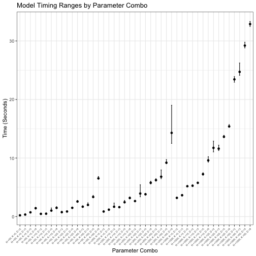

This script to produce a central runtime file. 
These simulations present IRT-M speed and error across
a range of configurations. 
These sims no longer benchmarks against blavaan.
Last updated: 2025-08-08 16:37:23.547235


# Simulations:
Run baseline simulations
50 reps each of:
N = 100, K = 10, lambda sparsity = 0.75
d = c(2, 4, 6, 8)


``` r
## Just IRT-M:
source("code/irtm_N100_K10.R", echo = TRUE)
```

```
## 
## > ## This is just IRT-M with a single specification for the 
## > ## N (100) and K (10) and d = 2, 4, 6, 8
## > ## It does 50 iterations of each pair, with  .... [TRUNCATED] 
## 
## > library(mvtnorm)
## 
## > library(coda)
## 
## > library(nimble)
```

```
## nimble version 1.2.1 is loaded.
## For more information on NIMBLE and a User Manual,
## please visit https://R-nimble.org.
## 
## Note for advanced users who have written their own MCMC samplers:
##   As of version 0.13.0, NIMBLE's protocol for handling posterior
##   predictive nodes has changed in a way that could affect user-defined
##   samplers in some situations. Please see Section 15.5.1 of the User Manual.
```

```
## 
## Attaching package: 'nimble'
```

```
## The following object is masked from 'package:mvtnorm':
## 
##     logdet
```

```
## The following object is masked from 'package:stats':
## 
##     simulate
```

```
## The following object is masked from 'package:base':
## 
##     declare
```

```
## 
## > library(IRTM)
```

```
## Loading required package: truncnorm
```

```
## Loading required package: tmvtnorm
```

```
## Loading required package: Matrix
```

```
## Loading required package: stats4
```

```
## Loading required package: gmm
```

```
## Loading required package: sandwich
```

```
## Loading required package: RcppProgress
```

```
## Loading required package: RcppDist
```

```
## Loading required package: ggplot2
```

```
## 
## > # Source custom helper functions
## > source('code/helpers.R') ## mse, custom plots
## 
## > source('code/irtm_sims_gen_data.R') ## script to generate data
## 
## > source('code/irtm_bsem_results_to_df.R') ## script to format list of results as single df
## 
## > ## Data prep
## > 
## > # Load simulation parameters
## > NKd_vals <- readRDS('simulations/params.rds')
## 
## > ##list of smaller models
## > ## with 100 observations and 10 features
## > 
## > lambda_zero_pct <- 0.75 ## 75% 0 runs CFA and SEM! 
## 
## > ## 50% lambda zero does not, though does run for IRTM
## > 
## > small_sim <- NKd_vals[which(NKd_vals$Var1==100 & # n-items
## +                              .... [TRUNCATED] 
## 
## > ## var4 is a unique identifier that serves as a seed
## > 
## > small_sim$Var4 <- 1:nrow(small_sim)
## 
## > set.seed(1029)
## 
## > ### save small_sim for analysis:
## > sname = paste0("simulations/irtm_small_sim_params", ".rds")
## 
## > save(small_sim, file=sname)
## 
## > ## Simulations:
## > 
## > all_results = list()
## 
## > model_times = list()
## 
## > ## marker to see which chain is running (if more than one)
## > 
## > chain = 1
## 
## > #for(i in 1:nrow(s2)){ ## open for loop
## > for(i in 1:nrow(small_sim)){ ## open for loop
## +   print(paste0("Start pass ", i, ":"))
## +   pass_start <- S .... [TRUNCATED] 
## [1] "Start pass 1:"
## [1] "round"
## [1] "Running IRT-M"
```

```
## Sampling...
```

```
## [1] "Running BCFA and BSEM"
## [1] "Pass took 2.165seconds"
## [1] "Start pass 2:"
## [1] "round"
## [1] "Running IRT-M"
```

```
## Sampling...
```

```
## [1] "Running BCFA and BSEM"
## [1] "Pass took 1.083seconds"
## [1] "Start pass 3:"
## [1] "round"
## [1] "Running IRT-M"
```

```
## Sampling...
```

```
## [1] "Running BCFA and BSEM"
## [1] "Pass took 1.1839seconds"
## [1] "Start pass 4:"
## [1] "round"
## [1] "Running IRT-M"
```

```
## Sampling...
```

```
## [1] "Running BCFA and BSEM"
## [1] "Pass took 1.0634seconds"
## [1] "Start pass 5:"
## [1] "round"
## [1] "Running IRT-M"
```

```
## Sampling...
```

```
## [1] "Running BCFA and BSEM"
## [1] "Pass took 2.2679seconds"
## [1] "Start pass 6:"
## [1] "round"
## [1] "Running IRT-M"
```

```
## Sampling...
```

```
## [1] "Running BCFA and BSEM"
## [1] "Pass took 1.1824seconds"
## [1] "Start pass 7:"
## [1] "round"
## [1] "Running IRT-M"
```

```
## Sampling...
```

```
## [1] "Running BCFA and BSEM"
## [1] "Pass took 2.8881seconds"
## [1] "Start pass 8:"
## [1] "round"
## [1] "Running IRT-M"
```

```
## Sampling...
```

```
## [1] "Running BCFA and BSEM"
## [1] "Pass took 1.6793seconds"
## [1] "Start pass 9:"
## [1] "round"
## [1] "Running IRT-M"
```

```
## Sampling...
```

```
## [1] "Running BCFA and BSEM"
## [1] "Pass took 1.8369seconds"
## [1] "Start pass 10:"
## [1] "round"
## [1] "Running IRT-M"
```

```
## Sampling...
```

```
## [1] "Running BCFA and BSEM"
## [1] "Pass took 2.0129seconds"
## [1] "Start pass 11:"
## [1] "round"
## [1] "Running IRT-M"
```

```
## Sampling...
```

```
## [1] "Running BCFA and BSEM"
## [1] "Pass took 1.8609seconds"
## [1] "Start pass 12:"
## [1] "round"
## [1] "Running IRT-M"
```

```
## Sampling...
```

```
## [1] "Running BCFA and BSEM"
## [1] "Pass took 2.7053seconds"
## [1] "Start pass 13:"
## [1] "round"
## [1] "Running IRT-M"
```

```
## Sampling...
```

```
## [1] "Running BCFA and BSEM"
## [1] "Pass took 1.2815seconds"
## [1] "Start pass 14:"
## [1] "round"
## [1] "Running IRT-M"
```

```
## Sampling...
```

```
## [1] "Running BCFA and BSEM"
## [1] "Pass took 2.0734seconds"
## [1] "Start pass 15:"
## [1] "round"
## [1] "Running IRT-M"
```

```
## Sampling...
```

```
## [1] "Running BCFA and BSEM"
## [1] "Pass took 0.9803seconds"
## [1] "Start pass 16:"
## [1] "round"
## [1] "Running IRT-M"
```

```
## Sampling...
```

```
## [1] "Running BCFA and BSEM"
## [1] "Pass took 1.0648seconds"
## [1] "Start pass 17:"
## [1] "round"
## [1] "Running IRT-M"
```

```
## Sampling...
```

```
## [1] "Running BCFA and BSEM"
## [1] "Pass took 2.0426seconds"
## [1] "Start pass 18:"
## [1] "round"
## [1] "Running IRT-M"
```

```
## Sampling...
```

```
## [1] "Running BCFA and BSEM"
## [1] "Pass took 1.4276seconds"
## [1] "Start pass 19:"
## [1] "round"
## [1] "Running IRT-M"
```

```
## Sampling...
```

```
## [1] "Running BCFA and BSEM"
## [1] "Pass took 1.8305seconds"
## [1] "Start pass 20:"
## [1] "round"
## [1] "Running IRT-M"
```

```
## Sampling...
```

```
## [1] "Running BCFA and BSEM"
## [1] "Pass took 1.1327seconds"
## [1] "Start pass 21:"
## [1] "round"
## [1] "Running IRT-M"
```

```
## Sampling...
```

```
## [1] "Running BCFA and BSEM"
## [1] "Pass took 2.5107seconds"
## [1] "Start pass 22:"
## [1] "round"
## [1] "Running IRT-M"
```

```
## Sampling...
```

```
## [1] "Running BCFA and BSEM"
## [1] "Pass took 1.348seconds"
## [1] "Start pass 23:"
## [1] "round"
## [1] "Running IRT-M"
```

```
## Sampling...
```

```
## [1] "Running BCFA and BSEM"
## [1] "Pass took 1.2412seconds"
## [1] "Start pass 24:"
## [1] "round"
## [1] "Running IRT-M"
```

```
## Sampling...
```

```
## [1] "Running BCFA and BSEM"
## [1] "Pass took 1.6086seconds"
## [1] "Start pass 25:"
## [1] "round"
## [1] "Running IRT-M"
```

```
## Sampling...
```

```
## [1] "Running BCFA and BSEM"
## [1] "Pass took 3.4031seconds"
## [1] "Start pass 26:"
## [1] "round"
## [1] "Running IRT-M"
```

```
## Sampling...
```

```
## [1] "Running BCFA and BSEM"
## [1] "Pass took 1.7005seconds"
## [1] "Start pass 27:"
## [1] "round"
## [1] "Running IRT-M"
```

```
## Sampling...
```

```
## [1] "Running BCFA and BSEM"
## [1] "Pass took 1.227seconds"
## [1] "Start pass 28:"
## [1] "round"
## [1] "Running IRT-M"
```

```
## Sampling...
```

```
## [1] "Running BCFA and BSEM"
## [1] "Pass took 1.4509seconds"
## [1] "Start pass 29:"
## [1] "round"
## [1] "Running IRT-M"
```

```
## Sampling...
```

```
## [1] "Running BCFA and BSEM"
## [1] "Pass took 2.0616seconds"
## [1] "Start pass 30:"
## [1] "round"
## [1] "Running IRT-M"
```

```
## Sampling...
```

```
## [1] "Running BCFA and BSEM"
## [1] "Pass took 3.0884seconds"
## [1] "Start pass 31:"
## [1] "round"
## [1] "Running IRT-M"
```

```
## Sampling...
```

```
## [1] "Running BCFA and BSEM"
## [1] "Pass took 0.9479seconds"
## [1] "Start pass 32:"
## [1] "round"
## [1] "Running IRT-M"
```

```
## Sampling...
```

```
## [1] "Running BCFA and BSEM"
## [1] "Pass took 2.9663seconds"
## [1] "Start pass 33:"
## [1] "round"
## [1] "Running IRT-M"
```

```
## Sampling...
```

```
## [1] "Running BCFA and BSEM"
## [1] "Pass took 1.0618seconds"
## [1] "Start pass 34:"
## [1] "round"
## [1] "Running IRT-M"
```

```
## Sampling...
```

```
## [1] "Running BCFA and BSEM"
## [1] "Pass took 1.617seconds"
## [1] "Start pass 35:"
## [1] "round"
## [1] "Running IRT-M"
```

```
## Sampling...
```

```
## [1] "Running BCFA and BSEM"
## [1] "Pass took 1.0618seconds"
## [1] "Start pass 36:"
## [1] "round"
## [1] "Running IRT-M"
```

```
## Sampling...
```

```
## [1] "Running BCFA and BSEM"
## [1] "Pass took 2.6979seconds"
## [1] "Start pass 37:"
## [1] "round"
## [1] "Running IRT-M"
```

```
## Sampling...
```

```
## [1] "Running BCFA and BSEM"
## [1] "Pass took 1.1829seconds"
## [1] "Start pass 38:"
## [1] "round"
## [1] "Running IRT-M"
```

```
## Sampling...
```

```
## [1] "Running BCFA and BSEM"
## [1] "Pass took 1.1091seconds"
## [1] "Start pass 39:"
## [1] "round"
## [1] "Running IRT-M"
```

```
## Sampling...
```

```
## [1] "Running BCFA and BSEM"
## [1] "Pass took 1.1767seconds"
## [1] "Start pass 40:"
## [1] "round"
## [1] "Running IRT-M"
```

```
## Sampling...
```

```
## [1] "Running BCFA and BSEM"
## [1] "Pass took 1.3503seconds"
## [1] "Start pass 41:"
## [1] "round"
## [1] "Running IRT-M"
```

```
## Sampling...
```

```
## [1] "Running BCFA and BSEM"
## [1] "Pass took 2.8419seconds"
## [1] "Start pass 42:"
## [1] "round"
## [1] "Running IRT-M"
```

```
## Sampling...
```

```
## [1] "Running BCFA and BSEM"
## [1] "Pass took 1.0445seconds"
## [1] "Start pass 43:"
## [1] "round"
## [1] "Running IRT-M"
```

```
## Sampling...
```

```
## [1] "Running BCFA and BSEM"
## [1] "Pass took 2.9386seconds"
## [1] "Start pass 44:"
## [1] "round"
## [1] "Running IRT-M"
```

```
## Sampling...
```

```
## [1] "Running BCFA and BSEM"
## [1] "Pass took 2.7183seconds"
## [1] "Start pass 45:"
## [1] "round"
## [1] "Running IRT-M"
```

```
## Sampling...
```

```
## [1] "Running BCFA and BSEM"
## [1] "Pass took 1.1979seconds"
## [1] "Start pass 46:"
## [1] "round"
## [1] "Running IRT-M"
```

```
## Sampling...
```

```
## [1] "Running BCFA and BSEM"
## [1] "Pass took 1.3005seconds"
## [1] "Start pass 47:"
## [1] "round"
## [1] "Running IRT-M"
```

```
## Sampling...
```

```
## [1] "Running BCFA and BSEM"
## [1] "Pass took 3.006seconds"
## [1] "Start pass 48:"
## [1] "round"
## [1] "Running IRT-M"
```

```
## Sampling...
```

```
## [1] "Running BCFA and BSEM"
## [1] "Pass took 2.8163seconds"
## [1] "Start pass 49:"
## [1] "round"
## [1] "Running IRT-M"
```

```
## Sampling...
```

```
## [1] "Running BCFA and BSEM"
## [1] "Pass took 2.6115seconds"
## [1] "Start pass 50:"
## [1] "round"
## [1] "Running IRT-M"
```

```
## Sampling...
```

```
## [1] "Running BCFA and BSEM"
## [1] "Pass took 2.52seconds"
## [1] "Start pass 51:"
## [1] "round"
## [1] "Running IRT-M"
```

```
## Sampling...
```

```
## [1] "Running BCFA and BSEM"
## [1] "Pass took 0.9134seconds"
## [1] "Start pass 52:"
## [1] "round"
## [1] "Running IRT-M"
```

```
## Sampling...
```

```
## [1] "Running BCFA and BSEM"
## [1] "Pass took 3.0212seconds"
## [1] "Start pass 53:"
## [1] "round"
## [1] "Running IRT-M"
```

```
## Sampling...
```

```
## [1] "Running BCFA and BSEM"
## [1] "Pass took 2.8653seconds"
## [1] "Start pass 54:"
## [1] "round"
## [1] "Running IRT-M"
```

```
## Sampling...
```

```
## [1] "Running BCFA and BSEM"
## [1] "Pass took 0.9278seconds"
## [1] "Start pass 55:"
## [1] "round"
## [1] "Running IRT-M"
```

```
## Sampling...
```

```
## [1] "Running BCFA and BSEM"
## [1] "Pass took 1.0124seconds"
## [1] "Start pass 56:"
## [1] "round"
## [1] "Running IRT-M"
```

```
## Sampling...
```

```
## [1] "Running BCFA and BSEM"
## [1] "Pass took 1.6474seconds"
## [1] "Start pass 57:"
## [1] "round"
## [1] "Running IRT-M"
```

```
## Sampling...
```

```
## [1] "Running BCFA and BSEM"
## [1] "Pass took 1.1026seconds"
## [1] "Start pass 58:"
## [1] "round"
## [1] "Running IRT-M"
```

```
## Sampling...
```

```
## [1] "Running BCFA and BSEM"
## [1] "Pass took 0.9938seconds"
## [1] "Start pass 59:"
## [1] "round"
## [1] "Running IRT-M"
```

```
## Sampling...
```

```
## [1] "Running BCFA and BSEM"
## [1] "Pass took 2.2643seconds"
## [1] "Start pass 60:"
## [1] "round"
## [1] "Running IRT-M"
```

```
## Sampling...
```

```
## [1] "Running BCFA and BSEM"
## [1] "Pass took 2.2284seconds"
## [1] "Start pass 61:"
## [1] "round"
## [1] "Running IRT-M"
```

```
## Sampling...
```

```
## [1] "Running BCFA and BSEM"
## [1] "Pass took 0.9799seconds"
## [1] "Start pass 62:"
## [1] "round"
## [1] "Running IRT-M"
```

```
## Sampling...
```

```
## [1] "Running BCFA and BSEM"
## [1] "Pass took 1.5347seconds"
## [1] "Start pass 63:"
## [1] "round"
## [1] "Running IRT-M"
```

```
## Sampling...
```

```
## [1] "Running BCFA and BSEM"
## [1] "Pass took 1.825seconds"
## [1] "Start pass 64:"
## [1] "round"
## [1] "Running IRT-M"
```

```
## Sampling...
```

```
## [1] "Running BCFA and BSEM"
## [1] "Pass took 1.7573seconds"
## [1] "Start pass 65:"
## [1] "round"
## [1] "Running IRT-M"
```

```
## Sampling...
```

```
## [1] "Running BCFA and BSEM"
## [1] "Pass took 1.0833seconds"
## [1] "Start pass 66:"
## [1] "round"
## [1] "Running IRT-M"
```

```
## Sampling...
```

```
## [1] "Running BCFA and BSEM"
## [1] "Pass took 2.5586seconds"
## [1] "Start pass 67:"
## [1] "round"
## [1] "Running IRT-M"
```

```
## Sampling...
```

```
## [1] "Running BCFA and BSEM"
## [1] "Pass took 0.9121seconds"
## [1] "Start pass 68:"
## [1] "round"
## [1] "Running IRT-M"
```

```
## Sampling...
```

```
## [1] "Running BCFA and BSEM"
## [1] "Pass took 2.9779seconds"
## [1] "Start pass 69:"
## [1] "round"
## [1] "Running IRT-M"
```

```
## Sampling...
```

```
## [1] "Running BCFA and BSEM"
## [1] "Pass took 2.2405seconds"
## [1] "Start pass 70:"
## [1] "round"
## [1] "Running IRT-M"
```

```
## Sampling...
```

```
## [1] "Running BCFA and BSEM"
## [1] "Pass took 1.8315seconds"
## [1] "Start pass 71:"
## [1] "round"
## [1] "Running IRT-M"
```

```
## Sampling...
```

```
## [1] "Running BCFA and BSEM"
## [1] "Pass took 1.7522seconds"
## [1] "Start pass 72:"
## [1] "round"
## [1] "Running IRT-M"
```

```
## Sampling...
```

```
## [1] "Running BCFA and BSEM"
## [1] "Pass took 1.578seconds"
## [1] "Start pass 73:"
## [1] "round"
## [1] "Running IRT-M"
```

```
## Sampling...
```

```
## [1] "Running BCFA and BSEM"
## [1] "Pass took 1.6312seconds"
## [1] "Start pass 74:"
## [1] "round"
## [1] "Running IRT-M"
```

```
## Sampling...
```

```
## [1] "Running BCFA and BSEM"
## [1] "Pass took 2.8525seconds"
## [1] "Start pass 75:"
## [1] "round"
## [1] "Running IRT-M"
```

```
## Sampling...
```

```
## [1] "Running BCFA and BSEM"
## [1] "Pass took 1.0866seconds"
## [1] "Start pass 76:"
## [1] "round"
## [1] "Running IRT-M"
```

```
## Sampling...
```

```
## [1] "Running BCFA and BSEM"
## [1] "Pass took 1.1899seconds"
## [1] "Start pass 77:"
## [1] "round"
## [1] "Running IRT-M"
```

```
## Sampling...
```

```
## [1] "Running BCFA and BSEM"
## [1] "Pass took 0.9383seconds"
## [1] "Start pass 78:"
## [1] "round"
## [1] "Running IRT-M"
```

```
## Sampling...
```

```
## [1] "Running BCFA and BSEM"
## [1] "Pass took 0.9758seconds"
## [1] "Start pass 79:"
## [1] "round"
## [1] "Running IRT-M"
```

```
## Sampling...
```

```
## [1] "Running BCFA and BSEM"
## [1] "Pass took 0.9379seconds"
## [1] "Start pass 80:"
## [1] "round"
## [1] "Running IRT-M"
```

```
## Sampling...
```

```
## [1] "Running BCFA and BSEM"
## [1] "Pass took 1.0696seconds"
## [1] "Start pass 81:"
## [1] "round"
## [1] "Running IRT-M"
```

```
## Sampling...
```

```
## [1] "Running BCFA and BSEM"
## [1] "Pass took 2.6046seconds"
## [1] "Start pass 82:"
## [1] "round"
## [1] "Running IRT-M"
```

```
## Sampling...
```

```
## [1] "Running BCFA and BSEM"
## [1] "Pass took 1.7782seconds"
## [1] "Start pass 83:"
## [1] "round"
## [1] "Running IRT-M"
```

```
## Sampling...
```

```
## [1] "Running BCFA and BSEM"
## [1] "Pass took 1.0027seconds"
## [1] "Start pass 84:"
## [1] "round"
## [1] "Running IRT-M"
```

```
## Sampling...
```

```
## [1] "Running BCFA and BSEM"
## [1] "Pass took 2.8952seconds"
## [1] "Start pass 85:"
## [1] "round"
## [1] "Running IRT-M"
```

```
## Sampling...
```

```
## [1] "Running BCFA and BSEM"
## [1] "Pass took 0.9394seconds"
## [1] "Start pass 86:"
## [1] "round"
## [1] "Running IRT-M"
```

```
## Sampling...
```

```
## [1] "Running BCFA and BSEM"
## [1] "Pass took 2.6308seconds"
## [1] "Start pass 87:"
## [1] "round"
## [1] "Running IRT-M"
```

```
## Sampling...
```

```
## [1] "Running BCFA and BSEM"
## [1] "Pass took 1.7254seconds"
## [1] "Start pass 88:"
## [1] "round"
## [1] "Running IRT-M"
```

```
## Sampling...
```

```
## [1] "Running BCFA and BSEM"
## [1] "Pass took 1.1468seconds"
## [1] "Start pass 89:"
## [1] "round"
## [1] "Running IRT-M"
```

```
## Sampling...
```

```
## [1] "Running BCFA and BSEM"
## [1] "Pass took 0.9201seconds"
## [1] "Start pass 90:"
## [1] "round"
## [1] "Running IRT-M"
```

```
## Sampling...
```

```
## [1] "Running BCFA and BSEM"
## [1] "Pass took 1.7798seconds"
## [1] "Start pass 91:"
## [1] "round"
## [1] "Running IRT-M"
```

```
## Sampling...
```

```
## [1] "Running BCFA and BSEM"
## [1] "Pass took 0.9338seconds"
## [1] "Start pass 92:"
## [1] "round"
## [1] "Running IRT-M"
```

```
## Sampling...
```

```
## [1] "Running BCFA and BSEM"
## [1] "Pass took 0.93seconds"
## [1] "Start pass 93:"
## [1] "round"
## [1] "Running IRT-M"
```

```
## Sampling...
```

```
## [1] "Running BCFA and BSEM"
## [1] "Pass took 1.0699seconds"
## [1] "Start pass 94:"
## [1] "round"
## [1] "Running IRT-M"
```

```
## Sampling...
```

```
## [1] "Running BCFA and BSEM"
## [1] "Pass took 2.6313seconds"
## [1] "Start pass 95:"
## [1] "round"
## [1] "Running IRT-M"
```

```
## Sampling...
```

```
## [1] "Running BCFA and BSEM"
## [1] "Pass took 1.121seconds"
## [1] "Start pass 96:"
## [1] "round"
## [1] "Running IRT-M"
```

```
## Sampling...
```

```
## [1] "Running BCFA and BSEM"
## [1] "Pass took 0.9305seconds"
## [1] "Start pass 97:"
## [1] "round"
## [1] "Running IRT-M"
```

```
## Sampling...
```

```
## [1] "Running BCFA and BSEM"
## [1] "Pass took 1.1532seconds"
## [1] "Start pass 98:"
## [1] "round"
## [1] "Running IRT-M"
```

```
## Sampling...
```

```
## [1] "Running BCFA and BSEM"
## [1] "Pass took 1.1474seconds"
## [1] "Start pass 99:"
## [1] "round"
## [1] "Running IRT-M"
```

```
## Sampling...
```

```
## [1] "Running BCFA and BSEM"
## [1] "Pass took 2.8965seconds"
## [1] "Start pass 100:"
## [1] "round"
## [1] "Running IRT-M"
```

```
## Sampling...
```

```
## [1] "Running BCFA and BSEM"
## [1] "Pass took 1.6687seconds"
## [1] "Start pass 101:"
## [1] "round"
## [1] "Running IRT-M"
```

```
## Sampling...
```

```
## [1] "Running BCFA and BSEM"
## [1] "Pass took 1.1829seconds"
## [1] "Start pass 102:"
## [1] "round"
## [1] "Running IRT-M"
```

```
## Sampling...
```

```
## [1] "Running BCFA and BSEM"
## [1] "Pass took 1.0666seconds"
## [1] "Start pass 103:"
## [1] "round"
## [1] "Running IRT-M"
```

```
## Sampling...
```

```
## [1] "Running BCFA and BSEM"
## [1] "Pass took 0.9509seconds"
## [1] "Start pass 104:"
## [1] "round"
## [1] "Running IRT-M"
```

```
## Sampling...
```

```
## [1] "Running BCFA and BSEM"
## [1] "Pass took 1.1141seconds"
## [1] "Start pass 105:"
## [1] "round"
## [1] "Running IRT-M"
```

```
## Sampling...
```

```
## [1] "Running BCFA and BSEM"
## [1] "Pass took 1.6796seconds"
## [1] "Start pass 106:"
## [1] "round"
## [1] "Running IRT-M"
```

```
## Sampling...
```

```
## [1] "Running BCFA and BSEM"
## [1] "Pass took 1.948seconds"
## [1] "Start pass 107:"
## [1] "round"
## [1] "Running IRT-M"
```

```
## Sampling...
```

```
## [1] "Running BCFA and BSEM"
## [1] "Pass took 1.106seconds"
## [1] "Start pass 108:"
## [1] "round"
## [1] "Running IRT-M"
```

```
## Sampling...
```

```
## [1] "Running BCFA and BSEM"
## [1] "Pass took 0.9427seconds"
## [1] "Start pass 109:"
## [1] "round"
## [1] "Running IRT-M"
```

```
## Sampling...
```

```
## [1] "Running BCFA and BSEM"
## [1] "Pass took 1.1017seconds"
## [1] "Start pass 110:"
## [1] "round"
## [1] "Running IRT-M"
```

```
## Sampling...
```

```
## [1] "Running BCFA and BSEM"
## [1] "Pass took 1.7061seconds"
## [1] "Start pass 111:"
## [1] "round"
## [1] "Running IRT-M"
```

```
## Sampling...
```

```
## [1] "Running BCFA and BSEM"
## [1] "Pass took 3.0172seconds"
## [1] "Start pass 112:"
## [1] "round"
## [1] "Running IRT-M"
```

```
## Sampling...
```

```
## [1] "Running BCFA and BSEM"
## [1] "Pass took 1.662seconds"
## [1] "Start pass 113:"
## [1] "round"
## [1] "Running IRT-M"
```

```
## Sampling...
```

```
## [1] "Running BCFA and BSEM"
## [1] "Pass took 2.6518seconds"
## [1] "Start pass 114:"
## [1] "round"
## [1] "Running IRT-M"
```

```
## Sampling...
```

```
## [1] "Running BCFA and BSEM"
## [1] "Pass took 2.9174seconds"
## [1] "Start pass 115:"
## [1] "round"
## [1] "Running IRT-M"
```

```
## Sampling...
```

```
## [1] "Running BCFA and BSEM"
## [1] "Pass took 0.9604seconds"
## [1] "Start pass 116:"
## [1] "round"
## [1] "Running IRT-M"
```

```
## Sampling...
```

```
## [1] "Running BCFA and BSEM"
## [1] "Pass took 0.902seconds"
## [1] "Start pass 117:"
## [1] "round"
## [1] "Running IRT-M"
```

```
## Sampling...
```

```
## [1] "Running BCFA and BSEM"
## [1] "Pass took 1.6781seconds"
## [1] "Start pass 118:"
## [1] "round"
## [1] "Running IRT-M"
```

```
## Sampling...
```

```
## [1] "Running BCFA and BSEM"
## [1] "Pass took 1.0749seconds"
## [1] "Start pass 119:"
## [1] "round"
## [1] "Running IRT-M"
```

```
## Sampling...
```

```
## [1] "Running BCFA and BSEM"
## [1] "Pass took 1.0973seconds"
## [1] "Start pass 120:"
## [1] "round"
## [1] "Running IRT-M"
```

```
## Sampling...
```

```
## [1] "Running BCFA and BSEM"
## [1] "Pass took 0.9435seconds"
## [1] "Start pass 121:"
## [1] "round"
## [1] "Running IRT-M"
```

```
## Sampling...
```

```
## [1] "Running BCFA and BSEM"
## [1] "Pass took 1.128seconds"
## [1] "Start pass 122:"
## [1] "round"
## [1] "Running IRT-M"
```

```
## Sampling...
```

```
## [1] "Running BCFA and BSEM"
## [1] "Pass took 2.6436seconds"
## [1] "Start pass 123:"
## [1] "round"
## [1] "Running IRT-M"
```

```
## Sampling...
```

```
## [1] "Running BCFA and BSEM"
## [1] "Pass took 1.6468seconds"
## [1] "Start pass 124:"
## [1] "round"
## [1] "Running IRT-M"
```

```
## Sampling...
```

```
## [1] "Running BCFA and BSEM"
## [1] "Pass took 1.8987seconds"
## [1] "Start pass 125:"
## [1] "round"
## [1] "Running IRT-M"
```

```
## Sampling...
```

```
## [1] "Running BCFA and BSEM"
## [1] "Pass took 1.6908seconds"
## [1] "Start pass 126:"
## [1] "round"
## [1] "Running IRT-M"
```

```
## Sampling...
```

```
## [1] "Running BCFA and BSEM"
## [1] "Pass took 2.599seconds"
## [1] "Start pass 127:"
## [1] "round"
## [1] "Running IRT-M"
```

```
## Sampling...
```

```
## [1] "Running BCFA and BSEM"
## [1] "Pass took 1.7159seconds"
## [1] "Start pass 128:"
## [1] "round"
## [1] "Running IRT-M"
```

```
## Sampling...
```

```
## [1] "Running BCFA and BSEM"
## [1] "Pass took 1.1128seconds"
## [1] "Start pass 129:"
## [1] "round"
## [1] "Running IRT-M"
```

```
## Sampling...
```

```
## [1] "Running BCFA and BSEM"
## [1] "Pass took 1.2099seconds"
## [1] "Start pass 130:"
## [1] "round"
## [1] "Running IRT-M"
```

```
## Sampling...
```

```
## [1] "Running BCFA and BSEM"
## [1] "Pass took 1.773seconds"
## [1] "Start pass 131:"
## [1] "round"
## [1] "Running IRT-M"
```

```
## Sampling...
```

```
## [1] "Running BCFA and BSEM"
## [1] "Pass took 0.9339seconds"
## [1] "Start pass 132:"
## [1] "round"
## [1] "Running IRT-M"
```

```
## Sampling...
```

```
## [1] "Running BCFA and BSEM"
## [1] "Pass took 0.9399seconds"
## [1] "Start pass 133:"
## [1] "round"
## [1] "Running IRT-M"
```

```
## Sampling...
```

```
## [1] "Running BCFA and BSEM"
## [1] "Pass took 1.137seconds"
## [1] "Start pass 134:"
## [1] "round"
## [1] "Running IRT-M"
```

```
## Sampling...
```

```
## [1] "Running BCFA and BSEM"
## [1] "Pass took 1.7242seconds"
## [1] "Start pass 135:"
## [1] "round"
## [1] "Running IRT-M"
```

```
## Sampling...
```

```
## [1] "Running BCFA and BSEM"
## [1] "Pass took 1.7943seconds"
## [1] "Start pass 136:"
## [1] "round"
## [1] "Running IRT-M"
```

```
## Sampling...
```

```
## [1] "Running BCFA and BSEM"
## [1] "Pass took 3.2589seconds"
## [1] "Start pass 137:"
## [1] "round"
## [1] "Running IRT-M"
```

```
## Sampling...
```

```
## [1] "Running BCFA and BSEM"
## [1] "Pass took 1.1787seconds"
## [1] "Start pass 138:"
## [1] "round"
## [1] "Running IRT-M"
```

```
## Sampling...
```

```
## [1] "Running BCFA and BSEM"
## [1] "Pass took 1.1229seconds"
## [1] "Start pass 139:"
## [1] "round"
## [1] "Running IRT-M"
```

```
## Sampling...
```

```
## [1] "Running BCFA and BSEM"
## [1] "Pass took 1.0805seconds"
## [1] "Start pass 140:"
## [1] "round"
## [1] "Running IRT-M"
```

```
## Sampling...
```

```
## [1] "Running BCFA and BSEM"
## [1] "Pass took 0.956seconds"
## [1] "Start pass 141:"
## [1] "round"
## [1] "Running IRT-M"
```

```
## Sampling...
```

```
## [1] "Running BCFA and BSEM"
## [1] "Pass took 0.9382seconds"
## [1] "Start pass 142:"
## [1] "round"
## [1] "Running IRT-M"
```

```
## Sampling...
```

```
## [1] "Running BCFA and BSEM"
## [1] "Pass took 1.2784seconds"
## [1] "Start pass 143:"
## [1] "round"
## [1] "Running IRT-M"
```

```
## Sampling...
```

```
## [1] "Running BCFA and BSEM"
## [1] "Pass took 2.1269seconds"
## [1] "Start pass 144:"
## [1] "round"
## [1] "Running IRT-M"
```

```
## Sampling...
```

```
## [1] "Running BCFA and BSEM"
## [1] "Pass took 1.1755seconds"
## [1] "Start pass 145:"
## [1] "round"
## [1] "Running IRT-M"
```

```
## Sampling...
```

```
## [1] "Running BCFA and BSEM"
## [1] "Pass took 1.3833seconds"
## [1] "Start pass 146:"
## [1] "round"
## [1] "Running IRT-M"
```

```
## Sampling...
```

```
## [1] "Running BCFA and BSEM"
## [1] "Pass took 2.7718seconds"
## [1] "Start pass 147:"
## [1] "round"
## [1] "Running IRT-M"
```

```
## Sampling...
```

```
## [1] "Running BCFA and BSEM"
## [1] "Pass took 1.8654seconds"
## [1] "Start pass 148:"
## [1] "round"
## [1] "Running IRT-M"
```

```
## Sampling...
```

```
## [1] "Running BCFA and BSEM"
## [1] "Pass took 1.4115seconds"
## [1] "Start pass 149:"
## [1] "round"
## [1] "Running IRT-M"
```

```
## Sampling...
```

```
## [1] "Running BCFA and BSEM"
## [1] "Pass took 1.878seconds"
## [1] "Start pass 150:"
## [1] "round"
## [1] "Running IRT-M"
```

```
## Sampling...
```

```
## [1] "Running BCFA and BSEM"
## [1] "Pass took 2.8831seconds"
## [1] "Start pass 151:"
## [1] "round"
## [1] "Running IRT-M"
```

```
## Sampling...
```

```
## [1] "Running BCFA and BSEM"
## [1] "Pass took 1.143seconds"
## [1] "Start pass 152:"
## [1] "round"
## [1] "Running IRT-M"
```

```
## Sampling...
```

```
## [1] "Running BCFA and BSEM"
## [1] "Pass took 0.9109seconds"
## [1] "Start pass 153:"
## [1] "round"
## [1] "Running IRT-M"
```

```
## Sampling...
```

```
## [1] "Running BCFA and BSEM"
## [1] "Pass took 1.9518seconds"
## [1] "Start pass 154:"
## [1] "round"
## [1] "Running IRT-M"
```

```
## Sampling...
```

```
## [1] "Running BCFA and BSEM"
## [1] "Pass took 1.1613seconds"
## [1] "Start pass 155:"
## [1] "round"
## [1] "Running IRT-M"
```

```
## Sampling...
```

```
## [1] "Running BCFA and BSEM"
## [1] "Pass took 1.8772seconds"
## [1] "Start pass 156:"
## [1] "round"
## [1] "Running IRT-M"
```

```
## Sampling...
```

```
## [1] "Running BCFA and BSEM"
## [1] "Pass took 3.0785seconds"
## [1] "Start pass 157:"
## [1] "round"
## [1] "Running IRT-M"
```

```
## Sampling...
```

```
## [1] "Running BCFA and BSEM"
## [1] "Pass took 3.4611seconds"
## [1] "Start pass 158:"
## [1] "round"
## [1] "Running IRT-M"
```

```
## Sampling...
```

```
## [1] "Running BCFA and BSEM"
## [1] "Pass took 3.3339seconds"
## [1] "Start pass 159:"
## [1] "round"
## [1] "Running IRT-M"
```

```
## Sampling...
```

```
## [1] "Running BCFA and BSEM"
## [1] "Pass took 1.9388seconds"
## [1] "Start pass 160:"
## [1] "round"
## [1] "Running IRT-M"
```

```
## Sampling...
```

```
## [1] "Running BCFA and BSEM"
## [1] "Pass took 1.221seconds"
## [1] "Start pass 161:"
## [1] "round"
## [1] "Running IRT-M"
```

```
## Sampling...
```

```
## [1] "Running BCFA and BSEM"
## [1] "Pass took 3.2696seconds"
## [1] "Start pass 162:"
## [1] "round"
## [1] "Running IRT-M"
```

```
## Sampling...
```

```
## [1] "Running BCFA and BSEM"
## [1] "Pass took 2.2185seconds"
## [1] "Start pass 163:"
## [1] "round"
## [1] "Running IRT-M"
```

```
## Sampling...
```

```
## [1] "Running BCFA and BSEM"
## [1] "Pass took 1.885seconds"
## [1] "Start pass 164:"
## [1] "round"
## [1] "Running IRT-M"
```

```
## Sampling...
```

```
## [1] "Running BCFA and BSEM"
## [1] "Pass took 3.1366seconds"
## [1] "Start pass 165:"
## [1] "round"
## [1] "Running IRT-M"
```

```
## Sampling...
```

```
## [1] "Running BCFA and BSEM"
## [1] "Pass took 1.1694seconds"
## [1] "Start pass 166:"
## [1] "round"
## [1] "Running IRT-M"
```

```
## Sampling...
```

```
## [1] "Running BCFA and BSEM"
## [1] "Pass took 3.1856seconds"
## [1] "Start pass 167:"
## [1] "round"
## [1] "Running IRT-M"
```

```
## Sampling...
```

```
## [1] "Running BCFA and BSEM"
## [1] "Pass took 3.0058seconds"
## [1] "Start pass 168:"
## [1] "round"
## [1] "Running IRT-M"
```

```
## Sampling...
```

```
## [1] "Running BCFA and BSEM"
## [1] "Pass took 1.9198seconds"
## [1] "Start pass 169:"
## [1] "round"
## [1] "Running IRT-M"
```

```
## Sampling...
```

```
## [1] "Running BCFA and BSEM"
## [1] "Pass took 3.1417seconds"
## [1] "Start pass 170:"
## [1] "round"
## [1] "Running IRT-M"
```

```
## Sampling...
```

```
## [1] "Running BCFA and BSEM"
## [1] "Pass took 3.3337seconds"
## [1] "Start pass 171:"
## [1] "round"
## [1] "Running IRT-M"
```

```
## Sampling...
```

```
## [1] "Running BCFA and BSEM"
## [1] "Pass took 1.14seconds"
## [1] "Start pass 172:"
## [1] "round"
## [1] "Running IRT-M"
```

```
## Sampling...
```

```
## [1] "Running BCFA and BSEM"
## [1] "Pass took 1.2012seconds"
## [1] "Start pass 173:"
## [1] "round"
## [1] "Running IRT-M"
```

```
## Sampling...
```

```
## [1] "Running BCFA and BSEM"
## [1] "Pass took 2.8696seconds"
## [1] "Start pass 174:"
## [1] "round"
## [1] "Running IRT-M"
```

```
## Sampling...
```

```
## [1] "Running BCFA and BSEM"
## [1] "Pass took 1.3842seconds"
## [1] "Start pass 175:"
## [1] "round"
## [1] "Running IRT-M"
```

```
## Sampling...
```

```
## [1] "Running BCFA and BSEM"
## [1] "Pass took 3.2804seconds"
## [1] "Start pass 176:"
## [1] "round"
## [1] "Running IRT-M"
```

```
## Sampling...
```

```
## [1] "Running BCFA and BSEM"
## [1] "Pass took 1.0772seconds"
## [1] "Start pass 177:"
## [1] "round"
## [1] "Running IRT-M"
```

```
## Sampling...
```

```
## [1] "Running BCFA and BSEM"
## [1] "Pass took 3.4792seconds"
## [1] "Start pass 178:"
## [1] "round"
## [1] "Running IRT-M"
```

```
## Sampling...
```

```
## [1] "Running BCFA and BSEM"
## [1] "Pass took 1.9724seconds"
## [1] "Start pass 179:"
## [1] "round"
## [1] "Running IRT-M"
```

```
## Sampling...
```

```
## [1] "Running BCFA and BSEM"
## [1] "Pass took 1.1037seconds"
## [1] "Start pass 180:"
## [1] "round"
## [1] "Running IRT-M"
```

```
## Sampling...
```

```
## [1] "Running BCFA and BSEM"
## [1] "Pass took 1.4697seconds"
## [1] "Start pass 181:"
## [1] "round"
## [1] "Running IRT-M"
```

```
## Sampling...
```

```
## [1] "Running BCFA and BSEM"
## [1] "Pass took 1.169seconds"
## [1] "Start pass 182:"
## [1] "round"
## [1] "Running IRT-M"
```

```
## Sampling...
```

```
## [1] "Running BCFA and BSEM"
## [1] "Pass took 3.0269seconds"
## [1] "Start pass 183:"
## [1] "round"
## [1] "Running IRT-M"
```

```
## Sampling...
```

```
## [1] "Running BCFA and BSEM"
## [1] "Pass took 1.0145seconds"
## [1] "Start pass 184:"
## [1] "round"
## [1] "Running IRT-M"
```

```
## Sampling...
```

```
## [1] "Running BCFA and BSEM"
## [1] "Pass took 3.0234seconds"
## [1] "Start pass 185:"
## [1] "round"
## [1] "Running IRT-M"
```

```
## Sampling...
```

```
## [1] "Running BCFA and BSEM"
## [1] "Pass took 2.0763seconds"
## [1] "Start pass 186:"
## [1] "round"
## [1] "Running IRT-M"
```

```
## Sampling...
```

```
## [1] "Running BCFA and BSEM"
## [1] "Pass took 1.0551seconds"
## [1] "Start pass 187:"
## [1] "round"
## [1] "Running IRT-M"
```

```
## Sampling...
```

```
## [1] "Running BCFA and BSEM"
## [1] "Pass took 3.7559seconds"
## [1] "Start pass 188:"
## [1] "round"
## [1] "Running IRT-M"
```

```
## Sampling...
```

```
## [1] "Running BCFA and BSEM"
## [1] "Pass took 2.908seconds"
## [1] "Start pass 189:"
## [1] "round"
## [1] "Running IRT-M"
```

```
## Sampling...
```

```
## [1] "Running BCFA and BSEM"
## [1] "Pass took 2.9976seconds"
## [1] "Start pass 190:"
## [1] "round"
## [1] "Running IRT-M"
```

```
## Sampling...
```

```
## [1] "Running BCFA and BSEM"
## [1] "Pass took 0.9957seconds"
## [1] "Start pass 191:"
## [1] "round"
## [1] "Running IRT-M"
```

```
## Sampling...
```

```
## [1] "Running BCFA and BSEM"
## [1] "Pass took 2.0748seconds"
## [1] "Start pass 192:"
## [1] "round"
## [1] "Running IRT-M"
```

```
## Sampling...
```

```
## [1] "Running BCFA and BSEM"
## [1] "Pass took 2.9933seconds"
## [1] "Start pass 193:"
## [1] "round"
## [1] "Running IRT-M"
```

```
## Sampling...
```

```
## [1] "Running BCFA and BSEM"
## [1] "Pass took 1.1008seconds"
## [1] "Start pass 194:"
## [1] "round"
## [1] "Running IRT-M"
```

```
## Sampling...
```

```
## [1] "Running BCFA and BSEM"
## [1] "Pass took 3.2816seconds"
## [1] "Start pass 195:"
## [1] "round"
## [1] "Running IRT-M"
```

```
## Sampling...
```

```
## [1] "Running BCFA and BSEM"
## [1] "Pass took 1.063seconds"
## [1] "Start pass 196:"
## [1] "round"
## [1] "Running IRT-M"
```

```
## Sampling...
```

```
## [1] "Running BCFA and BSEM"
## [1] "Pass took 1.4349seconds"
## [1] "Start pass 197:"
## [1] "round"
## [1] "Running IRT-M"
```

```
## Sampling...
```

```
## [1] "Running BCFA and BSEM"
## [1] "Pass took 1.1925seconds"
## [1] "Start pass 198:"
## [1] "round"
## [1] "Running IRT-M"
```

```
## Sampling...
```

```
## [1] "Running BCFA and BSEM"
## [1] "Pass took 1.9085seconds"
## [1] "Start pass 199:"
## [1] "round"
## [1] "Running IRT-M"
```

```
## Sampling...
```

```
## [1] "Running BCFA and BSEM"
## [1] "Pass took 1.2436seconds"
## [1] "Start pass 200:"
## [1] "round"
## [1] "Running IRT-M"
```

```
## Sampling...
```

```
## [1] "Running BCFA and BSEM"
## [1] "Pass took 2.4389seconds"
## 
## > ## Save results
## > fname = paste0("simulations/irtm_only_N100K10.rds")
## 
## > save(all_results, file=fname)
## 
## > ## save time info
## > tname = paste0("simulations/irtm_only_N100K10_time.rds")
## 
## > save(model_times, file=tname)
```

produces: 
irtm_only_N100K10.rds ## model results
small_sim_params.rds ## df of parameters
irtm_only_N100K10_time.rds ## runtime
Results figures:


``` r
source("code/irtm1_results_plots.R", echo = TRUE)
```

```
## 
## > ## Results:
## > ## takes dataframe of results
## > ## produces graphs
## > 
## > library(dplyr)
```

```
## 
## Attaching package: 'dplyr'
```

```
## The following object is masked from 'package:MASS':
## 
##     select
```

```
## The following objects are masked from 'package:stats':
## 
##     filter, lag
```

```
## The following objects are masked from 'package:base':
## 
##     intersect, setdiff, setequal, union
```

```
## 
## > library(tidyr)
```

```
## 
## Attaching package: 'tidyr'
```

```
## The following objects are masked from 'package:Matrix':
## 
##     expand, pack, unpack
```

```
## 
## > library(ggplot2)
## 
## > source('code/irtm_only_results_to_df.R') ## script to format list of results as single df
## 
## > source('code/na_indicies.R') # helper to find NA values in model comparisons
## 
## > ## Load data:
## > ## params:
## > load("simulations/irtm_small_sim_params.rds")
## 
## > ## all_results:
## > load("simulations/irtm_only_N100K10.rds")
## 
## > ## model_times:
## > load("simulations/irtm_only_N100K10_time.rds")
## 
## > ## %%%%%%%%%%%%% Data Prep
## > ## Standardize list names for the time list:
## > 
## > all_results <- lapply(all_results, function(x) {
## +   if ("irtM" %in%  .... [TRUNCATED] 
## 
## > all_results <- lapply(all_results, function(x) {
## +   if ("CFA" %in% names(x)) {
## +     names(x)[names(x) == "CFA"] <- "bcfa"
## +   }
## +   return(x)
## + })
## 
## > ## get index of NA values in the sim results
## > ## NA out the time runs for those models
## > ## (to not distort estimated time)
## > 
## > na_ind <-na_indici .... [TRUNCATED] 
## 
## > ## update time to NA out times for failed models:
## > updated_time <- na_times(model_times, na_ind)
## [1] "NA index dataframe is empty, returning original list"
## 
## > ##%%%%%%%%%%%%%%%%%
## > ## Process the results from a list to a df:
## > 
## > ## Data for Fig 1: MSE by model:
## > sim_results <- irtm_results_to_df(all_resu .... [TRUNCATED] 
## [1] 1
## [1] 2
## [1] 3
## [1] 4
## [1] 5
## [1] 6
## [1] 7
## [1] 8
## [1] 9
## [1] 10
## [1] 11
## [1] 12
## [1] 13
## [1] 14
## [1] 15
## [1] 16
## [1] 17
## [1] 18
## [1] 19
## [1] 20
## [1] 21
## [1] 22
## [1] 23
## [1] 24
## [1] 25
## [1] 26
## [1] 27
## [1] 28
## [1] 29
## [1] 30
## [1] 31
## [1] 32
## [1] 33
## [1] 34
## [1] 35
## [1] 36
## [1] 37
## [1] 38
## [1] 39
## [1] 40
## [1] 41
## [1] 42
## [1] 43
## [1] 44
## [1] 45
## [1] 46
## [1] 47
## [1] 48
## [1] 49
## [1] 50
## [1] 51
## [1] 52
## [1] 53
## [1] 54
## [1] 55
## [1] 56
## [1] 57
## [1] 58
## [1] 59
## [1] 60
## [1] 61
## [1] 62
## [1] 63
## [1] 64
## [1] 65
## [1] 66
## [1] 67
## [1] 68
## [1] 69
## [1] 70
## [1] 71
## [1] 72
## [1] 73
## [1] 74
## [1] 75
## [1] 76
## [1] 77
## [1] 78
## [1] 79
## [1] 80
## [1] 81
## [1] 82
## [1] 83
## [1] 84
## [1] 85
## [1] 86
## [1] 87
## [1] 88
## [1] 89
## [1] 90
## [1] 91
## [1] 92
## [1] 93
## [1] 94
## [1] 95
## [1] 96
## [1] 97
## [1] 98
## [1] 99
## [1] 100
## [1] 101
## [1] 102
## [1] 103
## [1] 104
## [1] 105
## [1] 106
## [1] 107
## [1] 108
## [1] 109
## [1] 110
## [1] 111
## [1] 112
## [1] 113
## [1] 114
## [1] 115
## [1] 116
## [1] 117
## [1] 118
## [1] 119
## [1] 120
## [1] 121
## [1] 122
## [1] 123
## [1] 124
## [1] 125
## [1] 126
## [1] 127
## [1] 128
## [1] 129
## [1] 130
## [1] 131
## [1] 132
## [1] 133
## [1] 134
## [1] 135
## [1] 136
## [1] 137
## [1] 138
## [1] 139
## [1] 140
## [1] 141
## [1] 142
## [1] 143
## [1] 144
## [1] 145
## [1] 146
## [1] 147
## [1] 148
## [1] 149
## [1] 150
## [1] 151
## [1] 152
## [1] 153
## [1] 154
## [1] 155
## [1] 156
## [1] 157
## [1] 158
## [1] 159
## [1] 160
## [1] 161
## [1] 162
## [1] 163
## [1] 164
## [1] 165
## [1] 166
## [1] 167
## [1] 168
## [1] 169
## [1] 170
## [1] 171
## [1] 172
## [1] 173
## [1] 174
## [1] 175
## [1] 176
## [1] 177
## [1] 178
## [1] 179
## [1] 180
## [1] 181
## [1] 182
## [1] 183
## [1] 184
## [1] 185
## [1] 186
## [1] 187
## [1] 188
## [1] 189
## [1] 190
## [1] 191
## [1] 192
## [1] 193
## [1] 194
## [1] 195
## [1] 196
## [1] 197
## [1] 198
## [1] 199
## [1] 200
## 
## > sim_results$statistic <- "mse" # for tracking
## 
## > ## Data for Fig 2: Runtime by model
## > time_results <- irtm_results_to_df(updated_time,
## +                                    small_sim,
## +             .... [TRUNCATED] 
## [1] 1
## [1] 2
## [1] 3
## [1] 4
## [1] 5
## [1] 6
## [1] 7
## [1] 8
## [1] 9
## [1] 10
## [1] 11
## [1] 12
## [1] 13
## [1] 14
## [1] 15
## [1] 16
## [1] 17
## [1] 18
## [1] 19
## [1] 20
## [1] 21
## [1] 22
## [1] 23
## [1] 24
## [1] 25
## [1] 26
## [1] 27
## [1] 28
## [1] 29
## [1] 30
## [1] 31
## [1] 32
## [1] 33
## [1] 34
## [1] 35
## [1] 36
## [1] 37
## [1] 38
## [1] 39
## [1] 40
## [1] 41
## [1] 42
## [1] 43
## [1] 44
## [1] 45
## [1] 46
## [1] 47
## [1] 48
## [1] 49
## [1] 50
## [1] 51
## [1] 52
## [1] 53
## [1] 54
## [1] 55
## [1] 56
## [1] 57
## [1] 58
## [1] 59
## [1] 60
## [1] 61
## [1] 62
## [1] 63
## [1] 64
## [1] 65
## [1] 66
## [1] 67
## [1] 68
## [1] 69
## [1] 70
## [1] 71
## [1] 72
## [1] 73
## [1] 74
## [1] 75
## [1] 76
## [1] 77
## [1] 78
## [1] 79
## [1] 80
## [1] 81
## [1] 82
## [1] 83
## [1] 84
## [1] 85
## [1] 86
## [1] 87
## [1] 88
## [1] 89
## [1] 90
## [1] 91
## [1] 92
## [1] 93
## [1] 94
## [1] 95
## [1] 96
## [1] 97
## [1] 98
## [1] 99
## [1] 100
## [1] 101
## [1] 102
## [1] 103
## [1] 104
## [1] 105
## [1] 106
## [1] 107
## [1] 108
## [1] 109
## [1] 110
## [1] 111
## [1] 112
## [1] 113
## [1] 114
## [1] 115
## [1] 116
## [1] 117
## [1] 118
## [1] 119
## [1] 120
## [1] 121
## [1] 122
## [1] 123
## [1] 124
## [1] 125
## [1] 126
## [1] 127
## [1] 128
## [1] 129
## [1] 130
## [1] 131
## [1] 132
## [1] 133
## [1] 134
## [1] 135
## [1] 136
## [1] 137
## [1] 138
## [1] 139
## [1] 140
## [1] 141
## [1] 142
## [1] 143
## [1] 144
## [1] 145
## [1] 146
## [1] 147
## [1] 148
## [1] 149
## [1] 150
## [1] 151
## [1] 152
## [1] 153
## [1] 154
## [1] 155
## [1] 156
## [1] 157
## [1] 158
## [1] 159
## [1] 160
## [1] 161
## [1] 162
## [1] 163
## [1] 164
## [1] 165
## [1] 166
## [1] 167
## [1] 168
## [1] 169
## [1] 170
## [1] 171
## [1] 172
## [1] 173
## [1] 174
## [1] 175
## [1] 176
## [1] 177
## [1] 178
## [1] 179
## [1] 180
## [1] 181
## [1] 182
## [1] 183
## [1] 184
## [1] 185
## [1] 186
## [1] 187
## [1] 188
## [1] 189
## [1] 190
## [1] 191
## [1] 192
## [1] 193
## [1] 194
## [1] 195
## [1] 196
## [1] 197
## [1] 198
## [1] 199
## [1] 200
## 
## > time_results$statistic <- "runtime"
## 
## > ## Data for Fig 3:  count NA by models:
## > na_count_by_group <- irtm_results_to_df(all_results,
## +                                          small_sim, .... [TRUNCATED] 
## [1] 1
## [1] 2
## [1] 3
## [1] 4
## [1] 5
## [1] 6
## [1] 7
## [1] 8
## [1] 9
## [1] 10
## [1] 11
## [1] 12
## [1] 13
## [1] 14
## [1] 15
## [1] 16
## [1] 17
## [1] 18
## [1] 19
## [1] 20
## [1] 21
## [1] 22
## [1] 23
## [1] 24
## [1] 25
## [1] 26
## [1] 27
## [1] 28
## [1] 29
## [1] 30
## [1] 31
## [1] 32
## [1] 33
## [1] 34
## [1] 35
## [1] 36
## [1] 37
## [1] 38
## [1] 39
## [1] 40
## [1] 41
## [1] 42
## [1] 43
## [1] 44
## [1] 45
## [1] 46
## [1] 47
## [1] 48
## [1] 49
## [1] 50
## [1] 51
## [1] 52
## [1] 53
## [1] 54
## [1] 55
## [1] 56
## [1] 57
## [1] 58
## [1] 59
## [1] 60
## [1] 61
## [1] 62
## [1] 63
## [1] 64
## [1] 65
## [1] 66
## [1] 67
## [1] 68
## [1] 69
## [1] 70
## [1] 71
## [1] 72
## [1] 73
## [1] 74
## [1] 75
## [1] 76
## [1] 77
## [1] 78
## [1] 79
## [1] 80
## [1] 81
## [1] 82
## [1] 83
## [1] 84
## [1] 85
## [1] 86
## [1] 87
## [1] 88
## [1] 89
## [1] 90
## [1] 91
## [1] 92
## [1] 93
## [1] 94
## [1] 95
## [1] 96
## [1] 97
## [1] 98
## [1] 99
## [1] 100
## [1] 101
## [1] 102
## [1] 103
## [1] 104
## [1] 105
## [1] 106
## [1] 107
## [1] 108
## [1] 109
## [1] 110
## [1] 111
## [1] 112
## [1] 113
## [1] 114
## [1] 115
## [1] 116
## [1] 117
## [1] 118
## [1] 119
## [1] 120
## [1] 121
## [1] 122
## [1] 123
## [1] 124
## [1] 125
## [1] 126
## [1] 127
## [1] 128
## [1] 129
## [1] 130
## [1] 131
## [1] 132
## [1] 133
## [1] 134
## [1] 135
## [1] 136
## [1] 137
## [1] 138
## [1] 139
## [1] 140
## [1] 141
## [1] 142
## [1] 143
## [1] 144
## [1] 145
## [1] 146
## [1] 147
## [1] 148
## [1] 149
## [1] 150
## [1] 151
## [1] 152
## [1] 153
## [1] 154
## [1] 155
## [1] 156
## [1] 157
## [1] 158
## [1] 159
## [1] 160
## [1] 161
## [1] 162
## [1] 163
## [1] 164
## [1] 165
## [1] 166
## [1] 167
## [1] 168
## [1] 169
## [1] 170
## [1] 171
## [1] 172
## [1] 173
## [1] 174
## [1] 175
## [1] 176
## [1] 177
## [1] 178
## [1] 179
## [1] 180
## [1] 181
## [1] 182
## [1] 183
## [1] 184
## [1] 185
## [1] 186
## [1] 187
## [1] 188
## [1] 189
## [1] 190
## [1] 191
## [1] 192
## [1] 193
## [1] 194
## [1] 195
## [1] 196
## [1] 197
## [1] 198
## [1] 199
## [1] 200
## 
## > ##%%%%%%%%%%%%%%%%%%%%
## > ## Plots:
## > 
## > p_results <- ggplot(sim_results, aes(x= pass_d, 
## +                        y=avg,
## +                       ymi .... [TRUNCATED] 
## 
## > p_results
```

```
## 
## > ggsave(filename='simulations/results/figures/irt-only.png', 
## +        plot=p_results,
## +        dpi = 300,  width = 12, height=6)
```


```
## 
## > ## Time comparison
## > 
## > p_time <- ggplot(time_results, aes(x= pass_d, 
## +                                      y=avg,
## +                               .... [TRUNCATED] 
## 
## > p_time
```

```
## 
## > ggsave(filename='simulations/results/figures/runtime_irtm_only.png', 
## +        plot=p_time,
## +        dpi = 300,  width = 12, height=6)
```


```
## 
## > ## Percent failed models:
## > ## first count NA results by model and d specification
## > 
## > ## Summarize the number of failed models
## > ## per dimension- .... [TRUNCATED] 
## [1] 1
## [1] 2
## [1] 3
## [1] 4
## [1] 5
## [1] 6
## [1] 7
## [1] 8
## [1] 9
## [1] 10
## [1] 11
## [1] 12
## [1] 13
## [1] 14
## [1] 15
## [1] 16
## [1] 17
## [1] 18
## [1] 19
## [1] 20
## [1] 21
## [1] 22
## [1] 23
## [1] 24
## [1] 25
## [1] 26
## [1] 27
## [1] 28
## [1] 29
## [1] 30
## [1] 31
## [1] 32
## [1] 33
## [1] 34
## [1] 35
## [1] 36
## [1] 37
## [1] 38
## [1] 39
## [1] 40
## [1] 41
## [1] 42
## [1] 43
## [1] 44
## [1] 45
## [1] 46
## [1] 47
## [1] 48
## [1] 49
## [1] 50
## [1] 51
## [1] 52
## [1] 53
## [1] 54
## [1] 55
## [1] 56
## [1] 57
## [1] 58
## [1] 59
## [1] 60
## [1] 61
## [1] 62
## [1] 63
## [1] 64
## [1] 65
## [1] 66
## [1] 67
## [1] 68
## [1] 69
## [1] 70
## [1] 71
## [1] 72
## [1] 73
## [1] 74
## [1] 75
## [1] 76
## [1] 77
## [1] 78
## [1] 79
## [1] 80
## [1] 81
## [1] 82
## [1] 83
## [1] 84
## [1] 85
## [1] 86
## [1] 87
## [1] 88
## [1] 89
## [1] 90
## [1] 91
## [1] 92
## [1] 93
## [1] 94
## [1] 95
## [1] 96
## [1] 97
## [1] 98
## [1] 99
## [1] 100
## [1] 101
## [1] 102
## [1] 103
## [1] 104
## [1] 105
## [1] 106
## [1] 107
## [1] 108
## [1] 109
## [1] 110
## [1] 111
## [1] 112
## [1] 113
## [1] 114
## [1] 115
## [1] 116
## [1] 117
## [1] 118
## [1] 119
## [1] 120
## [1] 121
## [1] 122
## [1] 123
## [1] 124
## [1] 125
## [1] 126
## [1] 127
## [1] 128
## [1] 129
## [1] 130
## [1] 131
## [1] 132
## [1] 133
## [1] 134
## [1] 135
## [1] 136
## [1] 137
## [1] 138
## [1] 139
## [1] 140
## [1] 141
## [1] 142
## [1] 143
## [1] 144
## [1] 145
## [1] 146
## [1] 147
## [1] 148
## [1] 149
## [1] 150
## [1] 151
## [1] 152
## [1] 153
## [1] 154
## [1] 155
## [1] 156
## [1] 157
## [1] 158
## [1] 159
## [1] 160
## [1] 161
## [1] 162
## [1] 163
## [1] 164
## [1] 165
## [1] 166
## [1] 167
## [1] 168
## [1] 169
## [1] 170
## [1] 171
## [1] 172
## [1] 173
## [1] 174
## [1] 175
## [1] 176
## [1] 177
## [1] 178
## [1] 179
## [1] 180
## [1] 181
## [1] 182
## [1] 183
## [1] 184
## [1] 185
## [1] 186
## [1] 187
## [1] 188
## [1] 189
## [1] 190
## [1] 191
## [1] 192
## [1] 193
## [1] 194
## [1] 195
## [1] 196
## [1] 197
## [1] 198
## [1] 199
## [1] 200
## 
## > runtime_all$statistic <- "runtime" ## to keep track
## 
## > runtime_all <- runtime_all[, c('irtm','pass_d')] %>% 
## +   pivot_longer(
## +   cols = c('irtm'),  # Select the columns that start with avg, min, max
## +  .... [TRUNCATED] 
## 
## > ## Individual plots for runtime box plots; b/c the 
## > ## scales
## > grtbox <- ggplot(runtime_all, 
## +        aes(x=as.factor(pass_d),
## +            y=va .... [TRUNCATED] 
## 
## > grtbox
```

```
## 
## > ggsave(filename='simulations/results/figures/irtm_only_runtime_boxplot.png',
## +        plot=grtbox,
## +        dpi = 300, 
## +        width = 12, 
## +      .... [TRUNCATED]
```


Simulation for effect of lambda sparsity
120 entries


``` r
source("code/irtm_lambda_sparsity_sim.R", echo = TRUE)
```

```
## 
## > ## This script analyzes effects of model sparsity on IRTM 
## > ## N (100) and K (10) and d = 4, 6, 8
## > ## It does 50 iterations of each pair, with 50  .... [TRUNCATED] 
## 
## > library(mvtnorm)
## 
## > library(coda)
## 
## > library(nimble)
## 
## > library(IRTM)
## 
## > #library(blavaan)
## > 
## > # Source custom helper functions
## > source('code/helpers.R') ## mse, custom plots
## 
## > source('code/cfa_model_syntax.R') ## script to format CFA model input
## 
## > source('code/format_cfa_lambda.R') ## script to format CFA loadings
## 
## > source('code/blavPredict_format_conversion.R') #script to format blavaan samples
## 
## > source('code/irtm_sims_gen_data.R') ## script to generate data
## 
## > source('code/irtm_bsem_results_to_df.R') ## script to format list of results as single df
## 
## > ## Data prep
## > 
## > ### Declare params for sparsity analysis
## > ## Lambda zero percent:
## > 
## > ## testing at: 25%, 50%, 75% sparsity
## > ## (need some spar .... [TRUNCATED] 
## 
## > K_vals = 10 # features
## 
## > d_vals = c(2, 3, 5, 8)# dimensions                            
## 
## > z_vals = c(.25, .5, .75) # zero values
## 
## > nsim <- 10 #number each
## 
## > sparsity_vals = expand.grid(N_vals,
## +                        K_vals,
## +                        d_vals, 
## +                        z_vals,
## +            .... [TRUNCATED] 
## 
## > sparsity_vals$Var5 <- 1:nrow(sparsity_vals) ## unique ID to serve as sim seed
## 
## > ## Randomly shuffle
## > 
## > sparsity_vals <- sparsity_vals[sample(nrow(sparsity_vals), 
## +                             nrow(sparsity_vals), replace=FALS .... [TRUNCATED] 
## 
## > ## 
## > set.seed(1029)
## 
## > ## Simulations:
## > 
## > all_results = list()
## 
## > model_times = list()
## 
## > ## marker to see which chain is running (if more than one)
## > 
## > chain = 1
## 
## > ## set up test subset:
## > ##120 rows:
## > small_sim <- sparsity_vals
## 
## > for(i in 1:nrow(small_sim)){ ## open for loop
## +   print(paste0("Start pass ", i, ":"))
## +   pass_start <- Sys.time()
## +   params <- small_sim[i, c("Va ..." ... [TRUNCATED] 
## [1] "Start pass 1:"
## [1] "round"
## [1] "Running IRT-M"
```

```
## Sampling...
```

```
## [1] "Start pass 2:"
## [1] "round"
## [1] "Running IRT-M"
```

```
## Sampling...
```

```
## [1] "Start pass 3:"
## [1] "round"
## [1] "Running IRT-M"
```

```
## Sampling...
```

```
## [1] "Start pass 4:"
## [1] "round"
## [1] "Running IRT-M"
```

```
## Sampling...
```

```
## [1] "Start pass 5:"
## [1] "round"
## [1] "Running IRT-M"
```

```
## Sampling...
```

```
## [1] "Start pass 6:"
## [1] "round"
## [1] "Running IRT-M"
```

```
## Sampling...
```

```
## [1] "Start pass 7:"
## [1] "round"
## [1] "Skipping this model; wrote dtails"
## [1] "Start pass 8:"
## [1] "round"
## [1] "Running IRT-M"
```

```
## Sampling...
```

```
## [1] "Start pass 9:"
## [1] "round"
## [1] "Running IRT-M"
```

```
## Sampling...
```

```
## [1] "Start pass 10:"
## [1] "round"
## [1] "Running IRT-M"
```

```
## Sampling...
```

```
## [1] "Start pass 11:"
## [1] "round"
## [1] "Running IRT-M"
```

```
## Sampling...
```

```
## [1] "Start pass 12:"
## [1] "round"
## [1] "Running IRT-M"
```

```
## Sampling...
```

```
## [1] "Start pass 13:"
## [1] "round"
## [1] "Running IRT-M"
```

```
## Sampling...
```

```
## [1] "Start pass 14:"
## [1] "round"
## [1] "Running IRT-M"
```

```
## Sampling...
```

```
## [1] "Start pass 15:"
## [1] "round"
## [1] "Running IRT-M"
```

```
## Sampling...
```

```
## [1] "Start pass 16:"
## [1] "round"
## [1] "Running IRT-M"
```

```
## Sampling...
```

```
## [1] "Start pass 17:"
## [1] "round"
## [1] "Running IRT-M"
```

```
## Sampling...
```

```
## [1] "Start pass 18:"
## [1] "round"
## [1] "Running IRT-M"
```

```
## Sampling...
```

```
## [1] "Start pass 19:"
## [1] "round"
## [1] "Running IRT-M"
```

```
## Sampling...
```

```
## [1] "Start pass 20:"
## [1] "round"
## [1] "Running IRT-M"
```

```
## Sampling...
```

```
## [1] "Start pass 21:"
## [1] "round"
## [1] "Running IRT-M"
```

```
## Sampling...
```

```
## [1] "Start pass 22:"
## [1] "round"
## [1] "Running IRT-M"
```

```
## Sampling...
```

```
## [1] "Start pass 23:"
## [1] "round"
## [1] "Running IRT-M"
```

```
## Sampling...
```

```
## [1] "Start pass 24:"
## [1] "round"
## [1] "Running IRT-M"
```

```
## Sampling...
```

```
## [1] "Start pass 25:"
## [1] "round"
## [1] "Running IRT-M"
```

```
## Sampling...
```

```
## [1] "Start pass 26:"
## [1] "round"
## [1] "Running IRT-M"
```

```
## Sampling...
```

```
## [1] "Start pass 27:"
## [1] "round"
## [1] "Skipping this model; wrote dtails"
## [1] "Start pass 28:"
## [1] "round"
## [1] "Running IRT-M"
```

```
## Sampling...
```

```
## [1] "Start pass 29:"
## [1] "round"
## [1] "Running IRT-M"
```

```
## Sampling...
```

```
## [1] "Start pass 30:"
## [1] "round"
## [1] "Running IRT-M"
```

```
## Sampling...
```

```
## [1] "Start pass 31:"
## [1] "round"
## [1] "Running IRT-M"
```

```
## Sampling...
```

```
## [1] "Start pass 32:"
## [1] "round"
## [1] "Running IRT-M"
```

```
## Sampling...
```

```
## [1] "Start pass 33:"
## [1] "round"
## [1] "Running IRT-M"
```

```
## Sampling...
```

```
## [1] "Start pass 34:"
## [1] "round"
## [1] "Running IRT-M"
```

```
## Sampling...
```

```
## [1] "Start pass 35:"
## [1] "round"
## [1] "Running IRT-M"
```

```
## Sampling...
```

```
## [1] "Start pass 36:"
## [1] "round"
## [1] "Running IRT-M"
```

```
## Sampling...
```

```
## [1] "Start pass 37:"
## [1] "round"
## [1] "Running IRT-M"
```

```
## Sampling...
```

```
## [1] "Start pass 38:"
## [1] "round"
## [1] "Running IRT-M"
```

```
## Sampling...
```

```
## [1] "Start pass 39:"
## [1] "round"
## [1] "Running IRT-M"
```

```
## Sampling...
```

```
## [1] "Start pass 40:"
## [1] "round"
## [1] "Running IRT-M"
```

```
## Sampling...
```

```
## [1] "Start pass 41:"
## [1] "round"
## [1] "Running IRT-M"
```

```
## Sampling...
```

```
## [1] "Start pass 42:"
## [1] "round"
## [1] "Running IRT-M"
```

```
## Sampling...
```

```
## [1] "Start pass 43:"
## [1] "round"
## [1] "Running IRT-M"
```

```
## Sampling...
```

```
## [1] "Start pass 44:"
## [1] "round"
## [1] "Running IRT-M"
```

```
## Sampling...
```

```
## [1] "Start pass 45:"
## [1] "round"
## [1] "Running IRT-M"
```

```
## Sampling...
```

```
## [1] "Start pass 46:"
## [1] "round"
## [1] "Running IRT-M"
```

```
## Sampling...
```

```
## [1] "Start pass 47:"
## [1] "round"
## [1] "Running IRT-M"
```

```
## Sampling...
```

```
## [1] "Start pass 48:"
## [1] "round"
## [1] "Running IRT-M"
```

```
## Sampling...
```

```
## [1] "Start pass 49:"
## [1] "round"
## [1] "Running IRT-M"
```

```
## Sampling...
```

```
## [1] "Start pass 50:"
## [1] "round"
## [1] "Running IRT-M"
```

```
## Sampling...
```

```
## [1] "Start pass 51:"
## [1] "round"
## [1] "Running IRT-M"
```

```
## Sampling...
```

```
## [1] "Start pass 52:"
## [1] "round"
## [1] "Running IRT-M"
```

```
## Sampling...
```

```
## [1] "Start pass 53:"
## [1] "round"
## [1] "Running IRT-M"
```

```
## Sampling...
```

```
## [1] "Start pass 54:"
## [1] "round"
## [1] "Running IRT-M"
```

```
## Sampling...
```

```
## [1] "Start pass 55:"
## [1] "round"
## [1] "Running IRT-M"
```

```
## Sampling...
```

```
## [1] "Start pass 56:"
## [1] "round"
## [1] "Running IRT-M"
```

```
## Sampling...
```

```
## [1] "Start pass 57:"
## [1] "round"
## [1] "Running IRT-M"
```

```
## Sampling...
```

```
## [1] "Start pass 58:"
## [1] "round"
## [1] "Running IRT-M"
```

```
## Sampling...
```

```
## [1] "Start pass 59:"
## [1] "round"
## [1] "Running IRT-M"
```

```
## Sampling...
```

```
## [1] "Start pass 60:"
## [1] "round"
## [1] "Running IRT-M"
```

```
## Sampling...
```

```
## [1] "Start pass 61:"
## [1] "round"
## [1] "Running IRT-M"
```

```
## Sampling...
```

```
## [1] "Start pass 62:"
## [1] "round"
## [1] "Running IRT-M"
```

```
## Sampling...
```

```
## [1] "Start pass 63:"
## [1] "round"
## [1] "Skipping this model; wrote dtails"
## [1] "Start pass 64:"
## [1] "round"
## [1] "Running IRT-M"
```

```
## Sampling...
```

```
## [1] "Start pass 65:"
## [1] "round"
## [1] "Running IRT-M"
```

```
## Sampling...
```

```
## [1] "Start pass 66:"
## [1] "round"
## [1] "Running IRT-M"
```

```
## Sampling...
```

```
## [1] "Start pass 67:"
## [1] "round"
## [1] "Running IRT-M"
```

```
## Sampling...
```

```
## [1] "Start pass 68:"
## [1] "round"
## [1] "Running IRT-M"
```

```
## Sampling...
```

```
## [1] "Start pass 69:"
## [1] "round"
## [1] "Running IRT-M"
```

```
## Sampling...
```

```
## [1] "Start pass 70:"
## [1] "round"
## [1] "Running IRT-M"
```

```
## Sampling...
```

```
## [1] "Start pass 71:"
## [1] "round"
## [1] "Running IRT-M"
```

```
## Sampling...
```

```
## [1] "Start pass 72:"
## [1] "round"
## [1] "Running IRT-M"
```

```
## Sampling...
```

```
## [1] "Start pass 73:"
## [1] "round"
## [1] "Running IRT-M"
```

```
## Sampling...
```

```
## [1] "Start pass 74:"
## [1] "round"
## [1] "Running IRT-M"
```

```
## Sampling...
```

```
## [1] "Start pass 75:"
## [1] "round"
## [1] "Running IRT-M"
```

```
## Sampling...
```

```
## [1] "Start pass 76:"
## [1] "round"
## [1] "Running IRT-M"
```

```
## Sampling...
```

```
## [1] "Start pass 77:"
## [1] "round"
## [1] "Running IRT-M"
```

```
## Sampling...
```

```
## [1] "Start pass 78:"
## [1] "round"
## [1] "Running IRT-M"
```

```
## Sampling...
```

```
## [1] "Start pass 79:"
## [1] "round"
## [1] "Running IRT-M"
```

```
## Sampling...
```

```
## [1] "Start pass 80:"
## [1] "round"
## [1] "Running IRT-M"
```

```
## Sampling...
```

```
## [1] "Start pass 81:"
## [1] "round"
## [1] "Running IRT-M"
```

```
## Sampling...
```

```
## [1] "Start pass 82:"
## [1] "round"
## [1] "Running IRT-M"
```

```
## Sampling...
```

```
## [1] "Start pass 83:"
## [1] "round"
## [1] "Running IRT-M"
```

```
## Sampling...
```

```
## [1] "Start pass 84:"
## [1] "round"
## [1] "Running IRT-M"
```

```
## Sampling...
```

```
## [1] "Start pass 85:"
## [1] "round"
## [1] "Running IRT-M"
```

```
## Sampling...
```

```
## [1] "Start pass 86:"
## [1] "round"
## [1] "Running IRT-M"
```

```
## Sampling...
```

```
## [1] "Start pass 87:"
## [1] "round"
## [1] "Running IRT-M"
```

```
## Sampling...
```

```
## [1] "Start pass 88:"
## [1] "round"
## [1] "Skipping this model; wrote dtails"
## [1] "Start pass 89:"
## [1] "round"
## [1] "Running IRT-M"
```

```
## Sampling...
```

```
## [1] "Start pass 90:"
## [1] "round"
## [1] "Running IRT-M"
```

```
## Sampling...
```

```
## [1] "Start pass 91:"
## [1] "round"
## [1] "Running IRT-M"
```

```
## Sampling...
```

```
## [1] "Start pass 92:"
## [1] "round"
## [1] "Running IRT-M"
```

```
## Sampling...
```

```
## [1] "Start pass 93:"
## [1] "round"
## [1] "Running IRT-M"
```

```
## Sampling...
```

```
## [1] "Start pass 94:"
## [1] "round"
## [1] "Running IRT-M"
```

```
## Sampling...
```

```
## [1] "Start pass 95:"
## [1] "round"
## [1] "Running IRT-M"
```

```
## Sampling...
```

```
## [1] "Start pass 96:"
## [1] "round"
## [1] "Running IRT-M"
```

```
## Sampling...
```

```
## [1] "Start pass 97:"
## [1] "round"
## [1] "Running IRT-M"
```

```
## Sampling...
```

```
## [1] "Start pass 98:"
## [1] "round"
## [1] "Running IRT-M"
```

```
## Sampling...
```

```
## [1] "Start pass 99:"
## [1] "round"
## [1] "Running IRT-M"
```

```
## Sampling...
```

```
## [1] "Start pass 100:"
## [1] "round"
## [1] "Running IRT-M"
```

```
## Sampling...
```

```
## [1] "Start pass 101:"
## [1] "round"
## [1] "Running IRT-M"
```

```
## Sampling...
```

```
## [1] "Start pass 102:"
## [1] "round"
## [1] "Running IRT-M"
```

```
## Sampling...
```

```
## [1] "Start pass 103:"
## [1] "round"
## [1] "Running IRT-M"
```

```
## Sampling...
```

```
## [1] "Start pass 104:"
## [1] "round"
## [1] "Running IRT-M"
```

```
## Sampling...
```

```
## [1] "Start pass 105:"
## [1] "round"
## [1] "Running IRT-M"
```

```
## Sampling...
```

```
## [1] "Start pass 106:"
## [1] "round"
## [1] "Running IRT-M"
```

```
## Sampling...
```

```
## [1] "Start pass 107:"
## [1] "round"
## [1] "Running IRT-M"
```

```
## Sampling...
```

```
## [1] "Start pass 108:"
## [1] "round"
## [1] "Running IRT-M"
```

```
## Sampling...
```

```
## [1] "Start pass 109:"
## [1] "round"
## [1] "Running IRT-M"
```

```
## Sampling...
```

```
## [1] "Start pass 110:"
## [1] "round"
## [1] "Running IRT-M"
```

```
## Sampling...
```

```
## [1] "Start pass 111:"
## [1] "round"
## [1] "Skipping this model; wrote dtails"
## [1] "Start pass 112:"
## [1] "round"
## [1] "Running IRT-M"
```

```
## Sampling...
```

```
## [1] "Start pass 113:"
## [1] "round"
## [1] "Running IRT-M"
```

```
## Sampling...
```

```
## [1] "Start pass 114:"
## [1] "round"
## [1] "Running IRT-M"
```

```
## Sampling...
```

```
## [1] "Start pass 115:"
## [1] "round"
## [1] "Running IRT-M"
```

```
## Sampling...
```

```
## [1] "Start pass 116:"
## [1] "round"
## [1] "Running IRT-M"
```

```
## Sampling...
```

```
## [1] "Start pass 117:"
## [1] "round"
## [1] "Running IRT-M"
```

```
## Sampling...
```

```
## [1] "Start pass 118:"
## [1] "round"
## [1] "Skipping this model; wrote dtails"
## [1] "Start pass 119:"
## [1] "round"
## [1] "Running IRT-M"
```

```
## Sampling...
```

```
## [1] "Start pass 120:"
## [1] "round"
## [1] "Running IRT-M"
```

```
## Sampling...
```

```
## 
## > ## Save results
## > fname = paste0("simulations/irtm_only_lambda_sparsity.rds")
## 
## > save(all_results, file=fname)
## 
## > ## save time info
## > tname = paste0("simulations/irtm_only_lambda_sparsity_time.rds")
## 
## > save(model_times, file=tname)
## 
## > ### save param data for analysis:
## > sname = paste0("simulations/irtm_small_sim_params_sparsity.rds")
## 
## > save(small_sim, file=sname)
```

produces:
irtm_only_lambda_sparsity_time.rds
irtm_only_lambda_sparsity.rds
irtm_small_sim_params_sparsity.rds ## parameters


``` r
## 
## Lambda sparsity figures:
source("code/irtm_only_lamba_sparsity_plots.R", echo = TRUE)
```

```
## 
## > ## Results:
## > ## takes dataframe of results
## > ## produces graphs
## > 
## > library(dplyr)
## 
## > library(tidyr)
## 
## > library(ggplot2)
## 
## > source('code/irtm_only_results_to_df_lambds.R') ## script to format list of results as single df
## 
## > source('code/na_indicies.R') # helper to find NA values in model comparisons
## 
## > ## Load data:
## > 
## > ## params:
## > load("simulations/irtm_small_sim_params_sparsity.rds")
## 
## > ## all_results:
## > load("simulations/irtm_only_lambda_sparsity.rds")
## 
## > ## model_times:
## > load("simulations/irtm_only_lambda_sparsity_time.rds")
## 
## > ## %%%%%%%%%%%%% Data Prep
## > ## Standardize list names for the time list:
## > 
## > all_results <- lapply(all_results, function(x) {
## +   if ("irtM" %in%  .... [TRUNCATED] 
## 
## > all_results <- lapply(all_results, function(x) {
## +   if ("CFA" %in% names(x)) {
## +     names(x)[names(x) == "CFA"] <- "bcfa"
## +   }
## +   return(x)
## + })
## 
## > ## get index of NA values in the sim results
## > ## NA out the time runs for those models
## > ## (to not distort estimated time)
## > 
## > na_ind <-na_indici .... [TRUNCATED] 
## 
## > ## update time to NA out times for failed models:
## > updated_time <- na_times(model_times, na_ind)
## [1] "NA index dataframe is empty, returning original list"
## 
## > ##############
## > ## Helper format processing 
## > 
## > ## standardize the mse from the all_results object
## > ## so that we can keep resusing the modular  .... [TRUNCATED] 
## 
## > ##%%%%%%%%%%%%%%%%%%%%%
## > 
## > ## Process the results from a list to a df:
## > 
## > ## Need to modify this code to wrap by 
## > ## lambda zeroed out percent .... [TRUNCATED] 
## 
## > sim_results <- irtm_results_to_df2(standardized_mse_results,
## +                                   small_sim, 
## +                                   mod .... [TRUNCATED] 
## [1] 1
## [1] "i = 1 names: irtm"
## NULL
## [1] "passed case 1"
## [1] 2
## [1] "i = 2 names: irtm"
## NULL
## [1] "passed case 1"
## [1] 3
## [1] "i = 3 names: irtm"
## NULL
## [1] "passed case 1"
## [1] 4
## [1] "i = 4 names: irtm"
## NULL
## [1] "passed case 1"
## [1] 5
## [1] "i = 5 names: irtm"
## NULL
## [1] "passed case 1"
## [1] 6
## [1] "i = 6 names: irtm"
## NULL
## [1] "passed case 1"
## [1] 7
## [1] 8
## [1] "i = 8 names: irtm"
## NULL
## [1] "passed case 1"
## [1] 9
## [1] "i = 9 names: irtm"
## NULL
## [1] "passed case 1"
## [1] 10
## [1] "i = 10 names: irtm"
## NULL
## [1] "passed case 1"
## [1] 11
## [1] "i = 11 names: irtm"
## NULL
## [1] "passed case 1"
## [1] 12
## [1] "i = 12 names: irtm"
## NULL
## [1] "passed case 1"
## [1] 13
## [1] "i = 13 names: irtm"
## NULL
## [1] "passed case 1"
## [1] 14
## [1] "i = 14 names: irtm"
## NULL
## [1] "passed case 1"
## [1] 15
## [1] "i = 15 names: irtm"
## NULL
## [1] "passed case 1"
## [1] 16
## [1] "i = 16 names: irtm"
## NULL
## [1] "passed case 1"
## [1] 17
## [1] "i = 17 names: irtm"
## NULL
## [1] "passed case 1"
## [1] 18
## [1] "i = 18 names: irtm"
## NULL
## [1] "passed case 1"
## [1] 19
## [1] "i = 19 names: irtm"
## NULL
## [1] "passed case 1"
## [1] 20
## [1] "i = 20 names: irtm"
## NULL
## [1] "passed case 1"
## [1] 21
## [1] "i = 21 names: irtm"
## NULL
## [1] "passed case 1"
## [1] 22
## [1] "i = 22 names: irtm"
## NULL
## [1] "passed case 1"
## [1] 23
## [1] "i = 23 names: irtm"
## NULL
## [1] "passed case 1"
## [1] 24
## [1] "i = 24 names: irtm"
## NULL
## [1] "passed case 1"
## [1] 25
## [1] "i = 25 names: irtm"
## NULL
## [1] "passed case 1"
## [1] 26
## [1] "i = 26 names: irtm"
## NULL
## [1] "passed case 1"
## [1] 27
## [1] 28
## [1] "i = 28 names: irtm"
## NULL
## [1] "passed case 1"
## [1] 29
## [1] "i = 29 names: irtm"
## NULL
## [1] "passed case 1"
## [1] 30
## [1] "i = 30 names: irtm"
## NULL
## [1] "passed case 1"
## [1] 31
## [1] "i = 31 names: irtm"
## NULL
## [1] "passed case 1"
## [1] 32
## [1] "i = 32 names: irtm"
## NULL
## [1] "passed case 1"
## [1] 33
## [1] "i = 33 names: irtm"
## NULL
## [1] "passed case 1"
## [1] 34
## [1] "i = 34 names: irtm"
## NULL
## [1] "passed case 1"
## [1] 35
## [1] "i = 35 names: irtm"
## NULL
## [1] "passed case 1"
## [1] 36
## [1] "i = 36 names: irtm"
## NULL
## [1] "passed case 1"
## [1] 37
## [1] "i = 37 names: irtm"
## NULL
## [1] "passed case 1"
## [1] 38
## [1] "i = 38 names: irtm"
## NULL
## [1] "passed case 1"
## [1] 39
## [1] "i = 39 names: irtm"
## NULL
## [1] "passed case 1"
## [1] 40
## [1] "i = 40 names: irtm"
## NULL
## [1] "passed case 1"
## [1] 41
## [1] "i = 41 names: irtm"
## NULL
## [1] "passed case 1"
## [1] 42
## [1] "i = 42 names: irtm"
## NULL
## [1] "passed case 1"
## [1] 43
## [1] "i = 43 names: irtm"
## NULL
## [1] "passed case 1"
## [1] 44
## [1] "i = 44 names: irtm"
## NULL
## [1] "passed case 1"
## [1] 45
## [1] "i = 45 names: irtm"
## NULL
## [1] "passed case 1"
## [1] 46
## [1] "i = 46 names: irtm"
## NULL
## [1] "passed case 1"
## [1] 47
## [1] "i = 47 names: irtm"
## NULL
## [1] "passed case 1"
## [1] 48
## [1] "i = 48 names: irtm"
## NULL
## [1] "passed case 1"
## [1] 49
## [1] "i = 49 names: irtm"
## NULL
## [1] "passed case 1"
## [1] 50
## [1] "i = 50 names: irtm"
## NULL
## [1] "passed case 1"
## [1] 51
## [1] "i = 51 names: irtm"
## NULL
## [1] "passed case 1"
## [1] 52
## [1] "i = 52 names: irtm"
## NULL
## [1] "passed case 1"
## [1] 53
## [1] "i = 53 names: irtm"
## NULL
## [1] "passed case 1"
## [1] 54
## [1] "i = 54 names: irtm"
## NULL
## [1] "passed case 1"
## [1] 55
## [1] "i = 55 names: irtm"
## NULL
## [1] "passed case 1"
## [1] 56
## [1] "i = 56 names: irtm"
## NULL
## [1] "passed case 1"
## [1] 57
## [1] "i = 57 names: irtm"
## NULL
## [1] "passed case 1"
## [1] 58
## [1] "i = 58 names: irtm"
## NULL
## [1] "passed case 1"
## [1] 59
## [1] "i = 59 names: irtm"
## NULL
## [1] "passed case 1"
## [1] 60
## [1] "i = 60 names: irtm"
## NULL
## [1] "passed case 1"
## [1] 61
## [1] "i = 61 names: irtm"
## NULL
## [1] "passed case 1"
## [1] 62
## [1] "i = 62 names: irtm"
## NULL
## [1] "passed case 1"
## [1] 63
## [1] 64
## [1] "i = 64 names: irtm"
## NULL
## [1] "passed case 1"
## [1] 65
## [1] "i = 65 names: irtm"
## NULL
## [1] "passed case 1"
## [1] 66
## [1] "i = 66 names: irtm"
## NULL
## [1] "passed case 1"
## [1] 67
## [1] "i = 67 names: irtm"
## NULL
## [1] "passed case 1"
## [1] 68
## [1] "i = 68 names: irtm"
## NULL
## [1] "passed case 1"
## [1] 69
## [1] "i = 69 names: irtm"
## NULL
## [1] "passed case 1"
## [1] 70
## [1] "i = 70 names: irtm"
## NULL
## [1] "passed case 1"
## [1] 71
## [1] "i = 71 names: irtm"
## NULL
## [1] "passed case 1"
## [1] 72
## [1] "i = 72 names: irtm"
## NULL
## [1] "passed case 1"
## [1] 73
## [1] "i = 73 names: irtm"
## NULL
## [1] "passed case 1"
## [1] 74
## [1] "i = 74 names: irtm"
## NULL
## [1] "passed case 1"
## [1] 75
## [1] "i = 75 names: irtm"
## NULL
## [1] "passed case 1"
## [1] 76
## [1] "i = 76 names: irtm"
## NULL
## [1] "passed case 1"
## [1] 77
## [1] "i = 77 names: irtm"
## NULL
## [1] "passed case 1"
## [1] 78
## [1] "i = 78 names: irtm"
## NULL
## [1] "passed case 1"
## [1] 79
## [1] "i = 79 names: irtm"
## NULL
## [1] "passed case 1"
## [1] 80
## [1] "i = 80 names: irtm"
## NULL
## [1] "passed case 1"
## [1] 81
## [1] "i = 81 names: irtm"
## NULL
## [1] "passed case 1"
## [1] 82
## [1] "i = 82 names: irtm"
## NULL
## [1] "passed case 1"
## [1] 83
## [1] "i = 83 names: irtm"
## NULL
## [1] "passed case 1"
## [1] 84
## [1] "i = 84 names: irtm"
## NULL
## [1] "passed case 1"
## [1] 85
## [1] "i = 85 names: irtm"
## NULL
## [1] "passed case 1"
## [1] 86
## [1] "i = 86 names: irtm"
## NULL
## [1] "passed case 1"
## [1] 87
## [1] "i = 87 names: irtm"
## NULL
## [1] "passed case 1"
## [1] 88
## [1] 89
## [1] "i = 89 names: irtm"
## NULL
## [1] "passed case 1"
## [1] 90
## [1] "i = 90 names: irtm"
## NULL
## [1] "passed case 1"
## [1] 91
## [1] "i = 91 names: irtm"
## NULL
## [1] "passed case 1"
## [1] 92
## [1] "i = 92 names: irtm"
## NULL
## [1] "passed case 1"
## [1] 93
## [1] "i = 93 names: irtm"
## NULL
## [1] "passed case 1"
## [1] 94
## [1] "i = 94 names: irtm"
## NULL
## [1] "passed case 1"
## [1] 95
## [1] "i = 95 names: irtm"
## NULL
## [1] "passed case 1"
## [1] 96
## [1] "i = 96 names: irtm"
## NULL
## [1] "passed case 1"
## [1] 97
## [1] "i = 97 names: irtm"
## NULL
## [1] "passed case 1"
## [1] 98
## [1] "i = 98 names: irtm"
## NULL
## [1] "passed case 1"
## [1] 99
## [1] "i = 99 names: irtm"
## NULL
## [1] "passed case 1"
## [1] 100
## [1] "i = 100 names: irtm"
## NULL
## [1] "passed case 1"
## [1] 101
## [1] "i = 101 names: irtm"
## NULL
## [1] "passed case 1"
## [1] 102
## [1] "i = 102 names: irtm"
## NULL
## [1] "passed case 1"
## [1] 103
## [1] "i = 103 names: irtm"
## NULL
## [1] "passed case 1"
## [1] 104
## [1] "i = 104 names: irtm"
## NULL
## [1] "passed case 1"
## [1] 105
## [1] "i = 105 names: irtm"
## NULL
## [1] "passed case 1"
## [1] 106
## [1] "i = 106 names: irtm"
## NULL
## [1] "passed case 1"
## [1] 107
## [1] "i = 107 names: irtm"
## NULL
## [1] "passed case 1"
## [1] 108
## [1] "i = 108 names: irtm"
## NULL
## [1] "passed case 1"
## [1] 109
## [1] "i = 109 names: irtm"
## NULL
## [1] "passed case 1"
## [1] 110
## [1] "i = 110 names: irtm"
## NULL
## [1] "passed case 1"
## [1] 111
## [1] 112
## [1] "i = 112 names: irtm"
## NULL
## [1] "passed case 1"
## [1] 113
## [1] "i = 113 names: irtm"
## NULL
## [1] "passed case 1"
## [1] 114
## [1] "i = 114 names: irtm"
## NULL
## [1] "passed case 1"
## [1] 115
## [1] "i = 115 names: irtm"
## NULL
## [1] "passed case 1"
## [1] 116
## [1] "i = 116 names: irtm"
## NULL
## [1] "passed case 1"
## [1] 117
## [1] "i = 117 names: irtm"
## NULL
## [1] "passed case 1"
## [1] 118
## [1] 119
## [1] "i = 119 names: irtm"
## NULL
## [1] "passed case 1"
## [1] 120
## [1] "i = 120 names: irtm"
## NULL
## [1] "passed case 1"
```

```
## `summarise()` has grouped output by 'pass_d'. You can override using the `.groups` argument.
```

```
## 
## > sim_results$statistic <- "MSE" # for tracking
## 
## > ## Data for Fig 2: Runtime by model
## > time_results <- irtm_results_to_df2(updated_time,
## +                                    small_sim,
## +            .... [TRUNCATED] 
## [1] 1
## [1] "i = 1 names: irtm"
## NULL
## [1] "passed case 1"
## [1] 2
## [1] "i = 2 names: irtm"
## NULL
## [1] "passed case 1"
## [1] 3
## [1] "i = 3 names: irtm"
## NULL
## [1] "passed case 1"
## [1] 4
## [1] "i = 4 names: irtm"
## NULL
## [1] "passed case 1"
## [1] 5
## [1] "i = 5 names: irtm"
## NULL
## [1] "passed case 1"
## [1] 6
## [1] "i = 6 names: irtm"
## NULL
## [1] "passed case 1"
## [1] 7
## [1] 8
## [1] "i = 8 names: irtm"
## NULL
## [1] "passed case 1"
## [1] 9
## [1] "i = 9 names: irtm"
## NULL
## [1] "passed case 1"
## [1] 10
## [1] "i = 10 names: irtm"
## NULL
## [1] "passed case 1"
## [1] 11
## [1] "i = 11 names: irtm"
## NULL
## [1] "passed case 1"
## [1] 12
## [1] "i = 12 names: irtm"
## NULL
## [1] "passed case 1"
## [1] 13
## [1] "i = 13 names: irtm"
## NULL
## [1] "passed case 1"
## [1] 14
## [1] "i = 14 names: irtm"
## NULL
## [1] "passed case 1"
## [1] 15
## [1] "i = 15 names: irtm"
## NULL
## [1] "passed case 1"
## [1] 16
## [1] "i = 16 names: irtm"
## NULL
## [1] "passed case 1"
## [1] 17
## [1] "i = 17 names: irtm"
## NULL
## [1] "passed case 1"
## [1] 18
## [1] "i = 18 names: irtm"
## NULL
## [1] "passed case 1"
## [1] 19
## [1] "i = 19 names: irtm"
## NULL
## [1] "passed case 1"
## [1] 20
## [1] "i = 20 names: irtm"
## NULL
## [1] "passed case 1"
## [1] 21
## [1] "i = 21 names: irtm"
## NULL
## [1] "passed case 1"
## [1] 22
## [1] "i = 22 names: irtm"
## NULL
## [1] "passed case 1"
## [1] 23
## [1] "i = 23 names: irtm"
## NULL
## [1] "passed case 1"
## [1] 24
## [1] "i = 24 names: irtm"
## NULL
## [1] "passed case 1"
## [1] 25
## [1] "i = 25 names: irtm"
## NULL
## [1] "passed case 1"
## [1] 26
## [1] "i = 26 names: irtm"
## NULL
## [1] "passed case 1"
## [1] 27
## [1] 28
## [1] "i = 28 names: irtm"
## NULL
## [1] "passed case 1"
## [1] 29
## [1] "i = 29 names: irtm"
## NULL
## [1] "passed case 1"
## [1] 30
## [1] "i = 30 names: irtm"
## NULL
## [1] "passed case 1"
## [1] 31
## [1] "i = 31 names: irtm"
## NULL
## [1] "passed case 1"
## [1] 32
## [1] "i = 32 names: irtm"
## NULL
## [1] "passed case 1"
## [1] 33
## [1] "i = 33 names: irtm"
## NULL
## [1] "passed case 1"
## [1] 34
## [1] "i = 34 names: irtm"
## NULL
## [1] "passed case 1"
## [1] 35
## [1] "i = 35 names: irtm"
## NULL
## [1] "passed case 1"
## [1] 36
## [1] "i = 36 names: irtm"
## NULL
## [1] "passed case 1"
## [1] 37
## [1] "i = 37 names: irtm"
## NULL
## [1] "passed case 1"
## [1] 38
## [1] "i = 38 names: irtm"
## NULL
## [1] "passed case 1"
## [1] 39
## [1] "i = 39 names: irtm"
## NULL
## [1] "passed case 1"
## [1] 40
## [1] "i = 40 names: irtm"
## NULL
## [1] "passed case 1"
## [1] 41
## [1] "i = 41 names: irtm"
## NULL
## [1] "passed case 1"
## [1] 42
## [1] "i = 42 names: irtm"
## NULL
## [1] "passed case 1"
## [1] 43
## [1] "i = 43 names: irtm"
## NULL
## [1] "passed case 1"
## [1] 44
## [1] "i = 44 names: irtm"
## NULL
## [1] "passed case 1"
## [1] 45
## [1] "i = 45 names: irtm"
## NULL
## [1] "passed case 1"
## [1] 46
## [1] "i = 46 names: irtm"
## NULL
## [1] "passed case 1"
## [1] 47
## [1] "i = 47 names: irtm"
## NULL
## [1] "passed case 1"
## [1] 48
## [1] "i = 48 names: irtm"
## NULL
## [1] "passed case 1"
## [1] 49
## [1] "i = 49 names: irtm"
## NULL
## [1] "passed case 1"
## [1] 50
## [1] "i = 50 names: irtm"
## NULL
## [1] "passed case 1"
## [1] 51
## [1] "i = 51 names: irtm"
## NULL
## [1] "passed case 1"
## [1] 52
## [1] "i = 52 names: irtm"
## NULL
## [1] "passed case 1"
## [1] 53
## [1] "i = 53 names: irtm"
## NULL
## [1] "passed case 1"
## [1] 54
## [1] "i = 54 names: irtm"
## NULL
## [1] "passed case 1"
## [1] 55
## [1] "i = 55 names: irtm"
## NULL
## [1] "passed case 1"
## [1] 56
## [1] "i = 56 names: irtm"
## NULL
## [1] "passed case 1"
## [1] 57
## [1] "i = 57 names: irtm"
## NULL
## [1] "passed case 1"
## [1] 58
## [1] "i = 58 names: irtm"
## NULL
## [1] "passed case 1"
## [1] 59
## [1] "i = 59 names: irtm"
## NULL
## [1] "passed case 1"
## [1] 60
## [1] "i = 60 names: irtm"
## NULL
## [1] "passed case 1"
## [1] 61
## [1] "i = 61 names: irtm"
## NULL
## [1] "passed case 1"
## [1] 62
## [1] "i = 62 names: irtm"
## NULL
## [1] "passed case 1"
## [1] 63
## [1] 64
## [1] "i = 64 names: irtm"
## NULL
## [1] "passed case 1"
## [1] 65
## [1] "i = 65 names: irtm"
## NULL
## [1] "passed case 1"
## [1] 66
## [1] "i = 66 names: irtm"
## NULL
## [1] "passed case 1"
## [1] 67
## [1] "i = 67 names: irtm"
## NULL
## [1] "passed case 1"
## [1] 68
## [1] "i = 68 names: irtm"
## NULL
## [1] "passed case 1"
## [1] 69
## [1] "i = 69 names: irtm"
## NULL
## [1] "passed case 1"
## [1] 70
## [1] "i = 70 names: irtm"
## NULL
## [1] "passed case 1"
## [1] 71
## [1] "i = 71 names: irtm"
## NULL
## [1] "passed case 1"
## [1] 72
## [1] "i = 72 names: irtm"
## NULL
## [1] "passed case 1"
## [1] 73
## [1] "i = 73 names: irtm"
## NULL
## [1] "passed case 1"
## [1] 74
## [1] "i = 74 names: irtm"
## NULL
## [1] "passed case 1"
## [1] 75
## [1] "i = 75 names: irtm"
## NULL
## [1] "passed case 1"
## [1] 76
## [1] "i = 76 names: irtm"
## NULL
## [1] "passed case 1"
## [1] 77
## [1] "i = 77 names: irtm"
## NULL
## [1] "passed case 1"
## [1] 78
## [1] "i = 78 names: irtm"
## NULL
## [1] "passed case 1"
## [1] 79
## [1] "i = 79 names: irtm"
## NULL
## [1] "passed case 1"
## [1] 80
## [1] "i = 80 names: irtm"
## NULL
## [1] "passed case 1"
## [1] 81
## [1] "i = 81 names: irtm"
## NULL
## [1] "passed case 1"
## [1] 82
## [1] "i = 82 names: irtm"
## NULL
## [1] "passed case 1"
## [1] 83
## [1] "i = 83 names: irtm"
## NULL
## [1] "passed case 1"
## [1] 84
## [1] "i = 84 names: irtm"
## NULL
## [1] "passed case 1"
## [1] 85
## [1] "i = 85 names: irtm"
## NULL
## [1] "passed case 1"
## [1] 86
## [1] "i = 86 names: irtm"
## NULL
## [1] "passed case 1"
## [1] 87
## [1] "i = 87 names: irtm"
## NULL
## [1] "passed case 1"
## [1] 88
## [1] 89
## [1] "i = 89 names: irtm"
## NULL
## [1] "passed case 1"
## [1] 90
## [1] "i = 90 names: irtm"
## NULL
## [1] "passed case 1"
## [1] 91
## [1] "i = 91 names: irtm"
## NULL
## [1] "passed case 1"
## [1] 92
## [1] "i = 92 names: irtm"
## NULL
## [1] "passed case 1"
## [1] 93
## [1] "i = 93 names: irtm"
## NULL
## [1] "passed case 1"
## [1] 94
## [1] "i = 94 names: irtm"
## NULL
## [1] "passed case 1"
## [1] 95
## [1] "i = 95 names: irtm"
## NULL
## [1] "passed case 1"
## [1] 96
## [1] "i = 96 names: irtm"
## NULL
## [1] "passed case 1"
## [1] 97
## [1] "i = 97 names: irtm"
## NULL
## [1] "passed case 1"
## [1] 98
## [1] "i = 98 names: irtm"
## NULL
## [1] "passed case 1"
## [1] 99
## [1] "i = 99 names: irtm"
## NULL
## [1] "passed case 1"
## [1] 100
## [1] "i = 100 names: irtm"
## NULL
## [1] "passed case 1"
## [1] 101
## [1] "i = 101 names: irtm"
## NULL
## [1] "passed case 1"
## [1] 102
## [1] "i = 102 names: irtm"
## NULL
## [1] "passed case 1"
## [1] 103
## [1] "i = 103 names: irtm"
## NULL
## [1] "passed case 1"
## [1] 104
## [1] "i = 104 names: irtm"
## NULL
## [1] "passed case 1"
## [1] 105
## [1] "i = 105 names: irtm"
## NULL
## [1] "passed case 1"
## [1] 106
## [1] "i = 106 names: irtm"
## NULL
## [1] "passed case 1"
## [1] 107
## [1] "i = 107 names: irtm"
## NULL
## [1] "passed case 1"
## [1] 108
## [1] "i = 108 names: irtm"
## NULL
## [1] "passed case 1"
## [1] 109
## [1] "i = 109 names: irtm"
## NULL
## [1] "passed case 1"
## [1] 110
## [1] "i = 110 names: irtm"
## NULL
## [1] "passed case 1"
## [1] 111
## [1] 112
## [1] "i = 112 names: irtm"
## NULL
## [1] "passed case 1"
## [1] 113
## [1] "i = 113 names: irtm"
## NULL
## [1] "passed case 1"
## [1] 114
## [1] "i = 114 names: irtm"
## NULL
## [1] "passed case 1"
## [1] 115
## [1] "i = 115 names: irtm"
## NULL
## [1] "passed case 1"
## [1] 116
## [1] "i = 116 names: irtm"
## NULL
## [1] "passed case 1"
## [1] 117
## [1] "i = 117 names: irtm"
## NULL
## [1] "passed case 1"
## [1] 118
## [1] 119
## [1] "i = 119 names: irtm"
## NULL
## [1] "passed case 1"
## [1] 120
## [1] "i = 120 names: irtm"
## NULL
## [1] "passed case 1"
```

```
## `summarise()` has grouped output by 'pass_d'. You can override using the `.groups` argument.
```

```
## 
## > time_results$statistic <- "runtime"
## 
## > ## Data for Fig 3:  count NA by models:
## > 
## > na_count_by_group <- irtm_results_to_df2(standardized_mse_results,
## +                                    .... [TRUNCATED] 
## [1] 1
## [1] "i = 1 names: irtm"
## NULL
## [1] "passed case 1"
## [1] 2
## [1] "i = 2 names: irtm"
## NULL
## [1] "passed case 1"
## [1] 3
## [1] "i = 3 names: irtm"
## NULL
## [1] "passed case 1"
## [1] 4
## [1] "i = 4 names: irtm"
## NULL
## [1] "passed case 1"
## [1] 5
## [1] "i = 5 names: irtm"
## NULL
## [1] "passed case 1"
## [1] 6
## [1] "i = 6 names: irtm"
## NULL
## [1] "passed case 1"
## [1] 7
## [1] 8
## [1] "i = 8 names: irtm"
## NULL
## [1] "passed case 1"
## [1] 9
## [1] "i = 9 names: irtm"
## NULL
## [1] "passed case 1"
## [1] 10
## [1] "i = 10 names: irtm"
## NULL
## [1] "passed case 1"
## [1] 11
## [1] "i = 11 names: irtm"
## NULL
## [1] "passed case 1"
## [1] 12
## [1] "i = 12 names: irtm"
## NULL
## [1] "passed case 1"
## [1] 13
## [1] "i = 13 names: irtm"
## NULL
## [1] "passed case 1"
## [1] 14
## [1] "i = 14 names: irtm"
## NULL
## [1] "passed case 1"
## [1] 15
## [1] "i = 15 names: irtm"
## NULL
## [1] "passed case 1"
## [1] 16
## [1] "i = 16 names: irtm"
## NULL
## [1] "passed case 1"
## [1] 17
## [1] "i = 17 names: irtm"
## NULL
## [1] "passed case 1"
## [1] 18
## [1] "i = 18 names: irtm"
## NULL
## [1] "passed case 1"
## [1] 19
## [1] "i = 19 names: irtm"
## NULL
## [1] "passed case 1"
## [1] 20
## [1] "i = 20 names: irtm"
## NULL
## [1] "passed case 1"
## [1] 21
## [1] "i = 21 names: irtm"
## NULL
## [1] "passed case 1"
## [1] 22
## [1] "i = 22 names: irtm"
## NULL
## [1] "passed case 1"
## [1] 23
## [1] "i = 23 names: irtm"
## NULL
## [1] "passed case 1"
## [1] 24
## [1] "i = 24 names: irtm"
## NULL
## [1] "passed case 1"
## [1] 25
## [1] "i = 25 names: irtm"
## NULL
## [1] "passed case 1"
## [1] 26
## [1] "i = 26 names: irtm"
## NULL
## [1] "passed case 1"
## [1] 27
## [1] 28
## [1] "i = 28 names: irtm"
## NULL
## [1] "passed case 1"
## [1] 29
## [1] "i = 29 names: irtm"
## NULL
## [1] "passed case 1"
## [1] 30
## [1] "i = 30 names: irtm"
## NULL
## [1] "passed case 1"
## [1] 31
## [1] "i = 31 names: irtm"
## NULL
## [1] "passed case 1"
## [1] 32
## [1] "i = 32 names: irtm"
## NULL
## [1] "passed case 1"
## [1] 33
## [1] "i = 33 names: irtm"
## NULL
## [1] "passed case 1"
## [1] 34
## [1] "i = 34 names: irtm"
## NULL
## [1] "passed case 1"
## [1] 35
## [1] "i = 35 names: irtm"
## NULL
## [1] "passed case 1"
## [1] 36
## [1] "i = 36 names: irtm"
## NULL
## [1] "passed case 1"
## [1] 37
## [1] "i = 37 names: irtm"
## NULL
## [1] "passed case 1"
## [1] 38
## [1] "i = 38 names: irtm"
## NULL
## [1] "passed case 1"
## [1] 39
## [1] "i = 39 names: irtm"
## NULL
## [1] "passed case 1"
## [1] 40
## [1] "i = 40 names: irtm"
## NULL
## [1] "passed case 1"
## [1] 41
## [1] "i = 41 names: irtm"
## NULL
## [1] "passed case 1"
## [1] 42
## [1] "i = 42 names: irtm"
## NULL
## [1] "passed case 1"
## [1] 43
## [1] "i = 43 names: irtm"
## NULL
## [1] "passed case 1"
## [1] 44
## [1] "i = 44 names: irtm"
## NULL
## [1] "passed case 1"
## [1] 45
## [1] "i = 45 names: irtm"
## NULL
## [1] "passed case 1"
## [1] 46
## [1] "i = 46 names: irtm"
## NULL
## [1] "passed case 1"
## [1] 47
## [1] "i = 47 names: irtm"
## NULL
## [1] "passed case 1"
## [1] 48
## [1] "i = 48 names: irtm"
## NULL
## [1] "passed case 1"
## [1] 49
## [1] "i = 49 names: irtm"
## NULL
## [1] "passed case 1"
## [1] 50
## [1] "i = 50 names: irtm"
## NULL
## [1] "passed case 1"
## [1] 51
## [1] "i = 51 names: irtm"
## NULL
## [1] "passed case 1"
## [1] 52
## [1] "i = 52 names: irtm"
## NULL
## [1] "passed case 1"
## [1] 53
## [1] "i = 53 names: irtm"
## NULL
## [1] "passed case 1"
## [1] 54
## [1] "i = 54 names: irtm"
## NULL
## [1] "passed case 1"
## [1] 55
## [1] "i = 55 names: irtm"
## NULL
## [1] "passed case 1"
## [1] 56
## [1] "i = 56 names: irtm"
## NULL
## [1] "passed case 1"
## [1] 57
## [1] "i = 57 names: irtm"
## NULL
## [1] "passed case 1"
## [1] 58
## [1] "i = 58 names: irtm"
## NULL
## [1] "passed case 1"
## [1] 59
## [1] "i = 59 names: irtm"
## NULL
## [1] "passed case 1"
## [1] 60
## [1] "i = 60 names: irtm"
## NULL
## [1] "passed case 1"
## [1] 61
## [1] "i = 61 names: irtm"
## NULL
## [1] "passed case 1"
## [1] 62
## [1] "i = 62 names: irtm"
## NULL
## [1] "passed case 1"
## [1] 63
## [1] 64
## [1] "i = 64 names: irtm"
## NULL
## [1] "passed case 1"
## [1] 65
## [1] "i = 65 names: irtm"
## NULL
## [1] "passed case 1"
## [1] 66
## [1] "i = 66 names: irtm"
## NULL
## [1] "passed case 1"
## [1] 67
## [1] "i = 67 names: irtm"
## NULL
## [1] "passed case 1"
## [1] 68
## [1] "i = 68 names: irtm"
## NULL
## [1] "passed case 1"
## [1] 69
## [1] "i = 69 names: irtm"
## NULL
## [1] "passed case 1"
## [1] 70
## [1] "i = 70 names: irtm"
## NULL
## [1] "passed case 1"
## [1] 71
## [1] "i = 71 names: irtm"
## NULL
## [1] "passed case 1"
## [1] 72
## [1] "i = 72 names: irtm"
## NULL
## [1] "passed case 1"
## [1] 73
## [1] "i = 73 names: irtm"
## NULL
## [1] "passed case 1"
## [1] 74
## [1] "i = 74 names: irtm"
## NULL
## [1] "passed case 1"
## [1] 75
## [1] "i = 75 names: irtm"
## NULL
## [1] "passed case 1"
## [1] 76
## [1] "i = 76 names: irtm"
## NULL
## [1] "passed case 1"
## [1] 77
## [1] "i = 77 names: irtm"
## NULL
## [1] "passed case 1"
## [1] 78
## [1] "i = 78 names: irtm"
## NULL
## [1] "passed case 1"
## [1] 79
## [1] "i = 79 names: irtm"
## NULL
## [1] "passed case 1"
## [1] 80
## [1] "i = 80 names: irtm"
## NULL
## [1] "passed case 1"
## [1] 81
## [1] "i = 81 names: irtm"
## NULL
## [1] "passed case 1"
## [1] 82
## [1] "i = 82 names: irtm"
## NULL
## [1] "passed case 1"
## [1] 83
## [1] "i = 83 names: irtm"
## NULL
## [1] "passed case 1"
## [1] 84
## [1] "i = 84 names: irtm"
## NULL
## [1] "passed case 1"
## [1] 85
## [1] "i = 85 names: irtm"
## NULL
## [1] "passed case 1"
## [1] 86
## [1] "i = 86 names: irtm"
## NULL
## [1] "passed case 1"
## [1] 87
## [1] "i = 87 names: irtm"
## NULL
## [1] "passed case 1"
## [1] 88
## [1] 89
## [1] "i = 89 names: irtm"
## NULL
## [1] "passed case 1"
## [1] 90
## [1] "i = 90 names: irtm"
## NULL
## [1] "passed case 1"
## [1] 91
## [1] "i = 91 names: irtm"
## NULL
## [1] "passed case 1"
## [1] 92
## [1] "i = 92 names: irtm"
## NULL
## [1] "passed case 1"
## [1] 93
## [1] "i = 93 names: irtm"
## NULL
## [1] "passed case 1"
## [1] 94
## [1] "i = 94 names: irtm"
## NULL
## [1] "passed case 1"
## [1] 95
## [1] "i = 95 names: irtm"
## NULL
## [1] "passed case 1"
## [1] 96
## [1] "i = 96 names: irtm"
## NULL
## [1] "passed case 1"
## [1] 97
## [1] "i = 97 names: irtm"
## NULL
## [1] "passed case 1"
## [1] 98
## [1] "i = 98 names: irtm"
## NULL
## [1] "passed case 1"
## [1] 99
## [1] "i = 99 names: irtm"
## NULL
## [1] "passed case 1"
## [1] 100
## [1] "i = 100 names: irtm"
## NULL
## [1] "passed case 1"
## [1] 101
## [1] "i = 101 names: irtm"
## NULL
## [1] "passed case 1"
## [1] 102
## [1] "i = 102 names: irtm"
## NULL
## [1] "passed case 1"
## [1] 103
## [1] "i = 103 names: irtm"
## NULL
## [1] "passed case 1"
## [1] 104
## [1] "i = 104 names: irtm"
## NULL
## [1] "passed case 1"
## [1] 105
## [1] "i = 105 names: irtm"
## NULL
## [1] "passed case 1"
## [1] 106
## [1] "i = 106 names: irtm"
## NULL
## [1] "passed case 1"
## [1] 107
## [1] "i = 107 names: irtm"
## NULL
## [1] "passed case 1"
## [1] 108
## [1] "i = 108 names: irtm"
## NULL
## [1] "passed case 1"
## [1] 109
## [1] "i = 109 names: irtm"
## NULL
## [1] "passed case 1"
## [1] 110
## [1] "i = 110 names: irtm"
## NULL
## [1] "passed case 1"
## [1] 111
## [1] 112
## [1] "i = 112 names: irtm"
## NULL
## [1] "passed case 1"
## [1] 113
## [1] "i = 113 names: irtm"
## NULL
## [1] "passed case 1"
## [1] 114
## [1] "i = 114 names: irtm"
## NULL
## [1] "passed case 1"
## [1] 115
## [1] "i = 115 names: irtm"
## NULL
## [1] "passed case 1"
## [1] 116
## [1] "i = 116 names: irtm"
## NULL
## [1] "passed case 1"
## [1] 117
## [1] "i = 117 names: irtm"
## NULL
## [1] "passed case 1"
## [1] 118
## [1] 119
## [1] "i = 119 names: irtm"
## NULL
## [1] "passed case 1"
## [1] 120
## [1] "i = 120 names: irtm"
## NULL
## [1] "passed case 1"
```

```
## `summarise()` has grouped output by 'pass_d'. You can override using the `.groups` argument.
```

```
## 
## > ##%%%%%%%%%%%%%%%%%%%%
## > ## Plots:
## > 
## > p_results <- ggplot(sim_results, aes(x= pass_d, 
## +                                      y=avg,
## +             .... [TRUNCATED] 
## 
## > p_results
```

```
## 
## > ggsave(filename='simulations/results/figures/irt-only_sparsity.png',
## +        plot=p_results,
## +        dpi = 300,  width = 12, height=6)
```


```
## 
## > ## Time comparison
## > 
## > ## the long bcfa and bsem times overwhelm variation in IRTM times:
## > 
## > ## Might wnat to make this into a table:
## > ## number .... [TRUNCATED] 
## # A tibble: 12  7
## # Groups:   pass_d [4]
##    pass_d Sparsity model   avg   min   max statistic
##     <dbl>    <dbl> <chr> <dbl> <dbl> <dbl> <chr>    
##  1      2     0.25 IRT-M 0.930 0.750  1.41 runtime  
##  2      2     0.5  IRT-M 0.864 0.749  1.03 runtime  
##  3      2     0.75 IRT-M 0.909 0.678  1.32 runtime  
##  4      3     0.25 IRT-M 1.08  0.856  1.64 runtime  
##  5      3     0.5  IRT-M 1.02  0.777  1.38 runtime  
##  6      3     0.75 IRT-M 1.10  0.863  1.64 runtime  
##  7      5     0.25 IRT-M 1.50  1.33   1.88 runtime  
##  8      5     0.5  IRT-M 1.50  1.26   1.95 runtime  
##  9      5     0.75 IRT-M 1.62  1.27   2.16 runtime  
## 10      8     0.25 IRT-M 2.36  2.00   2.76 runtime  
## 11      8     0.5  IRT-M 2.41  2.15   2.79 runtime  
## 12      8     0.75 IRT-M 2.25  2.06   2.74 runtime  
## 
## > p_time <- ggplot(time_results, aes(x= pass_d, 
## +                                    y=avg,
## +                                    ymin=min, 
## +         .... [TRUNCATED] 
## 
## > p_time
```

```
## 
## > ggsave(filename='simulations/results/figures/runtime_irt-only_lambda_sparse.png',
## +        plot=p_time,
## +        dpi = 300,  width = 12, height=6)
```


```
## 
## > ## Percent failed models:
## > ## first count NA results by model and d specification
## > 
## > ## Summarize the number of failed models
## > ## per dimension- .... [TRUNCATED] 
## 
## > ggmiss
```

```
## 
## > ggsave(filename='simulations/results/figures/irtm-only_failed_models_lambda.png',
## +        plot=ggmiss,
## +        dpi = 300, 
## +        width = 12, 
## + .... [TRUNCATED]
```


``` r
##%%%%%%%%%%%%%%%%%%% 
## Benchmark time for a wider range of parameters:
##%%%%%%%%%%%%%%%%%%%%%%
```

Simulation
runs N, K range for 10 passes each.
480 entries, less cases where d > k
Only IRT=M:


``` r
source("code/irtm_only_single_pass_for_time.R", echo = TRUE)
```

```
## 
## > ## This is a single pass through to get an approximate 
## > ## time benchmark for IRTM vs other models
## > 
## > library(MASS)
## 
## > library(mvtnorm)
## 
## > library(coda)
## 
## > library(nimble)
## 
## > library(IRTM)
## 
## > library(dplyr)
## 
## > # Source custom helper functions
## > source('code/helpers.R') ## mse, custom plots
## 
## > source('code/cfa_model_syntax.R') ## script to format CFA model input
## 
## > source('code/format_cfa_lambda.R') ## script to format CFA loadings
## 
## > source('code/blavPredict_format_conversion.R') #script to format blavaan samples
## 
## > source('code/irtm_sims_gen_data.R') ## script to generate data
## 
## > source('code/irtm_bsem_results_to_df.R') ## script to format list of results as single df
## 
## > ## Make names to save partial `results:
## > ##  
## > 
## > tpartname = "simulations/irtm_only_time_partial_.rds"
## 
## > ppartname = "simulations/irtm_only_params_partial_.rds"
## 
## > rpartname = "simulations/irtm_only_res_partial_.rds"
## 
## > ## Data prep
## > 
## > # Load simulation parameters
## > NKd_vals <- readRDS('simulations/params.rds')
## 
## > ##list of smaller models
## > ## with 100 observations and 10 features
## > 
## > lambda_zero_pct <- 0.75 ## 75% 0 runs CFA and SEM! 
## 
## > ## 50% lambda zero does not, though does run for IRTM
## > 
## > ## Pass through 11/14: expand the NxK ranges:
## > ## N and features: 
## > ## N: 50, 250, 1000 .... [TRUNCATED] 
## 
## > ## K of 250 hung up BSEM at starting values for over an hour and a half
## > ## transforming those entries into K=5
## > ## Trasforming the 500 into 20. 
##  .... [TRUNCATED] 
## 
## > single_pass[which(single_pass$Var2==500), "Var2"] <- 20
## 
## > ## Ten of each:
## > ## N = 480 obs
## > single_pass_no_dupes <- single_pass %>%
## +   dplyr::distinct(Var1, Var2, Var3) %>%
## +   slice(rep(1:n(), each = 10) .... [TRUNCATED] 
## 
## > ## re-index the run id:
## > single_pass_no_dupes$Var4 <- 1:nrow(single_pass_no_dupes)
## 
## > ## If you want to run in parallel:
## > ## 1/6 is 80
## > 
## > dims <- dim(single_pass_no_dupes)[1]/6
## 
## > range_set1 <- single_pass_no_dupes[1:dims,]
## 
## > ## cleanup:
## > rm(NKd_vals)
## 
## > rm(single_pass)
## 
## > set.seed(1029)
## 
## > ## Simulations:
## > 
## > all_results = list()
## 
## > model_times = list()
## 
## > params_tracker = list()
## 
## > ## marker to see which  is running (if more than one)
## > 
## > for(i in 1:nrow(single_pass_no_dupes)){ ## open for loop
## +   print(paste0("Start pass ",  .... [TRUNCATED] 
## [1] "Start pass 1:"
## [1] "Start time: 2025-08-08 16:46:40.151431"
## [1] "round"
## [1] "Model incompatible with sem/cfa; wrote dtails"
## [1] "Start pass 2:"
## [1] "Start time: 2025-08-08 16:46:40.284326"
## [1] "round"
## [1] "Model incompatible with sem/cfa; wrote dtails"
## [1] "Start pass 3:"
## [1] "Start time: 2025-08-08 16:46:40.327467"
## [1] "round"
## [1] "Model incompatible with sem/cfa; wrote dtails"
## [1] "Start pass 4:"
## [1] "Start time: 2025-08-08 16:46:40.355426"
## [1] "round"
## [1] "Model incompatible with sem/cfa; wrote dtails"
## [1] "Start pass 5:"
## [1] "Start time: 2025-08-08 16:46:40.384826"
## [1] "round"
## [1] "Model incompatible with sem/cfa; wrote dtails"
## [1] "Start pass 6:"
## [1] "Start time: 2025-08-08 16:46:40.414841"
## [1] "round"
## [1] "Model incompatible with sem/cfa; wrote dtails"
## [1] "Start pass 7:"
## [1] "Start time: 2025-08-08 16:46:40.437009"
## [1] "round"
## [1] "Model incompatible with sem/cfa; wrote dtails"
## [1] "Start pass 8:"
## [1] "Start time: 2025-08-08 16:46:40.71092"
## [1] "round"
## [1] "Model incompatible with sem/cfa; wrote dtails"
## [1] "Start pass 9:"
## [1] "Start time: 2025-08-08 16:46:40.733936"
## [1] "round"
## [1] "Model incompatible with sem/cfa; wrote dtails"
## [1] "Start pass 10:"
## [1] "Start time: 2025-08-08 16:46:40.760382"
## [1] "round"
## [1] "Model incompatible with sem/cfa; wrote dtails"
## [1] "Start pass 11:"
## [1] "Start time: 2025-08-08 16:46:40.780863"
## [1] "round"
## [1] "Model incompatible with sem/cfa; wrote dtails"
## [1] "Start pass 12:"
## [1] "Start time: 2025-08-08 16:46:40.79099"
## [1] "round"
## [1] "Running IRT-M"
## [1] "IRT-M start time: 2025-08-08 16:46:40.796468"
```

```
## Sampling...
```

```
## [1] "IRT-M End time: 2025-08-08 16:46:41.148877"
## [1] "run_time: 0.352408885955811"
## [1] "End time: 2025-08-08 16:46:41.245695"
## [1] "Pass took 0.4547"
## [1] "Start pass 13:"
## [1] "Start time: 2025-08-08 16:46:41.246296"
## [1] "round"
## [1] "Running IRT-M"
## [1] "IRT-M start time: 2025-08-08 16:46:41.25347"
```

```
## Sampling...
```

```
## [1] "IRT-M End time: 2025-08-08 16:46:41.581938"
## [1] "run_time: 0.328468084335327"
## [1] "End time: 2025-08-08 16:46:41.634851"
## [1] "Pass took 0.3886"
## [1] "Start pass 14:"
## [1] "Start time: 2025-08-08 16:46:41.635441"
## [1] "round"
## [1] "Model incompatible with sem/cfa; wrote dtails"
## [1] "Start pass 15:"
## [1] "Start time: 2025-08-08 16:46:41.64422"
## [1] "round"
## [1] "Model incompatible with sem/cfa; wrote dtails"
## [1] "Start pass 16:"
## [1] "Start time: 2025-08-08 16:46:41.65516"
## [1] "round"
## [1] "Running IRT-M"
## [1] "IRT-M start time: 2025-08-08 16:46:41.662538"
```

```
## Sampling...
```

```
## [1] "IRT-M End time: 2025-08-08 16:46:42.04091"
## [1] "run_time: 0.378371953964233"
## [1] "End time: 2025-08-08 16:46:42.104229"
## [1] "Pass took 0.4491"
## [1] "Start pass 17:"
## [1] "Start time: 2025-08-08 16:46:42.104685"
## [1] "round"
## [1] "Model incompatible with sem/cfa; wrote dtails"
## [1] "Start pass 18:"
## [1] "Start time: 2025-08-08 16:46:42.113218"
## [1] "round"
## [1] "Model incompatible with sem/cfa; wrote dtails"
## [1] "Start pass 19:"
## [1] "Start time: 2025-08-08 16:46:42.121345"
## [1] "round"
## [1] "Model incompatible with sem/cfa; wrote dtails"
## [1] "Start pass 20:"
## [1] "Start time: 2025-08-08 16:46:42.132382"
## [1] "round"
## [1] "Running IRT-M"
## [1] "IRT-M start time: 2025-08-08 16:46:42.139485"
```

```
## Sampling...
```

```
## [1] "IRT-M End time: 2025-08-08 16:46:42.451674"
## [1] "run_time: 0.312189102172852"
## [1] "End time: 2025-08-08 16:46:42.669238"
## [1] "Pass took 0.5369"
## [1] "Start pass 21:"
## [1] "Start time: 2025-08-08 16:46:42.670922"
## [1] "round"
## [1] "Model incompatible with sem/cfa; wrote dtails"
## [1] "Start pass 22:"
## [1] "Start time: 2025-08-08 16:46:42.680286"
## [1] "round"
## [1] "Model incompatible with sem/cfa; wrote dtails"
## [1] "Start pass 23:"
## [1] "Start time: 2025-08-08 16:46:42.688215"
## [1] "round"
## [1] "Model incompatible with sem/cfa; wrote dtails"
## [1] "Start pass 24:"
## [1] "Start time: 2025-08-08 16:46:42.6956"
## [1] "round"
## [1] "Model incompatible with sem/cfa; wrote dtails"
## [1] "Start pass 25:"
## [1] "Start time: 2025-08-08 16:46:42.703035"
## [1] "round"
## [1] "Running IRT-M"
## [1] "IRT-M start time: 2025-08-08 16:46:42.7094"
```

```
## Sampling...
```

```
## [1] "IRT-M End time: 2025-08-08 16:46:44.284327"
## [1] "run_time: 1.57492709159851"
## [1] "End time: 2025-08-08 16:46:44.458286"
## [1] "Pass took 1.7553"
## [1] "Start pass 26:"
## [1] "Start time: 2025-08-08 16:46:44.460077"
## [1] "round"
## [1] "Model incompatible with sem/cfa; wrote dtails"
## [1] "Start pass 27:"
## [1] "Start time: 2025-08-08 16:46:44.469449"
## [1] "round"
## [1] "Model incompatible with sem/cfa; wrote dtails"
## [1] "Start pass 28:"
## [1] "Start time: 2025-08-08 16:46:44.476456"
## [1] "round"
## [1] "Model incompatible with sem/cfa; wrote dtails"
## [1] "Start pass 29:"
## [1] "Start time: 2025-08-08 16:46:44.483283"
## [1] "round"
## [1] "Running IRT-M"
## [1] "IRT-M start time: 2025-08-08 16:46:44.489186"
```

```
## Sampling...
```

```
## [1] "IRT-M End time: 2025-08-08 16:46:45.766401"
## [1] "run_time: 1.27721500396729"
## [1] "End time: 2025-08-08 16:46:45.94406"
## [1] "Pass took 1.4608"
## [1] "Start pass 30:"
## [1] "Start time: 2025-08-08 16:46:45.944514"
## [1] "round"
## [1] "Model incompatible with sem/cfa; wrote dtails"
## [1] "Start pass 31:"
## [1] "Start time: 2025-08-08 16:46:45.95629"
## [1] "round"
## [1] "Running IRT-M"
## [1] "IRT-M start time: 2025-08-08 16:46:46.040767"
```

```
## Sampling...
```

```
## [1] "IRT-M End time: 2025-08-08 16:46:49.658561"
## [1] "run_time: 3.61779403686523"
## [1] "End time: 2025-08-08 16:46:50.305979"
## [1] "Pass took 4.3497"
## [1] "Start pass 32:"
## [1] "Start time: 2025-08-08 16:46:50.306424"
## [1] "round"
## [1] "Running IRT-M"
## [1] "IRT-M start time: 2025-08-08 16:46:50.414358"
```

```
## Sampling...
```

```
## [1] "IRT-M End time: 2025-08-08 16:46:55.838859"
## [1] "run_time: 5.4245011806488"
## [1] "End time: 2025-08-08 16:46:57.498872"
## [1] "Pass took 7.1924"
## [1] "Start pass 33:"
## [1] "Start time: 2025-08-08 16:46:57.499503"
## [1] "round"
## [1] "Running IRT-M"
## [1] "IRT-M start time: 2025-08-08 16:46:57.583589"
```

```
## Sampling...
```

```
## [1] "IRT-M End time: 2025-08-08 16:47:01.408162"
## [1] "run_time: 3.82457304000854"
## [1] "End time: 2025-08-08 16:47:01.639614"
## [1] "Pass took 4.1401"
## [1] "Start pass 34:"
## [1] "Start time: 2025-08-08 16:47:01.64"
## [1] "round"
## [1] "Running IRT-M"
## [1] "IRT-M start time: 2025-08-08 16:47:01.704847"
```

```
## Sampling...
```

```
## [1] "IRT-M End time: 2025-08-08 16:47:05.080616"
## [1] "run_time: 3.3757688999176"
## [1] "End time: 2025-08-08 16:47:05.29631"
## [1] "Pass took 3.6563"
## [1] "Start pass 35:"
## [1] "Start time: 2025-08-08 16:47:05.296732"
## [1] "round"
## [1] "Running IRT-M"
## [1] "IRT-M start time: 2025-08-08 16:47:05.350142"
```

```
## Sampling...
```

```
## [1] "IRT-M End time: 2025-08-08 16:47:08.748244"
## [1] "run_time: 3.3981020450592"
## [1] "End time: 2025-08-08 16:47:09.21262"
## [1] "Pass took 3.9159"
## [1] "Start pass 36:"
## [1] "Start time: 2025-08-08 16:47:09.21463"
## [1] "round"
## [1] "Running IRT-M"
## [1] "IRT-M start time: 2025-08-08 16:47:09.26855"
```

```
## Sampling...
```

```
## [1] "IRT-M End time: 2025-08-08 16:47:12.891937"
## [1] "run_time: 3.62338709831238"
## [1] "End time: 2025-08-08 16:47:13.193996"
## [1] "Pass took 3.9794"
## [1] "Start pass 37:"
## [1] "Start time: 2025-08-08 16:47:13.19517"
## [1] "round"
## [1] "Running IRT-M"
## [1] "IRT-M start time: 2025-08-08 16:47:13.324427"
```

```
## Sampling...
```

```
## [1] "IRT-M End time: 2025-08-08 16:47:17.291753"
## [1] "run_time: 3.96732616424561"
## [1] "End time: 2025-08-08 16:47:17.510718"
## [1] "Pass took 4.3155"
## [1] "Start pass 38:"
## [1] "Start time: 2025-08-08 16:47:17.51108"
## [1] "round"
## [1] "Running IRT-M"
## [1] "IRT-M start time: 2025-08-08 16:47:17.571007"
```

```
## Sampling...
```

```
## [1] "IRT-M End time: 2025-08-08 16:47:22.391292"
## [1] "run_time: 4.8202850818634"
## [1] "End time: 2025-08-08 16:47:22.627116"
## [1] "Pass took 5.116"
## [1] "Start pass 39:"
## [1] "Start time: 2025-08-08 16:47:22.627513"
## [1] "round"
## [1] "Running IRT-M"
## [1] "IRT-M start time: 2025-08-08 16:47:22.683509"
```

```
## Sampling...
```

```
## [1] "IRT-M End time: 2025-08-08 16:47:26.33258"
## [1] "run_time: 3.64907097816467"
## [1] "End time: 2025-08-08 16:47:26.568021"
## [1] "Pass took 3.9405"
## [1] "Start pass 40:"
## [1] "Start time: 2025-08-08 16:47:26.568649"
## [1] "round"
## [1] "Running IRT-M"
## [1] "IRT-M start time: 2025-08-08 16:47:26.62423"
```

```
## Sampling...
```

```
## [1] "IRT-M End time: 2025-08-08 16:47:30.249167"
## [1] "run_time: 3.62493705749512"
## [1] "End time: 2025-08-08 16:47:30.487077"
## [1] "Pass took 3.9184"
## [1] "Start pass 41:"
## [1] "Start time: 2025-08-08 16:47:30.48925"
## [1] "round"
## [1] "Running IRT-M"
## [1] "IRT-M start time: 2025-08-08 16:47:30.722943"
```

```
## Sampling...
```

```
## [1] "IRT-M End time: 2025-08-08 16:47:42.705338"
## [1] "run_time: 11.9823949337006"
## [1] "End time: 2025-08-08 16:47:43.869005"
## [1] "Pass took 13.3798"
## [1] "Start pass 42:"
## [1] "Start time: 2025-08-08 16:47:43.86937"
## [1] "round"
## [1] "Running IRT-M"
## [1] "IRT-M start time: 2025-08-08 16:47:44.094028"
```

```
## Sampling...
```

```
## [1] "IRT-M End time: 2025-08-08 16:47:55.945556"
## [1] "run_time: 11.851527929306"
## [1] "End time: 2025-08-08 16:47:56.546809"
## [1] "Pass took 12.6774"
## [1] "Start pass 43:"
## [1] "Start time: 2025-08-08 16:47:56.547216"
## [1] "round"
## [1] "Running IRT-M"
## [1] "IRT-M start time: 2025-08-08 16:47:56.755209"
```

```
## Sampling...
```

```
## [1] "IRT-M End time: 2025-08-08 16:48:08.548089"
## [1] "run_time: 11.7928800582886"
## [1] "End time: 2025-08-08 16:48:09.164989"
## [1] "Pass took 12.6178"
## [1] "Start pass 44:"
## [1] "Start time: 2025-08-08 16:48:09.165338"
## [1] "round"
## [1] "Running IRT-M"
## [1] "IRT-M start time: 2025-08-08 16:48:09.366312"
```

```
## Sampling...
```

```
## [1] "IRT-M End time: 2025-08-08 16:48:21.615113"
## [1] "run_time: 12.2488009929657"
## [1] "End time: 2025-08-08 16:48:22.504341"
## [1] "Pass took 13.339"
## [1] "Start pass 45:"
## [1] "Start time: 2025-08-08 16:48:22.504822"
## [1] "round"
## [1] "Running IRT-M"
## [1] "IRT-M start time: 2025-08-08 16:48:22.703662"
```

```
## Sampling...
```

```
## [1] "IRT-M End time: 2025-08-08 16:48:35.587299"
## [1] "run_time: 12.8836371898651"
## [1] "End time: 2025-08-08 16:48:36.156385"
## [1] "Pass took 13.6516"
## [1] "Start pass 46:"
## [1] "Start time: 2025-08-08 16:48:36.160316"
## [1] "round"
## [1] "Running IRT-M"
## [1] "IRT-M start time: 2025-08-08 16:48:36.37351"
```

```
## Sampling...
```

```
## [1] "IRT-M End time: 2025-08-08 16:48:48.073732"
## [1] "run_time: 11.7002220153809"
## [1] "End time: 2025-08-08 16:48:48.703148"
## [1] "Pass took 12.5428"
## [1] "Start pass 47:"
## [1] "Start time: 2025-08-08 16:48:48.703576"
## [1] "round"
## [1] "Running IRT-M"
## [1] "IRT-M start time: 2025-08-08 16:48:48.916374"
```

```
## Sampling...
```

```
## [1] "IRT-M End time: 2025-08-08 16:49:00.4042"
## [1] "run_time: 11.4878261089325"
## [1] "End time: 2025-08-08 16:49:01.238929"
## [1] "Pass took 12.5354"
## [1] "Start pass 48:"
## [1] "Start time: 2025-08-08 16:49:01.239442"
## [1] "round"
## [1] "Running IRT-M"
## [1] "IRT-M start time: 2025-08-08 16:49:01.428976"
```

```
## Sampling...
```

```
## [1] "IRT-M End time: 2025-08-08 16:49:12.582941"
## [1] "run_time: 11.1539649963379"
## [1] "End time: 2025-08-08 16:49:13.343276"
## [1] "Pass took 12.1038"
## [1] "Start pass 49:"
## [1] "Start time: 2025-08-08 16:49:13.343644"
## [1] "round"
## [1] "Running IRT-M"
## [1] "IRT-M start time: 2025-08-08 16:49:13.535873"
```

```
## Sampling...
```

```
## [1] "IRT-M End time: 2025-08-08 16:49:24.580009"
## [1] "run_time: 11.0441360473633"
## [1] "End time: 2025-08-08 16:49:25.111897"
## [1] "Pass took 11.7683"
## [1] "Start pass 50:"
## [1] "Start time: 2025-08-08 16:49:25.112514"
## [1] "round"
## [1] "Running IRT-M"
## [1] "IRT-M start time: 2025-08-08 16:49:25.328198"
```

```
## Sampling...
```

```
## [1] "IRT-M End time: 2025-08-08 16:49:36.540187"
## [1] "run_time: 11.2119889259338"
## [1] "End time: 2025-08-08 16:49:37.266453"
## [1] "Pass took 12.1539"
## [1] "Start pass 51:"
## [1] "Start time: 2025-08-08 16:49:37.269181"
## [1] "round"
## [1] "Running IRT-M"
## [1] "IRT-M start time: 2025-08-08 16:49:37.402584"
```

```
## Sampling...
```

```
## [1] "IRT-M End time: 2025-08-08 16:49:51.433363"
## [1] "run_time: 14.0307788848877"
## [1] "End time: 2025-08-08 16:49:52.161719"
## [1] "Pass took 14.8925"
## [1] "Start pass 52:"
## [1] "Start time: 2025-08-08 16:49:52.162317"
## [1] "round"
## [1] "Running IRT-M"
## [1] "IRT-M start time: 2025-08-08 16:49:52.371039"
```

```
## Sampling...
```

```
## [1] "IRT-M End time: 2025-08-08 16:50:05.507662"
## [1] "run_time: 13.1366231441498"
## [1] "End time: 2025-08-08 16:50:06.472026"
## [1] "Pass took 14.3097"
## [1] "Start pass 53:"
## [1] "Start time: 2025-08-08 16:50:06.472709"
## [1] "round"
## [1] "Running IRT-M"
## [1] "IRT-M start time: 2025-08-08 16:50:06.619594"
```

```
## Sampling...
```

```
## [1] "IRT-M End time: 2025-08-08 16:50:20.589041"
## [1] "run_time: 13.9694468975067"
## [1] "End time: 2025-08-08 16:50:21.433362"
## [1] "Pass took 14.9607"
## [1] "Start pass 54:"
## [1] "Start time: 2025-08-08 16:50:21.433739"
## [1] "round"
## [1] "Running IRT-M"
## [1] "IRT-M start time: 2025-08-08 16:50:21.555075"
```

```
## Sampling...
```

```
## [1] "IRT-M End time: 2025-08-08 16:50:36.040092"
## [1] "run_time: 14.4850170612335"
## [1] "End time: 2025-08-08 16:50:37.188358"
## [1] "Pass took 15.7546"
## [1] "Start pass 55:"
## [1] "Start time: 2025-08-08 16:50:37.189514"
## [1] "round"
## [1] "Running IRT-M"
## [1] "IRT-M start time: 2025-08-08 16:50:37.334627"
```

```
## Sampling...
```

```
## [1] "IRT-M End time: 2025-08-08 16:50:56.345256"
## [1] "run_time: 19.0106291770935"
## [1] "End time: 2025-08-08 16:50:57.408276"
## [1] "Pass took 20.2188"
## [1] "Start pass 56:"
## [1] "Start time: 2025-08-08 16:50:57.411718"
## [1] "round"
## [1] "Running IRT-M"
## [1] "IRT-M start time: 2025-08-08 16:50:57.528747"
```

```
## Sampling...
```

```
## [1] "IRT-M End time: 2025-08-08 16:51:12.275275"
## [1] "run_time: 14.7465279102325"
## [1] "End time: 2025-08-08 16:51:13.293272"
## [1] "Pass took 15.8816"
## [1] "Start pass 57:"
## [1] "Start time: 2025-08-08 16:51:13.293755"
## [1] "round"
## [1] "Running IRT-M"
## [1] "IRT-M start time: 2025-08-08 16:51:13.416946"
```

```
## Sampling...
```

```
## [1] "IRT-M End time: 2025-08-08 16:51:27.973607"
## [1] "run_time: 14.5566611289978"
## [1] "End time: 2025-08-08 16:51:28.924593"
## [1] "Pass took 15.6308"
## [1] "Start pass 58:"
## [1] "Start time: 2025-08-08 16:51:28.925037"
## [1] "round"
## [1] "Running IRT-M"
## [1] "IRT-M start time: 2025-08-08 16:51:29.056087"
```

```
## Sampling...
```

```
## [1] "IRT-M End time: 2025-08-08 16:51:42.500682"
## [1] "run_time: 13.4445950984955"
## [1] "End time: 2025-08-08 16:51:43.391347"
## [1] "Pass took 14.4663"
## [1] "Start pass 59:"
## [1] "Start time: 2025-08-08 16:51:43.391721"
## [1] "round"
## [1] "Running IRT-M"
## [1] "IRT-M start time: 2025-08-08 16:51:43.513592"
```

```
## Sampling...
```

```
## [1] "IRT-M End time: 2025-08-08 16:51:56.020151"
## [1] "run_time: 12.5065588951111"
## [1] "End time: 2025-08-08 16:51:56.82314"
## [1] "Pass took 13.4314"
## [1] "Start pass 60:"
## [1] "Start time: 2025-08-08 16:51:56.823505"
## [1] "round"
## [1] "Running IRT-M"
## [1] "IRT-M start time: 2025-08-08 16:51:56.939877"
```

```
## Sampling...
```

```
## [1] "IRT-M End time: 2025-08-08 16:52:09.998063"
## [1] "run_time: 13.0581860542297"
## [1] "End time: 2025-08-08 16:52:10.808848"
## [1] "Pass took 13.9853"
## [1] "Start pass 61:"
## [1] "Start time: 2025-08-08 16:52:10.811469"
## [1] "round"
## [1] "Running IRT-M"
## [1] "IRT-M start time: 2025-08-08 16:52:10.997981"
```

```
## Sampling...
```

```
## [1] "IRT-M End time: 2025-08-08 16:52:22.755432"
## [1] "run_time: 11.7574508190155"
## [1] "End time: 2025-08-08 16:52:23.917432"
## [1] "Pass took 13.106"
## [1] "Start pass 62:"
## [1] "Start time: 2025-08-08 16:52:23.917802"
## [1] "round"
## [1] "Running IRT-M"
## [1] "IRT-M start time: 2025-08-08 16:52:24.105624"
```

```
## Sampling...
```

```
## [1] "IRT-M End time: 2025-08-08 16:52:35.644917"
## [1] "run_time: 11.539293050766"
## [1] "End time: 2025-08-08 16:52:36.702494"
## [1] "Pass took 12.7847"
## [1] "Start pass 63:"
## [1] "Start time: 2025-08-08 16:52:36.702964"
## [1] "round"
## [1] "Running IRT-M"
## [1] "IRT-M start time: 2025-08-08 16:52:36.900967"
```

```
## Sampling...
```

```
## [1] "IRT-M End time: 2025-08-08 16:52:48.498401"
## [1] "run_time: 11.5974340438843"
## [1] "End time: 2025-08-08 16:52:49.530367"
## [1] "Pass took 12.8274"
## [1] "Start pass 64:"
## [1] "Start time: 2025-08-08 16:52:49.530725"
## [1] "round"
## [1] "Running IRT-M"
## [1] "IRT-M start time: 2025-08-08 16:52:49.717844"
```

```
## Sampling...
```

```
## [1] "IRT-M End time: 2025-08-08 16:53:01.181927"
## [1] "run_time: 11.4640829563141"
## [1] "End time: 2025-08-08 16:53:02.159994"
## [1] "Pass took 12.6293"
## [1] "Start pass 65:"
## [1] "Start time: 2025-08-08 16:53:02.160389"
## [1] "round"
## [1] "Running IRT-M"
## [1] "IRT-M start time: 2025-08-08 16:53:02.358247"
```

```
## Sampling...
```

```
## [1] "IRT-M End time: 2025-08-08 16:53:14.096646"
## [1] "run_time: 11.7383990287781"
## [1] "End time: 2025-08-08 16:53:14.808616"
## [1] "Pass took 12.6482"
## [1] "Start pass 66:"
## [1] "Start time: 2025-08-08 16:53:14.812422"
## [1] "round"
## [1] "Running IRT-M"
## [1] "IRT-M start time: 2025-08-08 16:53:15.000606"
```

```
## Sampling...
```

```
## [1] "IRT-M End time: 2025-08-08 16:53:27.194611"
## [1] "run_time: 12.1940050125122"
## [1] "End time: 2025-08-08 16:53:27.966808"
## [1] "Pass took 13.1544"
## [1] "Start pass 67:"
## [1] "Start time: 2025-08-08 16:53:27.967159"
## [1] "round"
## [1] "Running IRT-M"
## [1] "IRT-M start time: 2025-08-08 16:53:28.167236"
```

```
## Sampling...
```

```
## [1] "IRT-M End time: 2025-08-08 16:53:39.650848"
## [1] "run_time: 11.4836118221283"
## [1] "End time: 2025-08-08 16:53:40.624947"
## [1] "Pass took 12.6578"
## [1] "Start pass 68:"
## [1] "Start time: 2025-08-08 16:53:40.625486"
## [1] "round"
## [1] "Running IRT-M"
## [1] "IRT-M start time: 2025-08-08 16:53:40.817465"
```

```
## Sampling...
```

```
## [1] "IRT-M End time: 2025-08-08 16:53:52.168516"
## [1] "run_time: 11.3510508537292"
## [1] "End time: 2025-08-08 16:53:53.183816"
## [1] "Pass took 12.5583"
## [1] "Start pass 69:"
## [1] "Start time: 2025-08-08 16:53:53.184183"
## [1] "round"
## [1] "Running IRT-M"
## [1] "IRT-M start time: 2025-08-08 16:53:53.37733"
```

```
## Sampling...
```

```
## [1] "IRT-M End time: 2025-08-08 16:54:04.65373"
## [1] "run_time: 11.2763998508453"
## [1] "End time: 2025-08-08 16:54:05.438014"
## [1] "Pass took 12.2538"
## [1] "Start pass 70:"
## [1] "Start time: 2025-08-08 16:54:05.438394"
## [1] "round"
## [1] "Running IRT-M"
## [1] "IRT-M start time: 2025-08-08 16:54:05.629219"
```

```
## Sampling...
```

```
## [1] "IRT-M End time: 2025-08-08 16:54:17.246147"
## [1] "run_time: 11.6169278621674"
## [1] "End time: 2025-08-08 16:54:17.981424"
## [1] "Pass took 12.543"
## [1] "Start pass 71:"
## [1] "Start time: 2025-08-08 16:54:17.98424"
## [1] "round"
## [1] "Running IRT-M"
## [1] "IRT-M start time: 2025-08-08 16:54:18.098409"
```

```
## Sampling...
```

```
## [1] "IRT-M End time: 2025-08-08 16:54:27.836537"
## [1] "run_time: 9.73812794685364"
## [1] "End time: 2025-08-08 16:54:28.227528"
## [1] "Pass took 10.2433"
## [1] "Start pass 72:"
## [1] "Start time: 2025-08-08 16:54:28.227921"
## [1] "round"
## [1] "Running IRT-M"
## [1] "IRT-M start time: 2025-08-08 16:54:28.358867"
```

```
## Sampling...
```

```
## [1] "IRT-M End time: 2025-08-08 16:54:37.576157"
## [1] "run_time: 9.21729016304016"
## [1] "End time: 2025-08-08 16:54:37.963463"
## [1] "Pass took 9.7355"
## [1] "Start pass 73:"
## [1] "Start time: 2025-08-08 16:54:37.963922"
## [1] "round"
## [1] "Running IRT-M"
## [1] "IRT-M start time: 2025-08-08 16:54:38.090478"
```

```
## Sampling...
```

```
## [1] "IRT-M End time: 2025-08-08 16:54:47.146728"
## [1] "run_time: 9.05625009536743"
## [1] "End time: 2025-08-08 16:54:47.539382"
## [1] "Pass took 9.5755"
## [1] "Start pass 74:"
## [1] "Start time: 2025-08-08 16:54:47.539764"
## [1] "round"
## [1] "Running IRT-M"
## [1] "IRT-M start time: 2025-08-08 16:54:47.666135"
```

```
## Sampling...
```

```
## [1] "IRT-M End time: 2025-08-08 16:54:56.747134"
## [1] "run_time: 9.08099889755249"
## [1] "End time: 2025-08-08 16:54:57.124204"
## [1] "Pass took 9.5844"
## [1] "Start pass 75:"
## [1] "Start time: 2025-08-08 16:54:57.124607"
## [1] "round"
## [1] "Running IRT-M"
## [1] "IRT-M start time: 2025-08-08 16:54:57.251615"
```

```
## Sampling...
```

```
## [1] "IRT-M End time: 2025-08-08 16:55:06.441106"
## [1] "run_time: 9.18949103355408"
## [1] "End time: 2025-08-08 16:55:06.840196"
## [1] "Pass took 9.7156"
## [1] "Start pass 76:"
## [1] "Start time: 2025-08-08 16:55:06.843495"
## [1] "round"
## [1] "Running IRT-M"
## [1] "IRT-M start time: 2025-08-08 16:55:06.968368"
```

```
## Sampling...
```

```
## [1] "IRT-M End time: 2025-08-08 16:55:16.47838"
## [1] "run_time: 9.51001191139221"
## [1] "End time: 2025-08-08 16:55:16.883468"
## [1] "Pass took 10.04"
## [1] "Start pass 77:"
## [1] "Start time: 2025-08-08 16:55:16.883925"
## [1] "round"
## [1] "Running IRT-M"
## [1] "IRT-M start time: 2025-08-08 16:55:17.019784"
```

```
## Sampling...
```

```
## [1] "IRT-M End time: 2025-08-08 16:55:26.092187"
## [1] "run_time: 9.07240295410156"
## [1] "End time: 2025-08-08 16:55:26.797363"
## [1] "Pass took 9.9134"
## [1] "Start pass 78:"
## [1] "Start time: 2025-08-08 16:55:26.797745"
## [1] "round"
## [1] "Running IRT-M"
## [1] "IRT-M start time: 2025-08-08 16:55:26.93158"
```

```
## Sampling...
```

```
## [1] "IRT-M End time: 2025-08-08 16:55:35.995048"
## [1] "run_time: 9.06346797943115"
## [1] "End time: 2025-08-08 16:55:36.367724"
## [1] "Pass took 9.57"
## [1] "Start pass 79:"
## [1] "Start time: 2025-08-08 16:55:36.368095"
## [1] "round"
## [1] "Running IRT-M"
## [1] "IRT-M start time: 2025-08-08 16:55:36.494928"
```

```
## Sampling...
```

```
## [1] "IRT-M End time: 2025-08-08 16:55:45.559761"
## [1] "run_time: 9.06483316421509"
## [1] "End time: 2025-08-08 16:55:45.954802"
## [1] "Pass took 9.5867"
## [1] "Start pass 80:"
## [1] "Start time: 2025-08-08 16:55:45.955253"
## [1] "round"
## [1] "Running IRT-M"
## [1] "IRT-M start time: 2025-08-08 16:55:46.08081"
```

```
## Sampling...
```

```
## [1] "IRT-M End time: 2025-08-08 16:55:55.116623"
## [1] "run_time: 9.03581285476685"
## [1] "End time: 2025-08-08 16:55:55.505694"
## [1] "Pass took 9.5504"
## [1] "Start pass 81:"
## [1] "Start time: 2025-08-08 16:55:55.509316"
## [1] "round"
## [1] "Running IRT-M"
## [1] "IRT-M start time: 2025-08-08 16:55:55.516461"
```

```
## Sampling...
```

```
## [1] "IRT-M End time: 2025-08-08 16:55:55.911197"
## [1] "run_time: 0.394736051559448"
## [1] "End time: 2025-08-08 16:55:55.965996"
## [1] "Pass took 0.4567"
## [1] "Start pass 82:"
## [1] "Start time: 2025-08-08 16:55:55.966377"
## [1] "round"
## [1] "Running IRT-M"
## [1] "IRT-M start time: 2025-08-08 16:55:55.973702"
```

```
## Sampling...
```

```
## [1] "IRT-M End time: 2025-08-08 16:55:56.389788"
## [1] "run_time: 0.416085958480835"
## [1] "End time: 2025-08-08 16:55:56.42701"
## [1] "Pass took 0.4606"
## [1] "Start pass 83:"
## [1] "Start time: 2025-08-08 16:55:56.42736"
## [1] "round"
## [1] "Running IRT-M"
## [1] "IRT-M start time: 2025-08-08 16:55:56.434856"
```

```
## Sampling...
```

```
## [1] "IRT-M End time: 2025-08-08 16:55:57.004198"
## [1] "run_time: 0.569342136383057"
## [1] "End time: 2025-08-08 16:55:57.043565"
## [1] "Pass took 0.6162"
## [1] "Start pass 84:"
## [1] "Start time: 2025-08-08 16:55:57.043996"
## [1] "round"
## [1] "Running IRT-M"
## [1] "IRT-M start time: 2025-08-08 16:55:57.054853"
```

```
## Sampling...
```

```
## [1] "IRT-M End time: 2025-08-08 16:55:57.478995"
## [1] "run_time: 0.424142122268677"
## [1] "End time: 2025-08-08 16:55:57.523899"
## [1] "Pass took 0.4799"
## [1] "Start pass 85:"
## [1] "Start time: 2025-08-08 16:55:57.524438"
## [1] "round"
## [1] "Running IRT-M"
## [1] "IRT-M start time: 2025-08-08 16:55:57.535539"
```

```
## Sampling...
```

```
## [1] "IRT-M End time: 2025-08-08 16:55:57.966943"
## [1] "run_time: 0.431404113769531"
## [1] "End time: 2025-08-08 16:55:58.002975"
## [1] "Pass took 0.4785"
## [1] "Start pass 86:"
## [1] "Start time: 2025-08-08 16:55:58.006951"
## [1] "round"
## [1] "Running IRT-M"
## [1] "IRT-M start time: 2025-08-08 16:55:58.015316"
```

```
## Sampling...
```

```
## [1] "IRT-M End time: 2025-08-08 16:55:58.452987"
## [1] "run_time: 0.437670946121216"
## [1] "End time: 2025-08-08 16:55:58.490161"
## [1] "Pass took 0.4832"
## [1] "Start pass 87:"
## [1] "Start time: 2025-08-08 16:55:58.490561"
## [1] "round"
## [1] "Running IRT-M"
## [1] "IRT-M start time: 2025-08-08 16:55:58.499603"
```

```
## Sampling...
```

```
## [1] "IRT-M End time: 2025-08-08 16:55:59.096122"
## [1] "run_time: 0.596518993377686"
## [1] "End time: 2025-08-08 16:55:59.134929"
## [1] "Pass took 0.6444"
## [1] "Start pass 88:"
## [1] "Start time: 2025-08-08 16:55:59.135547"
## [1] "round"
## [1] "Running IRT-M"
## [1] "IRT-M start time: 2025-08-08 16:55:59.147464"
```

```
## Sampling...
```

```
## [1] "IRT-M End time: 2025-08-08 16:55:59.606927"
## [1] "run_time: 0.459462881088257"
## [1] "End time: 2025-08-08 16:55:59.643096"
## [1] "Pass took 0.5075"
## [1] "Start pass 89:"
## [1] "Start time: 2025-08-08 16:55:59.643544"
## [1] "round"
## [1] "Running IRT-M"
## [1] "IRT-M start time: 2025-08-08 16:55:59.653821"
```

```
## Sampling...
```

```
## [1] "IRT-M End time: 2025-08-08 16:56:00.072153"
## [1] "run_time: 0.418332099914551"
## [1] "End time: 2025-08-08 16:56:00.111642"
## [1] "Pass took 0.4681"
## [1] "Start pass 90:"
## [1] "Start time: 2025-08-08 16:56:00.112113"
## [1] "round"
## [1] "Running IRT-M"
## [1] "IRT-M start time: 2025-08-08 16:56:00.123751"
```

```
## Sampling...
```

```
## [1] "IRT-M End time: 2025-08-08 16:56:00.582481"
## [1] "run_time: 0.458729982376099"
## [1] "End time: 2025-08-08 16:56:00.621753"
## [1] "Pass took 0.5096"
## [1] "Start pass 91:"
## [1] "Start time: 2025-08-08 16:56:00.626171"
## [1] "round"
## [1] "Model incompatible with sem/cfa; wrote dtails"
## [1] "Start pass 92:"
## [1] "Start time: 2025-08-08 16:56:00.649249"
## [1] "round"
## [1] "Running IRT-M"
## [1] "IRT-M start time: 2025-08-08 16:56:00.69172"
```

```
## Sampling...
```

```
## [1] "IRT-M End time: 2025-08-08 16:56:01.98796"
## [1] "run_time: 1.29624009132385"
## [1] "End time: 2025-08-08 16:56:02.214662"
## [1] "Pass took 1.5654"
## [1] "Start pass 93:"
## [1] "Start time: 2025-08-08 16:56:02.215097"
## [1] "round"
## [1] "Model incompatible with sem/cfa; wrote dtails"
## [1] "Start pass 94:"
## [1] "Start time: 2025-08-08 16:56:02.235155"
## [1] "round"
## [1] "Model incompatible with sem/cfa; wrote dtails"
## [1] "Start pass 95:"
## [1] "Start time: 2025-08-08 16:56:02.256166"
## [1] "round"
## [1] "Model incompatible with sem/cfa; wrote dtails"
## [1] "Start pass 96:"
## [1] "Start time: 2025-08-08 16:56:02.278154"
## [1] "round"
## [1] "Running IRT-M"
## [1] "IRT-M start time: 2025-08-08 16:56:02.296875"
```

```
## Sampling...
```

```
## [1] "IRT-M End time: 2025-08-08 16:56:03.514618"
## [1] "run_time: 1.21774291992188"
## [1] "End time: 2025-08-08 16:56:03.762732"
## [1] "Pass took 1.4846"
## [1] "Start pass 97:"
## [1] "Start time: 2025-08-08 16:56:03.763317"
## [1] "round"
## [1] "Running IRT-M"
## [1] "IRT-M start time: 2025-08-08 16:56:03.785638"
```

```
## Sampling...
```

```
## [1] "IRT-M End time: 2025-08-08 16:56:04.853315"
## [1] "run_time: 1.06767702102661"
## [1] "End time: 2025-08-08 16:56:05.102852"
## [1] "Pass took 1.3395"
## [1] "Start pass 98:"
## [1] "Start time: 2025-08-08 16:56:05.103256"
## [1] "round"
## [1] "Model incompatible with sem/cfa; wrote dtails"
## [1] "Start pass 99:"
## [1] "Start time: 2025-08-08 16:56:05.127802"
## [1] "round"
## [1] "Running IRT-M"
## [1] "IRT-M start time: 2025-08-08 16:56:05.15864"
```

```
## Sampling...
```

```
## [1] "IRT-M End time: 2025-08-08 16:56:06.361315"
## [1] "run_time: 1.20267510414124"
## [1] "End time: 2025-08-08 16:56:06.6113"
## [1] "Pass took 1.4835"
## [1] "Start pass 100:"
## [1] "Start time: 2025-08-08 16:56:06.611765"
## [1] "round"
## [1] "Running IRT-M"
## [1] "IRT-M start time: 2025-08-08 16:56:06.634785"
```

```
## Sampling...
```

```
## [1] "IRT-M End time: 2025-08-08 16:56:07.737364"
## [1] "run_time: 1.10257911682129"
## [1] "End time: 2025-08-08 16:56:08.044873"
## [1] "Pass took 1.4331"
## [1] "Start pass 101:"
## [1] "Start time: 2025-08-08 16:56:08.048749"
## [1] "round"
## [1] "Model incompatible with sem/cfa; wrote dtails"
## [1] "Start pass 102:"
## [1] "Start time: 2025-08-08 16:56:08.05801"
## [1] "round"
## [1] "Model incompatible with sem/cfa; wrote dtails"
## [1] "Start pass 103:"
## [1] "Start time: 2025-08-08 16:56:08.067143"
## [1] "round"
## [1] "Running IRT-M"
## [1] "IRT-M start time: 2025-08-08 16:56:08.074613"
```

```
## Sampling...
```

```
## [1] "IRT-M End time: 2025-08-08 16:56:09.543026"
## [1] "run_time: 1.46841287612915"
## [1] "End time: 2025-08-08 16:56:09.64421"
## [1] "Pass took 1.5771"
## [1] "Start pass 104:"
## [1] "Start time: 2025-08-08 16:56:09.644651"
## [1] "round"
## [1] "Running IRT-M"
## [1] "IRT-M start time: 2025-08-08 16:56:09.655076"
```

```
## Sampling...
```

```
## [1] "IRT-M End time: 2025-08-08 16:56:10.578983"
## [1] "run_time: 0.923907041549683"
## [1] "End time: 2025-08-08 16:56:10.706488"
## [1] "Pass took 1.0618"
## [1] "Start pass 105:"
## [1] "Start time: 2025-08-08 16:56:10.706933"
## [1] "round"
## [1] "Running IRT-M"
## [1] "IRT-M start time: 2025-08-08 16:56:10.71705"
```

```
## Sampling...
```

```
## [1] "IRT-M End time: 2025-08-08 16:56:11.64033"
## [1] "run_time: 0.923280000686646"
## [1] "End time: 2025-08-08 16:56:11.752291"
## [1] "Pass took 1.0454"
## [1] "Start pass 106:"
## [1] "Start time: 2025-08-08 16:56:11.756938"
## [1] "round"
## [1] "Running IRT-M"
## [1] "IRT-M start time: 2025-08-08 16:56:11.767418"
```

```
## Sampling...
```

```
## [1] "IRT-M End time: 2025-08-08 16:56:12.836497"
## [1] "run_time: 1.06907916069031"
## [1] "End time: 2025-08-08 16:56:12.936741"
## [1] "Pass took 1.1798"
## [1] "Start pass 107:"
## [1] "Start time: 2025-08-08 16:56:12.937362"
## [1] "round"
## [1] "Running IRT-M"
## [1] "IRT-M start time: 2025-08-08 16:56:12.949577"
```

```
## Sampling...
```

```
## [1] "IRT-M End time: 2025-08-08 16:56:13.867249"
## [1] "run_time: 0.917671918869019"
## [1] "End time: 2025-08-08 16:56:13.976843"
## [1] "Pass took 1.0395"
## [1] "Start pass 108:"
## [1] "Start time: 2025-08-08 16:56:13.977254"
## [1] "round"
## [1] "Running IRT-M"
## [1] "IRT-M start time: 2025-08-08 16:56:13.987548"
```

```
## Sampling...
```

```
## [1] "IRT-M End time: 2025-08-08 16:56:14.911334"
## [1] "run_time: 0.923785924911499"
## [1] "End time: 2025-08-08 16:56:15.015355"
## [1] "Pass took 1.0381"
## [1] "Start pass 109:"
## [1] "Start time: 2025-08-08 16:56:15.015752"
## [1] "round"
## [1] "Running IRT-M"
## [1] "IRT-M start time: 2025-08-08 16:56:15.025679"
```

```
## Sampling...
```

```
## [1] "IRT-M End time: 2025-08-08 16:56:15.935973"
## [1] "run_time: 0.910293817520142"
## [1] "End time: 2025-08-08 16:56:16.020112"
## [1] "Pass took 1.0044"
## [1] "Start pass 110:"
## [1] "Start time: 2025-08-08 16:56:16.02046"
## [1] "round"
## [1] "Model incompatible with sem/cfa; wrote dtails"
## [1] "Start pass 111:"
## [1] "Start time: 2025-08-08 16:56:16.029829"
## [1] "round"
## [1] "Running IRT-M"
## [1] "IRT-M start time: 2025-08-08 16:56:16.837945"
```

```
## Sampling...
```

```
## [1] "IRT-M End time: 2025-08-08 16:56:45.861984"
## [1] "run_time: 29.0240390300751"
## [1] "End time: 2025-08-08 16:56:47.762365"
## [1] "Pass took 31.7325"
## [1] "Start pass 112:"
## [1] "Start time: 2025-08-08 16:56:47.762771"
## [1] "round"
## [1] "Running IRT-M"
## [1] "IRT-M start time: 2025-08-08 16:56:48.251228"
```

```
## Sampling...
```

```
## [1] "IRT-M End time: 2025-08-08 16:57:18.029788"
## [1] "run_time: 29.778559923172"
## [1] "End time: 2025-08-08 16:57:19.630882"
## [1] "Pass took 31.8681"
## [1] "Start pass 113:"
## [1] "Start time: 2025-08-08 16:57:19.6314"
## [1] "round"
## [1] "Running IRT-M"
## [1] "IRT-M start time: 2025-08-08 16:57:20.146593"
```

```
## Sampling...
```

```
## [1] "IRT-M End time: 2025-08-08 16:57:49.273975"
## [1] "run_time: 29.1273818016052"
## [1] "End time: 2025-08-08 16:57:50.74746"
## [1] "Pass took 31.1161"
## [1] "Start pass 114:"
## [1] "Start time: 2025-08-08 16:57:50.747902"
## [1] "round"
## [1] "Running IRT-M"
## [1] "IRT-M start time: 2025-08-08 16:57:51.214292"
```

```
## Sampling...
```

```
## [1] "IRT-M End time: 2025-08-08 16:58:20.614304"
## [1] "run_time: 29.4000120162964"
## [1] "End time: 2025-08-08 16:58:22.094622"
## [1] "Pass took 31.3467"
## [1] "Start pass 115:"
## [1] "Start time: 2025-08-08 16:58:22.095111"
## [1] "round"
## [1] "Running IRT-M"
## [1] "IRT-M start time: 2025-08-08 16:58:22.568582"
```

```
## Sampling...
```

```
## [1] "IRT-M End time: 2025-08-08 16:58:51.847967"
## [1] "run_time: 29.2793848514557"
## [1] "End time: 2025-08-08 16:58:53.297784"
## [1] "Pass took 31.2027"
## [1] "Start pass 116:"
## [1] "Start time: 2025-08-08 16:58:53.30204"
## [1] "round"
## [1] "Running IRT-M"
## [1] "IRT-M start time: 2025-08-08 16:58:53.780351"
```

```
## Sampling...
```

```
## [1] "IRT-M End time: 2025-08-08 16:59:23.403314"
## [1] "run_time: 29.6229631900787"
## [1] "End time: 2025-08-08 16:59:25.040216"
## [1] "Pass took 31.7382"
## [1] "Start pass 117:"
## [1] "Start time: 2025-08-08 16:59:25.040613"
## [1] "round"
## [1] "Running IRT-M"
## [1] "IRT-M start time: 2025-08-08 16:59:25.52031"
```

```
## Sampling...
```

```
## [1] "IRT-M End time: 2025-08-08 16:59:54.55345"
## [1] "run_time: 29.0331401824951"
## [1] "End time: 2025-08-08 16:59:56.023431"
## [1] "Pass took 30.9828"
## [1] "Start pass 118:"
## [1] "Start time: 2025-08-08 16:59:56.023816"
## [1] "round"
## [1] "Running IRT-M"
## [1] "IRT-M start time: 2025-08-08 16:59:56.503306"
```

```
## Sampling...
```

```
## [1] "IRT-M End time: 2025-08-08 17:00:25.443242"
## [1] "run_time: 28.9399361610413"
## [1] "End time: 2025-08-08 17:00:26.900049"
## [1] "Pass took 30.8762"
## [1] "Start pass 119:"
## [1] "Start time: 2025-08-08 17:00:26.900561"
## [1] "round"
## [1] "Running IRT-M"
## [1] "IRT-M start time: 2025-08-08 17:00:27.37648"
```

```
## Sampling...
```

```
## [1] "IRT-M End time: 2025-08-08 17:00:56.452512"
## [1] "run_time: 29.0760319232941"
## [1] "End time: 2025-08-08 17:00:57.892989"
## [1] "Pass took 30.9924"
## [1] "Start pass 120:"
## [1] "Start time: 2025-08-08 17:00:57.893412"
## [1] "round"
## [1] "Running IRT-M"
## [1] "IRT-M start time: 2025-08-08 17:00:58.387307"
```

```
## Sampling...
```

```
## [1] "IRT-M End time: 2025-08-08 17:01:27.190602"
## [1] "run_time: 28.803295135498"
## [1] "End time: 2025-08-08 17:01:28.628812"
## [1] "Pass took 30.7354"
## [1] "Start pass 121:"
## [1] "Start time: 2025-08-08 17:01:28.635113"
## [1] "round"
## [1] "Running IRT-M"
## [1] "IRT-M start time: 2025-08-08 17:01:28.662578"
```

```
## Sampling...
```

```
## [1] "IRT-M End time: 2025-08-08 17:01:35.451043"
## [1] "run_time: 6.78846478462219"
## [1] "End time: 2025-08-08 17:01:35.697809"
## [1] "Pass took 7.0627"
## [1] "Start pass 122:"
## [1] "Start time: 2025-08-08 17:01:35.698315"
## [1] "round"
## [1] "Running IRT-M"
## [1] "IRT-M start time: 2025-08-08 17:01:35.734642"
```

```
## Sampling...
```

```
## [1] "IRT-M End time: 2025-08-08 17:01:42.121484"
## [1] "run_time: 6.3868420124054"
## [1] "End time: 2025-08-08 17:01:42.345458"
## [1] "Pass took 6.6471"
## [1] "Start pass 123:"
## [1] "Start time: 2025-08-08 17:01:42.34582"
## [1] "round"
## [1] "Running IRT-M"
## [1] "IRT-M start time: 2025-08-08 17:01:42.375893"
```

```
## Sampling...
```

```
## [1] "IRT-M End time: 2025-08-08 17:01:48.799052"
## [1] "run_time: 6.42315888404846"
## [1] "End time: 2025-08-08 17:01:49.013358"
## [1] "Pass took 6.6675"
## [1] "Start pass 124:"
## [1] "Start time: 2025-08-08 17:01:49.013725"
## [1] "round"
## [1] "Running IRT-M"
## [1] "IRT-M start time: 2025-08-08 17:01:49.043938"
```

```
## Sampling...
```

```
## [1] "IRT-M End time: 2025-08-08 17:01:55.441415"
## [1] "run_time: 6.39747714996338"
## [1] "End time: 2025-08-08 17:01:55.652235"
## [1] "Pass took 6.6385"
## [1] "Start pass 125:"
## [1] "Start time: 2025-08-08 17:01:55.65259"
## [1] "round"
## [1] "Running IRT-M"
## [1] "IRT-M start time: 2025-08-08 17:01:55.68061"
```

```
## Sampling...
```

```
## [1] "IRT-M End time: 2025-08-08 17:02:02.08116"
## [1] "run_time: 6.40055012702942"
## [1] "End time: 2025-08-08 17:02:02.299766"
## [1] "Pass took 6.6472"
## [1] "Start pass 126:"
## [1] "Start time: 2025-08-08 17:02:02.305267"
## [1] "round"
## [1] "Running IRT-M"
## [1] "IRT-M start time: 2025-08-08 17:02:02.333032"
```

```
## Sampling...
```

```
## [1] "IRT-M End time: 2025-08-08 17:02:09.053276"
## [1] "run_time: 6.72024416923523"
## [1] "End time: 2025-08-08 17:02:09.283458"
## [1] "Pass took 6.9782"
## [1] "Start pass 127:"
## [1] "Start time: 2025-08-08 17:02:09.28385"
## [1] "round"
## [1] "Running IRT-M"
## [1] "IRT-M start time: 2025-08-08 17:02:09.312565"
```

```
## Sampling...
```

```
## [1] "IRT-M End time: 2025-08-08 17:02:15.762238"
## [1] "run_time: 6.44967293739319"
## [1] "End time: 2025-08-08 17:02:15.988086"
## [1] "Pass took 6.7042"
## [1] "Start pass 128:"
## [1] "Start time: 2025-08-08 17:02:15.988492"
## [1] "round"
## [1] "Running IRT-M"
## [1] "IRT-M start time: 2025-08-08 17:02:16.018267"
```

```
## Sampling...
```

```
## [1] "IRT-M End time: 2025-08-08 17:02:22.864024"
## [1] "run_time: 6.84575700759888"
## [1] "End time: 2025-08-08 17:02:23.112332"
## [1] "Pass took 7.1238"
## [1] "Start pass 129:"
## [1] "Start time: 2025-08-08 17:02:23.112737"
## [1] "round"
## [1] "Running IRT-M"
## [1] "IRT-M start time: 2025-08-08 17:02:23.141518"
```

```
## Sampling...
```

```
## [1] "IRT-M End time: 2025-08-08 17:02:29.53778"
## [1] "run_time: 6.3962619304657"
## [1] "End time: 2025-08-08 17:02:29.742213"
## [1] "Pass took 6.6295"
## [1] "Start pass 130:"
## [1] "Start time: 2025-08-08 17:02:29.74258"
## [1] "round"
## [1] "Running IRT-M"
## [1] "IRT-M start time: 2025-08-08 17:02:29.77139"
```

```
## Sampling...
```

```
## [1] "IRT-M End time: 2025-08-08 17:02:36.197359"
## [1] "run_time: 6.42596912384033"
## [1] "End time: 2025-08-08 17:02:36.402112"
## [1] "Pass took 6.6595"
## [1] "Start pass 131:"
## [1] "Start time: 2025-08-08 17:02:36.408795"
## [1] "round"
## [1] "Running IRT-M"
## [1] "IRT-M start time: 2025-08-08 17:02:36.46153"
```

```
## Sampling...
```

```
## [1] "IRT-M End time: 2025-08-08 17:02:42.489648"
## [1] "run_time: 6.02811813354492"
## [1] "End time: 2025-08-08 17:02:43.122074"
## [1] "Pass took 6.7133"
## [1] "Start pass 132:"
## [1] "Start time: 2025-08-08 17:02:43.122482"
## [1] "round"
## [1] "Running IRT-M"
## [1] "IRT-M start time: 2025-08-08 17:02:43.174048"
```

```
## Sampling...
```

```
## [1] "IRT-M End time: 2025-08-08 17:02:48.751963"
## [1] "run_time: 5.57791495323181"
## [1] "End time: 2025-08-08 17:02:49.3546"
## [1] "Pass took 6.2321"
## [1] "Start pass 133:"
## [1] "Start time: 2025-08-08 17:02:49.354971"
## [1] "round"
## [1] "Running IRT-M"
## [1] "IRT-M start time: 2025-08-08 17:02:49.402463"
```

```
## Sampling...
```

```
## [1] "IRT-M End time: 2025-08-08 17:02:55.029398"
## [1] "run_time: 5.62693500518799"
## [1] "End time: 2025-08-08 17:02:55.604787"
## [1] "Pass took 6.2498"
## [1] "Start pass 134:"
## [1] "Start time: 2025-08-08 17:02:55.605192"
## [1] "round"
## [1] "Running IRT-M"
## [1] "IRT-M start time: 2025-08-08 17:02:55.665092"
```

```
## Sampling...
```

```
## [1] "IRT-M End time: 2025-08-08 17:03:01.639762"
## [1] "run_time: 5.97466993331909"
## [1] "End time: 2025-08-08 17:03:02.205977"
## [1] "Pass took 6.6008"
## [1] "Start pass 135:"
## [1] "Start time: 2025-08-08 17:03:02.206515"
## [1] "round"
## [1] "Running IRT-M"
## [1] "IRT-M start time: 2025-08-08 17:03:02.266787"
```

```
## Sampling...
```

```
## [1] "IRT-M End time: 2025-08-08 17:03:07.94186"
## [1] "run_time: 5.67507290840149"
## [1] "End time: 2025-08-08 17:03:08.493104"
## [1] "Pass took 6.2866"
## [1] "Start pass 136:"
## [1] "Start time: 2025-08-08 17:03:08.498159"
## [1] "round"
## [1] "Running IRT-M"
## [1] "IRT-M start time: 2025-08-08 17:03:08.549329"
```

```
## Sampling...
```

```
## [1] "IRT-M End time: 2025-08-08 17:03:14.574179"
## [1] "run_time: 6.0248498916626"
## [1] "End time: 2025-08-08 17:03:15.182895"
## [1] "Pass took 6.6847"
## [1] "Start pass 137:"
## [1] "Start time: 2025-08-08 17:03:15.183519"
## [1] "round"
## [1] "Running IRT-M"
## [1] "IRT-M start time: 2025-08-08 17:03:15.246204"
```

```
## Sampling...
```

```
## [1] "IRT-M End time: 2025-08-08 17:03:21.162391"
## [1] "run_time: 5.91618704795837"
## [1] "End time: 2025-08-08 17:03:21.766989"
## [1] "Pass took 6.5835"
## [1] "Start pass 138:"
## [1] "Start time: 2025-08-08 17:03:21.767348"
## [1] "round"
## [1] "Running IRT-M"
## [1] "IRT-M start time: 2025-08-08 17:03:21.816678"
```

```
## Sampling...
```

```
## [1] "IRT-M End time: 2025-08-08 17:03:27.502795"
## [1] "run_time: 5.68611693382263"
## [1] "End time: 2025-08-08 17:03:28.07739"
## [1] "Pass took 6.31"
## [1] "Start pass 139:"
## [1] "Start time: 2025-08-08 17:03:28.077756"
## [1] "round"
## [1] "Running IRT-M"
## [1] "IRT-M start time: 2025-08-08 17:03:28.126927"
```

```
## Sampling...
```

```
## [1] "IRT-M End time: 2025-08-08 17:03:33.789097"
## [1] "run_time: 5.66217017173767"
## [1] "End time: 2025-08-08 17:03:34.351739"
## [1] "Pass took 6.274"
## [1] "Start pass 140:"
## [1] "Start time: 2025-08-08 17:03:34.352116"
## [1] "round"
## [1] "Running IRT-M"
## [1] "IRT-M start time: 2025-08-08 17:03:34.401586"
```

```
## Sampling...
```

```
## [1] "IRT-M End time: 2025-08-08 17:03:39.991929"
## [1] "run_time: 5.59034299850464"
## [1] "End time: 2025-08-08 17:03:40.54508"
## [1] "Pass took 6.193"
## [1] "Start pass 141:"
## [1] "Start time: 2025-08-08 17:03:40.550961"
## [1] "round"
## [1] "Running IRT-M"
## [1] "IRT-M start time: 2025-08-08 17:03:40.739137"
```

```
## Sampling...
```

```
## [1] "IRT-M End time: 2025-08-08 17:03:54.239235"
## [1] "run_time: 13.500097990036"
## [1] "End time: 2025-08-08 17:03:55.887407"
## [1] "Pass took 15.3364"
## [1] "Start pass 142:"
## [1] "Start time: 2025-08-08 17:03:55.887755"
## [1] "round"
## [1] "Running IRT-M"
## [1] "IRT-M start time: 2025-08-08 17:03:56.075729"
```

```
## Sampling...
```

```
## [1] "IRT-M End time: 2025-08-08 17:04:09.562441"
## [1] "run_time: 13.4867122173309"
## [1] "End time: 2025-08-08 17:04:11.024645"
## [1] "Pass took 15.1369"
## [1] "Start pass 143:"
## [1] "Start time: 2025-08-08 17:04:11.025156"
## [1] "round"
## [1] "Running IRT-M"
## [1] "IRT-M start time: 2025-08-08 17:04:11.214597"
```

```
## Sampling...
```

```
## [1] "IRT-M End time: 2025-08-08 17:04:24.742488"
## [1] "run_time: 13.527890920639"
## [1] "End time: 2025-08-08 17:04:26.122798"
## [1] "Pass took 15.0976"
## [1] "Start pass 144:"
## [1] "Start time: 2025-08-08 17:04:26.123154"
## [1] "round"
## [1] "Running IRT-M"
## [1] "IRT-M start time: 2025-08-08 17:04:26.313164"
```

```
## Sampling...
```

```
## [1] "IRT-M End time: 2025-08-08 17:04:39.896054"
## [1] "run_time: 13.5828900337219"
## [1] "End time: 2025-08-08 17:04:41.320088"
## [1] "Pass took 15.1969"
## [1] "Start pass 145:"
## [1] "Start time: 2025-08-08 17:04:41.320461"
## [1] "round"
## [1] "Running IRT-M"
## [1] "IRT-M start time: 2025-08-08 17:04:41.519698"
```

```
## Sampling...
```

```
## [1] "IRT-M End time: 2025-08-08 17:04:55.160953"
## [1] "run_time: 13.6412551403046"
## [1] "End time: 2025-08-08 17:04:56.594422"
## [1] "Pass took 15.274"
## [1] "Start pass 146:"
## [1] "Start time: 2025-08-08 17:04:56.600585"
## [1] "round"
## [1] "Running IRT-M"
## [1] "IRT-M start time: 2025-08-08 17:04:56.78983"
```

```
## Sampling...
```

```
## [1] "IRT-M End time: 2025-08-08 17:05:10.663626"
## [1] "run_time: 13.8737959861755"
## [1] "End time: 2025-08-08 17:05:12.310351"
## [1] "Pass took 15.7098"
## [1] "Start pass 147:"
## [1] "Start time: 2025-08-08 17:05:12.310701"
## [1] "round"
## [1] "Running IRT-M"
## [1] "IRT-M start time: 2025-08-08 17:05:12.507132"
```

```
## Sampling...
```

```
## [1] "IRT-M End time: 2025-08-08 17:05:26.171506"
## [1] "run_time: 13.6643738746643"
## [1] "End time: 2025-08-08 17:05:27.638555"
## [1] "Pass took 15.3279"
## [1] "Start pass 148:"
## [1] "Start time: 2025-08-08 17:05:27.638906"
## [1] "round"
## [1] "Running IRT-M"
## [1] "IRT-M start time: 2025-08-08 17:05:27.82838"
```

```
## Sampling...
```

```
## [1] "IRT-M End time: 2025-08-08 17:05:41.495752"
## [1] "run_time: 13.6673719882965"
## [1] "End time: 2025-08-08 17:05:42.949059"
## [1] "Pass took 15.3102"
## [1] "Start pass 149:"
## [1] "Start time: 2025-08-08 17:05:42.949574"
## [1] "round"
## [1] "Running IRT-M"
## [1] "IRT-M start time: 2025-08-08 17:05:43.162877"
```

```
## Sampling...
```

```
## [1] "IRT-M End time: 2025-08-08 17:05:56.915034"
## [1] "run_time: 13.7521569728851"
## [1] "End time: 2025-08-08 17:05:58.351746"
## [1] "Pass took 15.4022"
## [1] "Start pass 150:"
## [1] "Start time: 2025-08-08 17:05:58.352257"
## [1] "round"
## [1] "Running IRT-M"
## [1] "IRT-M start time: 2025-08-08 17:05:58.560964"
```

```
## Sampling...
```

```
## [1] "IRT-M End time: 2025-08-08 17:06:12.146598"
## [1] "run_time: 13.5856339931488"
## [1] "End time: 2025-08-08 17:06:13.588376"
## [1] "Pass took 15.2361"
## [1] "Start pass 151:"
## [1] "Start time: 2025-08-08 17:06:13.594093"
## [1] "round"
## [1] "Model incompatible with sem/cfa; wrote dtails"
## [1] "Start pass 152:"
## [1] "Start time: 2025-08-08 17:06:13.621803"
## [1] "round"
## [1] "Running IRT-M"
## [1] "IRT-M start time: 2025-08-08 17:06:13.647751"
```

```
## Sampling...
```

```
## [1] "IRT-M End time: 2025-08-08 17:06:16.395115"
## [1] "run_time: 2.74736380577087"
## [1] "End time: 2025-08-08 17:06:16.80098"
## [1] "Pass took 3.1792"
## [1] "Start pass 153:"
## [1] "Start time: 2025-08-08 17:06:16.801406"
## [1] "round"
## [1] "Running IRT-M"
## [1] "IRT-M start time: 2025-08-08 17:06:16.836882"
```

```
## Sampling...
```

```
## [1] "IRT-M End time: 2025-08-08 17:06:19.173692"
## [1] "run_time: 2.33680987358093"
## [1] "End time: 2025-08-08 17:06:19.5508"
## [1] "Pass took 2.7494"
## [1] "Start pass 154:"
## [1] "Start time: 2025-08-08 17:06:19.551164"
## [1] "round"
## [1] "Running IRT-M"
## [1] "IRT-M start time: 2025-08-08 17:06:19.577715"
```

```
## Sampling...
```

```
## [1] "IRT-M End time: 2025-08-08 17:06:21.905605"
## [1] "run_time: 2.32789015769958"
## [1] "End time: 2025-08-08 17:06:22.237536"
## [1] "Pass took 2.6864"
## [1] "Start pass 155:"
## [1] "Start time: 2025-08-08 17:06:22.238068"
## [1] "round"
## [1] "Model incompatible with sem/cfa; wrote dtails"
## [1] "Start pass 156:"
## [1] "Start time: 2025-08-08 17:06:22.268885"
## [1] "round"
## [1] "Running IRT-M"
## [1] "IRT-M start time: 2025-08-08 17:06:22.297735"
```

```
## Sampling...
```

```
## [1] "IRT-M End time: 2025-08-08 17:06:24.909102"
## [1] "run_time: 2.61136698722839"
## [1] "End time: 2025-08-08 17:06:25.307489"
## [1] "Pass took 3.0386"
## [1] "Start pass 157:"
## [1] "Start time: 2025-08-08 17:06:25.307914"
## [1] "round"
## [1] "Running IRT-M"
## [1] "IRT-M start time: 2025-08-08 17:06:25.34195"
```

```
## Sampling...
```

```
## [1] "IRT-M End time: 2025-08-08 17:06:27.750927"
## [1] "run_time: 2.40897703170776"
## [1] "End time: 2025-08-08 17:06:28.116754"
## [1] "Pass took 2.8088"
## [1] "Start pass 158:"
## [1] "Start time: 2025-08-08 17:06:28.117127"
## [1] "round"
## [1] "Running IRT-M"
## [1] "IRT-M start time: 2025-08-08 17:06:28.144833"
```

```
## Sampling...
```

```
## [1] "IRT-M End time: 2025-08-08 17:06:30.554197"
## [1] "run_time: 2.40936398506165"
## [1] "End time: 2025-08-08 17:06:30.882918"
## [1] "Pass took 2.7658"
## [1] "Start pass 159:"
## [1] "Start time: 2025-08-08 17:06:30.883301"
## [1] "round"
## [1] "Running IRT-M"
## [1] "IRT-M start time: 2025-08-08 17:06:30.916126"
```

```
## Sampling...
```

```
## [1] "IRT-M End time: 2025-08-08 17:06:33.264467"
## [1] "run_time: 2.34834098815918"
## [1] "End time: 2025-08-08 17:06:33.627572"
## [1] "Pass took 2.7443"
## [1] "Start pass 160:"
## [1] "Start time: 2025-08-08 17:06:33.627953"
## [1] "round"
## [1] "Running IRT-M"
## [1] "IRT-M start time: 2025-08-08 17:06:33.657951"
```

```
## Sampling...
```

```
## [1] "IRT-M End time: 2025-08-08 17:06:36.021188"
## [1] "run_time: 2.36323690414429"
## [1] "End time: 2025-08-08 17:06:36.371787"
## [1] "Pass took 2.7438"
## [1] "Start pass 161:"
## [1] "Start time: 2025-08-08 17:06:36.377557"
## [1] "round"
## [1] "Running IRT-M"
## [1] "IRT-M start time: 2025-08-08 17:06:36.402207"
```

```
## Sampling...
```

```
## [1] "IRT-M End time: 2025-08-08 17:06:38.169734"
## [1] "run_time: 1.76752710342407"
## [1] "End time: 2025-08-08 17:06:38.71005"
## [1] "Pass took 2.3325"
## [1] "Start pass 162:"
## [1] "Start time: 2025-08-08 17:06:38.710666"
## [1] "round"
## [1] "Running IRT-M"
## [1] "IRT-M start time: 2025-08-08 17:06:38.739165"
```

```
## Sampling...
```

```
## [1] "IRT-M End time: 2025-08-08 17:06:40.302848"
## [1] "run_time: 1.5636830329895"
## [1] "End time: 2025-08-08 17:06:40.446937"
## [1] "Pass took 1.7363"
## [1] "Start pass 163:"
## [1] "Start time: 2025-08-08 17:06:40.447441"
## [1] "round"
## [1] "Running IRT-M"
## [1] "IRT-M start time: 2025-08-08 17:06:40.477889"
```

```
## Sampling...
```

```
## [1] "IRT-M End time: 2025-08-08 17:06:42.039793"
## [1] "run_time: 1.56190395355225"
## [1] "End time: 2025-08-08 17:06:42.18133"
## [1] "Pass took 1.7339"
## [1] "Start pass 164:"
## [1] "Start time: 2025-08-08 17:06:42.181741"
## [1] "round"
## [1] "Running IRT-M"
## [1] "IRT-M start time: 2025-08-08 17:06:42.209308"
```

```
## Sampling...
```

```
## [1] "IRT-M End time: 2025-08-08 17:06:43.846178"
## [1] "run_time: 1.63687014579773"
## [1] "End time: 2025-08-08 17:06:43.994672"
## [1] "Pass took 1.8129"
## [1] "Start pass 165:"
## [1] "Start time: 2025-08-08 17:06:43.995042"
## [1] "round"
## [1] "Running IRT-M"
## [1] "IRT-M start time: 2025-08-08 17:06:44.030276"
```

```
## Sampling...
```

```
## [1] "IRT-M End time: 2025-08-08 17:06:45.585776"
## [1] "run_time: 1.55550003051758"
## [1] "End time: 2025-08-08 17:06:45.734036"
## [1] "Pass took 1.739"
## [1] "Start pass 166:"
## [1] "Start time: 2025-08-08 17:06:45.741332"
## [1] "round"
## [1] "Running IRT-M"
## [1] "IRT-M start time: 2025-08-08 17:06:45.805336"
```

```
## Sampling...
```

```
## [1] "IRT-M End time: 2025-08-08 17:06:47.467803"
## [1] "run_time: 1.66246700286865"
## [1] "End time: 2025-08-08 17:06:47.64106"
## [1] "Pass took 1.8997"
## [1] "Start pass 167:"
## [1] "Start time: 2025-08-08 17:06:47.641466"
## [1] "round"
## [1] "Running IRT-M"
## [1] "IRT-M start time: 2025-08-08 17:06:47.676963"
```

```
## Sampling...
```

```
## [1] "IRT-M End time: 2025-08-08 17:06:49.232269"
## [1] "run_time: 1.55530595779419"
## [1] "End time: 2025-08-08 17:06:49.377313"
## [1] "Pass took 1.7358"
## [1] "Start pass 168:"
## [1] "Start time: 2025-08-08 17:06:49.377777"
## [1] "round"
## [1] "Running IRT-M"
## [1] "IRT-M start time: 2025-08-08 17:06:49.45352"
```

```
## Sampling...
```

```
## [1] "IRT-M End time: 2025-08-08 17:06:51.007217"
## [1] "run_time: 1.55369687080383"
## [1] "End time: 2025-08-08 17:06:51.170297"
## [1] "Pass took 1.7925"
## [1] "Start pass 169:"
## [1] "Start time: 2025-08-08 17:06:51.170673"
## [1] "round"
## [1] "Running IRT-M"
## [1] "IRT-M start time: 2025-08-08 17:06:51.202556"
```

```
## Sampling...
```

```
## [1] "IRT-M End time: 2025-08-08 17:06:52.798625"
## [1] "run_time: 1.59606909751892"
## [1] "End time: 2025-08-08 17:06:52.961629"
## [1] "Pass took 1.791"
## [1] "Start pass 170:"
## [1] "Start time: 2025-08-08 17:06:52.962247"
## [1] "round"
## [1] "Running IRT-M"
## [1] "IRT-M start time: 2025-08-08 17:06:52.998563"
```

```
## Sampling...
```

```
## [1] "IRT-M End time: 2025-08-08 17:06:55.303889"
## [1] "run_time: 2.30532598495483"
## [1] "End time: 2025-08-08 17:06:55.448789"
## [1] "Pass took 2.4865"
## [1] "Start pass 171:"
## [1] "Start time: 2025-08-08 17:06:55.456827"
## [1] "round"
## [1] "Model incompatible with sem/cfa; wrote dtails"
## [1] "Start pass 172:"
## [1] "Start time: 2025-08-08 17:06:55.469836"
## [1] "round"
## [1] "Model incompatible with sem/cfa; wrote dtails"
## [1] "Start pass 173:"
## [1] "Start time: 2025-08-08 17:06:55.476855"
## [1] "round"
## [1] "Running IRT-M"
## [1] "IRT-M start time: 2025-08-08 17:06:55.48291"
```

```
## Sampling...
```

```
## [1] "IRT-M End time: 2025-08-08 17:06:56.264831"
## [1] "run_time: 0.781921148300171"
## [1] "End time: 2025-08-08 17:06:56.380792"
## [1] "Pass took 0.9039"
## [1] "Start pass 174:"
## [1] "Start time: 2025-08-08 17:06:56.381403"
## [1] "round"
## [1] "Running IRT-M"
## [1] "IRT-M start time: 2025-08-08 17:06:56.389083"
```

```
## Sampling...
```

```
## [1] "IRT-M End time: 2025-08-08 17:06:57.08841"
## [1] "run_time: 0.699326992034912"
## [1] "End time: 2025-08-08 17:06:57.191545"
## [1] "Pass took 0.8101"
## [1] "Start pass 175:"
## [1] "Start time: 2025-08-08 17:06:57.191998"
## [1] "round"
## [1] "Model incompatible with sem/cfa; wrote dtails"
## [1] "Start pass 176:"
## [1] "Start time: 2025-08-08 17:06:57.202176"
## [1] "round"
## [1] "Model incompatible with sem/cfa; wrote dtails"
## [1] "Start pass 177:"
## [1] "Start time: 2025-08-08 17:06:57.209724"
## [1] "round"
## [1] "Model incompatible with sem/cfa; wrote dtails"
## [1] "Start pass 178:"
## [1] "Start time: 2025-08-08 17:06:57.217273"
## [1] "round"
## [1] "Running IRT-M"
## [1] "IRT-M start time: 2025-08-08 17:06:57.22405"
```

```
## Sampling...
```

```
## [1] "IRT-M End time: 2025-08-08 17:06:57.907495"
## [1] "run_time: 0.683444976806641"
## [1] "End time: 2025-08-08 17:06:58.000314"
## [1] "Pass took 0.783"
## [1] "Start pass 179:"
## [1] "Start time: 2025-08-08 17:06:58.000959"
## [1] "round"
## [1] "Model incompatible with sem/cfa; wrote dtails"
## [1] "Start pass 180:"
## [1] "Start time: 2025-08-08 17:06:58.010122"
## [1] "round"
## [1] "Model incompatible with sem/cfa; wrote dtails"
## [1] "Start pass 181:"
## [1] "Start time: 2025-08-08 17:06:58.017103"
## [1] "round"
## [1] "Running IRT-M"
## [1] "IRT-M start time: 2025-08-08 17:06:58.856387"
```

```
## Sampling...
```

```
## [1] "IRT-M End time: 2025-08-08 17:07:25.083818"
## [1] "run_time: 26.2274310588837"
## [1] "End time: 2025-08-08 17:07:25.875319"
## [1] "Pass took 27.8582"
## [1] "Start pass 182:"
## [1] "Start time: 2025-08-08 17:07:25.875714"
## [1] "round"
## [1] "Running IRT-M"
## [1] "IRT-M start time: 2025-08-08 17:07:26.383048"
```

```
## Sampling...
```

```
## [1] "IRT-M End time: 2025-08-08 17:07:51.012031"
## [1] "run_time: 24.6289830207825"
## [1] "End time: 2025-08-08 17:07:51.771232"
## [1] "Pass took 25.8955"
## [1] "Start pass 183:"
## [1] "Start time: 2025-08-08 17:07:51.771613"
## [1] "round"
## [1] "Running IRT-M"
## [1] "IRT-M start time: 2025-08-08 17:07:52.300888"
```

```
## Sampling...
```

```
## [1] "IRT-M End time: 2025-08-08 17:08:16.992876"
## [1] "run_time: 24.691987991333"
## [1] "End time: 2025-08-08 17:08:18.054419"
## [1] "Pass took 26.2828"
## [1] "Start pass 184:"
## [1] "Start time: 2025-08-08 17:08:18.054885"
## [1] "round"
## [1] "Running IRT-M"
## [1] "IRT-M start time: 2025-08-08 17:08:18.549576"
```

```
## Sampling...
```

```
## [1] "IRT-M End time: 2025-08-08 17:08:43.116273"
## [1] "run_time: 24.5666968822479"
## [1] "End time: 2025-08-08 17:08:43.848961"
## [1] "Pass took 25.7941"
## [1] "Start pass 185:"
## [1] "Start time: 2025-08-08 17:08:43.849401"
## [1] "round"
## [1] "Running IRT-M"
## [1] "IRT-M start time: 2025-08-08 17:08:44.569516"
```

```
## Sampling...
```

```
## [1] "IRT-M End time: 2025-08-08 17:09:09.166363"
## [1] "run_time: 24.5968470573425"
## [1] "End time: 2025-08-08 17:09:09.863998"
## [1] "Pass took 26.0146"
## [1] "Start pass 186:"
## [1] "Start time: 2025-08-08 17:09:09.871271"
## [1] "round"
## [1] "Running IRT-M"
## [1] "IRT-M start time: 2025-08-08 17:09:10.369805"
```

```
## Sampling...
```

```
## [1] "IRT-M End time: 2025-08-08 17:09:35.008719"
## [1] "run_time: 24.6389138698578"
## [1] "End time: 2025-08-08 17:09:35.820719"
## [1] "Pass took 25.9494"
## [1] "Start pass 187:"
## [1] "Start time: 2025-08-08 17:09:35.82113"
## [1] "round"
## [1] "Running IRT-M"
## [1] "IRT-M start time: 2025-08-08 17:09:36.325659"
```

```
## Sampling...
```

```
## [1] "IRT-M End time: 2025-08-08 17:10:00.68782"
## [1] "run_time: 24.3621609210968"
## [1] "End time: 2025-08-08 17:10:01.720554"
## [1] "Pass took 25.8994"
## [1] "Start pass 188:"
## [1] "Start time: 2025-08-08 17:10:01.72092"
## [1] "round"
## [1] "Running IRT-M"
## [1] "IRT-M start time: 2025-08-08 17:10:02.195946"
```

```
## Sampling...
```

```
## [1] "IRT-M End time: 2025-08-08 17:10:26.909788"
## [1] "run_time: 24.7138419151306"
## [1] "End time: 2025-08-08 17:10:27.645684"
## [1] "Pass took 25.9248"
## [1] "Start pass 189:"
## [1] "Start time: 2025-08-08 17:10:27.646039"
## [1] "round"
## [1] "Running IRT-M"
## [1] "IRT-M start time: 2025-08-08 17:10:28.242343"
```

```
## Sampling...
```

```
## [1] "IRT-M End time: 2025-08-08 17:10:52.82508"
## [1] "run_time: 24.5827369689941"
## [1] "End time: 2025-08-08 17:10:53.998219"
## [1] "Pass took 26.3522"
## [1] "Start pass 190:"
## [1] "Start time: 2025-08-08 17:10:53.998787"
## [1] "round"
## [1] "Running IRT-M"
## [1] "IRT-M start time: 2025-08-08 17:10:54.513213"
```

```
## Sampling...
```

```
## [1] "IRT-M End time: 2025-08-08 17:11:18.651263"
## [1] "run_time: 24.1380500793457"
## [1] "End time: 2025-08-08 17:11:19.402352"
## [1] "Pass took 25.4036"
## [1] "Start pass 191:"
## [1] "Start time: 2025-08-08 17:11:19.409123"
## [1] "round"
## [1] "Running IRT-M"
## [1] "IRT-M start time: 2025-08-08 17:11:19.503901"
```

```
## Sampling...
```

```
## [1] "IRT-M End time: 2025-08-08 17:11:24.908609"
## [1] "run_time: 5.40470790863037"
## [1] "End time: 2025-08-08 17:11:25.441661"
## [1] "Pass took 6.0325"
## [1] "Start pass 192:"
## [1] "Start time: 2025-08-08 17:11:25.442073"
## [1] "round"
## [1] "Running IRT-M"
## [1] "IRT-M start time: 2025-08-08 17:11:25.561787"
```

```
## Sampling...
```

```
## [1] "IRT-M End time: 2025-08-08 17:11:30.748673"
## [1] "run_time: 5.18688607215881"
## [1] "End time: 2025-08-08 17:11:31.555039"
## [1] "Pass took 6.113"
## [1] "Start pass 193:"
## [1] "Start time: 2025-08-08 17:11:31.555503"
## [1] "round"
## [1] "Running IRT-M"
## [1] "IRT-M start time: 2025-08-08 17:11:31.667509"
```

```
## Sampling...
```

```
## [1] "IRT-M End time: 2025-08-08 17:11:36.944964"
## [1] "run_time: 5.27745485305786"
## [1] "End time: 2025-08-08 17:11:37.441126"
## [1] "Pass took 5.8856"
## [1] "Start pass 194:"
## [1] "Start time: 2025-08-08 17:11:37.441484"
## [1] "round"
## [1] "Running IRT-M"
## [1] "IRT-M start time: 2025-08-08 17:11:37.537247"
```

```
## Sampling...
```

```
## [1] "IRT-M End time: 2025-08-08 17:11:42.761756"
## [1] "run_time: 5.2245090007782"
## [1] "End time: 2025-08-08 17:11:43.228601"
## [1] "Pass took 5.7871"
## [1] "Start pass 195:"
## [1] "Start time: 2025-08-08 17:11:43.229128"
## [1] "round"
## [1] "Running IRT-M"
## [1] "IRT-M start time: 2025-08-08 17:11:43.322296"
```

```
## Sampling...
```

```
## [1] "IRT-M End time: 2025-08-08 17:11:48.593319"
## [1] "run_time: 5.27102303504944"
## [1] "End time: 2025-08-08 17:11:49.067151"
## [1] "Pass took 5.838"
## [1] "Start pass 196:"
## [1] "Start time: 2025-08-08 17:11:49.073969"
## [1] "round"
## [1] "Running IRT-M"
## [1] "IRT-M start time: 2025-08-08 17:11:49.169397"
```

```
## Sampling...
```

```
## [1] "IRT-M End time: 2025-08-08 17:11:54.574132"
## [1] "run_time: 5.40473484992981"
## [1] "End time: 2025-08-08 17:11:55.088305"
## [1] "Pass took 6.0143"
## [1] "Start pass 197:"
## [1] "Start time: 2025-08-08 17:11:55.088746"
## [1] "round"
## [1] "Running IRT-M"
## [1] "IRT-M start time: 2025-08-08 17:11:55.216964"
```

```
## Sampling...
```

```
## [1] "IRT-M End time: 2025-08-08 17:12:00.533295"
## [1] "run_time: 5.316330909729"
## [1] "End time: 2025-08-08 17:12:01.296674"
## [1] "Pass took 6.2079"
## [1] "Start pass 198:"
## [1] "Start time: 2025-08-08 17:12:01.297284"
## [1] "round"
## [1] "Running IRT-M"
## [1] "IRT-M start time: 2025-08-08 17:12:01.40957"
```

```
## Sampling...
```

```
## [1] "IRT-M End time: 2025-08-08 17:12:06.713493"
## [1] "run_time: 5.3039231300354"
## [1] "End time: 2025-08-08 17:12:07.205197"
## [1] "Pass took 5.9079"
## [1] "Start pass 199:"
## [1] "Start time: 2025-08-08 17:12:07.205543"
## [1] "round"
## [1] "Running IRT-M"
## [1] "IRT-M start time: 2025-08-08 17:12:07.302577"
```

```
## Sampling...
```

```
## [1] "IRT-M End time: 2025-08-08 17:12:12.489302"
## [1] "run_time: 5.18672490119934"
## [1] "End time: 2025-08-08 17:12:12.964193"
## [1] "Pass took 5.7587"
## [1] "Start pass 200:"
## [1] "Start time: 2025-08-08 17:12:12.964549"
## [1] "round"
## [1] "Running IRT-M"
## [1] "IRT-M start time: 2025-08-08 17:12:13.058441"
```

```
## Sampling...
```

```
## [1] "IRT-M End time: 2025-08-08 17:12:18.177617"
## [1] "run_time: 5.11917614936829"
## [1] "End time: 2025-08-08 17:12:18.642851"
## [1] "Pass took 5.6783"
## [1] "Start pass 201:"
## [1] "Start time: 2025-08-08 17:12:18.650218"
## [1] "round"
## [1] "Running IRT-M"
## [1] "IRT-M start time: 2025-08-08 17:12:18.75646"
```

```
## Sampling...
```

```
## [1] "IRT-M End time: 2025-08-08 17:12:26.238772"
## [1] "run_time: 7.48231196403503"
## [1] "End time: 2025-08-08 17:12:27.796681"
## [1] "Pass took 9.1465"
## [1] "Start pass 202:"
## [1] "Start time: 2025-08-08 17:12:27.797051"
## [1] "round"
## [1] "Running IRT-M"
## [1] "IRT-M start time: 2025-08-08 17:12:27.895136"
```

```
## Sampling...
```

```
## [1] "IRT-M End time: 2025-08-08 17:12:34.959446"
## [1] "run_time: 7.06430983543396"
## [1] "End time: 2025-08-08 17:12:36.399191"
## [1] "Pass took 8.6021"
## [1] "Start pass 203:"
## [1] "Start time: 2025-08-08 17:12:36.399556"
## [1] "round"
## [1] "Running IRT-M"
## [1] "IRT-M start time: 2025-08-08 17:12:36.511221"
```

```
## Sampling...
```

```
## [1] "IRT-M End time: 2025-08-08 17:12:43.781365"
## [1] "run_time: 7.27014398574829"
## [1] "End time: 2025-08-08 17:12:45.175763"
## [1] "Pass took 8.7762"
## [1] "Start pass 204:"
## [1] "Start time: 2025-08-08 17:12:45.176131"
## [1] "round"
## [1] "Running IRT-M"
## [1] "IRT-M start time: 2025-08-08 17:12:45.275374"
```

```
## Sampling...
```

```
## [1] "IRT-M End time: 2025-08-08 17:12:52.435482"
## [1] "run_time: 7.16010808944702"
## [1] "End time: 2025-08-08 17:12:53.800313"
## [1] "Pass took 8.6242"
## [1] "Start pass 205:"
## [1] "Start time: 2025-08-08 17:12:53.800667"
## [1] "round"
## [1] "Model incompatible with sem/cfa; wrote dtails"
## [1] "Start pass 206:"
## [1] "Start time: 2025-08-08 17:12:53.898599"
## [1] "round"
## [1] "Running IRT-M"
## [1] "IRT-M start time: 2025-08-08 17:12:54.002341"
```

```
## Sampling...
```

```
## [1] "IRT-M End time: 2025-08-08 17:13:01.454782"
## [1] "run_time: 7.45244097709656"
## [1] "End time: 2025-08-08 17:13:02.995115"
## [1] "Pass took 9.0965"
## [1] "Start pass 207:"
## [1] "Start time: 2025-08-08 17:13:02.995486"
## [1] "round"
## [1] "Model incompatible with sem/cfa; wrote dtails"
## [1] "Start pass 208:"
## [1] "Start time: 2025-08-08 17:13:03.094608"
## [1] "round"
## [1] "Running IRT-M"
## [1] "IRT-M start time: 2025-08-08 17:13:03.338963"
```

```
## Sampling...
```

```
## [1] "IRT-M End time: 2025-08-08 17:13:10.567363"
## [1] "run_time: 7.22839999198914"
## [1] "End time: 2025-08-08 17:13:12.131029"
## [1] "Pass took 9.0364"
## [1] "Start pass 209:"
## [1] "Start time: 2025-08-08 17:13:12.131399"
## [1] "round"
## [1] "Running IRT-M"
## [1] "IRT-M start time: 2025-08-08 17:13:12.232059"
```

```
## Sampling...
```

```
## [1] "IRT-M End time: 2025-08-08 17:13:19.454001"
## [1] "run_time: 7.22194194793701"
## [1] "End time: 2025-08-08 17:13:20.834851"
## [1] "Pass took 8.7035"
## [1] "Start pass 210:"
## [1] "Start time: 2025-08-08 17:13:20.835228"
## [1] "round"
## [1] "Running IRT-M"
## [1] "IRT-M start time: 2025-08-08 17:13:20.939713"
```

```
## Sampling...
```

```
## [1] "IRT-M End time: 2025-08-08 17:13:28.032617"
## [1] "run_time: 7.09290409088135"
## [1] "End time: 2025-08-08 17:13:29.431644"
## [1] "Pass took 8.5964"
## [1] "Start pass 211:"
## [1] "Start time: 2025-08-08 17:13:29.438576"
## [1] "round"
## [1] "Running IRT-M"
## [1] "IRT-M start time: 2025-08-08 17:13:29.442919"
```

```
## Sampling...
```

```
## [1] "IRT-M End time: 2025-08-08 17:13:29.65276"
## [1] "run_time: 0.209841012954712"
## [1] "End time: 2025-08-08 17:13:29.685523"
## [1] "Pass took 0.2469"
## [1] "Start pass 212:"
## [1] "Start time: 2025-08-08 17:13:29.685839"
## [1] "round"
## [1] "Running IRT-M"
## [1] "IRT-M start time: 2025-08-08 17:13:29.69042"
```

```
## Sampling...
```

```
## [1] "IRT-M End time: 2025-08-08 17:13:29.895753"
## [1] "run_time: 0.20533299446106"
## [1] "End time: 2025-08-08 17:13:29.923399"
## [1] "Pass took 0.2376"
## [1] "Start pass 213:"
## [1] "Start time: 2025-08-08 17:13:29.923744"
## [1] "round"
## [1] "Running IRT-M"
## [1] "IRT-M start time: 2025-08-08 17:13:29.927606"
```

```
## Sampling...
```

```
## [1] "IRT-M End time: 2025-08-08 17:13:30.138014"
## [1] "run_time: 0.210407972335815"
## [1] "End time: 2025-08-08 17:13:30.165793"
## [1] "Pass took 0.242"
## [1] "Start pass 214:"
## [1] "Start time: 2025-08-08 17:13:30.166144"
## [1] "round"
## [1] "Running IRT-M"
## [1] "IRT-M start time: 2025-08-08 17:13:30.169919"
```

```
## Sampling...
```

```
## [1] "IRT-M End time: 2025-08-08 17:13:30.387402"
## [1] "run_time: 0.217483043670654"
## [1] "End time: 2025-08-08 17:13:30.415842"
## [1] "Pass took 0.2497"
## [1] "Start pass 215:"
## [1] "Start time: 2025-08-08 17:13:30.416191"
## [1] "round"
## [1] "Model incompatible with sem/cfa; wrote dtails"
## [1] "Start pass 216:"
## [1] "Start time: 2025-08-08 17:13:30.421932"
## [1] "round"
## [1] "Running IRT-M"
## [1] "IRT-M start time: 2025-08-08 17:13:30.425803"
```

```
## Sampling...
```

```
## [1] "IRT-M End time: 2025-08-08 17:13:30.635187"
## [1] "run_time: 0.209383964538574"
## [1] "End time: 2025-08-08 17:13:30.88972"
## [1] "Pass took 0.4678"
## [1] "Start pass 217:"
## [1] "Start time: 2025-08-08 17:13:30.890365"
## [1] "round"
## [1] "Model incompatible with sem/cfa; wrote dtails"
## [1] "Start pass 218:"
## [1] "Start time: 2025-08-08 17:13:30.899171"
## [1] "round"
## [1] "Running IRT-M"
## [1] "IRT-M start time: 2025-08-08 17:13:30.904979"
```

```
## Sampling...
```

```
## [1] "IRT-M End time: 2025-08-08 17:13:31.125994"
## [1] "run_time: 0.221014976501465"
## [1] "End time: 2025-08-08 17:13:31.157479"
## [1] "Pass took 0.2583"
## [1] "Start pass 219:"
## [1] "Start time: 2025-08-08 17:13:31.158068"
## [1] "round"
## [1] "Model incompatible with sem/cfa; wrote dtails"
## [1] "Start pass 220:"
## [1] "Start time: 2025-08-08 17:13:31.164592"
## [1] "round"
## [1] "Model incompatible with sem/cfa; wrote dtails"
## [1] "Start pass 221:"
## [1] "Start time: 2025-08-08 17:13:31.17042"
## [1] "round"
## [1] "Running IRT-M"
## [1] "IRT-M start time: 2025-08-08 17:13:31.29925"
```

```
## Sampling...
```

```
## [1] "IRT-M End time: 2025-08-08 17:13:37.077926"
## [1] "run_time: 5.77867603302002"
## [1] "End time: 2025-08-08 17:13:38.224747"
## [1] "Pass took 7.0543"
## [1] "Start pass 222:"
## [1] "Start time: 2025-08-08 17:13:38.225091"
## [1] "round"
## [1] "Running IRT-M"
## [1] "IRT-M start time: 2025-08-08 17:13:38.320322"
```

```
## Sampling...
```

```
## [1] "IRT-M End time: 2025-08-08 17:13:43.979068"
## [1] "run_time: 5.65874600410461"
## [1] "End time: 2025-08-08 17:13:44.683406"
## [1] "Pass took 6.4583"
## [1] "Start pass 223:"
## [1] "Start time: 2025-08-08 17:13:44.683757"
## [1] "round"
## [1] "Running IRT-M"
## [1] "IRT-M start time: 2025-08-08 17:13:44.77749"
```

```
## Sampling...
```

```
## [1] "IRT-M End time: 2025-08-08 17:13:50.523946"
## [1] "run_time: 5.74645614624023"
## [1] "End time: 2025-08-08 17:13:51.242256"
## [1] "Pass took 6.5585"
## [1] "Start pass 224:"
## [1] "Start time: 2025-08-08 17:13:51.242591"
## [1] "round"
## [1] "Running IRT-M"
## [1] "IRT-M start time: 2025-08-08 17:13:51.336826"
```

```
## Sampling...
```

```
## [1] "IRT-M End time: 2025-08-08 17:13:57.074619"
## [1] "run_time: 5.73779296875"
## [1] "End time: 2025-08-08 17:13:57.762336"
## [1] "Pass took 6.5197"
## [1] "Start pass 225:"
## [1] "Start time: 2025-08-08 17:13:57.76282"
## [1] "round"
## [1] "Running IRT-M"
## [1] "IRT-M start time: 2025-08-08 17:13:57.860447"
```

```
## Sampling...
```

```
## [1] "IRT-M End time: 2025-08-08 17:14:03.510683"
## [1] "run_time: 5.65023612976074"
## [1] "End time: 2025-08-08 17:14:04.196652"
## [1] "Pass took 6.4338"
## [1] "Start pass 226:"
## [1] "Start time: 2025-08-08 17:14:04.204512"
## [1] "round"
## [1] "Running IRT-M"
## [1] "IRT-M start time: 2025-08-08 17:14:04.306239"
```

```
## Sampling...
```

```
## [1] "IRT-M End time: 2025-08-08 17:14:10.163879"
## [1] "run_time: 5.85764002799988"
## [1] "End time: 2025-08-08 17:14:10.945273"
## [1] "Pass took 6.7408"
## [1] "Start pass 227:"
## [1] "Start time: 2025-08-08 17:14:10.945651"
## [1] "round"
## [1] "Running IRT-M"
## [1] "IRT-M start time: 2025-08-08 17:14:11.073747"
```

```
## Sampling...
```

```
## [1] "IRT-M End time: 2025-08-08 17:14:16.97667"
## [1] "run_time: 5.90292310714722"
## [1] "End time: 2025-08-08 17:14:17.989337"
## [1] "Pass took 7.0437"
## [1] "Start pass 228:"
## [1] "Start time: 2025-08-08 17:14:17.98967"
## [1] "round"
## [1] "Running IRT-M"
## [1] "IRT-M start time: 2025-08-08 17:14:18.085562"
```

```
## Sampling...
```

```
## [1] "IRT-M End time: 2025-08-08 17:14:23.84061"
## [1] "run_time: 5.75504803657532"
## [1] "End time: 2025-08-08 17:14:24.555867"
## [1] "Pass took 6.5662"
## [1] "Start pass 229:"
## [1] "Start time: 2025-08-08 17:14:24.556278"
## [1] "round"
## [1] "Running IRT-M"
## [1] "IRT-M start time: 2025-08-08 17:14:24.655015"
```

```
## Sampling...
```

```
## [1] "IRT-M End time: 2025-08-08 17:14:30.309405"
## [1] "run_time: 5.65439009666443"
## [1] "End time: 2025-08-08 17:14:31.236477"
## [1] "Pass took 6.6802"
## [1] "Start pass 230:"
## [1] "Start time: 2025-08-08 17:14:31.236836"
## [1] "round"
## [1] "Running IRT-M"
## [1] "IRT-M start time: 2025-08-08 17:14:31.333252"
```

```
## Sampling...
```

```
## [1] "IRT-M End time: 2025-08-08 17:14:37.166959"
## [1] "run_time: 5.8337070941925"
## [1] "End time: 2025-08-08 17:14:37.868249"
## [1] "Pass took 6.6314"
## [1] "Start pass 231:"
## [1] "Start time: 2025-08-08 17:14:37.875693"
## [1] "round"
## [1] "Running IRT-M"
## [1] "IRT-M start time: 2025-08-08 17:14:37.928898"
```

```
## Sampling...
```

```
## [1] "IRT-M End time: 2025-08-08 17:14:41.217266"
## [1] "run_time: 3.28836798667908"
## [1] "End time: 2025-08-08 17:14:41.751181"
## [1] "Pass took 3.8755"
## [1] "Start pass 232:"
## [1] "Start time: 2025-08-08 17:14:41.751611"
## [1] "round"
## [1] "Running IRT-M"
## [1] "IRT-M start time: 2025-08-08 17:14:41.816045"
```

```
## Sampling...
```

```
## [1] "IRT-M End time: 2025-08-08 17:14:45.080308"
## [1] "run_time: 3.26426291465759"
## [1] "End time: 2025-08-08 17:14:45.577201"
## [1] "Pass took 3.8256"
## [1] "Start pass 233:"
## [1] "Start time: 2025-08-08 17:14:45.577563"
## [1] "round"
## [1] "Running IRT-M"
## [1] "IRT-M start time: 2025-08-08 17:14:45.627854"
```

```
## Sampling...
```

```
## [1] "IRT-M End time: 2025-08-08 17:14:48.707055"
## [1] "run_time: 3.07920098304749"
## [1] "End time: 2025-08-08 17:14:49.174141"
## [1] "Pass took 3.5966"
## [1] "Start pass 234:"
## [1] "Start time: 2025-08-08 17:14:49.174504"
## [1] "round"
## [1] "Running IRT-M"
## [1] "IRT-M start time: 2025-08-08 17:14:49.223563"
```

```
## Sampling...
```

```
## [1] "IRT-M End time: 2025-08-08 17:14:52.396532"
## [1] "run_time: 3.1729691028595"
## [1] "End time: 2025-08-08 17:14:52.84651"
## [1] "Pass took 3.672"
## [1] "Start pass 235:"
## [1] "Start time: 2025-08-08 17:14:52.846874"
## [1] "round"
## [1] "Running IRT-M"
## [1] "IRT-M start time: 2025-08-08 17:14:52.897456"
```

```
## Sampling...
```

```
## [1] "IRT-M End time: 2025-08-08 17:14:56.062109"
## [1] "run_time: 3.16465306282043"
## [1] "End time: 2025-08-08 17:14:56.516478"
## [1] "Pass took 3.6696"
## [1] "Start pass 236:"
## [1] "Start time: 2025-08-08 17:14:56.524398"
## [1] "round"
## [1] "Running IRT-M"
## [1] "IRT-M start time: 2025-08-08 17:14:56.574404"
```

```
## Sampling...
```

```
## [1] "IRT-M End time: 2025-08-08 17:14:59.841942"
## [1] "run_time: 3.26753807067871"
## [1] "End time: 2025-08-08 17:15:00.373337"
## [1] "Pass took 3.8489"
## [1] "Start pass 237:"
## [1] "Start time: 2025-08-08 17:15:00.373788"
## [1] "round"
## [1] "Running IRT-M"
## [1] "IRT-M start time: 2025-08-08 17:15:00.450594"
```

```
## Sampling...
```

```
## [1] "IRT-M End time: 2025-08-08 17:15:03.53355"
## [1] "run_time: 3.08295607566833"
## [1] "End time: 2025-08-08 17:15:04.00389"
## [1] "Pass took 3.6301"
## [1] "Start pass 238:"
## [1] "Start time: 2025-08-08 17:15:04.004267"
## [1] "round"
## [1] "Model incompatible with sem/cfa; wrote dtails"
## [1] "Start pass 239:"
## [1] "Start time: 2025-08-08 17:15:04.055499"
## [1] "round"
## [1] "Running IRT-M"
## [1] "IRT-M start time: 2025-08-08 17:15:04.105258"
```

```
## Sampling...
```

```
## [1] "IRT-M End time: 2025-08-08 17:15:07.335786"
## [1] "run_time: 3.2305281162262"
## [1] "End time: 2025-08-08 17:15:07.869515"
## [1] "Pass took 3.814"
## [1] "Start pass 240:"
## [1] "Start time: 2025-08-08 17:15:07.869937"
## [1] "round"
## [1] "Running IRT-M"
## [1] "IRT-M start time: 2025-08-08 17:15:07.935269"
```

```
## Sampling...
```

```
## [1] "IRT-M End time: 2025-08-08 17:15:11.141196"
## [1] "run_time: 3.2059268951416"
## [1] "End time: 2025-08-08 17:15:11.620297"
## [1] "Pass took 3.7504"
## [1] "Start pass 241:"
## [1] "Start time: 2025-08-08 17:15:11.62836"
## [1] "round"
## [1] "Model incompatible with sem/cfa; wrote dtails"
## [1] "Start pass 242:"
## [1] "Start time: 2025-08-08 17:15:11.685255"
## [1] "round"
## [1] "Model incompatible with sem/cfa; wrote dtails"
## [1] "Start pass 243:"
## [1] "Start time: 2025-08-08 17:15:11.857812"
## [1] "round"
## [1] "Model incompatible with sem/cfa; wrote dtails"
## [1] "Start pass 244:"
## [1] "Start time: 2025-08-08 17:15:11.926944"
## [1] "round"
## [1] "Model incompatible with sem/cfa; wrote dtails"
## [1] "Start pass 245:"
## [1] "Start time: 2025-08-08 17:15:11.999265"
## [1] "round"
## [1] "Model incompatible with sem/cfa; wrote dtails"
## [1] "Start pass 246:"
## [1] "Start time: 2025-08-08 17:15:12.067023"
## [1] "round"
## [1] "Model incompatible with sem/cfa; wrote dtails"
## [1] "Start pass 247:"
## [1] "Start time: 2025-08-08 17:15:12.136913"
## [1] "round"
## [1] "Model incompatible with sem/cfa; wrote dtails"
## [1] "Start pass 248:"
## [1] "Start time: 2025-08-08 17:15:12.207207"
## [1] "round"
## [1] "Model incompatible with sem/cfa; wrote dtails"
## [1] "Start pass 249:"
## [1] "Start time: 2025-08-08 17:15:12.287484"
## [1] "round"
## [1] "Model incompatible with sem/cfa; wrote dtails"
## [1] "Start pass 250:"
## [1] "Start time: 2025-08-08 17:15:12.353514"
## [1] "round"
## [1] "Model incompatible with sem/cfa; wrote dtails"
## [1] "Start pass 251:"
## [1] "Start time: 2025-08-08 17:15:12.422174"
## [1] "round"
## [1] "Model incompatible with sem/cfa; wrote dtails"
## [1] "Start pass 252:"
## [1] "Start time: 2025-08-08 17:15:12.441243"
## [1] "round"
## [1] "Model incompatible with sem/cfa; wrote dtails"
## [1] "Start pass 253:"
## [1] "Start time: 2025-08-08 17:15:12.461907"
## [1] "round"
## [1] "Model incompatible with sem/cfa; wrote dtails"
## [1] "Start pass 254:"
## [1] "Start time: 2025-08-08 17:15:12.484484"
## [1] "round"
## [1] "Model incompatible with sem/cfa; wrote dtails"
## [1] "Start pass 255:"
## [1] "Start time: 2025-08-08 17:15:12.50462"
## [1] "round"
## [1] "Model incompatible with sem/cfa; wrote dtails"
## [1] "Start pass 256:"
## [1] "Start time: 2025-08-08 17:15:12.52133"
## [1] "round"
## [1] "Model incompatible with sem/cfa; wrote dtails"
## [1] "Start pass 257:"
## [1] "Start time: 2025-08-08 17:15:12.537674"
## [1] "round"
## [1] "Model incompatible with sem/cfa; wrote dtails"
## [1] "Start pass 258:"
## [1] "Start time: 2025-08-08 17:15:12.553281"
## [1] "round"
## [1] "Model incompatible with sem/cfa; wrote dtails"
## [1] "Start pass 259:"
## [1] "Start time: 2025-08-08 17:15:12.568644"
## [1] "round"
## [1] "Model incompatible with sem/cfa; wrote dtails"
## [1] "Start pass 260:"
## [1] "Start time: 2025-08-08 17:15:12.584211"
## [1] "round"
## [1] "Model incompatible with sem/cfa; wrote dtails"
## [1] "Start pass 261:"
## [1] "Start time: 2025-08-08 17:15:12.599898"
## [1] "round"
## [1] "Running IRT-M"
## [1] "IRT-M start time: 2025-08-08 17:15:12.719882"
```

```
## Sampling...
```

```
## [1] "IRT-M End time: 2025-08-08 17:15:19.914654"
## [1] "run_time: 7.19477200508118"
## [1] "End time: 2025-08-08 17:15:20.121388"
## [1] "Pass took 7.5215"
## [1] "Start pass 262:"
## [1] "Start time: 2025-08-08 17:15:20.121717"
## [1] "round"
## [1] "Running IRT-M"
## [1] "IRT-M start time: 2025-08-08 17:15:20.253821"
```

```
## Sampling...
```

```
## [1] "IRT-M End time: 2025-08-08 17:15:26.720047"
## [1] "run_time: 6.46622610092163"
## [1] "End time: 2025-08-08 17:15:26.944223"
## [1] "Pass took 6.8225"
## [1] "Start pass 263:"
## [1] "Start time: 2025-08-08 17:15:26.94454"
## [1] "round"
## [1] "Running IRT-M"
## [1] "IRT-M start time: 2025-08-08 17:15:27.0724"
```

```
## Sampling...
```

```
## [1] "IRT-M End time: 2025-08-08 17:15:33.677486"
## [1] "run_time: 6.60508584976196"
## [1] "End time: 2025-08-08 17:15:33.881173"
## [1] "Pass took 6.9366"
## [1] "Start pass 264:"
## [1] "Start time: 2025-08-08 17:15:33.881778"
## [1] "round"
## [1] "Running IRT-M"
## [1] "IRT-M start time: 2025-08-08 17:15:33.995912"
```

```
## Sampling...
```

```
## [1] "IRT-M End time: 2025-08-08 17:15:40.599355"
## [1] "run_time: 6.60344290733337"
## [1] "End time: 2025-08-08 17:15:40.800518"
## [1] "Pass took 6.9187"
## [1] "Start pass 265:"
## [1] "Start time: 2025-08-08 17:15:40.800859"
## [1] "round"
## [1] "Running IRT-M"
## [1] "IRT-M start time: 2025-08-08 17:15:40.920459"
```

```
## Sampling...
```

```
## [1] "IRT-M End time: 2025-08-08 17:15:47.552634"
## [1] "run_time: 6.63217496871948"
## [1] "End time: 2025-08-08 17:15:47.751314"
## [1] "Pass took 6.9505"
## [1] "Start pass 266:"
## [1] "Start time: 2025-08-08 17:15:47.760019"
## [1] "round"
## [1] "Running IRT-M"
## [1] "IRT-M start time: 2025-08-08 17:15:47.876359"
```

```
## Sampling...
```

```
## [1] "IRT-M End time: 2025-08-08 17:15:54.571793"
## [1] "run_time: 6.69543409347534"
## [1] "End time: 2025-08-08 17:15:54.806922"
## [1] "Pass took 7.0469"
## [1] "Start pass 267:"
## [1] "Start time: 2025-08-08 17:15:54.807325"
## [1] "round"
## [1] "Running IRT-M"
## [1] "IRT-M start time: 2025-08-08 17:15:54.95976"
```

```
## Sampling...
```

```
## [1] "IRT-M End time: 2025-08-08 17:16:01.576235"
## [1] "run_time: 6.61647510528564"
## [1] "End time: 2025-08-08 17:16:01.784801"
## [1] "Pass took 6.9775"
## [1] "Start pass 268:"
## [1] "Start time: 2025-08-08 17:16:01.785221"
## [1] "round"
## [1] "Running IRT-M"
## [1] "IRT-M start time: 2025-08-08 17:16:01.903093"
```

```
## Sampling...
```

```
## [1] "IRT-M End time: 2025-08-08 17:16:08.5461"
## [1] "run_time: 6.64300680160522"
## [1] "End time: 2025-08-08 17:16:08.753671"
## [1] "Pass took 6.9684"
## [1] "Start pass 269:"
## [1] "Start time: 2025-08-08 17:16:08.754031"
## [1] "round"
## [1] "Running IRT-M"
## [1] "IRT-M start time: 2025-08-08 17:16:08.877089"
```

```
## Sampling...
```

```
## [1] "IRT-M End time: 2025-08-08 17:16:15.538537"
## [1] "run_time: 6.66144800186157"
## [1] "End time: 2025-08-08 17:16:15.74409"
## [1] "Pass took 6.9901"
## [1] "Start pass 270:"
## [1] "Start time: 2025-08-08 17:16:15.744514"
## [1] "round"
## [1] "Running IRT-M"
## [1] "IRT-M start time: 2025-08-08 17:16:15.865732"
```

```
## Sampling...
```

```
## [1] "IRT-M End time: 2025-08-08 17:16:23.831825"
## [1] "run_time: 7.96609306335449"
## [1] "End time: 2025-08-08 17:16:24.09255"
## [1] "Pass took 8.348"
## [1] "Start pass 271:"
## [1] "Start time: 2025-08-08 17:16:24.101516"
## [1] "round"
## [1] "Running IRT-M"
## [1] "IRT-M start time: 2025-08-08 17:16:24.233315"
```

```
## Sampling...
```

```
## [1] "IRT-M End time: 2025-08-08 17:16:34.459433"
## [1] "run_time: 10.2261180877686"
## [1] "End time: 2025-08-08 17:16:37.082589"
## [1] "Pass took 12.9811"
## [1] "Start pass 272:"
## [1] "Start time: 2025-08-08 17:16:37.082996"
## [1] "round"
## [1] "Model incompatible with sem/cfa; wrote dtails"
## [1] "Start pass 273:"
## [1] "Start time: 2025-08-08 17:16:37.218581"
## [1] "round"
## [1] "Running IRT-M"
## [1] "IRT-M start time: 2025-08-08 17:16:37.512958"
```

```
## Sampling...
```

```
## [1] "IRT-M End time: 2025-08-08 17:16:47.037838"
## [1] "run_time: 9.52487993240356"
## [1] "End time: 2025-08-08 17:16:49.356462"
## [1] "Pass took 12.1379"
## [1] "Start pass 274:"
## [1] "Start time: 2025-08-08 17:16:49.357155"
## [1] "round"
## [1] "Running IRT-M"
## [1] "IRT-M start time: 2025-08-08 17:16:49.478499"
```

```
## Sampling...
```

```
## [1] "IRT-M End time: 2025-08-08 17:16:58.858438"
## [1] "run_time: 9.37993907928467"
## [1] "End time: 2025-08-08 17:17:00.949191"
## [1] "Pass took 11.592"
## [1] "Start pass 275:"
## [1] "Start time: 2025-08-08 17:17:00.949556"
## [1] "round"
## [1] "Model incompatible with sem/cfa; wrote dtails"
## [1] "Start pass 276:"
## [1] "Start time: 2025-08-08 17:17:01.052674"
## [1] "round"
## [1] "Model incompatible with sem/cfa; wrote dtails"
## [1] "Start pass 277:"
## [1] "Start time: 2025-08-08 17:17:01.15952"
## [1] "round"
## [1] "Running IRT-M"
## [1] "IRT-M start time: 2025-08-08 17:17:01.270069"
```

```
## Sampling...
```

```
## [1] "IRT-M End time: 2025-08-08 17:17:10.903884"
## [1] "run_time: 9.63381505012512"
## [1] "End time: 2025-08-08 17:17:13.729582"
## [1] "Pass took 12.5701"
## [1] "Start pass 278:"
## [1] "Start time: 2025-08-08 17:17:13.729953"
## [1] "round"
## [1] "Running IRT-M"
## [1] "IRT-M start time: 2025-08-08 17:17:13.825244"
```

```
## Sampling...
```

```
## [1] "IRT-M End time: 2025-08-08 17:17:23.493939"
## [1] "run_time: 9.66869497299194"
## [1] "End time: 2025-08-08 17:17:25.608807"
## [1] "Pass took 11.8789"
## [1] "Start pass 279:"
## [1] "Start time: 2025-08-08 17:17:25.609237"
## [1] "round"
## [1] "Running IRT-M"
## [1] "IRT-M start time: 2025-08-08 17:17:25.730452"
```

```
## Sampling...
```

```
## [1] "IRT-M End time: 2025-08-08 17:17:35.17481"
## [1] "run_time: 9.44435787200928"
## [1] "End time: 2025-08-08 17:17:37.26898"
## [1] "Pass took 11.6597"
## [1] "Start pass 280:"
## [1] "Start time: 2025-08-08 17:17:37.269339"
## [1] "round"
## [1] "Running IRT-M"
## [1] "IRT-M start time: 2025-08-08 17:17:37.367971"
```

```
## Sampling...
```

```
## [1] "IRT-M End time: 2025-08-08 17:17:46.677126"
## [1] "run_time: 9.30915498733521"
## [1] "End time: 2025-08-08 17:17:48.780328"
## [1] "Pass took 11.511"
## [1] "Start pass 281:"
## [1] "Start time: 2025-08-08 17:17:48.788858"
## [1] "round"
## [1] "Running IRT-M"
## [1] "IRT-M start time: 2025-08-08 17:17:48.902675"
```

```
## Sampling...
```

```
## [1] "IRT-M End time: 2025-08-08 17:17:55.363827"
## [1] "run_time: 6.46115207672119"
## [1] "End time: 2025-08-08 17:17:55.522241"
## [1] "Pass took 6.7334"
## [1] "Start pass 282:"
## [1] "Start time: 2025-08-08 17:17:55.522751"
## [1] "round"
## [1] "Running IRT-M"
## [1] "IRT-M start time: 2025-08-08 17:17:55.68639"
```

```
## Sampling...
```

```
## [1] "IRT-M End time: 2025-08-08 17:18:01.725963"
## [1] "run_time: 6.03957319259644"
## [1] "End time: 2025-08-08 17:18:01.873283"
## [1] "Pass took 6.3505"
## [1] "Start pass 283:"
## [1] "Start time: 2025-08-08 17:18:01.87368"
## [1] "round"
## [1] "Running IRT-M"
## [1] "IRT-M start time: 2025-08-08 17:18:01.989316"
```

```
## Sampling...
```

```
## [1] "IRT-M End time: 2025-08-08 17:18:08.106809"
## [1] "run_time: 6.11749291419983"
## [1] "End time: 2025-08-08 17:18:08.250356"
## [1] "Pass took 6.3767"
## [1] "Start pass 284:"
## [1] "Start time: 2025-08-08 17:18:08.250727"
## [1] "round"
## [1] "Running IRT-M"
## [1] "IRT-M start time: 2025-08-08 17:18:08.385338"
```

```
## Sampling...
```

```
## [1] "IRT-M End time: 2025-08-08 17:18:14.515412"
## [1] "run_time: 6.13007402420044"
## [1] "End time: 2025-08-08 17:18:14.654652"
## [1] "Pass took 6.4039"
## [1] "Start pass 285:"
## [1] "Start time: 2025-08-08 17:18:14.655201"
## [1] "round"
## [1] "Running IRT-M"
## [1] "IRT-M start time: 2025-08-08 17:18:14.78152"
```

```
## Sampling...
```

```
## [1] "IRT-M End time: 2025-08-08 17:18:21.230669"
## [1] "run_time: 6.4491491317749"
## [1] "End time: 2025-08-08 17:18:21.379755"
## [1] "Pass took 6.7246"
## [1] "Start pass 286:"
## [1] "Start time: 2025-08-08 17:18:21.388628"
## [1] "round"
## [1] "Running IRT-M"
## [1] "IRT-M start time: 2025-08-08 17:18:21.517042"
```

```
## Sampling...
```

```
## [1] "IRT-M End time: 2025-08-08 17:18:27.796526"
## [1] "run_time: 6.27948403358459"
## [1] "End time: 2025-08-08 17:18:27.953477"
## [1] "Pass took 6.5648"
## [1] "Start pass 287:"
## [1] "Start time: 2025-08-08 17:18:27.953879"
## [1] "round"
## [1] "Running IRT-M"
## [1] "IRT-M start time: 2025-08-08 17:18:28.106417"
```

```
## Sampling...
```

```
## [1] "IRT-M End time: 2025-08-08 17:18:34.235009"
## [1] "run_time: 6.12859201431274"
## [1] "End time: 2025-08-08 17:18:34.378951"
## [1] "Pass took 6.4251"
## [1] "Start pass 288:"
## [1] "Start time: 2025-08-08 17:18:34.379319"
## [1] "round"
## [1] "Running IRT-M"
## [1] "IRT-M start time: 2025-08-08 17:18:34.502823"
```

```
## Sampling...
```

```
## [1] "IRT-M End time: 2025-08-08 17:18:40.743723"
## [1] "run_time: 6.24089980125427"
## [1] "End time: 2025-08-08 17:18:40.880623"
## [1] "Pass took 6.5013"
## [1] "Start pass 289:"
## [1] "Start time: 2025-08-08 17:18:40.881019"
## [1] "round"
## [1] "Running IRT-M"
## [1] "IRT-M start time: 2025-08-08 17:18:41.001543"
```

```
## Sampling...
```

```
## [1] "IRT-M End time: 2025-08-08 17:18:47.150295"
## [1] "run_time: 6.14875197410583"
## [1] "End time: 2025-08-08 17:18:47.289505"
## [1] "Pass took 6.4085"
## [1] "Start pass 290:"
## [1] "Start time: 2025-08-08 17:18:47.289921"
## [1] "round"
## [1] "Running IRT-M"
## [1] "IRT-M start time: 2025-08-08 17:18:47.410352"
```

```
## Sampling...
```

```
## [1] "IRT-M End time: 2025-08-08 17:18:53.66165"
## [1] "run_time: 6.25129795074463"
## [1] "End time: 2025-08-08 17:18:53.796357"
## [1] "Pass took 6.5064"
## [1] "Start pass 291:"
## [1] "Start time: 2025-08-08 17:18:53.805298"
## [1] "round"
## [1] "Running IRT-M"
## [1] "IRT-M start time: 2025-08-08 17:18:53.830756"
```

```
## Sampling...
```

```
## [1] "IRT-M End time: 2025-08-08 17:18:55.644688"
## [1] "run_time: 1.81393194198608"
## [1] "End time: 2025-08-08 17:18:55.696662"
## [1] "Pass took 1.8914"
## [1] "Start pass 292:"
## [1] "Start time: 2025-08-08 17:18:55.697179"
## [1] "round"
## [1] "Running IRT-M"
## [1] "IRT-M start time: 2025-08-08 17:18:55.732264"
```

```
## Sampling...
```

```
## [1] "IRT-M End time: 2025-08-08 17:18:57.471245"
## [1] "run_time: 1.73898100852966"
## [1] "End time: 2025-08-08 17:18:57.518261"
## [1] "Pass took 1.8211"
## [1] "Start pass 293:"
## [1] "Start time: 2025-08-08 17:18:57.518641"
## [1] "round"
## [1] "Running IRT-M"
## [1] "IRT-M start time: 2025-08-08 17:18:57.551693"
```

```
## Sampling...
```

```
## [1] "IRT-M End time: 2025-08-08 17:18:59.20872"
## [1] "run_time: 1.65702700614929"
## [1] "End time: 2025-08-08 17:18:59.251755"
## [1] "Pass took 1.7331"
## [1] "Start pass 294:"
## [1] "Start time: 2025-08-08 17:18:59.252094"
## [1] "round"
## [1] "Running IRT-M"
## [1] "IRT-M start time: 2025-08-08 17:18:59.276915"
```

```
## Sampling...
```

```
## [1] "IRT-M End time: 2025-08-08 17:19:00.908352"
## [1] "run_time: 1.63143682479858"
## [1] "End time: 2025-08-08 17:19:00.95223"
## [1] "Pass took 1.7001"
## [1] "Start pass 295:"
## [1] "Start time: 2025-08-08 17:19:00.952573"
## [1] "round"
## [1] "Running IRT-M"
## [1] "IRT-M start time: 2025-08-08 17:19:00.978379"
```

```
## Sampling...
```

```
## [1] "IRT-M End time: 2025-08-08 17:19:02.592667"
## [1] "run_time: 1.61428809165955"
## [1] "End time: 2025-08-08 17:19:02.640259"
## [1] "Pass took 1.6877"
## [1] "Start pass 296:"
## [1] "Start time: 2025-08-08 17:19:02.649772"
## [1] "round"
## [1] "Running IRT-M"
## [1] "IRT-M start time: 2025-08-08 17:19:02.674328"
```

```
## Sampling...
```

```
## [1] "IRT-M End time: 2025-08-08 17:19:04.504769"
## [1] "run_time: 1.83044099807739"
## [1] "End time: 2025-08-08 17:19:04.555027"
## [1] "Pass took 1.9053"
## [1] "Start pass 297:"
## [1] "Start time: 2025-08-08 17:19:04.555442"
## [1] "round"
## [1] "Running IRT-M"
## [1] "IRT-M start time: 2025-08-08 17:19:04.589758"
```

```
## Sampling...
```

```
## [1] "IRT-M End time: 2025-08-08 17:19:06.310257"
## [1] "run_time: 1.72049903869629"
## [1] "End time: 2025-08-08 17:19:06.355819"
## [1] "Pass took 1.8004"
## [1] "Start pass 298:"
## [1] "Start time: 2025-08-08 17:19:06.356173"
## [1] "round"
## [1] "Running IRT-M"
## [1] "IRT-M start time: 2025-08-08 17:19:06.3812"
```

```
## Sampling...
```

```
## [1] "IRT-M End time: 2025-08-08 17:19:08.024677"
## [1] "run_time: 1.64347696304321"
## [1] "End time: 2025-08-08 17:19:08.071791"
## [1] "Pass took 1.7156"
## [1] "Start pass 299:"
## [1] "Start time: 2025-08-08 17:19:08.072154"
## [1] "round"
## [1] "Running IRT-M"
## [1] "IRT-M start time: 2025-08-08 17:19:08.09881"
```

```
## Sampling...
```

```
## [1] "IRT-M End time: 2025-08-08 17:19:09.735018"
## [1] "run_time: 1.63620805740356"
## [1] "End time: 2025-08-08 17:19:09.777897"
## [1] "Pass took 1.7057"
## [1] "Start pass 300:"
## [1] "Start time: 2025-08-08 17:19:09.778226"
## [1] "round"
## [1] "Running IRT-M"
## [1] "IRT-M start time: 2025-08-08 17:19:09.803447"
```

```
## Sampling...
```

```
## [1] "IRT-M End time: 2025-08-08 17:19:11.404044"
## [1] "run_time: 1.60059690475464"
## [1] "End time: 2025-08-08 17:19:11.447544"
## [1] "Pass took 1.6693"
## [1] "Start pass 301:"
## [1] "Start time: 2025-08-08 17:19:11.456748"
## [1] "round"
## [1] "Model incompatible with sem/cfa; wrote dtails"
## [1] "Start pass 302:"
## [1] "Start time: 2025-08-08 17:19:11.510439"
## [1] "round"
## [1] "Running IRT-M"
## [1] "IRT-M start time: 2025-08-08 17:19:11.562477"
```

```
## Sampling...
```

```
## [1] "IRT-M End time: 2025-08-08 17:19:16.747017"
## [1] "run_time: 5.18453979492188"
## [1] "End time: 2025-08-08 17:19:18.020109"
## [1] "Pass took 6.5097"
## [1] "Start pass 303:"
## [1] "Start time: 2025-08-08 17:19:18.020489"
## [1] "round"
## [1] "Model incompatible with sem/cfa; wrote dtails"
## [1] "Start pass 304:"
## [1] "Start time: 2025-08-08 17:19:18.074958"
## [1] "round"
## [1] "Model incompatible with sem/cfa; wrote dtails"
## [1] "Start pass 305:"
## [1] "Start time: 2025-08-08 17:19:18.132697"
## [1] "round"
## [1] "Model incompatible with sem/cfa; wrote dtails"
## [1] "Start pass 306:"
## [1] "Start time: 2025-08-08 17:19:18.1906"
## [1] "round"
## [1] "Model incompatible with sem/cfa; wrote dtails"
## [1] "Start pass 307:"
## [1] "Start time: 2025-08-08 17:19:18.395321"
## [1] "round"
## [1] "Model incompatible with sem/cfa; wrote dtails"
## [1] "Start pass 308:"
## [1] "Start time: 2025-08-08 17:19:18.472856"
## [1] "round"
## [1] "Model incompatible with sem/cfa; wrote dtails"
## [1] "Start pass 309:"
## [1] "Start time: 2025-08-08 17:19:18.546857"
## [1] "round"
## [1] "Model incompatible with sem/cfa; wrote dtails"
## [1] "Start pass 310:"
## [1] "Start time: 2025-08-08 17:19:18.615809"
## [1] "round"
## [1] "Model incompatible with sem/cfa; wrote dtails"
## [1] "Start pass 311:"
## [1] "Start time: 2025-08-08 17:19:18.690608"
## [1] "round"
## [1] "Running IRT-M"
## [1] "IRT-M start time: 2025-08-08 17:19:18.771938"
```

```
## Sampling...
```

```
## [1] "IRT-M End time: 2025-08-08 17:19:22.647979"
## [1] "run_time: 3.87604093551636"
## [1] "End time: 2025-08-08 17:19:22.982895"
## [1] "Pass took 4.2923"
## [1] "Start pass 312:"
## [1] "Start time: 2025-08-08 17:19:22.983334"
## [1] "round"
## [1] "Running IRT-M"
## [1] "IRT-M start time: 2025-08-08 17:19:23.031735"
```

```
## Sampling...
```

```
## [1] "IRT-M End time: 2025-08-08 17:19:26.793379"
## [1] "run_time: 3.76164412498474"
## [1] "End time: 2025-08-08 17:19:27.11564"
## [1] "Pass took 4.1323"
## [1] "Start pass 313:"
## [1] "Start time: 2025-08-08 17:19:27.115994"
## [1] "round"
## [1] "Running IRT-M"
## [1] "IRT-M start time: 2025-08-08 17:19:27.165622"
```

```
## Sampling...
```

```
## [1] "IRT-M End time: 2025-08-08 17:19:30.991155"
## [1] "run_time: 3.82553291320801"
## [1] "End time: 2025-08-08 17:19:31.333509"
## [1] "Pass took 4.2175"
## [1] "Start pass 314:"
## [1] "Start time: 2025-08-08 17:19:31.333873"
## [1] "round"
## [1] "Running IRT-M"
## [1] "IRT-M start time: 2025-08-08 17:19:31.392548"
```

```
## Sampling...
```

```
## [1] "IRT-M End time: 2025-08-08 17:19:35.13769"
## [1] "run_time: 3.74514198303223"
## [1] "End time: 2025-08-08 17:19:35.451088"
## [1] "Pass took 4.1172"
## [1] "Start pass 315:"
## [1] "Start time: 2025-08-08 17:19:35.451498"
## [1] "round"
## [1] "Running IRT-M"
## [1] "IRT-M start time: 2025-08-08 17:19:35.500116"
```

```
## Sampling...
```

```
## [1] "IRT-M End time: 2025-08-08 17:19:39.238557"
## [1] "run_time: 3.738440990448"
## [1] "End time: 2025-08-08 17:19:39.55038"
## [1] "Pass took 4.0989"
## [1] "Start pass 316:"
## [1] "Start time: 2025-08-08 17:19:39.560389"
## [1] "round"
## [1] "Running IRT-M"
## [1] "IRT-M start time: 2025-08-08 17:19:39.610201"
```

```
## Sampling...
```

```
## [1] "IRT-M End time: 2025-08-08 17:19:43.584658"
## [1] "run_time: 3.97445702552795"
## [1] "End time: 2025-08-08 17:19:43.932452"
## [1] "Pass took 4.3721"
## [1] "Start pass 317:"
## [1] "Start time: 2025-08-08 17:19:43.932843"
## [1] "round"
## [1] "Running IRT-M"
## [1] "IRT-M start time: 2025-08-08 17:19:44.001063"
```

```
## Sampling...
```

```
## [1] "IRT-M End time: 2025-08-08 17:19:47.782064"
## [1] "run_time: 3.78100085258484"
## [1] "End time: 2025-08-08 17:19:48.09366"
## [1] "Pass took 4.1608"
## [1] "Start pass 318:"
## [1] "Start time: 2025-08-08 17:19:48.094015"
## [1] "round"
## [1] "Running IRT-M"
## [1] "IRT-M start time: 2025-08-08 17:19:48.14285"
```

```
## Sampling...
```

```
## [1] "IRT-M End time: 2025-08-08 17:19:51.924336"
## [1] "run_time: 3.78148603439331"
## [1] "End time: 2025-08-08 17:19:52.252562"
## [1] "Pass took 4.1585"
## [1] "Start pass 319:"
## [1] "Start time: 2025-08-08 17:19:52.252931"
## [1] "round"
## [1] "Running IRT-M"
## [1] "IRT-M start time: 2025-08-08 17:19:52.302117"
```

```
## Sampling...
```

```
## [1] "IRT-M End time: 2025-08-08 17:19:56.049756"
## [1] "run_time: 3.74763894081116"
## [1] "End time: 2025-08-08 17:19:56.372389"
## [1] "Pass took 4.1195"
## [1] "Start pass 320:"
## [1] "Start time: 2025-08-08 17:19:56.372764"
## [1] "round"
## [1] "Running IRT-M"
## [1] "IRT-M start time: 2025-08-08 17:19:56.42209"
```

```
## Sampling...
```

```
## [1] "IRT-M End time: 2025-08-08 17:20:00.236208"
## [1] "run_time: 3.81411790847778"
## [1] "End time: 2025-08-08 17:20:00.602284"
## [1] "Pass took 4.2295"
## [1] "Start pass 321:"
## [1] "Start time: 2025-08-08 17:20:00.61187"
## [1] "round"
## [1] "Running IRT-M"
## [1] "IRT-M start time: 2025-08-08 17:20:01.107633"
```

```
## Sampling...
```

```
## [1] "IRT-M End time: 2025-08-08 17:20:24.854996"
## [1] "run_time: 23.7473628520966"
## [1] "End time: 2025-08-08 17:20:25.397484"
## [1] "Pass took 24.7856"
## [1] "Start pass 322:"
## [1] "Start time: 2025-08-08 17:20:25.397903"
## [1] "round"
## [1] "Running IRT-M"
## [1] "IRT-M start time: 2025-08-08 17:20:25.911968"
```

```
## Sampling...
```

```
## [1] "IRT-M End time: 2025-08-08 17:20:49.324187"
## [1] "run_time: 23.4122190475464"
## [1] "End time: 2025-08-08 17:20:49.818367"
## [1] "Pass took 24.4205"
## [1] "Start pass 323:"
## [1] "Start time: 2025-08-08 17:20:49.818708"
## [1] "round"
## [1] "Running IRT-M"
## [1] "IRT-M start time: 2025-08-08 17:20:50.286297"
```

```
## Sampling...
```

```
## [1] "IRT-M End time: 2025-08-08 17:21:13.332081"
## [1] "run_time: 23.045783996582"
## [1] "End time: 2025-08-08 17:21:13.811879"
## [1] "Pass took 23.9932"
## [1] "Start pass 324:"
## [1] "Start time: 2025-08-08 17:21:13.812384"
## [1] "round"
## [1] "Running IRT-M"
## [1] "IRT-M start time: 2025-08-08 17:21:14.312109"
```

```
## Sampling...
```

```
## [1] "IRT-M End time: 2025-08-08 17:21:37.472517"
## [1] "run_time: 23.1604080200195"
## [1] "End time: 2025-08-08 17:21:37.955447"
## [1] "Pass took 24.1431"
## [1] "Start pass 325:"
## [1] "Start time: 2025-08-08 17:21:37.955919"
## [1] "round"
## [1] "Running IRT-M"
## [1] "IRT-M start time: 2025-08-08 17:21:38.417774"
```

```
## Sampling...
```

```
## [1] "IRT-M End time: 2025-08-08 17:22:02.116592"
## [1] "run_time: 23.6988179683685"
## [1] "End time: 2025-08-08 17:22:02.610298"
## [1] "Pass took 24.6544"
## [1] "Start pass 326:"
## [1] "Start time: 2025-08-08 17:22:02.621823"
## [1] "round"
## [1] "Running IRT-M"
## [1] "IRT-M start time: 2025-08-08 17:22:03.097377"
```

```
## Sampling...
```

```
## [1] "IRT-M End time: 2025-08-08 17:22:26.998694"
## [1] "run_time: 23.9013168811798"
## [1] "End time: 2025-08-08 17:22:27.544976"
## [1] "Pass took 24.9232"
## [1] "Start pass 327:"
## [1] "Start time: 2025-08-08 17:22:27.545373"
## [1] "round"
## [1] "Running IRT-M"
## [1] "IRT-M start time: 2025-08-08 17:22:28.0706"
```

```
## Sampling...
```

```
## [1] "IRT-M End time: 2025-08-08 17:22:51.016922"
## [1] "run_time: 22.9463219642639"
## [1] "End time: 2025-08-08 17:22:51.524282"
## [1] "Pass took 23.9789"
## [1] "Start pass 328:"
## [1] "Start time: 2025-08-08 17:22:51.52466"
## [1] "round"
## [1] "Running IRT-M"
## [1] "IRT-M start time: 2025-08-08 17:22:52.033342"
```

```
## Sampling...
```

```
## [1] "IRT-M End time: 2025-08-08 17:23:15.473938"
## [1] "run_time: 23.4405961036682"
## [1] "End time: 2025-08-08 17:23:15.970136"
## [1] "Pass took 24.4455"
## [1] "Start pass 329:"
## [1] "Start time: 2025-08-08 17:23:15.970496"
## [1] "round"
## [1] "Running IRT-M"
## [1] "IRT-M start time: 2025-08-08 17:23:16.458831"
```

```
## Sampling...
```

```
## [1] "IRT-M End time: 2025-08-08 17:23:39.799116"
## [1] "run_time: 23.3402848243713"
## [1] "End time: 2025-08-08 17:23:40.282872"
## [1] "Pass took 24.3124"
## [1] "Start pass 330:"
## [1] "Start time: 2025-08-08 17:23:40.283259"
## [1] "round"
## [1] "Running IRT-M"
## [1] "IRT-M start time: 2025-08-08 17:23:40.784158"
```

```
## Sampling...
```

```
## [1] "IRT-M End time: 2025-08-08 17:24:04.405527"
## [1] "run_time: 23.6213691234589"
## [1] "End time: 2025-08-08 17:24:04.885762"
## [1] "Pass took 24.6025"
## [1] "Start pass 331:"
## [1] "Start time: 2025-08-08 17:24:04.897919"
## [1] "round"
## [1] "Running IRT-M"
## [1] "IRT-M start time: 2025-08-08 17:24:04.923535"
```

```
## Sampling...
```

```
## [1] "IRT-M End time: 2025-08-08 17:24:08.477641"
## [1] "run_time: 3.55410599708557"
## [1] "End time: 2025-08-08 17:24:08.617046"
## [1] "Pass took 3.7191"
## [1] "Start pass 332:"
## [1] "Start time: 2025-08-08 17:24:08.617464"
## [1] "round"
## [1] "Running IRT-M"
## [1] "IRT-M start time: 2025-08-08 17:24:08.647233"
```

```
## Sampling...
```

```
## [1] "IRT-M End time: 2025-08-08 17:24:11.932734"
## [1] "run_time: 3.28550100326538"
## [1] "End time: 2025-08-08 17:24:12.053548"
## [1] "Pass took 3.4361"
## [1] "Start pass 333:"
## [1] "Start time: 2025-08-08 17:24:12.05416"
## [1] "round"
## [1] "Running IRT-M"
## [1] "IRT-M start time: 2025-08-08 17:24:12.080128"
```

```
## Sampling...
```

```
## [1] "IRT-M End time: 2025-08-08 17:24:15.360981"
## [1] "run_time: 3.2808530330658"
## [1] "End time: 2025-08-08 17:24:15.479888"
## [1] "Pass took 3.4257"
## [1] "Start pass 334:"
## [1] "Start time: 2025-08-08 17:24:15.480256"
## [1] "round"
## [1] "Running IRT-M"
## [1] "IRT-M start time: 2025-08-08 17:24:15.506466"
```

```
## Sampling...
```

```
## [1] "IRT-M End time: 2025-08-08 17:24:18.806535"
## [1] "run_time: 3.30006909370422"
## [1] "End time: 2025-08-08 17:24:18.921469"
## [1] "Pass took 3.4412"
## [1] "Start pass 335:"
## [1] "Start time: 2025-08-08 17:24:18.921957"
## [1] "round"
## [1] "Running IRT-M"
## [1] "IRT-M start time: 2025-08-08 17:24:18.948483"
```

```
## Sampling...
```

```
## [1] "IRT-M End time: 2025-08-08 17:24:22.255153"
## [1] "run_time: 3.30666995048523"
## [1] "End time: 2025-08-08 17:24:22.370798"
## [1] "Pass took 3.4488"
## [1] "Start pass 336:"
## [1] "Start time: 2025-08-08 17:24:22.380868"
## [1] "round"
## [1] "Running IRT-M"
## [1] "IRT-M start time: 2025-08-08 17:24:22.406708"
```

```
## Sampling...
```

```
## [1] "IRT-M End time: 2025-08-08 17:24:26.008723"
## [1] "run_time: 3.60201501846313"
## [1] "End time: 2025-08-08 17:24:26.139091"
## [1] "Pass took 3.7582"
## [1] "Start pass 337:"
## [1] "Start time: 2025-08-08 17:24:26.139496"
## [1] "round"
## [1] "Running IRT-M"
## [1] "IRT-M start time: 2025-08-08 17:24:26.168522"
```

```
## Sampling...
```

```
## [1] "IRT-M End time: 2025-08-08 17:24:29.439661"
## [1] "run_time: 3.27113914489746"
## [1] "End time: 2025-08-08 17:24:29.559056"
## [1] "Pass took 3.4196"
## [1] "Start pass 338:"
## [1] "Start time: 2025-08-08 17:24:29.559435"
## [1] "round"
## [1] "Running IRT-M"
## [1] "IRT-M start time: 2025-08-08 17:24:29.585808"
```

```
## Sampling...
```

```
## [1] "IRT-M End time: 2025-08-08 17:24:32.924238"
## [1] "run_time: 3.33842992782593"
## [1] "End time: 2025-08-08 17:24:33.039043"
## [1] "Pass took 3.4796"
## [1] "Start pass 339:"
## [1] "Start time: 2025-08-08 17:24:33.039402"
## [1] "round"
## [1] "Running IRT-M"
## [1] "IRT-M start time: 2025-08-08 17:24:33.065483"
```

```
## Sampling...
```

```
## [1] "IRT-M End time: 2025-08-08 17:24:36.351361"
## [1] "run_time: 3.28587794303894"
## [1] "End time: 2025-08-08 17:24:36.466761"
## [1] "Pass took 3.4274"
## [1] "Start pass 340:"
## [1] "Start time: 2025-08-08 17:24:36.467288"
## [1] "round"
## [1] "Running IRT-M"
## [1] "IRT-M start time: 2025-08-08 17:24:36.493248"
```

```
## Sampling...
```

```
## [1] "IRT-M End time: 2025-08-08 17:24:39.756019"
## [1] "run_time: 3.26277112960815"
## [1] "End time: 2025-08-08 17:24:39.883089"
## [1] "Pass took 3.4158"
## [1] "Start pass 341:"
## [1] "Start time: 2025-08-08 17:24:39.893917"
## [1] "round"
## [1] "Running IRT-M"
## [1] "IRT-M start time: 2025-08-08 17:24:39.905327"
```

```
## Sampling...
```

```
## [1] "IRT-M End time: 2025-08-08 17:24:41.514851"
## [1] "run_time: 1.60952401161194"
## [1] "End time: 2025-08-08 17:24:41.621168"
## [1] "Pass took 1.7273"
## [1] "Start pass 342:"
## [1] "Start time: 2025-08-08 17:24:41.621599"
## [1] "round"
## [1] "Running IRT-M"
## [1] "IRT-M start time: 2025-08-08 17:24:41.637738"
```

```
## Sampling...
```

```
## [1] "IRT-M End time: 2025-08-08 17:24:43.15498"
## [1] "run_time: 1.51724195480347"
## [1] "End time: 2025-08-08 17:24:43.284059"
## [1] "Pass took 1.6625"
## [1] "Start pass 343:"
## [1] "Start time: 2025-08-08 17:24:43.284459"
## [1] "round"
## [1] "Running IRT-M"
## [1] "IRT-M start time: 2025-08-08 17:24:43.299952"
```

```
## Sampling...
```

```
## [1] "IRT-M End time: 2025-08-08 17:24:44.835068"
## [1] "run_time: 1.53511595726013"
## [1] "End time: 2025-08-08 17:24:44.931131"
## [1] "Pass took 1.6467"
## [1] "Start pass 344:"
## [1] "Start time: 2025-08-08 17:24:44.931551"
## [1] "round"
## [1] "Running IRT-M"
## [1] "IRT-M start time: 2025-08-08 17:24:44.943969"
```

```
## Sampling...
```

```
## [1] "IRT-M End time: 2025-08-08 17:24:46.363331"
## [1] "run_time: 1.41936206817627"
## [1] "End time: 2025-08-08 17:24:46.45635"
## [1] "Pass took 1.5248"
## [1] "Start pass 345:"
## [1] "Start time: 2025-08-08 17:24:46.456722"
## [1] "round"
## [1] "Running IRT-M"
## [1] "IRT-M start time: 2025-08-08 17:24:46.468689"
```

```
## Sampling...
```

```
## [1] "IRT-M End time: 2025-08-08 17:24:47.882756"
## [1] "run_time: 1.414067029953"
## [1] "End time: 2025-08-08 17:24:47.969489"
## [1] "Pass took 1.5128"
## [1] "Start pass 346:"
## [1] "Start time: 2025-08-08 17:24:47.979962"
## [1] "round"
## [1] "Running IRT-M"
## [1] "IRT-M start time: 2025-08-08 17:24:47.996417"
```

```
## Sampling...
```

```
## [1] "IRT-M End time: 2025-08-08 17:24:49.600349"
## [1] "run_time: 1.60393190383911"
## [1] "End time: 2025-08-08 17:24:49.705191"
## [1] "Pass took 1.7252"
## [1] "Start pass 347:"
## [1] "Start time: 2025-08-08 17:24:49.705616"
## [1] "round"
## [1] "Running IRT-M"
## [1] "IRT-M start time: 2025-08-08 17:24:49.724495"
```

```
## Sampling...
```

```
## [1] "IRT-M End time: 2025-08-08 17:24:51.251768"
## [1] "run_time: 1.52727317810059"
## [1] "End time: 2025-08-08 17:24:51.343396"
## [1] "Pass took 1.6378"
## [1] "Start pass 348:"
## [1] "Start time: 2025-08-08 17:24:51.343743"
## [1] "round"
## [1] "Running IRT-M"
## [1] "IRT-M start time: 2025-08-08 17:24:51.355621"
```

```
## Sampling...
```

```
## [1] "IRT-M End time: 2025-08-08 17:24:52.797312"
## [1] "run_time: 1.44169092178345"
## [1] "End time: 2025-08-08 17:24:52.886037"
## [1] "Pass took 1.5423"
## [1] "Start pass 349:"
## [1] "Start time: 2025-08-08 17:24:52.886414"
## [1] "round"
## [1] "Running IRT-M"
## [1] "IRT-M start time: 2025-08-08 17:24:52.898473"
```

```
## Sampling...
```

```
## [1] "IRT-M End time: 2025-08-08 17:24:54.324303"
## [1] "run_time: 1.42582988739014"
## [1] "End time: 2025-08-08 17:24:54.417527"
## [1] "Pass took 1.5311"
## [1] "Start pass 350:"
## [1] "Start time: 2025-08-08 17:24:54.417891"
## [1] "round"
## [1] "Running IRT-M"
## [1] "IRT-M start time: 2025-08-08 17:24:54.429816"
```

```
## Sampling...
```

```
## [1] "IRT-M End time: 2025-08-08 17:24:55.831685"
## [1] "run_time: 1.40186905860901"
## [1] "End time: 2025-08-08 17:24:55.921085"
## [1] "Pass took 1.5032"
## [1] "Start pass 351:"
## [1] "Start time: 2025-08-08 17:24:55.93243"
## [1] "round"
## [1] "Running IRT-M"
## [1] "IRT-M start time: 2025-08-08 17:24:55.944921"
```

```
## Sampling...
```

```
## [1] "IRT-M End time: 2025-08-08 17:24:58.687196"
## [1] "run_time: 2.74227499961853"
## [1] "End time: 2025-08-08 17:24:58.858289"
## [1] "Pass took 2.9259"
## [1] "Start pass 352:"
## [1] "Start time: 2025-08-08 17:24:58.86218"
## [1] "round"
## [1] "Running IRT-M"
## [1] "IRT-M start time: 2025-08-08 17:24:58.900571"
```

```
## Sampling...
```

```
## [1] "IRT-M End time: 2025-08-08 17:25:01.440393"
## [1] "run_time: 2.53982186317444"
## [1] "End time: 2025-08-08 17:25:01.597098"
## [1] "Pass took 2.7349"
## [1] "Start pass 353:"
## [1] "Start time: 2025-08-08 17:25:01.59755"
## [1] "round"
## [1] "Running IRT-M"
## [1] "IRT-M start time: 2025-08-08 17:25:01.610668"
```

```
## Sampling...
```

```
## [1] "IRT-M End time: 2025-08-08 17:25:04.093236"
## [1] "run_time: 2.48256802558899"
## [1] "End time: 2025-08-08 17:25:04.24785"
## [1] "Pass took 2.6503"
## [1] "Start pass 354:"
## [1] "Start time: 2025-08-08 17:25:04.24839"
## [1] "round"
## [1] "Running IRT-M"
## [1] "IRT-M start time: 2025-08-08 17:25:04.26082"
```

```
## Sampling...
```

```
## [1] "IRT-M End time: 2025-08-08 17:25:06.82956"
## [1] "run_time: 2.56874012947083"
## [1] "End time: 2025-08-08 17:25:06.980361"
## [1] "Pass took 2.732"
## [1] "Start pass 355:"
## [1] "Start time: 2025-08-08 17:25:06.980941"
## [1] "round"
## [1] "Running IRT-M"
## [1] "IRT-M start time: 2025-08-08 17:25:06.993234"
```

```
## Sampling...
```

```
## [1] "IRT-M End time: 2025-08-08 17:25:09.523139"
## [1] "run_time: 2.52990508079529"
## [1] "End time: 2025-08-08 17:25:09.67547"
## [1] "Pass took 2.6945"
## [1] "Start pass 356:"
## [1] "Start time: 2025-08-08 17:25:09.686326"
## [1] "round"
## [1] "Running IRT-M"
## [1] "IRT-M start time: 2025-08-08 17:25:09.697965"
```

```
## Sampling...
```

```
## [1] "IRT-M End time: 2025-08-08 17:25:12.448517"
## [1] "run_time: 2.7505521774292"
## [1] "End time: 2025-08-08 17:25:12.623892"
## [1] "Pass took 2.9376"
## [1] "Start pass 357:"
## [1] "Start time: 2025-08-08 17:25:12.624349"
## [1] "round"
## [1] "Running IRT-M"
## [1] "IRT-M start time: 2025-08-08 17:25:12.640535"
```

```
## Sampling...
```

```
## [1] "IRT-M End time: 2025-08-08 17:25:15.162325"
## [1] "run_time: 2.52178978919983"
## [1] "End time: 2025-08-08 17:25:15.315577"
## [1] "Pass took 2.6912"
## [1] "Start pass 358:"
## [1] "Start time: 2025-08-08 17:25:15.315948"
## [1] "round"
## [1] "Running IRT-M"
## [1] "IRT-M start time: 2025-08-08 17:25:15.328277"
```

```
## Sampling...
```

```
## [1] "IRT-M End time: 2025-08-08 17:25:17.837228"
## [1] "run_time: 2.50895094871521"
## [1] "End time: 2025-08-08 17:25:17.988902"
## [1] "Pass took 2.673"
## [1] "Start pass 359:"
## [1] "Start time: 2025-08-08 17:25:17.989278"
## [1] "round"
## [1] "Running IRT-M"
## [1] "IRT-M start time: 2025-08-08 17:25:18.000932"
```

```
## Sampling...
```

```
## [1] "IRT-M End time: 2025-08-08 17:25:20.503139"
## [1] "run_time: 2.50220704078674"
## [1] "End time: 2025-08-08 17:25:20.654508"
## [1] "Pass took 2.6652"
## [1] "Start pass 360:"
## [1] "Start time: 2025-08-08 17:25:20.654876"
## [1] "round"
## [1] "Running IRT-M"
## [1] "IRT-M start time: 2025-08-08 17:25:20.667416"
```

```
## Sampling...
```

```
## [1] "IRT-M End time: 2025-08-08 17:25:23.217587"
## [1] "run_time: 2.5501708984375"
## [1] "End time: 2025-08-08 17:25:23.36859"
## [1] "Pass took 2.7137"
## [1] "Start pass 361:"
## [1] "Start time: 2025-08-08 17:25:23.379966"
## [1] "round"
## [1] "Model incompatible with sem/cfa; wrote dtails"
## [1] "Start pass 362:"
## [1] "Start time: 2025-08-08 17:25:23.544609"
## [1] "round"
## [1] "Model incompatible with sem/cfa; wrote dtails"
## [1] "Start pass 363:"
## [1] "Start time: 2025-08-08 17:25:23.581353"
## [1] "round"
## [1] "Model incompatible with sem/cfa; wrote dtails"
## [1] "Start pass 364:"
## [1] "Start time: 2025-08-08 17:25:23.619107"
## [1] "round"
## [1] "Running IRT-M"
## [1] "IRT-M start time: 2025-08-08 17:25:23.653685"
```

```
## Sampling...
```

```
## [1] "IRT-M End time: 2025-08-08 17:25:26.899963"
## [1] "run_time: 3.24627780914307"
## [1] "End time: 2025-08-08 17:25:27.504101"
## [1] "Pass took 3.885"
## [1] "Start pass 365:"
## [1] "Start time: 2025-08-08 17:25:27.504537"
## [1] "round"
## [1] "Running IRT-M"
## [1] "IRT-M start time: 2025-08-08 17:25:27.540514"
```

```
## Sampling...
```

```
## [1] "IRT-M End time: 2025-08-08 17:25:30.627798"
## [1] "run_time: 3.08728408813477"
## [1] "End time: 2025-08-08 17:25:31.149903"
## [1] "Pass took 3.6454"
## [1] "Start pass 366:"
## [1] "Start time: 2025-08-08 17:25:31.161711"
## [1] "round"
## [1] "Running IRT-M"
## [1] "IRT-M start time: 2025-08-08 17:25:31.191313"
```

```
## Sampling...
```

```
## [1] "IRT-M End time: 2025-08-08 17:25:34.531743"
## [1] "run_time: 3.34043002128601"
## [1] "End time: 2025-08-08 17:25:35.088729"
## [1] "Pass took 3.927"
## [1] "Start pass 367:"
## [1] "Start time: 2025-08-08 17:25:35.089316"
## [1] "round"
## [1] "Running IRT-M"
## [1] "IRT-M start time: 2025-08-08 17:25:35.11887"
```

```
## Sampling...
```

```
## [1] "IRT-M End time: 2025-08-08 17:25:38.178897"
## [1] "run_time: 3.06002688407898"
## [1] "End time: 2025-08-08 17:25:38.684902"
## [1] "Pass took 3.5956"
## [1] "Start pass 368:"
## [1] "Start time: 2025-08-08 17:25:38.685292"
## [1] "round"
## [1] "Model incompatible with sem/cfa; wrote dtails"
## [1] "Start pass 369:"
## [1] "Start time: 2025-08-08 17:25:38.712468"
## [1] "round"
## [1] "Running IRT-M"
## [1] "IRT-M start time: 2025-08-08 17:25:38.739204"
```

```
## Sampling...
```

```
## [1] "IRT-M End time: 2025-08-08 17:25:42.04618"
## [1] "run_time: 3.3069760799408"
## [1] "End time: 2025-08-08 17:25:42.601626"
## [1] "Pass took 3.8892"
## [1] "Start pass 370:"
## [1] "Start time: 2025-08-08 17:25:42.602015"
## [1] "round"
## [1] "Running IRT-M"
## [1] "IRT-M start time: 2025-08-08 17:25:42.631984"
```

```
## Sampling...
```

```
## [1] "IRT-M End time: 2025-08-08 17:25:45.653955"
## [1] "run_time: 3.02197098731995"
## [1] "End time: 2025-08-08 17:25:46.214801"
## [1] "Pass took 3.6128"
## [1] "Start pass 371:"
## [1] "Start time: 2025-08-08 17:25:46.226403"
## [1] "round"
## [1] "Running IRT-M"
## [1] "IRT-M start time: 2025-08-08 17:25:46.961063"
```

```
## Sampling...
```

```
## [1] "IRT-M End time: 2025-08-08 17:26:19.793147"
## [1] "run_time: 32.8320841789246"
## [1] "End time: 2025-08-08 17:26:22.167815"
## [1] "Pass took 35.9414"
## [1] "Start pass 372:"
## [1] "Start time: 2025-08-08 17:26:22.168171"
## [1] "round"
## [1] "Running IRT-M"
## [1] "IRT-M start time: 2025-08-08 17:26:22.650386"
```

```
## Sampling...
```

```
## [1] "IRT-M End time: 2025-08-08 17:26:55.350775"
## [1] "run_time: 32.7003889083862"
## [1] "End time: 2025-08-08 17:26:57.553576"
## [1] "Pass took 35.3854"
## [1] "Start pass 373:"
## [1] "Start time: 2025-08-08 17:26:57.553959"
## [1] "round"
## [1] "Running IRT-M"
## [1] "IRT-M start time: 2025-08-08 17:26:58.036558"
```

```
## Sampling...
```

```
## [1] "IRT-M End time: 2025-08-08 17:27:31.359309"
## [1] "run_time: 33.3227510452271"
## [1] "End time: 2025-08-08 17:27:33.563375"
## [1] "Pass took 36.0094"
## [1] "Start pass 374:"
## [1] "Start time: 2025-08-08 17:27:33.563741"
## [1] "round"
## [1] "Running IRT-M"
## [1] "IRT-M start time: 2025-08-08 17:27:34.038433"
```

```
## Sampling...
```

```
## [1] "IRT-M End time: 2025-08-08 17:28:06.857854"
## [1] "run_time: 32.8194208145142"
## [1] "End time: 2025-08-08 17:28:09.030328"
## [1] "Pass took 35.4666"
## [1] "Start pass 375:"
## [1] "Start time: 2025-08-08 17:28:09.030683"
## [1] "round"
## [1] "Running IRT-M"
## [1] "IRT-M start time: 2025-08-08 17:28:09.511863"
```

```
## Sampling...
```

```
## [1] "IRT-M End time: 2025-08-08 17:28:42.445933"
## [1] "run_time: 32.934070110321"
## [1] "End time: 2025-08-08 17:28:44.63122"
## [1] "Pass took 35.6005"
## [1] "Start pass 376:"
## [1] "Start time: 2025-08-08 17:28:44.643209"
## [1] "round"
## [1] "Running IRT-M"
## [1] "IRT-M start time: 2025-08-08 17:28:45.124518"
```

```
## Sampling...
```

```
## [1] "IRT-M End time: 2025-08-08 17:29:18.357308"
## [1] "run_time: 33.2327899932861"
## [1] "End time: 2025-08-08 17:29:20.721146"
## [1] "Pass took 36.0779"
## [1] "Start pass 377:"
## [1] "Start time: 2025-08-08 17:29:20.721533"
## [1] "round"
## [1] "Running IRT-M"
## [1] "IRT-M start time: 2025-08-08 17:29:21.212874"
```

```
## Sampling...
```

```
## [1] "IRT-M End time: 2025-08-08 17:29:54.004414"
## [1] "run_time: 32.791540145874"
## [1] "End time: 2025-08-08 17:29:56.14267"
## [1] "Pass took 35.4211"
## [1] "Start pass 378:"
## [1] "Start time: 2025-08-08 17:29:56.143035"
## [1] "round"
## [1] "Running IRT-M"
## [1] "IRT-M start time: 2025-08-08 17:29:56.627501"
```

```
## Sampling...
```

```
## [1] "IRT-M End time: 2025-08-08 17:30:29.58562"
## [1] "run_time: 32.9581189155579"
## [1] "End time: 2025-08-08 17:30:31.736925"
## [1] "Pass took 35.5939"
## [1] "Start pass 379:"
## [1] "Start time: 2025-08-08 17:30:31.737362"
## [1] "round"
## [1] "Running IRT-M"
## [1] "IRT-M start time: 2025-08-08 17:30:32.219533"
```

```
## Sampling...
```

```
## [1] "IRT-M End time: 2025-08-08 17:31:04.917446"
## [1] "run_time: 32.6979129314423"
## [1] "End time: 2025-08-08 17:31:07.118247"
## [1] "Pass took 35.3809"
## [1] "Start pass 380:"
## [1] "Start time: 2025-08-08 17:31:07.118607"
## [1] "round"
## [1] "Running IRT-M"
## [1] "IRT-M start time: 2025-08-08 17:31:07.603194"
```

```
## Sampling...
```

```
## [1] "IRT-M End time: 2025-08-08 17:31:40.079406"
## [1] "run_time: 32.4762120246887"
## [1] "End time: 2025-08-08 17:31:42.244688"
## [1] "Pass took 35.1261"
## [1] "Start pass 381:"
## [1] "Start time: 2025-08-08 17:31:42.257886"
## [1] "round"
## [1] "Running IRT-M"
## [1] "IRT-M start time: 2025-08-08 17:31:42.449838"
```

```
## Sampling...
```

```
## [1] "IRT-M End time: 2025-08-08 17:31:58.165342"
## [1] "run_time: 15.7155041694641"
## [1] "End time: 2025-08-08 17:32:00.524687"
## [1] "Pass took 18.2668"
## [1] "Start pass 382:"
## [1] "Start time: 2025-08-08 17:32:00.525102"
## [1] "round"
## [1] "Running IRT-M"
## [1] "IRT-M start time: 2025-08-08 17:32:00.714407"
```

```
## Sampling...
```

```
## [1] "IRT-M End time: 2025-08-08 17:32:16.089532"
## [1] "run_time: 15.3751249313354"
## [1] "End time: 2025-08-08 17:32:18.263357"
## [1] "Pass took 17.7383"
## [1] "Start pass 383:"
## [1] "Start time: 2025-08-08 17:32:18.263742"
## [1] "round"
## [1] "Running IRT-M"
## [1] "IRT-M start time: 2025-08-08 17:32:18.455312"
```

```
## Sampling...
```

```
## [1] "IRT-M End time: 2025-08-08 17:32:33.88191"
## [1] "run_time: 15.426598072052"
## [1] "End time: 2025-08-08 17:32:36.011638"
## [1] "Pass took 17.7479"
## [1] "Start pass 384:"
## [1] "Start time: 2025-08-08 17:32:36.011995"
## [1] "round"
## [1] "Running IRT-M"
## [1] "IRT-M start time: 2025-08-08 17:32:36.208108"
```

```
## Sampling...
```

```
## [1] "IRT-M End time: 2025-08-08 17:32:51.496858"
## [1] "run_time: 15.2887499332428"
## [1] "End time: 2025-08-08 17:32:53.603459"
## [1] "Pass took 17.5915"
## [1] "Start pass 385:"
## [1] "Start time: 2025-08-08 17:32:53.603821"
## [1] "round"
## [1] "Running IRT-M"
## [1] "IRT-M start time: 2025-08-08 17:32:53.790364"
```

```
## Sampling...
```

```
## [1] "IRT-M End time: 2025-08-08 17:33:09.085007"
## [1] "run_time: 15.2946429252625"
## [1] "End time: 2025-08-08 17:33:11.193465"
## [1] "Pass took 17.5896"
## [1] "Start pass 386:"
## [1] "Start time: 2025-08-08 17:33:11.205309"
## [1] "round"
## [1] "Running IRT-M"
## [1] "IRT-M start time: 2025-08-08 17:33:11.397319"
```

```
## Sampling...
```

```
## [1] "IRT-M End time: 2025-08-08 17:33:27.11497"
## [1] "run_time: 15.7176508903503"
## [1] "End time: 2025-08-08 17:33:29.417357"
## [1] "Pass took 18.212"
## [1] "Start pass 387:"
## [1] "Start time: 2025-08-08 17:33:29.417731"
## [1] "round"
## [1] "Running IRT-M"
## [1] "IRT-M start time: 2025-08-08 17:33:29.610754"
```

```
## Sampling...
```

```
## [1] "IRT-M End time: 2025-08-08 17:33:44.914316"
## [1] "run_time: 15.3035619258881"
## [1] "End time: 2025-08-08 17:33:47.03154"
## [1] "Pass took 17.6138"
## [1] "Start pass 388:"
## [1] "Start time: 2025-08-08 17:33:47.031898"
## [1] "round"
## [1] "Running IRT-M"
## [1] "IRT-M start time: 2025-08-08 17:33:47.223127"
```

```
## Sampling...
```

```
## [1] "IRT-M End time: 2025-08-08 17:34:02.473842"
## [1] "run_time: 15.2507150173187"
## [1] "End time: 2025-08-08 17:34:04.826767"
## [1] "Pass took 17.7949"
## [1] "Start pass 389:"
## [1] "Start time: 2025-08-08 17:34:04.827259"
## [1] "round"
## [1] "Running IRT-M"
## [1] "IRT-M start time: 2025-08-08 17:34:05.029953"
```

```
## Sampling...
```

```
## [1] "IRT-M End time: 2025-08-08 17:34:20.330802"
## [1] "run_time: 15.3008489608765"
## [1] "End time: 2025-08-08 17:34:22.421136"
## [1] "Pass took 17.5939"
## [1] "Start pass 390:"
## [1] "Start time: 2025-08-08 17:34:22.421498"
## [1] "round"
## [1] "Running IRT-M"
## [1] "IRT-M start time: 2025-08-08 17:34:22.609388"
```

```
## Sampling...
```

```
## [1] "IRT-M End time: 2025-08-08 17:34:37.861343"
## [1] "run_time: 15.2519547939301"
## [1] "End time: 2025-08-08 17:34:39.963334"
## [1] "Pass took 17.5418"
## [1] "Start pass 391:"
## [1] "Start time: 2025-08-08 17:34:39.975369"
## [1] "round"
## [1] "Running IRT-M"
## [1] "IRT-M start time: 2025-08-08 17:34:40.000735"
```

```
## Sampling...
```

```
## [1] "IRT-M End time: 2025-08-08 17:34:42.338563"
## [1] "run_time: 2.3378279209137"
## [1] "End time: 2025-08-08 17:34:42.414586"
## [1] "Pass took 2.4392"
## [1] "Start pass 392:"
## [1] "Start time: 2025-08-08 17:34:42.415271"
## [1] "round"
## [1] "Running IRT-M"
## [1] "IRT-M start time: 2025-08-08 17:34:42.448961"
```

```
## Sampling...
```

```
## [1] "IRT-M End time: 2025-08-08 17:34:44.426605"
## [1] "run_time: 1.9776439666748"
## [1] "End time: 2025-08-08 17:34:44.493691"
## [1] "Pass took 2.0784"
## [1] "Start pass 393:"
## [1] "Start time: 2025-08-08 17:34:44.494054"
## [1] "round"
## [1] "Running IRT-M"
## [1] "IRT-M start time: 2025-08-08 17:34:44.520359"
```

```
## Sampling...
```

```
## [1] "IRT-M End time: 2025-08-08 17:34:46.435673"
## [1] "run_time: 1.9153139591217"
## [1] "End time: 2025-08-08 17:34:46.512987"
## [1] "Pass took 2.0189"
## [1] "Start pass 394:"
## [1] "Start time: 2025-08-08 17:34:46.513526"
## [1] "round"
## [1] "Running IRT-M"
## [1] "IRT-M start time: 2025-08-08 17:34:46.537876"
```

```
## Sampling...
```

```
## [1] "IRT-M End time: 2025-08-08 17:34:48.455583"
## [1] "run_time: 1.91770720481873"
## [1] "End time: 2025-08-08 17:34:48.524774"
## [1] "Pass took 2.0112"
## [1] "Start pass 395:"
## [1] "Start time: 2025-08-08 17:34:48.525155"
## [1] "round"
## [1] "Running IRT-M"
## [1] "IRT-M start time: 2025-08-08 17:34:48.556413"
```

```
## Sampling...
```

```
## [1] "IRT-M End time: 2025-08-08 17:34:50.451848"
## [1] "run_time: 1.89543509483337"
## [1] "End time: 2025-08-08 17:34:50.520628"
## [1] "Pass took 1.9955"
## [1] "Start pass 396:"
## [1] "Start time: 2025-08-08 17:34:50.532625"
## [1] "round"
## [1] "Running IRT-M"
## [1] "IRT-M start time: 2025-08-08 17:34:50.55814"
```

```
## Sampling...
```

```
## [1] "IRT-M End time: 2025-08-08 17:34:52.684411"
## [1] "run_time: 2.12627100944519"
## [1] "End time: 2025-08-08 17:34:52.762563"
## [1] "Pass took 2.2299"
## [1] "Start pass 397:"
## [1] "Start time: 2025-08-08 17:34:52.76297"
## [1] "round"
## [1] "Running IRT-M"
## [1] "IRT-M start time: 2025-08-08 17:34:52.794761"
```

```
## Sampling...
```

```
## [1] "IRT-M End time: 2025-08-08 17:34:54.731193"
## [1] "run_time: 1.9364321231842"
## [1] "End time: 2025-08-08 17:34:54.805238"
## [1] "Pass took 2.0423"
## [1] "Start pass 398:"
## [1] "Start time: 2025-08-08 17:34:54.805747"
## [1] "round"
## [1] "Running IRT-M"
## [1] "IRT-M start time: 2025-08-08 17:34:54.833499"
```

```
## Sampling...
```

```
## [1] "IRT-M End time: 2025-08-08 17:34:56.75273"
## [1] "run_time: 1.91923093795776"
## [1] "End time: 2025-08-08 17:34:56.823763"
## [1] "Pass took 2.018"
## [1] "Start pass 399:"
## [1] "Start time: 2025-08-08 17:34:56.824121"
## [1] "round"
## [1] "Running IRT-M"
## [1] "IRT-M start time: 2025-08-08 17:34:56.849769"
```

```
## Sampling...
```

```
## [1] "IRT-M End time: 2025-08-08 17:34:58.748249"
## [1] "run_time: 1.89847993850708"
## [1] "End time: 2025-08-08 17:34:58.814228"
## [1] "Pass took 1.9901"
## [1] "Start pass 400:"
## [1] "Start time: 2025-08-08 17:34:58.814689"
## [1] "round"
## [1] "Running IRT-M"
## [1] "IRT-M start time: 2025-08-08 17:34:58.842146"
```

```
## Sampling...
```

```
## [1] "IRT-M End time: 2025-08-08 17:35:00.770188"
## [1] "run_time: 1.92804217338562"
## [1] "End time: 2025-08-08 17:35:00.836706"
## [1] "Pass took 2.022"
## [1] "Start pass 401:"
## [1] "Start time: 2025-08-08 17:35:00.848949"
## [1] "round"
## [1] "Running IRT-M"
## [1] "IRT-M start time: 2025-08-08 17:35:00.859824"
```

```
## Sampling...
```

```
## [1] "IRT-M End time: 2025-08-08 17:35:01.851914"
## [1] "run_time: 0.992089986801147"
## [1] "End time: 2025-08-08 17:35:01.914356"
## [1] "Pass took 1.0654"
## [1] "Start pass 402:"
## [1] "Start time: 2025-08-08 17:35:01.914863"
## [1] "round"
## [1] "Running IRT-M"
## [1] "IRT-M start time: 2025-08-08 17:35:01.930944"
```

```
## Sampling...
```

```
## [1] "IRT-M End time: 2025-08-08 17:35:02.789569"
## [1] "run_time: 0.858624935150146"
## [1] "End time: 2025-08-08 17:35:02.84471"
## [1] "Pass took 0.9298"
## [1] "Start pass 403:"
## [1] "Start time: 2025-08-08 17:35:02.845077"
## [1] "round"
## [1] "Running IRT-M"
## [1] "IRT-M start time: 2025-08-08 17:35:02.859784"
```

```
## Sampling...
```

```
## [1] "IRT-M End time: 2025-08-08 17:35:03.68074"
## [1] "run_time: 0.820956230163574"
## [1] "End time: 2025-08-08 17:35:03.740042"
## [1] "Pass took 0.895"
## [1] "Start pass 404:"
## [1] "Start time: 2025-08-08 17:35:03.740521"
## [1] "round"
## [1] "Running IRT-M"
## [1] "IRT-M start time: 2025-08-08 17:35:03.752067"
```

```
## Sampling...
```

```
## [1] "IRT-M End time: 2025-08-08 17:35:04.573119"
## [1] "run_time: 0.821051836013794"
## [1] "End time: 2025-08-08 17:35:04.622413"
## [1] "Pass took 0.8819"
## [1] "Start pass 405:"
## [1] "Start time: 2025-08-08 17:35:04.62276"
## [1] "round"
## [1] "Running IRT-M"
## [1] "IRT-M start time: 2025-08-08 17:35:04.634866"
```

```
## Sampling...
```

```
## [1] "IRT-M End time: 2025-08-08 17:35:05.476539"
## [1] "run_time: 0.841672897338867"
## [1] "End time: 2025-08-08 17:35:05.526561"
## [1] "Pass took 0.9038"
## [1] "Start pass 406:"
## [1] "Start time: 2025-08-08 17:35:05.538946"
## [1] "round"
## [1] "Running IRT-M"
## [1] "IRT-M start time: 2025-08-08 17:35:05.549983"
```

```
## Sampling...
```

```
## [1] "IRT-M End time: 2025-08-08 17:35:06.527548"
## [1] "run_time: 0.977565050125122"
## [1] "End time: 2025-08-08 17:35:06.585134"
## [1] "Pass took 1.0462"
## [1] "Start pass 407:"
## [1] "Start time: 2025-08-08 17:35:06.585557"
## [1] "round"
## [1] "Running IRT-M"
## [1] "IRT-M start time: 2025-08-08 17:35:06.604414"
```

```
## Sampling...
```

```
## [1] "IRT-M End time: 2025-08-08 17:35:07.462701"
## [1] "run_time: 0.85828709602356"
## [1] "End time: 2025-08-08 17:35:07.527663"
## [1] "Pass took 0.9421"
## [1] "Start pass 408:"
## [1] "Start time: 2025-08-08 17:35:07.528041"
## [1] "round"
## [1] "Running IRT-M"
## [1] "IRT-M start time: 2025-08-08 17:35:07.543251"
```

```
## Sampling...
```

```
## [1] "IRT-M End time: 2025-08-08 17:35:08.409189"
## [1] "run_time: 0.865937948226929"
## [1] "End time: 2025-08-08 17:35:08.461798"
## [1] "Pass took 0.9338"
## [1] "Start pass 409:"
## [1] "Start time: 2025-08-08 17:35:08.462206"
## [1] "round"
## [1] "Running IRT-M"
## [1] "IRT-M start time: 2025-08-08 17:35:08.474282"
```

```
## Sampling...
```

```
## [1] "IRT-M End time: 2025-08-08 17:35:09.275262"
## [1] "run_time: 0.800980091094971"
## [1] "End time: 2025-08-08 17:35:09.324414"
## [1] "Pass took 0.8622"
## [1] "Start pass 410:"
## [1] "Start time: 2025-08-08 17:35:09.324768"
## [1] "round"
## [1] "Running IRT-M"
## [1] "IRT-M start time: 2025-08-08 17:35:09.335542"
```

```
## Sampling...
```

```
## [1] "IRT-M End time: 2025-08-08 17:35:10.158603"
## [1] "run_time: 0.823060989379883"
## [1] "End time: 2025-08-08 17:35:10.213607"
## [1] "Pass took 0.8888"
## [1] "Start pass 411:"
## [1] "Start time: 2025-08-08 17:35:10.226351"
## [1] "round"
## [1] "Running IRT-M"
## [1] "IRT-M start time: 2025-08-08 17:35:10.251309"
```

```
## Sampling...
```

```
## [1] "IRT-M End time: 2025-08-08 17:35:11.923742"
## [1] "run_time: 1.67243313789368"
## [1] "End time: 2025-08-08 17:35:12.13235"
## [1] "Pass took 1.906"
## [1] "Start pass 412:"
## [1] "Start time: 2025-08-08 17:35:12.132851"
## [1] "round"
## [1] "Running IRT-M"
## [1] "IRT-M start time: 2025-08-08 17:35:12.225544"
```

```
## Sampling...
```

```
## [1] "IRT-M End time: 2025-08-08 17:35:13.794821"
## [1] "run_time: 1.56927704811096"
## [1] "End time: 2025-08-08 17:35:13.993998"
## [1] "Pass took 1.8611"
## [1] "Start pass 413:"
## [1] "Start time: 2025-08-08 17:35:13.994372"
## [1] "round"
## [1] "Running IRT-M"
## [1] "IRT-M start time: 2025-08-08 17:35:14.026778"
```

```
## Sampling...
```

```
## [1] "IRT-M End time: 2025-08-08 17:35:15.628902"
## [1] "run_time: 1.60212397575378"
## [1] "End time: 2025-08-08 17:35:15.821508"
## [1] "Pass took 1.8271"
## [1] "Start pass 414:"
## [1] "Start time: 2025-08-08 17:35:15.82187"
## [1] "round"
## [1] "Running IRT-M"
## [1] "IRT-M start time: 2025-08-08 17:35:15.851637"
```

```
## Sampling...
```

```
## [1] "IRT-M End time: 2025-08-08 17:35:17.492067"
## [1] "run_time: 1.64043021202087"
## [1] "End time: 2025-08-08 17:35:17.69143"
## [1] "Pass took 1.8696"
## [1] "Start pass 415:"
## [1] "Start time: 2025-08-08 17:35:17.691811"
## [1] "round"
## [1] "Running IRT-M"
## [1] "IRT-M start time: 2025-08-08 17:35:17.718193"
```

```
## Sampling...
```

```
## [1] "IRT-M End time: 2025-08-08 17:35:19.273899"
## [1] "run_time: 1.55570602416992"
## [1] "End time: 2025-08-08 17:35:19.455864"
## [1] "Pass took 1.7641"
## [1] "Start pass 416:"
## [1] "Start time: 2025-08-08 17:35:19.468664"
## [1] "round"
## [1] "Running IRT-M"
## [1] "IRT-M start time: 2025-08-08 17:35:19.494039"
```

```
## Sampling...
```

```
## [1] "IRT-M End time: 2025-08-08 17:35:21.207152"
## [1] "run_time: 1.71311283111572"
## [1] "End time: 2025-08-08 17:35:21.418613"
## [1] "Pass took 1.9499"
## [1] "Start pass 417:"
## [1] "Start time: 2025-08-08 17:35:21.419042"
## [1] "round"
## [1] "Running IRT-M"
## [1] "IRT-M start time: 2025-08-08 17:35:21.455458"
```

```
## Sampling...
```

```
## [1] "IRT-M End time: 2025-08-08 17:35:23.005579"
## [1] "run_time: 1.55012106895447"
## [1] "End time: 2025-08-08 17:35:23.212337"
## [1] "Pass took 1.7933"
## [1] "Start pass 418:"
## [1] "Start time: 2025-08-08 17:35:23.212713"
## [1] "round"
## [1] "Running IRT-M"
## [1] "IRT-M start time: 2025-08-08 17:35:23.245614"
```

```
## Sampling...
```

```
## [1] "IRT-M End time: 2025-08-08 17:35:24.842756"
## [1] "run_time: 1.59714198112488"
## [1] "End time: 2025-08-08 17:35:25.053074"
## [1] "Pass took 1.8404"
## [1] "Start pass 419:"
## [1] "Start time: 2025-08-08 17:35:25.05355"
## [1] "round"
## [1] "Running IRT-M"
## [1] "IRT-M start time: 2025-08-08 17:35:25.086773"
```

```
## Sampling...
```

```
## [1] "IRT-M End time: 2025-08-08 17:35:26.680161"
## [1] "run_time: 1.59338808059692"
## [1] "End time: 2025-08-08 17:35:26.862617"
## [1] "Pass took 1.8091"
## [1] "Start pass 420:"
## [1] "Start time: 2025-08-08 17:35:26.862983"
## [1] "round"
## [1] "Running IRT-M"
## [1] "IRT-M start time: 2025-08-08 17:35:26.888183"
```

```
## Sampling...
```

```
## [1] "IRT-M End time: 2025-08-08 17:35:28.465519"
## [1] "run_time: 1.57733583450317"
## [1] "End time: 2025-08-08 17:35:28.648823"
## [1] "Pass took 1.7858"
## [1] "Start pass 421:"
## [1] "Start time: 2025-08-08 17:35:28.662629"
## [1] "round"
## [1] "Running IRT-M"
## [1] "IRT-M start time: 2025-08-08 17:35:28.66973"
```

```
## Sampling...
```

```
## [1] "IRT-M End time: 2025-08-08 17:35:29.265069"
## [1] "run_time: 0.595339059829712"
## [1] "End time: 2025-08-08 17:35:29.338094"
## [1] "Pass took 0.6755"
## [1] "Start pass 422:"
## [1] "Start time: 2025-08-08 17:35:29.338512"
## [1] "round"
## [1] "Running IRT-M"
## [1] "IRT-M start time: 2025-08-08 17:35:29.347548"
```

```
## Sampling...
```

```
## [1] "IRT-M End time: 2025-08-08 17:35:29.807035"
## [1] "run_time: 0.459486961364746"
## [1] "End time: 2025-08-08 17:35:29.862901"
## [1] "Pass took 0.5244"
## [1] "Start pass 423:"
## [1] "Start time: 2025-08-08 17:35:29.863299"
## [1] "round"
## [1] "Running IRT-M"
## [1] "IRT-M start time: 2025-08-08 17:35:29.87241"
```

```
## Sampling...
```

```
## [1] "IRT-M End time: 2025-08-08 17:35:30.319661"
## [1] "run_time: 0.447250843048096"
## [1] "End time: 2025-08-08 17:35:30.369654"
## [1] "Pass took 0.5064"
## [1] "Start pass 424:"
## [1] "Start time: 2025-08-08 17:35:30.370078"
## [1] "round"
## [1] "Running IRT-M"
## [1] "IRT-M start time: 2025-08-08 17:35:30.378565"
```

```
## Sampling...
```

```
## [1] "IRT-M End time: 2025-08-08 17:35:30.823145"
## [1] "run_time: 0.444579839706421"
## [1] "End time: 2025-08-08 17:35:30.874664"
## [1] "Pass took 0.5046"
## [1] "Start pass 425:"
## [1] "Start time: 2025-08-08 17:35:30.875033"
## [1] "round"
## [1] "Running IRT-M"
## [1] "IRT-M start time: 2025-08-08 17:35:30.883074"
```

```
## Sampling...
```

```
## [1] "IRT-M End time: 2025-08-08 17:35:31.374858"
## [1] "run_time: 0.491783857345581"
## [1] "End time: 2025-08-08 17:35:31.424493"
## [1] "Pass took 0.5495"
## [1] "Start pass 426:"
## [1] "Start time: 2025-08-08 17:35:31.438937"
## [1] "round"
## [1] "Running IRT-M"
## [1] "IRT-M start time: 2025-08-08 17:35:31.448043"
```

```
## Sampling...
```

```
## [1] "IRT-M End time: 2025-08-08 17:35:32.051226"
## [1] "run_time: 0.603182792663574"
## [1] "End time: 2025-08-08 17:35:32.103559"
## [1] "Pass took 0.6646"
## [1] "Start pass 427:"
## [1] "Start time: 2025-08-08 17:35:32.104017"
## [1] "round"
## [1] "Running IRT-M"
## [1] "IRT-M start time: 2025-08-08 17:35:32.113543"
```

```
## Sampling...
```

```
## [1] "IRT-M End time: 2025-08-08 17:35:32.582901"
## [1] "run_time: 0.469357967376709"
## [1] "End time: 2025-08-08 17:35:32.632655"
## [1] "Pass took 0.5286"
## [1] "Start pass 428:"
## [1] "Start time: 2025-08-08 17:35:32.633032"
## [1] "round"
## [1] "Running IRT-M"
## [1] "IRT-M start time: 2025-08-08 17:35:32.642065"
```

```
## Sampling...
```

```
## [1] "IRT-M End time: 2025-08-08 17:35:33.099708"
## [1] "run_time: 0.457643032073975"
## [1] "End time: 2025-08-08 17:35:33.149351"
## [1] "Pass took 0.5163"
## [1] "Start pass 429:"
## [1] "Start time: 2025-08-08 17:35:33.149701"
## [1] "round"
## [1] "Running IRT-M"
## [1] "IRT-M start time: 2025-08-08 17:35:33.159164"
```

```
## Sampling...
```

```
## [1] "IRT-M End time: 2025-08-08 17:35:33.622324"
## [1] "run_time: 0.463160037994385"
## [1] "End time: 2025-08-08 17:35:33.671287"
## [1] "Pass took 0.5216"
## [1] "Start pass 430:"
## [1] "Start time: 2025-08-08 17:35:33.671643"
## [1] "round"
## [1] "Running IRT-M"
## [1] "IRT-M start time: 2025-08-08 17:35:33.680104"
```

```
## Sampling...
```

```
## [1] "IRT-M End time: 2025-08-08 17:35:34.150263"
## [1] "run_time: 0.47015905380249"
## [1] "End time: 2025-08-08 17:35:34.202433"
## [1] "Pass took 0.5308"
## [1] "Start pass 431:"
## [1] "Start time: 2025-08-08 17:35:34.215782"
## [1] "round"
## [1] "Running IRT-M"
## [1] "IRT-M start time: 2025-08-08 17:35:34.275158"
```

```
## Sampling...
```

```
## [1] "IRT-M End time: 2025-08-08 17:35:37.019218"
## [1] "run_time: 2.74406003952026"
## [1] "End time: 2025-08-08 17:35:37.163057"
## [1] "Pass took 2.9473"
## [1] "Start pass 432:"
## [1] "Start time: 2025-08-08 17:35:37.163497"
## [1] "round"
## [1] "Running IRT-M"
## [1] "IRT-M start time: 2025-08-08 17:35:37.230628"
```

```
## Sampling...
```

```
## [1] "IRT-M End time: 2025-08-08 17:35:39.920844"
## [1] "run_time: 2.69021606445312"
## [1] "End time: 2025-08-08 17:35:40.067727"
## [1] "Pass took 2.9042"
## [1] "Start pass 433:"
## [1] "Start time: 2025-08-08 17:35:40.068119"
## [1] "round"
## [1] "Running IRT-M"
## [1] "IRT-M start time: 2025-08-08 17:35:40.129186"
```

```
## Sampling...
```

```
## [1] "IRT-M End time: 2025-08-08 17:35:42.755768"
## [1] "run_time: 2.62658214569092"
## [1] "End time: 2025-08-08 17:35:42.878984"
## [1] "Pass took 2.8109"
## [1] "Start pass 434:"
## [1] "Start time: 2025-08-08 17:35:42.879338"
## [1] "round"
## [1] "Running IRT-M"
## [1] "IRT-M start time: 2025-08-08 17:35:42.928008"
```

```
## Sampling...
```

```
## [1] "IRT-M End time: 2025-08-08 17:35:45.567796"
## [1] "run_time: 2.63978791236877"
## [1] "End time: 2025-08-08 17:35:45.69233"
## [1] "Pass took 2.813"
## [1] "Start pass 435:"
## [1] "Start time: 2025-08-08 17:35:45.692678"
## [1] "round"
## [1] "Running IRT-M"
## [1] "IRT-M start time: 2025-08-08 17:35:45.741493"
```

```
## Sampling...
```

```
## [1] "IRT-M End time: 2025-08-08 17:35:48.324703"
## [1] "run_time: 2.58320999145508"
## [1] "End time: 2025-08-08 17:35:48.453641"
## [1] "Pass took 2.761"
## [1] "Start pass 436:"
## [1] "Start time: 2025-08-08 17:35:48.466701"
## [1] "round"
## [1] "Running IRT-M"
## [1] "IRT-M start time: 2025-08-08 17:35:48.513348"
```

```
## Sampling...
```

```
## [1] "IRT-M End time: 2025-08-08 17:35:51.228223"
## [1] "run_time: 2.71487498283386"
## [1] "End time: 2025-08-08 17:35:51.373467"
## [1] "Pass took 2.9068"
## [1] "Start pass 437:"
## [1] "Start time: 2025-08-08 17:35:51.37392"
## [1] "round"
## [1] "Running IRT-M"
## [1] "IRT-M start time: 2025-08-08 17:35:51.440283"
```

```
## Sampling...
```

```
## [1] "IRT-M End time: 2025-08-08 17:35:54.072205"
## [1] "run_time: 2.63192200660706"
## [1] "End time: 2025-08-08 17:35:54.22668"
## [1] "Pass took 2.8528"
## [1] "Start pass 438:"
## [1] "Start time: 2025-08-08 17:35:54.227142"
## [1] "round"
## [1] "Running IRT-M"
## [1] "IRT-M start time: 2025-08-08 17:35:54.287544"
```

```
## Sampling...
```

```
## [1] "IRT-M End time: 2025-08-08 17:35:56.929726"
## [1] "run_time: 2.64218187332153"
## [1] "End time: 2025-08-08 17:35:57.057632"
## [1] "Pass took 2.8305"
## [1] "Start pass 439:"
## [1] "Start time: 2025-08-08 17:35:57.058055"
## [1] "round"
## [1] "Running IRT-M"
## [1] "IRT-M start time: 2025-08-08 17:35:57.105955"
```

```
## Sampling...
```

```
## [1] "IRT-M End time: 2025-08-08 17:35:59.761402"
## [1] "run_time: 2.65544700622559"
## [1] "End time: 2025-08-08 17:35:59.883712"
## [1] "Pass took 2.8257"
## [1] "Start pass 440:"
## [1] "Start time: 2025-08-08 17:35:59.884074"
## [1] "round"
## [1] "Running IRT-M"
## [1] "IRT-M start time: 2025-08-08 17:35:59.932508"
```

```
## Sampling...
```

```
## [1] "IRT-M End time: 2025-08-08 17:36:02.508291"
## [1] "run_time: 2.57578301429749"
## [1] "End time: 2025-08-08 17:36:02.637611"
## [1] "Pass took 2.7535"
## [1] "Start pass 441:"
## [1] "Start time: 2025-08-08 17:36:02.651999"
## [1] "round"
## [1] "Running IRT-M"
## [1] "IRT-M start time: 2025-08-08 17:36:02.659545"
```

```
## Sampling...
```

```
## [1] "IRT-M End time: 2025-08-08 17:36:04.225823"
## [1] "run_time: 1.56627798080444"
## [1] "End time: 2025-08-08 17:36:04.383905"
## [1] "Pass took 1.7319"
## [1] "Start pass 442:"
## [1] "Start time: 2025-08-08 17:36:04.384407"
## [1] "round"
## [1] "Running IRT-M"
## [1] "IRT-M start time: 2025-08-08 17:36:04.412302"
```

```
## Sampling...
```

```
## [1] "IRT-M End time: 2025-08-08 17:36:05.914132"
## [1] "run_time: 1.50183010101318"
## [1] "End time: 2025-08-08 17:36:06.061163"
## [1] "Pass took 1.6768"
## [1] "Start pass 443:"
## [1] "Start time: 2025-08-08 17:36:06.061541"
## [1] "round"
## [1] "Running IRT-M"
## [1] "IRT-M start time: 2025-08-08 17:36:06.07106"
```

```
## Sampling...
```

```
## [1] "IRT-M End time: 2025-08-08 17:36:07.471531"
## [1] "run_time: 1.40047097206116"
## [1] "End time: 2025-08-08 17:36:07.614035"
## [1] "Pass took 1.5525"
## [1] "Start pass 444:"
## [1] "Start time: 2025-08-08 17:36:07.614393"
## [1] "round"
## [1] "Running IRT-M"
## [1] "IRT-M start time: 2025-08-08 17:36:07.622707"
```

```
## Sampling...
```

```
## [1] "IRT-M End time: 2025-08-08 17:36:09.015885"
## [1] "run_time: 1.3931782245636"
## [1] "End time: 2025-08-08 17:36:09.151652"
## [1] "Pass took 1.5373"
## [1] "Start pass 445:"
## [1] "Start time: 2025-08-08 17:36:09.15213"
## [1] "round"
## [1] "Running IRT-M"
## [1] "IRT-M start time: 2025-08-08 17:36:09.16015"
```

```
## Sampling...
```

```
## [1] "IRT-M End time: 2025-08-08 17:36:10.553465"
## [1] "run_time: 1.39331483840942"
## [1] "End time: 2025-08-08 17:36:10.68783"
## [1] "Pass took 1.5357"
## [1] "Start pass 446:"
## [1] "Start time: 2025-08-08 17:36:10.701572"
## [1] "round"
## [1] "Model incompatible with sem/cfa; wrote dtails"
## [1] "Start pass 447:"
## [1] "Start time: 2025-08-08 17:36:10.710671"
## [1] "round"
## [1] "Model incompatible with sem/cfa; wrote dtails"
## [1] "Start pass 448:"
## [1] "Start time: 2025-08-08 17:36:10.718802"
## [1] "round"
## [1] "Running IRT-M"
## [1] "IRT-M start time: 2025-08-08 17:36:10.726363"
```

```
## Sampling...
```

```
## [1] "IRT-M End time: 2025-08-08 17:36:12.415357"
## [1] "run_time: 1.68899416923523"
## [1] "End time: 2025-08-08 17:36:12.577448"
## [1] "Pass took 1.8586"
## [1] "Start pass 449:"
## [1] "Start time: 2025-08-08 17:36:12.57797"
## [1] "round"
## [1] "Running IRT-M"
## [1] "IRT-M start time: 2025-08-08 17:36:12.589929"
```

```
## Sampling...
```

```
## [1] "IRT-M End time: 2025-08-08 17:36:14.062921"
## [1] "run_time: 1.47299194335938"
## [1] "End time: 2025-08-08 17:36:14.219254"
## [1] "Pass took 1.6413"
## [1] "Start pass 450:"
## [1] "Start time: 2025-08-08 17:36:14.219669"
## [1] "round"
## [1] "Running IRT-M"
## [1] "IRT-M start time: 2025-08-08 17:36:14.231503"
```

```
## Sampling...
```

```
## [1] "IRT-M End time: 2025-08-08 17:36:15.674625"
## [1] "run_time: 1.44312191009521"
## [1] "End time: 2025-08-08 17:36:15.81331"
## [1] "Pass took 1.5936"
## [1] "Start pass 451:"
## [1] "Start time: 2025-08-08 17:36:15.827271"
## [1] "round"
## [1] "Model incompatible with sem/cfa; wrote dtails"
## [1] "Start pass 452:"
## [1] "Start time: 2025-08-08 17:36:16.002615"
## [1] "round"
## [1] "Model incompatible with sem/cfa; wrote dtails"
## [1] "Start pass 453:"
## [1] "Start time: 2025-08-08 17:36:16.072543"
## [1] "round"
## [1] "Running IRT-M"
## [1] "IRT-M start time: 2025-08-08 17:36:16.162472"
```

```
## Sampling...
```

```
## [1] "IRT-M End time: 2025-08-08 17:36:19.943162"
## [1] "run_time: 3.78068995475769"
## [1] "End time: 2025-08-08 17:36:20.790353"
## [1] "Pass took 4.7178"
## [1] "Start pass 454:"
## [1] "Start time: 2025-08-08 17:36:20.790794"
## [1] "round"
## [1] "Model incompatible with sem/cfa; wrote dtails"
## [1] "Start pass 455:"
## [1] "Start time: 2025-08-08 17:36:20.856885"
## [1] "round"
## [1] "Model incompatible with sem/cfa; wrote dtails"
## [1] "Start pass 456:"
## [1] "Start time: 2025-08-08 17:36:20.926295"
## [1] "round"
## [1] "Model incompatible with sem/cfa; wrote dtails"
## [1] "Start pass 457:"
## [1] "Start time: 2025-08-08 17:36:20.985287"
## [1] "round"
## [1] "Model incompatible with sem/cfa; wrote dtails"
## [1] "Start pass 458:"
## [1] "Start time: 2025-08-08 17:36:21.169171"
## [1] "round"
## [1] "Running IRT-M"
## [1] "IRT-M start time: 2025-08-08 17:36:21.249565"
```

```
## Sampling...
```

```
## [1] "IRT-M End time: 2025-08-08 17:36:24.891412"
## [1] "run_time: 3.64184713363647"
## [1] "End time: 2025-08-08 17:36:26.055945"
## [1] "Pass took 4.8868"
## [1] "Start pass 459:"
## [1] "Start time: 2025-08-08 17:36:26.056299"
## [1] "round"
## [1] "Running IRT-M"
## [1] "IRT-M start time: 2025-08-08 17:36:26.106324"
```

```
## Sampling...
```

```
## [1] "IRT-M End time: 2025-08-08 17:36:29.626638"
## [1] "run_time: 3.52031397819519"
## [1] "End time: 2025-08-08 17:36:30.387464"
## [1] "Pass took 4.3312"
## [1] "Start pass 460:"
## [1] "Start time: 2025-08-08 17:36:30.387866"
## [1] "round"
## [1] "Model incompatible with sem/cfa; wrote dtails"
## [1] "Start pass 461:"
## [1] "Start time: 2025-08-08 17:36:30.455873"
## [1] "round"
## [1] "Running IRT-M"
## [1] "IRT-M start time: 2025-08-08 17:36:30.470991"
```

```
## Sampling...
```

```
## [1] "IRT-M End time: 2025-08-08 17:36:31.381606"
## [1] "run_time: 0.910615205764771"
## [1] "End time: 2025-08-08 17:36:31.421618"
## [1] "Pass took 0.9657"
## [1] "Start pass 462:"
## [1] "Start time: 2025-08-08 17:36:31.422346"
## [1] "round"
## [1] "Running IRT-M"
## [1] "IRT-M start time: 2025-08-08 17:36:31.439797"
```

```
## Sampling...
```

```
## [1] "IRT-M End time: 2025-08-08 17:36:32.157545"
## [1] "run_time: 0.717748165130615"
## [1] "End time: 2025-08-08 17:36:32.193918"
## [1] "Pass took 0.7716"
## [1] "Start pass 463:"
## [1] "Start time: 2025-08-08 17:36:32.194323"
## [1] "round"
## [1] "Running IRT-M"
## [1] "IRT-M start time: 2025-08-08 17:36:32.211311"
```

```
## Sampling...
```

```
## [1] "IRT-M End time: 2025-08-08 17:36:32.95328"
## [1] "run_time: 0.741968870162964"
## [1] "End time: 2025-08-08 17:36:32.991088"
## [1] "Pass took 0.7968"
## [1] "Start pass 464:"
## [1] "Start time: 2025-08-08 17:36:32.991486"
## [1] "round"
## [1] "Running IRT-M"
## [1] "IRT-M start time: 2025-08-08 17:36:33.007161"
```

```
## Sampling...
```

```
## [1] "IRT-M End time: 2025-08-08 17:36:33.71723"
## [1] "run_time: 0.710069179534912"
## [1] "End time: 2025-08-08 17:36:33.754853"
## [1] "Pass took 0.7634"
## [1] "Start pass 465:"
## [1] "Start time: 2025-08-08 17:36:33.755273"
## [1] "round"
## [1] "Running IRT-M"
## [1] "IRT-M start time: 2025-08-08 17:36:33.770356"
```

```
## Sampling...
```

```
## [1] "IRT-M End time: 2025-08-08 17:36:34.441977"
## [1] "run_time: 0.671621084213257"
## [1] "End time: 2025-08-08 17:36:34.475432"
## [1] "Pass took 0.7202"
## [1] "Start pass 466:"
## [1] "Start time: 2025-08-08 17:36:34.489497"
## [1] "round"
## [1] "Running IRT-M"
## [1] "IRT-M start time: 2025-08-08 17:36:34.500996"
```

```
## Sampling...
```

```
## [1] "IRT-M End time: 2025-08-08 17:36:35.375665"
## [1] "run_time: 0.874668836593628"
## [1] "End time: 2025-08-08 17:36:35.421881"
## [1] "Pass took 0.9324"
## [1] "Start pass 467:"
## [1] "Start time: 2025-08-08 17:36:35.422494"
## [1] "round"
## [1] "Running IRT-M"
## [1] "IRT-M start time: 2025-08-08 17:36:35.443932"
```

```
## Sampling...
```

```
## [1] "IRT-M End time: 2025-08-08 17:36:36.17255"
## [1] "run_time: 0.728617906570435"
## [1] "End time: 2025-08-08 17:36:36.210485"
## [1] "Pass took 0.788"
## [1] "Start pass 468:"
## [1] "Start time: 2025-08-08 17:36:36.210866"
## [1] "round"
## [1] "Running IRT-M"
## [1] "IRT-M start time: 2025-08-08 17:36:36.226785"
```

```
## Sampling...
```

```
## [1] "IRT-M End time: 2025-08-08 17:36:36.941336"
## [1] "run_time: 0.714550971984863"
## [1] "End time: 2025-08-08 17:36:36.977672"
## [1] "Pass took 0.7668"
## [1] "Start pass 469:"
## [1] "Start time: 2025-08-08 17:36:36.978045"
## [1] "round"
## [1] "Running IRT-M"
## [1] "IRT-M start time: 2025-08-08 17:36:36.99232"
```

```
## Sampling...
```

```
## [1] "IRT-M End time: 2025-08-08 17:36:37.715992"
## [1] "run_time: 0.723671913146973"
## [1] "End time: 2025-08-08 17:36:37.749704"
## [1] "Pass took 0.7717"
## [1] "Start pass 470:"
## [1] "Start time: 2025-08-08 17:36:37.750135"
## [1] "round"
## [1] "Running IRT-M"
## [1] "IRT-M start time: 2025-08-08 17:36:37.761419"
```

```
## Sampling...
```

```
## [1] "IRT-M End time: 2025-08-08 17:36:38.441344"
## [1] "run_time: 0.679924964904785"
## [1] "End time: 2025-08-08 17:36:38.475752"
## [1] "Pass took 0.7256"
## [1] "Start pass 471:"
## [1] "Start time: 2025-08-08 17:36:38.489971"
## [1] "round"
## [1] "Running IRT-M"
## [1] "IRT-M start time: 2025-08-08 17:36:38.504193"
```

```
## Sampling...
```

```
## [1] "IRT-M End time: 2025-08-08 17:36:39.490745"
## [1] "run_time: 0.986552000045776"
## [1] "End time: 2025-08-08 17:36:39.631851"
## [1] "Pass took 1.1419"
## [1] "Start pass 472:"
## [1] "Start time: 2025-08-08 17:36:39.632373"
## [1] "round"
## [1] "Running IRT-M"
## [1] "IRT-M start time: 2025-08-08 17:36:39.650994"
```

```
## Sampling...
```

```
## [1] "IRT-M End time: 2025-08-08 17:36:40.501043"
## [1] "run_time: 0.850049018859863"
## [1] "End time: 2025-08-08 17:36:40.635443"
## [1] "Pass took 1.0031"
## [1] "Start pass 473:"
## [1] "Start time: 2025-08-08 17:36:40.635959"
## [1] "round"
## [1] "Running IRT-M"
## [1] "IRT-M start time: 2025-08-08 17:36:40.653556"
```

```
## Sampling...
```

```
## [1] "IRT-M End time: 2025-08-08 17:36:41.489216"
## [1] "run_time: 0.835659980773926"
## [1] "End time: 2025-08-08 17:36:41.623073"
## [1] "Pass took 0.9871"
## [1] "Start pass 474:"
## [1] "Start time: 2025-08-08 17:36:41.62368"
## [1] "round"
## [1] "Running IRT-M"
## [1] "IRT-M start time: 2025-08-08 17:36:41.643093"
```

```
## Sampling...
```

```
## [1] "IRT-M End time: 2025-08-08 17:36:42.497485"
## [1] "run_time: 0.854391813278198"
## [1] "End time: 2025-08-08 17:36:42.628885"
## [1] "Pass took 1.0052"
## [1] "Start pass 475:"
## [1] "Start time: 2025-08-08 17:36:42.62928"
## [1] "round"
## [1] "Running IRT-M"
## [1] "IRT-M start time: 2025-08-08 17:36:42.648476"
```

```
## Sampling...
```

```
## [1] "IRT-M End time: 2025-08-08 17:36:43.479498"
## [1] "run_time: 0.831022024154663"
## [1] "End time: 2025-08-08 17:36:43.60772"
## [1] "Pass took 0.9784"
## [1] "Start pass 476:"
## [1] "Start time: 2025-08-08 17:36:43.622065"
## [1] "round"
## [1] "Running IRT-M"
## [1] "IRT-M start time: 2025-08-08 17:36:43.639574"
```

```
## Sampling...
```

```
## [1] "IRT-M End time: 2025-08-08 17:36:44.594232"
## [1] "run_time: 0.954658031463623"
## [1] "End time: 2025-08-08 17:36:44.733394"
## [1] "Pass took 1.1113"
## [1] "Start pass 477:"
## [1] "Start time: 2025-08-08 17:36:44.733874"
## [1] "round"
## [1] "Running IRT-M"
## [1] "IRT-M start time: 2025-08-08 17:36:44.755553"
```

```
## Sampling...
```

```
## [1] "IRT-M End time: 2025-08-08 17:36:45.605694"
## [1] "run_time: 0.850141048431396"
## [1] "End time: 2025-08-08 17:36:45.755303"
## [1] "Pass took 1.0214"
## [1] "Start pass 478:"
## [1] "Start time: 2025-08-08 17:36:45.755689"
## [1] "round"
## [1] "Running IRT-M"
## [1] "IRT-M start time: 2025-08-08 17:36:45.77487"
```

```
## Sampling...
```

```
## [1] "IRT-M End time: 2025-08-08 17:36:46.609534"
## [1] "run_time: 0.834664106369019"
## [1] "End time: 2025-08-08 17:36:46.74478"
## [1] "Pass took 0.9891"
## [1] "Start pass 479:"
## [1] "Start time: 2025-08-08 17:36:46.745175"
## [1] "round"
## [1] "Running IRT-M"
## [1] "IRT-M start time: 2025-08-08 17:36:46.763012"
```

```
## Sampling...
```

```
## [1] "IRT-M End time: 2025-08-08 17:36:47.574747"
## [1] "run_time: 0.811735153198242"
## [1] "End time: 2025-08-08 17:36:48.090914"
## [1] "Pass took 1.3457"
## [1] "Start pass 480:"
## [1] "Start time: 2025-08-08 17:36:48.091292"
## [1] "round"
## [1] "Running IRT-M"
## [1] "IRT-M start time: 2025-08-08 17:36:48.105386"
```

```
## Sampling...
```

```
## [1] "IRT-M End time: 2025-08-08 17:36:48.917488"
## [1] "run_time: 0.812102079391479"
## [1] "End time: 2025-08-08 17:36:49.041815"
## [1] "Pass took 0.9505"
## 
## > ## Save
## > rname = paste0("simulations/irtm_only_results_single_pass.rds")
## 
## > tname = paste0("simulations/irtm_only_time_single_pass.rds")
## 
## > pname = paste0("simulations/irtm_only_params_single_pass.rds")
## 
## > save(all_results, file=rname)
## 
## > save(model_times, file=tname)
## 
## > save(params_tracker, file=pname)
```

``` r
## #' plots
## updated 7/31:
source("code/irtm_only_range_plots.R", echo = TRUE)
```

```
## 
## > library(dplyr)
## 
## > library(tidyverse)
```

```
##  Attaching core tidyverse packages  tidyverse 2.0.0 
##  forcats   1.0.0      readr     2.1.5
##  lubridate 1.9.3      stringr   1.5.1
##  purrr     1.0.2      tibble    3.3.0
```

```
##  Conflicts  tidyverse_conflicts() 
##  tidyr::expand() masks Matrix::expand()
##  dplyr::filter() masks stats::filter()
##  dplyr::lag()    masks stats::lag()
##  tidyr::pack()   masks Matrix::pack()
##  dplyr::select() masks MASS::select()
##  tidyr::unpack() masks Matrix::unpack()
##  Use the conflicted package (<http://conflicted.r-lib.org/>) to force all conflicts to become errors
```

```
## 
## > library(ggplot2)
## 
## > source('code/irtm_results_to_df_range.R') ## script to format list of results as single df
## 
## > source('code/na_indicies.R') # helper to find NA values in model comparisons
## 
## > ## Load data:
## > ## Partial:
## > #load("simulations/irtm_only_params_partial_.rds")
## > ## all_results:
## > #load("simulations/irtm_only_time_partial_.rds" .... [TRUNCATED] 
## 
## > load("simulations/irtm_only_time_single_pass.rds")
## 
## > load("simulations/irtm_only_params_single_pass.rds")
## 
## > ##
## > all_results <- lapply(all_results, function(x) {
## +   if ("irtM" %in% names(x)) {
## +     names(x)[names(x) == "irtM"] <- "irtm"
## +   }
## +   return( .... [TRUNCATED] 
## 
## > all_results <- lapply(all_results, function(x) {
## +   if ("CFA" %in% names(x)) {
## +     names(x)[names(x) == "CFA"] <- "bcfa"
## +   }
## +   return(x)
## + })
## 
## > ## get index of NA values in the sim results
## > ## NA out the time runs for those models
## > ## (to not distort estimated time)
## > ## first column is ro .... [TRUNCATED] 
## 
## > ## update time to NA out times for failed models:
## > updated_time <- na_times(model_times, na_ind)
## [1] "NA index dataframe is empty, returning original list"
## 
## > ## Param list to df:
## > ## Need to remove null entries
## > ## but keep them!
## > 
## > # Initialize an empty list to store non-NULL values
## > non_null_params .... [TRUNCATED] 
## 
## > non_null_results <- compact(all_results)
## 
## > non_null_time <- compact(model_times)
## 
## > # Create a data frame from the non-NULL list
## > params_df <- bind_rows(non_null_params)
## 
## > ## Send results to dataframe:
## > 
## > sim_results <- irtm_results_to_df(non_null_results,
## +                                   params_df, 
## +             .... [TRUNCATED] 
## [1] 1
## [1] 2
## [1] 3
## [1] 4
## [1] 5
## [1] 6
## [1] 7
## [1] 8
## [1] 9
## [1] 10
## [1] 11
## [1] 12
## [1] 13
## [1] 14
## [1] 15
## [1] 16
## [1] 17
## [1] 18
## [1] 19
## [1] 20
## [1] 21
## [1] 22
## [1] 23
## [1] 24
## [1] 25
## [1] 26
## [1] 27
## [1] 28
## [1] 29
## [1] 30
## [1] 31
## [1] 32
## [1] 33
## [1] 34
## [1] 35
## [1] 36
## [1] 37
## [1] 38
## [1] 39
## [1] 40
## [1] 41
## [1] 42
## [1] 43
## [1] 44
## [1] 45
## [1] 46
## [1] 47
## [1] 48
## [1] 49
## [1] 50
## [1] 51
## [1] 52
## [1] 53
## [1] 54
## [1] 55
## [1] 56
## [1] 57
## [1] 58
## [1] 59
## [1] 60
## [1] 61
## [1] 62
## [1] 63
## [1] 64
## [1] 65
## [1] 66
## [1] 67
## [1] 68
## [1] 69
## [1] 70
## [1] 71
## [1] 72
## [1] 73
## [1] 74
## [1] 75
## [1] 76
## [1] 77
## [1] 78
## [1] 79
## [1] 80
## [1] 81
## [1] 82
## [1] 83
## [1] 84
## [1] 85
## [1] 86
## [1] 87
## [1] 88
## [1] 89
## [1] 90
## [1] 91
## [1] 92
## [1] 93
## [1] 94
## [1] 95
## [1] 96
## [1] 97
## [1] 98
## [1] 99
## [1] 100
## [1] 101
## [1] 102
## [1] 103
## [1] 104
## [1] 105
## [1] 106
## [1] 107
## [1] 108
## [1] 109
## [1] 110
## [1] 111
## [1] 112
## [1] 113
## [1] 114
## [1] 115
## [1] 116
## [1] 117
## [1] 118
## [1] 119
## [1] 120
## [1] 121
## [1] 122
## [1] 123
## [1] 124
## [1] 125
## [1] 126
## [1] 127
## [1] 128
## [1] 129
## [1] 130
## [1] 131
## [1] 132
## [1] 133
## [1] 134
## [1] 135
## [1] 136
## [1] 137
## [1] 138
## [1] 139
## [1] 140
## [1] 141
## [1] 142
## [1] 143
## [1] 144
## [1] 145
## [1] 146
## [1] 147
## [1] 148
## [1] 149
## [1] 150
## [1] 151
## [1] 152
## [1] 153
## [1] 154
## [1] 155
## [1] 156
## [1] 157
## [1] 158
## [1] 159
## [1] 160
## [1] 161
## [1] 162
## [1] 163
## [1] 164
## [1] 165
## [1] 166
## [1] 167
## [1] 168
## [1] 169
## [1] 170
## [1] 171
## [1] 172
## [1] 173
## [1] 174
## [1] 175
## [1] 176
## [1] 177
## [1] 178
## [1] 179
## [1] 180
## [1] 181
## [1] 182
## [1] 183
## [1] 184
## [1] 185
## [1] 186
## [1] 187
## [1] 188
## [1] 189
## [1] 190
## [1] 191
## [1] 192
## [1] 193
## [1] 194
## [1] 195
## [1] 196
## [1] 197
## [1] 198
## [1] 199
## [1] 200
## [1] 201
## [1] 202
## [1] 203
## [1] 204
## [1] 205
## [1] 206
## [1] 207
## [1] 208
## [1] 209
## [1] 210
## [1] 211
## [1] 212
## [1] 213
## [1] 214
## [1] 215
## [1] 216
## [1] 217
## [1] 218
## [1] 219
## [1] 220
## [1] 221
## [1] 222
## [1] 223
## [1] 224
## [1] 225
## [1] 226
## [1] 227
## [1] 228
## [1] 229
## [1] 230
## [1] 231
## [1] 232
## [1] 233
## [1] 234
## [1] 235
## [1] 236
## [1] 237
## [1] 238
## [1] 239
## [1] 240
## [1] 241
## [1] 242
## [1] 243
## [1] 244
## [1] 245
## [1] 246
## [1] 247
## [1] 248
## [1] 249
## [1] 250
## [1] 251
## [1] 252
## [1] 253
## [1] 254
## [1] 255
## [1] 256
## [1] 257
## [1] 258
## [1] 259
## [1] 260
## [1] 261
## [1] 262
## [1] 263
## [1] 264
## [1] 265
## [1] 266
## [1] 267
## [1] 268
## [1] 269
## [1] 270
## [1] 271
## [1] 272
## [1] 273
## [1] 274
## [1] 275
## [1] 276
## [1] 277
## [1] 278
## [1] 279
## [1] 280
## [1] 281
## [1] 282
## [1] 283
## [1] 284
## [1] 285
## [1] 286
## [1] 287
## [1] 288
## [1] 289
## [1] 290
## [1] 291
## [1] 292
## [1] 293
## [1] 294
## [1] 295
## [1] 296
## [1] 297
## [1] 298
## [1] 299
## [1] 300
## [1] 301
## [1] 302
## [1] 303
## [1] 304
## [1] 305
## [1] 306
## [1] 307
## [1] 308
## [1] 309
## [1] 310
## [1] 311
## [1] 312
## [1] 313
## [1] 314
## [1] 315
## [1] 316
## [1] 317
## [1] 318
## [1] 319
## [1] 320
## [1] 321
## [1] 322
## [1] 323
## [1] 324
## [1] 325
## [1] 326
## [1] 327
## [1] 328
## [1] 329
## [1] 330
## [1] 331
## [1] 332
## [1] 333
## [1] 334
## [1] 335
## [1] 336
## [1] 337
## [1] 338
## [1] 339
## [1] 340
## [1] 341
## [1] 342
## [1] 343
## [1] 344
## [1] 345
## [1] 346
## [1] 347
## [1] 348
## [1] 349
## [1] 350
## [1] 351
## [1] 352
## [1] 353
## [1] 354
## [1] 355
## [1] 356
## [1] 357
## [1] 358
## [1] 359
## [1] 360
## [1] 361
## [1] 362
## [1] 363
## [1] 364
## [1] 365
## [1] 366
## [1] 367
## [1] 368
## [1] 369
## [1] 370
## [1] 371
## [1] 372
## [1] 373
## [1] 374
## [1] 375
## [1] 376
## [1] 377
## [1] 378
## [1] 379
## [1] 380
## [1] 381
## [1] 382
## [1] 383
## [1] 384
## [1] 385
## [1] 386
## [1] 387
## 
## > ## Runtime by model
## > time_results <- irtm_results_to_df(non_null_time ,
## +                                    params_df,
## +                           .... [TRUNCATED] 
## [1] 1
## [1] 2
## [1] 3
## [1] 4
## [1] 5
## [1] 6
## [1] 7
## [1] 8
## [1] 9
## [1] 10
## [1] 11
## [1] 12
## [1] 13
## [1] 14
## [1] 15
## [1] 16
## [1] 17
## [1] 18
## [1] 19
## [1] 20
## [1] 21
## [1] 22
## [1] 23
## [1] 24
## [1] 25
## [1] 26
## [1] 27
## [1] 28
## [1] 29
## [1] 30
## [1] 31
## [1] 32
## [1] 33
## [1] 34
## [1] 35
## [1] 36
## [1] 37
## [1] 38
## [1] 39
## [1] 40
## [1] 41
## [1] 42
## [1] 43
## [1] 44
## [1] 45
## [1] 46
## [1] 47
## [1] 48
## [1] 49
## [1] 50
## [1] 51
## [1] 52
## [1] 53
## [1] 54
## [1] 55
## [1] 56
## [1] 57
## [1] 58
## [1] 59
## [1] 60
## [1] 61
## [1] 62
## [1] 63
## [1] 64
## [1] 65
## [1] 66
## [1] 67
## [1] 68
## [1] 69
## [1] 70
## [1] 71
## [1] 72
## [1] 73
## [1] 74
## [1] 75
## [1] 76
## [1] 77
## [1] 78
## [1] 79
## [1] 80
## [1] 81
## [1] 82
## [1] 83
## [1] 84
## [1] 85
## [1] 86
## [1] 87
## [1] 88
## [1] 89
## [1] 90
## [1] 91
## [1] 92
## [1] 93
## [1] 94
## [1] 95
## [1] 96
## [1] 97
## [1] 98
## [1] 99
## [1] 100
## [1] 101
## [1] 102
## [1] 103
## [1] 104
## [1] 105
## [1] 106
## [1] 107
## [1] 108
## [1] 109
## [1] 110
## [1] 111
## [1] 112
## [1] 113
## [1] 114
## [1] 115
## [1] 116
## [1] 117
## [1] 118
## [1] 119
## [1] 120
## [1] 121
## [1] 122
## [1] 123
## [1] 124
## [1] 125
## [1] 126
## [1] 127
## [1] 128
## [1] 129
## [1] 130
## [1] 131
## [1] 132
## [1] 133
## [1] 134
## [1] 135
## [1] 136
## [1] 137
## [1] 138
## [1] 139
## [1] 140
## [1] 141
## [1] 142
## [1] 143
## [1] 144
## [1] 145
## [1] 146
## [1] 147
## [1] 148
## [1] 149
## [1] 150
## [1] 151
## [1] 152
## [1] 153
## [1] 154
## [1] 155
## [1] 156
## [1] 157
## [1] 158
## [1] 159
## [1] 160
## [1] 161
## [1] 162
## [1] 163
## [1] 164
## [1] 165
## [1] 166
## [1] 167
## [1] 168
## [1] 169
## [1] 170
## [1] 171
## [1] 172
## [1] 173
## [1] 174
## [1] 175
## [1] 176
## [1] 177
## [1] 178
## [1] 179
## [1] 180
## [1] 181
## [1] 182
## [1] 183
## [1] 184
## [1] 185
## [1] 186
## [1] 187
## [1] 188
## [1] 189
## [1] 190
## [1] 191
## [1] 192
## [1] 193
## [1] 194
## [1] 195
## [1] 196
## [1] 197
## [1] 198
## [1] 199
## [1] 200
## [1] 201
## [1] 202
## [1] 203
## [1] 204
## [1] 205
## [1] 206
## [1] 207
## [1] 208
## [1] 209
## [1] 210
## [1] 211
## [1] 212
## [1] 213
## [1] 214
## [1] 215
## [1] 216
## [1] 217
## [1] 218
## [1] 219
## [1] 220
## [1] 221
## [1] 222
## [1] 223
## [1] 224
## [1] 225
## [1] 226
## [1] 227
## [1] 228
## [1] 229
## [1] 230
## [1] 231
## [1] 232
## [1] 233
## [1] 234
## [1] 235
## [1] 236
## [1] 237
## [1] 238
## [1] 239
## [1] 240
## [1] 241
## [1] 242
## [1] 243
## [1] 244
## [1] 245
## [1] 246
## [1] 247
## [1] 248
## [1] 249
## [1] 250
## [1] 251
## [1] 252
## [1] 253
## [1] 254
## [1] 255
## [1] 256
## [1] 257
## [1] 258
## [1] 259
## [1] 260
## [1] 261
## [1] 262
## [1] 263
## [1] 264
## [1] 265
## [1] 266
## [1] 267
## [1] 268
## [1] 269
## [1] 270
## [1] 271
## [1] 272
## [1] 273
## [1] 274
## [1] 275
## [1] 276
## [1] 277
## [1] 278
## [1] 279
## [1] 280
## [1] 281
## [1] 282
## [1] 283
## [1] 284
## [1] 285
## [1] 286
## [1] 287
## [1] 288
## [1] 289
## [1] 290
## [1] 291
## [1] 292
## [1] 293
## [1] 294
## [1] 295
## [1] 296
## [1] 297
## [1] 298
## [1] 299
## [1] 300
## [1] 301
## [1] 302
## [1] 303
## [1] 304
## [1] 305
## [1] 306
## [1] 307
## [1] 308
## [1] 309
## [1] 310
## [1] 311
## [1] 312
## [1] 313
## [1] 314
## [1] 315
## [1] 316
## [1] 317
## [1] 318
## [1] 319
## [1] 320
## [1] 321
## [1] 322
## [1] 323
## [1] 324
## [1] 325
## [1] 326
## [1] 327
## [1] 328
## [1] 329
## [1] 330
## [1] 331
## [1] 332
## [1] 333
## [1] 334
## [1] 335
## [1] 336
## [1] 337
## [1] 338
## [1] 339
## [1] 340
## [1] 341
## [1] 342
## [1] 343
## [1] 344
## [1] 345
## [1] 346
## [1] 347
## [1] 348
## [1] 349
## [1] 350
## [1] 351
## [1] 352
## [1] 353
## [1] 354
## [1] 355
## [1] 356
## [1] 357
## [1] 358
## [1] 359
## [1] 360
## [1] 361
## [1] 362
## [1] 363
## [1] 364
## [1] 365
## [1] 366
## [1] 367
## [1] 368
## [1] 369
## [1] 370
## [1] 371
## [1] 372
## [1] 373
## [1] 374
## [1] 375
## [1] 376
## [1] 377
## [1] 378
## [1] 379
## [1] 380
## [1] 381
## [1] 382
## [1] 383
## [1] 384
## [1] 385
## [1] 386
## [1] 387
##   iteration      irtm pass_N pass_K pass_d
## 1        12 0.3524089     50      5      3
## 2        13 0.3284681     50      5      3
## 3        16 0.3783720     50      5      3
## 4        20 0.3121891     50      5      3
## 5        25 1.5749271     50      5      8
## 6        29 1.2772150     50      5      8
```

```
## `summarise()` has grouped output by 'pass_N', 'pass_K'. You can override using the `.groups`
## argument.
```

```
## 
## > ## summarize time by model:
## > irtm_times = time_results[which(time_results$model=="irtm"),]
## 
## > summary(irtm_times$min)
##    Min. 1st Qu.  Median    Mean 3rd Qu.    Max. 
##  0.2053  1.3932  3.2628  6.2694  7.0643 32.4762 
## 
## > summary(irtm_times$max)
##    Min. 1st Qu.  Median    Mean 3rd Qu.    Max. 
##   0.221   1.610   3.602   6.913   7.966  33.323 
## 
## > ## Plot of time variability:
## > ## to diagnose time stamp inconsistencies:
## > 
## > # Create a parameter combo label
## > timing_df <- time_results %>%
## +    .... [TRUNCATED] 
## 
## > # Arrange levels in increasing N, then K, then D
## > ordered_levels <- timing_df %>%
## +   arrange(pass_N, pass_K, pass_d) %>%
## +   distinct(param_combo) .... [TRUNCATED] 
## 
## > # Apply the ordering to param_combo
## > timing_df <- timing_df %>%
## +   mutate(param_combo = factor(param_combo, levels = ordered_levels))
## 
## > # Plot boxplots of average runtime per parameter combination, faceted by model
## > 
## > timeplots = ggplot(timing_df, aes(x = param_combo, y = avg)) +
## + .... [TRUNCATED] 
## 
## > ##summary(time_results$max)
## > 
## > timeplots
```

```
## 
## > ggsave(filename='simulations/results/figures/timeplots_range_irtm_only.png', 
## +        plot=timeplots,
## +        dpi = 300,  width = 12, height=6)
```



```
## 
## > ## Data for Fig 3:  count NA by models:
## > na_count_by_group <- irtm_results_to_df(non_null_results,
## +                                         params .... [TRUNCATED] 
## [1] 1
## [1] 2
## [1] 3
## [1] 4
## [1] 5
## [1] 6
## [1] 7
## [1] 8
## [1] 9
## [1] 10
## [1] 11
## [1] 12
## [1] 13
## [1] 14
## [1] 15
## [1] 16
## [1] 17
## [1] 18
## [1] 19
## [1] 20
## [1] 21
## [1] 22
## [1] 23
## [1] 24
## [1] 25
## [1] 26
## [1] 27
## [1] 28
## [1] 29
## [1] 30
## [1] 31
## [1] 32
## [1] 33
## [1] 34
## [1] 35
## [1] 36
## [1] 37
## [1] 38
## [1] 39
## [1] 40
## [1] 41
## [1] 42
## [1] 43
## [1] 44
## [1] 45
## [1] 46
## [1] 47
## [1] 48
## [1] 49
## [1] 50
## [1] 51
## [1] 52
## [1] 53
## [1] 54
## [1] 55
## [1] 56
## [1] 57
## [1] 58
## [1] 59
## [1] 60
## [1] 61
## [1] 62
## [1] 63
## [1] 64
## [1] 65
## [1] 66
## [1] 67
## [1] 68
## [1] 69
## [1] 70
## [1] 71
## [1] 72
## [1] 73
## [1] 74
## [1] 75
## [1] 76
## [1] 77
## [1] 78
## [1] 79
## [1] 80
## [1] 81
## [1] 82
## [1] 83
## [1] 84
## [1] 85
## [1] 86
## [1] 87
## [1] 88
## [1] 89
## [1] 90
## [1] 91
## [1] 92
## [1] 93
## [1] 94
## [1] 95
## [1] 96
## [1] 97
## [1] 98
## [1] 99
## [1] 100
## [1] 101
## [1] 102
## [1] 103
## [1] 104
## [1] 105
## [1] 106
## [1] 107
## [1] 108
## [1] 109
## [1] 110
## [1] 111
## [1] 112
## [1] 113
## [1] 114
## [1] 115
## [1] 116
## [1] 117
## [1] 118
## [1] 119
## [1] 120
## [1] 121
## [1] 122
## [1] 123
## [1] 124
## [1] 125
## [1] 126
## [1] 127
## [1] 128
## [1] 129
## [1] 130
## [1] 131
## [1] 132
## [1] 133
## [1] 134
## [1] 135
## [1] 136
## [1] 137
## [1] 138
## [1] 139
## [1] 140
## [1] 141
## [1] 142
## [1] 143
## [1] 144
## [1] 145
## [1] 146
## [1] 147
## [1] 148
## [1] 149
## [1] 150
## [1] 151
## [1] 152
## [1] 153
## [1] 154
## [1] 155
## [1] 156
## [1] 157
## [1] 158
## [1] 159
## [1] 160
## [1] 161
## [1] 162
## [1] 163
## [1] 164
## [1] 165
## [1] 166
## [1] 167
## [1] 168
## [1] 169
## [1] 170
## [1] 171
## [1] 172
## [1] 173
## [1] 174
## [1] 175
## [1] 176
## [1] 177
## [1] 178
## [1] 179
## [1] 180
## [1] 181
## [1] 182
## [1] 183
## [1] 184
## [1] 185
## [1] 186
## [1] 187
## [1] 188
## [1] 189
## [1] 190
## [1] 191
## [1] 192
## [1] 193
## [1] 194
## [1] 195
## [1] 196
## [1] 197
## [1] 198
## [1] 199
## [1] 200
## [1] 201
## [1] 202
## [1] 203
## [1] 204
## [1] 205
## [1] 206
## [1] 207
## [1] 208
## [1] 209
## [1] 210
## [1] 211
## [1] 212
## [1] 213
## [1] 214
## [1] 215
## [1] 216
## [1] 217
## [1] 218
## [1] 219
## [1] 220
## [1] 221
## [1] 222
## [1] 223
## [1] 224
## [1] 225
## [1] 226
## [1] 227
## [1] 228
## [1] 229
## [1] 230
## [1] 231
## [1] 232
## [1] 233
## [1] 234
## [1] 235
## [1] 236
## [1] 237
## [1] 238
## [1] 239
## [1] 240
## [1] 241
## [1] 242
## [1] 243
## [1] 244
## [1] 245
## [1] 246
## [1] 247
## [1] 248
## [1] 249
## [1] 250
## [1] 251
## [1] 252
## [1] 253
## [1] 254
## [1] 255
## [1] 256
## [1] 257
## [1] 258
## [1] 259
## [1] 260
## [1] 261
## [1] 262
## [1] 263
## [1] 264
## [1] 265
## [1] 266
## [1] 267
## [1] 268
## [1] 269
## [1] 270
## [1] 271
## [1] 272
## [1] 273
## [1] 274
## [1] 275
## [1] 276
## [1] 277
## [1] 278
## [1] 279
## [1] 280
## [1] 281
## [1] 282
## [1] 283
## [1] 284
## [1] 285
## [1] 286
## [1] 287
## [1] 288
## [1] 289
## [1] 290
## [1] 291
## [1] 292
## [1] 293
## [1] 294
## [1] 295
## [1] 296
## [1] 297
## [1] 298
## [1] 299
## [1] 300
## [1] 301
## [1] 302
## [1] 303
## [1] 304
## [1] 305
## [1] 306
## [1] 307
## [1] 308
## [1] 309
## [1] 310
## [1] 311
## [1] 312
## [1] 313
## [1] 314
## [1] 315
## [1] 316
## [1] 317
## [1] 318
## [1] 319
## [1] 320
## [1] 321
## [1] 322
## [1] 323
## [1] 324
## [1] 325
## [1] 326
## [1] 327
## [1] 328
## [1] 329
## [1] 330
## [1] 331
## [1] 332
## [1] 333
## [1] 334
## [1] 335
## [1] 336
## [1] 337
## [1] 338
## [1] 339
## [1] 340
## [1] 341
## [1] 342
## [1] 343
## [1] 344
## [1] 345
## [1] 346
## [1] 347
## [1] 348
## [1] 349
## [1] 350
## [1] 351
## [1] 352
## [1] 353
## [1] 354
## [1] 355
## [1] 356
## [1] 357
## [1] 358
## [1] 359
## [1] 360
## [1] 361
## [1] 362
## [1] 363
## [1] 364
## [1] 365
## [1] 366
## [1] 367
## [1] 368
## [1] 369
## [1] 370
## [1] 371
## [1] 372
## [1] 373
## [1] 374
## [1] 375
## [1] 376
## [1] 377
## [1] 378
## [1] 379
## [1] 380
## [1] 381
## [1] 382
## [1] 383
## [1] 384
## [1] 385
## [1] 386
## [1] 387
```

```
## `summarise()` has grouped output by 'pass_N', 'pass_K'. You can override using the `.groups`
## argument.
```

```
## 
## > gg_sim_results <- irtm_results_to_df(non_null_results,
## +                                   params_df, 
## +                                   mode = 1) .... [TRUNCATED] 
## [1] 1
## [1] 2
## [1] 3
## [1] 4
## [1] 5
## [1] 6
## [1] 7
## [1] 8
## [1] 9
## [1] 10
## [1] 11
## [1] 12
## [1] 13
## [1] 14
## [1] 15
## [1] 16
## [1] 17
## [1] 18
## [1] 19
## [1] 20
## [1] 21
## [1] 22
## [1] 23
## [1] 24
## [1] 25
## [1] 26
## [1] 27
## [1] 28
## [1] 29
## [1] 30
## [1] 31
## [1] 32
## [1] 33
## [1] 34
## [1] 35
## [1] 36
## [1] 37
## [1] 38
## [1] 39
## [1] 40
## [1] 41
## [1] 42
## [1] 43
## [1] 44
## [1] 45
## [1] 46
## [1] 47
## [1] 48
## [1] 49
## [1] 50
## [1] 51
## [1] 52
## [1] 53
## [1] 54
## [1] 55
## [1] 56
## [1] 57
## [1] 58
## [1] 59
## [1] 60
## [1] 61
## [1] 62
## [1] 63
## [1] 64
## [1] 65
## [1] 66
## [1] 67
## [1] 68
## [1] 69
## [1] 70
## [1] 71
## [1] 72
## [1] 73
## [1] 74
## [1] 75
## [1] 76
## [1] 77
## [1] 78
## [1] 79
## [1] 80
## [1] 81
## [1] 82
## [1] 83
## [1] 84
## [1] 85
## [1] 86
## [1] 87
## [1] 88
## [1] 89
## [1] 90
## [1] 91
## [1] 92
## [1] 93
## [1] 94
## [1] 95
## [1] 96
## [1] 97
## [1] 98
## [1] 99
## [1] 100
## [1] 101
## [1] 102
## [1] 103
## [1] 104
## [1] 105
## [1] 106
## [1] 107
## [1] 108
## [1] 109
## [1] 110
## [1] 111
## [1] 112
## [1] 113
## [1] 114
## [1] 115
## [1] 116
## [1] 117
## [1] 118
## [1] 119
## [1] 120
## [1] 121
## [1] 122
## [1] 123
## [1] 124
## [1] 125
## [1] 126
## [1] 127
## [1] 128
## [1] 129
## [1] 130
## [1] 131
## [1] 132
## [1] 133
## [1] 134
## [1] 135
## [1] 136
## [1] 137
## [1] 138
## [1] 139
## [1] 140
## [1] 141
## [1] 142
## [1] 143
## [1] 144
## [1] 145
## [1] 146
## [1] 147
## [1] 148
## [1] 149
## [1] 150
## [1] 151
## [1] 152
## [1] 153
## [1] 154
## [1] 155
## [1] 156
## [1] 157
## [1] 158
## [1] 159
## [1] 160
## [1] 161
## [1] 162
## [1] 163
## [1] 164
## [1] 165
## [1] 166
## [1] 167
## [1] 168
## [1] 169
## [1] 170
## [1] 171
## [1] 172
## [1] 173
## [1] 174
## [1] 175
## [1] 176
## [1] 177
## [1] 178
## [1] 179
## [1] 180
## [1] 181
## [1] 182
## [1] 183
## [1] 184
## [1] 185
## [1] 186
## [1] 187
## [1] 188
## [1] 189
## [1] 190
## [1] 191
## [1] 192
## [1] 193
## [1] 194
## [1] 195
## [1] 196
## [1] 197
## [1] 198
## [1] 199
## [1] 200
## [1] 201
## [1] 202
## [1] 203
## [1] 204
## [1] 205
## [1] 206
## [1] 207
## [1] 208
## [1] 209
## [1] 210
## [1] 211
## [1] 212
## [1] 213
## [1] 214
## [1] 215
## [1] 216
## [1] 217
## [1] 218
## [1] 219
## [1] 220
## [1] 221
## [1] 222
## [1] 223
## [1] 224
## [1] 225
## [1] 226
## [1] 227
## [1] 228
## [1] 229
## [1] 230
## [1] 231
## [1] 232
## [1] 233
## [1] 234
## [1] 235
## [1] 236
## [1] 237
## [1] 238
## [1] 239
## [1] 240
## [1] 241
## [1] 242
## [1] 243
## [1] 244
## [1] 245
## [1] 246
## [1] 247
## [1] 248
## [1] 249
## [1] 250
## [1] 251
## [1] 252
## [1] 253
## [1] 254
## [1] 255
## [1] 256
## [1] 257
## [1] 258
## [1] 259
## [1] 260
## [1] 261
## [1] 262
## [1] 263
## [1] 264
## [1] 265
## [1] 266
## [1] 267
## [1] 268
## [1] 269
## [1] 270
## [1] 271
## [1] 272
## [1] 273
## [1] 274
## [1] 275
## [1] 276
## [1] 277
## [1] 278
## [1] 279
## [1] 280
## [1] 281
## [1] 282
## [1] 283
## [1] 284
## [1] 285
## [1] 286
## [1] 287
## [1] 288
## [1] 289
## [1] 290
## [1] 291
## [1] 292
## [1] 293
## [1] 294
## [1] 295
## [1] 296
## [1] 297
## [1] 298
## [1] 299
## [1] 300
## [1] 301
## [1] 302
## [1] 303
## [1] 304
## [1] 305
## [1] 306
## [1] 307
## [1] 308
## [1] 309
## [1] 310
## [1] 311
## [1] 312
## [1] 313
## [1] 314
## [1] 315
## [1] 316
## [1] 317
## [1] 318
## [1] 319
## [1] 320
## [1] 321
## [1] 322
## [1] 323
## [1] 324
## [1] 325
## [1] 326
## [1] 327
## [1] 328
## [1] 329
## [1] 330
## [1] 331
## [1] 332
## [1] 333
## [1] 334
## [1] 335
## [1] 336
## [1] 337
## [1] 338
## [1] 339
## [1] 340
## [1] 341
## [1] 342
## [1] 343
## [1] 344
## [1] 345
## [1] 346
## [1] 347
## [1] 348
## [1] 349
## [1] 350
## [1] 351
## [1] 352
## [1] 353
## [1] 354
## [1] 355
## [1] 356
## [1] 357
## [1] 358
## [1] 359
## [1] 360
## [1] 361
## [1] 362
## [1] 363
## [1] 364
## [1] 365
## [1] 366
## [1] 367
## [1] 368
## [1] 369
## [1] 370
## [1] 371
## [1] 372
## [1] 373
## [1] 374
## [1] 375
## [1] 376
## [1] 377
## [1] 378
## [1] 379
## [1] 380
## [1] 381
## [1] 382
## [1] 383
## [1] 384
## [1] 385
## [1] 386
## [1] 387
##   iteration     irtm pass_N pass_K pass_d
## 1        12 3.997450     50      5      3
## 2        13 3.819781     50      5      3
## 3        16 4.095410     50      5      3
## 4        20 4.264376     50      5      3
## 5        25 3.755040     50      5      8
## 6        29 3.572611     50      5      8
```

```
## `summarise()` has grouped output by 'pass_N', 'pass_K'. You can override using the `.groups`
## argument.
```

```
## 
## > ## column names for labels:
## > 
## > colnames(gg_sim_results)[which(colnames(gg_sim_results) == "pass_N")] <- "N"
## 
## > colnames(gg_sim_results)[which(colnames(gg_sim_results) == "pass_K")] <- "K"
## 
## > p_results <- ggplot(gg_sim_results, aes(x= pass_d, 
## +                                      y=avg,
## +                                      ymin=min, 
##  .... [TRUNCATED] 
## 
## > p_results
```

```
## 
## > ggsave(filename='simulations/results/figures/MSE_irtm-only.png', 
## +        plot=p_results,
## +        dpi = 300,  width = 12, height=6)
```


```
## 
## > ## Time results
## > 
## > colnames(time_results)[which(colnames(time_results) == "pass_N")] <- "N"
## 
## > colnames(time_results)[which(colnames(time_results) == "pass_K")] <- "K"
## 
## > t_results <- ggplot(time_results, aes(x= pass_d, 
## +                                         y=avg,
## +                                         ymin=mi .... [TRUNCATED] 
## 
## > t_results
```

```
## 
## > ggsave(filename='simulations/results/figures/time_range_irt-only.png',
## +        plot=t_results,
## +        dpi = 300,  width = 12, height=6)
```


```
## 
## > ## For partial data:
## > ## plot which models that we're still waiting for:
## > gg_remainder <- ggplot(na.omit(na_count_by_group), 
## +                  a .... [TRUNCATED] 
## 
## > gg_remainder
```

```
## 
## > ggsave(filename='simulations/results/figures/sim_progress_irtm.png',
## +        plot=gg_remainder,
## +        dpi = 300, 
## +        width = 12, 
## +        .... [TRUNCATED]
```


``` r
## #' Section: Application and Illustration
```

The scripts walk through IRT-M on a synthetic public opinion survey.
The results are based on our package vignette
For details about how we generated the data, see https://github.com/margaretfoster/IRTM-Synth


``` r
## Mjf: 8/1/25: check where the data pulls from for things that run in 
## knitr-- the location of the master file working directory or 
## the relative directory of the source() script 
source("code/application.R", echo = TRUE)
```

```
## 
## > ## Data prep:
## > library(tidyverse) # version: tidyverse_2.0.0 
## 
## > library(dplyr) #version: dplyr_1.1.4
## 
## > library(stats) # version: stats4
## 
## > library(fastDummies) # version: fastDummies_1.7.3
## 
## > library(reshape2) #version: reshape2_1.4.4
```

```
## 
## Attaching package: 'reshape2'
```

```
## The following object is masked from 'package:tidyr':
## 
##     smiths
```

```
## 
## > ## IRT-M estimation:
## > #devtools::install_github("dasiegel/IRT-M")
## > library(IRTM) #version 1.00
## 
## > ## Results visualization: 
## > library(ggplot2)  # version: ggplot2_3.4.4
## 
## > library(ggridges) #version: ggridges_0.5.6 
## 
## > library(RColorBrewer) #version: RColorBrewer_1.1-3
## 
## > library(ggrepel) # version: ggrepel_0.9.5 
## 
## > ##Formatting the Input Data
## > 
## > synth_questions <- NULL  # Initialize to avoid R CMD check notes
## 
## > load("./vdata/synth_questions.rda")
## 
## > ## Convert numeric ordinal responses to factors
## > ebdatsub <- lapply(ebdatsynth[,], factor) ## that's a list now
## 
## > ## converts the list back into a dataframe:
## > Y <- dummy_cols(.data=ebdatsub,
## +                 remove_selected_columns=TRUE)
## 
## > ## remove the .data that dummy_cols adds to the column names
## > colnames(Y) <- gsub(".data.", '', colnames(Y))
## 
## > ## remove the data objects:
## > rm(ebdatsub)
## 
## > rm(ebdatsynth)
## 
## > ##Loading and formatting M-Matrix
## > load('./vdata/mcodes.rda')
## 
## > ## Only keep M-Codes with loadings or outcomes:
## > MCodes$encoding <- rowSums(abs(MCodes[,4:9])) 
## 
## > MCodes <- MCodes[which(MCodes$encoding > 0),]
## 
## > ## Produce a K-coded questions x R-responses data frame:
## > 
## > d <- 6 #number of coded dimensions
## 
## > mcolumns <- c("QMap", "D1-Culture threat", 
## +               "D2-ReligionThreat", 
## +               "D3-Economic Threat",
## +               "D4-HealthTh ..." ... [TRUNCATED] 
## 
## > combine <- MCodes[,mcolumns] %>% ## question codes and loadings 
## +   inner_join(
## +     Y %>% 
## +       t() %>% 
## +       as.data.frame(stringsAsFactor .... [TRUNCATED]
```

```
## Warning: `type_convert()` only converts columns of type 'character'.
## - `df` has no columns of type 'character'
```

```
## 
##  Column specification 
## cols()
```

```
## 
## > M_matrix <- as.data.frame(combine[, 1:(d+1)])
## 
## > #Reverse the earlier transposition of the observations:
## > Y_in <- combine[, (d+2):ncol(combine)]%>%
## +   t() %>%
## +   as.data.frame()
## 
## > Y_in <- as.data.frame(sapply(Y_in, as.numeric))
## 
## > ## Take the question names and 
## > ## convert to column names
## > 
## > question <- combine[,1] %>%
## +   as.data.frame() 
## 
## > colnames(Y_in) <- question[,1]
## 
## > rm(combine)
## 
## > rm(question)
## 
## > d=6
## 
## > irt <- irt_m(Y_in = Y_in, 
## +              d = d,
## +              M_matrix = M_matrix,
## +              nsamp = 1000,
## +              nburn=20,
## +         .... [TRUNCATED]
```

```
## Sampling...
```

```
## 
## > ## summarize:
## > avgthetas <- theta_av(irt$theta)
## 
## > ## load idvs:
## > load("./vdata/synth_idvs.rda")
## 
## > thetas <- cbind(avgthetas, synthidvs)
## 
## > ## Rename columns for readability:
## > colnames(thetas)[1:6] <- paste0("Theta", 1:6)
## 
## > colnames(thetas)[colnames(thetas)=="qb7_2"] <- "MoreBorderControl"
## 
## > ## Cast into factors:
## > thetas$mediatrust <- as.factor(thetas$mediatrust)
## 
## > thetas$class <- as.factor(thetas$class)
## 
## > thetas$polorient <- as.factor(thetas$polorient)
## 
## > head(thetas)
##       Theta1     Theta2      Theta3      Theta4      Theta5      Theta6 X    uniqid d63
## 1 -1.1801776 -0.1812774 -0.23662140 -0.05661034  0.07376345  0.23263700 0 320387826   3
## 2  0.1667156  1.1914145  0.04538808 -0.67535170 -0.01673677  0.02634323 1 394380111   4
## 3  0.6502136  0.1802329  0.73730648  0.73758667 -0.24387151 -1.86725672 2 139929284   1
## 4 -0.9643428 -0.1131966 -0.09803433 -0.22297706  0.06035259  0.23078217 3 424648035   3
## 5 -1.6361396 -0.3893252 -1.23283521 -0.92241585 -0.15984863  1.01213852 4 478547108   3
## 6  1.1271754  1.3648267  1.41266390  0.38934493 -0.26058779 -0.36644349 5 180669540   3
##          class polorient mediatrust trustnom trustallm trustwebonly trusttradm qa6a_1 qa6a_2
## 1  MiddleClass  FarRight      Other        0         0            0          1      1      1
## 2 WorkingClass    Center   TrustAll        0         0            0          1      1      1
## 3  MiddleClass    Center  TrustTrad        0         0            0          1      1      2
## 4  LowerMiddle      Left   TrustAll        0         0            0          1      1      1
## 5 WorkingClass    Center  TrustTrad        0         0            0          1      1      1
## 6  MiddleClass    Center      Other        0         0            0          1      2      1
##   qa6a_5 qa6a_3 qa6at qa6a_4 d63.1 d15a d1r2 d1 d11r1 d10 d1r1 d15a_r1 d11 d11r2 d15a_r2
## 1      2      1     2      2     3   -1    1  9     3   1    9       1  59     3       1
## 2      2      2     2      1     4    3    2  8     2   1    3       1  81     3       2
## 3      1      3     2      2     1   19    1  6     3   1    2       3  32     2       7
## 4      2      1     3      1     3   10    3  5     4   2    3       2  95     5       2
## 5      1      1     2      1     3   15    2  7     3   2    3       2  48     4       7
## 6      2      2     3      3     3    4    5 10     4   1    9       2  28     4       7
## 
## > #Compute correlation matrix of latent dimensions
## > theta_names <- c("Culture Threat",
## +                  "Religion Threat", 
## +                  "Eco ..." ... [TRUNCATED] 
## 
## > theta_corr <- dim_corr(irt$Sigma, theta_names)
## 
## > theta_corr
##                     Culture Threat Religion Threat Economic Threat Health Threat
## Culture Threat           1.0000000      0.17082095       0.5513292     0.5206374
## Religion Threat          0.1708210      1.00000000       0.1695355     0.1676804
## Economic Threat          0.5513292      0.16953548       1.0000000     0.5459271
## Health Threat            0.5206374      0.16768041       0.5459271     1.0000000
## Support Immigration     -0.1841322     -0.05645759      -0.1888250    -0.1740718
## Support EU              -0.4762871     -0.16677353      -0.5386303    -0.4967107
##                     Support Immigration Support EU
## Culture Threat              -0.18413218 -0.4762871
## Religion Threat             -0.05645759 -0.1667735
## Economic Threat             -0.18882500 -0.5386303
## Health Threat               -0.17407177 -0.4967107
## Support Immigration          1.00000000  0.1738642
## Support EU                   0.17386416  1.0000000
## 
## > ## Rename for interpretability:
## > ## Mapping:
## > ## Theta1-Culture threat
## > ## Theta2-ReligionThreat
## > ## Theta3-Economic Threat
## > ## Theta4-HealthTh .... [TRUNCATED] 
## 
## > #Save aggregate plot
## > ggbase <- irt_vis(d = d,
## +                   T_out = thetas,
## +                   sub_name = NULL, 
## +                   out_fi .... [TRUNCATED]
```

```
## No id variables; using all as measure variables
```

```
## Picking joint bandwidth of 0.136
```

```
## 
## > #Save plot subset by media trust
## > ggmt <- irt_vis(d = d,
## +                 T_out = thetas,
## +                 sub_name = "mediatrust",
## +             .... [TRUNCATED]
```

```
## Using mediatrust as id variables
```

```
## Picking joint bandwidth of 0.231
```

```
## Picking joint bandwidth of 0.055
```

```
## Picking joint bandwidth of 0.204
```

```
## Picking joint bandwidth of 0.212
```

```
## Picking joint bandwidth of 0.0726
```

```
## Picking joint bandwidth of 0.21
```

```
## 
## > ## Lambda
## > 
## > 
## > #If desired: extract relevant substantive notes and create data frame with them and item codes
## > 
## > #filtered_MCodes <- MCodes[MCo .... [TRUNCATED]
```

Plots saved in application.R:
Will render in Markdown, even with the comments:
<div class="figure">

<p class="caption">plot of chunk show_plot1</p>
</div><div class="figure">

<p class="caption">plot of chunk show_plot1</p>
</div>


``` r
## System summary:
sessionInfo()
```

```
## R version 4.4.1 (2024-06-14)
## Platform: x86_64-apple-darwin20
## Running under: macOS 15.5
## 
## Matrix products: default
## BLAS:   /System/Library/Frameworks/Accelerate.framework/Versions/A/Frameworks/vecLib.framework/Versions/A/libBLAS.dylib 
## LAPACK: /Library/Frameworks/R.framework/Versions/4.4-x86_64/Resources/lib/libRlapack.dylib;  LAPACK version 3.12.0
## 
## locale:
## [1] en_US.UTF-8/en_US.UTF-8/en_US.UTF-8/C/en_US.UTF-8/en_US.UTF-8
## 
## time zone: America/New_York
## tzcode source: internal
## 
## attached base packages:
## [1] stats4    stats     graphics  grDevices datasets  utils     methods   base     
## 
## other attached packages:
##  [1] ggrepel_0.9.6      RColorBrewer_1.1-3 ggridges_0.5.6     reshape2_1.4.4    
##  [5] fastDummies_1.7.4  lubridate_1.9.3    forcats_1.0.0      stringr_1.5.1     
##  [9] purrr_1.0.2        readr_2.1.5        tibble_3.3.0       tidyverse_2.0.0   
## [13] tidyr_1.3.1        dplyr_1.1.4        IRTM_0.0.1.1       ggplot2_3.5.2     
## [17] RcppDist_0.1.1.1   RcppProgress_0.4.2 tmvtnorm_1.6       gmm_1.8           
## [21] sandwich_3.1-1     Matrix_1.7-1       truncnorm_1.0-9    nimble_1.2.1      
## [25] coda_0.19-4.1      mvtnorm_1.3-3      MASS_7.3-61       
## 
## loaded via a namespace (and not attached):
##  [1] utf8_1.2.6             generics_0.1.4         renv_1.1.5             stringi_1.8.7         
##  [5] lattice_0.22-6         hms_1.1.3              pracma_2.4.4           magrittr_2.0.3        
##  [9] timechange_0.3.0       evaluate_1.0.1         grid_4.4.1             plyr_1.8.9            
## [13] scales_1.4.0           textshaping_0.4.0      numDeriv_2016.8-1.1    cli_3.6.5             
## [17] rlang_1.1.6            RcppArmadillo_14.6.0-1 withr_3.0.2            yaml_2.3.10           
## [21] tools_4.4.1            parallel_4.4.1         tzdb_0.4.0             vctrs_0.6.5           
## [25] R6_2.6.1               zoo_1.8-14             lifecycle_1.0.4        ragg_1.3.3            
## [29] pkgconfig_2.0.3        pillar_1.11.0          gtable_0.3.6           data.table_1.16.2     
## [33] glue_1.8.0             Rcpp_1.1.0             systemfonts_1.1.0      xfun_0.52             
## [37] tidyselect_1.2.1       rstudioapi_0.17.1      knitr_1.50             farver_2.1.2          
## [41] igraph_2.1.1           labeling_0.4.3         compiler_4.4.1
```

