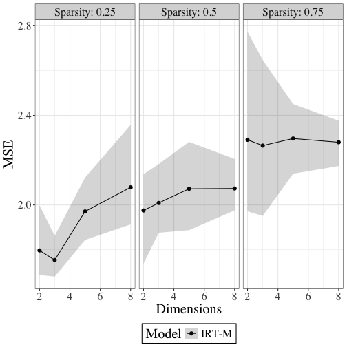
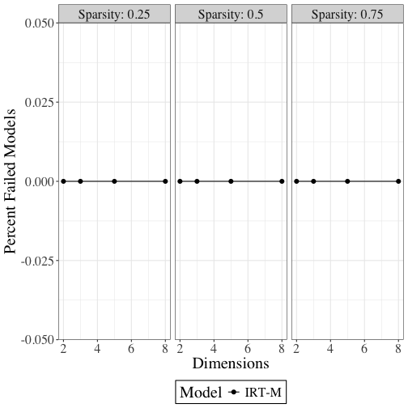

This script to produce a central runtime file for the 
simulations that analyze IRT-M vs Bayesian CFA and SEM
(as implemented in blavaan)
Last updated: 2025-07-23 06:57:46.32336


# Simulations:


Run baseline simulations
50 reps each of:
N = 100, K = 10, lambda sparsity = 0.75
d = c(2, 4, 6, 8)
Note: Runs in about 10 hours on macbook pro
updated 6/21/25 to register time in seconds


``` r
#source("bsem_N100_K10.R") ## ~ 200 entries
```

produces: 
irtm_bcfa_bsem_N100K10.rds ## model results
small_sim_params.rds ## df of parameters
irtm_bcfa_bsem_N100K10_time.rds ## runtime
Produce results figures:


``` r
source("bsem_results_plots.R", echo = TRUE)
```

```
## 
## > ## Results:
## > ## takes dataframe of results
## > ## produces graphs
## > 
## > library(dplyr)
## 
## > library(tidyr)
## 
## > library(ggplot2)
## 
## > source('irtm_bsem_results_to_df.R') ## script to format list of results as single df
## 
## > source('na_indicies.R') # helper to find NA values in model comparisons
## 
## > ## Load data:
## > ## params:
## > load("small_sim_params.rds")
## 
## > ## all_results:
## > load("irtm_bcfa_bsem_N100K10.rds")
## 
## > ## model_times:
## > load("irtm_bcfa_bsem_N100K10_time.rds")
## 
## > ## %%%%%%%%%%%%% Data Prep
## > ## Standardize list names for the time list:
## > 
## > all_results <- lapply(all_results, function(x) {
## +   if ("irtM" %in%  .... [TRUNCATED] 
## 
## > all_results <- lapply(all_results, function(x) {
## +   if ("CFA" %in% names(x)) {
## +     names(x)[names(x) == "CFA"] <- "bcfa"
## +   }
## +   return(x)
## + })
## 
## > ## get index of NA values in the sim results
## > ## NA out the time runs for those models
## > ## (to not distort estimated time)
## > 
## > na_ind <-na_indici .... [TRUNCATED] 
## 
## > ## update time to NA out times for failed models:
## > updated_time <- na_times(model_times, na_ind)
## [1] "making changes"
## [1] 1
## [1] 2
## [1] 3
## [1] 4
## [1] 5
## [1] 6
## [1] 7
## [1] 8
## [1] 9
## [1] 10
## [1] 11
## [1] 12
## [1] 13
## [1] 14
## [1] 15
## [1] 16
## [1] 17
## [1] 18
## [1] 19
## [1] 20
## [1] 21
## [1] 22
## [1] 23
## [1] 24
## [1] 25
## [1] 26
## [1] 27
## [1] 28
## [1] 29
## [1] 30
## [1] 31
## [1] 32
## [1] 33
## [1] 34
## [1] 35
## [1] 36
## [1] 37
## [1] 38
## [1] 39
## [1] 40
## [1] 41
## [1] 42
## [1] 43
## [1] 44
## [1] 45
## [1] 46
## [1] 47
## [1] 48
## [1] 49
## [1] 50
## [1] 51
## [1] 52
## [1] 53
## [1] 54
## [1] 55
## [1] 56
## [1] 57
## [1] 58
## [1] 59
## [1] 60
## [1] 61
## [1] 62
## [1] 63
## [1] 64
## [1] 65
## [1] 66
## [1] 67
## [1] 68
## [1] 69
## [1] 70
## [1] 71
## [1] 72
## [1] 73
## [1] 74
## [1] 75
## [1] 76
## [1] 77
## 
## > ##%%%%%%%%%%%%%%%%%
## > ## Process the results from a list to a df:
## > 
## > ## Data for Fig 1: MSE by model:
## > sim_results <- bsem_results_to_df(all_resu .... [TRUNCATED] 
## [1] 1
## [1] 2
## [1] 3
## [1] 4
## [1] 5
## [1] 6
## [1] 7
## [1] 8
## [1] 9
## [1] 10
## [1] 11
## [1] 12
## [1] 13
## [1] 14
## [1] 15
## [1] 16
## [1] 17
## [1] 18
## [1] 19
## [1] 20
## [1] 21
## [1] 22
## [1] 23
## [1] 24
## [1] 25
## [1] 26
## [1] 27
## [1] 28
## [1] 29
## [1] 30
## [1] 31
## [1] 32
## [1] 33
## [1] 34
## [1] 35
## [1] 36
## [1] 37
## [1] 38
## [1] 39
## [1] 40
## [1] 41
## [1] 42
## [1] 43
## [1] 44
## [1] 45
## [1] 46
## [1] 47
## [1] 48
## [1] 49
## [1] 50
## [1] 51
## [1] 52
## [1] 53
## [1] 54
## [1] 55
## [1] 56
## [1] 57
## [1] 58
## [1] 59
## [1] 60
## [1] 61
## [1] 62
## [1] 63
## [1] 64
## [1] 65
## [1] 66
## [1] 67
## [1] 68
## [1] 69
## [1] 70
## [1] 71
## [1] 72
## [1] 73
## [1] 74
## [1] 75
## [1] 76
## [1] 77
## [1] 78
## [1] 79
## [1] 80
## [1] 81
## [1] 82
## [1] 83
## [1] 84
## [1] 85
## [1] 86
## [1] 87
## [1] 88
## [1] 89
## [1] 90
## [1] 91
## [1] 92
## [1] 93
## [1] 94
## [1] 95
## [1] 96
## [1] 97
## [1] 98
## [1] 99
## [1] 100
## [1] 101
## [1] 102
## [1] 103
## [1] 104
## [1] 105
## [1] 106
## [1] 107
## [1] 108
## [1] 109
## [1] 110
## [1] 111
## [1] 112
## [1] 113
## [1] 114
## [1] 115
## [1] 116
## [1] 117
## [1] 118
## [1] 119
## [1] 120
## [1] 121
## [1] 122
## [1] 123
## [1] 124
## [1] 125
## [1] 126
## [1] 127
## [1] 128
## [1] 129
## [1] 130
## [1] 131
## [1] 132
## [1] 133
## [1] 134
## [1] 135
## [1] 136
## [1] 137
## [1] 138
## [1] 139
## [1] 140
## [1] 141
## [1] 142
## [1] 143
## [1] 144
## [1] 145
## [1] 146
## [1] 147
## [1] 148
## [1] 149
## [1] 150
## [1] 151
## [1] 152
## [1] 153
## [1] 154
## [1] 155
## [1] 156
## [1] 157
## [1] 158
## [1] 159
## [1] 160
## [1] 161
## [1] 162
## [1] 163
## [1] 164
## [1] 165
## [1] 166
## [1] 167
## [1] 168
## [1] 169
## [1] 170
## [1] 171
## [1] 172
## [1] 173
## [1] 174
## [1] 175
## [1] 176
## [1] 177
## [1] 178
## [1] 179
## [1] 180
## [1] 181
## [1] 182
## [1] 183
## [1] 184
## [1] 185
## [1] 186
## [1] 187
## [1] 188
## [1] 189
## [1] 190
## [1] 191
## [1] 192
## [1] 193
## [1] 194
## [1] 195
## [1] 196
## [1] 197
## [1] 198
## [1] 199
## [1] 200
## 
## > sim_results$statistic <- "mse" # for tracking
## 
## > ## Data for Fig 2: Runtime by model
## > time_results <- bsem_results_to_df(updated_time,
## +                                    small_sim,
## +             .... [TRUNCATED] 
## [1] 1
## [1] 2
## [1] 3
## [1] 4
## [1] 5
## [1] 6
## [1] 7
## [1] 8
## [1] 9
## [1] 10
## [1] 11
## [1] 12
## [1] 13
## [1] 14
## [1] 15
## [1] 16
## [1] 17
## [1] 18
## [1] 19
## [1] 20
## [1] 21
## [1] 22
## [1] 23
## [1] 24
## [1] 25
## [1] 26
## [1] 27
## [1] 28
## [1] 29
## [1] 30
## [1] 31
## [1] 32
## [1] 33
## [1] 34
## [1] 35
## [1] 36
## [1] 37
## [1] 38
## [1] 39
## [1] 40
## [1] 41
## [1] 42
## [1] 43
## [1] 44
## [1] 45
## [1] 46
## [1] 47
## [1] 48
## [1] 49
## [1] 50
## [1] 51
## [1] 52
## [1] 53
## [1] 54
## [1] 55
## [1] 56
## [1] 57
## [1] 58
## [1] 59
## [1] 60
## [1] 61
## [1] 62
## [1] 63
## [1] 64
## [1] 65
## [1] 66
## [1] 67
## [1] 68
## [1] 69
## [1] 70
## [1] 71
## [1] 72
## [1] 73
## [1] 74
## [1] 75
## [1] 76
## [1] 77
## [1] 78
## [1] 79
## [1] 80
## [1] 81
## [1] 82
## [1] 83
## [1] 84
## [1] 85
## [1] 86
## [1] 87
## [1] 88
## [1] 89
## [1] 90
## [1] 91
## [1] 92
## [1] 93
## [1] 94
## [1] 95
## [1] 96
## [1] 97
## [1] 98
## [1] 99
## [1] 100
## [1] 101
## [1] 102
## [1] 103
## [1] 104
## [1] 105
## [1] 106
## [1] 107
## [1] 108
## [1] 109
## [1] 110
## [1] 111
## [1] 112
## [1] 113
## [1] 114
## [1] 115
## [1] 116
## [1] 117
## [1] 118
## [1] 119
## [1] 120
## [1] 121
## [1] 122
## [1] 123
## [1] 124
## [1] 125
## [1] 126
## [1] 127
## [1] 128
## [1] 129
## [1] 130
## [1] 131
## [1] 132
## [1] 133
## [1] 134
## [1] 135
## [1] 136
## [1] 137
## [1] 138
## [1] 139
## [1] 140
## [1] 141
## [1] 142
## [1] 143
## [1] 144
## [1] 145
## [1] 146
## [1] 147
## [1] 148
## [1] 149
## [1] 150
## [1] 151
## [1] 152
## [1] 153
## [1] 154
## [1] 155
## [1] 156
## [1] 157
## [1] 158
## [1] 159
## [1] 160
## [1] 161
## [1] 162
## [1] 163
## [1] 164
## [1] 165
## [1] 166
## [1] 167
## [1] 168
## [1] 169
## [1] 170
## [1] 171
## [1] 172
## [1] 173
## [1] 174
## [1] 175
## [1] 176
## [1] 177
## [1] 178
## [1] 179
## [1] 180
## [1] 181
## [1] 182
## [1] 183
## [1] 184
## [1] 185
## [1] 186
## [1] 187
## [1] 188
## [1] 189
## [1] 190
## [1] 191
## [1] 192
## [1] 193
## [1] 194
## [1] 195
## [1] 196
## [1] 197
## [1] 198
## [1] 199
## [1] 200
## 
## > time_results$statistic <- "runtime"
## 
## > ## Data for Fig 3:  count NA by models:
## > na_count_by_group <- bsem_results_to_df(all_results,
## +                                          small_sim, .... [TRUNCATED] 
## [1] 1
## [1] 2
## [1] 3
## [1] 4
## [1] 5
## [1] 6
## [1] 7
## [1] 8
## [1] 9
## [1] 10
## [1] 11
## [1] 12
## [1] 13
## [1] 14
## [1] 15
## [1] 16
## [1] 17
## [1] 18
## [1] 19
## [1] 20
## [1] 21
## [1] 22
## [1] 23
## [1] 24
## [1] 25
## [1] 26
## [1] 27
## [1] 28
## [1] 29
## [1] 30
## [1] 31
## [1] 32
## [1] 33
## [1] 34
## [1] 35
## [1] 36
## [1] 37
## [1] 38
## [1] 39
## [1] 40
## [1] 41
## [1] 42
## [1] 43
## [1] 44
## [1] 45
## [1] 46
## [1] 47
## [1] 48
## [1] 49
## [1] 50
## [1] 51
## [1] 52
## [1] 53
## [1] 54
## [1] 55
## [1] 56
## [1] 57
## [1] 58
## [1] 59
## [1] 60
## [1] 61
## [1] 62
## [1] 63
## [1] 64
## [1] 65
## [1] 66
## [1] 67
## [1] 68
## [1] 69
## [1] 70
## [1] 71
## [1] 72
## [1] 73
## [1] 74
## [1] 75
## [1] 76
## [1] 77
## [1] 78
## [1] 79
## [1] 80
## [1] 81
## [1] 82
## [1] 83
## [1] 84
## [1] 85
## [1] 86
## [1] 87
## [1] 88
## [1] 89
## [1] 90
## [1] 91
## [1] 92
## [1] 93
## [1] 94
## [1] 95
## [1] 96
## [1] 97
## [1] 98
## [1] 99
## [1] 100
## [1] 101
## [1] 102
## [1] 103
## [1] 104
## [1] 105
## [1] 106
## [1] 107
## [1] 108
## [1] 109
## [1] 110
## [1] 111
## [1] 112
## [1] 113
## [1] 114
## [1] 115
## [1] 116
## [1] 117
## [1] 118
## [1] 119
## [1] 120
## [1] 121
## [1] 122
## [1] 123
## [1] 124
## [1] 125
## [1] 126
## [1] 127
## [1] 128
## [1] 129
## [1] 130
## [1] 131
## [1] 132
## [1] 133
## [1] 134
## [1] 135
## [1] 136
## [1] 137
## [1] 138
## [1] 139
## [1] 140
## [1] 141
## [1] 142
## [1] 143
## [1] 144
## [1] 145
## [1] 146
## [1] 147
## [1] 148
## [1] 149
## [1] 150
## [1] 151
## [1] 152
## [1] 153
## [1] 154
## [1] 155
## [1] 156
## [1] 157
## [1] 158
## [1] 159
## [1] 160
## [1] 161
## [1] 162
## [1] 163
## [1] 164
## [1] 165
## [1] 166
## [1] 167
## [1] 168
## [1] 169
## [1] 170
## [1] 171
## [1] 172
## [1] 173
## [1] 174
## [1] 175
## [1] 176
## [1] 177
## [1] 178
## [1] 179
## [1] 180
## [1] 181
## [1] 182
## [1] 183
## [1] 184
## [1] 185
## [1] 186
## [1] 187
## [1] 188
## [1] 189
## [1] 190
## [1] 191
## [1] 192
## [1] 193
## [1] 194
## [1] 195
## [1] 196
## [1] 197
## [1] 198
## [1] 199
## [1] 200
## 
## > ##%%%%%%%%%%%%%%%%%%%%
## > ## Plots:
## > 
## > p_results <- ggplot(sim_results, aes(x= pass_d, 
## +                        y=avg,
## +                       ymi .... [TRUNCATED] 
## 
## > p_results
```

```
## 
## > ggsave(filename='simulations/results/figures/irt-bsem-bcfa.png', 
## +        plot=p_results,
## +        dpi = 300,  width = 12, height=6)
```


```
## 
## > ## Time comparison
## > 
## > p_time <- ggplot(time_results, aes(x= pass_d, 
## +                                      y=avg,
## +                               .... [TRUNCATED] 
## 
## > p_time
```

```
## 
## > ggsave(filename='simulations/results/figures/runtime_irt-bsem-bcfa.png', 
## +        plot=p_time,
## +        dpi = 300,  width = 12, height=6)
```


```
## 
## > ## Percent failed models:
## > ## first count NA results by model and d specification
## > 
## > ## Summarize the number of failed models
## > ## per dimension- .... [TRUNCATED] 
## 
## > ggmiss
```

```
## 
## > ggsave(filename='simulations/results/figures/failed_models.png',
## +        plot=ggmiss,
## +        dpi = 300, 
## +        width = 12, 
## +        height=6)
```


```
## 
## > ## Boxplot for runtime, to get visibility into the 
## > ## time spike at D=2
## > 
## > ## For Fig 4: boxplot of run times
## > 
## > runtime_all <- bsem_results_ .... [TRUNCATED] 
## [1] 1
## [1] 2
## [1] 3
## [1] 4
## [1] 5
## [1] 6
## [1] 7
## [1] 8
## [1] 9
## [1] 10
## [1] 11
## [1] 12
## [1] 13
## [1] 14
## [1] 15
## [1] 16
## [1] 17
## [1] 18
## [1] 19
## [1] 20
## [1] 21
## [1] 22
## [1] 23
## [1] 24
## [1] 25
## [1] 26
## [1] 27
## [1] 28
## [1] 29
## [1] 30
## [1] 31
## [1] 32
## [1] 33
## [1] 34
## [1] 35
## [1] 36
## [1] 37
## [1] 38
## [1] 39
## [1] 40
## [1] 41
## [1] 42
## [1] 43
## [1] 44
## [1] 45
## [1] 46
## [1] 47
## [1] 48
## [1] 49
## [1] 50
## [1] 51
## [1] 52
## [1] 53
## [1] 54
## [1] 55
## [1] 56
## [1] 57
## [1] 58
## [1] 59
## [1] 60
## [1] 61
## [1] 62
## [1] 63
## [1] 64
## [1] 65
## [1] 66
## [1] 67
## [1] 68
## [1] 69
## [1] 70
## [1] 71
## [1] 72
## [1] 73
## [1] 74
## [1] 75
## [1] 76
## [1] 77
## [1] 78
## [1] 79
## [1] 80
## [1] 81
## [1] 82
## [1] 83
## [1] 84
## [1] 85
## [1] 86
## [1] 87
## [1] 88
## [1] 89
## [1] 90
## [1] 91
## [1] 92
## [1] 93
## [1] 94
## [1] 95
## [1] 96
## [1] 97
## [1] 98
## [1] 99
## [1] 100
## [1] 101
## [1] 102
## [1] 103
## [1] 104
## [1] 105
## [1] 106
## [1] 107
## [1] 108
## [1] 109
## [1] 110
## [1] 111
## [1] 112
## [1] 113
## [1] 114
## [1] 115
## [1] 116
## [1] 117
## [1] 118
## [1] 119
## [1] 120
## [1] 121
## [1] 122
## [1] 123
## [1] 124
## [1] 125
## [1] 126
## [1] 127
## [1] 128
## [1] 129
## [1] 130
## [1] 131
## [1] 132
## [1] 133
## [1] 134
## [1] 135
## [1] 136
## [1] 137
## [1] 138
## [1] 139
## [1] 140
## [1] 141
## [1] 142
## [1] 143
## [1] 144
## [1] 145
## [1] 146
## [1] 147
## [1] 148
## [1] 149
## [1] 150
## [1] 151
## [1] 152
## [1] 153
## [1] 154
## [1] 155
## [1] 156
## [1] 157
## [1] 158
## [1] 159
## [1] 160
## [1] 161
## [1] 162
## [1] 163
## [1] 164
## [1] 165
## [1] 166
## [1] 167
## [1] 168
## [1] 169
## [1] 170
## [1] 171
## [1] 172
## [1] 173
## [1] 174
## [1] 175
## [1] 176
## [1] 177
## [1] 178
## [1] 179
## [1] 180
## [1] 181
## [1] 182
## [1] 183
## [1] 184
## [1] 185
## [1] 186
## [1] 187
## [1] 188
## [1] 189
## [1] 190
## [1] 191
## [1] 192
## [1] 193
## [1] 194
## [1] 195
## [1] 196
## [1] 197
## [1] 198
## [1] 199
## [1] 200
## 
## > runtime_all$statistic <- "runtime" ## to keep track
## 
## > runtime_all <- runtime_all[, c('irtm', 'bsem', 'bcfa', 'pass_d')] %>% 
## +   pivot_longer(
## +   cols = c('irtm', 'bsem', 'bcfa'),  # Select the columns .... [TRUNCATED] 
## 
## > ## Individual plots for runtime box plots; b/c the 
## > ## scales
## > grtbox <- ggplot(runtime_all, 
## +        aes(x=as.factor(pass_d),
## +            y=va .... [TRUNCATED] 
## 
## > grtbox
```

```
## Warning: Removed 77 rows containing non-finite outside the scale range (`stat_boxplot()`).
```

```
## Warning: Removed 77 rows containing missing values or values outside the scale range
## (`geom_point()`).
```

```
## 
## > ggsave(filename='simulations/results/figures/runtime_boxplot.png',
## +        plot=grtbox,
## +        dpi = 300, 
## +        width = 12, 
## +        height= .... [TRUNCATED]
```

```
## Warning: Removed 77 rows containing non-finite outside the scale range (`stat_boxplot()`).
## Removed 77 rows containing missing values or values outside the scale range (`geom_point()`).
```


Simulation for effect of Lambda Sparsity
120 entries, runs in about 8 hours on macbook pro
 source("bsem_lambda_sparsity_sim.R")
produces:
irtm_bcfa_bsem_lambda_sparsity_time.rds
irtm_bcfa_bsem_lambda_sparsity.rds
small_sim_params_sparsity.rds ## parameters


``` r
#source("bsem_lambda_sparsity_sim.R")
## produces:
## irtm_bcfa_bsem_lambda_sparsity_time.rds
## irtm_bcfa_bsem_lambda_sparsity.rds
## small_sim_params_sparsity.rds ## parameters
## 
## Produce results figures:
source("lamba_sparsity_plots.R", echo = TRUE)
```

```
## 
## > ## Results:
## > ## takes dataframe of results
## > ## produces graphs
## > 
## > library(dplyr)
## 
## > library(tidyr)
## 
## > library(ggplot2)
## 
## > source('irtm_bsem_results_to_df_lambds.R') ## script to format list of results as single df
## 
## > source('na_indicies.R') # helper to find NA values in model comparisons
## 
## > ## Load data:
## > 
## > ## params:
## > load("small_sim_params_sparsity.rds")
## 
## > ## all_results:
## > load("irtm_bcfa_bsem_lambda_sparsity.rds")
## 
## > ## model_times:
## > load("irtm_bcfa_bsem_lambda_sparsity_time.rds")
## 
## > ## %%%%%%%%%%%%% Data Prep
## > ## Standardize list names for the time list:
## > 
## > all_results <- lapply(all_results, function(x) {
## +   if ("irtM" %in%  .... [TRUNCATED] 
## 
## > all_results <- lapply(all_results, function(x) {
## +   if ("CFA" %in% names(x)) {
## +     names(x)[names(x) == "CFA"] <- "bcfa"
## +   }
## +   return(x)
## + })
## 
## > ## get index of NA values in the sim results
## > ## NA out the time runs for those models
## > ## (to not distort estimated time)
## > 
## > na_ind <-na_indici .... [TRUNCATED] 
## 
## > ## update time to NA out times for failed models:
## > updated_time <- na_times(model_times, na_ind)
## [1] "making changes"
## [1] 1
## [1] 2
## [1] 3
## [1] 4
## [1] 5
## [1] 6
## [1] 7
## [1] 8
## [1] 9
## [1] 10
## [1] 11
## [1] 12
## [1] 13
## [1] 14
## [1] 15
## [1] 16
## [1] 17
## [1] 18
## [1] 19
## [1] 20
## [1] 21
## [1] 22
## [1] 23
## [1] 24
## [1] 25
## [1] 26
## [1] 27
## [1] 28
## [1] 29
## [1] 30
## [1] 31
## [1] 32
## [1] 33
## [1] 34
## [1] 35
## [1] 36
## [1] 37
## [1] 38
## [1] 39
## [1] 40
## [1] 41
## [1] 42
## [1] 43
## [1] 44
## [1] 45
## [1] 46
## [1] 47
## [1] 48
## [1] 49
## [1] 50
## [1] 51
## [1] 52
## [1] 53
## [1] 54
## [1] 55
## 
## > ##############
## > ## Helper format processing 
## > 
## > 
## > ##%%%%%%%%%%%%%%%%%%%%%
## > 
## > ## Process the results from a list to a df:
## > 
## > ## Need to modif .... [TRUNCATED] 
## [1] 1
## [1] 2
## [1] 3
## [1] 4
## [1] 5
## [1] 6
## [1] 7
## [1] 8
## [1] 9
## [1] 10
## [1] 11
## [1] 12
## [1] 13
## [1] 14
## [1] 15
## [1] 16
## [1] 17
## [1] 18
## [1] 19
## [1] 20
## [1] 21
## [1] 22
## [1] 23
## [1] 24
## [1] 25
## [1] 26
## [1] 27
## [1] 28
## [1] 29
## [1] 30
## [1] 31
## [1] 32
## [1] 33
## [1] 34
## [1] 35
## [1] 36
## [1] 37
## [1] 38
## [1] 39
## [1] 40
## [1] 41
## [1] 42
## [1] 43
## [1] 44
## [1] 45
## [1] 46
## [1] 47
## [1] 48
## [1] 49
## [1] 50
## [1] 51
## [1] 52
## [1] 53
## [1] 54
## [1] 55
## [1] 56
## [1] 57
## [1] 58
## [1] 59
## [1] 60
## [1] 61
## [1] 62
## [1] 63
## [1] 64
## [1] 65
## [1] 66
## [1] 67
## [1] 68
## [1] 69
## [1] 70
## [1] 71
## [1] 72
## [1] 73
## [1] 74
## [1] 75
## [1] 76
## [1] 77
## [1] 78
## [1] 79
## [1] 80
## [1] 81
## [1] 82
## [1] 83
## [1] 84
## [1] 85
## [1] 86
## [1] 87
## [1] 88
## [1] 89
## [1] 90
## [1] 91
## [1] 92
## [1] 93
## [1] 94
## [1] 95
## [1] 96
## [1] 97
## [1] 98
## [1] 99
## [1] 100
## [1] 101
## [1] 102
## [1] 103
## [1] 104
## [1] 105
## [1] 106
## [1] 107
## [1] 108
## [1] 109
## [1] 110
## [1] 111
## [1] 112
## [1] 113
## [1] 114
## [1] 115
## [1] 116
## [1] 117
## [1] 118
## [1] 119
## [1] 120
```

```
## `summarise()` has grouped output by 'pass_d'. You can override using the `.groups` argument.
```

```
## 
## > sim_results$statistic <- "MSE" # for tracking
## 
## > ## Data for Fig 2: Runtime by model
## > time_results <- bsem_results_to_df2(updated_time,
## +                                    small_sim,
## +            .... [TRUNCATED] 
## [1] 1
## [1] 2
## [1] 3
## [1] 4
## [1] 5
## [1] 6
## [1] 7
## [1] 8
## [1] 9
## [1] 10
## [1] 11
## [1] 12
## [1] 13
## [1] 14
## [1] 15
## [1] 16
## [1] 17
## [1] 18
## [1] 19
## [1] 20
## [1] 21
## [1] 22
## [1] 23
## [1] 24
## [1] 25
## [1] 26
## [1] 27
## [1] 28
## [1] 29
## [1] 30
## [1] 31
## [1] 32
## [1] 33
## [1] 34
## [1] 35
## [1] 36
## [1] 37
## [1] 38
## [1] 39
## [1] 40
## [1] 41
## [1] 42
## [1] 43
## [1] 44
## [1] 45
## [1] 46
## [1] 47
## [1] 48
## [1] 49
## [1] 50
## [1] 51
## [1] 52
## [1] 53
## [1] 54
## [1] 55
## [1] 56
## [1] 57
## [1] 58
## [1] 59
## [1] 60
## [1] 61
## [1] 62
## [1] 63
## [1] 64
## [1] 65
## [1] 66
## [1] 67
## [1] 68
## [1] 69
## [1] 70
## [1] 71
## [1] 72
## [1] 73
## [1] 74
## [1] 75
## [1] 76
## [1] 77
## [1] 78
## [1] 79
## [1] 80
## [1] 81
## [1] 82
## [1] 83
## [1] 84
## [1] 85
## [1] 86
## [1] 87
## [1] 88
## [1] 89
## [1] 90
## [1] 91
## [1] 92
## [1] 93
## [1] 94
## [1] 95
## [1] 96
## [1] 97
## [1] 98
## [1] 99
## [1] 100
## [1] 101
## [1] 102
## [1] 103
## [1] 104
## [1] 105
## [1] 106
## [1] 107
## [1] 108
## [1] 109
## [1] 110
## [1] 111
## [1] 112
## [1] 113
## [1] 114
## [1] 115
## [1] 116
## [1] 117
## [1] 118
## [1] 119
## [1] 120
```

```
## `summarise()` has grouped output by 'pass_d'. You can override using the `.groups` argument.
```

```
## 
## > time_results$statistic <- "runtime"
## 
## > ## Data for Fig 3:  count NA by models:
## > na_count_by_group <- bsem_results_to_df2(all_results,
## +                                         small_sim, .... [TRUNCATED] 
## [1] 1
## [1] 2
## [1] 3
## [1] 4
## [1] 5
## [1] 6
## [1] 7
## [1] 8
## [1] 9
## [1] 10
## [1] 11
## [1] 12
## [1] 13
## [1] 14
## [1] 15
## [1] 16
## [1] 17
## [1] 18
## [1] 19
## [1] 20
## [1] 21
## [1] 22
## [1] 23
## [1] 24
## [1] 25
## [1] 26
## [1] 27
## [1] 28
## [1] 29
## [1] 30
## [1] 31
## [1] 32
## [1] 33
## [1] 34
## [1] 35
## [1] 36
## [1] 37
## [1] 38
## [1] 39
## [1] 40
## [1] 41
## [1] 42
## [1] 43
## [1] 44
## [1] 45
## [1] 46
## [1] 47
## [1] 48
## [1] 49
## [1] 50
## [1] 51
## [1] 52
## [1] 53
## [1] 54
## [1] 55
## [1] 56
## [1] 57
## [1] 58
## [1] 59
## [1] 60
## [1] 61
## [1] 62
## [1] 63
## [1] 64
## [1] 65
## [1] 66
## [1] 67
## [1] 68
## [1] 69
## [1] 70
## [1] 71
## [1] 72
## [1] 73
## [1] 74
## [1] 75
## [1] 76
## [1] 77
## [1] 78
## [1] 79
## [1] 80
## [1] 81
## [1] 82
## [1] 83
## [1] 84
## [1] 85
## [1] 86
## [1] 87
## [1] 88
## [1] 89
## [1] 90
## [1] 91
## [1] 92
## [1] 93
## [1] 94
## [1] 95
## [1] 96
## [1] 97
## [1] 98
## [1] 99
## [1] 100
## [1] 101
## [1] 102
## [1] 103
## [1] 104
## [1] 105
## [1] 106
## [1] 107
## [1] 108
## [1] 109
## [1] 110
## [1] 111
## [1] 112
## [1] 113
## [1] 114
## [1] 115
## [1] 116
## [1] 117
## [1] 118
## [1] 119
## [1] 120
```

```
## `summarise()` has grouped output by 'pass_d'. You can override using the `.groups` argument.
```

```
## 
## > ##%%%%%%%%%%%%%%%%%%%%
## > ## Plots:
## > 
## > p_results <- ggplot(sim_results, aes(x= pass_d, 
## +                                      y=avg,
## +             .... [TRUNCATED] 
## 
## > p_results
```

```
## 
## > ggsave(filename='simulations/results/figures/irt-bsem-bcfa_sparsity.png', 
## +        plot=p_results,
## +        dpi = 300,  width = 12, height=6)
```


```
## 
## > ## Time comparison
## > 
## > ## the long bcfa and bsem times overwhelm variation in IRTM times:
## > 
## > ## Might wnat to make this into a table:
## > ## number .... [TRUNCATED] 
## # A tibble: 12 × 7
## # Groups:   pass_d [4]
##    pass_d Sparsity model   avg   min   max statistic
##     <dbl>    <dbl> <chr> <dbl> <dbl> <dbl> <chr>    
##  1      2     0.25 IRT-M 0.652 0.611 0.737 runtime  
##  2      2     0.5  IRT-M 0.694 0.620 1.07  runtime  
##  3      2     0.75 IRT-M 0.648 0.601 0.844 runtime  
##  4      3     0.25 IRT-M 0.779 0.706 0.936 runtime  
##  5      3     0.5  IRT-M 0.736 0.704 0.784 runtime  
##  6      3     0.75 IRT-M 0.765 0.712 1.04  runtime  
##  7      5     0.25 IRT-M 1.16  1.12  1.25  runtime  
##  8      5     0.5  IRT-M 1.13  1.10  1.16  runtime  
##  9      5     0.75 IRT-M 1.12  1.10  1.15  runtime  
## 10      8     0.25 IRT-M 1.85  1.79  2.09  runtime  
## 11      8     0.5  IRT-M 1.88  1.78  2.14  runtime  
## 12      8     0.75 IRT-M 1.80  1.75  1.89  runtime  
## 
## > p_time <- ggplot(time_results, aes(x= pass_d, 
## +                                    y=avg,
## +                                    ymin=min, 
## +         .... [TRUNCATED] 
## 
## > p_time
```

```
## 
## > ggsave(filename='simulations/results/figures/runtime_irt-bsem-bcfa_lambda_sparse.png', 
## +        plot=p_time,
## +        dpi = 300,  width = 12, heigh .... [TRUNCATED]
```


```
## 
## > ## Percent failed models:
## > ## first count NA results by model and d specification
## > 
## > ## Summarize the number of failed models
## > ## per dimension- .... [TRUNCATED] 
## 
## > ggmiss
```

```
## 
## > ggsave(filename='simulations/results/figures/failed_models_lambda.png',
## +        plot=ggmiss,
## +        dpi = 300, 
## +        width = 12, 
## +        he .... [TRUNCATED]
```


``` r
##%%%%%%%%%%%%%%%%%%% 
## Benchmark time for a wider range of results:
##%%%%%%%%%%%%%%%%%%%%%%
```

simulation
runs a wider N, K range for 10 passes each.
Adjusted to standardize to seconds 6/25
480 entries, less cases where d > k
took almost 20 days on macbook pro
(commented out because of time)
entire set, saves intermediate every 5:


``` r
#source("irtm_bsem_bcfa_sim_single_pass_for_time.R")
 
## #' plots
source("irtm_bsem_range_plots.R", echo = TRUE)
```

```
## 
## > library(dplyr)
## 
## > library(tidyverse)
## 
## > library(ggplot2)
## 
## > source('results_to_df_range.R') ## script to format list of results as single df
## 
## > source('na_indicies.R') # helper to find NA values in model comparisons
## 
## > ## Load data:
## > ## Partial:
## > #load("irtm_bcfa_bsem_params_partial_.rds")
## > ## all_results:
## > #load("irtm_bcfa_bsem_time_partial_.rds")
## > ## model_t .... [TRUNCATED] 
## 
## > load("irtm_bcfa_bsem_time_single_pass.rds")
## 
## > load("irtm_bcfa_bsem_params_single_pass.rds")
## 
## > ##
## > all_results <- lapply(all_results, function(x) {
## +   if ("irtM" %in% names(x)) {
## +     names(x)[names(x) == "irtM"] <- "irtm"
## +   }
## +   return( .... [TRUNCATED] 
## 
## > all_results <- lapply(all_results, function(x) {
## +   if ("CFA" %in% names(x)) {
## +     names(x)[names(x) == "CFA"] <- "bcfa"
## +   }
## +   return(x)
## + })
## 
## > ## get index of NA values in the sim results
## > ## NA out the time runs for those models
## > ## (to not distort estimated time)
## > ## first column is ro .... [TRUNCATED] 
## 
## > ## update time to NA out times for failed models:
## > updated_time <- na_times(model_times, na_ind)
## [1] "making changes"
## [1] 1
## [1] 2
## [1] 3
## [1] 4
## [1] 5
## [1] 6
## [1] 7
## [1] 8
## [1] 9
## [1] 10
## [1] 11
## [1] 12
## [1] 13
## [1] 14
## [1] 15
## [1] 16
## [1] 17
## [1] 18
## [1] 19
## [1] 20
## [1] 21
## [1] 22
## [1] 23
## [1] 24
## [1] 25
## [1] 26
## [1] 27
## [1] 28
## [1] 29
## [1] 30
## [1] 31
## [1] 32
## [1] 33
## [1] 34
## [1] 35
## [1] 36
## [1] 37
## [1] 38
## [1] 39
## [1] 40
## [1] 41
## [1] 42
## [1] 43
## [1] 44
## [1] 45
## [1] 46
## [1] 47
## [1] 48
## [1] 49
## [1] 50
## [1] 51
## [1] 52
## [1] 53
## [1] 54
## [1] 55
## [1] 56
## [1] 57
## [1] 58
## [1] 59
## [1] 60
## [1] 61
## [1] 62
## [1] 63
## [1] 64
## [1] 65
## [1] 66
## [1] 67
## [1] 68
## [1] 69
## [1] 70
## [1] 71
## [1] 72
## [1] 73
## [1] 74
## [1] 75
## [1] 76
## [1] 77
## [1] 78
## [1] 79
## [1] 80
## [1] 81
## [1] 82
## [1] 83
## [1] 84
## [1] 85
## [1] 86
## [1] 87
## [1] 88
## [1] 89
## [1] 90
## [1] 91
## [1] 92
## [1] 93
## [1] 94
## [1] 95
## [1] 96
## [1] 97
## [1] 98
## [1] 99
## [1] 100
## [1] 101
## [1] 102
## [1] 103
## [1] 104
## [1] 105
## [1] 106
## [1] 107
## [1] 108
## [1] 109
## [1] 110
## [1] 111
## [1] 112
## [1] 113
## [1] 114
## [1] 115
## [1] 116
## [1] 117
## [1] 118
## [1] 119
## [1] 120
## [1] 121
## [1] 122
## [1] 123
## [1] 124
## [1] 125
## [1] 126
## [1] 127
## [1] 128
## [1] 129
## [1] 130
## [1] 131
## [1] 132
## [1] 133
## [1] 134
## [1] 135
## [1] 136
## [1] 137
## [1] 138
## [1] 139
## [1] 140
## [1] 141
## [1] 142
## [1] 143
## [1] 144
## [1] 145
## [1] 146
## [1] 147
## [1] 148
## [1] 149
## [1] 150
## [1] 151
## [1] 152
## [1] 153
## [1] 154
## [1] 155
## [1] 156
## [1] 157
## [1] 158
## [1] 159
## [1] 160
## [1] 161
## [1] 162
## [1] 163
## [1] 164
## [1] 165
## [1] 166
## [1] 167
## [1] 168
## [1] 169
## [1] 170
## [1] 171
## [1] 172
## [1] 173
## [1] 174
## [1] 175
## [1] 176
## [1] 177
## 
## > ## Param list to df:
## > ## Need to remove null entries
## > ## but keep them!
## > 
## > # Initialize an empty list to store non-NULL values
## > non_null_params .... [TRUNCATED] 
## 
## > non_null_results <- compact(all_results)
## 
## > non_null_time <- compact(model_times)
## 
## > # Create a data frame from the non-NULL list
## > params_df <- bind_rows(non_null_params)
## 
## > ## Send results to dataframe:
## > 
## > sim_results <- bsem_results_to_df(non_null_results,
## +                                   params_df, 
## +             .... [TRUNCATED] 
## [1] 1
## [1] 2
## [1] 3
## [1] 4
## [1] 5
## [1] 6
## [1] 7
## [1] 8
## [1] 9
## [1] 10
## [1] 11
## [1] 12
## [1] 13
## [1] 14
## [1] 15
## [1] 16
## [1] 17
## [1] 18
## [1] 19
## [1] 20
## [1] 21
## [1] 22
## [1] 23
## [1] 24
## [1] 25
## [1] 26
## [1] 27
## [1] 28
## [1] 29
## [1] 30
## [1] 31
## [1] 32
## [1] 33
## [1] 34
## [1] 35
## [1] 36
## [1] 37
## [1] 38
## [1] 39
## [1] 40
## [1] 41
## [1] 42
## [1] 43
## [1] 44
## [1] 45
## [1] 46
## [1] 47
## [1] 48
## [1] 49
## [1] 50
## [1] 51
## [1] 52
## [1] 53
## [1] 54
## [1] 55
## [1] 56
## [1] 57
## [1] 58
## [1] 59
## [1] 60
## [1] 61
## [1] 62
## [1] 63
## [1] 64
## [1] 65
## [1] 66
## [1] 67
## [1] 68
## [1] 69
## [1] 70
## [1] 71
## [1] 72
## [1] 73
## [1] 74
## [1] 75
## [1] 76
## [1] 77
## [1] 78
## [1] 79
## [1] 80
## [1] 81
## [1] 82
## [1] 83
## [1] 84
## [1] 85
## [1] 86
## [1] 87
## [1] 88
## [1] 89
## [1] 90
## [1] 91
## [1] 92
## [1] 93
## [1] 94
## [1] 95
## [1] 96
## [1] 97
## [1] 98
## [1] 99
## [1] 100
## [1] 101
## [1] 102
## [1] 103
## [1] 104
## [1] 105
## [1] 106
## [1] 107
## [1] 108
## [1] 109
## [1] 110
## [1] 111
## [1] 112
## [1] 113
## [1] 114
## [1] 115
## [1] 116
## [1] 117
## [1] 118
## [1] 119
## [1] 120
## [1] 121
## [1] 122
## [1] 123
## [1] 124
## [1] 125
## [1] 126
## [1] 127
## [1] 128
## [1] 129
## [1] 130
## [1] 131
## [1] 132
## [1] 133
## [1] 134
## [1] 135
## [1] 136
## [1] 137
## [1] 138
## [1] 139
## [1] 140
## [1] 141
## [1] 142
## [1] 143
## [1] 144
## [1] 145
## [1] 146
## [1] 147
## [1] 148
## [1] 149
## [1] 150
## [1] 151
## [1] 152
## [1] 153
## [1] 154
## [1] 155
## [1] 156
## [1] 157
## [1] 158
## [1] 159
## [1] 160
## [1] 161
## [1] 162
## [1] 163
## [1] 164
## [1] 165
## [1] 166
## [1] 167
## [1] 168
## [1] 169
## [1] 170
## [1] 171
## [1] 172
## [1] 173
## [1] 174
## [1] 175
## [1] 176
## [1] 177
## [1] 178
## [1] 179
## [1] 180
## [1] 181
## [1] 182
## [1] 183
## [1] 184
## [1] 185
## [1] 186
## [1] 187
## [1] 188
## [1] 189
## [1] 190
## [1] 191
## [1] 192
## [1] 193
## [1] 194
## [1] 195
## [1] 196
## [1] 197
## [1] 198
## [1] 199
## [1] 200
## [1] 201
## [1] 202
## [1] 203
## [1] 204
## [1] 205
## [1] 206
## [1] 207
## [1] 208
## [1] 209
## [1] 210
## [1] 211
## [1] 212
## [1] 213
## [1] 214
## [1] 215
## [1] 216
## [1] 217
## [1] 218
## [1] 219
## [1] 220
## [1] 221
## [1] 222
## [1] 223
## [1] 224
## [1] 225
## [1] 226
## [1] 227
## [1] 228
## [1] 229
## [1] 230
## [1] 231
## [1] 232
## [1] 233
## [1] 234
## [1] 235
## [1] 236
## [1] 237
## [1] 238
## [1] 239
## [1] 240
## [1] 241
## [1] 242
## [1] 243
## [1] 244
## [1] 245
## [1] 246
## [1] 247
## [1] 248
## [1] 249
## [1] 250
## [1] 251
## [1] 252
## [1] 253
## [1] 254
## [1] 255
## [1] 256
## [1] 257
## [1] 258
## [1] 259
## [1] 260
## [1] 261
## [1] 262
## [1] 263
## [1] 264
## [1] 265
## [1] 266
## [1] 267
## [1] 268
## [1] 269
## [1] 270
## [1] 271
## [1] 272
## [1] 273
## [1] 274
## [1] 275
## [1] 276
## [1] 277
## [1] 278
## [1] 279
## [1] 280
## [1] 281
## [1] 282
## [1] 283
## [1] 284
## [1] 285
## [1] 286
## [1] 287
## [1] 288
## [1] 289
## [1] 290
## [1] 291
## [1] 292
## [1] 293
## [1] 294
## [1] 295
## [1] 296
## [1] 297
## [1] 298
## [1] 299
## [1] 300
## [1] 301
## [1] 302
## [1] 303
## [1] 304
## [1] 305
## [1] 306
## [1] 307
## [1] 308
## [1] 309
## [1] 310
## [1] 311
## [1] 312
## [1] 313
## [1] 314
## [1] 315
## [1] 316
## [1] 317
## [1] 318
## [1] 319
## [1] 320
## [1] 321
## [1] 322
## [1] 323
## [1] 324
## [1] 325
## [1] 326
## [1] 327
## [1] 328
## [1] 329
## [1] 330
## [1] 331
## [1] 332
## [1] 333
## [1] 334
## [1] 335
## [1] 336
## [1] 337
## [1] 338
## [1] 339
## [1] 340
## [1] 341
## [1] 342
## [1] 343
## [1] 344
## [1] 345
## [1] 346
## [1] 347
## [1] 348
## [1] 349
## [1] 350
## [1] 351
## [1] 352
## [1] 353
## [1] 354
## [1] 355
## [1] 356
## [1] 357
## [1] 358
## [1] 359
## [1] 360
## [1] 361
## [1] 362
## [1] 363
## [1] 364
## [1] 365
## [1] 366
## [1] 367
## [1] 368
## [1] 369
## [1] 370
## [1] 371
## [1] 372
## [1] 373
## [1] 374
## [1] 375
## [1] 376
## [1] 377
## [1] 378
## [1] 379
## [1] 380
## [1] 381
## [1] 382
## [1] 383
## [1] 384
## [1] 385
## [1] 386
## [1] 387
## [1] 388
## [1] 389
## [1] 390
## [1] 391
## [1] 392
## [1] 393
## [1] 394
## 
## > ## Runtime by model
## > time_results <- bsem_results_to_df(non_null_time ,
## +                                    params_df,
## +                           .... [TRUNCATED] 
## [1] 1
## [1] 2
## [1] 3
## [1] 4
## [1] 5
## [1] 6
## [1] 7
## [1] 8
## [1] 9
## [1] 10
## [1] 11
## [1] 12
## [1] 13
## [1] 14
## [1] 15
## [1] 16
## [1] 17
## [1] 18
## [1] 19
## [1] 20
## [1] 21
## [1] 22
## [1] 23
## [1] 24
## [1] 25
## [1] 26
## [1] 27
## [1] 28
## [1] 29
## [1] 30
## [1] 31
## [1] 32
## [1] 33
## [1] 34
## [1] 35
## [1] 36
## [1] 37
## [1] 38
## [1] 39
## [1] 40
## [1] 41
## [1] 42
## [1] 43
## [1] 44
## [1] 45
## [1] 46
## [1] 47
## [1] 48
## [1] 49
## [1] 50
## [1] 51
## [1] 52
## [1] 53
## [1] 54
## [1] 55
## [1] 56
## [1] 57
## [1] 58
## [1] 59
## [1] 60
## [1] 61
## [1] 62
## [1] 63
## [1] 64
## [1] 65
## [1] 66
## [1] 67
## [1] 68
## [1] 69
## [1] 70
## [1] 71
## [1] 72
## [1] 73
## [1] 74
## [1] 75
## [1] 76
## [1] 77
## [1] 78
## [1] 79
## [1] 80
## [1] 81
## [1] 82
## [1] 83
## [1] 84
## [1] 85
## [1] 86
## [1] 87
## [1] 88
## [1] 89
## [1] 90
## [1] 91
## [1] 92
## [1] 93
## [1] 94
## [1] 95
## [1] 96
## [1] 97
## [1] 98
## [1] 99
## [1] 100
## [1] 101
## [1] 102
## [1] 103
## [1] 104
## [1] 105
## [1] 106
## [1] 107
## [1] 108
## [1] 109
## [1] 110
## [1] 111
## [1] 112
## [1] 113
## [1] 114
## [1] 115
## [1] 116
## [1] 117
## [1] 118
## [1] 119
## [1] 120
## [1] 121
## [1] 122
## [1] 123
## [1] 124
## [1] 125
## [1] 126
## [1] 127
## [1] 128
## [1] 129
## [1] 130
## [1] 131
## [1] 132
## [1] 133
## [1] 134
## [1] 135
## [1] 136
## [1] 137
## [1] 138
## [1] 139
## [1] 140
## [1] 141
## [1] 142
## [1] 143
## [1] 144
## [1] 145
## [1] 146
## [1] 147
## [1] 148
## [1] 149
## [1] 150
## [1] 151
## [1] 152
## [1] 153
## [1] 154
## [1] 155
## [1] 156
## [1] 157
## [1] 158
## [1] 159
## [1] 160
## [1] 161
## [1] 162
## [1] 163
## [1] 164
## [1] 165
## [1] 166
## [1] 167
## [1] 168
## [1] 169
## [1] 170
## [1] 171
## [1] 172
## [1] 173
## [1] 174
## [1] 175
## [1] 176
## [1] 177
## [1] 178
## [1] 179
## [1] 180
## [1] 181
## [1] 182
## [1] 183
## [1] 184
## [1] 185
## [1] 186
## [1] 187
## [1] 188
## [1] 189
## [1] 190
## [1] 191
## [1] 192
## [1] 193
## [1] 194
## [1] 195
## [1] 196
## [1] 197
## [1] 198
## [1] 199
## [1] 200
## [1] 201
## [1] 202
## [1] 203
## [1] 204
## [1] 205
## [1] 206
## [1] 207
## [1] 208
## [1] 209
## [1] 210
## [1] 211
## [1] 212
## [1] 213
## [1] 214
## [1] 215
## [1] 216
## [1] 217
## [1] 218
## [1] 219
## [1] 220
## [1] 221
## [1] 222
## [1] 223
## [1] 224
## [1] 225
## [1] 226
## [1] 227
## [1] 228
## [1] 229
## [1] 230
## [1] 231
## [1] 232
## [1] 233
## [1] 234
## [1] 235
## [1] 236
## [1] 237
## [1] 238
## [1] 239
## [1] 240
## [1] 241
## [1] 242
## [1] 243
## [1] 244
## [1] 245
## [1] 246
## [1] 247
## [1] 248
## [1] 249
## [1] 250
## [1] 251
## [1] 252
## [1] 253
## [1] 254
## [1] 255
## [1] 256
## [1] 257
## [1] 258
## [1] 259
## [1] 260
## [1] 261
## [1] 262
## [1] 263
## [1] 264
## [1] 265
## [1] 266
## [1] 267
## [1] 268
## [1] 269
## [1] 270
## [1] 271
## [1] 272
## [1] 273
## [1] 274
## [1] 275
## [1] 276
## [1] 277
## [1] 278
## [1] 279
## [1] 280
## [1] 281
## [1] 282
## [1] 283
## [1] 284
## [1] 285
## [1] 286
## [1] 287
## [1] 288
## [1] 289
## [1] 290
## [1] 291
## [1] 292
## [1] 293
## [1] 294
## [1] 295
## [1] 296
## [1] 297
## [1] 298
## [1] 299
## [1] 300
## [1] 301
## [1] 302
## [1] 303
## [1] 304
## [1] 305
## [1] 306
## [1] 307
## [1] 308
## [1] 309
## [1] 310
## [1] 311
## [1] 312
## [1] 313
## [1] 314
## [1] 315
## [1] 316
## [1] 317
## [1] 318
## [1] 319
## [1] 320
## [1] 321
## [1] 322
## [1] 323
## [1] 324
## [1] 325
## [1] 326
## [1] 327
## [1] 328
## [1] 329
## [1] 330
## [1] 331
## [1] 332
## [1] 333
## [1] 334
## [1] 335
## [1] 336
## [1] 337
## [1] 338
## [1] 339
## [1] 340
## [1] 341
## [1] 342
## [1] 343
## [1] 344
## [1] 345
## [1] 346
## [1] 347
## [1] 348
## [1] 349
## [1] 350
## [1] 351
## [1] 352
## [1] 353
## [1] 354
## [1] 355
## [1] 356
## [1] 357
## [1] 358
## [1] 359
## [1] 360
## [1] 361
## [1] 362
## [1] 363
## [1] 364
## [1] 365
## [1] 366
## [1] 367
## [1] 368
## [1] 369
## [1] 370
## [1] 371
## [1] 372
## [1] 373
## [1] 374
## [1] 375
## [1] 376
## [1] 377
## [1] 378
## [1] 379
## [1] 380
## [1] 381
## [1] 382
## [1] 383
## [1] 384
## [1] 385
## [1] 386
## [1] 387
## [1] 388
## [1] 389
## [1] 390
## [1] 391
## [1] 392
## [1] 393
## [1] 394
```

```
## `summarise()` has grouped output by 'pass_N', 'pass_K'. You can override using the `.groups`
## argument.
```

```
## 
## > ## summarize time by model:
## > bsem_times = time_results[which(time_results$model=="bsem"),]
## 
## > bcfa_times = time_results[which(time_results$model=="bcfa"),]
## 
## > irtm_times = time_results[which(time_results$model=="irtm"),]
## 
## > summary(bsem_times$min)
##    Min. 1st Qu.  Median    Mean 3rd Qu.    Max. 
##   18.02  113.72  239.85  854.08  818.87 6845.47 
## 
## > summary(bcfa_times$min)
##    Min. 1st Qu.  Median    Mean 3rd Qu.    Max. 
##   20.54  117.69  255.28  848.18  784.15 6939.95 
## 
## > summary(irtm_times$min)
##    Min. 1st Qu.  Median    Mean 3rd Qu.    Max. 
##   0.212   1.380   3.110   6.153   7.146  33.533 
## 
## > summary(bsem_times$max)
##    Min. 1st Qu.  Median    Mean 3rd Qu.    Max. 
##    33.9   250.6   664.1  3451.3  2174.8 57520.0 
## 
## > summary(bcfa_times$max)
##    Min. 1st Qu.  Median    Mean 3rd Qu.    Max. 
##    29.9   258.2   707.5  2386.7  2574.4 18556.9 
## 
## > summary(irtm_times$max)
##    Min. 1st Qu.  Median    Mean 3rd Qu.    Max. 
##  0.2275  1.4457  3.2600  6.4028  7.5202 34.4454 
## 
## > ## Plot of time variability:
## > ## to diagnose time stamp inconsistencies:
## > 
## > # Create a parameter combo label
## > timing_df <- time_results %>%
## +    .... [TRUNCATED] 
## 
## > # Arrange levels in increasing N, then K, then D
## > ordered_levels <- timing_df %>%
## +   arrange(pass_N, pass_K, pass_d) %>%
## +   distinct(param_combo) .... [TRUNCATED] 
## 
## > # Apply the ordering to param_combo
## > timing_df <- timing_df %>%
## +   mutate(param_combo = factor(param_combo, levels = ordered_levels))
## 
## > # Plot boxplots of average runtime per parameter combination, faceted by model
## > 
## > timeplots = ggplot(timing_df, aes(x = param_combo, y = avg)) +
## + .... [TRUNCATED] 
## 
## > ##summary(time_results$max)
## > 
## > timeplots
```

```
## 
## > ggsave(filename='simulations/results/figures/timeplots_range_irt-bsem-bcfa.png', 
## +        plot=timeplots,
## +        dpi = 300,  width = 12, height=6 .... [TRUNCATED]
```



```
## 
## > ## Data for Fig 3:  count NA by models:
## > na_count_by_group <- bsem_results_to_df(non_null_results,
## +                                         params .... [TRUNCATED] 
## [1] 1
## [1] 2
## [1] 3
## [1] 4
## [1] 5
## [1] 6
## [1] 7
## [1] 8
## [1] 9
## [1] 10
## [1] 11
## [1] 12
## [1] 13
## [1] 14
## [1] 15
## [1] 16
## [1] 17
## [1] 18
## [1] 19
## [1] 20
## [1] 21
## [1] 22
## [1] 23
## [1] 24
## [1] 25
## [1] 26
## [1] 27
## [1] 28
## [1] 29
## [1] 30
## [1] 31
## [1] 32
## [1] 33
## [1] 34
## [1] 35
## [1] 36
## [1] 37
## [1] 38
## [1] 39
## [1] 40
## [1] 41
## [1] 42
## [1] 43
## [1] 44
## [1] 45
## [1] 46
## [1] 47
## [1] 48
## [1] 49
## [1] 50
## [1] 51
## [1] 52
## [1] 53
## [1] 54
## [1] 55
## [1] 56
## [1] 57
## [1] 58
## [1] 59
## [1] 60
## [1] 61
## [1] 62
## [1] 63
## [1] 64
## [1] 65
## [1] 66
## [1] 67
## [1] 68
## [1] 69
## [1] 70
## [1] 71
## [1] 72
## [1] 73
## [1] 74
## [1] 75
## [1] 76
## [1] 77
## [1] 78
## [1] 79
## [1] 80
## [1] 81
## [1] 82
## [1] 83
## [1] 84
## [1] 85
## [1] 86
## [1] 87
## [1] 88
## [1] 89
## [1] 90
## [1] 91
## [1] 92
## [1] 93
## [1] 94
## [1] 95
## [1] 96
## [1] 97
## [1] 98
## [1] 99
## [1] 100
## [1] 101
## [1] 102
## [1] 103
## [1] 104
## [1] 105
## [1] 106
## [1] 107
## [1] 108
## [1] 109
## [1] 110
## [1] 111
## [1] 112
## [1] 113
## [1] 114
## [1] 115
## [1] 116
## [1] 117
## [1] 118
## [1] 119
## [1] 120
## [1] 121
## [1] 122
## [1] 123
## [1] 124
## [1] 125
## [1] 126
## [1] 127
## [1] 128
## [1] 129
## [1] 130
## [1] 131
## [1] 132
## [1] 133
## [1] 134
## [1] 135
## [1] 136
## [1] 137
## [1] 138
## [1] 139
## [1] 140
## [1] 141
## [1] 142
## [1] 143
## [1] 144
## [1] 145
## [1] 146
## [1] 147
## [1] 148
## [1] 149
## [1] 150
## [1] 151
## [1] 152
## [1] 153
## [1] 154
## [1] 155
## [1] 156
## [1] 157
## [1] 158
## [1] 159
## [1] 160
## [1] 161
## [1] 162
## [1] 163
## [1] 164
## [1] 165
## [1] 166
## [1] 167
## [1] 168
## [1] 169
## [1] 170
## [1] 171
## [1] 172
## [1] 173
## [1] 174
## [1] 175
## [1] 176
## [1] 177
## [1] 178
## [1] 179
## [1] 180
## [1] 181
## [1] 182
## [1] 183
## [1] 184
## [1] 185
## [1] 186
## [1] 187
## [1] 188
## [1] 189
## [1] 190
## [1] 191
## [1] 192
## [1] 193
## [1] 194
## [1] 195
## [1] 196
## [1] 197
## [1] 198
## [1] 199
## [1] 200
## [1] 201
## [1] 202
## [1] 203
## [1] 204
## [1] 205
## [1] 206
## [1] 207
## [1] 208
## [1] 209
## [1] 210
## [1] 211
## [1] 212
## [1] 213
## [1] 214
## [1] 215
## [1] 216
## [1] 217
## [1] 218
## [1] 219
## [1] 220
## [1] 221
## [1] 222
## [1] 223
## [1] 224
## [1] 225
## [1] 226
## [1] 227
## [1] 228
## [1] 229
## [1] 230
## [1] 231
## [1] 232
## [1] 233
## [1] 234
## [1] 235
## [1] 236
## [1] 237
## [1] 238
## [1] 239
## [1] 240
## [1] 241
## [1] 242
## [1] 243
## [1] 244
## [1] 245
## [1] 246
## [1] 247
## [1] 248
## [1] 249
## [1] 250
## [1] 251
## [1] 252
## [1] 253
## [1] 254
## [1] 255
## [1] 256
## [1] 257
## [1] 258
## [1] 259
## [1] 260
## [1] 261
## [1] 262
## [1] 263
## [1] 264
## [1] 265
## [1] 266
## [1] 267
## [1] 268
## [1] 269
## [1] 270
## [1] 271
## [1] 272
## [1] 273
## [1] 274
## [1] 275
## [1] 276
## [1] 277
## [1] 278
## [1] 279
## [1] 280
## [1] 281
## [1] 282
## [1] 283
## [1] 284
## [1] 285
## [1] 286
## [1] 287
## [1] 288
## [1] 289
## [1] 290
## [1] 291
## [1] 292
## [1] 293
## [1] 294
## [1] 295
## [1] 296
## [1] 297
## [1] 298
## [1] 299
## [1] 300
## [1] 301
## [1] 302
## [1] 303
## [1] 304
## [1] 305
## [1] 306
## [1] 307
## [1] 308
## [1] 309
## [1] 310
## [1] 311
## [1] 312
## [1] 313
## [1] 314
## [1] 315
## [1] 316
## [1] 317
## [1] 318
## [1] 319
## [1] 320
## [1] 321
## [1] 322
## [1] 323
## [1] 324
## [1] 325
## [1] 326
## [1] 327
## [1] 328
## [1] 329
## [1] 330
## [1] 331
## [1] 332
## [1] 333
## [1] 334
## [1] 335
## [1] 336
## [1] 337
## [1] 338
## [1] 339
## [1] 340
## [1] 341
## [1] 342
## [1] 343
## [1] 344
## [1] 345
## [1] 346
## [1] 347
## [1] 348
## [1] 349
## [1] 350
## [1] 351
## [1] 352
## [1] 353
## [1] 354
## [1] 355
## [1] 356
## [1] 357
## [1] 358
## [1] 359
## [1] 360
## [1] 361
## [1] 362
## [1] 363
## [1] 364
## [1] 365
## [1] 366
## [1] 367
## [1] 368
## [1] 369
## [1] 370
## [1] 371
## [1] 372
## [1] 373
## [1] 374
## [1] 375
## [1] 376
## [1] 377
## [1] 378
## [1] 379
## [1] 380
## [1] 381
## [1] 382
## [1] 383
## [1] 384
## [1] 385
## [1] 386
## [1] 387
## [1] 388
## [1] 389
## [1] 390
## [1] 391
## [1] 392
## [1] 393
## [1] 394
```

```
## `summarise()` has grouped output by 'pass_N', 'pass_K'. You can override using the `.groups`
## argument.
```

```
## 
## > gg_sim_results <- bsem_results_to_df(non_null_results,
## +                                   params_df, 
## +                                   mode = 1) .... [TRUNCATED] 
## [1] 1
## [1] 2
## [1] 3
## [1] 4
## [1] 5
## [1] 6
## [1] 7
## [1] 8
## [1] 9
## [1] 10
## [1] 11
## [1] 12
## [1] 13
## [1] 14
## [1] 15
## [1] 16
## [1] 17
## [1] 18
## [1] 19
## [1] 20
## [1] 21
## [1] 22
## [1] 23
## [1] 24
## [1] 25
## [1] 26
## [1] 27
## [1] 28
## [1] 29
## [1] 30
## [1] 31
## [1] 32
## [1] 33
## [1] 34
## [1] 35
## [1] 36
## [1] 37
## [1] 38
## [1] 39
## [1] 40
## [1] 41
## [1] 42
## [1] 43
## [1] 44
## [1] 45
## [1] 46
## [1] 47
## [1] 48
## [1] 49
## [1] 50
## [1] 51
## [1] 52
## [1] 53
## [1] 54
## [1] 55
## [1] 56
## [1] 57
## [1] 58
## [1] 59
## [1] 60
## [1] 61
## [1] 62
## [1] 63
## [1] 64
## [1] 65
## [1] 66
## [1] 67
## [1] 68
## [1] 69
## [1] 70
## [1] 71
## [1] 72
## [1] 73
## [1] 74
## [1] 75
## [1] 76
## [1] 77
## [1] 78
## [1] 79
## [1] 80
## [1] 81
## [1] 82
## [1] 83
## [1] 84
## [1] 85
## [1] 86
## [1] 87
## [1] 88
## [1] 89
## [1] 90
## [1] 91
## [1] 92
## [1] 93
## [1] 94
## [1] 95
## [1] 96
## [1] 97
## [1] 98
## [1] 99
## [1] 100
## [1] 101
## [1] 102
## [1] 103
## [1] 104
## [1] 105
## [1] 106
## [1] 107
## [1] 108
## [1] 109
## [1] 110
## [1] 111
## [1] 112
## [1] 113
## [1] 114
## [1] 115
## [1] 116
## [1] 117
## [1] 118
## [1] 119
## [1] 120
## [1] 121
## [1] 122
## [1] 123
## [1] 124
## [1] 125
## [1] 126
## [1] 127
## [1] 128
## [1] 129
## [1] 130
## [1] 131
## [1] 132
## [1] 133
## [1] 134
## [1] 135
## [1] 136
## [1] 137
## [1] 138
## [1] 139
## [1] 140
## [1] 141
## [1] 142
## [1] 143
## [1] 144
## [1] 145
## [1] 146
## [1] 147
## [1] 148
## [1] 149
## [1] 150
## [1] 151
## [1] 152
## [1] 153
## [1] 154
## [1] 155
## [1] 156
## [1] 157
## [1] 158
## [1] 159
## [1] 160
## [1] 161
## [1] 162
## [1] 163
## [1] 164
## [1] 165
## [1] 166
## [1] 167
## [1] 168
## [1] 169
## [1] 170
## [1] 171
## [1] 172
## [1] 173
## [1] 174
## [1] 175
## [1] 176
## [1] 177
## [1] 178
## [1] 179
## [1] 180
## [1] 181
## [1] 182
## [1] 183
## [1] 184
## [1] 185
## [1] 186
## [1] 187
## [1] 188
## [1] 189
## [1] 190
## [1] 191
## [1] 192
## [1] 193
## [1] 194
## [1] 195
## [1] 196
## [1] 197
## [1] 198
## [1] 199
## [1] 200
## [1] 201
## [1] 202
## [1] 203
## [1] 204
## [1] 205
## [1] 206
## [1] 207
## [1] 208
## [1] 209
## [1] 210
## [1] 211
## [1] 212
## [1] 213
## [1] 214
## [1] 215
## [1] 216
## [1] 217
## [1] 218
## [1] 219
## [1] 220
## [1] 221
## [1] 222
## [1] 223
## [1] 224
## [1] 225
## [1] 226
## [1] 227
## [1] 228
## [1] 229
## [1] 230
## [1] 231
## [1] 232
## [1] 233
## [1] 234
## [1] 235
## [1] 236
## [1] 237
## [1] 238
## [1] 239
## [1] 240
## [1] 241
## [1] 242
## [1] 243
## [1] 244
## [1] 245
## [1] 246
## [1] 247
## [1] 248
## [1] 249
## [1] 250
## [1] 251
## [1] 252
## [1] 253
## [1] 254
## [1] 255
## [1] 256
## [1] 257
## [1] 258
## [1] 259
## [1] 260
## [1] 261
## [1] 262
## [1] 263
## [1] 264
## [1] 265
## [1] 266
## [1] 267
## [1] 268
## [1] 269
## [1] 270
## [1] 271
## [1] 272
## [1] 273
## [1] 274
## [1] 275
## [1] 276
## [1] 277
## [1] 278
## [1] 279
## [1] 280
## [1] 281
## [1] 282
## [1] 283
## [1] 284
## [1] 285
## [1] 286
## [1] 287
## [1] 288
## [1] 289
## [1] 290
## [1] 291
## [1] 292
## [1] 293
## [1] 294
## [1] 295
## [1] 296
## [1] 297
## [1] 298
## [1] 299
## [1] 300
## [1] 301
## [1] 302
## [1] 303
## [1] 304
## [1] 305
## [1] 306
## [1] 307
## [1] 308
## [1] 309
## [1] 310
## [1] 311
## [1] 312
## [1] 313
## [1] 314
## [1] 315
## [1] 316
## [1] 317
## [1] 318
## [1] 319
## [1] 320
## [1] 321
## [1] 322
## [1] 323
## [1] 324
## [1] 325
## [1] 326
## [1] 327
## [1] 328
## [1] 329
## [1] 330
## [1] 331
## [1] 332
## [1] 333
## [1] 334
## [1] 335
## [1] 336
## [1] 337
## [1] 338
## [1] 339
## [1] 340
## [1] 341
## [1] 342
## [1] 343
## [1] 344
## [1] 345
## [1] 346
## [1] 347
## [1] 348
## [1] 349
## [1] 350
## [1] 351
## [1] 352
## [1] 353
## [1] 354
## [1] 355
## [1] 356
## [1] 357
## [1] 358
## [1] 359
## [1] 360
## [1] 361
## [1] 362
## [1] 363
## [1] 364
## [1] 365
## [1] 366
## [1] 367
## [1] 368
## [1] 369
## [1] 370
## [1] 371
## [1] 372
## [1] 373
## [1] 374
## [1] 375
## [1] 376
## [1] 377
## [1] 378
## [1] 379
## [1] 380
## [1] 381
## [1] 382
## [1] 383
## [1] 384
## [1] 385
## [1] 386
## [1] 387
## [1] 388
## [1] 389
## [1] 390
## [1] 391
## [1] 392
## [1] 393
## [1] 394
```

```
## `summarise()` has grouped output by 'pass_N', 'pass_K'. You can override using the `.groups`
## argument.
```

```
## 
## > ## column names for labels:
## > 
## > colnames(gg_sim_results)[which(colnames(gg_sim_results) == "pass_N")] <- "N"
## 
## > colnames(gg_sim_results)[which(colnames(gg_sim_results) == "pass_K")] <- "K"
## 
## > p_results <- ggplot(gg_sim_results, aes(x= pass_d, 
## +                                      y=avg,
## +                                      ymin=min, 
##  .... [TRUNCATED] 
## 
## > p_results
```

```
## 
## > ggsave(filename='simulations/results/figures/MSE_range_irt-bsem-bcfa.png', 
## +        plot=p_results,
## +        dpi = 300,  width = 12, height=6)
```


```
## 
## > ## Time results
## > 
## > colnames(time_results)[which(colnames(time_results) == "pass_N")] <- "N"
## 
## > colnames(time_results)[which(colnames(time_results) == "pass_K")] <- "K"
## 
## > t_results <- ggplot(time_results, aes(x= pass_d, 
## +                                         y=avg,
## +                                         ymin=mi .... [TRUNCATED] 
## 
## > t_results
```

```
## 
## > ggsave(filename='simulations/results/figures/time_range_irt-bsem-bcfa.png', 
## +        plot=t_results,
## +        dpi = 300,  width = 12, height=6)
```



```
## 
## > ### Failed runs:
## > 
## > ## Plot model failures
## > colnames(na_count_by_group)[which(colnames(na_count_by_group) == "pass_N")] <- "N"
## 
## > colnames(na_count_by_group)[which(colnames(na_count_by_group) == "pass_K")] <- "K"
## 
## > ggmiss <- ggplot(na_count_by_group, 
## +                  aes(x= pass_d,
## +                      y= pct_missing,
## +                      pch = as.factor .... [TRUNCATED] 
## 
## > ggmiss
```

```
## 
## > ggsave(filename='simulations/results/figures/failed_models_range.png',
## +        plot=ggmiss,
## +        dpi = 300, 
## +        width = 12, 
## +        hei .... [TRUNCATED]
```


```
## 
## > ## which am I waiting for:
## > 
## > gg_remainder <- ggplot(na.omit(na_count_by_group), 
## +                  aes(x= pass_d,
## +                      y= coun .... [TRUNCATED] 
## 
## > gg_remainder
```

```
## 
## > ggsave(filename='simulations/results/figures/sim_progress.png',
## +        plot=gg_remainder,
## +        dpi = 300, 
## +        width = 12, 
## +        heig .... [TRUNCATED]
```


``` r
## Systes summary:
sessionInfo()
```

```
## R version 4.4.1 (2024-06-14)
## Platform: x86_64-apple-darwin20
## Running under: macOS 15.5
## 
## Matrix products: default
## BLAS:   /System/Library/Frameworks/Accelerate.framework/Versions/A/Frameworks/vecLib.framework/Versions/A/libBLAS.dylib 
## LAPACK: /Library/Frameworks/R.framework/Versions/4.4-x86_64/Resources/lib/libRlapack.dylib;  LAPACK version 3.12.0
## 
## locale:
## [1] en_US.UTF-8/en_US.UTF-8/en_US.UTF-8/C/en_US.UTF-8/en_US.UTF-8
## 
## time zone: America/New_York
## tzcode source: internal
## 
## attached base packages:
## [1] stats4    stats     graphics  grDevices utils     datasets  methods   base     
## 
## other attached packages:
##  [1] lubridate_1.9.3    forcats_1.0.0      stringr_1.5.1      purrr_1.0.2       
##  [5] readr_2.1.5        tidyr_1.3.1        tibble_3.2.1       ggplot2_3.5.1     
##  [9] tidyverse_2.0.0    dplyr_1.1.4        blavaan_0.5-6      Rcpp_1.0.13-1     
## [13] IRTM_0.0.0.9000    RcppDist_0.1.1     RcppProgress_0.4.2 tmvtnorm_1.6      
## [17] gmm_1.8            sandwich_3.1-1     Matrix_1.7-1       truncnorm_1.0-9   
## [21] nimble_1.2.1       coda_0.19-4.1      mvtnorm_1.3-2      MASS_7.3-61       
## 
## loaded via a namespace (and not attached):
##  [1] tidyselect_1.2.1       farver_2.1.2           loo_2.8.0              pracma_2.4.4          
##  [5] CompQuadForm_1.4.3     digest_0.6.37          timechange_0.3.0       lifecycle_1.0.4       
##  [9] StanHeaders_2.32.10    magrittr_2.0.3         compiler_4.4.1         rlang_1.1.4           
## [13] tools_4.4.1            yaml_2.3.10            igraph_2.1.1           utf8_1.2.4            
## [17] knitr_1.50             labeling_0.4.3         pkgbuild_1.4.5         mnormt_2.1.1          
## [21] withr_3.0.2            nonnest2_0.5-8         numDeriv_2016.8-1.1    grid_4.4.1            
## [25] fansi_1.0.6            lavaan_0.6-19          colorspace_2.1-1       future_1.34.0         
## [29] inline_0.3.20          globals_0.16.3         scales_1.3.0           cli_3.6.3             
## [33] ragg_1.3.3             generics_0.1.3         RcppParallel_5.1.9     rstudioapi_0.17.1     
## [37] future.apply_1.11.3    tmvnsim_1.0-2          tzdb_0.4.0             commonmark_1.9.5      
## [41] RcppArmadillo_14.2.0-1 rstan_2.32.6           bayesplot_1.11.1       parallel_4.4.1        
## [45] matrixStats_1.4.1      vctrs_0.6.5            litedown_0.7           hms_1.1.3             
## [49] listenv_0.9.1          systemfonts_1.1.0      glue_1.8.0             parallelly_1.39.0     
## [53] codetools_0.2-20       stringi_1.8.4          gtable_0.3.6           QuickJSR_1.4.0        
## [57] quadprog_1.5-8         munsell_0.5.1          pillar_1.9.0           R6_2.5.1              
## [61] textshaping_0.4.0      evaluate_1.0.1         pbivnorm_0.6.0         lattice_0.22-6        
## [65] markdown_2.0           rstantools_2.4.0       gridExtra_2.3          xfun_0.52             
## [69] zoo_1.8-12             pkgconfig_2.0.3
```

