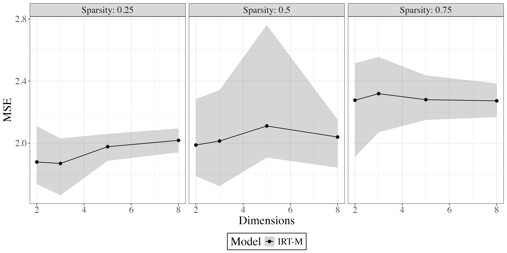
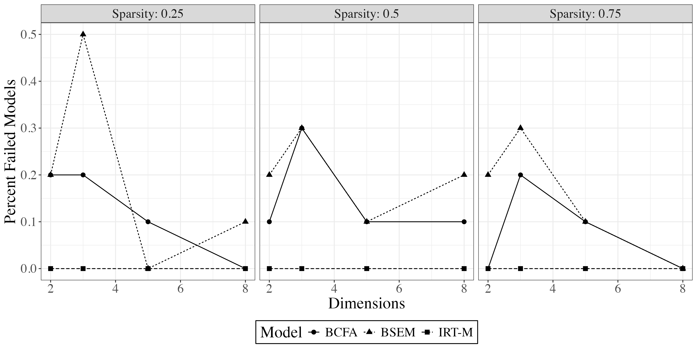
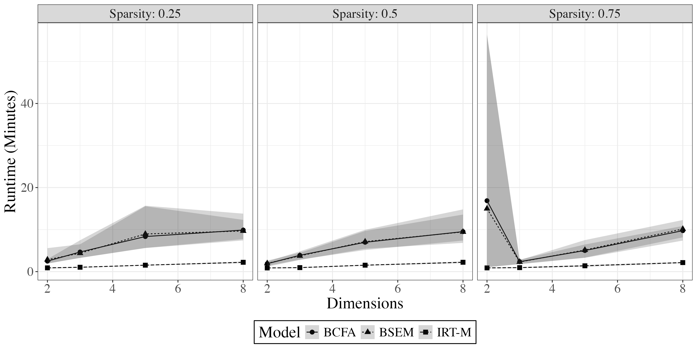

## Introduction

This repository hosts R code to compare the IRT-M dimensionality reduction algorithm with the closest similar algorithm, Bayesian Confirmatory Factor Analysis (BCFA) and Bayesian Structural Topic Modeling (BSEM).

There are a number of helper scripts, to facilitate simulating data for us in BCFA and BSEM models.

As of late November 2024, the simulation design has three components:

1) Broad survey of IRT-M vs BCFA and BSEM, for 10 runs across a wide range of parameter specifications.

Results TBD.
   
2) In-depth analysis of IRT-M vs BCFA and BSEM for a range of models with a baseline specification in which BCFA and BSEM tend to perform well.
These models compare each algorithm on simulated datasets with N = 100 units, K = 10 features, high loading sparsity (.75% of possible loadings zeroed out), and 2, 4, 6, and 8 underlying dimensions. It does 50 iterations for each combination of parameters.

3) Analysis of how each algorithm performs with more or less sparse models.
These models run for 10 iterations of specifications with N = 100 units, K = 10 features, with 25%, 50%, 75% of loadings zeroed out, and with 2, 4, 6, or 8 underlying dimensions.

In general, IRT-M:

- Has a lower error rate

- Has lower failure rates

- Runs faster

