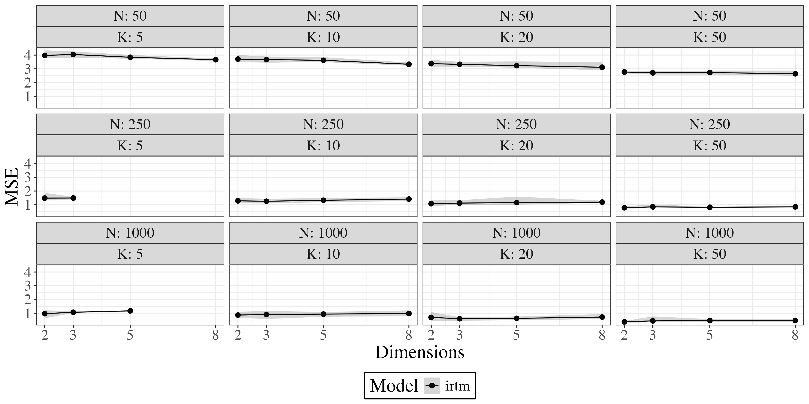
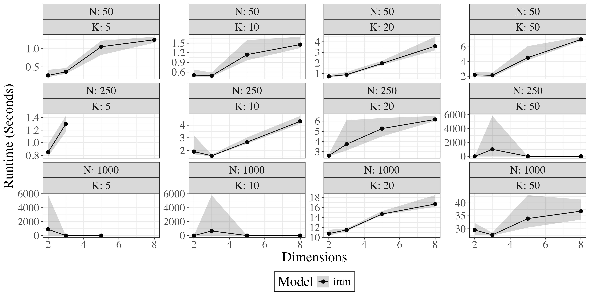

## Introduction

This repository hosts R code to benchmark the performance of the IRT-M dimensionality reduction algorithm. For runtime considerations, the code in this repository only presents the performance of IRT-M across a wide range of specifications. Comparisons to the closest alternative models, Bayesian Confirmatory Factor Analysis and Bayesian Structural Equation Modeling, can be seen in a companion repository, https://github.com/margaretfoster/irtm_bcfa_comp

To replicate our analysis, run: `Master_Rep_IRTM_JSS.R` which calls the simulation and visualization scripts located in the `code/` subdirectory. Simulation results are all stored in `simulations/`

The simulation design has three components:

1) Broad survey of IRT-M  across a wide range of parameter specifications.
   
2) In-depth analysis of IRT-M on simulated datasets with N = 100 units, K = 10 features, high loading sparsity (.75% of possible loadings zeroed out), and 2, 4, 6, and 8 underlying dimensions. It does 50 iterations for each combination of parameters.

3) Analysis of how the algorithm performs with more or less sparse models.
These models run for 10 iterations of specifications with N = 100 units, K = 10 features, with 25%, 50%, 75% of loadings zeroed out, and with 2, 4, 6, or 8 underlying dimensions.

4) Demonstration of use for IRT-M on a simulated survey dataset.

In general, IRT-M:

- Has a low error rate

- Runs quickly

